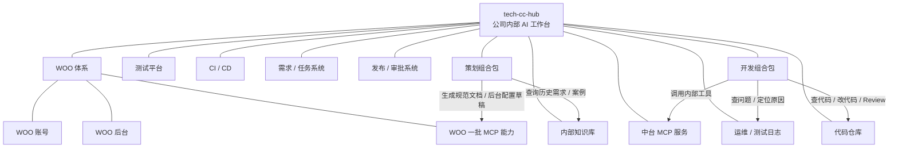
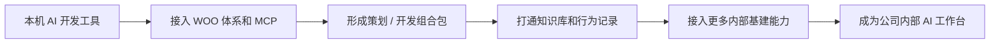

# tech-cc-hub 后续发展规划

## 总体定位

tech-cc-hub 后续不只是个人 AI 开发客户端，而是要作为公司内部 AI 工作台和研发支撑基建。

它要把公司内部的账号体系、知识库、后台服务、中台能力、日志系统、测试平台和 AI Agent 能力统一接起来，让策划、开发、测试、运维都能在一个入口里完成日常工作。

核心目标不是做一个聊天工具，而是做一个能真正连接公司内部系统、沉淀项目知识、辅助交付业务需求的 AI 基建工具。

## 整体关系图

这张图表达的是：tech-cc-hub 放在中间，周围连接 WOO 后台、WOO MCP、内部知识库、中台 MCP、日志、测试、代码仓库、CI/CD、任务和发布审批等公司内部基建能力。用户侧主要先提供策划组合包和开发组合包，通过组合包把这些内部能力串起来。

## 演进路线

整体演进不是先做一个大而全的平台，而是围绕“能接入、能记录、能复用、能沉淀”逐步增强。

### 1. 从本机工具到公司入口

先保留 tech-cc-hub 当前的本机 AI 开发体验，在此基础上接入 WOO 账号和 WOO 的一批 MCP 能力，让 Agent 可以开始调用公司内部服务。

### 2. 从单点能力到组合包

把常用能力整理成策划组合包和开发组合包。策划侧重点是规范文档、历史案例、后台配置草稿；开发侧重点是需求理解、代码辅助、知识库检索、日志排查和 Review。

### 3. 从能调用到能管控

Agent 调用 WOO MCP、知识库、日志、代码仓库等能力时，需要记录谁发起、调用了什么、产出了什么、是否成功。先做基础行为记录，后续再基于记录扩展权限、审计和统计。

### 4. 从完成任务到沉淀知识

AI 在写文档、改代码、查问题的过程中，要把有效经验沉淀到内部知识库。这样后续换人接手、跨项目复用、类似问题排查时，不需要重新从零开始。

### 5. 从组内工具到内部基建

当 WOO MCP、知识库、中台 MCP、日志、测试平台、代码仓库等能力逐步接入后，tech-cc-hub 就不只是组内 AI 工具，而是公司内部 AI 工作台，统一承接策划和开发的日常工作流。

## 要实现的能力

### 1. WOO 体系接入

tech-cc-hub 后续要接入 WOO 体系，不只是登录账号，而是把 WOO 相关的一批 MCP 能力接进来，作为公司内部服务的统一入口。

需要实现：

- 接入 WOO 账号，让 Agent 操作能绑定到具体用户。
- 接入 WOO 后台相关 MCP，让 Agent 可以查询和辅助处理后台配置。
- 接入 WOO 内部服务相关 MCP，让 Agent 可以调用公司已有的业务能力。
- 根据不同 MCP 的能力范围，给策划和开发提供不同的操作入口。
- 对涉及后台修改、敏感数据、线上环境的操作保留确认和记录。
- Agent 每次调用 WOO MCP 时，都要记录调用人、调用内容、目标服务和执行结果。

这部分能力的重点不是只做一个账号登录，而是把 WOO 下面已有和后续新增的一批 MCP 能力接入 tech-cc-hub，让 Agent 能真正操作公司内部服务，同时保留必要的行为记录和管控。

### 2. Agent 行为记录和管控

tech-cc-hub 先不做复杂的数据分析平台，重点先把 Agent 的行为记录下来，满足基础管控需要。

需要记录：

- 谁发起了任务。
- 发起任务的时间。
- 用户输入了什么需求。
- Agent 调用了哪些 MCP、内部接口、文件、仓库和知识库。
- Agent 生成了哪些文档、配置、代码或分析结果。
- 每一步操作是否成功，失败原因是什么。
- 是否涉及后台配置、线上日志、敏感数据等需要重点关注的内容。

这些记录主要用于：

- 出问题时可以回看 Agent 做过什么。
- 需要追责时能知道是谁发起的操作。
- 管理侧能看到 AI 工具在项目组里的使用情况。
- 后续如果要做权限、审计、数据统计，可以基于这些行为记录继续扩展。

### 3. WOO MCP 后台能力打通

tech-cc-hub 需要接入 WOO MCP，让 Agent 能够直接理解和调用 WOO 后台能力。

需要实现：

- 查询 WOO 后台已有配置。
- 查询业务模块、字段、枚举、规则、活动、开关、表单等信息。
- 根据策划需求生成后台配置草稿。
- 根据已有活动或历史配置生成类似配置。
- 对生成的配置做完整性检查，提示缺字段、缺规则、冲突配置和风险点。
- 在权限允许的情况下，把配置草稿提交到 WOO 后台。
- 保留配置生成过程，方便策划、开发和测试复盘。

这部分能力要解决的是后台重复配置和信息割裂问题。策划可以通过自然语言描述需求，Agent 结合 WOO MCP、历史配置和内部知识库，生成可审核的后台配置草稿。开发也可以通过 Agent 快速理解某个配置背后的代码逻辑、字段含义和历史变更。

### 4. 策划规范文档生成

tech-cc-hub 需要内置面向策划的文档生成能力，让策划可以在本机直接生成规范文档。

需要实现：

- 根据策划的自然语言描述生成标准需求文档。
- 根据历史需求、活动案例、后台配置生成类似文档。
- 自动补齐背景、目标、功能规则、字段说明、边界条件、异常情况、验收标准。
- 将文档格式统一成公司内部规范。
- 支持继续追问、补充、改写和版本迭代。
- 支持保存到项目文档目录或内部知识库。
- 支持从文档中提取后台配置点、开发任务点和测试验收点。

这部分能力的重点不是简单写文案，而是把策划输入整理成开发能理解、测试能验收、后台能配置的规范材料。

### 5. 后台配置和代码辅助生成

在接入 WOO MCP、内部知识库和代码仓库后，tech-cc-hub 需要辅助生成后台配置和部分代码改动建议。

需要实现：

- 从策划文档中识别哪些内容需要后台配置。
- 判断哪些内容可以通过 WOO 动态配置完成，哪些需要开发修改代码。
- 自动生成字段、枚举、活动规则、条件、开关、表单、权限等配置草稿。
- 对配置草稿做校验，识别冲突、缺失和不合理项。
- 对需要代码开发的内容，生成接口设计、数据结构、伪代码或代码修改建议。
- 结合项目代码库定位可能要改的文件和模块。
- 生成开发任务拆解和测试建议。

这部分能力的目标是让大量标准化后台工作先由 AI 生成草稿，再由人审核确认，减少重复劳动和沟通成本。

### 6. 内部知识库接入

tech-cc-hub 需要接入公司内部知识库，让 Agent 在工作时能直接检索项目资料和历史经验。

需要实现：

- 检索项目文档、接口文档、历史需求、测试记录、故障记录、操作手册。
- 根据当前任务自动查找相关知识。
- 将知识库内容注入 Agent 上下文，减少重复问人。
- 支持按项目、模块、系统、角色筛选知识范围。
- 支持把 Agent 的分析结果、踩坑记录、解决方案沉淀回知识库。
- 写入知识库前支持人工确认，避免错误内容污染知识库。

这部分能力要解决的是项目经验分散的问题。AI 写代码、改需求、查问题的时候，不只是完成当前任务，还要把过程中的有效知识沉淀下来。换人接手时，可以直接读取知识库和任务上下文，快速继续工作。

### 7. 中台 MCP 服务接入和创建

tech-cc-hub 需要接入中台 MCP 服务，帮助项目组快速创建、注册和使用 MCP。

需要实现：

- 展示公司已有 MCP 服务列表。
- 展示每个 MCP 的工具、参数、权限、状态和使用说明。
- 根据项目需求生成 MCP 工具定义和接口说明。
- 辅助项目组完成 MCP 创建、注册、配置、测试和上线。
- 支持在 tech-cc-hub 中直接调用和验证 MCP 工具。
- 支持把多个 MCP 组合到角色包或项目包里。

这部分能力的目标是降低 MCP 接入门槛。项目组不需要从零理解 MCP 规范，只要描述想接入什么内部服务，tech-cc-hub 就能辅助生成工具定义、配置说明和测试流程，把内部能力变成 Agent 可调用工具。

### 8. 组内 AI 开发工作流

tech-cc-hub 需要内置一套适合组内的 AI 开发工作流，把需求到交付的过程标准化。

需要实现：

- 需求理解：读取需求文档、知识库和历史实现，整理任务范围。
- 方案设计：输出改动点、影响范围、风险点和验收标准。
- 代码实现：根据项目规范修改代码。
- 自测验证：运行构建、单测、关键脚本和必要的客户端真窗口验证。
- Code Review：检查代码质量、安全风险、回归风险和规范问题。
- 提交总结：生成中文提交信息、变更说明、测试结果和风险说明。
- 知识沉淀：把关键决策、坑点、复用经验写回知识库。

这套流程要内置在产品里，而不是靠每个人手动写 prompt。用户选择一个开发工作流后，Agent 自动按步骤推进，并把每一步结果展示出来。

### 9. 运维和测试日志查询

tech-cc-hub 需要集成运维、测试相关日志和数据查询能力，帮助开发快速定位问题。

需要实现：

- 查询测试、预发、线上环境日志。
- 按用户 ID、角色 ID、时间范围、接口、错误码、链路 ID 查询问题。
- 汇总接口请求、返回结果、错误堆栈、关键参数和异常时间线。
- 结合代码仓库和知识库分析可能原因。
- 给出排查路径、修复建议和需要补充验证的信息。
- 将典型问题、解决方案和排查过程沉淀到知识库。

这部分能力要把“查日志、找链路、翻代码、问上下游”的过程集中到一个 AI 辅助入口里，减少开发定位问题的时间。

### 10. 角色组合包

tech-cc-hub 需要提供面向不同角色的组合包，把 Agent、MCP、知识库、工作流和快捷入口打包好。

需要实现：

- 策划组合包：需求文档生成、历史案例检索、WOO 配置查询、后台配置草稿生成。
- 开发组合包：需求理解、代码生成、接口查询、知识库检索、日志排查、Review、自测。

组合包的意义是让用户不用手动配置一堆工具。进入某个项目或某个角色后，系统直接给出最适合的能力集合。

### 11. 快捷方式能力

tech-cc-hub 需要把常用工作流做成快捷方式，让用户一键启动。

可以提供：

- 生成策划文档。
- 生成后台配置草稿。
- 分析需求影响范围。
- 生成开发任务拆解。
- 排查测试环境报错。
- 查询线上日志。
- 创建项目 MCP。
- Review 当前改动。
- 总结本次开发并更新知识库。
- 生成提交说明和变更说明。

快捷方式背后不是单个 prompt，而是一套固定工作流：需要哪些上下文、调用哪些 MCP、输出什么格式、是否需要人工确认、结果写到哪里，都应该预先定义好。

### 12. 内部服务统一入口

tech-cc-hub 需要逐步整合公司内部常用自建服务，成为一个统一入口。

需要接入：

- WOO 账号和权限系统。
- WOO 后台和动态配置系统。
- 内部知识库。
- 中台 MCP 服务。
- 运维日志平台。
- 测试平台。
- 需求和任务系统。
- 代码仓库。
- CI/CD。
- 发布和审批系统。

接入后的目标是：用户不需要在多个系统之间来回切换，AI 根据任务自动检索、调用、汇总、生成和校验。

### 13. 执行可观测和任务回放

tech-cc-hub 需要保留当前执行可观测的产品方向，把内部系统调用也纳入可观测范围。

需要实现：

- 展示 Agent 当前正在做什么。
- 展示调用了哪些 MCP 和内部服务。
- 展示每一步输入、输出、耗时和状态。
- 失败时展示失败原因和重试建议。
- 对高风险操作提供确认、审批或回滚入口。
- 支持事后回放完整任务执行过程。
- 支持把一次任务过程生成分析报告。

这部分能力能保证 tech-cc-hub 不是一个不可控的 AI 黑盒，而是一个可以看过程、查原因、可复盘的工作台。

## 最终效果

tech-cc-hub 最终要成为公司内部 AI 工作台。

策划可以用它生成规范需求文档、查询历史案例、生成后台配置草稿。

开发可以用它理解需求、生成代码、查询知识库、接入 MCP、排查日志、完成 Review 和自测。

测试可以用它提取验收点、生成测试用例、分析问题复现路径。

运维可以用它查询日志、分析告警、定位链路问题。

项目组可以通过组合包快速接入公司内部能力，把一套 AI 工作流复用到不同项目中。

整体目标是把 AI、内部系统、知识库和研发流程连接起来，形成公司内部可复用、可管控、可持续积累的 AI 基建能力。
