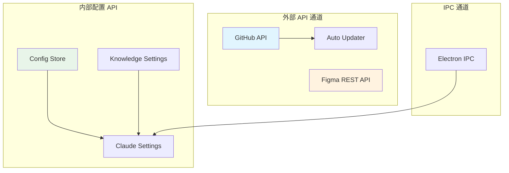
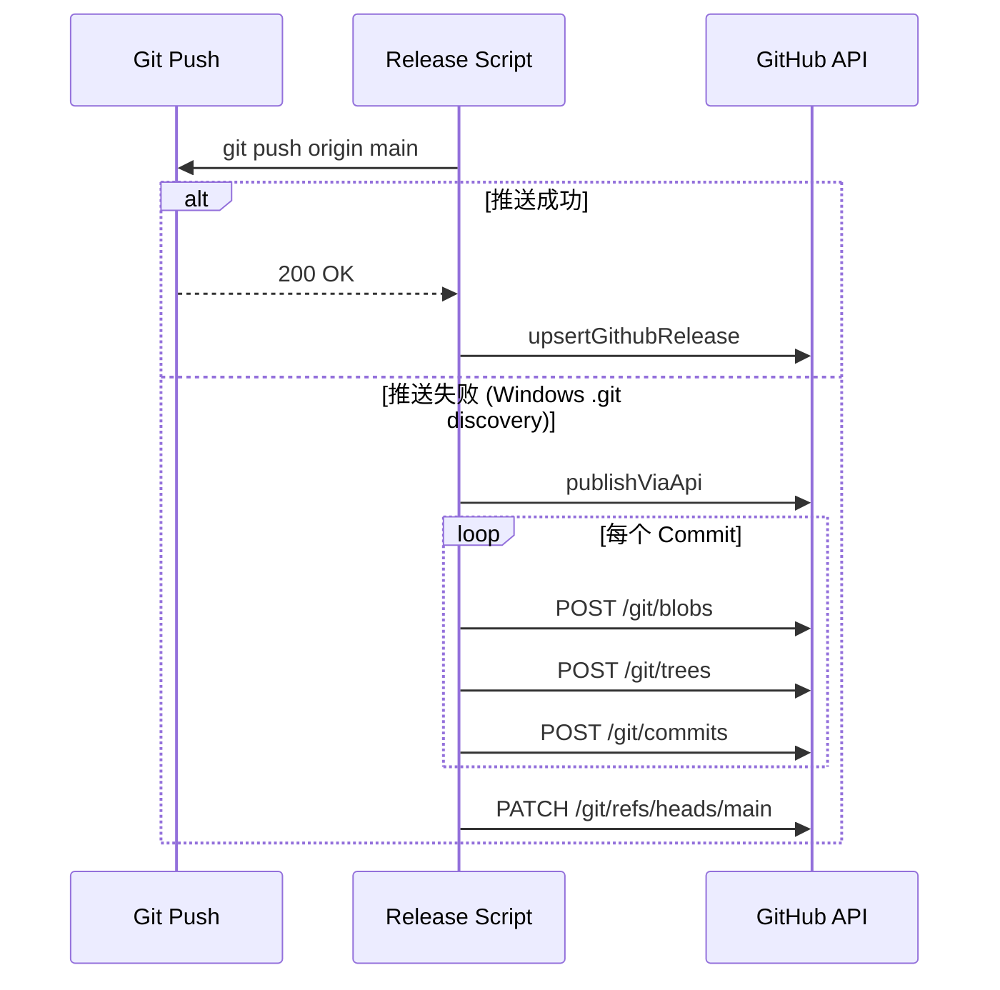

# API 与实时通道规范

<cite>
**本文引用的文件**
- [skills/tech-cc-hub-release-deploy/scripts/publish-release.mjs](file://skills/tech-cc-hub-release-deploy/scripts/publish-release.mjs)
- [scripts/github-release.mjs](file://scripts/github-release.mjs)
- [doc/20-specs/27-API与实时通道规范.md](file://doc/20-specs/27-API与实时通道规范.md)
- [src/electron/libs/auto-updater.ts](file://src/electron/libs/auto-updater.ts)
- [src/electron/libs/claude-settings.ts](file://src/electron/libs/claude-settings.ts)
- [src/electron/libs/config-store.ts](file://src/electron/libs/config-store.ts)
- [src/electron/libs/knowledge/knowledge-model-settings.ts](file://src/electron/libs/knowledge/knowledge-model-settings.ts)
- [src/electron/libs/knowledge/repowiki/builder.ts](file://src/electron/libs/knowledge/repowiki/builder.ts)
- [src/electron/libs/mcp-tools/figma-rest.ts](file://src/electron/libs/mcp-tools/figma-rest.ts)
</cite>

# API 与实时通道规范

## 目录

- [概述](#概述)
- [API 通道分类](#api-通道分类)
- [GitHub API 集成](#github-api-集成)
- [配置存储 API](#配置存储-api)
- [Figma REST API 通道](#figma-rest-api-通道)
- [实时状态通道](#实时状态通道)
- [错误处理与失败模式](#错误处理与失败模式)
- [扩展点](#扩展点)

---

## 概述

本文档定义 tech-cc-hub 中 GUI 与 Backend Runtime 之间的 API 和实时事件通道边界。系统涉及三类核心通信模式：

1. **Command API**：改变状态的写命令接口
2. **Query API**：读取状态和产物的查询接口
3. **Realtime Channel**：推送实时事件、状态变化和长任务进度

当前实现中，API 通道主要用于外部服务集成（GitHub API、Figma API）和本地配置管理，实时通道尚未完全实现。`doc/20-specs/27-API与实时通道规范.md` 第 21-28 行定义了基础框架，后续章节将基于此框架细化各通道实现。

---

## API 通道分类

### 通道分组结构



根据 `doc/20-specs/27-API与实时通道规范.md` 第 40-46 行建议的接口分组，当前实现的映射关系如下：

| 建议接口组 | 当前实现文件 | 状态 |
|-----------|-------------|------|
| Session API | 待实现 | 规划中 |
| Task Graph API | 待实现 | 规划中 |
| SpecAsset API | 待实现 | 规划中 |
| Replay/Analysis API | 待实现 | 规划中 |
| Config API | `config-store.ts` | ✅ 已实现 |
| Update API | `auto-updater.ts` | ✅ 已实现 |
| External Integration | `figma-rest.ts`, `publish-release.mjs` | ✅ 已实现 |

---

## GitHub API 集成

### 集成范围

系统通过两个脚本实现 GitHub API 集成：

1. **`scripts/github-release.mjs`**：版本发布脚本，处理 Git tag、commit、release notes
2. **`skills/tech-cc-hub-release-deploy/scripts/publish-release.mjs`**：发布部署脚本，支持 API 回退模式

### API 请求规范

所有 GitHub API 请求遵循统一规范：

```javascript
// 来源：scripts/github-release.mjs 第 254-287 行
async function githubApiRequest(method, endpoint, token, payload) {
  const response = await fetch(`${GITHUB_API_BASE}${endpoint}`, {
    method,
    headers: {
      "Accept": "application/vnd.github+json",
      "Authorization": `token ${token}`,
      "User-Agent": "tech-cc-hub-release-script",
      "X-GitHub-Api-Version": "2022-11-28",
      ...(payload ? { "Content-Type": "application/json; charset=utf-8" } : {}),
    },
    body,
  });
  // ...
}
```

关键 HTTP 头规范：

| 头字段 | 值 | 来源行 |
|--------|-----|--------|
| Accept | `application/vnd.github+json` | github-release.mjs#L259 |
| Authorization | `token ${token}` | github-release.mjs#L260 |
| User-Agent | `tech-cc-hub-release-script` | github-release.mjs#L261 |
| X-GitHub-Api-Version | `2022-11-28` | github-release.mjs#L262 |

### Token 获取优先级

GitHub Token 获取遵循以下优先级：

```
环境变量 GH_TOKEN > 环境变量 GITHUB_TOKEN > Git Credential Manager
```

实现位置：`scripts/github-release.mjs` 第 235-252 行，`publish-release.mjs` 第 75-85 行。

### 发布流程与 API 回退



当 `git push` 失败时（如 Windows 环境下的 .git 发现问题），`publish-release.mjs` 第 364-385 行会触发 API 回退模式，逐 commit 通过 Git Data API 重建分支历史。

### Release Notes 生成

```javascript
// 来源：scripts/github-release.mjs 第 319-346 行
function createReleaseBody({ tag, commits, files }) {
  const template = getReleaseNoteTemplate();
  return template
    .replaceAll("{{title}}", title)
    .replaceAll("{{commits}}", listify(commits, "无新增提交"))
    .replaceAll("{{files}}", listify(files, "无文件变更"))
    .replaceAll("{{generated_at}}", createdTime);
}
```

变更提交通过 `git log --no-merges` 获取，变更文件通过 `git diff --name-only` 获取。章节来源：github-release.mjs 第 302-316 行。

---

## 配置存储 API

### 配置文件结构

配置存储在 `app.getPath("userData")` 下，包含两个核心配置文件：

| 文件 | 用途 | 来源 |
|------|------|------|
| `api-config.json` | API 配置（多 Profile） | config-store.ts#L58 |
| `agent-runtime.json` | 全局运行时配置 | config-store.ts#L59 |

### ApiConfig 数据结构

```typescript
// 来源：src/electron/libs/config-store.ts 第 21-42 行
export type ApiConfig = {
  id: string;
  name: string;
  apiKey: string;
  baseURL: string;
  model: string;
  expertModel?: string;
  smallModel?: string;
  imageModel?: string;
  analysisModel?: string;
  embeddingModel?: string;
  embeddingDimension?: number;
  embeddingBatchSize?: number;
  wikiModel?: string;
  wikiModelCostTier?: "free" | "cheap" | "standard";
  models?: ApiModelConfig[];
  enabled: boolean;
  provider?: "custom" | "deepseek" | "codex";
};
```

### Provider 自动推断

`config-store.ts` 第 254-267 行实现了 Provider 自动推断逻辑：

```typescript
function normalizeProvider(value: unknown, baseURL: string): ApiProviderMode {
  if (value === "custom" || value === "deepseek" || value === "codex") {
    return value;
  }
  const hostname = new URL(baseURL.trim()).hostname;
  if (hostname === "api.deepseek.com") return "deepseek";
  if (hostname === "chatgpt.com") return "codex";
  return "custom";
}
```

这意味着用户只需设置 `baseURL`，系统会自动识别 DeepSeek 和 Codex (ChatGPT) 端点。

### 配置加载与保存

```typescript
// 来源：config-store.ts 第 100-113 行
export function loadApiConfigSettings(): ApiConfigSettings {
  try {
    const configPath = getConfigPath();
    if (!existsSync(configPath)) {
      return createDefaultSettings();
    }
    const raw = readFileSync(configPath, "utf8");
    const parsed = JSON.parse(raw);
    return normalizeApiSettings(parsed);
  } catch (error) {
    console.error("[config-store] Failed to load API config:", error);
    return createDefaultSettings();
  }
}
```

### 全局运行时配置

`loadGlobalRuntimeConfig()` 用于加载全局运行时环境变量配置，支持非 `ANTHROPIC_` 前缀的环境变量注入到 Claude Code 进程中。章节来源：claude-settings.ts 第 394-418 行。

---

## Figma REST API 通道

### MCP 工具架构

Figma REST API 通过 MCP (Model Context Protocol) 工具暴露，入口文件 `figma-rest.ts` 第 36 行导出工具名称常量：

```typescript
export { FIGMA_REST_TOOL_NAMES };
```

### Token 配置

Figma PAT (Personal Access Token) 从全局配置读取：

```typescript
// 来源：figma-rest.ts 第 119-130 行
function getConfiguredFigmaPat(): string {
  const config = loadGlobalRuntimeConfig();
  const plugins = isRecord(config.plugins) ? config.plugins : {};
  const plugin = isRecord(plugins[FIGMA_OFFICIAL_PLUGIN_ID]) ? plugins[FIGMA_OFFICIAL_PLUGIN_ID] : null;
  const oauth = isRecord(plugin?.oauth) ? plugin.oauth : null;
  const token = typeof oauth?.access_token === "string" ? oauth.access_token.trim() : "";
  if (!token) {
    throw new Error("Figma token is not configured...");
  }
  return token;
}
```

### API 请求封装

```typescript
// 来源：figma-rest.ts 第 139-164 行
async function figmaApiGet(
  pathname: string,
  query: Record<string, string | number | boolean | undefined>,
  token: string
): Promise<unknown> {
  const url = new URL(`${FIGMA_REST_API_URL}/${pathname.replace(/^\/+/, "")}`);
  for (const [key, value] of Object.entries(query)) {
    if (value !== undefined && value !== "") {
      url.searchParams.set(key, String(value));
    }
  }
  const response = await fetch(url, {
    method: "GET",
    headers: {
      Accept: "application/json",
      "X-Figma-Token": token,
    },
  });
  // ...
}
```

### 响应截断策略

为防止大文件响应导致内存溢出，系统实现了分层截断策略：

1. **默认限制**：160KB (`DEFAULT_MAX_BYTES`)
2. **硬上限**：500KB (`MAX_RESPONSE_BYTES`)
3. **渐进披露**：截断时返回节点索引，引导用户使用 `figma_summarize_design` 深入特定分支

章节来源：figma-rest.ts 第 40-41 行定义常量，第 199-243 行实现截断逻辑。

---

## 实时状态通道

### 自动更新状态机

`auto-updater.ts` 实现了完整的更新状态机：

```typescript
// 来源：src/electron/libs/auto-updater.ts 第 21-30 行
export type AppUpdateState =
  | "idle"
  | "disabled"
  | "checking"
  | "available"
  | "not-available"
  | "downloading"
  | "downloaded"
  | "unsupported"
  | "error";
```

### 状态转换图

```mermaid
stateDiagram-v2
    [*] --> idle
    idle --> checking: checkForUpdates()
    checking --> available: update-available
    checking --> not-available: update-not-available
    checking --> error: API Error
    checking --> disabled: !app.isPackaged
    available --> downloading: downloadUpdate()
    downloading --> downloaded: update-downloaded
    downloaded --> [*]: quitAndInstall()
    error --> [*]
    disabled --> [*]
```

### 禁用条件

```typescript
// 来源：auto-updater.ts 第 90-96 行
function isAutoUpdateDisabled(): boolean {
  return process.env.TECH_CC_HUB_DISABLE_AUTO_UPDATE === "1" ||
    process.env.AGENT_COWORK_DISABLE_AUTO_UPDATE === "1" ||
    process.env.CI === "true" ||
    process.env.GITHUB_ACTIONS === "true";
}
```

### 状态监听

```typescript
// 来源：auto-updater.ts 第 164-170 行
onStatus(listener: AppUpdateStatusListener): () => void {
  this.listeners.add(listener);
  listener(this.status);
  return () => {
    this.listeners.delete(listener);
  };
}
```

---

## 错误处理与失败模式

### API 错误处理模式

| 错误类型 | 处理策略 | 来源文件 |
|---------|---------|---------|
| Token 缺失 | 静默跳过，记录日志 | github-release.mjs#L349-353 |
| 404 Not Found | 特殊标记为 `__notFound: true` | publish-release.mjs#L111-113 |
| 非线性 Commit 历史 | 终止并报错 | publish-release.mjs#L277-283 |
| Tree SHA 不匹配 | 终止并报错 | publish-release.mjs#L187-191 |
| Figma Token 未配置 | 抛出明确错误信息 | figma-rest.ts#L126-128 |

### Figma API 错误解析

```typescript
// 来源：figma-rest.ts 第 177-184 行
function getFigmaApiErrorMessage(body: unknown, fallback: string): string {
  if (isRecord(body)) {
    if (typeof body.err === "string") return body.err;
    if (typeof body.message === "string") return body.message;
    if (typeof body.status === "string") return body.status;
  }
  return fallback.trim() || "请求失败";
}
```

### 跨平台更新失败回退

当主更新路径失败时，系统尝试从 Release 列表中寻找兼容版本：

```typescript
// 来源：auto-updater.ts 第 298-342 行
private async checkReleaseFallback(originalError: string): Promise<AppUpdateStatus | null> {
  const releases = await this.fetchRecentReleases();
  const fallback = selectBestReleaseForUpdate(releases, currentVersion, process.platform, process.arch);
  // 返回详细错误信息，包含版本信息和手动下载链接
}
```

### 常见失败排查

| 症状 | 可能原因 | 解决方案 |
|------|---------|---------|
| `Missing GitHub token` | 未设置 GH_TOKEN | 设置环境变量或登录 Git Credential Manager |
| `origin/main is not an ancestor of HEAD` | 本地分支落后于远程 | 先 fetch/rebase 再发布 |
| `Figma token is not configured` | 未配置 Figma PAT | 在 Settings > Plugins 添加 Token |
| `API fallback only supports linear commit range` | Merge commit 导致非线性历史 | Rebase 或 Squash 后重试 |

---

## 扩展点

### 知识模型扩展

`knowledge-model-settings.ts` 提供了知识引擎的配置扩展点：

```typescript
// 来源：knowledge-model-settings.ts 第 49-83 行
export function resolveKnowledgeModelSettings(): KnowledgeModelSettings {
  const profiles = loadApiConfigSettings().profiles.filter(isUsableProfile);
  const embeddingProfile = profiles.find((profile) => profile.embeddingModel?.trim());
  const wikiProfile = profiles.find((profile) => profile.wikiModel?.trim());
  // ...
}
```

### RepoWiki 构建扩展

`builder.ts` 实现了可扩展的 Wiki 页面构建系统：

```typescript
// 来源：builder.ts 第 14-85 行
export class RepoWikiBuilder {
  build(project: RepoWikiProjectContext, data: WikiData, graph: RepoWikiDependencyGraph): RepoWiki {
    const pages: WikiPage[] = [];
    // 按需添加页面：overview, agent-playbook, architecture, runtime-flows, api-surface, modules
    return { pages, sidebar, projectName };
  }
}
```

### API Profile 扩展

系统支持多 API Profile 配置，可在不重启应用的情况下切换配置。当前实现支持：

- Anthropic API (`provider: "custom"`)
- DeepSeek API (`provider: "deepseek"`)
- Codex OAuth (`provider: "codex"`)

未来可通过扩展 `ApiProviderMode` 类型添加新 Provider。

---

## 章节来源

| 章节 | 主要来源 | 行号 |
|------|---------|------|
| GitHub API 集成 | github-release.mjs, publish-release.mjs | L254-287, L87-122 |
| 配置存储 API | config-store.ts | L21-42, L100-113 |
| Figma REST API | figma-rest.ts | L119-130, L139-164 |
| 实时状态通道 | auto-updater.ts | L21-30, L164-170 |
| 错误处理 | 各文件错误处理函数 | - |
| 扩展点 | builder.ts, knowledge-model-settings.ts | L14-85, L49-83 |

---

*本文档基于 tech-cc-hub v1.0.0 实现状态编写，部分通道（如 Session API、Task Graph API）仍在规划中。实时通道完整实现后需更新本规范。*