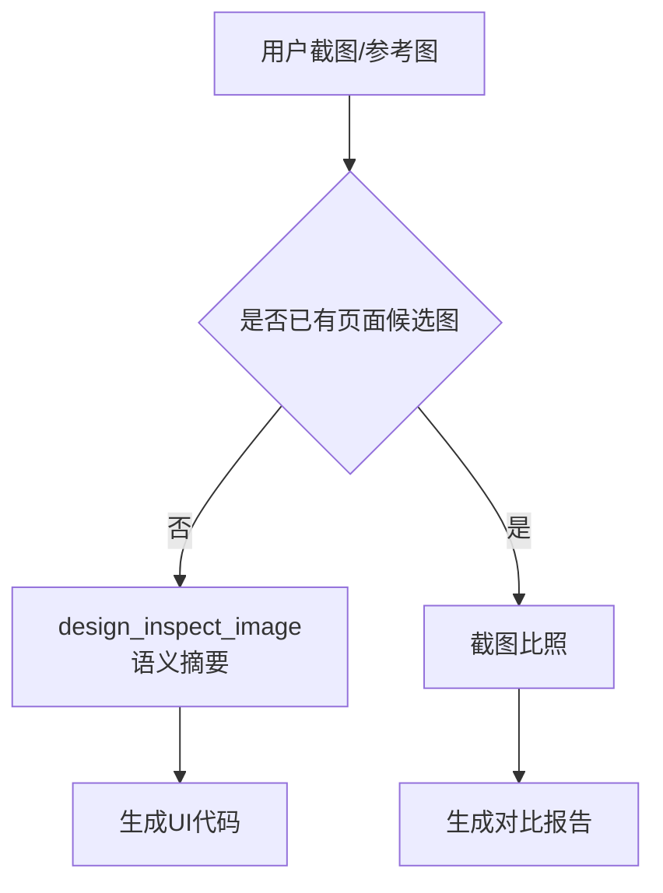
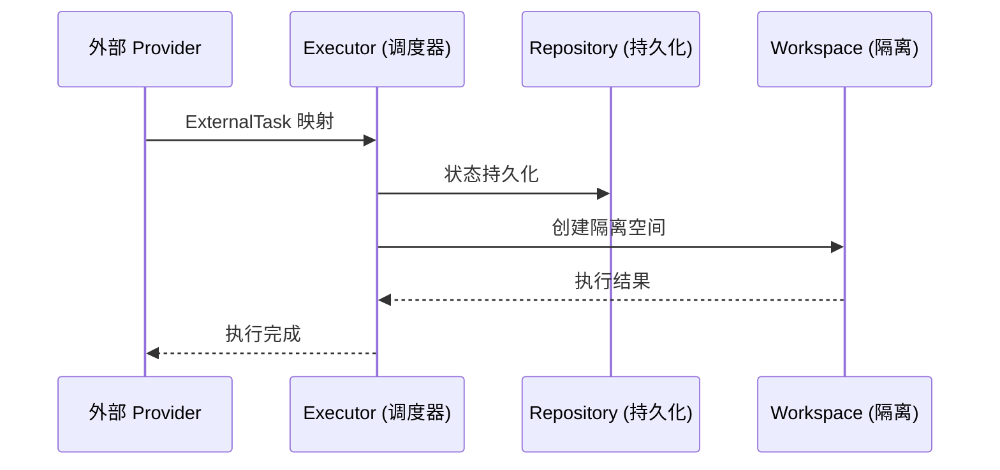
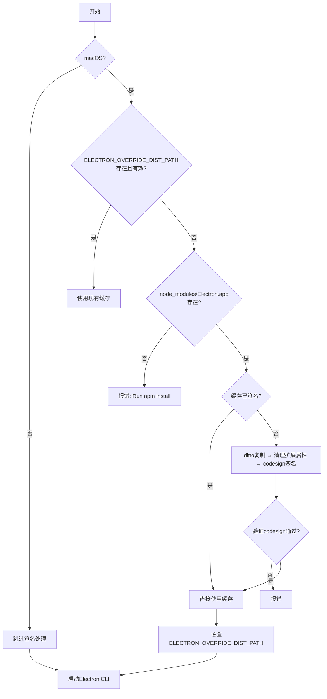
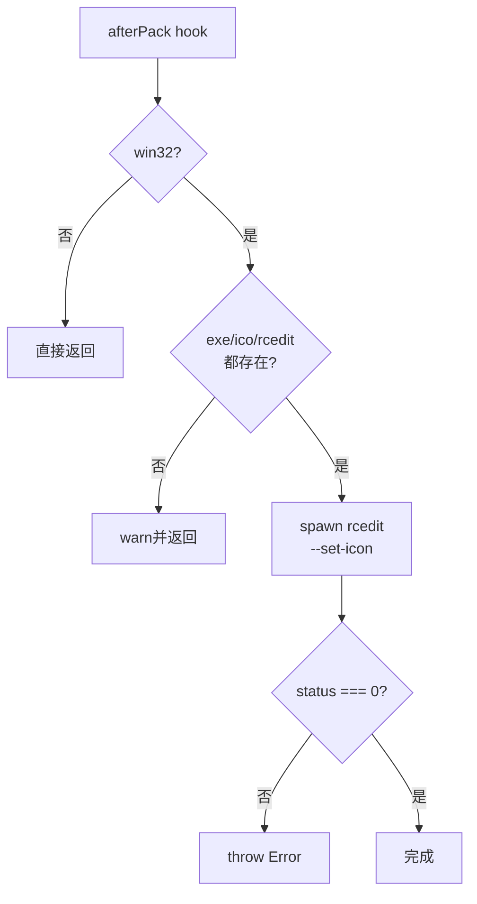
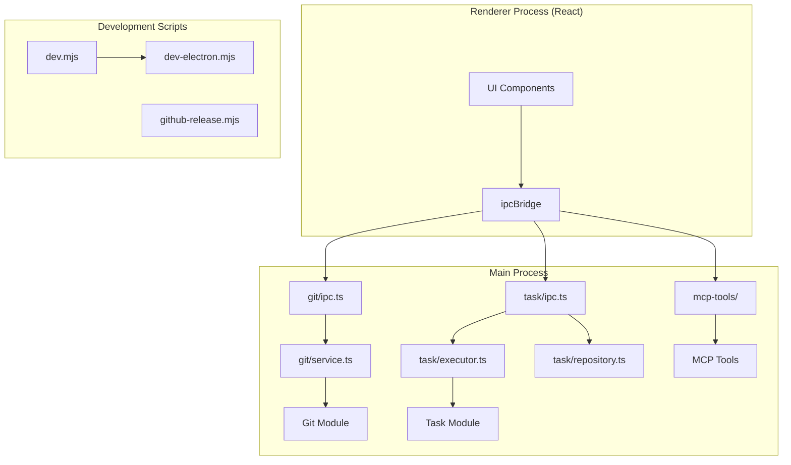

# API参考文档

<cite>
**本文引用的文件**
- [src/electron/libs/git/README.md](file://src/electron/libs/git/README.md)
- [src/electron/libs/mcp-tools/README.md](file://src/electron/libs/mcp-tools/README.md)
- [src/electron/libs/task/README.md](file://src/electron/libs/task/README.md)
- [src/common/index.ts](file://src/common/index.ts)
- [scripts/after-pack-win-icon.cjs](file://scripts/after-pack-win-icon.cjs)
- [scripts/codex-oauth-setup.mjs](file://scripts/codex-oauth-setup.mjs)
- [scripts/dev-electron.mjs](file://scripts/dev-electron.mjs)
- [scripts/dev.mjs](file://scripts/dev.mjs)
- [scripts/github-release.mjs](file://scripts/github-release.mjs)
</cite>

# API 参考文档

本文档面向开发者和 Agent 调用者，提供 `tech-cc-hub` 的入口、参数、返回值和调用链参考。

---

## 目录

- [1. IPC 入口层](#1-ipc-入口层)
- [2. Git 工作台模块](#2-git-工作台模块)
- [3. MCP 工具集](#3-mcp-工具集)
- [4. Task 任务系统](#4-task-任务系统)
- [5. 开发脚本 API](#5-开发脚本-api)
- [6. 发布与打包脚本](#6-发布与打包脚本)
- [7. 调用链路总览](#7-调用链路总览)
- [8. 失败模式与排障](#8-失败模式与排障)

---

## 1. IPC 入口层

### 1.1 桥接模块导出

**文件**: `src/common/index.ts`

```typescript
export { ipcBridge } from './adapter/ipcBridge';
export type { IBridgeResponse, IDirOrFile, IFileMetadata, IWorkspaceFlatFile } from './adapter/ipcBridge';
```

**职责说明**: 
- `ipcBridge` 是渲染进程（Renderer）与主进程（Main Process）通信的唯一入口
- Renderer 禁止直接执行 Git、Task 等系统级操作，必须通过 IPC 调用主进程模块

**章节来源**: [src/common/index.ts#L1-L2](file://src/common/index.ts#L1-L2)

---

### 1.2 IPC 通信约定

| 类型 | 说明 |
|------|------|
| `IBridgeResponse` | 标准响应结构，包含 `success`、`data`、`error` 字段 |
| `IDirOrFile` | 文件/目录元数据结构 |
| `IFileMetadata` | 文件属性（大小、修改时间、权限等） |
| `IWorkspaceFlatFile` | 工作区平铺文件列表结构 |

**调用模式**:
```
Renderer (React) 
    ↓ (ipcBridge.invoke)
Main Process 
    ↓ (module handler)
src/electron/libs/<module>/ipc.ts
```

---

## 2. Git 工作台模块

### 2.1 模块边界

**文件**: `src/electron/libs/git/README.md`

```
src/electron/libs/git/
├── types.ts          # 领域类型和 IPC payload/result
├── errors.ts         # Git 错误归一化
├── service.ts        # 唯一 Git 操作入口
├── history.ts        # commit history parser
├── graph.ts          # lightweight graph lane 生成
├── operation-log.ts  # 本地高影响操作日志
├── ipc.ts            # Electron IPC handler 注册
└── index.ts          # 对外统一出口
```

**职责**: 右侧 Git 工作台的主进程模块，Renderer 只能通过 IPC 调用这里，不直接执行 git。

**章节来源**: [src/electron/libs/git/README.md#L1-L14](file://src/electron/libs/git/README.md#L1-L14)

---

### 2.2 第一版允许操作

| 操作 | 说明 |
|------|------|
| `status` / `diff` | 仓库状态和差异查看 |
| `stage` / `unstage` | 暂存区管理 |
| `commit` | 提交变更 |
| `push` | 推送（仅普通模式） |
| `create` / `checkout branch` | 分支创建和切换 |
| `stash save` / `apply` / `drop` | 暂存管理 |
| `recent history` / `lightweight graph` | 历史和图查看 |

**章节来源**: [src/electron/libs/git/README.md#L16-L24](file://src/electron/libs/git/README.md#L16-L24)

---

### 2.3 第一版禁止操作

以下操作出于安全考虑暂不开放：

- `reset` / `rebase` / `cherry-pick`
- `force push`
- `amend` / `squash` / `interactive rebase`

**章节来源**: [src/electron/libs/git/README.md#L26-L33](file://src/electron/libs/git/README.md#L26-L33)

---

## 3. MCP 工具集

### 3.1 工具模块总览

**文件**: `src/electron/libs/mcp-tools/README.md`

| 模块 | 文件 | 能力 |
|------|------|------|
| Browser | `browser.ts` | 导航、截图摘要、DOM 查询、样式检查、标注模式 |
| Design | `design.ts` | 截图语义分析、两图对比、diff 图、热点区域、JSON report |
| Figma REST | `figma-rest.ts` | 文件/节点读取、设计树、token 提取、UX 审查 |
| Admin | `admin.ts` | 写入 `agent-runtime.json` 的 `env`、`skillCredentials` |

**章节来源**: [src/electron/libs/mcp-tools/README.md#L1-L9](file://src/electron/libs/mcp-tools/README.md#L1-L9)

---

### 3.2 设计工具触发场景

**默认触发条件**:

1. 用户给出截图、Figma 图、页面参考图，并要求生成或修改 UI/前端代码
2. 用户反馈页面和参考图不一致，需要按截图修 UI

**工具调用顺序**:


**动态区域处理**:
- 使用 `ignoreRegions` 忽略动态内容（时间、头像、动画帧）
- 需要验收结论时传 `maxDifferenceRatio`
- 文字抗锯齿噪声多时开启 `ignoreAntialiasing`

**章节来源**: [src/electron/libs/mcp-tools/README.md#L16-L22](file://src/electron/libs/mcp-tools/README.md#L16-L22)

---

### 3.3 工具设计规范

| 规范 | 说明 |
|------|------|
| Host 边界 | 每个工具不直接操作 React UI |
| 返回格式 | 优先摘要、路径、结构化 JSON；避免塞入大图或密钥明文 |
| 写入磁盘 | 必须有字段 allowlist 和体积上限 |
| 产物管理 | 用 `design_list_artifacts` 找最近产物，用 `design_read_comparison_report` 读取 JSON report |

**章节来源**: [src/electron/libs/mcp-tools/README.md#L10-L14](file://src/electron/libs/mcp-tools/README.md#L10-L14)

---

## 4. Task 任务系统

### 4.1 模块结构

**文件**: `src/electron/libs/task/README.md`

```
src/electron/libs/task/
├── types.ts              # 任务、执行记录、IPC payload 的领域类型
├── provider-registry.ts  # Provider 注册表和 fallback provider
├── providers/            # 外部任务源适配器（如 Lark）
├── repository.ts         # SQLite schema、任务状态持久化
├── workflow.ts           # Symphony-style workflow 配置
├── workspace.ts          # 每个任务的独立 workspace 创建
├── executor.ts           # 编排器（调度、重试、恢复）
└── index.ts              # 对外统一出口
```

**章节来源**: [src/electron/libs/task/README.md#L5-L14](file://src/electron/libs/task/README.md#L5-L14)

---

### 4.2 运行原则



**核心约束**:

| 约束 | 说明 |
|------|------|
| Provider 职责 | 只负责把第三方任务映射成 `ExternalTask`，不直接改 UI 或会话 |
| Repository 职责 | 只做持久化，不启动 runner |
| Executor 职责 | 唯一调度入口，所有自动/手动执行都经过这里 |
| Workspace 隔离 | 任务使用独立 workspace，避免互相污染 |
| Schema 策略 | 旧数据允许丢弃，schema 变化优先保持代码简单 |

**章节来源**: [src/electron/libs/task/README.md#L16-L22](file://src/electron/libs/task/README.md#L16-L22)

---

## 5. 开发脚本 API

### 5.1 `dev.mjs` — 开发进程管理

**文件**: `scripts/dev.mjs`

**用途**: 同时启动 React 开发服务器和 Electron 主进程。

**入口调用**:
```bash
npm run dev
# 等价于执行 dev.mjs
```

**核心函数**:

| 函数 | 参数 | 返回 | 说明 |
|------|------|------|------|
| `startTask` | `name: string, args: string[]` | `child: ChildProcess` | 启动子进程 |
| `stopAll` | `exitCode: number` | `void` | 终止所有子进程 |

**进程管理逻辑**:
- 使用 `Map<string, ChildProcess>` 跟踪子进程
- 任意子进程退出（code !== 0）则终止所有进程
- 捕获 `SIGINT` / `SIGTERM` 信号优雅退出
- Windows 使用 `cmd.exe /d /s /c` 兼容批处理

**章节来源**: [scripts/dev.mjs#L1-L65](file://scripts/dev.mjs#L1-L65)

---

### 5.2 `dev-electron.mjs` — Electron 运行时准备

**文件**: `scripts/dev-electron.mjs`

**用途**: 准备 Electron 运行环境，处理 macOS 代码签名缓存。

**关键流程**:



**主要函数**:

| 函数 | 参数 | 返回 | 说明 |
|------|------|------|------|
| `prepareMacElectronDist` | `()` | `string \| null` | 返回 Electron.app 路径 |
| `electronVersionLabel` | `()` | `string` | 从 package.json 读取 Electron 版本 |
| `cleanMacExtendedAttributes` | `appPath: string` | `void` | 清理 macOS 扩展属性 |
| `verifyCodesign` | `appPath: string` | `boolean` | 验证代码签名 |

**缓存路径**: `~/Library/Caches/tech-cc-hub/electron-{version}-dist`

**章节来源**: [scripts/dev-electron.mjs#L1-L149](file://scripts/dev-electron.mjs#L1-L149)

---

## 6. 发布与打包脚本

### 6.1 `github-release.mjs` — 发布流程

**文件**: `scripts/github-release.mjs`

**用途**: 自动化 GitHub Release 流程，包含版本提升、Tag 创建、GitHub API 更新。

**命令行参数**:

| 参数 | 类型 | 默认值 | 说明 |
|------|------|--------|------|
| `positionals[0]` | `string` | `"patch"` | 版本号模式：`patch`/`minor`/`major`/`vX.Y.Z` |
| `--dry-run` | flag | false | 仅打印不执行 |
| `--no-push` | flag | false | 仅创建本地提交和 Tag |
| `--allow-dirty` | flag | false | 允许未 clean 的工作区 |
| `--no-release` | flag | false | 不调用 GitHub API |
| `--release-title-template` | option | `"## {tag} 版本更新"` | Release 标题模板 |
| `--release-note-template` | option | 内置默认 | 自定义 Release Note 模板路径 |

**主要函数**:

| 函数 | 参数 | 返回 | 说明 |
|------|------|------|------|
| `bumpVersion` | `current: string, mode: string` | `string` | 按模式提升版本号 |
| `createReleaseBody` | `{ tag, commits, files }` | `string` | 生成 Release Body |
| `upsertGithubRelease` | `tagName, body` | `Promise<void>` | 创建或更新 GitHub Release |
| `getGithubToken` | `()` | `string` | 获取 Token（环境变量或 git credential） |

**GitHub API 端点**:

- `POST /repos/{owner}/{repo}/releases` — 创建 Release
- `PATCH /repos/{owner}/{repo}/releases/{id}` — 更新 Release
- `GET /repos/{owner}/{repo}/releases/tags/{tag}` — 查询 Release

**章节来源**: [scripts/github-release.mjs#L1-L443](file://scripts/github-release.mjs#L1-L443)

---

### 6.2 `after-pack-win-icon.cjs` — Windows 图标注入

**文件**: `scripts/after-pack-win-icon.cjs`

**用途**: Electron 打包后替换 Windows 可执行文件图标。

**触发条件**: 仅在 `win32` 平台执行。

**依赖文件**:

| 文件 | 说明 |
|------|------|
| `build/icon.ico` | 源图标文件 |
| `node_modules/electron-winstaller/vendor/rcedit.exe` | 图标注入工具 |

**流程**:



**搜索候选 exe**:

1. `{productFilename}.exe`
2. `tech-cc-hub.exe`
3. `electron.exe`

**章节来源**: [scripts/after-pack-win-icon.cjs#L1-L40](file://scripts/after-pack-win-icon.cjs#L1-L40)

---

### 6.3 `codex-oauth-setup.mjs` — Codex OAuth 配置

**文件**: `scripts/codex-oauth-setup.mjs`

**用途**: 将官方 `codex login` 的认证信息导入为 tech-cc-hub API Profile。

**命令行参数**:

| 参数 | 说明 |
|------|------|
| `--configPath` | 自定义 API 配置文件路径 |
| `--codexAuthPath` | 自定义 Codex auth.json 路径 |
| `--profileName` | Profile 名称 |
| `--profileId` | 指定 Profile ID |
| `--noLogin` | 跳过 codex login 流程 |

**配置存储路径**:

| 平台 | 路径 |
|------|------|
| Windows | `%APPDATA%\tech-cc-hub\api-config.json` |
| macOS | `~/Library/Application Support/tech-cc-hub/api-config.json` |
| Linux | `~/.config/tech-cc-hub/api-config.json` |
| 环境变量 | `TECH_CC_HUB_API_CONFIG` 覆盖默认 |

**支持的模型列表** (部分):

```
gpt-5.5, gpt-5.4, gpt-5.4-mini, gpt-5.3-codex,
gpt-5.3-codex-spark, gpt-5.5-openai-compact, ...
```

**章节来源**: [scripts/codex-oauth-setup.mjs#L1-L294](file://scripts/codex-oauth-setup.mjs#L1-L294)

---

## 7. 调用链路总览



---

## 8. 失败模式与排障

### 8.1 IPC 通信失败

| 症状 | 可能原因 | 排查步骤 |
|------|----------|----------|
| `ipcBridge.invoke` 超时 | 主进程未响应 | 检查 `src/electron/libs/<module>/ipc.ts` handler 注册 |
| 返回 `{ success: false }` | 模块内部异常 | 查看 `src/common/adapter/ipcBridge` 错误处理 |
| Renderer TypeError | 类型不匹配 | 检查 `IBridgeResponse` 结构是否符合预期 |

**章节来源**: [src/common/index.ts#L1-L2](file://src/common/index.ts#L1-L2)

---

### 8.2 Git 模块失败

| 操作 | 禁止原因报错 | 解决 |
|------|-------------|------|
| `reset` / `rebase` / `force push` | 第一版禁止 | 等待后续版本支持 |
| 非 Git 仓库 | `fatal: not a git repository` | 确认工作目录包含 `.git` |

**章节来源**: [src/electron/libs/git/README.md#L26-L34](file://src/electron/libs/git/README.md#L26-L34)

---

### 8.3 开发脚本失败

**`dev-electron.mjs` macOS 签名失败**:

```
[dev:electron] Prepared Electron.app did not pass codesign verification
```

**排查步骤**:

1. 检查 `codesign` 命令是否可用
2. 确认 Keychain 存在有效的开发者证书
3. 尝试手动签名: `codesign --force --deep --sign "Developer ID Application" Electron.app`

**`dev.mjs` 子进程退出码非零**:

```
[dev] <name> exited with code <code>
```

**排查步骤**:

1. 检查对应服务的日志输出
2. 确认 `node_modules` 已安装
3. 验证端口占用（开发服务器默认端口）

**章节来源**: [scripts/dev-electron.mjs#L103-L105](file://scripts/dev-electron.mjs#L103-L105), [scripts/dev.mjs#L49-L51](file://scripts/dev.mjs#L49-L51)

---

### 8.4 GitHub Release 失败

| 错误 | 原因 | 解决 |
|------|------|------|
| `working tree is dirty` | 有未提交变更 | `git commit` 或 `--allow-dirty` |
| `local tag already exists` | Tag 已存在 | 使用新版本号或删除旧 tag |
| `no GitHub token available` | 未配置 Token | 设置 `GITHUB_TOKEN` / `GH_TOKEN` 环境变量 |

**章节来源**: [scripts/github-release.mjs#L193-L196](file://scripts/github-release.mjs#L193-L196), [scripts/github-release.mjs#L236-L252](file://scripts/github-release.mjs#L236-L252)

---

### 8.5 Codex OAuth 失败

| 错误 | 原因 | 解决 |
|------|------|------|
| `Unable to import Codex ChatGPT credentials` | 未执行 `codex login` | 先运行 `npx codex login` |
| `auth.json` 格式异常 | JWT 解析失败 | 检查 `~/.codex/auth.json` 格式 |

**章节来源**: [scripts/codex-oauth-setup.mjs#L278-L281](file://scripts/codex-oauth-setup.mjs#L278-L281)

---

## 扩展点

| 模块 | 扩展方向 | 参考文件 |
|------|----------|----------|
| Git | 支持更多 Git 操作（reset/rebase） | `src/electron/libs/git/README.md` |
| MCP Tools | 添加新工具模块 | `src/electron/libs/mcp-tools/README.md` |
| Task | 添加新 Provider（除 Lark 外） | `src/electron/libs/task/providers/` |
| IPC | 添加新 Channel | `src/electron/libs/*/ipc.ts` |

---

*文档版本: 1.0.0 | 最后更新: 基于项目当前代码事实*