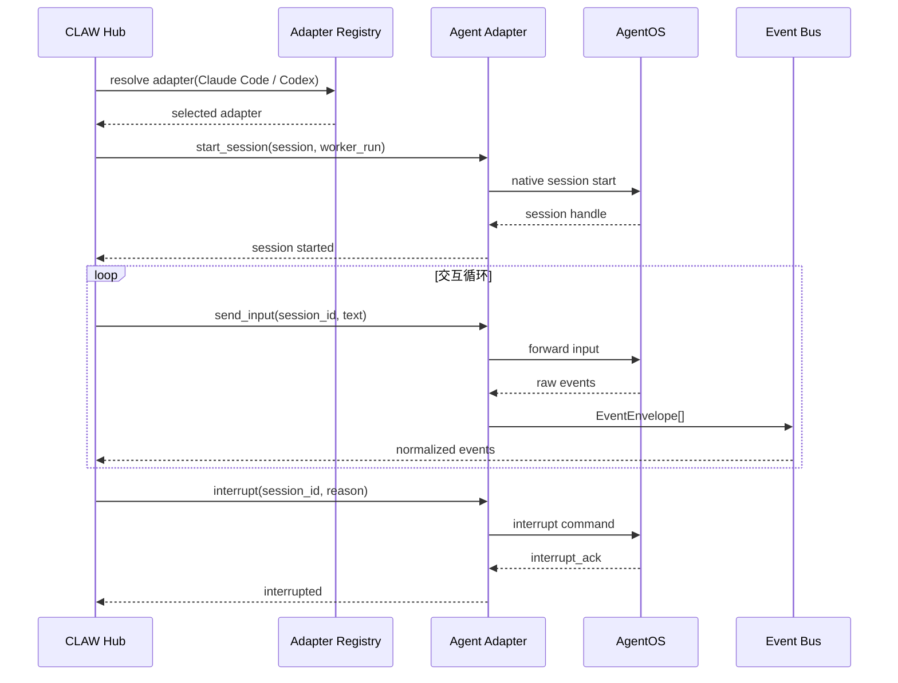
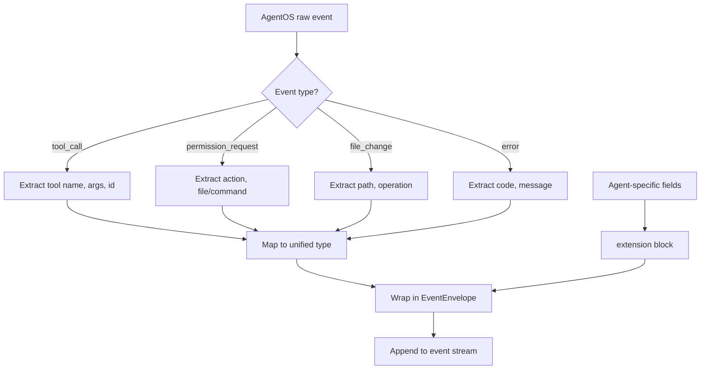
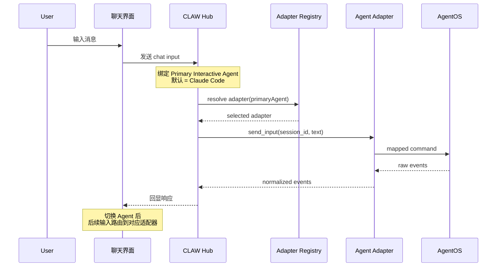

# AgentOS 集成规范

<cite>
**本文引用的文件**
- [doc/20-specs/20-AgentOS集成规范.md](file://doc/20-specs/20-AgentOS集成规范.md)
- [skills/tech-cc-hub-release-deploy/scripts/publish-release.mjs](file://skills/tech-cc-hub-release-deploy/scripts/publish-release.mjs)
- [scripts/github-release.mjs](file://scripts/github-release.mjs)
- [src/electron/libs/system-prompt-presets.ts](file://src/electron/libs/system-prompt-presets.ts)
- [doc/20-specs/29-AgentOS能力映射矩阵.md](file://doc/20-specs/29-AgentOS能力映射矩阵.md)
- [skills/tech-cc-hub-release-deploy/SKILL.md](file://skills/tech-cc-hub-release-deploy/SKILL.md)
- [skills/tech-cc-hub-release-deploy/agents/openai.yaml](file://skills/tech-cc-hub-release-deploy/agents/openai.yaml)
- [pro-workflow/skills/wiki-research-loop/scripts/research-loop.js](file://pro-workflow/skills/wiki-research-loop/scripts/research-loop.js)
- [src/electron/libs/git/README.md](file://src/electron/libs/git/README.md)
</cite>

---

## 目录

- [概述与目标](#概述与目标)
- [核心概念定义](#核心概念定义)
- [职责边界划分](#职责边界划分)
- [标准适配器接口](#标准适配器接口)
- [能力矩阵与映射](#能力矩阵与映射)
- [事件归一化处理](#事件归一化处理)
- [交互模式与路由](#交互模式与路由)
- [失败模式与排障](#失败模式与排障)
- [可观测性要求](#可观测性要求)
- [扩展点设计](#扩展点设计)

---

## 概述与目标

本文档定义 tech-cc-hub 如何深度适配 Claude Code、Codex 等 AgentOS，同时不越界重做它们的底层执行内核。tech-cc-hub 定位为 **编排与产品化视图层**，而非另一个 AgentOS 运行时。

**设计目标**：
- 与上游 AgentOS 保持松耦合，避免硬编码特定 CLI 参数
- 通过标准适配器接口隔离差异，使调度层无需感知底层细节
- 统一的事件信封（EventEnvelope）和能力声明（AgentCapability）贯穿全链路

> 章节来源：[doc/20-specs/20-AgentOS集成规范.md#L19-L22](file://doc/20-specs/20-AgentOS集成规范.md#L19-L22)

---

## 核心概念定义

### AgentOS

底层执行系统，负责会话执行、工具调用、基础权限与上下文处理。当前支持的 AgentOS 包括：

| AgentOS | 类型标识 | 备注 |
|---------|----------|------|
| Claude Code | `claude-code` | 默认主交互 Agent |
| Codex | `codex` | 备用选择 |

### AgentAdapter

CLAW 对外统一的深适配接口。每个 AgentOS 对应一个 Adapter 实例，负责：
- 将 CLAW 的统一控制命令映射到 AgentOS 的实际调用方式
- 将 AgentOS 返回的原始状态、事件、产物转成标准化格式
- 声明自身支持的能力矩阵

### AgentCapability

由适配器声明的标准能力集合，是 Hub 调度决策的依据。核心能力包括：

| Capability | 含义 |
|------------|------|
| `interactive_input` | 支持持续接收用户/Hub 输入 |
| `event_stream` | 支持持续产生结构化事件 |
| `interrupt` | 支持中断当前执行 |
| `subagent` | 支持底层子代理或并发工作流 |
| `permission_signal` | 支持显式权限请求事件 |
| `file_change_signal` | 支持输出文件变更信息 |
| `structured_result` | 支持返回结构化结果或总结 |

> 章节来源：[doc/20-specs/20-AgentOS集成规范.md#L36-L41](file://doc/20-specs/20-AgentOS集成规范.md#L36-L41)
> 章节来源：[doc/20-specs/20-AgentOS集成规范.md#L100-L111](file://doc/20-specs/20-AgentOS集成规范.md#L100-L111)

### Primary Interactive Agent

聊天界面当前主交互 Agent，取值仅为 `Claude Code` 或 `Codex`。用户在 UI 切换后，后续聊天输入路由到对应适配器。

### Agent Extension

无法被通用模型完全抽平时保留的 agent-specific 扩展位。上层 UI 默认展示统一能力；高级视图可按 agent-specific 展开。

> 章节来源：[doc/20-specs/20-AgentOS集成规范.md#L40](file://doc/20-specs/20-AgentOS集成规范.md#L40)

---

## 职责边界划分

以下表格明确 CLAW 与 AgentOS 的职责边界：

| 职责 | 归属方 |
|------|--------|
| 推理、工具调用、底层运行时 | AgentOS |
| Session 编排与产品化视图 | CLAW |
| Task Graph、SpecAsset、Replay、Analysis | CLAW |
| 底层 Hook/事件原始格式 | AgentOS |
| 标准化事件信封与回放闭环 | CLAW |

**边界原则**：
- CLAW **不能**替代 AgentOS 执行推理或工具调用
- CLAW **不负责**解析 AgentOS 的私有 CLI 参数
- AgentOS **不感知** CLAW 的 Task Graph 或 SpecAsset 概念

> 章节来源：[doc/20-specs/20-AgentOS集成规范.md#L43-L52](file://doc/20-specs/20-AgentOS集成规范.md#L43-L52)

---

## 标准适配器接口

每个 AgentAdapter 必须实现以下协议：

```typescript
interface AgentAdapter {
  // 启动新会话
  async start_session(session: Session, worker_run: WorkerRun): Promise<void>;

  // 发送用户输入
  async send_input(session_id: string, input_text: string): Promise<void>;

  // 中断当前执行
  async interrupt(session_id: string, reason?: string): Promise<void>;

  // 终止会话
  async stop_session(session_id: string): Promise<void>;

  // 查询状态
  async get_status(session_id: string): Promise<AgentStatus>;

  // 事件流订阅
  async stream_events(session_id: string): AsyncIterator<EventEnvelope>;

  // 能力声明
  async list_capabilities(): Promise<AgentCapability[]>;
}
```

**调用时序**：



> 图表来源：[doc/20-specs/20-AgentOS集成规范.md#L86-L98](file://doc/20-specs/20-AgentOS集成规范.md#L86-L98)
> 图表来源：[doc/20-specs/20-AgentOS集成规范.md#L70-L84](file://doc/20-specs/20-AgentOS集成规范.md#L70-L84)

---

## 能力矩阵与映射

### 能力分类

每个能力在适配层呈现四种状态：

| 状态 | 含义 | 处理策略 |
|------|------|----------|
| `Unified` | CLAW 可以直接消费 | 直接路由，无需转换 |
| `Bridged` | 需要适配层转换 | 在 adapter 中做标准化映射 |
| `Degraded` | 能力不完整 | 降级体验，记录差异事件 |
| `Extension Only` | 仅 agent-specific 形式存在 | 仅在高级诊断视图可见 |

> 章节来源：[doc/20-specs/29-AgentOS能力映射矩阵.md#L36-L40](file://doc/20-specs/29-AgentOS能力映射矩阵.md#L36-L40)

### 能力映射矩阵（CLAW v1 目标）

| 统一能力 | Claude Code | Codex | CLAW 统一行为 |
|----------|-------------|-------|---------------|
| `interactive_input` | Unified | Unified | 统一作为 Session 输入通道 |
| `event_stream` | Bridged | Bridged | 统一映射为 `EventEnvelope` 流 |
| `interrupt` | Bridged | Bridged | 统一作为 WorkerRun 中断能力 |
| `status_query` | Unified | Unified | 统一查询 Session / Worker 状态 |
| `subagent` | Bridged | Bridged | 统一映射到 `worker.*` / `agent.subagent.*` |
| `permission_signal` | Bridged | Bridged | 统一转成 `agent.permission.*` |
| `file_change_signal` | Degraded | Degraded | 尽量统一生成 `artifact.file_change` |
| `structured_result` | Bridged | Bridged | 统一抽为 `ResultSummary` |

### 产品优先级

| 能力 | MVP 要求 | 说明 |
|------|----------|------|
| `interactive_input` | **Must** | 无输入通道则产品不成立 |
| `event_stream` | **Must** | 无事件则无法回放和可观测 |
| `status_query` | **Must** | 前端无法可靠呈现状态 |
| `interrupt` | **Must** | 复杂任务不可控时用户无法接管 |
| `structured_result` | Beta | 影响总结和回放质量 |

> 章节来源：[doc/20-specs/29-AgentOS能力映射矩阵.md#L55-L83](file://doc/20-specs/29-AgentOS能力映射矩阵.md#L55-L83)

---

## 事件归一化处理

### EventEnvelope 标准结构

适配器负责将 AgentOS 原始事件转换为统一信封格式：

```typescript
interface EventEnvelope {
  type: string;           // 事件类型标识
  source: 'claude-code' | 'codex' | 'adapter';
  session_id: string;
  timestamp: string;       // ISO 8601
  payload: unknown;        // 事件具体数据
  extension?: {            // agent-specific 扩展
    [key: string]: unknown;
  };
}
```

### 归一化处理流程



### 飞书文档链接处理示例

tech-cc-hub 在 System Prompt 中注入了飞书文档直读规则，适配层需配合处理：

```typescript
// 飞书文档 URL 匹配模式
const FEISHU_DOC_URL_PATTERN = /https?:\/\/[^\s<>"'`]*feishu\.cn\/(?:wiki|docx|docs)\/[^\s<>"'`]*/gi;

// 触发条件：用户输入包含飞书链接 + 运行时配置了 LARK_CLI_COMMAND / LARK_CLI_PROFILE
const hasLarkCliCommand = Boolean(runtimeEnv.LARK_CLI_COMMAND?.trim());
const hasLarkCliProfile = Boolean(runtimeEnv.LARK_CLI_PROFILE?.trim());

if (hasLarkCliCommand && hasLarkCliProfile) {
  // 生成 lark-cli 命令提示，指导 Agent 直接读取文档内容
  const commands = urls.map((url) =>
    `$LARK_CLI_COMMAND --profile $LARK_CLI_PROFILE docs +fetch --doc "${url}" --format pretty`
  );
}
```

> 章节来源：[src/electron/libs/system-prompt-presets.ts#L8-L10](file://src/electron/libs/system-prompt-presets.ts#L8-L10)
> 章节来源：[src/electron/libs/system-prompt-presets.ts#L53-L79](file://src/electron/libs/system-prompt-presets.ts#L53-L79)

---

## 交互模式与路由

### 两种交互模式

| 模式 | 描述 | 路由规则 |
|------|------|----------|
| `chat_mode` | 聊天界面二选一 Agent | Primary Interactive Agent 固定为 Claude Code 或 Codex |
| `task_graph_mode` | 不同 TaskNode 由不同 AgentOS 执行 | 按 TaskNode 配置调度 |

### Chat Mode 路由流程



### 模式切换约束

- 聊天模式的二选一 **不限制** Task Graph 中的跨 AgentOS 调度
- 切换 Primary Interactive Agent 只会影响后续聊天输入，不影响已存在的 Session

> 章节来源：[doc/20-specs/20-AgentOS集成规范.md#L61-L84](file://doc/20-specs/20-AgentOS集成规范.md#L61-L84)
> 章节来源：[doc/20-specs/20-AgentOS集成规范.md#L117-L121](file://doc/20-specs/20-AgentOS集成规范.md#L117-L121)

---

## 失败模式与排障

### 典型失败模式

| 失败模式 | 原因 | 影响 | 处理策略 |
|----------|------|------|----------|
| 适配器泄漏差异 | 直接暴露底层执行细节 | CLAW/Codex 差异泄漏到全部模块 | 强制使用 EventEnvelope 包装 |
| CLAW 重写 AgentOS | 试图统一一切底层行为 | 产品变成另一个 AgentOS | 严格遵守职责边界 |
| 能力矩阵缺失 | 未声明或未验真能力 | Hub 无法正确降级调度 | adapter 必须实现 `list_capabilities` |
| 事件归一化失败 | 遇到未知事件类型 | 事件丢失，无法回放 | fallback 到 `adapter.raw_event` 类型 |

### Windows Git Push 故障的适配层补偿

tech-cc-hub 的发布脚本实现了 Git API fallback 机制：

```javascript
// 首次尝试普通 push
const pushedMain = runGit(["push", "origin", DEFAULT_BRANCH]);
if (pushedMain.ok) {
  log("published with normal git push");
  return;
}

// 检测 Windows 特有故障
if (isGitDiscoveryFailure(pushedMain)) {
  log("detected Windows git push .git discovery failure; using GitHub API fallback");
}

// API fallback: 逐 commit 重建树
async function publishViaApi(token) {
  const commits = git(["rev-list", "--reverse", `${remoteHead}..${localHead}`]);
  for (const commit of commits) {
    const treeResult = await createApiTreeForCommit(token, nextTreeSha, localParent, commit);
    const nextCommit = await request("POST", `/repos/${OWNER}/${REPO}/git/commits`, {...});
    // 验证 SHA 必须完全一致
    if (nextCommit.sha !== commit) {
      fail(`GitHub API commit mismatch: remote=${nextCommit.sha}, local=${commit}`);
    }
  }
}
```

**排障步骤**：
1. 检查 `git rev-parse HEAD` 与 `git rev-parse origin/main` 是否一致
2. 确认 `git ls-remote --heads origin main` 返回的 SHA 与本地一致
3. 若 SHA 不匹配，先 fetch/rebase 再重试

> 章节来源：[skills/tech-cc-hub-release-deploy/scripts/publish-release.mjs#L364-L386](file://skills/tech-cc-hub-release-deploy/scripts/publish-release.mjs#L364-L386)
> 章节来源：[skills/tech-cc-hub-release-deploy/SKILL.md#L80](file://skills/tech-cc-hub-release-deploy/SKILL.md#L80)

---

## 可观测性要求

### 适配器必须记录的事件

| 事件类型 | 记录时机 | 数据要求 |
|----------|----------|----------|
| `session_start` | 会话启动时 | adapter_id, session_id, agent_type |
| `capability_declaration` | 适配器初始化时 | 完整 capability 列表 |
| `command_mapping` | 每次发送命令时 | 输入命令, 映射后命令, adapter_id |
| `raw_event_received` | 收到 AgentOS 事件时 | 原始 payload, timestamp |
| `normalization_result` | 归一化完成时 | success/failure, output envelope |
| `session_stop` | 会话终止时 | 终止原因, 运行时长 |

### 日志规范

适配器失败也必须落入 `EventEnvelope`，而不是只写 stderr。示例：

```typescript
try {
  const result = await agentOS.execute(command);
  return wrapInEventEnvelope('execution_success', result);
} catch (error) {
  return wrapInEventEnvelope('execution_failed', {
    error: error.message,
    adapter_id: this.id,
    command,
  });
}
```

### 发布流程的可观测性

GitHub Release 脚本记录完整变更链：

```javascript
function createReleaseBody({ tag, commits, files }) {
  const createdTime = new Date().toISOString();
  return template
    .replaceAll("{{title}}", title)
    .replaceAll("{{commits}}", listify(commits, "无新增提交"))
    .replaceAll("{{files}}", listify(files, "无文件变更"))
    .replaceAll("{{generated_at}}", createdTime);
}
```

> 章节来源：[doc/20-specs/20-AgentOS集成规范.md#L128-L135](file://doc/20-specs/20-AgentOS集成规范.md#L128-L135)
> 章节来源：[scripts/github-release.mjs#L319-L346](file://scripts/github-release.mjs#L319-L346)

---

## 扩展点设计

### Extension 字段使用规范

当能力无法抽平时，使用 `extension` 字段暴露 agent-specific 行为：

```typescript
interface EventEnvelope {
  type: 'agent.permission.request';
  payload: {
    action: 'write_file';
    path: '/project/config.json';
  };
  extension: {
    // Codex-specific 字段
    raw_permission_format: 'confirmation_dialog';
    priority: 'high';
  };
}
```

### UI 暴露策略

| 视图层级 | 展示内容 |
|----------|----------|
| 默认产品视图 | 统一后的 Session / Task / Timeline / Replay |
| 高级诊断视图 | agent-specific extension 字段 |
| 开发调试视图 | raw mapping 和 normalization 结果 |

### 第三方 AgentOS 接入

未来引入第三种 AgentOS 时，必须：

1. **更新能力映射矩阵**（`29-AgentOS能力映射矩阵.md`）
2. **实现标准适配器接口**
3. **注册到 Adapter Registry**
4. **补充可观测日志**

> 章节来源：[doc/20-specs/20-AgentOS集成规范.md#L112-L116](file://doc/20-specs/20-AgentOS集成规范.md#L112-L116)
> 章节来源：[doc/20-specs/20-AgentOS集成规范.md#L136-L142](file://doc/20-specs/20-AgentOS集成规范.md#L136-L142)
> 章节来源：[doc/20-specs/29-AgentOS能力映射矩阵.md#L102-L107](file://doc/20-specs/29-AgentOS能力映射矩阵.md#L102-L107)

---

## 相关文档

| 文档 | 说明 |
|------|------|
| [21-统一能力模型](file://doc/20-specs/21-统一能力模型.md) | 能力模型顶层定义 |
| [29-AgentOS能力映射矩阵](file://doc/20-specs/29-AgentOS能力映射矩阵.md) | 跨 AgentOS 能力对照 |
| [24-事件模型与可观测规范](file://doc/20-specs/24-事件模型与可观测规范.md) | EventEnvelope 详细定义 |
| [25-会话与状态机规范](file://doc/20-specs/25-会话与状态机规范.md) | Session 生命周期管理 |