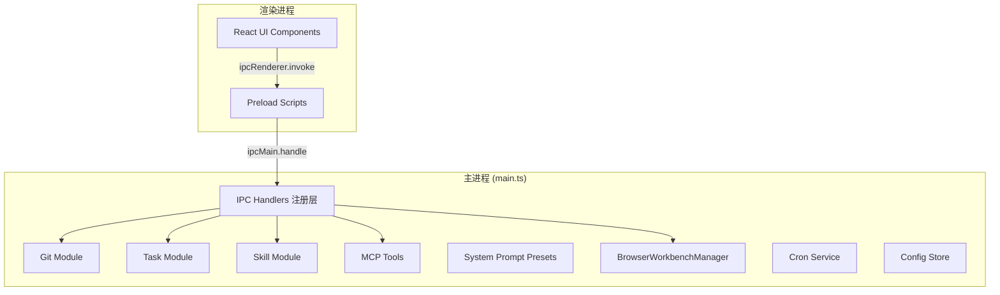
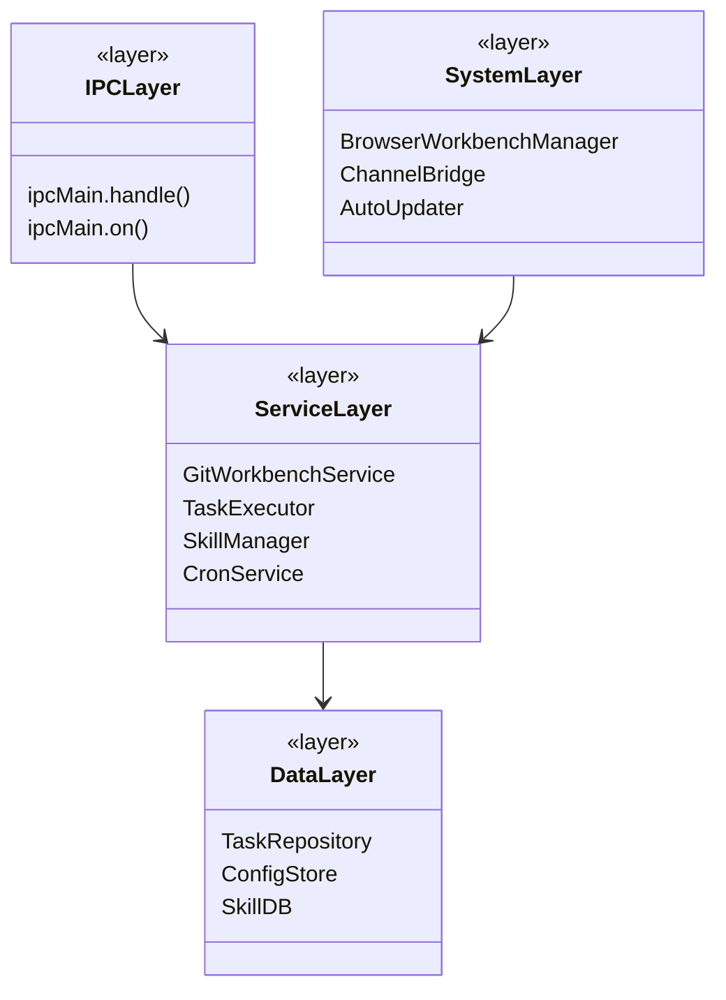
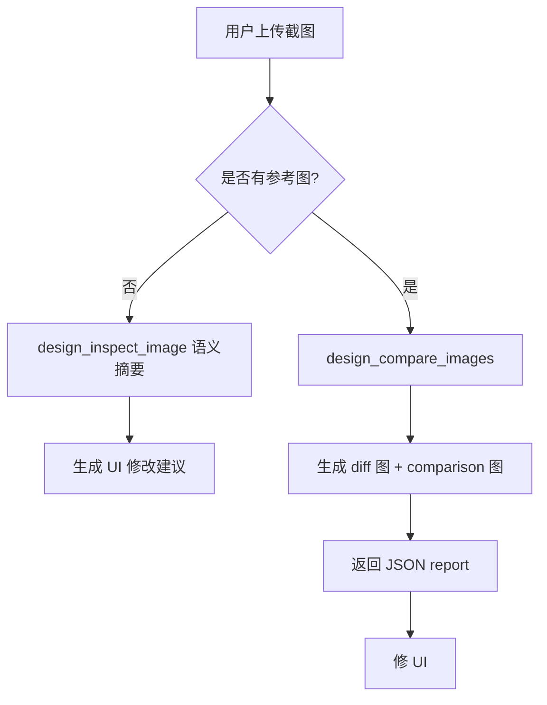
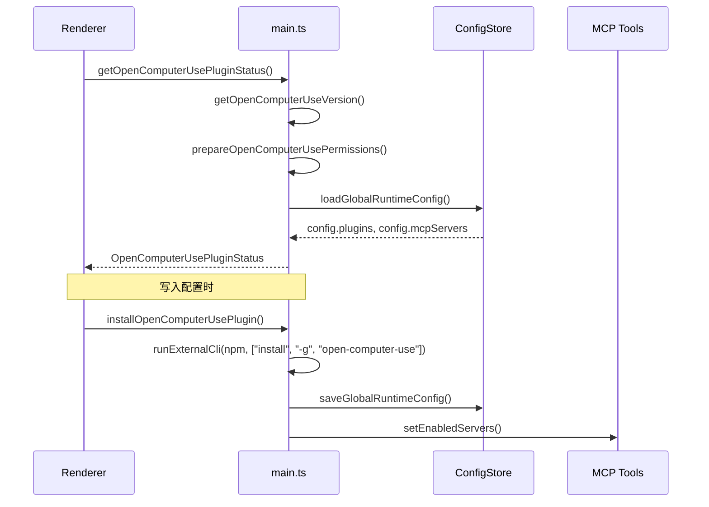

# Electron 主进程架构

<cite>

**本文引用的文件**

- [src/electron/libs/system-prompt-presets.ts](file://src/electron/libs/system-prompt-presets.ts)
- [src/electron/libs/git/README.md](file://src/electron/libs/git/README.md)
- [src/electron/libs/mcp-tools/README.md](file://src/electron/libs/mcp-tools/README.md)
- [src/electron/libs/task/README.md](file://src/electron/libs/task/README.md)
- [scripts/dev-electron.mjs](file://scripts/dev-electron.mjs)
- [src/electron/libs/git/index.ts](file://src/electron/libs/git/index.ts)
- [src/electron/libs/skill-manager/index.ts](file://src/electron/libs/skill-manager/index.ts)
- [src/electron/libs/task/index.ts](file://src/electron/libs/task/index.ts)
- [src/electron/main.ts](file://src/electron/main.ts)
</cite>

## 目录

- [1. 架构概述](#1-架构概述)
- [2. 入口与启动流程](#2-入口与启动流程)
- [3. 主进程职责分层](#3-主进程职责分层)
- [4. IPC 通信机制](#4-ipc-通信机制)
- [5. 核心模块详解](#5-核心模块详解)
  - [5.1 Git 工作台](#51-git-工作台)
  - [5.2 任务系统](#52-任务系统)
  - [5.3 Skill 管理器](#53-skill-管理器)
  - [5.4 MCP 工具层](#54-mcp-工具层)
  - [5.5 System Prompt 预设](#55-system-prompt-预设)
- [6. 配置与数据流](#6-配置与数据流)
- [7. 失败模式与排障](#7-失败模式与排障)
- [8. 扩展点](#8-扩展点)

---

## 1. 架构概述

tech-cc-hub 是一个基于 Electron 的桌面应用，采用**主进程 + 多渲染进程**的经典 Electron 架构。主进程承担所有系统级操作，渲染进程（React UI）通过 IPC 与主进程通信。



**核心设计原则**：

1. **主进程唯一性**：所有耗时的系统操作（git、文件 I/O、外部 CLI）都在主进程执行
2. **模块边界清晰**：每个功能域独立成 lib 子目录，通过 index.ts 统一导出
3. **IPC 分离职责**：Renderer 只调用 IPC handler，不直接访问系统 API

[图表来源](file://src/electron/main.ts#L1-L96)

---

## 2. 入口与启动流程

### 2.1 开发环境入口

开发环境通过 `scripts/dev-electron.mjs` 启动（非直接运行 electron 命令）：

```bash
node scripts/dev-electron.mjs
# 或带参数
node scripts/dev-electron.mjs . --remote-debugging-port=9222
```

**启动流程关键步骤**：

1. **Electron 版本检测**：读取 `package.json` 的 `devDependencies.electron` 并标准化版本号
   - [章节来源](file://scripts/dev-electron.mjs#L47-L53)
2. **macOS 代码签名准备**：若使用缓存路径，通过 `codesign --verify --deep --strict` 验证已签名应用
   - [章节来源](file://scripts/dev-electron.mjs#L34-L41)
3. **扩展属性清理**：清理 `com.apple.FinderInfo`、`com.apple.quarantine` 等 macOS 扩展属性
   - [章节来源](file://scripts/dev-electron.mjs#L55-L70)
4. **缓存 Electron.app**：首次在 `~/Library/Caches/tech-cc-hub/electron-{version}-dist` 建立缓存
   - [章节来源](file://scripts/dev-electron.mjs#L89-L108)

### 2.2 主进程初始化序列

`src/electron/main.ts` 是主进程唯一入口文件（约 2917 行），初始化顺序如下：

| 顺序 | 模块 | 职责 | 来源行号 |
|------|------|------|----------|
| 1 | BrowserWindow 创建 | 创建主窗口，设置 preload | L99 |
| 2 | IPC Handlers 注册 | 挂载所有 `ipcMain.handle` | L30 |
| 3 | Config Store 初始化 | 加载 `agent-runtime.json` | L34-L38 |
| 4 | MCP Tools Host 设置 | 注入 Browser/Design tool host | L39-L40 |
| 5 | BrowserWorkbenchManager | 管理 BrowserView 实例池 | L73, L115 |
| 6 | Channel Bridge | 建立与 Claude Code 的通信桥接 | L42 |
| 7 | Dev Backend Bridge | 代理本地后端请求 | L74 |
| 8 | Skill Manager Handlers | 注册 Skill 管理 IPC | L64 |
| 9 | Git Workbench Handlers | 注册 Git 操作 IPC | L66 |
| 10 | Cron Service | 启动定时任务服务 | L68-L70 |

[章节来源](file://src/electron/main.ts#L98-L96)

---

## 3. 主进程职责分层

主进程按职责分为四层：



### 3.1 IPC 通信层（最上层）

负责接收 Renderer 的请求并分发给对应服务。入口使用 `ipcMainHandle` 封装：

```typescript
import { ipcMainHandle, isDev, DEV_PORT } from "./util.js";
// 使用方式
ipcMainHandle("channel:name", async (event, ...args) => {
  // 自动处理 invoke 事件
});
```

### 3.2 服务层（核心业务逻辑）

- **GitWorkbenchService**：封装 git 操作，不暴露 simple-git 底层
- **TaskExecutor**：任务编排唯一入口，负责自动执行、并发控制、重试
- **SkillManager**：Skill 安装、同步、场景管理
- **CronService**：定时任务执行

### 3.3 数据层（持久化）

| 数据类型 | 存储位置 | 访问方式 |
|----------|----------|----------|
| 全局配置 | `agent-runtime.json` | `loadGlobalRuntimeConfig()` / `saveGlobalRuntimeConfig()` |
| 任务数据 | SQLite | `TaskRepository` |
| Skill 元数据 | SQLite | `skill-manager/db.js` |
| Cron 任务 | SQLite | `CronRepository` |

### 3.4 系统层（Electron 原生能力）

- **BrowserWorkbenchManager**：管理多个 BrowserView 实例，支持会话隔离
- **ChannelBridge**：与 Claude Code 进程的通信
- **AutoUpdater**：应用自动更新

[章节来源](file://src/electron/main.ts#L32-L75)

---

## 4. IPC 通信机制

### 4.1 IPC 通道注册

各模块在 `main.ts` 初始化时注册 IPC handler，模式统一为：

```typescript
// 注册 handler
ipcMainHandle("module:action", handlerFn);

// 调用方（Renderer 通过 preload）
const result = await window.electron.invoke("module:action", payload);
```

### 4.2 主要 IPC 通道一览

| 通道 | 所属模块 | 功能 |
|------|----------|------|
| `git:invoke` | Git | git 操作统一入口 |
| `task:invoke` | Task | 任务执行相关 |
| `skill-manager:invoke` | Skill | Skill 管理 |
| `mcp-tools:*` | MCP Tools | 各 MCP 工具调用 |
| `cron:*` | Cron | 定时任务管理 |
| `config:*` | Config | 运行时配置读写 |
| `browser:workbench:*` | Browser | BrowserView 控制 |

[章节来源](file://src/electron/libs/git/index.ts#L1-L3)

### 4.3 IPC 数据结构约定

每个 IPC 调用遵循请求/响应模式：

```typescript
// 请求 payload（示例：Git）
interface GitInvokeRequest {
  action: "status" | "diff" | "commit" | "push";
  payload: Record<string, unknown>;
}

// 响应 result
interface GitInvokeResult {
  success: boolean;
  data?: unknown;
  error?: string;
}
```

---

## 5. 核心模块详解

### 5.1 Git 工作台

**定位**：右侧 Git 工作台的主进程模块，Renderer 只能通过 IPC 调用，不直接执行 git。

**文件结构**：

```
libs/git/
├── types.ts      # Git 领域类型和 IPC payload/result
├── errors.ts     # Git 错误归一化
├── service.ts    # 唯一 Git 操作入口
├── history.ts    # Commit history parser
├── graph.ts      # Lightweight graph lane 生成
├── operation-log.ts  # 本地高影响操作日志
├── ipc.ts        # Electron IPC handler 注册
└── index.ts      # 对外统一出口
```

**第一版允许的操作**：

- status / diff
- stage / unstage
- commit
- ordinary push
- create / checkout branch
- stash save / apply / drop
- recent history / lightweight graph

**第一版禁止的操作**：

- reset, rebase, cherry-pick, force push, amend, squash, interactive rebase

**导出方式**：

```typescript
export { GitWorkbenchService } from "./service.js";
export { handleGitWorkbenchInvoke, registerGitWorkbenchIpcHandlers } from "./ipc.js";
export type * from "./types.js";
```

[章节来源](file://src/electron/libs/git/README.md#L1-L35)
[章节来源](file://src/electron/libs/git/index.ts#L1-L4)

### 5.2 任务系统

**定位**：统一的外部任务源适配和执行编排系统。

**文件结构**：

```
libs/task/
├── types.ts           # 任务、IPC payload 领域类型
├── provider-registry.ts  # Provider 注册表和 fallback
├── providers/         # 外部任务源适配器（Lark、Feishu Project 等）
├── repository.ts      # SQLite schema、持久化
├── workflow.ts        # Symphony-style workflow 配置
├── workspace.ts      # 任务独立 workspace 创建
├── executor.ts       # 编排器：同步、自动执行、并发控制、重试
└── index.ts          # 对外统一出口
```

**核心类型**（从 `index.ts` 导出）：

```typescript
export type {
  ExternalTask,           // 外部任务
  ExternalTaskStatus,     // 外部任务状态
  LocalTaskStatus,        // 本地任务状态
  StoredTask,             // 持久化的任务
  TaskExecution,          // 任务执行记录
  TaskExecutionLog,       // 执行日志
  TaskProvider,           // Provider 接口
  TaskProviderState,      // Provider 状态
  TaskFilter,             // 查询过滤器
  TaskWorkflowSettings,   // 工作流设置
} from "./types.js";
```

**运行原则**：

1. Provider 只负责把第三方任务映射成 `ExternalTask`，不直接改 UI 或会话
2. Repository 只做持久化，不启动 runner
3. Executor 是唯一调度入口
4. 任务执行使用独立 workspace，避免互相污染

**注册 Provider**：

```typescript
import { registerTaskProvider, getTaskProvider } from "./libs/task/index.js";

registerTaskProvider("lark", new LarkTaskProvider());
registerTaskProvider("feishu-project", new FeishuProjectTaskProvider());
```

[章节来源](file://src/electron/libs/task/README.md#L1-L23)
[章节来源](file://src/electron/libs/task/index.ts#L1-L37)

### 5.3 Skill 管理器

**定位**：Skill 的安装、同步、场景管理和市场集成。

**核心导出**（`libs/skill-manager/index.ts`）：

| 导出类别 | 主要函数 |
|----------|----------|
| 数据库操作 | `getAllSkills`, `getSkillById`, `insertSkill`, `deleteSkill` |
| 场景管理 | `getAllScenarioDtos`, `createScenario`, `applyScenarioToDefault` |
| 工具适配器 | `defaultToolAdapters`, `findAdapter`, `isInstalled` |
| 同步引擎 | `syncSkill`, `is_valid_skill_dir`, `parseSkillMd` |
| 安装器 | `installFromLocal`, `installSkillDirToDestination` |
| 扫描器 | `scanLocalSkills`, `groupDiscovered` |

**IPC 注册**：

```typescript
import { handleSkillManagerInvoke, registerSkillManagerHandlers } from "./libs/skill-manager/ipc-handlers.js";
```

[章节来源](file://src/electron/libs/skill-manager/index.ts#L1-L88)

### 5.4 MCP 工具层

**定位**：集中存放暴露给 Agent 的内置 MCP 工具，避免 `libs` 根目录膨胀。

**工具清单**：

| 工具文件 | 功能 | 描述 |
|----------|------|------|
| `browser.ts` | BrowserView 工作台 | 导航、截图摘要、DOM 查询、样式检查、标注模式 |
| `design.ts` | 设计还原 | 截图语义分析、比照、diff 图、JSON report |
| `figma-rest.ts` | Figma API | 文件/节点读取、设计系统、UX 审查 |
| `admin.ts` | 配置管理 | 写入 `agent-runtime.json` 的全局参数 |

**设计工具默认触发场景**：

1. 用户给出截图、Figma 图，要求生成或修改 UI/前端代码
2. 用户反馈页面和参考图不一致，需要按截图修 UI

**触发流程**：



**工具设计规范**：

- 每个工具明确 host 边界，不直接操作 React UI
- 返回内容尽量是摘要、路径和结构化 JSON，避免大图或密钥明文
- 涉及写入磁盘或配置的工具必须有字段 allowlist 和体积上限

[章节来源](file://src/electron/libs/mcp-tools/README.md#L1-L23)

### 5.5 System Prompt 预设

**定位**：为 Claude Code 会话注入行为约束和工具提示。

**预设构建器**（`system-prompt-presets.ts`）：

| 函数 | 用途 | 行号 |
|------|------|------|
| `buildBrowserWorkbenchPromptAppend()` | 浏览器操作最佳实践 | L12-L19 |
| `buildAdminConfigPromptAppend()` | 配置持久化规则 | L21-L26 |
| `buildToolCallOptimizationPromptAppend()` | 工具调用优化策略 | L28-L42 |
| `buildFeishuDocumentFetchPromptAppend()` | 飞书文档链接直读 | L53-L79 |
| `buildDesignParityPromptAppend()` | 设计还原规则 | L125-L134 |
| `buildBuiltinMcpRegistryPromptAppend()` | 内置 MCP 注册提示 | L117-L119 |
| `buildClaudeCode2139FeaturePromptAppend()` | Claude Code 兼容性 | L121-L123 |

**飞书文档提取**：

```typescript
// L45-51: URL 提取逻辑
const FEISHU_DOC_URL_PATTERN = /https?:\/\/[^\s<>"'`]*feishu\.cn\/(?:wiki|docx|docs)\/[^\s<>"'`*/gi;
const MAX_FEISHU_DOC_URL_HINTS = 3;

export function extractFeishuDocumentUrls(text: string): string[] {
  const matches = text.match(FEISHU_DOC_URL_PATTERN) ?? [];
  const urls = matches
    .map((url) => url.replace(FEISHU_DOC_URL_TRAILING_PUNCTUATION, ""))
    .filter(Boolean);
  return Array.from(new Set(urls)).slice(0, MAX_FEISHU_DOC_URL_HINTS);
}
```

**PromptLedgerSource 导出**（供会话初始化使用）：

```typescript
export function buildTechCCHubSystemPromptSources(): PromptLedgerSource[] {
  return [
    { id: "tech-cc-hub-browser-preset", label: "tech-cc-hub 内置浏览器预设", sourceKind: "system", text: buildBrowserWorkbenchPromptAppend() },
    { id: "tech-cc-hub-admin-preset", label: "tech-cc-hub 配置治理预设", sourceKind: "system", text: buildAdminConfigPromptAppend() },
    // ... 更多预设
  ];
}
```

[章节来源](file://src/electron/libs/system-prompt-presets.ts#L1-L175)

---

## 6. 配置与数据流

### 6.1 全局运行时配置

**配置文件路径**：`agent-runtime.json`

**读写接口**：

```typescript
import {
  loadGlobalRuntimeConfig,
  saveGlobalRuntimeConfig,
} from "./libs/config-store.js";

// 读取
const config = loadGlobalRuntimeConfig();

// 写入（通过 MCP admin 工具）
mcp__tech-cc-hub-admin__set_global_runtime_config({ updates: { env: { KEY: "value" } } });
```

**配置结构示例**：

```json
{
  "env": {
    "LARK_CLI_COMMAND": "lark-cli",
    "LARK_CLI_PROFILE": "default"
  },
  "mcpServers": {
    "open-computer-use": { "command": "open-computer-use" }
  },
  "plugins": {
    "open-computer-use": { "enabled": true }
  }
}
```

[章节来源](file://src/electron/libs/system-prompt-presets.ts#L53-L66)

### 6.2 Plugin 管理数据流



[章节来源](file://src/electron/main.ts#L252-L296)

---

## 7. 失败模式与排障

### 7.1 常见失败场景

| 场景 | 症状 | 排查方向 |
|------|------|----------|
| IPC 调用无响应 | Renderer 调用 `invoke` 超时 | 检查 `main.ts` handler 注册是否遗漏；检查 `ipcMain.handle` vs `ipcMain.on` 是否匹配 |
| Git 操作失败 | `git:invoke` 返回 `success: false` | 查看 `error` 字段；检查 `errors.ts` 错误归一化逻辑 |
| Task 不执行 | 任务状态停留在 `pending` | 检查 `TaskExecutor` 是否初始化；检查 `provider-registry` 是否注册该 provider |
| Skill 安装失败 | `skill-manager:invoke` 返回错误 | 检查目标目录权限；检查 `sync-engine.ts` 返回值 |
| MCP 工具调用失败 | 工具返回错误或无结果 | 检查 `setBrowserToolHost` / `setDesignToolHost` 是否正确设置 |

### 7.2 权限问题（macOS）

**Accessibility 和 Screen Recording 权限检查**：

```typescript
// main.ts L187-L250
async function prepareOpenComputerUsePermissions(options = {}) {
  accessibility = systemPreferences.isTrustedAccessibilityClient(Boolean(options.prompt)) ? "granted" : "missing";
  screenRecording = systemPreferences.getMediaAccessStatus("screen") === "granted" ? "granted" : "missing";

  if (options.openSettings) {
    await shell.openExternal(macPrivacyPaneUrl("accessibility"));
    await shell.openExternal(macPrivacyPaneUrl("screen-recording"));
  }
}
```

**排障步骤**：

1. 触发 `prepareOpenComputerUsePermissions({ openSettings: true })` 打开系统设置
2. 用户手动授权后，刷新状态重新检查

### 7.3 开发环境启动失败

**常见原因**：

1. **Electron.app 未找到**：先执行 `npm install` 安装 Electron 依赖
2. **代码签名验证失败**：检查 `codesign` 命令是否可用，或临时设置 `ELECTRON_OVERRIDE_DIST_PATH`
3. **扩展属性导致 Gatekeeper 拦截**：运行 `scripts/dev-electron.mjs` 会自动清理 `xattr`

[章节来源](file://scripts/dev-electron.mjs#L82-L107)

---

## 8. 扩展点

### 8.1 新增 IPC 通道

**步骤**：

1. 在对应模块的 `ipc.ts` 中实现 handler
2. 在 `main.ts` 导入并注册
3. 在 Renderer preload 暴露调用方法

```typescript
// libs/your-module/ipc.ts
export function registerYourModuleIpcHandlers() {
  ipcMainHandle("your-module:action", async (event, payload) => {
    // 实现逻辑
  });
}

// main.ts
import { registerYourModuleIpcHandlers } from "./libs/your-module/ipc.js";

// 在 app.whenReady() 中调用
registerYourModuleIpcHandlers();
```

### 8.2 新增 Task Provider

**步骤**：

1. 在 `libs/task/providers/` 创建 Provider 类
2. 实现 `TaskProvider` 接口
3. 在 `provider-registry.ts` 注册或动态注册

```typescript
// libs/task/providers/custom-provider.ts
export class CustomTaskProvider implements TaskProvider {
  id: "custom" = "custom";

  async listTasks(filter?: TaskFilter): Promise<ExternalTask[]> {
    // 实现从第三方系统拉取任务
  }

  async claimTask(taskId: string): Promise<void> {
    // 实现任务认领
  }
}

// 使用时注册
import { registerTaskProvider } from "./libs/task/index.js";
registerTaskProvider("custom", new CustomTaskProvider());
```

### 8.3 新增 MCP 工具

**步骤**：

1. 在 `libs/mcp-tools/` 创建或扩展工具文件
2. 在工具类中注入 `MCP_HOST`
3. 在 `main.ts` 调用 `setXxxToolHost(host)`

```typescript
// libs/mcp-tools/custom-tool.ts
let toolHost: McpHost | null = null;

export function setCustomToolHost(host: McpHost) {
  toolHost = host;
}

export async function customToolHandler(args: CustomToolArgs): Promise<ToolResult> {
  if (!toolHost) throw new Error("Custom tool host not set");
  return toolHost.callTool("custom_tool", args);
}
```

### 8.4 新增 System Prompt 预设

**步骤**：

1. 在 `system-prompt-presets.ts` 编写 `buildXxxPromptAppend()` 函数
2. 在 `buildTechCCHubSystemPromptSources()` 中添加 `PromptLedgerSource`
3. 在会话初始化时自动注入

```typescript
// system-prompt-presets.ts L136-175
export function buildTechCCHubSystemPromptSources(): PromptLedgerSource[] {
  return [
    // ... 现有预设
    {
      id: "your-new-preset",
      label: "Your New Preset",
      sourceKind: "system",
      text: buildYourNewPromptAppend(),
    },
  ];
}
```

[章节来源](file://src/electron/libs/system-prompt-presets.ts#L136-L175)