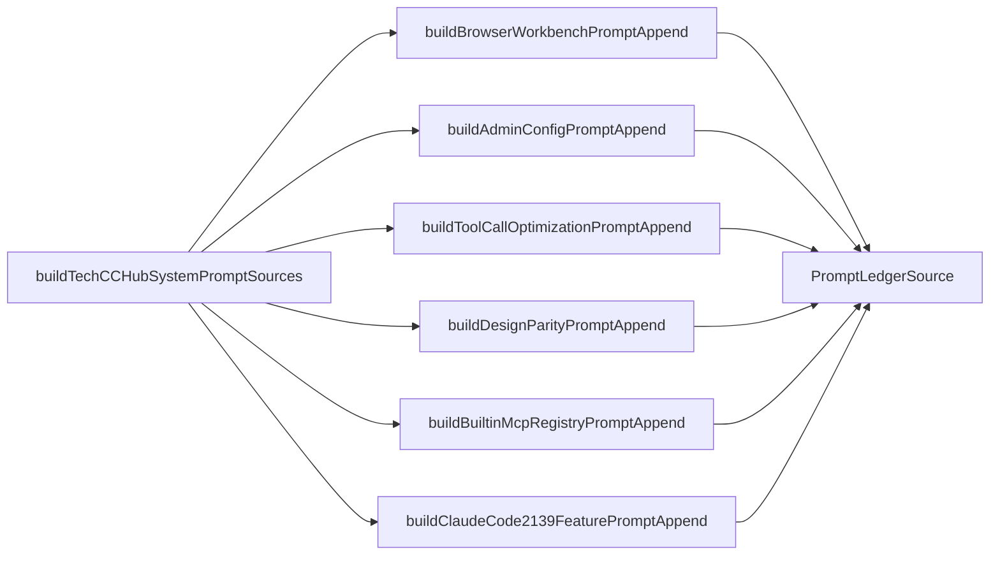
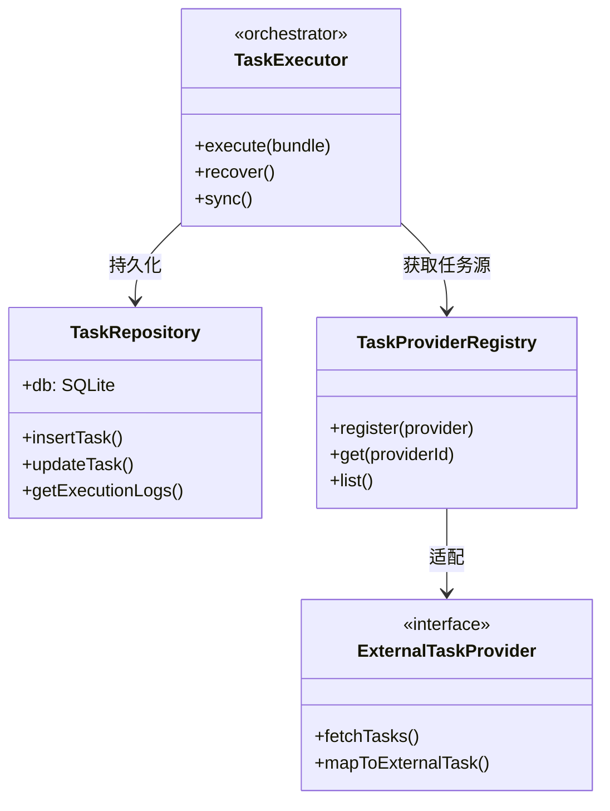
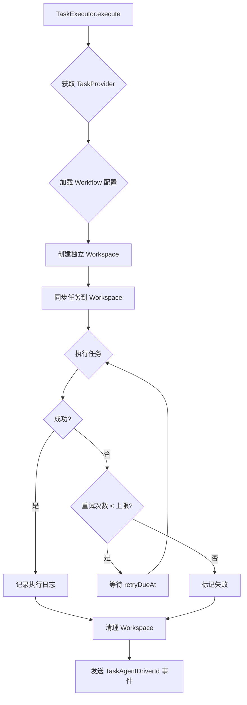
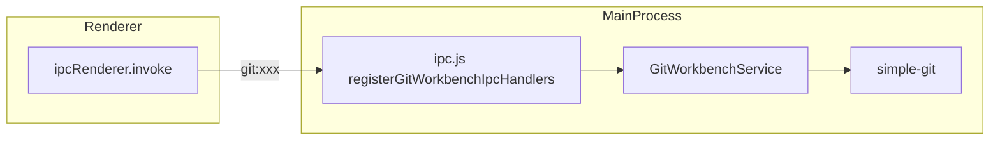

# Electron 客户端测试手册

<cite>
**本文引用的文件**

- [src/electron/libs/system-prompt-presets.ts](file://src/electron/libs/system-prompt-presets.ts)
- [src/electron/libs/git/README.md](file://src/electron/libs/git/README.md)
- [src/electron/libs/mcp-tools/README.md](file://src/electron/libs/mcp-tools/README.md)
- [src/electron/libs/task/README.md](file://src/electron/libs/task/README.md)
- [scripts/dev-electron.mjs](file://scripts/dev-electron.mjs)
- [src/electron/libs/git/index.ts](file://src/electron/libs/git/index.ts)
- [src/electron/libs/skill-manager/index.ts](file://src/electron/libs/skill-manager/index.ts)
- [src/electron/libs/task/index.ts](file://src/electron/libs/task/index.ts)
- [src/electron/main.ts](file://src/electron/main.ts)
</cite>

## 目录

- [1. 概述](#1-概述)
- [2. 测试环境准备](#2-测试环境准备)
- [3. 开发模式启动验证](#3-开发模式启动验证)
- [4. 主进程模块测试矩阵](#4-主进程模块测试矩阵)
- [5. IPC 通信验证](#5-ipc-通信验证)
- [6. MCP 工具测试](#6-mcp-工具测试)
- [7. 任务系统测试](#7-任务系统测试)
- [8. Git 工作台测试](#8-git-工作台测试)
- [9. Skill 管理器测试](#9-skill-管理器测试)
- [10. 常见失败模式与排障](#10-常见失败模式与排障)
- [11. 扩展测试能力](#11-扩展测试能力)

---

## 1. 概述

本文档定义 tech-cc-hub Electron 客户端各模块的测试范围、入口点、调用链和验收标准。

### 1.1 客户端架构位置

Electron 客户端运行在 **主进程（Main Process）** + **渲染进程（Renderer Process）** 双进程模型下：

- **主进程**：位于 `src/electron/`，负责系统级能力（文件 I/O、子进程、MCP 连接、数据库）
- **渲染进程**：React 前端，通过 IPC 调用主进程模块
- **工作台桥接**：`BrowserWorkbenchManager` 管理右侧嵌入式 BrowserView

### 1.2 模块边界一览

| 模块 | 路径 | 职责 | IPC 入口 |
|------|------|------|----------|
| Git 工作台 | `libs/git/` | git status/diff/stash/history/push | `handleGitWorkbenchInvoke` |
| 任务系统 | `libs/task/` | 任务编排、执行、重试、持久化 | `TaskExecutor` |
| MCP 工具 | `libs/mcp-tools/` | 浏览器/设计/Figma/管理工具 | `setBrowserToolHost` |
| Skill 管理器 | `libs/skill-manager/` | Skill 安装、同步、场景管理 | `handleSkillManagerInvoke` |
| System Prompt | `libs/system-prompt-presets.ts` | 构建 Agent 系统提示词 | 纯函数，无 IPC |

> **图表来源**：[src/electron/libs/git/README.md#L1-L14](file://src/electron/libs/git/README.md#L1-L14)
> **图表来源**：[src/electron/libs/task/README.md#L1-L14](file://src/electron/libs/task/README.md#L1-L14)
> **图表来源**：[src/electron/libs/mcp-tools/README.md#L1-L14](file://src/electron/libs/mcp-tools/README.md#L1-L14)

---

## 2. 测试环境准备

### 2.1 依赖检查清单

```bash
# 检查 Node.js 版本
node --version  # >= 18.0.0

# 检查 Electron 是否已安装
ls node_modules/electron/

# 检查必要依赖
npm ls @modelcontextprotocol/sdk
npm ls electron
```

### 2.2 环境变量配置

| 环境变量 | 用途 | 示例值 |
|----------|------|--------|
| `NODE_ENV` | 运行时环境 | `development` / `production` |
| `ELECTRON_OVERRIDE_DIST_PATH` | macOS 代码签名覆盖路径 | `~/Library/Caches/tech-cc-hub/electron-28.0.0-dist` |
| `DEV_PORT` | 开发模式端口 | `5173` |
| `LARK_CLI_COMMAND` | 飞书 CLI 路径 | `lark-cli` |
| `LARK_CLI_PROFILE` | 飞书配置档 | `tech-cc-hub-prod` |

### 2.3 macOS 权限前置条件

部分测试需要 macOS 系统权限：

- **Accessibility**：无障碍辅助（`systemPreferences.isTrustedAccessibilityClient`）
- **Screen Recording**：屏幕录制（`systemPreferences.getMediaAccessStatus("screen")`）

未授权时相关功能返回 `permissions.needsUserAction: true`。见 [main.ts#L181-L250](file://src/electron/main.ts#L181-L250)。

---

## 3. 开发模式启动验证

### 3.1 启动脚本入口

**开发模式**：使用 `scripts/dev-electron.mjs` 启动 Electron

```bash
# 标准启动
node scripts/dev-electron.mjs

# 带参数启动（如打开指定目录）
node scripts/dev-electron.mjs /path/to/project
```

> **图表来源**：[scripts/dev-electron.mjs#L126-L136](file://scripts/dev-electron.mjs#L126-L136)

### 3.2 macOS 代码签名处理流程

在 macOS 上，首次启动会执行以下流程：

```mermaid
flowchart TD
    A[启动 dev-electron.mjs] --> B{platform === darwin?}
    B -->|否| C[跳过签名处理]
    B -->|是| D{ELECTRON_OVERRIDE_DIST_PATH 已设置?}
    D -->|是| E{验证 codesign?}
    D -->|否| F[查找 node_modules/electron/dist/Electron.app]
    F --> G[构建缓存路径 ~/Library/Caches/tech-cc-hub/electron-{version}-dist]
    G --> H{缓存 Electron.app 存在且通过签名验证?}
    H -->|是| I[使用缓存路径]
    H -->|否| J[复制 dist 到缓存目录]
    J --> K[清理 extended attributes]
    K --> L[codesign --force --deep --sign]
    L --> M{签名验证通过?}
    M -->|是| I
    M -->|否| N[抛出错误: 未通过 codesign 验证]
    E -->|是| I
    E -->|否| N
    I --> O[设置 ELECTRON_OVERRIDE_DIST_PATH]
    O --> P[spawn Electron]
    N --> Q[退出并报告错误]
    C --> P
```

> **图表来源**：[scripts/dev-electron.mjs#L72-L108](file://scripts/dev-electron.mjs#L72-L108)

### 3.3 验收标准

- [ ] Electron 进程成功启动（无 crash）
- [ ] 主窗口正常显示
- [ ] IPC handlers 已注册（检查控制台无 `handler not found` 错误）
- [ ] macOS 上 Electron.app 通过代码签名验证

### 3.4 常见启动失败

| 错误 | 原因 | 解决方案 |
|------|------|----------|
| `Electron.app not found at ...` | `npm install` 未执行 | 运行 `npm install` |
| `Prepared Electron.app did not pass codesign verification` | macOS 签名缓存损坏 | 删除 `~/Library/Caches/tech-cc-hub/` 后重试 |
| `failed to start Electron: spawn ENOENT` | `electron` 模块未安装 | 检查 `node_modules/electron/` |

---

## 4. 主进程模块测试矩阵

### 4.1 模块职责速查

| 模块 | 入口函数 | 核心导出 | 依赖项 |
|------|----------|----------|--------|
| `system-prompt-presets.ts` | `buildTechCCHubSystemPromptSources()` | `PromptLedgerSource[]` | `@modelcontextprotocol/sdk` |
| `git/index.ts` | `GitWorkbenchService` | `handleGitWorkbenchInvoke` | `simple-git` |
| `task/index.ts` | `TaskExecutor` | `TaskRepository` | SQLite |
| `skill-manager/index.ts` | 各 DB 函数 | 完整 CRUD + sync | SQLite |
| `mcp-tools/` | `setBrowserToolHost` | Browser/Design/Figma/Admin 工具 | MCP SDK |

> **图表来源**：[src/electron/libs/task/index.ts#L1-L10](file://src/electron/libs/task/index.ts#L1-L10)
> **图表来源**：[src/electron/libs/skill-manager/index.ts#L1-L88](file://src/electron/libs/skill-manager/index.ts#L1-L88)

### 4.2 System Prompt 构建链

System Prompt 由多个预设函数组合生成，调用链如下：



**关键参数**：

| 函数 | 输入参数 | 输出 | 触发条件 |
|------|----------|------|----------|
| `buildFeishuDocumentFetchPromptAppend` | `prompt: string, runtimeEnv: Record<string, string>` | `string \| undefined` | 飞书 URL + LARK_CLI_COMMAND/PROFILE |
| `buildGlobalRuntimeSystemPromptExtAppend` | `globalRuntimeConfig: unknown` | `string \| undefined` | `systemPromptExt` 字段存在 |
| `buildBuiltinMcpRegistryPromptAppend` | `enabledServerNames?: readonly BuiltinMcpServerName[]` | `string` | 始终返回提示 |

**测试验证点**：

- [ ] 所有预设函数返回非空字符串或 `undefined`
- [ ] `buildFeishuDocumentFetchPromptAppend` 在无飞书 URL 时返回 `undefined`
- [ ] `extractFeishuDocumentUrls` 最多返回 3 个去重 URL
- [ ] `isRecord` 类型守卫正确识别对象

> **图表来源**：[src/electron/libs/system-prompt-presets.ts#L136-L175](file://src/electron/libs/system-prompt-presets.ts#L136-L175)
> **图表来源**：[src/electron/libs/system-prompt-presets.ts#L44-L51](file://src/electron/libs/system-prompt-presets.ts#L44-L51)

---

## 5. IPC 通信验证

### 5.1 IPC 注册模式

主进程通过 `ipcMain.handle` 注册 invoke handler，Renderer 通过 `ipcRenderer.invoke` 调用：

```typescript
// 主进程注册示例 (from main.ts)
import { ipcMainHandle } from "./util.js";

ipcMainHandle("git:status", async (event, repoPath: string) => {
  return gitService.status(repoPath);
});
```

### 5.2 核心 IPC 通道

| 通道 | 所属模块 | 用途 |
|------|----------|------|
| `git:*` | Git 工作台 | status/diff/commit/push 等 |
| `skill-manager:*` | Skill 管理器 | CRUD/sync 操作 |
| `knowledge:*` | 知识库 | 文档列表/同步/生成 |
| `task:*` | 任务系统 | 执行/状态查询 |
| `figma:*` | Figma 集成 | OAuth/token 管理 |

> **图表来源**：[src/electron/main.ts#L119-L130](file://src/electron/main.ts#L119-L130)

### 5.3 IPC 响应数据结构

**成功响应**：
```typescript
{
  success: true,
  data: T  // 业务数据
}
```

**错误响应**：
```typescript
{
  success: false,
  error: string  // 错误消息
}
```

### 5.4 验收标准

- [ ] 所有 IPC 通道在 `app.whenReady()` 后注册
- [ ] 不存在的通道返回 `{ success: false, error: "handler not found" }`
- [ ] 错误情况下不泄漏敏感信息（如文件路径、SQL 语句）

---

## 6. MCP 工具测试

### 6.1 MCP 工具分类

| 工具 | 文件 | 能力 |
|------|------|------|
| Browser 工具 | `mcp-tools/browser.ts` | 导航、DOM 查询、截图、样式检查 |
| Design 工具 | `mcp-tools/design.ts` | 图像分析、diff 对比、设计还原 |
| Figma 工具 | `mcp-tools/figma-rest.ts` | 节点读取、变量、Tailwind 初稿 |
| Admin 工具 | `mcp-tools/admin.ts` | `agent-runtime.json` 写入 |

> **图表来源**：[src/electron/libs/mcp-tools/README.md#L5-L8](file://src/electron/libs/mcp-tools/README.md#L5-L8)

### 6.2 Browser 工具测试矩阵

| 工具名 | 参数 | 预期行为 |
|--------|------|----------|
| `http_ping` | `{ host: string, port?: number }` | 返回连通性诊断 |
| `browser_console_logs` | `{ waitFor?: string }` | 获取控制台日志 |
| `browser_query_nodes` | `{ selector: string, fields?: string[] }` | 返回 DOM 节点摘要 |
| `browser_get_element` | `{ selector: string }` | 返回单个元素详情 |
| `browser_inspect_styles` | `{ selector: string, fields?: string[] }` | 返回样式信息 |
| `browser_apply_styles` | `{ selector: string, css: string }` | 应用临时 CSS |
| `figma_match_ui_nodes` | `{ nodes: FigmaNode[] }` | UI 节点映射 |

**触发规则**（由 `system-prompt-presets.ts` 定义）：

- 用户给出截图/Figma 图/页面参考图，要求生成或修改 UI 代码
- 需要诊断网络服务
- 需要验证 DOM 状态或样式差异

> **图表来源**：[src/electron/libs/system-prompt-presets.ts#L12-L18](file://src/electron/libs/system-prompt-presets.ts#L12-L18)

### 6.3 Design 工具测试矩阵

| 工具名 | 参数 | 预期行为 |
|--------|------|----------|
| `design_inspect_image` | `{ imagePath: string }` | 返回视觉摘要 |
| `design_capture_current_view` | 无 | 保存 BrowserView 截图 |
| `design_compare_images` | `{ reference, candidate, options? }` | 返回对比结果 |
| `design_compare_current_view` | `{ reference?, options? }` | 对比当前视图 |
| `design_read_comparison_report` | `{ reportPath: string }` | 读取 JSON report |
| `design_list_artifacts` | 无 | 列出最近产物 |

**设计还原规则**：

1. 单张参考图先走 `design_inspect_image`
2. 已有候选图后走 `design_compare_images`（避免同一张图自比较）
3. 动态区域使用 `ignoreRegions`
4. 验收结论使用 `maxDifferenceRatio`

> **图表来源**：[src/electron/libs/system-prompt-presets.ts#L125-L133](file://src/electron/libs/system-prompt-presets.ts#L125-L133)

### 6.4 Admin 工具测试

**唯一入口**：`mcp__tech-cc-hub-admin__set_global_runtime_config`

| 参数 | 类型 | 约束 |
|------|------|------|
| `field` | `string` | 必须在 allowlist 中 |
| `value` | `unknown` | 体积有限制 |

**安全约束**：

- 只允许写入 `env`、`skillCredentials`、`closeSidebarOnBrowserOpen` 等指定字段
- 不返回密钥明文
- 返回值按字段名统计变化

> **图表来源**：[src/electron/libs/system-prompt-presets.ts#L21-L25](file://src/electron/libs/system-prompt-presets.ts#L21-L25)

### 6.5 验收标准

- [ ] Browser 工具在非 BrowserWorkbench 环境下返回错误
- [ ] Design 工具输入输出符合类型约束
- [ ] Admin 工具不接受 allowlist 外字段
- [ ] 所有工具返回值避免塞入大图或密钥明文

---

## 7. 任务系统测试

### 7.1 架构概览



> **图表来源**：[src/electron/libs/task/README.md#L1-L14](file://src/electron/libs/task/README.md#L1-L14)
> **图表来源**：[src/electron/libs/task/index.ts#L1-L36](file://src/electron/libs/task/index.ts#L1-L36)

### 7.2 核心类型

| 类型 | 定义位置 | 用途 |
|------|----------|------|
| `ExternalTask` | `task/types.ts` | 外部任务源映射后的统一格式 |
| `StoredTask` | `task/types.ts` | SQLite 持久化格式 |
| `TaskExecution` | `task/types.ts` | 单次执行记录 |
| `TaskWorkflowSettings` | `task/types.ts` | workflow 配置（轮询/重试/stall 参数） |

### 7.3 Provider 注册表

```typescript
// 注册新 Provider
import { registerTaskProvider } from "./libs/task/index.js";

registerTaskProvider("lark", new LarkTaskProvider());
registerTaskProvider("tb", new TbTaskProvider());
registerTaskProvider("feishu-project", new FeishuProjectTaskProvider());
```

**已注册的 Provider**：

| Provider ID | 类 | 能力 |
|------------|-----|------|
| `lark` | `LarkTaskProvider` | 拉取 Lark 任务 |
| `tb` | `TbTaskProvider` | 拉取 TB 任务 |
| `feishu-project` | `FeishuProjectTaskProvider` | 飞书项目任务 |

### 7.4 Executor 执行流程



### 7.5 Workflow 配置

**默认参数**（来自 `task/workflow.ts`）：

| 参数 | 默认值 | 说明 |
|------|--------|------|
| `pollIntervalMs` | 取决于配置 | 轮询间隔 |
| `maxRetries` | 3 | 最大重试次数 |
| `stallTimeoutMs` | 300_000 | 任务超时（5 分钟） |

**配置加载**：

```typescript
import { loadTaskWorkflowConfig, createDefaultTaskWorkflowConfig } from "./libs/task/index.js";

const config = loadTaskWorkflowConfig(); // 从配置文件加载
const defaults = createDefaultTaskWorkflowConfig(); // 获取默认值
```

### 7.6 SQLite Schema 验收

- [ ] `tasks` 表包含 `id`, `external_id`, `provider`, `status`, `created_at`, `updated_at`
- [ ] `task_executions` 表包含 `id`, `task_id`, `started_at`, `ended_at`, `status`, `error`
- [ ] `task_execution_logs` 表包含 `id`, `execution_id`, `timestamp`, `level`, `message`

### 7.7 Workspace 隔离

每个任务执行使用独立 Workspace，路径安全由 `ensureTaskWorkspace` 保证：

- [ ] Workspace 创建在项目隔离目录内
- [ ] 路径中包含 task ID 哈希，防止路径注入
- [ ] 任务完成后可选择清理 Workspace

---

## 8. Git 工作台测试

### 8.1 功能范围

**允许操作（第一版）**：

| 操作 | IPC 通道 | 说明 |
|------|----------|------|
| `status` | `git:status` | 工作区状态 |
| `diff` | `git:diff` | 差异对比 |
| `stage` / `unstage` | `git:stage` / `git:unstage` | 暂存操作 |
| `commit` | `git:commit` | 提交 |
| `push` | `git:push` | 普通推送 |
| `create branch` | `git:createBranch` | 创建分支 |
| `checkout` | `git:checkout` | 切换分支 |
| `stash` | `git:stash` | 暂存 stash |
| `history` | `git:history` | 提交历史 |
| `graph` | `git:graph` | 轻量分支图 |

**禁止操作（第一版）**：

- `reset` / `rebase` / `cherry-pick` / `force push` / `amend` / `squash`

> **图表来源**：[src/electron/libs/git/README.md#L16-L34](file://src/electron/libs/git/README.md#L16-L34)

### 8.2 IPC 通道映射



### 8.3 测试矩阵

| 操作 | 成功条件 | 失败条件 |
|------|----------|----------|
| `git:status` | 返回 `{ staged: [], modified: [], untracked: [] }` | 非 Git 仓库返回错误 |
| `git:commit` | 返回 `{ hash: string }` | 空提交消息返回错误 |
| `git:push` | 无冲突时返回成功 | 有冲突时返回 `{ success: false, error: "rejected" }` |
| `git:checkout` | 文件状态正确切换 | 分支不存在返回错误 |

### 8.4 Error 归一化

所有 Git 操作错误通过 `libs/git/errors.ts` 归一化，确保返回给 Renderer 的错误消息不包含敏感路径或命令。

---

## 9. Skill 管理器测试

### 9.1 模块职责

Skill 管理器负责 Skill 的安装、同步、场景管理和数据库持久化。

### 9.2 导出函数分类

| 类别 | 导出函数 |
|------|----------|
| **数据库 CRUD** | `getAllSkills`, `getSkillById`, `insertSkill`, `deleteSkill` |
| **场景管理** | `getAllScenarios`, `createScenario`, `deleteScenarioAndCleanup` |
| **同步引擎** | `syncSkill`, `parseSkillMd`, `inferSkillName` |
| **安装器** | `installFromLocal`, `installSkillDirToDestination` |
| **扫描器** | `scanLocalSkills`, `groupDiscovered` |
| **Marketplace** | `fetchLeaderboard`, `searchSkillssh` |

> **图表来源**：[src/electron/libs/skill-manager/index.ts#L1-L88](file://src/electron/libs/skill-manager/index.ts#L1-L88)

### 9.3 Tool Adapter 测试

```typescript
import {
  defaultToolAdapters,
  allToolAdapters,
  enabledInstalledAdapters,
  findAdapter,
  isInstalled,
} from "./libs/skill-manager/index.js";

// 检查适配器状态
const adapter = findAdapter("my-tool");
const installed = isInstalled("my-tool");
```

**适配器路径来源**：

- `centralSkillsDir`：中心化 Skill 目录
- `toolSkillsDir`：工具适配器目录
- `customToolPaths`：用户自定义路径

### 9.4 验收标准

- [ ] `scanLocalSkills` 正确扫描目录结构
- [ ] `syncSkill` 在目标目录不存在时创建
- [ ] `installSkillDirToDestination` 复制文件到目标路径
- [ ] 场景切换时 `ensureScenarioSkillToolDefaults` 正确应用默认值

---

## 10. 常见失败模式与排障

### 10.1 IPC 通道未注册

**症状**：Renderer 调用返回 `handler not found`

**排查步骤**：

1. 检查 `main.ts` 中是否调用了 `registerXxxIpcHandlers()`
2. 检查注册时机是否在 `app.whenReady()` 之后
3. 检查通道名称拼写

> **图表来源**：[src/electron/main.ts#L66](file://src/electron/main.ts#L66)

### 10.2 MCP 工具 Host 未设置

**症状**：`TypeError: Cannot read property of undefined`

**排查步骤**：

1. 检查 `main.ts` 中是否调用 `setBrowserToolHost` / `setDesignToolHost`
2. 检查 host URL 格式（`http://localhost:PORT`）

> **图表来源**：[src/electron/main.ts#L39-L40](file://src/electron/main.ts#L39-L40)

### 10.3 macOS 权限缺失

**症状**：屏幕录制或无障碍功能不工作

**排查步骤**：

1. 调用 `systemPreferences.isTrustedAccessibilityClient()` 检查权限
2. 调用 `systemPreferences.getMediaAccessStatus("screen")` 检查屏幕权限
3. 使用 `prepareOpenComputerUsePermissions({ openSettings: true })` 自动打开设置

> **图表来源**：[src/electron/main.ts#L187-L250](file://src/electron/main.ts#L187-L250)

### 10.4 Git 操作权限错误

**症状**：`git push` 失败或 `git status` 超时

**排查步骤**：

1. 检查 SSH key 是否配置（`ssh -T git@github.com`）
2. 检查远程仓库权限
3. 检查 `.git` 目录存在且权限正确

### 10.5 Task Workspace 路径错误

**症状**：`ensureTaskWorkspace` 抛出路径安全错误

**排查步骤**：

1. 检查 `task-workspace` 目录是否存在且可写
2. 检查路径中不包含 `..` 或其他路径注入字符
3. 检查磁盘空间充足

### 10.6 Skill 同步失败

**症状**：`syncSkill` 返回错误

**排查步骤**：

1. 检查目标目录权限
2. 检查 Skill 目录结构符合规范（包含 `README.md`）
3. 检查 `parseSkillMd` 能正确解析 frontmatter

---

## 11. 扩展测试能力

### 11.1 自动化测试脚本

项目已配置基本测试能力，可通过以下方式扩展：

```bash
# 运行单元测试
npm test

# 运行特定模块测试
npm test -- --grep "task"

# 运行集成测试
npm run test:integration
```

### 11.2 Mock IPC 通道

测试 IPC 时可使用 Mock：

```typescript
import { ipcMainHandle } from "./util.js";

// 模拟测试
ipcMainHandle("test:mock", async () => ({
  success: true,
  data: { mock: true },
}));
```

### 11.3 测试覆盖率目标

| 模块 | 目标覆盖率 |
|------|-----------|
| `system-prompt-presets.ts` | 95% |
| `task/` | 80% |
| `skill-manager/` | 75% |
| `git/` | 70% |

### 11.4 持续集成检查项

- [ ] `npm run build` 成功
- [ ] `node scripts/dev-electron.mjs` 启动无错误
- [ ] `npm test` 所有测试通过
- [ ] TypeScript 类型检查通过（`npx tsc --noEmit`）

---

## 参考链接

- [Electron 官方文档](https://www.electronjs.org/docs)
- [MCP SDK 文档](https://github.com/modelcontextprotocol/sdk)
- [simple-git 文档](https://github.com/steveukx/git-js)