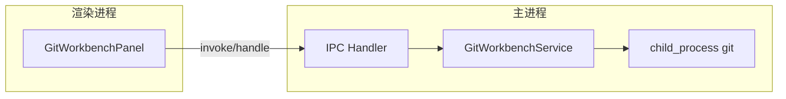
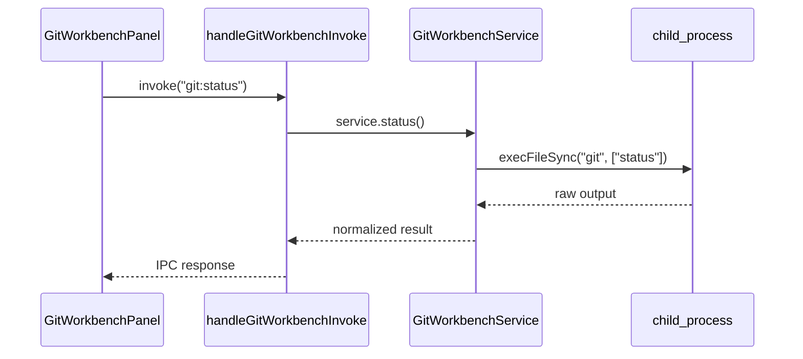
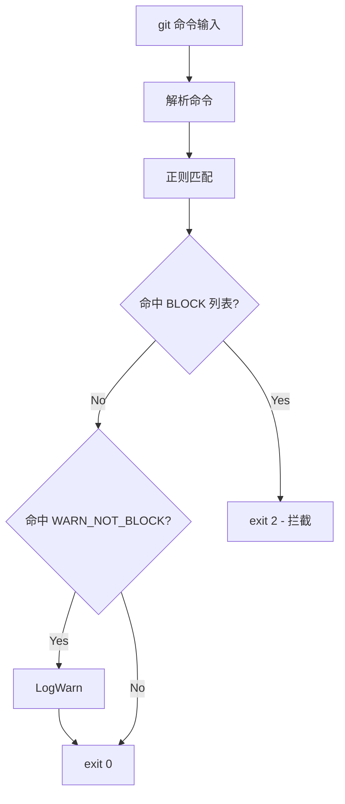
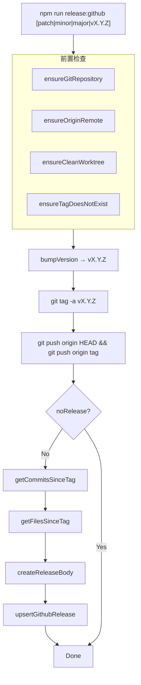
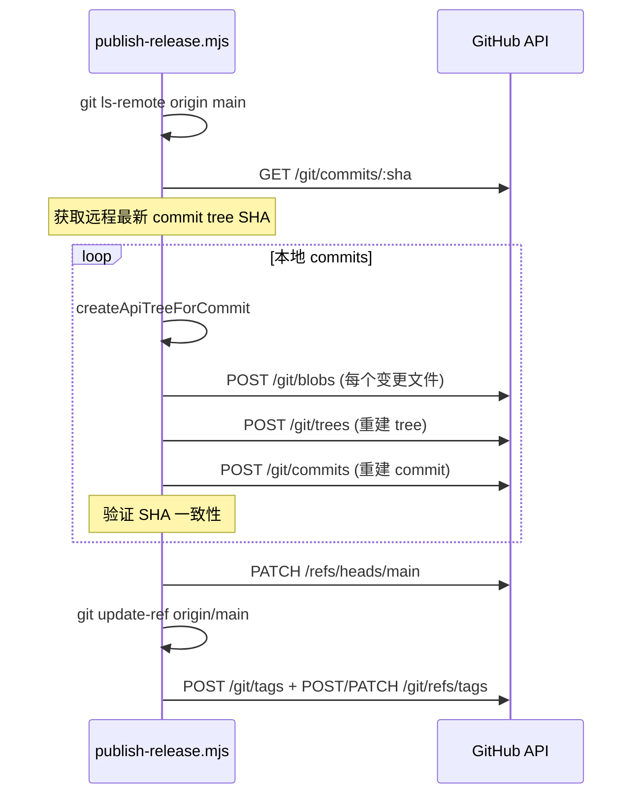
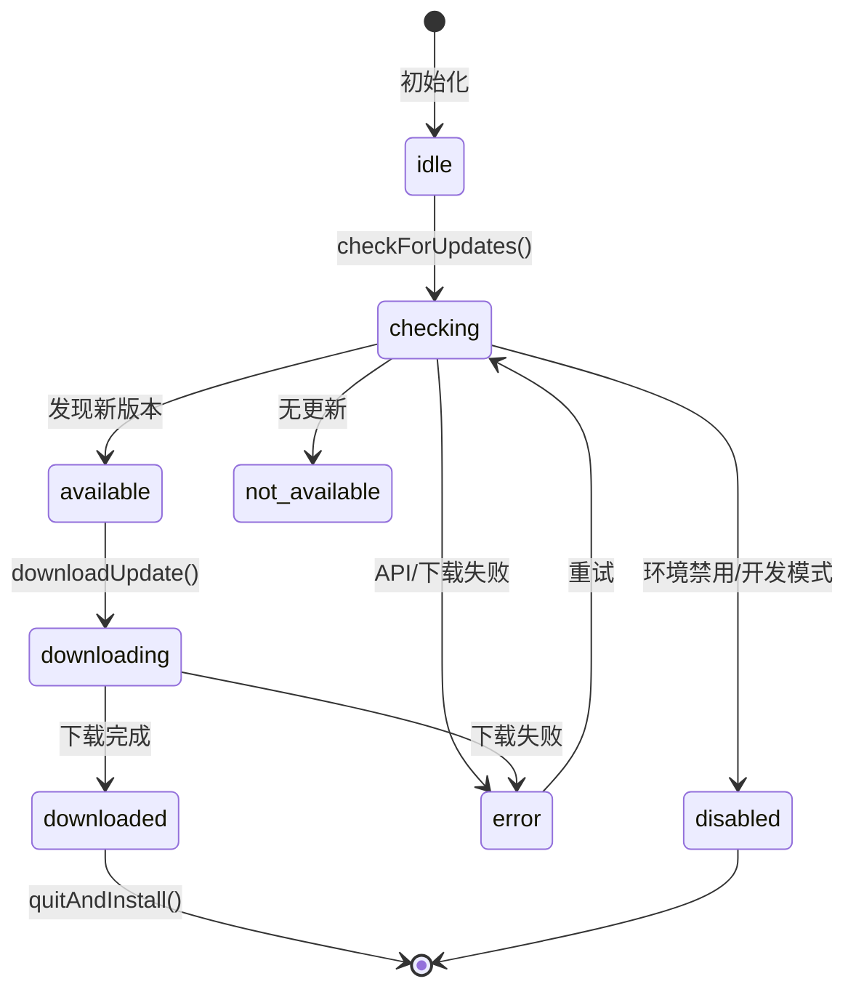
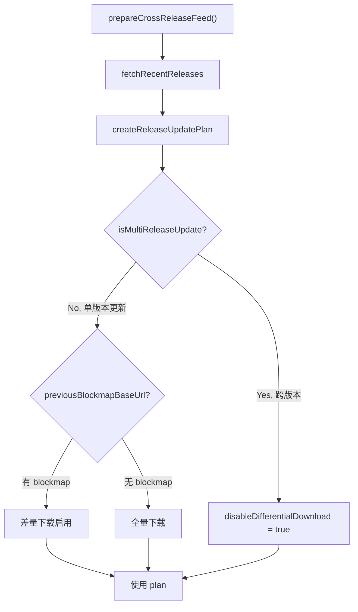

# Git 集成模块

<cite>
**本文引用的文件**
- [skills/tech-cc-hub-release-deploy/scripts/publish-release.mjs](file://skills/tech-cc-hub-release-deploy/scripts/publish-release.mjs)
- [scripts/github-release.mjs](file://scripts/github-release.mjs)
- [src/electron/libs/git/README.md](file://src/electron/libs/git/README.md)
- [src/electron/libs/git/index.ts](file://src/electron/libs/git/index.ts)
- [src/ui/components/git/index.ts](file://src/ui/components/git/index.ts)
- [src/electron/libs/auto-updater.ts](file://src/electron/libs/auto-updater.ts)
- [pro-workflow/scripts/cwd-changed.js](file://pro-workflow/scripts/cwd-changed.js)
- [pro-workflow/scripts/git-blast-radius.js](file://pro-workflow/scripts/git-blast-radius.js)
- [src/electron/libs/auto-updater-fallback.ts](file://src/electron/libs/auto-updater-fallback.ts)
</cite>

## 目录

- [概述](#概述)
- [模块边界与职责划分](#模块边界与职责划分)
- [Git 工作台服务（主进程）](#git-工作台服务主进程)
- [IPC 调用链路](#ipc-调用链路)
- [Git 安全护栏](#git-安全护栏)
- [发布与 Release 脚本](#发布与-release-脚本)
- [自动更新与 GitHub Releases](#自动更新与-github-releases)
- [数据结构与类型](#数据结构与类型)
- [失败模式与排障](#失败模式与排障)
- [扩展点](#扩展点)

---

## 概述

`tech-cc-hub` 的 Git 集成分布在多个层级，涉及：

| 层级 | 路径 | 职责 |
|------|------|------|
| UI 组件 | `src/ui/components/git/` | 渲染进程中的 Git 工作台面板 |
| 主进程服务 | `src/electron/libs/git/` | 所有 git 操作的唯一入口，禁止 Renderer 直接调用 git |
| 自动更新 | `src/electron/libs/auto-updater*.ts` | 基于 GitHub Releases 的差量更新 |
| 发布脚本 | `scripts/github-release.mjs` | 版本发布、Release 创建 |
| 回滚发布 | `skills/.../publish-release.mjs` | 通过 GitHub API 推送 commit 的兜底机制 |
| 安全护栏 | `pro-workflow/scripts/git-blast-radius.js` | 拦截危险 git 命令 |

图表来源：[src/electron/libs/git/README.md#L1-L14](file://src/electron/libs/git/README.md#L1-L14)

---

## 模块边界与职责划分

### Git 工作台边界



**允许的操作（v1）**：
- `status` / `diff`
- `stage` / `unstage`
- `commit`
- `push`（普通推送）
- `branch` 创建 / 切换
- `stash save / apply / drop`
- `recent history` / 轻量图

**禁止的操作（v1）**：
- `reset`、`rebase`、`cherry-pick`、`force push`、`amend`、`squash`、交互式 rebase

图表来源：[src/electron/libs/git/README.md#L16-L33](file://src/electron/libs/git/README.md#L16-L33)

### 职责分配

| 文件 | 职责 |
|------|------|
| `service.ts` | 唯一 Git 操作入口，聚合所有命令 |
| `ipc.ts` | Electron IPC handler 注册，暴露 invoke/handle 通道 |
| `types.ts` | 领域类型与 IPC payload/result 类型 |
| `errors.ts` | Git 错误归一化 |
| `history.ts` | commit history 解析器 |
| `graph.ts` | 轻量图 lane 生成器 |
| `operation-log.ts` | 高影响操作本地日志 |

章节来源：[src/electron/libs/git/README.md#L5-L14](file://src/electron/libs/git/README.md#L5-L14)

---

## Git 工作台服务（主进程）

### 入口导出

```typescript
// src/electron/libs/git/index.ts
export { GitWorkbenchService } from "./service.js";
export { handleGitWorkbenchInvoke, registerGitWorkbenchIpcHandlers } from "./ipc.js";
export type * from "./types.js";
```

- `GitWorkbenchService`：核心服务类，封装所有 git 操作
- `registerGitWorkbenchIpcHandlers`：在主进程启动时注册 IPC 通道
- `handleGitWorkbenchInvoke`：渲染进程调用入口

章节来源：[src/electron/libs/git/index.ts#L1-L3](file://src/electron/libs/git/index.ts#L1-L3)

### UI 组件入口

```typescript
// src/ui/components/git/index.ts
export { GitWorkbenchPanel } from "./GitWorkbenchPanel";
```

渲染进程通过此组件挂载 Git 工作台，所有与 git 的交互经由 IPC 发起。

章节来源：[src/ui/components/git/index.ts#L1-L2](file://src/ui/components/git/index.ts#L1-L2)

---

## IPC 调用链路

### 调用时序



### 关键约束

- **Renderer 禁止直接执行 git**：所有 git 调用必须经主进程转发
- **IPC 通道名称**：`git:XXX`（如 `git:status`、`git:commit`）
- **错误归一化**：通过 `errors.ts` 将 git stderr 转换为统一错误类型

章节来源：[src/electron/libs/git/README.md#L3](file://src/electron/libs/git/README.md#L3)

---

## Git 安全护栏

### Blast Radius 拦截

`git-blast-radius.js` 运行时分析 git 命令，拦截以下危险操作：



**BLOCK 列表（进程退出码 2）**：
| 危险操作 | 正则特征 |
|----------|----------|
| force push | `--force` / `-f`（不含 `--force-with-lease`）|
| remote branch delete | `refspec :ref` / `--delete` |
| hard reset | `reset --hard` |
| working-tree clean | `clean -f` |
| branch deletion | `-D` |
| checkout discard | `checkout .` |
| restore discard | `restore .` |
| interactive rebase on protected | `rebase -i` + `main\|master\|trunk\|release/` |
| history rewrite | `filter-branch` |
| stash drop/clear | `stash drop\|clear` |

**WARN_NOT_BLOCK 列表（仅警告，不拦截）**：
- `--force-with-lease` push（可追溯的 force push）

图表来源：[pro-workflow/scripts/git-blast-radius.js#L1-L63](file://pro-workflow/scripts/git-blast-radius.js#L1-L63)

### 绕过方式

```bash
export PRO_WORKFLOW_ALLOW_UNSAFE_GIT=1
```

> ⚠️ 警告：绕过安全护栏后危险操作将直接执行。

章节来源：[pro-workflow/scripts/git-blast-radius.js#L43-L54](file://pro-workflow/scripts/git-blast-radius.js#L43-L54)

### 工作区检测

`cwd-changed.js` 在目录切换时检测 Git 仓库：

```javascript
const hasGit = fs.existsSync(path.join(newCwd, '.git'));
```

检测到 `.git` 目录后输出提示信息，用于 Pro Workflow 的上下文感知。

章节来源：[pro-workflow/scripts/cwd-changed.js#L12-13](file://pro-workflow/scripts/cwd-changed.js#L12-13)

---

## 发布与 Release 脚本

### GitHub Release 创建流程

`scripts/github-release.mjs` 实现半自动化发布流程：



**前置条件检查**：
| 检查项 | 失败原因 |
|--------|----------|
| `ensureGitRepository` | 当前目录不是 git 仓库 |
| `ensureOriginRemote` | origin 远程非 lst016/tech-cc-hub |
| `ensureCleanWorktree` | 工作区有未提交变更（可用 `--allow-dirty` 绕过）|
| `ensureTagDoesNotExist` | 本地或远程已存在该 tag |

图表来源：[scripts/github-release.mjs#L183-L213](file://scripts/github-release.mjs#L183-L213)

### 命令行参数

```bash
npm run release:github [patch|minor|major|vX.Y.Z] \
  [--dry-run] \
  [--no-push] \
  [--allow-dirty] \
  [--no-release] \
  [--release-title-template "<tmpl>"] \
  [--release-note-template <path>]
```

| 参数 | 效果 |
|------|------|
| `patch`（默认） | patch 版本 +1 |
| `minor` | minor 版本 +1 |
| `major` | major 版本 +1 |
| `vX.Y.Z` | 直接指定版本号 |
| `--dry-run` | 仅打印命令，不执行 |
| `--no-push` | 创建 commit/tag 后不推送 |
| `--allow-dirty` | 允许 dirty 工作区发布 |
| `--no-release` | 不调用 GitHub API 创建 Release |
| `--release-title-template` | Release 标题模板，支持 `{tag}` 占位 |
| `--release-note-template` | 自定义 Release 正文模板路径 |

章节来源：[scripts/github-release.mjs#L37-44](file://scripts/github-release.mjs#L37-L44)

### Release 正文模板变量

| 变量 | 说明 |
|------|------|
| `{{title}}` | 解析后的标题 |
| `{{tag}}` | 标签名 |
| `{{commits}}` | commit 列表（最多 40 条）|
| `{{files}}` | 变更文件列表 |
| `{{generated_at}}` | ISO 8601 生成时间 |
| `{{source}}` | 来源说明 |

章节来源：[scripts/github-release.mjs#L319-346](file://scripts/github-release.mjs#L319-L346)

### Token 获取顺序

```typescript
function getGithubToken() {
  // 1. 环境变量
  const tokenFromEnv = process.env.GITHUB_TOKEN
    || process.env.GH_TOKEN
    || process.env.GITHUB_API_TOKEN;
  if (tokenFromEnv) return tokenFromEnv;

  // 2. git credential fill
  const result = runWithInput("git", ["credential", "fill"], "protocol=https\nhost=github.com\n\n");
  const passwordLine = result.stdout.find(line => line.startsWith("password="));
  return passwordLine?.replace(/^password=/, "").trim() ?? "";
}
```

章节来源：[scripts/github-release.mjs#L235-L252](file://scripts/github-release.mjs#L235-L252)

### API 回退发布脚本

当标准 `git push` 失败时（如 Windows git discovery failure），`publish-release.mjs` 通过 GitHub API 重建 commit 链：



**核心函数**：
| 函数 | 作用 |
|------|------|
| `createApiTreeForCommit` | 遍历 diff，逐文件创建 blob → tree |
| `readCommitIdentity` | 读取 author/committer 完整信息 |
| `assertCleanApiTree` | 验证 API 返回的 tree SHA 与本地一致 |
| `publishViaApi` | 主流程：重建 commit 链 → 更新 ref → 创建 tag |

章节来源：[skills/tech-cc-hub-release-deploy/scripts/publish-release.mjs#L251-L352](file://skills/tech-cc-hub-release-deploy/scripts/publish-release.mjs#L251-L352)

**使用方式**：
```bash
node scripts/publish-release.mjs \
  --tag v1.2.3 \
  --notes CHANGELOG.md

# 常用 flags
--api-only          # 仅使用 API 推送，跳过 git push
--notes-only        # 仅更新 release notes
--retag             # 移动已存在的 tag
--delete-release    # 删除已有 release
```

章节来源：[skills/tech-cc-hub-release-deploy/scripts/publish-release.mjs#L22-28](file://skills/tech-cc-hub-release-deploy/scripts/publish-release.mjs#L22-L28)

---

## 自动更新与 GitHub Releases

### 更新状态机



### AppUpdateStatus 结构

```typescript
type AppUpdateStatus = {
  status: AppUpdateState;        // 当前状态
  currentVersion: string;        // app.getVersion()
  isPackaged: boolean;           // 是否打包环境
  provider: "github";            // 固定为 github
  channel?: string;              // Windows ARM64: "latest-win-arm64"
  version?: string;               // 可用版本号
  releaseName?: string;          // Release 标题
  releaseDate?: string;          // 发布日期
  releaseNotes?: string;         // 更新日志
  releaseUrl?: string;           // Release 页面 URL
  checkedAt?: number;            // 检查时间戳
  progress?: {                   // 下载进度
    bytesPerSecond: number;
    percent: number;
    transferred: number;
    total: number;
  };
  error?: string;                // 错误信息
};
```

章节来源：[src/electron/libs/auto-updater.ts#L21-L51](file://src/electron/libs/auto-updater.ts#L21-L51)

### 禁用条件

自动更新在以下情况被禁用：

| 条件 | 环境变量 |
|------|----------|
| 显式禁用 | `TECH_CC_HUB_DISABLE_AUTO_UPDATE=1` |
| 代理禁用 | `AGENT_COWORK_DISABLE_AUTO_UPDATE=1` |
| CI 环境 | `CI=true` 或 `CI=1` |
| GitHub Actions | `GITHUB_ACTIONS=true` |
| 开发模式 | `app.isPackaged === false` |

章节来源：[src/electron/libs/auto-updater.ts#L90-L96](file://src/electron/libs/auto-updater.ts#L90-L96)

### 更新元数据平台映射

```typescript
function getPlatformUpdateMetadataCandidates(platform, arch): string[] {
  if (platform === 'darwin') return ['latest-mac.yml'];
  if (platform === 'linux') return ['latest-linux.yml'];
  if (platform === 'win32') {
    return arch === 'arm64'
      ? ['latest-win-arm64.yml', 'latest.yml']
      : ['latest.yml'];
  }
  return [];
}
```

章节来源：[src/electron/libs/auto-updater-fallback.ts#L57-L64](file://src/electron/libs/auto-updater-fallback.ts#L57-L64)

### 差量下载决策



章节来源：[src/electron/libs/auto-updater.ts#L262-L296](file://src/electron/libs/auto-updater.ts#L262-L296)

### Fallback 兜底机制

当 `electron-updater` 因缺少平台元数据失败时：

1. `isMissingPlatformUpdateMetadataError()` 检测错误类型
2. `selectBestReleaseForUpdate()` 遍历 GitHub API 返回的 releases
3. 优先选择有对应平台 `.yml` 元数据的 release
4. 返回 `unsupported` 或 `error` 状态，附带手动下载链接

章节来源：[src/electron/libs/auto-updater.ts#L298-L342](file://src/electron/libs/auto-updater.ts#L298-L342)

---

## 数据结构与类型

### Git 工作台核心类型（types.ts）

| 类型 | 说明 |
|------|------|
| `GitStatus` | 工作区状态（staged/unstaged/untracked）|
| `GitDiff` | 文件差异内容 |
| `GitCommit` | 提交信息（hash、message、author、date）|
| `GitBranch` | 分支信息（name、current、upstream）|
| `GitStashEntry` | stash 条目 |
| `GitHistoryEntry` | 历史记录条目 |

> 具体字段定义请参考 `src/electron/libs/git/types.ts`

章节来源：[src/electron/libs/git/README.md#L7](file://src/electron/libs/git/README.md#L7)

### GitHub Release 类型

```typescript
type GitHubReleaseLike = {
  tag_name?: unknown;
  name?: unknown;
  html_url?: unknown;
  published_at?: unknown;
  body?: unknown;
  assets?: unknown;
};

type ReleaseFallbackInfo = {
  tagName?: string;
  version?: string;
  releaseName?: string;
  releaseDate?: string;
  releaseNotes?: string;
  releaseUrl?: string;
  metadataFile?: string;
  hasCompatibleUpdateMetadata: boolean;
};
```

章节来源：[src/electron/libs/auto-updater-fallback.ts#L1-L23](file://src/electron/libs/auto-updater-fallback.ts#L1-L23)

---

## 失败模式与排障

### Git 工作台

| 症状 | 可能原因 | 排查步骤 |
|------|----------|----------|
| IPC 调用超时 | git 命令执行时间过长 | 检查网络延迟、仓库大小 |
| `not a git repository` | 当前目录无 `.git` | 确认工作目录 |
| Permission denied | SSH key 未配置 / token 过期 | 检查 `git credential fill` |

### Release 发布

| 症状 | 可能原因 | 解决方案 |
|------|----------|----------|
| `Missing GitHub token` | 环境变量未设置、credential manager 未登录 | 设置 `GH_TOKEN` 或运行 `git credential fill` |
| `origin/main is not an ancestor of HEAD` | 本地分支与远程分叉 | 先 `git fetch origin && git rebase origin/main` |
| `Tag already exists` | 本地或远程已存在该 tag | 使用 `--retag` 移动 tag，或更换版本号 |
| Windows push failure | git discovery failure | 脚本会自动 fallback 到 API 推送 |

章节来源：[skills/tech-cc-hub-release-deploy/scripts/publish-release.mjs#L269](file://skills/tech-cc-hub-release-deploy/scripts/publish-release.mjs#L269)

### 自动更新

| 症状 | 可能原因 | 解决方案 |
|------|----------|----------|
| `disabled: 开发模式不会检查更新` | `app.isPackaged === false` | 正常行为，打包后自动启用 |
| `unsupported: 没有当前平台的元数据` | Release 未上传 `latest.yml` | 确认 GitHub Actions 上传了正确的 installer |
| `error: 404 not found latest.yml` | Release assets 中缺少元数据文件 | 检查 build 流程是否生成 `.yml` 文件 |

章节来源：[src/electron/libs/auto-updater.ts#L325](file://src/electron/libs/auto-updater.ts#L325)

### 安全护栏

| 症状 | 原因 | 绕过方式 |
|------|------|----------|
| `exit 2 - blocked` | 命令命中危险操作正则 | `export PRO_WORKFLOW_ALLOW_UNSAFE_GIT=1` |
| `force-with-lease push caution` | 使用了 `--force-with-lease` | 正常放行，仅警告 |

章节来源：[pro-workflow/scripts/git-blast-radius.js#L52-55](file://pro-workflow/scripts/git-blast-radius.js#L52-L55)

---

## 扩展点

### 1. 新增 Git 命令支持

在 `src/electron/libs/git/service.ts` 中添加新方法，然后更新 `ipc.ts` 注册对应 handler：

```typescript
// service.ts
async newCommand(args: string[]): Promise<NewResult> {
  // 实现逻辑
}

// ipc.ts
ipcMain.handle("git:newCommand", async (event, args) => {
  return service.newCommand(args);
});
```

### 2. 添加新的安全护栏规则

在 `pro-workflow/scripts/git-blast-radius.js` 的 `BLOCK` 数组中追加新规则：

```javascript
const BLOCK = [
  // ...existing rules...
  {
    name: 'dangerous operation',
    re: sub(/dangerous\s+subcommand/)
  },
];
```

### 3. 扩展 Release 模板变量

在 `scripts/github-release.mjs` 的 `createReleaseBody()` 中添加新占位符处理：

```javascript
.replaceAll("{{new_var}}", computeNewVar())
```

### 4. 多平台更新元数据

在 `auto-updater-fallback.ts` 中扩展 `getPlatformUpdateMetadataCandidates()`：

```typescript
if (platform === 'freebsd') {
  return ['latest-freebsd.yml'];
}
```

### 5. 通知渠道集成

`AppAutoUpdater` 的 `onStatus()` 方法支持注册监听器，可扩展邮件/Slack 通知：

```typescript
updater.onStatus((status) => {
  if (status.status === 'downloaded') {
    notifyUser(status.version);
  }
});
```

章节来源：[src/electron/libs/auto-updater.ts#L164-L170](file://src/electron/libs/auto-updater.ts#L164-L170)

---

## 总结

`tech-cc-hub` 的 Git 集成由以下部分组成：

1. **Git 工作台**（`src/electron/libs/git/`）：主进程中的唯一 git 操作入口，Renderer 通过 IPC 调用
2. **安全护栏**（`pro-workflow/scripts/git-blast-radius.js`）：在执行前拦截危险 git 命令
3. **Release 发布**（`scripts/github-release.mjs`）：自动化版本发布与 GitHub Release 创建
4. **API 兜底发布**（`skills/.../publish-release.mjs`）：当 git push 失败时通过 GitHub API 重建 commit 链
5. **自动更新**（`src/electron/libs/auto-updater*.ts`）：基于 GitHub Releases 的差量更新机制