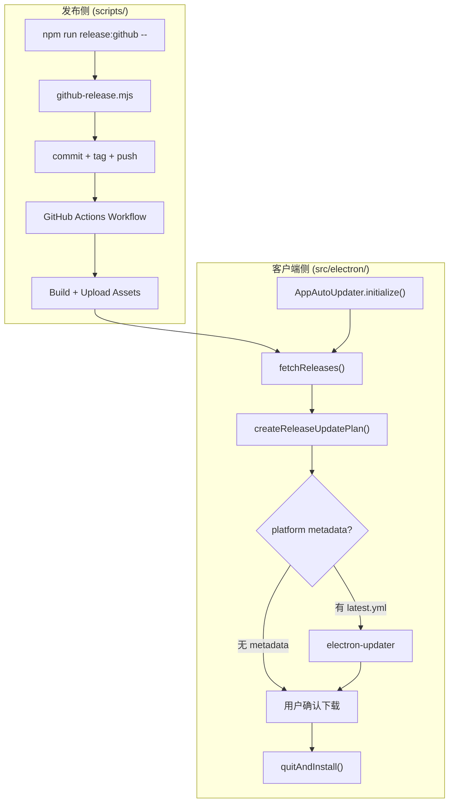
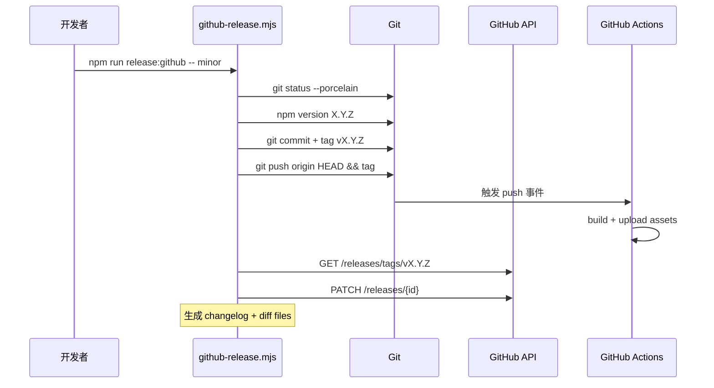
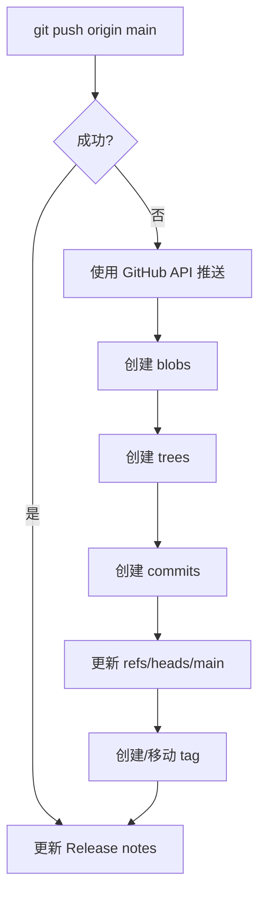

# GitHub Release 自动更新

<cite>
**本文引用的文件**
- [scripts/github-release.mjs](file://scripts/github-release.mjs)
- [src/electron/libs/auto-updater.ts](file://src/electron/libs/auto-updater.ts)
- [skills/tech-cc-hub-release-deploy/scripts/publish-release.mjs](file://skills/tech-cc-hub-release-deploy/scripts/publish-release.mjs)
- [src/electron/libs/auto-updater-fallback.ts](file://src/electron/libs/auto-updater-fallback.ts)
- [doc/80-operations/github-release-autoupdate-runbook.md](file://doc/80-operations/github-release-autoupdate-runbook.md)
- [skills/tech-cc-hub-release-deploy/SKILL.md](file://skills/tech-cc-hub-release-deploy/SKILL.md)
- [skills/tech-cc-hub-release-deploy/agents/openai.yaml](file://skills/tech-cc-hub-release-deploy/agents/openai.yaml)
- [pro-workflow/skills/wiki-research-loop/scripts/source-fetchers/github.js](file://pro-workflow/skills/wiki-research-loop/scripts/source-fetchers/github.js)
- [src/electron/libs/system-prompt-presets.ts](file://src/electron/libs/system-prompt-presets.ts)
</cite>

# GitHub Release 自动更新

本篇文档描述 tech-cc-hub 如何实现桌面端自动更新：包括 Release 创建、electron-updater 检测与下载、跨平台元数据兜底、以及 Windows 推送失败的 API Fallback 机制。

## 目录

- [系统架构总览](#系统架构总览)
- [发布入口与版本管理](#发布入口与版本管理)
- [electron-updater 核心组件](#electron-updater-核心组件)
- [跨平台更新元数据选择](#跨平台更新元数据选择)
- [自动更新状态机](#自动更新状态机)
- [Windows Git Push 故障恢复](#windows-git-push-故障恢复)
- [GitHub Release 产物验收](#github-release-产物验收)
- [排障与回滚策略](#排障与回滚策略)
- [扩展点与自定义](#扩展点与自定义)

---

## 系统架构总览

自动更新链路分为**发布侧**和**客户端侧**两个环节：



**图表来源**：[src/electron/libs/auto-updater.ts#L1-L476](file://src/electron/libs/auto-updater.ts#L1-L476)，[scripts/github-release.mjs#L387-L439](file://scripts/github-release.mjs#L387-L439)

关键设计原则：
- **不部署自有更新服务器**，依赖 GitHub Releases + GitHub Actions 基础设施
- macOS 包在 `macos-14` runner 构建，Windows 包在 `windows-latest` runner 构建
- 客户端启动 3 秒后自动检查更新（非阻塞）
- 内容热更新（skills/prompts/rules）独立于 Electron 主程序整包更新

---

## 发布入口与版本管理

### 常用命令

| 命令 | 行为 |
|------|------|
| `npm run release:github -- patch` | 升级 patch 版本（如 1.0.0 → 1.0.1） |
| `npm run release:github -- minor` | 升级 minor 版本（如 1.0.0 → 1.1.0） |
| `npm run release:github -- v1.2.3` | 直接指定目标版本 |
| `npm run release:github -- patch --dry-run` | 预览，不写文件不打 tag |
| `npm run release:github -- patch --no-push` | 只生成本地 commit 和 tag |

[章节来源](file://scripts/github-release.mjs#L37-L42)

### 脚本执行流程

`github-release.mjs` 的 `main()` 函数（第 387-439 行）按顺序执行：

1. **环境检查**：验证是 Git 仓库、origin 指向正确仓库、工作区干净
2. **版本计算**：调用 `bumpVersion()` 根据 `patch|minor|major|vX.Y.Z` 计算新版本
3. **文件更新**：更新 `package.json`（和 `package-lock.json`）
4. **Git 操作**：创建 commit → 创建 annotated tag → push 分支和 tag
5. **Release 更新**：调用 `upsertGithubRelease()` 通过 GitHub API 更新 Release body



**图表来源**：[scripts/github-release.mjs#L387-L439](file://scripts/github-release.mjs#L387-L439)

### 参数与模板定制

| 参数 | 作用 |
|------|------|
| `--release-title-template` | 自定义 Release 标题模板，默认 `## {tag} 版本更新` |
| `--release-note-template` | 指定自定义 Release body 模板文件路径 |
| `--allow-dirty` | 允许工作区有未提交文件（不推荐） |

Token 获取优先级：`GITHUB_TOKEN` → `GH_TOKEN` → `git credential fill`

---

## electron-updater 核心组件

### AppAutoUpdater 类

`src/electron/libs/auto-updater.ts` 导出一个单例类 `AppAutoUpdater`，封装了 electron-updater 的所有交互逻辑。

#### 初始化流程

```typescript
// 第 130-162 行
initialize(listener?: AppUpdateStatusListener): void {
  this.registerEventHandlers();
  if (isAutoUpdateDisabled()) {
    this.setStatus({ status: "disabled" });
    return;
  }
  if (!app.isPackaged) {
    this.setStatus({ status: "disabled" }); // 开发模式禁用
    return;
  }
  setTimeout(() => void this.checkForUpdates(true), 3000);
}
```

**禁用条件**（第 90-96 行）：
- `TECH_CC_HUB_DISABLE_AUTO_UPDATE=1`
- `AGENT_COWORK_DISABLE_AUTO_UPDATE=1`
- `CI=true` 或 `CI=1` 或 `GITHUB_ACTIONS=true`

#### 核心方法

| 方法 | 作用 | 返回值 |
|------|------|--------|
| `onStatus(listener)` | 订阅状态变更 | unsubscribe 函数 |
| `getStatus()` | 获取当前状态 | `AppUpdateStatus` |
| `checkForUpdates(silent?)` | 触发检查 | `AppUpdateActionResult` |
| `downloadUpdate()` | 下载可用更新 | `AppUpdateActionResult` |
| `quitAndInstall()` | 退出并安装 | `AppUpdateActionResult` |

**章节来源**：[src/electron/libs/auto-updater.ts#L130-L378](file://src/electron/libs/auto-updater.ts#L130-L378)

### 状态类型定义

```typescript
// 第 21-51 行
export type AppUpdateState =
  | "idle"
  | "disabled"
  | "checking"
  | "available"
  | "not-available"
  | "downloading"
  | "downloaded"
  | "unsupported"
  | "error";

export type AppUpdateStatus = {
  status: AppUpdateState;
  currentVersion: string;
  isPackaged: boolean;
  provider: "github";
  channel?: string;         // win-arm64 时为 "latest-win-arm64"
  version?: string;         // 目标版本
  releaseName?: string;
  releaseDate?: string;
  releaseNotes?: string;
  releaseUrl?: string;
  checkedAt?: number;
  progress?: {              // 下载进度
    bytesPerSecond: number;
    percent: number;
    transferred: number;
    total: number;
  };
  error?: string;
};
```

---

## 跨平台更新元数据选择

### 平台元数据映射

`auto-updater-fallback.ts` 第 57-64 行定义了各平台所需的 metadata 文件：

| 平台 | 架构 | metadata 文件 |
|------|------|---------------|
| darwin | any | `latest-mac.yml` |
| linux | any | `latest-linux.yml` |
| win32 | arm64 | `latest-win-arm64.yml` → `latest.yml` |
| win32 | x64 | `latest.yml` |

### 版本比较逻辑

`compareAppVersions()` 函数（第 42-55 行）实现语义化版本比较，自动去除前缀 `v` 和后缀 `-beta` 等：

```typescript
compareAppVersions("1.0.0", "1.1.0-beta")  // 返回 -1
compareAppVersions("v2.0.0", "1.9.9")      // 返回 1
```

### Release 选择策略

`createReleaseUpdatePlan()` 函数（第 116-146 行）返回完整更新方案：

```typescript
export type ReleaseUpdatePlan = {
  selectedRelease: ReleaseFallbackInfo | null;  // 目标版本
  currentRelease: ReleaseFallbackInfo | null;   // 当前版本（用于 blockmap）
  isMultiReleaseUpdate: boolean;                // 是否跨越多个版本
  previousBlockmapBaseUrl?: string;            // 差分包基础 URL
};
```

选择规则：
1. 过滤出所有 `version > currentVersion` 的 Release
2. 按版本号降序排序
3. 优先选择有平台对应 `latest.yml` 的 Release
4. 若无可用 metadata，返回第一个候选（`unsupported` 状态）

### 差分下载决策

- **单版本更新**：启用 blockmap 差分下载（`previousBlockmapBaseUrl`）
- **跨版本更新**：禁用差分下载，下载完整包（避免 blockmap 链断裂）

**章节来源**：[src/electron/libs/auto-updater-fallback.ts#L116-L146](file://src/electron/libs/auto-updater-fallback.ts#L116-L146)

---

## 自动更新状态机

### 状态流转图

```mermaid
stateDiagram-v2
    [*] --> idle: initialize()
    idle --> checking: checkForUpdates()
    checking --> available: update-available
    checking --> not-available: update-not-available
    checking --> error: electron-updater 异常
    checking --> unsupported: 404 + 无 metadata
    available --> downloading: 用户触发下载
    downloading --> downloaded: update-downloaded
    downloaded --> [*]: quitAndInstall()
    error --> [*]: 显示错误信息
    unsupported --> [*]: 提示手动下载
```

### 事件监听注册

`AppAutoUpdater` 在初始化时注册以下事件（第 380-442 行）：

| 事件 | 触发时机 | 状态变化 |
|------|----------|----------|
| `checking-for-update` | 开始检查 | `checking` |
| `update-available` | 发现新版本 | `available` + 填充 version/releaseName/notes |
| `update-not-available` | 无新版本 | `not-available` |
| `download-progress` | 下载中 | `downloading` + progress 进度 |
| `update-downloaded` | 下载完成 | `downloaded` |
| `error` | 任何异常 | `error` |

### Fallback 触发条件

当 `electron-updater` 抛出 404 错误且包含 `latest.yml` 或 `update info` 关键字时（第 32-36 行），系统进入 Fallback 模式：

1. 调用 `fetchRecentReleases()` 获取最近 30 个 Release
2. 调用 `selectBestReleaseForUpdate()` 选择最佳候选
3. 若候选无 metadata，设置状态为 `unsupported` 并展示手动下载链接
4. 若候选有 metadata 但其他错误，设置状态为 `error` 并保留 originalError

**章节来源**：[src/electron/libs/auto-updater.ts#L298-L342](file://src/electron/libs/auto-updater.ts#L298-L342)

---

## Windows Git Push 故障恢复

### 问题背景

Windows 环境下某些路径组合可能导致 `git push` 失败并报错 `fatal: not a git repository (or any of the parent directories): .git`。

### API Fallback 机制

`publish-release.mjs`（第 354-386 行）实现了 GitHub API 直推机制：



**限制条件**：
- 远端 `main` 必须是本地 `HEAD` 的祖先
- 只支持线性提交范围（无 merge commits）
- 远端 commit SHA 必须与本地完全一致（校验 tree SHA）

### 常用命令

| 场景 | 命令 |
|------|------|
| 正常推送 | `node scripts/publish-release.mjs` |
| API 直推 | `node scripts/publish-release.mjs --api-only` |
| 移动 tag | `node scripts/publish-release.mjs --tag v0.1.13 --retag` |
| 删除 Release | `node scripts/publish-release.mjs --tag v0.1.13 --delete-release` |
| 仅更新 Release notes | `node scripts/publish-release.mjs --tag v0.1.13 --notes path/to/notes.md --notes-only` |
| 重发完整 Release | `node scripts/publish-release.mjs --tag v0.1.13 --retag --delete-release` |

**章节来源**：[skills/tech-cc-hub-release-deploy/scripts/publish-release.mjs#L354-L386](file://skills/tech-cc-hub-release-deploy/scripts/publish-release.mjs#L354-L386)

### 推送后验证

API fallback 成功后验证三者 SHA 一致：

```bash
git rev-parse HEAD
git rev-parse origin/main
git ls-remote --heads origin main
```

若不一致，检查脚本输出的 tree/commit mismatch 错误。

---

## GitHub Release 产物验收

### 必需资产

一个可用于自动更新的 Release 必须包含以下文件：

| 文件类型 | Windows | macOS |
|----------|---------|-------|
| 安装包 | `.exe` (NSIS) | `.dmg` |
| 分发包 | `.zip` | `.zip` |
| 更新元数据 | `latest.yml` | `latest-mac.yml` (arm64: `latest-mac-arm64.yml`) |
| 差分更新 | `latest.yml.blockmap` | `latest-mac.yml.blockmap` |

若 `latest.yml` 缺失，`electron-updater` 会抛出 404 并触发 Fallback 逻辑。

### 发布后检查清单

1. 打开 [https://github.com/lst016/tech-cc-hub/releases](https://github.com/lst016/tech-cc-hub/releases)
2. 确认目标 tag 对应的 Release 包含上述资产
3. 确认 `latest.yml` 可访问（直接在浏览器打开验证）

**章节来源**：[doc/80-operations/github-release-autoupdate-runbook.md#L84-L100](file://doc/80-operations/github-release-autoupdate-runbook.md#L84-L100)

---

## 排障与回滚策略

### 常见问题

| 问题 | 可能原因 | 解决方案 |
|------|----------|----------|
| 客户端显示 `disabled` | 开发模式或 CI 环境 | 正常行为，非打包环境自动禁用 |
| 显示 `unsupported` | Release 缺少平台 metadata | 确认构建产物是否完整上传 |
| 下载卡住 | 网络问题或 metadata 有误 | 检查 `latest.yml` 内容，尝试手动下载 |
| 状态一直是 `checking` | electron-updater 异常 | 查看 electron-log，检查 GitHub API 连通性 |

### 日志查看

`electron-updater` 使用 `electron-log`，日志位于：
- Windows: `%APPDATA%/tech-cc-hub/logs/`
- macOS: `~/Library/Logs/tech-cc-hub/`

### 回滚策略

> 不建议删除并重发同一个 tag，客户端和缓存可能已经看到旧 metadata。

若 Release 有问题：
1. 在 GitHub Release 页面标记问题版本说明
2. 修复后发布更高版本号
3. 客户端下次检查会获取新版本

**章节来源**：[doc/80-operations/github-release-autoupdate-runbook.md#L121-L128](file://doc/80-operations/github-release-autoupdate-runbook.md#L121-L128)

---

## 扩展点与自定义

### 自定义 Release 模板

通过 `--release-note-template` 参数指定自定义模板文件：

```bash
npm run release:github -- patch --release-note-template .github/release-template.md
```

模板变量：
- `{{title}}` - Release 标题
- `{{tag}}` - Tag 名称
- `{{commits}}` - 提交列表
- `{{files}}` - 变更文件列表
- `{{generated_at}}` - 生成时间（ISO 8601）
- `{{source}}` - 来源说明

### 平台特定更新渠道

Windows ARM64 设备使用 `latest-win-arm64` 渠道（第 61-67 行）：

```typescript
function getUpdateChannel(): string | undefined {
  const { platform, arch } = process;
  if (platform === "win32" && arch === "arm64") {
    return "latest-win-arm64";
  }
  return undefined;
}
```

### Release Agent 接口

`tech-cc-hub-release-deploy` skill 提供给 Agent 的接口定义（[openai.yaml](file://skills/tech-cc-hub-release-deploy/agents/openai.yaml#L1-L4)）：

```yaml
interface:
  display_name: "tech-cc-hub 发布部署"
  short_description: "提交、推送、移动 tag、打包并更新 tech-cc-hub 的 GitHub Release。"
```

Agent 可直接调用 `publish-release.mjs` 执行完整发布流程。

---

## 相关文档

- [GitHub Releases 自动更新发布流程 Runbook](file://doc/80-operations/github-release-autoupdate-runbook.md) - 操作指南
- [tech-cc-hub-release-deploy SKILL](file://skills/tech-cc-hub-release-deploy/SKILL.md) - Skill 使用说明
- [electron-updater 官方文档](https://www.electron.build/auto-update) - electron-updater 完整 API