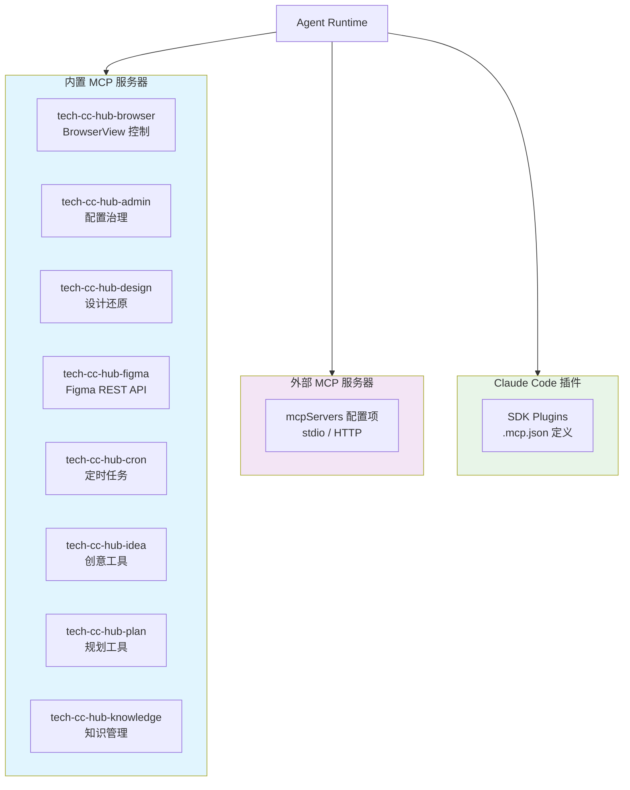
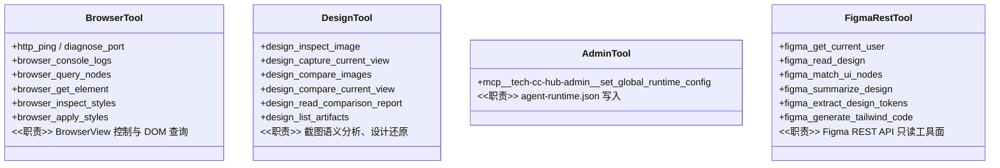
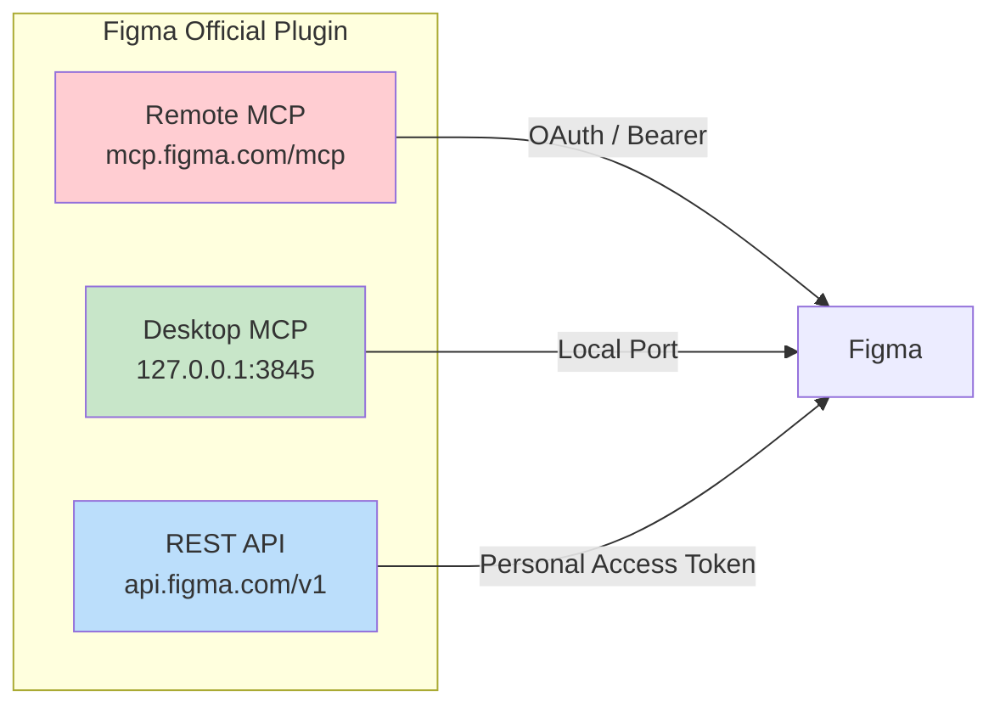

# MCP 工具系统

<cite>
**本文引用的文件**
- [src/electron/libs/system-prompt-presets.ts](file://src/electron/libs/system-prompt-presets.ts)
- [src/electron/libs/mcp-tools/README.md](file://src/electron/libs/mcp-tools/README.md)
- [src/electron/main.ts](file://src/electron/main.ts)
- [skills/tech-cc-hub-release-deploy/scripts/publish-release.mjs](file://skills/tech-cc-hub-release-deploy/scripts/publish-release.mjs)
- [scripts/github-release.mjs](file://scripts/github-release.mjs)
- [src/electron/libs/builtin-mcp-servers.ts](file://src/electron/libs/builtin-mcp-servers.ts)
- [src/electron/libs/claude-code-plugins.ts](file://src/electron/libs/claude-code-plugins.ts)
- [src/electron/libs/external-mcp-servers.ts](file://src/electron/libs/external-mcp-servers.ts)
- [src/electron/libs/figma-official-plugin.ts](file://src/electron/libs/figma-official-plugin.ts)
</cite>

# MCP 工具系统

本文档描述 tech-cc-hub 中 MCP（Model Context Protocol）工具系统的架构、注册机制、调用链路和扩展点。

## 目录

- [系统概览](#系统概览)
- [工具分类与职责边界](#工具分类与职责边界)
- [内置 MCP 服务器注册](#内置-mcp-服务器注册)
- [外部 MCP 服务器配置](#外部-mcp-服务器配置)
- [Claude Code 插件集成](#claude-code-插件集成)
- [Figma 官方 MCP 插件](#figma-官方-mcp-插件)
- [System Prompt 注入机制](#system-prompt-注入机制)
- [工具调用优化策略](#工具调用优化策略)
- [故障排查与状态流](#故障排查与状态流)
- [扩展点说明](#扩展点说明)

## 系统概览

tech-cc-hub 的 MCP 工具系统分为三大类别：



**图表来源**：[src/electron/libs/builtin-mcp-servers.ts#L23-L32](file://src/electron/libs/builtin-mcp-servers.ts#L23-L32)

### 核心入口文件

| 文件 | 职责 |
|------|------|
| `builtin-mcp-servers.ts` | 定义内置服务器工厂和工具名映射 |
| `external-mcp-servers.ts` | 解析 `agent-runtime.json` 中的外部服务器 |
| `claude-code-plugins.ts` | 读取 Claude Code SDK 插件的 `.mcp.json` |
| `system-prompt-presets.ts` | 生成引导 Agent 正确使用工具的 System Prompt |
| `figma-official-plugin.ts` | Figma 官方 MCP 的认证和连接管理 |

## 工具分类与职责边界

### 内置工具（`src/electron/libs/mcp-tools/`）



**图表来源**：[src/electron/libs/mcp-tools/README.md#L1-L22](file://src/electron/libs/mcp-tools/README.md#L1-L22)

#### 工具默认触发规则

1. **Browser 工具**：用户提到浏览、截图、DOM 检查、控制台日志时触发
2. **Design 工具**：用户提供截图/Figma 图并要求生成或修改 UI/前端代码时触发
3. **Admin 工具**：需要写入全局运行时配置（`env`、`skillCredentials`）时触发
4. **Figma REST 工具**：涉及 Figma 文件读取、设计树、token 提取时触发

**章节来源**：[src/electron/libs/system-prompt-presets.ts#L12-L18](file://src/electron/libs/system-prompt-presets.ts#L12-L18)

## 内置 MCP 服务器注册

### 服务器工厂模式

`builtin-mcp-servers.ts` 使用工厂函数模式，按需创建 MCP 服务器实例：

```typescript
// 工厂函数签名
type BuiltinMcpFactoryContext = {
  sessionId: string;
  cwd?: string;
};

type BuiltinMcpFactory = (context: BuiltinMcpFactoryContext) => McpSdkServerConfigWithInstance;
```

**章节来源**：[src/electron/libs/builtin-mcp-servers.ts#L16-L21](file://src/electron/libs/builtin-mcp-servers.ts#L16-L21)

### 注册表结构

| 服务器名 | 工厂函数 | 依赖参数 | 工具数量 |
|---------|---------|---------|---------|
| `tech-cc-hub-browser` | `getBrowserMcpServer` | `sessionId` | 7+ |
| `tech-cc-hub-admin` | `getAdminMcpServer` | 无 | 1 |
| `tech-cc-hub-design` | `getDesignMcpServer` | `sessionId` | 6+ |
| `tech-cc-hub-figma` | `getFigmaRestMcpServer` | 无 | 14 |
| `tech-cc-hub-cron` | `getCronMcpServer` | 无 | 3+ |
| `tech-cc-hub-idea` | `getIdeaMcpServer` | 无 | ? |
| `tech-cc-hub-plan` | `getPlanMcpServer` | 无 | ? |
| `tech-cc-hub-knowledge` | `getKnowledgeMcpServer` | `cwd` | ? |

**章节来源**：[src/electron/libs/builtin-mcp-servers.ts#L23-L32](file://src/electron/libs/builtin-mcp-servers.ts#L23-L32)

### 获取启用的服务器

```typescript
function getBuiltinMcpServers(
  contextOrSessionId: string | BuiltinMcpFactoryContext,
  enabledServerNames?: readonly BuiltinMcpServerName[],
): Record<string, McpSdkServerConfigWithInstance>;
```

- **参数**：`enabledServerNames` 可选，指定白名单；为 `null` 时返回全部
- **返回值**：`Record<服务器名, 服务器实例>`

**章节来源**：[src/electron/libs/builtin-mcp-servers.ts#L45-L59](file://src/electron/libs/builtin-mcp-servers.ts#L45-L59)

## 外部 MCP 服务器配置

### 配置来源

外部 MCP 服务器从 `agent-runtime.json` 的 `mcpServers` 字段读取：

```json
{
  "mcpServers": {
    "my-server": {
      "type": "stdio",
      "command": "npx",
      "args": ["-y", "@modelcontextprotocol/server-filesystem", "/path"],
      "env": { "CLAUDE_PROJECT_DIR": "/project" }
    },
    "http-server": {
      "type": "http",
      "url": "https://mcp.example.com/mcp",
      "headers": { "Authorization": "Bearer token" }
    }
  }
}
```

**章节来源**：[src/electron/libs/external-mcp-servers.ts#L1-L19](file://src/electron/libs/external-mcp-servers.ts#L1-L19)

### 支持的传输类型

| 类型 | 必需字段 | 可选字段 |
|------|---------|---------|
| `stdio` | `command` | `args`, `env` |
| `http` | `url` | `headers` |

**章节来源**：[src/electron/libs/external-mcp-servers.ts#L105-L138](file://src/electron/libs/external-mcp-servers.ts#L105-L138)

### 环境变量注入

对于 stdio 类型服务器，若配置了 `projectDir`，系统会自动注入 `CLAUDE_PROJECT_DIR` 环境变量：

```typescript
function withClaudeProjectDirEnv(
  env: Record<string, string> | undefined,
  projectDir: string | undefined,
): Record<string, string> | undefined {
  const normalizedProjectDir = projectDir?.trim();
  if (!normalizedProjectDir) return env;
  return { CLAUDE_PROJECT_DIR: normalizedProjectDir, ...(env ?? {}) };
}
```

**章节来源**：[src/electron/libs/external-mcp-servers.ts#L140-L147](file://src/electron/libs/external-mcp-servers.ts#L140-L147)

### 工具名匹配规则

工具调用时通过前缀匹配识别所属服务器：

```
mcp__<serverName>__<toolName>
<serverName>__<toolName>
<serverName>:<toolName>
<serverName>/<toolName>
```

**章节来源**：[src/electron/libs/external-mcp-servers.ts#L91-L103](file://src/electron/libs/external-mcp-servers.ts#L91-L103)

## Claude Code 插件集成

### 插件目录扫描

系统从 `~/.claude/plugins/` 读取已安装插件列表：

```typescript
// installed_plugins.json 结构
{
  "plugins": {
    "figma@claude-plugins-official": [
      { "installPath": "/path/to/plugin" }
    ]
  }
}
```

**章节来源**：[src/electron/libs/claude-code-plugins.ts#L83-L98](file://src/electron/libs/claude-code-plugins.ts#L83-L98)

### 插件可加载性判断

插件目录必须包含以下之一：

- `.claude-plugin/plugin.json`
- `.mcp.json`

**章节来源**：[src/electron/libs/claude-code-plugins.ts#L129-L131](file://src/electron/libs/claude-code-plugins.ts#L129-L131)

### 插件启用状态

从 `settings.json` 或 `settings.local.json` 读取 `enabledPlugins` 字段：

```typescript
function readEnabledPlugins(claudeRoot: string): Record<string, boolean>;
```

**章节来源**：[src/electron/libs/claude-code-plugins.ts#L100-L116](file://src/electron/libs/claude-code-plugins.ts#L100-L116)

## Figma 官方 MCP 插件

### 连接模式

Figma 官方插件支持三种连接模式：



**图表来源**：[src/electron/libs/figma-official-plugin.ts#L26](file://src/electron/libs/figma-official-plugin.ts#L26)

| 模式 | URL | 认证方式 |
|------|-----|---------|
| `remote` | `https://mcp.figma.com/mcp` | OAuth |
| `desktop` | `http://127.0.0.1:3845/mcp` | 无需认证 |
| `rest` | `https://api.figma.com/v1` | Personal Access Token |

**章节来源**：[src/electron/libs/figma-official-plugin.ts#L3-L5](file://src/electron/libs/figma-official-plugin.ts#L3-L5)

### OAuth 提供者

```typescript
export type FigmaOfficialOAuthProvider = "direct" | "codex" | "pat";
```

- `direct`：用户直接在 Figma 授权
- `codex`：通过 Codex OAuth 流程
- `pat`：Personal Access Token（用于 REST API 模式）

**章节来源**：[src/electron/libs/figma-official-plugin.ts#L27](file://src/electron/libs/figma-official-plugin.ts#L27)

### 插件状态枚举

```typescript
export type FigmaOfficialPluginStatusKind =
  | "not-configured"    // 尚未配置
  | "configured"       // 已配置但未认证
  | "needs-auth"       // 需要认证
  | "auth-expired"     // 认证已过期
  | "desktop-unavailable" // Desktop MCP 不可用
  | "misconfigured"    // 配置异常
  | "ready";           // 就绪可用
```

**章节来源**：[src/electron/libs/figma-official-plugin.ts#L29-L36](file://src/electron/libs/figma-official-plugin.ts#L29-L36)

### 可用工具列表

REST API 模式可用工具（14 个）：

```typescript
export const FIGMA_REST_TOOL_NAMES = [
  "figma_get_current_user",
  "figma_get_file_metadata",
  "figma_read_design",
  "figma_list_node_index",
  "figma_match_ui_nodes",
  "figma_summarize_design",
  "figma_extract_design_tokens",
  "figma_get_design_playbook",
  "figma_audit_design",
  "figma_generate_tailwind_code",
  "figma_get_image_urls",
  "figma_get_image_fills",
  "figma_list_file_versions",
  "figma_list_file_comments",
  "figma_list_file_library",
  "figma_get_file_variables",
  "figma_get_dev_resources",
] as const;
```

**章节来源**：[src/electron/libs/figma-official-plugin.ts#L6-L24](file://src/electron/libs/figma-official-plugin.ts#L6-L24)

## System Prompt 注入机制

### 预设类型

`system-prompt-presets.ts` 定义了多类预设，通过 `buildTechCCHubSystemPromptSources()` 返回：

| 预设 ID | 标签 | 内容 |
|--------|------|------|
| `tech-cc-hub-browser-preset` | 内置浏览器预设 | BrowserView 使用规则 |
| `tech-cc-hub-admin-preset` | 配置治理预设 | `set_global_runtime_config` 使用规则 |
| `tech-cc-hub-tool-policy-preset` | 工具调用预设 | 调用频率与批量策略 |
| `tech-cc-hub-design-preset` | 设计还原预设 | Design 工具触发条件与参数 |
| `tech-cc-hub-builtin-mcp-registry-preset` | built-in MCP registry preset | 内置服务器工具提示 |
| `tech-cc-hub-claude-code-2139-preset` | Claude Code 2.1.139 compatibility | 兼容层预设 |

**章节来源**：[src/electron/libs/system-prompt-presets.ts#L136-L175](file://src/electron/libs/system-prompt-presets.ts#L136-L175)

### 飞书文档直读

当用户输入包含飞书链接时，系统检查环境变量并生成直读命令：

```typescript
// 匹配模式
const FEISHU_DOC_URL_PATTERN = /https?:\/\/[^\s<>"'`]*feishu\.cn\/(?:wiki|docx|docs)\/[^\s<>"'`]*//gi;

// 必需环境变量
$LARK_CLI_COMMAND    // lark-cli 命令
$LARK_CLI_PROFILE   // lark-cli profile
```

**章节来源**：[src/electron/libs/system-prompt-presets.ts#L8-L10](file://src/electron/libs/system-prompt-presets.ts#L8-L10)
**章节来源**：[src/electron/libs/system-prompt-presets.ts#L53-L79](file://src/electron/libs/system-prompt-presets.ts#L53-L79)

## 工具调用优化策略

### 工具调用预算规则

```typescript
export function buildToolCallOptimizationPromptAppend(): string {
  return [
    "Tool-call budget: use tools only when the answer, code change, or verification depends on current external state; do not call tools for direct answers or obvious reasoning.",
    "Before the first tool call, group the needed evidence: if 2+ read-only searches, file reads, status checks, or log reads are independent, run them in one parallel/batched turn.",
    "Use the built-in `Task` tool for parallel investigation only when the work splits into 2+ independent code paths, modules, logs, or requirement sources.",
    "Do not use `Task` for a single file read, a tightly dependent investigation chain, or an immediate blocker.",
    "Default file reads should stay under 200 lines.",
    // ...
  ].join("\n");
}
```

**章节来源**：[src/electron/libs/system-prompt-presets.ts#L28-L42](file://src/electron/libs/system-prompt-presets.ts#L28-L42)

### 批量操作原则

1. **读操作**：多个独立的文件读取、搜索、状态检查应并行执行
2. **写操作**：Edit/Write/Delete/Commit 等副作用操作应单独调用
3. **验证**：编辑后立即执行最小化验证，不做全量文件读取

### Task 工具使用场景

| 场景 | 推荐做法 |
|------|---------|
| 2+ 独立代码路径并行调查 | ✅ 使用 Task |
| 单文件读取 | ❌ 直接在父轮次读取 |
| 紧耦合的调查链 | ❌ 直接在父轮次处理 |
| 需要结果才能继续的下一步阻塞 | ❌ 直接在父轮次处理 |

**章节来源**：[src/electron/libs/system-prompt-presets.ts#L31-L33](file://src/electron/libs/system-prompt-presets.ts#L31-L33)

## 故障排查与状态流

### Figma 插件状态流转

```mermaid
stateDiagram-v2
    [*] --> not-configured: 首次启动
    not-configured --> configured: 输入 Token / 启用 Desktop
    configured --> needs-auth: 需要 OAuth
    needs-auth --> ready: OAuth 成功
    needs-auth --> auth-expired: Token 过期
    auth-expired --> ready: 重新认证
    configured --> desktop-unavailable: Desktop MCP 不可用
    desktop-unavailable --> ready: Desktop MCP 可用
    configured --> misconfigured: 配置异常
    misconfigured --> [*]: 重置配置
    ready --> auth-expired: Token 过期
```

### 常见故障排查

#### 1. 外部 MCP 服务器连接失败

```
排查步骤：
1. 检查 agent-runtime.json 中 mcpServers 配置格式
2. 确认 command 路径正确（stdio 类型）
3. 确认 url 可访问（HTTP 类型）
4. 检查 env 中密钥是否已配置
```

**章节来源**：[src/electron/libs/external-mcp-servers.ts#L105-L138](file://src/electron/libs/external-mcp-servers.ts#L105-L138)

#### 2. Figma Desktop MCP 不可用

```
排查步骤：
1. 确认 Figma 桌面应用已安装并运行
2. 检查 127.0.0.1:3845 端口是否被占用
3. 确认 Desktop MCP 插件已启用
```

**章节来源**：[src/electron/libs/figma-official-plugin.ts#L4](file://src/electron/libs/figma-official-plugin.ts#L4)
**章节来源**：[src/electron/libs/figma-official-plugin.ts#L573-L589](file://src/electron/main.ts#L573-L589)

#### 3. Claude Code 插件未识别

```
排查步骤：
1. 确认插件目录存在 .mcp.json 或 .claude-plugin/plugin.json
2. 检查 settings.json 中 enabledPlugins 配置
3. 确认 installPath 指向有效路径
```

**章节来源**：[src/electron/libs/claude-code-plugins.ts#L129-L131](file://src/electron/libs/claude-code-plugins.ts#L129-L131)

#### 4. 飞书文档直读不生效

```
排查步骤：
1. 确认 LARK_CLI_COMMAND 环境变量已设置
2. 确认 LARK_CLI_PROFILE 环境变量已设置
3. 确认 lark-cli 已正确安装
```

**章节来源**：[src/electron/libs/system-prompt-presets.ts#L61-L66](file://src/electron/libs/system-prompt-presets.ts#L61-L66)

## 扩展点说明

### 新增内置 MCP 服务器

1. 在 `mcp-tools/` 目录下创建工具实现文件
2. 导出 `getXxxMcpServer()` 工厂函数和 `XXX_TOOL_NAMES` 常量
3. 在 `builtin-mcp-servers.ts` 中注册工厂函数和工具名
4. 在 `system-prompt-presets.ts` 中添加对应的 Prompt 预设

**章节来源**：[src/electron/libs/builtin-mcp-servers.ts#L23-L32](file://src/electron/libs/builtin-mcp-servers.ts#L23-L32)

### 新增外部 MCP 服务器

1. 在 `agent-runtime.json` 的 `mcpServers` 字段中添加配置
2. 支持 `type: "stdio"` 或 `type: "http"`
3. 若需要环境变量，在 `env` 字段中配置

**章节来源**：[src/electron/libs/external-mcp-servers.ts#L105-L138](file://src/electron/libs/external-mcp-servers.ts#L105-L138)

### 新增 System Prompt 预设

1. 在 `system-prompt-presets.ts` 中创建 `buildXxxPromptAppend()` 函数
2. 在 `buildTechCCHubSystemPromptSources()` 中注册 `PromptLedgerSource` 条目
3. 遵循现有格式：描述触发条件、参数说明、使用示例

**章节来源**：[src/electron/libs/system-prompt-presets.ts#L136-L175](file://src/electron/libs/system-prompt-presets.ts#L136-L175)