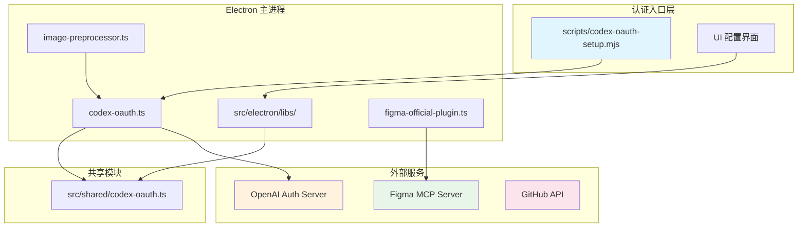

# OAuth 与认证集成

<cite>
**本文引用的文件**
- [scripts/codex-oauth-setup.mjs](file://scripts/codex-oauth-setup.mjs)
- [skills/tech-cc-hub-release-deploy/scripts/publish-release.mjs](file://skills/tech-cc-hub-release-deploy/scripts/publish-release.mjs)
- [src/electron/libs/codex-oauth.ts](file://src/electron/libs/codex-oauth.ts)
- [scripts/github-release.mjs](file://scripts/github-release.mjs)
- [src/electron/libs/figma-official-plugin.ts](file://src/electron/libs/figma-official-plugin.ts)
- [src/electron/libs/image-preprocessor.ts](file://src/electron/libs/image-preprocessor.ts)
- [src/electron/libs/runner.ts](file://src/electron/libs/runner.ts)
- [src/shared/codex-oauth.ts](file://src/shared/codex-oauth.ts)
</cite>

## 目录

- [概述](#概述)
- [认证模块架构](#认证模块架构)
- [Codex OAuth 认证流程](#codex-oauth-认证流程)
- [Codex Responses API 集成](#codex-responses-api-集成)
- [Figma 官方插件认证](#figma-官方插件认证)
- [GitHub Token 获取](#github-token-获取)
- [共享常量和工具函数](#共享常量和工具函数)
- [Token 刷新与过期处理](#token-刷新与过期处理)
- [配置存储路径](#配置存储路径)
- [排障指南](#排障指南)

---

## 概述

`tech-cc-hub` 支持多种 OAuth 认证方式，用于对接外部服务。主要包括：

| 认证类型 | 用途 | 配置文件 |
|---------|------|---------|
| Codex OAuth | ChatGPT API 代理访问 | `api-config.json` |
| Figma OAuth | Figma 官方 MCP 工具 | `runtime-config.json` |
| GitHub Token | GitHub API 发布 | 环境变量/git credential |

认证模块的设计原则：
- **职责分离**：Electron 主进程负责敏感操作，渲染进程持有配置引用
- **平台适配**：自动检测 Windows/macOS/Linux 路径差异
- **自动刷新**：Token 过期前 60 秒自动刷新
- **多 Provider 支持**：同一服务支持多种认证方式

---

## 认证模块架构



**章节来源**：[src/electron/libs/codex-oauth.ts#L1-L20](file://src/electron/libs/codex-oauth.ts#L1-L20)、[src/electron/libs/image-preprocessor.ts#L1-L16](file://src/electron/libs/image-preprocessor.ts#L1-L16)

---

## Codex OAuth 认证流程

### 认证初始化（命令行）

`scripts/codex-oauth-setup.mjs` 提供 CLI 入口，用于导入官方 Codex 登录凭据。

```bash
# 基本用法：启动 codex login 并导入
node scripts/codex-oauth-setup.mjs

# 指定配置路径
node scripts/codex-oauth-setup.mjs --configPath=/path/to/config.json

# 只读取已有凭据，不启动登录
node scripts/codex-oauth-setup.mjs --noLogin
```

**关键参数**：
| 参数 | 说明 | 来源行 |
|------|------|--------|
| `--configPath` | API 配置输出路径 | [L270](file://scripts/codex-oauth-setup.mjs#L270) |
| `--codexAuthPath` | Codex auth.json 路径 | [L271](file://scripts/codex-oauth-setup.mjs#L271) |
| `--profileName` | Profile 显示名称 | [L84](file://scripts/codex-oauth-setup.mjs#L84) |
| `--noLogin` | 跳过登录流程 | [L274](file://scripts/codex-oauth-setup.mjs#L274) |

### 凭据数据结构

Codex 凭据存储结构：

```typescript
// CodexStoredOAuthCredential - 存储格式
{
  "access_token": "eyJ...",
  "refresh_token": "eyJ...",
  "id_token": "eyJ...",
  "account_id": "user_abc123",
  "email": "user@example.com",
  "type": "codex",
  "expired": "2024-01-15T10:30:00.000Z",
  "last_refresh": "2024-01-15T09:30:00.000Z"
}
```

转换逻辑见 `codexAuthToCredential` 函数（[L154-L202](file://scripts/codex-oauth-setup.mjs#L154-L202)），支持三种候选路径：
1. `parsed.tokens`
2. `parsed.auth`
3. `parsed` 根级别

---

## Codex Responses API 集成

### Electron 端 OAuth 实现

`src/electron/libs/codex-oauth.ts` 包含完整的 PKCE OAuth 2.0 实现。

#### 创建授权流程

```typescript
import { createCodexOAuthAuthorizationFlow } from './codex-oauth';

const flow = createCodexOAuthAuthorizationFlow();
// 返回: { state, verifier, challenge, authorizeUrl, createdAt }
console.log(flow.authorizeUrl); // 打开浏览器进行授权
```

授权 URL 参数（[L174-L184](file://src/electron/libs/codex-oauth.ts#L174-L184)）：
- `response_type`: `code`
- `code_challenge_method`: `S256`
- `redirect_uri`: `http://localhost:1455/auth/callback`
- `scope`: `openid profile email offline_access`

#### 解析回调并交换 Token

```typescript
import {
  parseCodexAuthorizationInput,
  exchangeCodexAuthorizationCode
} from './codex-oauth';

// 解析回调输入（支持多种格式）
const { code, state } = parseCodexAuthorizationInput(callbackInput);

// 交换授权码获取 Token
const tokenResult = await exchangeCodexAuthorizationCode(code, verifier);
```

#### Token 刷新

```typescript
import { refreshCodexOAuthToken } from './codex-oauth';

const newTokens = await refreshCodexOAuthToken(refreshToken);
```

### Anthropic 消息格式转换

Codex Responses API 与 Anthropic Messages API 格式不同，模块提供双向转换：

| 方向 | 函数 | 说明 |
|-----|------|------|
| 请求构建 | `buildCodexResponsesRequest()` | [L271-L296](file://src/electron/libs/codex-oauth.ts#L271-L296) |
| 响应解析 | `parseCodexResponsesStream()` | [L325-L367](file://src/electron/libs/codex-oauth.ts#L325-L367) |
| 格式转换 | `toAnthropicMessageResponse()` | [L304-L323](file://src/electron/libs/codex-oauth.ts#L304-L323) |

#### 请求构建示例

```typescript
const anthropicRequest = {
  model: "gpt-5.5",
  system: "You are a helpful assistant.",
  messages: [{ role: "user", content: "Hello" }],
  tools: [{ name: "bash", description: "Run shell", input_schema: {...} }]
};

const codexRequest = buildCodexResponsesRequest(anthropicRequest);
// 输出:
// {
//   model: "gpt-5.5",
//   instructions: "You are a helpful assistant.",
//   input: [{ role: "user", content: [{ type: "input_text", text: "Hello" }] }],
//   tools: [...],
//   store: false
// }
```

### 请求头构建

```typescript
const headers = buildCodexRequestHeaders(credential, true);
// 返回:
// {
//   "Authorization": "Bearer <accessToken>",
//   "chatgpt-account-id": "<accountId>",
//   "OpenAI-Beta": "responses=experimental",
//   "originator": "codex_cli_rs",
//   "Content-Type": "application/json",
//   "Accept": "text/event-stream"
// }
```

**章节来源**：[src/electron/libs/codex-oauth.ts#L435-L444](file://src/electron/libs/codex-oauth.ts#L435-L444)

---

## Figma 官方插件认证

### 连接模式

Figma 插件支持三种连接模式（[L26](file://src/electron/libs/figma-official-plugin.ts#L26)）：

```typescript
type FigmaOfficialConnectionMode = "remote" | "desktop" | "rest";
```

| 模式 | 说明 | 认证方式 |
|-----|------|---------|
| `remote` | 远程 MCP 服务器 | OAuth / Codex |
| `desktop` | 本地 Figma Desktop | 无需认证 |
| `rest` | Figma REST API | Personal Access Token |

### 认证 Provider

```typescript
type FigmaOfficialOAuthProvider = "direct" | "codex" | "pat";
```

### 构建运行时配置

```typescript
import {
  buildNextFigmaOfficialRuntimeConfig,
  buildNextFigmaOfficialPatRuntimeConfig,
  buildNextFigmaOfficialCodexAuthRuntimeConfig
} from './figma-official-plugin';

// 使用 PAT 认证
const config1 = buildNextFigmaOfficialPatRuntimeConfig(
  currentConfig,
  accessToken,
  { accountLabel: "user@figma.com" }
);

// 使用 Codex OAuth 认证
const config2 = buildNextFigmaOfficialCodexAuthRuntimeConfig(
  currentConfig,
  { access_token: "...", expires_in: 3600 }
);
```

### 获取插件状态

```typescript
import { getFigmaOfficialPluginStatusFromConfig } from './figma-official-plugin';

const status = getFigmaOfficialPluginStatusFromConfig(config);
// 返回 FigmaOfficialPluginStatus
```

状态类型（[L29-L36](file://src/electron/libs/figma-official-plugin.ts#L29-L36)）：

| 状态 | 含义 |
|-----|------|
| `not-configured` | 尚未配置 |
| `configured` | 已配置但未认证 |
| `needs-auth` | 需要认证 |
| `auth-expired` | 认证已过期 |
| `desktop-unavailable` | 桌面 MCP 不可用 |
| `misconfigured` | 配置异常 |
| `ready` | 就绪可用 |

---

## GitHub Token 获取

GitHub 认证用于自动化发布流程。

### Token 获取顺序

`getCredentialToken()` 函数（[L75-L84](file://skills/tech-cc-hub-release-deploy/scripts/publish-release.mjs#L75-L84)）：

1. 环境变量 `GH_TOKEN`
2. 环境变量 `GITHUB_TOKEN`
3. Git Credential Manager

### 发布脚本 Token 使用

```bash
# 通过环境变量
GH_TOKEN=gho_xxxx node skills/tech-cc-hub-release-deploy/scripts/publish-release.mjs

# 或设置 GITHUB_TOKEN
export GITHUB_TOKEN=gho_xxxx
node skills/tech-cc-hub-release-deploy/scripts/publish-release.mjs
```

GitHub Release 脚本也支持相同机制（[L235-L252](file://scripts/github-release.mjs#L235-L252)）。

---

## 共享常量和工具函数

### 常量定义

`src/shared/codex-oauth.ts` 导出共享常量：

```typescript
import {
  CODEX_OAUTH_BASE_URL,           // "https://chatgpt.com"
  CODEX_OAUTH_COMPACT_MODEL_SUFFIX, // "-openai-compact"
  CODEX_OAUTH_DEFAULT_MODEL,       // "gpt-5.5"
  CODEX_OAUTH_SMALL_MODEL,         // "gpt-5.3-codex-spark"
  CODEX_OAUTH_MODELS,              // 所有支持模型的完整列表
} from './codex-oauth';
```

基础模型列表（[L6-L21](file://src/shared/codex-oauth.ts#L6-L21)）：
```
gpt-5.5, gpt-5.4, gpt-5.4-mini, gpt-5.3-codex, gpt-5.3-codex-spark,
gpt-5.2, gpt-5, gpt-5-codex, gpt-5-codex-mini, gpt-5.1,
gpt-5.1-codex, gpt-5.1-codex-max, gpt-5.1-codex-mini, gpt-5.2-codex
```

### 模型 ID 合并

`mergeCodexModelIds()` 函数处理缓存模型与默认模型的合并（[L63-L74](file://src/shared/codex-oauth.ts#L63-L74)）：
- 优先使用缓存中不在默认列表的新模型
- 所有模型自动添加 `-openai-compact` 后缀变体
- 保留原始模型名称

---

## Token 刷新与过期处理

### 自动刷新判断

`shouldRefreshCodexCredential()` 函数（[L248-L257](file://src/electron/libs/codex-oauth.ts#L248-L257)）：

```typescript
function shouldRefreshCodexCredential(
  credential: CodexOAuthCredential,
  now = Date.now()
): boolean {
  if (!credential.refreshToken || !credential.expired) {
    return false;
  }
  const expiresAt = Date.parse(credential.expired);
  return expiresAt - now < 60_000; // 过期前 60 秒刷新
}
```

### 刷新后凭据更新

```typescript
import { tokenResultToCredential } from './codex-oauth';

const newCredential = tokenResultToCredential(tokenResult, previousCredential);
// 保留 accountId 和 email，复用 refreshToken，更新 accessToken 和 expired
```

### JWT 过期时间解析

`jwtExpiresAt()` 函数（[L216-L221](file://scripts/codex-oauth-setup.mjs#L216-L221)）从 JWT payload 提取过期时间：

```typescript
function jwtExpiresAt(claims: Record<string, unknown>): string {
  const exp = claims.exp as number;
  return new Date(exp * 1000).toISOString();
}
```

---

## 配置存储路径

### 平台差异

`getDefaultConfigPath()` 函数（[L56-L65](file://scripts/codex-oauth-setup.mjs#L56-L65)）：

| 平台 | 路径 |
|-----|------|
| Windows | `%APPDATA%\tech-cc-hub\api-config.json` |
| macOS | `~/Library/Application Support/tech-cc-hub/api-config.json` |
| Linux | `~/.config/tech-cc-hub/api-config.json` |

可通过 `TECH_CC_HUB_API_CONFIG` 环境变量覆盖。

### Codex 认证文件路径

`getDefaultCodexAuthPath()` 函数（[L67-L69](file://scripts/codex-oauth-setup.mjs#L67-L69)）：

```typescript
// 默认: ~/.codex/auth.json
const codexHome = process.env.CODEX_HOME || join(homedir(), ".codex");
return join(codexHome, "auth.json");
```

---

## 排障指南

### Codex OAuth 常见问题

#### 问题：凭据导入失败

```
Unable to import Codex ChatGPT credentials from ~/.codex/auth.json
```

**排查步骤**：
1. 确认已运行 `codex login` 并成功完成
2. 检查 `~/.codex/auth.json` 文件是否存在
3. 验证文件格式是否包含 `access_token` 和 `account_id`

**章节来源**：[scripts/codex-oauth-setup.mjs#L279-L281](file://scripts/codex-oauth-setup.mjs#L279-L281)

#### 问题：Token 交换失败

```
授权码交换失败：...
```

**可能原因**：
- PKCE verifier 不匹配（检查 `code_verifier` 长度和编码）
- 授权码已过期（有效期通常 5-10 分钟）
- redirect_uri 不一致

**章节来源**：[src/electron/libs/codex-oauth.ts#L446-L465](file://src/electron/libs/codex-oauth.ts#L446-L465)

### Figma 认证问题

#### 问题：桌面 MCP 不可用

```
desktop-unavailable
```

**排查步骤**：
1. 确认 Figma Desktop 已安装并运行
2. 检查桌面 MCP 服务是否在 `http://127.0.0.1:3845/mcp` 响应
3. 尝试切换到 `remote` 模式

#### 问题：认证过期

```
auth-expired
```

**解决方案**：重新进行 OAuth 授权流程或更新 PAT token

### GitHub 发布问题

#### 问题：找不到 GitHub Token

```
Missing GitHub token. Set GH_TOKEN/GITHUB_TOKEN or login with Git credential manager.
```

**解决方案**：
```bash
# 方案 1：设置环境变量
export GH_TOKEN=gho_xxxx

# 方案 2：配置 Git Credential Manager
git config --global credential.helper manager

# 方案 3：手动填充凭据
echo "protocol=https
host=github.com
username=lst016" | git credential fill
```

**章节来源**：[scripts/github-release.mjs#L235-L252](file://scripts/github-release.mjs#L235-L252)

---

## 扩展点

### 添加新的 OAuth Provider

1. 在 `src/shared/` 创建新的共享常量模块
2. 在 `src/electron/libs/` 实现 Provider 特定的 OAuth 逻辑
3. 在 `config-store.ts` 添加配置持久化支持
4. 在对应功能模块（如 image-preprocessor.ts）添加 Provider 检测

### 添加新的认证方式

参考 `FigmaOfficialOAuthProvider` 类型（[L27](file://src/electron/libs/figma-official-plugin.ts#L27)）：
```typescript
type NewOAuthProvider = "direct" | "codex" | "pat" | "your-provider";
```

### 自定义 Token 存储

如需使用其他密钥存储方案：
1. 实现 `loadCodexCredential()` 替代函数
2. 实现 `saveCodexCredential()` 替代函数
3. 在 `codex-oauth-setup.mjs` 中替换默认实现