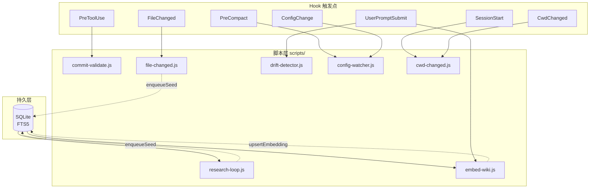
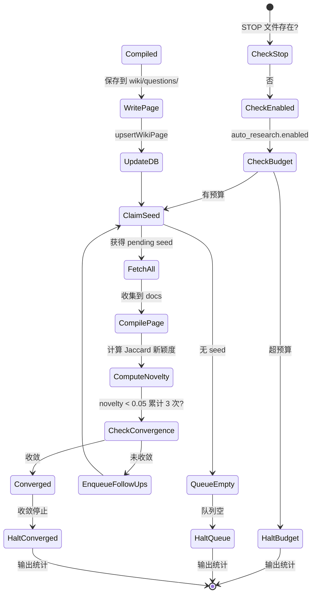
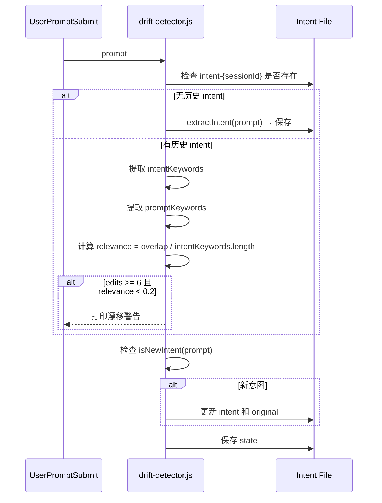
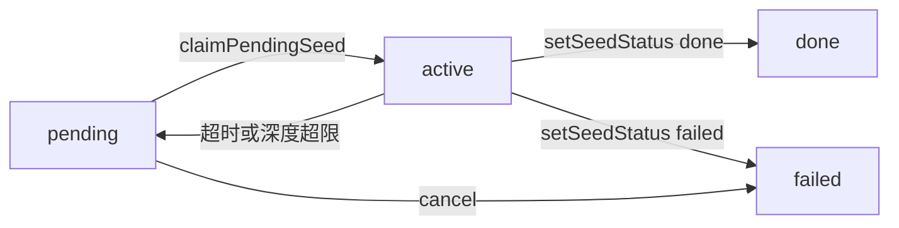

# Pro-Workflow 开发者指南

<cite>
**本文引用的文件**

- [pro-workflow/skills/wiki-research-loop/scripts/research-loop.js](file://pro-workflow/skills/wiki-research-loop/scripts/research-loop.js)
- [pro-workflow/README.md](file://pro-workflow/README.md)
- [pro-workflow/package.json](file://pro-workflow/package.json)
- [pro-workflow/scripts/commit-validate.js](file://pro-workflow/scripts/commit-validate.js)
- [pro-workflow/scripts/config-watcher.js](file://pro-workflow/scripts/config-watcher.js)
- [pro-workflow/scripts/cwd-changed.js](file://pro-workflow/scripts/cwd-changed.js)
- [pro-workflow/scripts/drift-detector.js](file://pro-workflow/scripts/drift-detector.js)
- [pro-workflow/scripts/embed-wiki.js](file://pro-workflow/scripts/embed-wiki.js)
- [pro-workflow/scripts/file-changed.js](file://pro-workflow/scripts/file-changed.js)
</cite>

# Pro-Workflow 开发者指南

## 目录

- [概述](#概述)
- [架构概览](#架构概览)
- [核心脚本详解](#核心脚本详解)
  - [research-loop.js：自动研究循环](#research-loopjs自动研究循环)
  - [commit-validate.js：提交消息验证](#commit-validatejs提交消息验证)
  - [embed-wiki.js：向量嵌入与混合检索](#embed-wikijs向量嵌入与混合检索)
  - [file-changed.js：文件变更感知](#file-changedjs文件变更感知)
  - [drift-detector.js：意图漂移检测](#drift-detectorjs意图漂移检测)
  - [config-watcher.js：配置变更监听](#config-watcherjs配置变更监听)
  - [cwd-changed.js：工作目录切换](#cwd-changedjs工作目录切换)
- [CLI 速查](#cli-速查)
- [状态与数据流](#状态与数据流)
- [排障指南](#排障指南)
- [扩展点](#扩展点)

---

## 概述

Pro-Workflow 是一套面向 AI 编程助手（Claude Code、Cursor 等）的增强框架，核心解决三个问题：

1. **重复纠正**：同一错误被纠正多次，系统自动将纠正转化为持久规则
2. **知识遗忘**：跨会话研究结果无法积累，自动构建 FTS5 索引的研究 Wiki
3. **质量失控**：缺乏提交规范、意图漂移、配置突变等质量隐患的主动检测

章节来源：[pro-workflow/README.md#L13-L38](file://pro-workflow/README.md#L13-L38)

---

## 架构概览

Pro-Workflow 的核心是一个 SQLite 持久层（`dist/db/store.js`），在它之上运行多层组件：



图表来源：[pro-workflow/README.md#L259](file://pro-workflow/README.md#L259) + 脚本分析

### 目录结构

```
pro-workflow/
├── dist/
│   ├── db/store.js          # SQLite 持久层（构建后）
│   └── search/embeddings.js # 向量嵌入助手（构建后）
├── scripts/                  # 独立可执行脚本
│   ├── research-loop.js     # 自动研究循环
│   ├── commit-validate.js  # 提交验证
│   ├── embed-wiki.js       # 向量嵌入
│   ├── file-changed.js     # 文件变更检测
│   ├── drift-detector.js   # 意图漂移检测
│   ├── config-watcher.js   # 配置监听
│   └── cwd-changed.js      # 目录切换
├── skills/                  # 技能包
├── hooks/                   # Claude Code Hook
├── commands/                # CLI 命令
└── package.json
```

章节来源：[pro-workflow/package.json#L52-L68](file://pro-workflow/package.json#L52-L68)

---

## 核心脚本详解

### research-loop.js：自动研究循环

**职责**：对指定 Wiki 执行 budget-capped BFS（广度优先搜索），调用多源 fetcher 抓取文档，自动去重并更新 Wiki。

**核心状态机**：



章节来源：[pro-workflow/skills/wiki-research-loop/scripts/research-loop.js#L161-L278](file://pro-workflow/skills/wiki-research-loop/scripts/research-loop.js#L161-L278)

**关键函数**：

| 函数 | 行号 | 职责 |
|------|------|------|
| `getStore()` | 11 | 加载构建后的 SQLite store |
| `loadFetchers()` | 36 | 扫描 `scripts/source-fetchers/` 和 `~/.pro-workflow/fetchers/` |
| `jaccardNovelty()` | 95 | 计算新文本与已有文本的 Jaccard 距离（4+ 字词令牌） |
| `compilePage()` | 110 | 从 docs 提取 8 条句子作为 claims，生成 Markdown |
| `deriveFollowUps()` | 152 | 从 claims 中提取命名实体作为后续查询（最多 3 个） |
| `runOne()` | 161 | 单次运行主循环，包含 try/finally 状态保护 |

**配置读取**（`wiki.config.md` frontmatter）：

```yaml
---
auto_research:
  enabled: true
  fetchers: [web, arxiv, github]
  max_pages_per_run: 5
  max_depth: 3
  budget_usd: 0.50
private: false
---
```

章节来源：[pro-workflow/skills/wiki-research-loop/scripts/research-loop.js#L58-L80](file://pro-workflow/skills/wiki-research-loop/scripts/research-loop.js#L58-L80)

**失败模式**：

- `halted: 'kill-switch'` → 存在 `~/.pro-workflow/STOP` 文件
- `halted: 'budget'` → 累计花费超 `budget_usd`
- `halted: 'converged'` → 连续 3 次 novelty < 0.05
- `halted: 'private'` → Wiki 标记为 private 但请求了非 local fetcher

章节来源：[pro-workflow/skills/wiki-research-loop/scripts/research-loop.js#L162-L180](file://pro-workflow/skills/wiki-research-loop/scripts/research-loop.js#L162-L180)

---

### commit-validate.js：提交消息验证

**职责**：在 `PreToolUse(Bash)` hook 中拦截 `git commit` 命令，验证是否符合 Conventional Commits 规范。

**支持的输入格式**（按优先级）：

| 格式 | 正则匹配 |
|------|----------|
| `-m "msg"` | 短标志 |
| `--message="msg"` | 长标志 |
| `<<-EOF ... EOF` | Heredoc 第一行 |
| `-F file` | 文件模式 → 通过 |
| 无标志 | 编辑器模式 → 通过 |

章节来源：[pro-workflow/scripts/commit-validate.js#L15-L44](file://pro-workflow/scripts/commit-validate.js#L15-L44)

**验证规则**：

```javascript
const PATTERN = /^(${TYPES.join('|')})(\([\w\-.,/ ]+\))?!?: .+/;
const MAX_SUMMARY = 72;
const TYPES = ['feat', 'fix', 'refactor', 'test', 'docs', 'chore', 'perf', 'ci', 'style', 'build', 'revert'];
```

- 类型必须来自已知列表
- 摘要不超过 72 字符
- 格式：`<type>(<scope>): <summary>`

章节来源：[pro-workflow/scripts/commit-validate.js#L2-L4](file://pro-workflow/scripts/commit-validate.js#L2-L4)

**退出码**：

- `0` → 通过
- `2` → 验证失败，打印原因到 stderr

章节来源：[pro-workflow/scripts/commit-validate.js#L76-L78](file://pro-workflow/scripts/commit-validate.js#L76-L78)

---

### embed-wiki.js：向量嵌入与混合检索

**职责**：为 Wiki 页面生成向量嵌入，支持纯向量、BM25 或 RRF（Reciprocal Rank Fusion）混合检索。

**子命令**：

```bash
# 批量生成嵌入
embed-wiki.js all [<slug>] [--limit 200] [--force]

# 混合检索
embed-wiki.js search "<query>" [--wiki slug] [--limit 10] [--mode hybrid|vector|bm25]
```

章节来源：[pro-workflow/scripts/embed-wiki.js#L105-L109](file://pro-workflow/scripts/embed-wiki.js#L105-L109)

**环境要求**：

- `OPENAI_API_KEY` 或 `VOYAGE_API_KEY`（二选一）

**检索模式**：

| 模式 | 行为 |
|------|------|
| `hybrid`（默认） | RRF 融合 vector + BM25 |
| `vector` | 纯余弦相似度 |
| `bm25` | 纯 BM25 全文检索 |

章节来源：[pro-workflow/scripts/embed-wiki.js#L80-L87](file://pro-workflow/scripts/embed-wiki.js#L80-L87)

**RRF 公式**（简化版）：

```javascript
// reciprocalRankFusion(hitsLists, keyFn)
score = Σ (1 / (k + rank))  // k = 60 常数
```

章节来源：[pro-workflow/scripts/embed-wiki.js#L90-L93](file://pro-workflow/scripts/embed-wiki.js#L90-L93)

---

### file-changed.js：文件变更感知

**职责**：监听文件变更，对重要配置文件的编辑给出提示，并对 Wiki 目录内的编辑自动 enqueue verify seed。

**重要文件模式**：

```javascript
const importantPatterns = [
  /package\.json$/,
  /tsconfig.*\.json$/,
  /\/\.env$|^\.env$/,
  /Dockerfile/,
  /docker-compose/,
  /\.github\/workflows\//,
  /CLAUDE\.md$/,
  /\.claude\//,
  /Cargo\.toml$/,
  /pyproject\.toml$/,
  /go\.mod$/,
  /Makefile$/
];
```

章节来源：[pro-workflow/scripts/file-changed.js#L10-L22](file://pro-workflow/scripts/file-changed.js#L10-L22)

**Wiki 目录检测正则**：

```javascript
/(?:^|\/)\.claude\/wikis\/([^/]+)\/wiki\/.+\.md$/
/(?:^|\/)\.pro-workflow\/wikis\/([^/]+)\/wiki\/.+\.md$/
```

章节来源：[pro-workflow/scripts/file-changed.js#L28-L29](file://pro-workflow/scripts/file-changed.js#L28-L29)

**自动恢复建议**（按文件类型）：

| 文件 | 建议命令 |
|------|----------|
| `package.json` | `npm install` |
| `.env` | 检查无 secret 泄露 |
| `tsconfig*.json` | `tsc --noEmit` |
| `Dockerfile` | `docker compose up --build` |
| `Cargo.toml` | `cargo check` |
| `pyproject.toml` | `pip install -e .` |
| `go.mod` | `go mod tidy` |

章节来源：[pro-workflow/scripts/file-changed.js#L54-L76](file://pro-workflow/scripts/file-changed.js#L54-L76)

---

### drift-detector.js：意图漂移检测

**职责**：在 `UserPromptSubmit` hook 中跟踪用户意图，若编辑次数过多且相关性下降，发出漂移警告。

**核心逻辑**：



章节来源：[pro-workflow/scripts/drift-detector.js#L20-L83](file://pro-workflow/scripts/drift-detector.js#L20-L83)

**漂移触发条件**：

- 自上次记录 intent 后已有 **≥6 次编辑**
- 且意图关键词重叠率 **< 20%**

**新意图检测模式**：

```javascript
/^(now|next|also|okay|ok)\s+(let's|can you|please|i need)/i
/^(switch|move|pivot|change)\s+(to|focus)/i
/^(forget|skip|instead|actually)/i
/^new task/i
```

章节来源：[pro-workflow/scripts/drift-detector.js#L112-L120](file://pro-workflow/scripts/drift-detector.js#L112-L120)

---

### config-watcher.js：配置变更监听

**职责**：在 `ConfigChange` hook 中记录敏感配置文件（`settings.json`、`hooks.json` 等）的变更。

**监听的敏感文件**：

- `settings.json`
- `settings.local.json`
- `hooks.json`
- `.claudeignore`

章节来源：[pro-workflow/scripts/config-watcher.js#L43-L48](file://pro-workflow/scripts/config-watcher.js#L43-L48)

**日志行为**：

- 变更记录到 `$TMPDIR/pro-workflow/config-changes.log`
- 日志超过 100KB 时自动截断

章节来源：[pro-workflow/scripts/config-watcher.js#L65-L76](file://pro-workflow/scripts/config-watcher.js#L65-L76)

---

### cwd-changed.js：工作目录切换

**职责**：在 `CwdChanged` hook 中检测项目类型并提供初始化提示。

**检测逻辑**：

| 检测文件 | 项目类型 |
|----------|----------|
| `package.json` | node |
| `Cargo.toml` | rust |
| `go.mod` | go |
| `pyproject.toml` | python |

章节来源：[pro-workflow/scripts/cwd-changed.js#L23-L27](file://pro-workflow/scripts/cwd-changed.js#L23-L27)

**输出提示**：

- 无 `.claude` 目录 → 建议 `/auto-setup`
- 有 `package.json` → 提示 Node 项目
- 有 `.git` → 提示 Git 仓库

章节来源：[pro-workflow/scripts/cwd-changed.js#L17-L20](file://pro-workflow/scripts/cwd-changed.js#L17-L20)

---

## CLI 速查

### research-loop.js

```bash
# 运行研究循环
research-loop.js run <slug> [--max-pages 5] [--max-depth 3] [--budget-usd 0.50] [--fetchers web,arxiv,github] [--force]

# 添加种子查询
research-loop.js seed <slug> "<query>" [--depth 0] [--parent-id N]

# 列出种子状态
research-loop.js seeds <slug> [--status pending|active|done|failed]

# 取消 pending/active 种子
research-loop.js cancel <slug>

# 全局状态
research-loop.js status
```

章节来源：[pro-workflow/skills/wiki-research-loop/scripts/research-loop.js#L344-L351](file://pro-workflow/skills/wiki-research-loop/scripts/research-loop.js#L344-L351)

### embed-wiki.js

```bash
# 生成所有嵌入
embed-wiki.js all [--limit 200] [--force]

# 混合检索
embed-wiki.js search "<query>" [--wiki slug] [--limit 10] [--mode hybrid|vector|bm25]
```

章节来源：[pro-workflow/scripts/embed-wiki.js#L106-L108](file://pro-workflow/scripts/embed-wiki.js#L106-L108)

---

## 状态与数据流

### SQLite 表结构（核心）

| 表 | 用途 |
|----|------|
| `wikis` | Wiki 元信息（slug、root_path、flavor） |
| `wiki_pages` | 页面内容 + FTS5 索引 |
| `wiki_sources` | 原始抓取来源 |
| `wiki_claims` | 从页面提取的 claims |
| `wiki_seeds` | BFS 种子队列（status: pending/active/done/failed） |
| `wiki_embeddings` | 向量嵌入 |
| `learnings` | 自我纠正记忆 |

章节来源：[pro-workflow/README.md#L135](file://pro-workflow/README.md#L135)

### Seed 状态流转



章节来源：[pro-workflow/skills/wiki-research-loop/scripts/research-loop.js#L199-L265](file://pro-workflow/skills/wiki-research-loop/scripts/research-loop.js#L199-L265)

---

## 排障指南

### 症状：research-loop 报 "built store missing"

**原因**：`dist/db/store.js` 未构建。

**解决**：

```bash
cd ~/.claude/plugins/*/pro-workflow && npm install && npm run build
```

章节来源：[pro-workflow/skills/wiki-research-loop/scripts/research-loop.js#L13-L14](file://pro-workflow/skills/wiki-research-loop/scripts/research-loop.js#L13-L14)

### 症状：embed-wiki 报 "No embedding provider env set"

**原因**：未设置 `OPENAI_API_KEY` 或 `VOYAGE_API_KEY`。

**解决**：

```bash
export OPENAI_API_KEY=sk-...
# 或
export VOYAGE_API_KEY=...
```

章节来源：[pro-workflow/scripts/embed-wiki.js#L33-L35](file://pro-workflow/scripts/embed-wiki.js#L33-L35)

### 症状：Wiki 编辑未触发 verify seed

**检查**：

1. 文件路径是否匹配正则：
   - `.claude/wikis/<slug>/wiki/*.md`
   - `.pro-workflow/wikis/<slug>/wiki/*.md`
2. `dist/db/store.js` 是否存在
3. Wiki slug 是否已在 store 中注册

章节来源：[pro-workflow/scripts/file-changed.js#L28-L29](file://pro-workflow/scripts/file-changed.js#L28-L29)

### 症状：commit-validate 未拦截无效消息

**检查**：Hook 是否在 `hooks.json` 中正确注册 `PreToolUse(Bash)`。

**注意**：使用 `-F file` 或编辑器模式时，验证会跳过（静默通过）。

章节来源：[pro-workflow/scripts/commit-validate.js#L66-L72](file://pro-workflow/scripts/commit-validate.js#L66-L72)

### 症状：drift-detector 持续警告但意图正常

**调整**：修改漂移阈值（当前硬编码为 ≥6 edits + <0.2 relevance）。

修改源码第 62 行：

```javascript
if (state.editsSinceLastTouch >= 阈值 && relevance < 阈值) {
```

章节来源：[pro-workflow/scripts/drift-detector.js#L62](file://pro-workflow/scripts/drift-detector.js#L62)

---

## 扩展点

### 1. 添加新 Fetcher

路径：`~/.pro-workflow/fetchers/<name>.js`

**接口要求**：

```javascript
module.exports = {
  match(query) { return true/false; },      // 是否处理此查询
  fetch(query, { limit }) { return docs; }, // 返回 [{ title, url, content }]
  estimateCost(query) { return { usd }; }  // 可选：预估成本
};
```

章节来源：[pro-workflow/skills/wiki-research-loop/scripts/research-loop.js#L36-L55](file://pro-workflow/skills/wiki-research-loop/scripts/research-loop.js#L36-L55)

### 2. 添加新 Hook 脚本

1. 在 `scripts/` 创建脚本
2. 在 `hooks.json` 注册事件和脚本路径
3. 脚本接收 stdin JSON，输出 stdout JSON（透传）

章节来源：[pro-workflow/scripts/config-watcher.js#L8-L9](file://pro-workflow/scripts/config-watcher.js#L8-L9)

### 3. 添加新 Wiki Flavor

在 `wiki.config.md` 的 frontmatter 中声明，参考已有 9 种 flavor。

章节来源：[pro-workflow/README.md#L128](file://pro-workflow/README.md#L128)

---

**文档版本**：v1.0
**适用版本**：Pro-Workflow v3.3.0
**最后更新**：基于 `pro-workflow/package.json#L3`