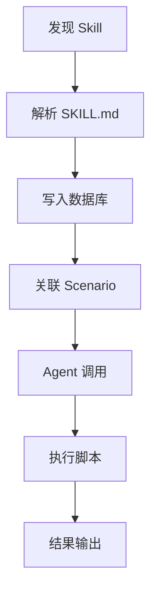
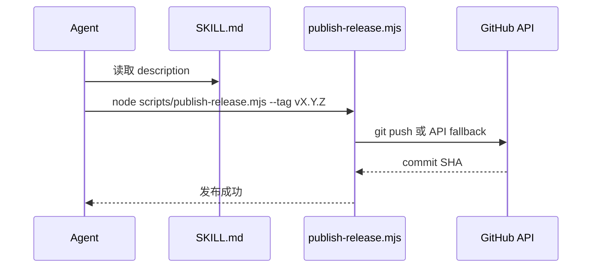

# Skill 管理与执行

<cite>

**本文引用的文件**

- [skills/tech-cc-hub-release-deploy/scripts/publish-release.mjs](file://skills/tech-cc-hub-release-deploy/scripts/publish-release.mjs)
- [pro-workflow/skills/wiki-research-loop/scripts/research-loop.js](file://pro-workflow/skills/wiki-research-loop/scripts/research-loop.js)
- [skills/tech-cc-hub-release-deploy/SKILL.md](file://skills/tech-cc-hub-release-deploy/SKILL.md)
- [skills/tech-cc-hub-release-deploy/agents/openai.yaml](file://skills/tech-cc-hub-release-deploy/agents/openai.yaml)
- [src/electron/libs/skill-manager/index.ts](file://src/electron/libs/skill-manager/index.ts)
- [pro-workflow/skills/llm-council/scripts/council.js](file://pro-workflow/skills/llm-council/scripts/council.js)
- [pro-workflow/skills/survey-generator/scripts/build-survey.js](file://pro-workflow/skills/survey-generator/scripts/build-survey.js)
- [pro-workflow/skills/wiki-builder/scripts/init_wiki.sh](file://pro-workflow/skills/wiki-builder/scripts/init_wiki.sh)
- [pro-workflow/skills/wiki-builder/scripts/wiki-cli.js](file://pro-workflow/skills/wiki-builder/scripts/wiki-cli.js)

</cite>

---

## 目录

- [1. 概述](#1-概述)
- [2. Skill 定义与结构](#2-skill-定义与结构)
- [3. Skill Manager 核心接口](#3-skill-manager-核心接口)
- [4. Skill 生命周期](#4-skill-生命周期)
- [5. 执行入口与调用链](#5-执行入口与调用链)
- [6. 数据库存储与状态](#6-数据库存储与状态)
- [7. 常见场景用法](#7-常见场景用法)
- [8. 扩展点与插件机制](#8-扩展点与插件机制)
- [9. 失败模式与排障](#9-失败模式与排障)

---

## 1. 概述

在 tech-cc-hub 中，**Skill** 是可复用、可编排的技能单元。每个 Skill 包含一个执行脚本和描述元数据，支持 Agent 调用和工作流集成。Skill Manager（位于 `src/electron/libs/skill-manager/index.ts`）负责 Skill 的发现、加载、安装、场景关联和工具适配。

> **章节来源**：[src/electron/libs/skill-manager/index.ts#L1-L2](file://src/electron/libs/skill-manager/index.ts#L1-L2)

---

## 2. Skill 定义与结构

### 2.1 目录结构

每个 Skill 目录下必须包含 `SKILL.md` 作为声明文件：

```text
skills/<skill-name>/
├── SKILL.md          # Skill 元数据
├── agents/           # Agent 接口定义
│   └── openai.yaml   # LLM 对接配置
└── scripts/          # 可执行脚本
    └── *.mjs|*.js|*.sh
```

> **章节来源**：[skills/tech-cc-hub-release-deploy/SKILL.md#L1-L4](file://skills/tech-cc-hub-release-deploy/SKILL.md#L1-L4)

### 2.2 SKILL.md 格式

```markdown
---
name: tech-cc-hub-release-deploy
description: 用于在 tech-cc-hub Windows 仓库里提交、推送、打包、发布...
---

# tech-cc-hub 发布部署

在 `D:\tool\tech-cc-hub` 里，用户要求提交、推送、部署时使用本 skill。
```

`name` 字段唯一标识 Skill，`description` 供 Agent 理解适用场景。

### 2.3 Agent 接口定义

```yaml
interface:
  display_name: "tech-cc-hub 发布部署"
  short_description: "提交、推送、移动 tag、打包并更新 tech-cc-hub 的 GitHub Release。"
```

> **章节来源**：[skills/tech-cc-hub-release-deploy/agents/openai.yaml#L1-L4](file://skills/tech-cc-hub-release-deploy/agents/openai.yaml#L1-L4)

---

## 3. Skill Manager 核心接口

Skill Manager 导出以下功能模块：

| 模块 | 导出函数 | 职责 |
|------|----------|------|
| **db.js** | `getAllSkills`, `insertSkill`, `deleteSkill`, `getSkillById` | SQLite CRUD |
| **central-repo.js** | `ensureCentralRepo`, `skillsDir` | 中央 Skill 仓库路径 |
| **tool-adapters.js** | `findAdapter`, `enabledInstalledAdapters`, `customTools` | 工具适配与路径覆盖 |
| **sync-engine.js** | `parseSkillMd`, `syncSkill`, `inferSkillName` | Skill 同步与解析 |
| **installer.js** | `installFromLocal`, `installSkillDirToDestination` | 本地安装 |
| **scanner.js** | `scanLocalSkills`, `groupDiscovered` | 目录扫描发现 |
| **scenarios.js** | `createScenario`, `addSkillToScenario` | 场景管理 |

> **章节来源**：[src/electron/libs/skill-manager/index.ts#L4-L83](file://src/electron/libs/skill-manager/index.ts#L4-L83)

### 3.1 关键函数签名

```typescript
// 插入新 Skill
insertSkill(skill: SkillRecord): number

// 按 ID 获取
getSkillById(id: number): SkillRecord | null

// 安装本地 Skill 到目标路径
installFromLocal(srcPath: string, destPath: string): Promise<void>

// 同步 Skill 元数据
syncSkill(skillId: number): Promise<void>

// 场景管理
addSkillToScenario(scenarioId: number, skillId: number): void
```

---

## 4. Skill 生命周期



1. **发现**：通过 `scanLocalSkills()` 扫描 `skills/` 或自定义路径
2. **解析**：`parseSkillMd()` 读取 frontmatter，提取 `name` 和 `description`
3. **安装**：`installFromLocal()` 将 Skill 复制到工作目录
4. **关联**：通过 `addSkillToScenario()` 将 Skill 加入场景
5. **执行**：Agent 根据 `short_description` 决定调用哪个 Skill

> **图表来源**：[src/electron/libs/skill-manager/index.ts](file://src/electron/libs/skill-manager/index.ts) + [skills/tech-cc-hub-release-deploy/SKILL.md](file://skills/tech-cc-hub-release-deploy/SKILL.md)

---

## 5. 执行入口与调用链

### 5.1 脚本入口模式

所有 Skill 脚本采用 **CLI 模式**，通过 `process.argv` 解析子命令：

```javascript
// research-loop.js 示例
async function main() {
  const [, , cmd, ...rest] = process.argv;
  const args = parseArgs(rest);
  switch (cmd) {
    case 'run': await cmdRun(args); break;
    case 'seed': cmdSeed(args); break;
    case 'cancel': cmdCancel(args); break;
    // ...
  }
}
```

> **章节来源**：[pro-workflow/skills/wiki-research-loop/scripts/research-loop.js#L354-L365](file://pro-workflow/skills/wiki-research-loop/scripts/research-loop.js#L354-L365)

### 5.2 参数解析约定

参数格式为 `--key value` 或 `--flag`：

```javascript
function parseArgs(argv) {
  const out = { _: [] };
  for (let i = 0; i < argv.length; i++) {
    const a = argv[i];
    if (a.startsWith('--')) {
      const key = a.slice(2);
      const next = argv[i + 1];
      if (next && !next.startsWith('--')) { out[key] = next; i++; }
      else out[key] = true;
    } else out._.push(a);
  }
  return out;
}
```

> **章节来源**：[pro-workflow/skills/wiki-research-loop/scripts/research-loop.js#L22-L34](file://pro-workflow/skills/wiki-research-loop/scripts/research-loop.js#L22-L34)

### 5.3 典型调用链

以 `tech-cc-hub-release-deploy` 为例：



> **图表来源**：[skills/tech-cc-hub-release-deploy/SKILL.md#L21-L26](file://skills/tech-cc-hub-release-deploy/SKILL.md#L21-L26)

---

## 6. 数据库存储与状态

### 6.1 核心数据表

Skill 相关数据存储在 SQLite 中（通过 `db.js` 管理）：

| 表名 | 用途 |
|------|------|
| `skills` | Skill 元数据（name, description, path） |
| `scenarios` | 场景定义（多 Skill 组合） |
| `skill_scenarios` | Skill-Scenario 关联 |
| `targets` | Skill 目标路径配置 |
| `tags` | Skill 分类标签 |

### 6.2 Wiki 场景扩展

部分 Skill（如 `wiki-research-loop`、`survey-generator`）依赖 `wiki_seeds` 表管理任务队列：

```sql
SELECT wiki_slug,
  SUM(CASE WHEN status='pending' THEN 1 ELSE 0 END) AS pending,
  SUM(CASE WHEN status='done' THEN 1 ELSE 0 END) AS done
FROM wiki_seeds GROUP BY wiki_slug
```

> **章节来源**：[pro-workflow/skills/wiki-research-loop/scripts/research-loop.js#L325-L333](file://pro-workflow/skills/wiki-research-loop/scripts/research-loop.js#L325-L333)

---

## 7. 常见场景用法

### 7.1 发布部署 Skill

```powershell
# 推送当前 HEAD
node skills/tech-cc-hub-release-deploy/scripts/publish-release.mjs

# 带 tag 发布
node skills/tech-cc-hub-release-deploy/scripts/publish-release.mjs --tag v0.1.13 --retag

# 修复 Windows git push 失败（API fallback）
node skills/tech-cc-hub-release-deploy/scripts/publish-release.mjs --api-only --tag v0.1.13

# 只更新 Release 说明
node skills/tech-cc-hub-release-deploy/scripts/publish-release.mjs --tag v0.1.13 --notes .tmp/release-notes.md --notes-only
```

> **章节来源**：[skills/tech-cc-hub-release-deploy/SKILL.md#L31-L49](file://skills/tech-cc-hub-release-deploy/SKILL.md#L31-L49)

### 7.2 Wiki Research Loop

```bash
# 初始化 research flavor wiki
./init_wiki.sh mywiki --title "My Research" --flavor research --scope global

# 入队研究种子
node research-loop.js seed mywiki "LLM reasoning" --depth 0

# 运行研究循环
node research-loop.js run mywiki --max-pages 5 --max-depth 3 --budget-usd 0.50

# 查看状态
node research-loop.js status
```

> **章节来源**：[pro-workflow/skills/wiki-builder/scripts/init_wiki.sh#L12-L15](file://pro-workflow/skills/wiki-builder/scripts/init_wiki.sh#L12-L15)

### 7.3 Survey 生成

```bash
node build-survey.js \
  --bundle /path/to/bundle.json \
  --wiki mywiki \
  --provider anthropic \
  --model claude-opus-4-7
```

Bundle JSON 格式：

```json
{
  "topic": "Generative Agents",
  "bibliography": [{ "key": "park-2023", "title": "Generative Agents...", "url": "..." }],
  "sections": [{ "papers": ["park-2023"] }]
}
```

> **章节来源**：[pro-workflow/skills/survey-generator/scripts/build-survey.js#L164-L171](file://pro-workflow/skills/survey-generator/scripts/build-survey.js#L164-L171)

### 7.4 Wiki CLI

```bash
# 初始化
node wiki-cli.js init mywiki --title "My Wiki" --flavor research

# 列出所有 wiki
node wiki-cli.js list

# 索引页面
node wiki-cli.js reindex mywiki

# 查看 wiki 信息
node wiki-cli.js info mywiki
```

> **章节来源**：[pro-workflow/skills/wiki-builder/scripts/wiki-cli.js#L207-L214](file://pro-workflow/skills/wiki-builder/scripts/wiki-cli.js#L207-L214)

### 7.5 LLM Council

```bash
# 运行多模型评议
node council.js run "最佳前端框架是什么?" \
  --models gpt-4o,claude-opus-4-7 \
  --chairman gpt-4o \
  --provider anthropic \
  --wiki mywiki

# 查看支持的 provider
node council.js providers
```

> **章节来源**：[pro-workflow/skills/llm-council/scripts/council.js#L267-L272](file://pro-workflow/skills/llm-council/scripts/council.js#L267-L272)

---

## 8. 扩展点与插件机制

### 8.1 Source Fetchers（扩展点）

`wiki-research-loop` 支持动态加载 fetcher 插件：

```javascript
function loadFetchers(names) {
  const dirs = [
    path.join(SKILL_ROOT, 'scripts', 'source-fetchers'),
    path.join(os.homedir(), '.pro-workflow', 'fetchers'),
  ];
  for (const dir of dirs) {
    for (const f of fs.readdirSync(dir)) {
      if (!f.endsWith('.js')) continue;
      const name = path.basename(f, '.js');
      fetchers[name] = require(path.join(dir, f));
    }
  }
  return fetchers;
}
```

> **章节来源**：[pro-workflow/skills/wiki-research-loop/scripts/research-loop.js#L36-L56](file://pro-workflow/skills/wiki-research-loop/scripts/research-loop.js#L36-L56)

### 8.2 Tool Adapters

`tool-adapters.js` 提供了 Skill 到外部工具的桥接：

```typescript
export {
  defaultToolAdapters,
  allToolAdapters,
  findAdapter,
  customToolPaths,
  customTools,
} from "./tool-adapters.js";
```

可覆盖默认路径、自定义工具映射。

> **章节来源**：[src/electron/libs/skill-manager/index.ts#L38-L50](file://src/electron/libs/skill-manager/index.ts#L38-L50)

---

## 9. 失败模式与排障

### 9.1 常见错误及处理

| 错误 | 原因 | 解决方案 |
|------|------|----------|
| `not a git repository` | Windows git 路径解析失败 | 使用 `--api-only` 切换到 GitHub API fallback |
| `built store missing` | 未执行 `npm run build` | 先 `cd <pro-workflow-root> && npm install && npm run build` |
| `unknown wiki: slug` | Wiki 未初始化 | 先运行 `wiki-cli.js init <slug>` |
| `Tag exists` | 重复 tag | 加 `--retag` 强制移动 |
| `GitHub token missing` | 未设置 GH_TOKEN | 设置 `GH_TOKEN` 或 `GITHUB_TOKEN` 环境变量 |

### 9.2 调试检查点

发布后验证三值一致：

```bash
git rev-parse HEAD           # 本地 HEAD
git rev-parse origin/main    # 本地远程跟踪分支
git ls-remote --heads origin main  # 远端分支 SHA
```

三者必须指向同一 commit。

> **章节来源**：[skills/tech-cc-hub-release-deploy/SKILL.md#L72-L80](file://skills/tech-cc-hub-release-deploy/SKILL.md#L72-L80)

### 9.3 Kill Switch

`research-loop` 支持紧急停止：

```bash
touch ~/.pro-workflow/STOP
```

运行时检测到该文件会立即中止。

> **章节来源**：[pro-workflow/skills/wiki-research-loop/scripts/research-loop.js#L10](file://pro-workflow/skills/wiki-research-loop/scripts/research-loop.js#L10)

### 9.4 成本控制

Research Loop 会根据 `budget_usd` 累计成本：

```javascript
if (stats.cost_usd + (cost.usd || 0) > budget) {
  stats.halted = 'budget';
  break;
}
```

> **章节来源**：[pro-workflow/skills/wiki-research-loop/scripts/research-loop.js#L210-L215](file://pro-workflow/skills/wiki-research-loop/scripts/research-loop.js#L210-L215)