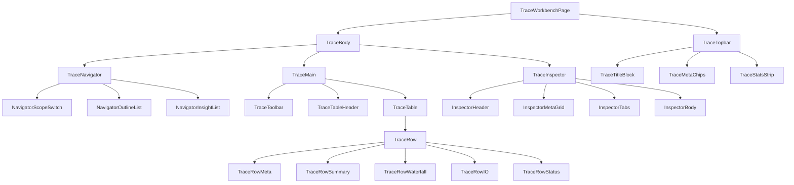
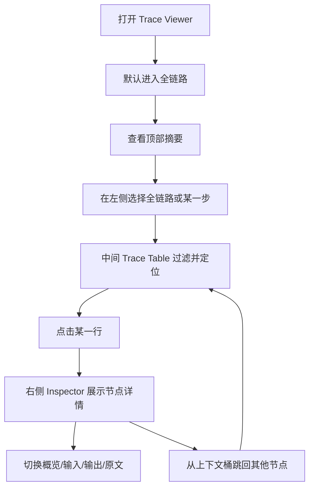

# Trace Workbench 参考

<cite>
**本文引用的文件**
- [doc/40-product/1.0.0/10-requirements/18-PRD-Trace Workbench参考图拆解与页面重构.md](file://doc/40-product/1.0.0/10-requirements/18-PRD-Trace%20Workbench%E5%8F%82%E8%80%83%E5%9B%BE%E6%8B%86%E8%A7%A3%E4%B8%8E%E9%A1%B5%E9%9D%A2%E9%87%8D%E6%9E%84.md)
- [doc/50-quality/trace-workbench-screenshot-checklist.md](file://doc/50-quality/trace-workbench-screenshot-checklist.md)
- [src/electron/libs/system-prompt-presets.ts](file://src/electron/libs/system-prompt-presets.ts)
- [src/electron/libs/git/ipc.ts](file://src/electron/libs/git/ipc.ts)
- [src/ui/components/BrowserWorkbenchPage.tsx](file://src/ui/components/BrowserWorkbenchPage.tsx)
- [scripts/qa/browser-workbench-smoke.mjs](file://scripts/qa/browser-workbench-smoke.mjs)
- [scripts/qa/preview-workbench-smoke.cjs](file://scripts/qa/preview-workbench-smoke.cjs)
- [skills/tech-cc-hub-release-deploy/scripts/publish-release.mjs](file://skills/tech-cc-hub-release-deploy/scripts/publish-release.mjs)
- [scripts/github-release.mjs](file://scripts/github-release.mjs)
</cite>

## 目录

- [概述与目标](#概述与目标)
- [页面架构与布局](#页面架构与布局)
- [核心组件树](#核心组件树)
- [数据模型绑定](#数据模型绑定)
- [交互流程与状态规则](#交互流程与状态规则)
- [验收核对表](#验收核对表)
- [BrowserWorkbench 组件详解](#browserworkbench-组件详解)
- [QA 冒烟测试](#qa-冒烟测试)
- [扩展点与 System Prompt](#扩展点与-system-prompt)
- [排障指南](#排障指南)

---

## 概述与目标

Trace Workbench 是 tech-cc-hub 中用于**执行可观测与复盘分析**的核心页面。它的设计目标是让用户进入页面后，不需要先读说明，就能自然地从左到右完成 `定位范围 → 浏览执行 → 检查详情` 的完整流程。

### 参考来源

本次重构以两个业界产品为基准：
- **Langfuse Trace Detail**：[langfuse.com/docs/observability/overview](https://langfuse.com/docs/observability/overview)
- **MLflow Trace Debugging**：[mlflow.org/genai/tracing](https://mlflow.org/docs/latest/genai/tracing/)

### 一句话产品论

> 用户进入页面后，不需要先读说明，就能自然地从左到右完成 `定位范围 → 浏览执行 → 检查详情`。

章节来源：[18-PRD-Trace Workbench参考图拆解与页面重构.md#L131-L133](file://doc/40-product/1.0.0/10-requirements/18-PRD-Trace%20Workbench%E5%8F%82%E8%80%83%E5%9B%BE%E6%8B%86%E8%A7%A3%E4%B8%8E%E9%A1%B5%E9%9D%A2%E9%87%8D%E6%9E%84.md#L131-L133)

---

## 页面架构与布局

### 三栏布局规范

Trace Workbench 采用独立页面级布局，不再嵌入聊天滚动容器：

| 列 | 宽度范围 | 职责 |
|---|---|---|
| **左列** | `260px ~ 300px` | Trace Navigator（导航目录 + 上下文洞察） |
| **中列** | 自适应优先吃满 | Trace Table / Waterfall 主阅读区 |
| **右列** | `340px ~ 380px` | Trace Inspector（节点详情调试面板） |

### 视觉调性规范

| 维度 | 旧实现 | 目标规范 |
|---|---|---|
| 主容器圆角 | `20px+` | `12px ~ 16px` |
| 行级圆角 | `20px+` | `10px ~ 12px` |
| 阴影 | 大面积柔和阴影 | 极弱分层阴影，边框优先 |
| 底色 | 白色大卡片 | 低对比中性灰 |
| 风格 | 内容产品/首页 | **工具产品 / observability console** |

章节来源：[18-PRD-Trace Workbench参考图拆解与页面重构.md#L149-L174](file://doc/40-product/1.0.0/10-requirements/18-PRD-Trace%20Workbench%E5%8F%82%E8%80%83%E5%9B%BE%E6%8B%86%E8%A7%A3%E4%B8%8E%E9%A1%B5%E9%9D%A2%E9%87%8D%E6%9E%84.md#L149-L174)

---

## 核心组件树

以下 Mermaid 图展示了 Trace Workbench 的组件层级结构：



### 关键组件职责

| 组件 | 职责 | 必须包含 |
|---|---|---|
| `TraceTopbar` | 标题、状态、返回、元信息、紧凑统计条 | 页面标题、状态badge、返回按钮、模型标签、总耗时、节点/工具/轮次统计 |
| `TraceNavigator` | 全链路/步骤导航 + 上下文洞察 | 全链路入口、步骤目录列表、当前选中态、上下文洞察列表 |
| `TraceToolbar` | 过滤与范围控制 | scope提示、回到全链路、filter chips、可见节点数 |
| `TraceTableHeader` | 表头固定 | 节点/摘要/时序/输入输出/状态 五列 |
| `TraceRow` | 单行承载一个timeline node | 节点类型、标题、摘要chips、waterfall条、状态 |
| `TraceInspector` | 节点级调试内容 | 节点标题、tabs（概览/输入/输出/原文）、可滚动详情区 |

图表来源：[18-PRD-Trace Workbench参考图拆解与页面重构.md#L176-L204](file://doc/40-product/1.0.0/10-requirements/18-PRD-Trace%20Workbench%E5%8F%82%E8%80%83%E5%9B%BE%E6%8B%86%E8%A7%A3%E4%B8%8E%E9%A1%B5%E9%9D%A2%E9%87%8D%E6%9E%84.md#L176-L204)

---

## 数据模型绑定

页面各区域的数据来源在 PRD 阶段就已固定：

| UI 区域 | 数据来源 | 说明 |
|---|---|---|
| 页面标题 | `session.title` | 当前会话名 |
| 模型标签 | `model.summary.modelLabel` | 顶部元信息 |
| 总耗时 | `model.summary.durationLabel` | 顶部元信息 |
| 步骤目录 | `model.planSteps` 优先，否则 `model.executionSteps` | 左侧目录 |
| Trace rows | `model.timeline` | 中间主体 |
| 节点 chips | `item.chips` | 行级附加语义 |
| Waterfall 宽度 | `item.metrics.durationMs` + 相对总时长 | 时序条 |
| Inspector 详情 | `item.detailSections` | 右侧详情 |
| 上下文跳转 | `contextDistribution.buckets[].sourceNodeIds` | 左侧洞察联动 |

章节来源：[18-PRD-Trace Workbench参考图拆解与页面重构.md#L344-L359](file://doc/40-product/1.0.0/10-requirements/18-PRD-Trace%20Workbench%E5%8F%82%E8%80%83%E5%9B%BE%E6%8B%86%E8%A7%A3%E4%B8%8E%E9%A1%B5%E9%9D%A2%E9%87%8D%E6%9E%84.md#L344-L359)

---

## 交互流程与状态规则

### 用户交互流程



### 状态规则

| 规则 ID | 场景 | 行为 |
|---|---|---|
| `S-01` | 页面初始态 | 默认选中全链路，默认选中第一条可见节点，默认inspector tab为概览 |
| `S-02` | 步骤切换 | 中间表格只显示该步相关节点；若无节点，展示空态说明 |
| `S-03` | 过滤切换 | filter只作用于当前scope；若filter下为空，保留表头并给出空态 |
| `S-04` | Inspector Tab | 若某tab没有数据，不展示该tab；概览必须始终存在 |

图表来源：[18-PRD-Trace Workbench参考图拆解与页面重构.md#L362-L394](file://doc/40-product/1.0.0/10-requirements/18-PRD-Trace%20Workbench%E5%8F%82%E8%80%83%E5%9B%BE%E6%8B%86%E8%A7%A3%E4%B8%8E%E9%A1%B5%E9%9D%A2%E9%87%8D%E6%9E%84.md#L362-L394)

---

## 验收核对表

每轮开发完成后，必须在 Electron 真窗口固定尺寸截图，对照以下检查项：

### 硬性失败条件

只要出现以下任一情况，直接判定不一致：

1. 顶部仍然是大卡片统计区
2. 左栏仍然是明显的卡片堆叠
3. 中间主体仍然不像表格 / waterfall
4. 右侧 inspector 仍然被统计卡主导
5. 截图整体仍然带有强烈「旧页面味道」

### 截图一致性核对矩阵

| ID | 检查项 | 通过标准 |
|---|---|---|
| `SC-01` | 顶部信息组织 | 顶部是紧凑标题栏和指标条，不是大卡片墙 |
| `SC-02` | 左栏视觉语义 | 左栏像目录导航，不像多个独立卡片 |
| `SC-03` | 中间主体第一印象 | 一眼看上去像 trace table，而不是内容页 |
| `SC-04` | Row 密度 | 行高明显收紧，信息密度高 |
| `SC-05` | Waterfall 主导性 | 时序条是主体阅读对象之一，不是装饰条 |
| `SC-06` | 摘要可读性 | 不出现摘要挤压、近似竖排的观感 |
| `SC-07` | Inspector 形态 | 更像调试面板，不像统计卡区 |
| `SC-08` | Tabs 结构 | 概览 / 输入 / 输出 / 原文 清楚稳定 |
| `SC-09` | 原文可读性 | 原文区背景和文字对比明确，可直接阅读 |
| `SC-10` | 视觉气质 | 更接近 Langfuse / MLflow，而不是原有大圆角页面 |

章节来源：[doc/50-quality/trace-workbench-screenshot-checklist.md#L41-L55](file://doc/50-quality/trace-workbench-screenshot-checklist.md#L41-L55)

### 退出标准

只有当：
1. `SC-01 ~ SC-10` 全部通过
2. 没有命中 Hard Fail Conditions
3. Electron 真窗口截图确认

才能说「本轮 Trace Workbench 与参考图基本对齐」。

---

## BrowserWorkbench 组件详解

`BrowserWorkbenchPage` 是渲染层的核心组件，定义于 `src/ui/components/BrowserWorkbenchPage.tsx`。

### 组件入口与 Props

```typescript
type BrowserWorkbenchPageProps = {
  active?: boolean;
  initialUrl?: string;
  occluded?: boolean;
  sessionId?: string | null;
  onOpenTrace?: () => void;
  onOpenUsage?: () => void;
  onOpenPreview?: () => void;
  onOpenGit?: () => void;
};
```

章节来源：[BrowserWorkbenchPage.tsx#L10-L19](file://src/ui/components/BrowserWorkbenchPage.tsx#L10-L19)

### 核心状态管理

组件使用 `useAppStore` 管理浏览器状态：

```typescript
const sessionBrowserState = useAppStore((store) =>
  sessionId ? store.browserWorkbenchBySessionId[sessionId] : undefined
);
const setSessionBrowserUrl = useAppStore((store) => store.setBrowserWorkbenchUrl);
const setSessionBrowserHasTab = useAppStore((store) => store.setBrowserWorkbenchHasTab);
const setSessionBrowserAnnotations = useAppStore((store) => store.setBrowserWorkbenchAnnotations);
```

### 本地浏览器目标检测

`BrowserWorkbenchPage` 支持自动发现本地开发服务器：

```typescript
const COMMON_LOCAL_BROWSER_PORTS = [3000, 4173, 5173, 8000, 8001, 8080];
const MAX_LOCAL_BROWSER_TARGETS = 5;
const MAX_RECENT_LOCAL_BROWSER_TARGETS = 5;
```

本地目标探活函数：

```typescript
async function probeLocalTarget(url: string, timeoutMs = 1400): Promise<LocalTargetStatus> {
  const controller = new AbortController();
  const timeout = window.setTimeout(() => controller.abort(), timeoutMs);
  try {
    await fetch(url, { cache: "no-store", mode: "no-cors", signal: controller.signal });
    return "online";
  } catch {
    return "offline";
  } finally {
    window.clearTimeout(timeout);
  }
}
```

章节来源：[BrowserWorkbenchPage.tsx#L52-L74](file://src/ui/components/BrowserWorkbenchPage.tsx#L52-L74)

### 预览帧捕获

当运行在非 Electron 环境中（如开发预览）时，使用 iframe 捕获可见区域：

```typescript
async function capturePreviewFrameVisible(frame: HTMLIFrameElement): Promise<string | null> {
  // 克隆 DOM，移除脚本，序列化 SVG，绘制到 Canvas
  // 返回 base64 PNG dataUrl
}
```

章节来源：[BrowserWorkbenchPage.tsx#L155-L206](file://src/ui/components/BrowserWorkbenchPage.tsx#L155-L206)

### 运行时检测

```typescript
const isBrowserPreviewRuntime = () => (
  typeof window !== "undefined" &&
  (!/Electron/i.test(window.navigator.userAgent) || getDevElectronRuntimeSource() !== "electron")
);

const hasBrowserWorkbenchRuntime = () => (
  typeof window !== "undefined" &&
  typeof window.electron?.openBrowserWorkbench === "function" &&
  typeof window.electron?.setBrowserWorkbenchBounds === "function"
);
```

章节来源：[BrowserWorkbenchPage.tsx#L31-L41](file://src/ui/components/BrowserWorkbenchPage.tsx#L31-L41)

---

## QA 冒烟测试

### Browser Workbench 冒烟测试

位置：`scripts/qa/browser-workbench-smoke.mjs`

**测试场景：**

| 测试名 | 验证内容 |
|---|---|
| `open_page` | 页面打开成功，URL 正确 |
| `get_state` | 状态读取正确，标题匹配 |
| `extract_page` | 页面快照提取（文本、链接、图片） |
| `console_logs` | 控制台日志捕获 |
| `capture_visible` | 可见区域截图生成 |
| `inspect_at_point` | DOM 点检能力 |
| `annotation_mode` | 标注模式切换 |
| `reload` | 页面重载 |
| `back_forward` | 前进后退导航 |
| `close_page` | 页面关闭 |

**运行方式：**

```bash
node scripts/qa/browser-workbench-smoke.mjs
```

章节来源：[browser-workbench-smoke.mjs#L55-L176](file://scripts/qa/browser-workbench-smoke.mjs#L55-L176)

### Preview Workbench 冒烟测试

位置：`scripts/qa/preview-workbench-smoke.cjs`

使用 Playwright 对预览工作台进行端到端验证：

```javascript
// 关键验证点
1. 点击"预览"按钮
2. 文件资源管理器加载 package.json
3. Monaco 编辑器可见
4. 不出现 "Loading..." 卡死
5. 代码引用 chip 正确渲染到 UI
6. 代码引用块不泄露到 textarea
7. 无 console.error / pageerror
```

章节来源：[preview-workbench-smoke.cjs#L1-L69](file://scripts/qa/preview-workbench-smoke.cjs#L1-L69)

---

## 扩展点与 System Prompt

### BrowserWorkbench System Prompt

`src/electron/libs/system-prompt-presets.ts` 中的 `buildBrowserWorkbenchPromptAppend()` 函数为 Agent 提供浏览器操作指引：

```typescript
export function buildBrowserWorkbenchPromptAppend(): string {
  return [
    "BrowserView rule: for current-page browsing, scraping, debugging, annotations, screenshots, cookies, storage, console logs, URL checks, and DOM inspection, use the built-in tech-cc-hub browser MCP tools instead of external browser skills.",
    "Use focused browser helpers when possible: http_ping/diagnose_port for service checks, browser_console_logs(waitFor) for HMR/build waits, browser_query_nodes/browser_get_element/browser_inspect_styles for DOM/style evidence...",
    "For Figma-backed UI fixes, gather DOM node fields (text, selector, box, attributes, componentStack, context.nearbyText) and use figma_match_ui_nodes to map rendered UI nodes to Figma nodes before editing.",
  ].join("\n");
}
```

章节来源：[system-prompt-presets.ts#L12-L19](file://src/electron/libs/system-prompt-presets.ts#L12-L19)

### 设计还原 System Prompt

`buildDesignParityPromptAppend()` 为设计还原场景提供专用提示词：

- `design_inspect_image` - 读取图片结构化视觉摘要
- `design_capture_current_view` - 截图当前 BrowserView
- `design_compare_current_view` / `design_compare_images` - 视觉对比
- `design_compare_current_view_batch` - 批量对比
- `design_read_comparison_report` - 读取差异报告
- `design_list_artifacts` - 列出最近视觉产物

章节来源：[system-prompt-presets.ts#L125-L134](file://src/electron/libs/system-prompt-presets.ts#L125-L134)

### Prompt 来源注册

所有内置提示词统一通过 `buildTechCCHubSystemPromptSources()` 注册：

| ID | 标签 |
|---|---|
| `tech-cc-hub-browser-preset` | tech-cc-hub 内置浏览器预设 |
| `tech-cc-hub-admin-preset` | tech-cc-hub 配置治理预设 |
| `tech-cc-hub-tool-policy-preset` | tech-cc-hub 工具调用预设 |
| `tech-cc-hub-design-preset` | tech-cc-hub 设计还原预设 |
| `tech-cc-hub-builtin-mcp-registry-preset` | tech-cc-hub built-in MCP registry preset |
| `tech-cc-hub-claude-code-2139-preset` | tech-cc-hub Claude Code 2.1.139 compatibility preset |

章节来源：[system-prompt-presets.ts#L136-L174](file://src/electron/libs/system-prompt-presets.ts#L136-L174)

---

## Git Workbench IPC

### Git IPC 通道定义

`src/electron/libs/git/ipc.ts` 导出以下 IPC 通道类型：

```typescript
export type GitWorkbenchIpcChannel =
  | "git:snapshot"
  | "git:diff"
  | "git:commitDetail"
  | "git:stage"
  | "git:unstage"
  | "git:commit"
  | "git:generateCommitMessageFast"
  | "git:generateCommitMessage"
  | "git:pull"
  | "git:push"
  | "git:createBranch"
  | "git:checkoutBranch"
  | "git:stashSave"
  | "git:stashApply"
  | "git:stashDrop";
```

### IPC 处理器注册

```typescript
export function registerGitWorkbenchIpcHandlers(): void {
  if (registered) return;
  registered = true;

  for (const channel of CHANNELS) {
    ipcMain.handle(channel, async (_event, ...args: unknown[]) => {
      try {
        return await handleGitWorkbenchInvoke(channel, ...args);
      } catch (error) {
        return invalidResult(error instanceof Error ? error.message : String(error));
      }
    });
  }
}
```

### 调用示例

从渲染进程调用 Git 快照：

```typescript
const snapshot = await window.electron.invoke("git:snapshot", { cwd: "/path/to/repo" });
```

章节来源：[git/ipc.ts#L1-L147](file://src/electron/libs/git/ipc.ts#L1-L147)

---

## 发布与部署

### GitHub Release 脚本

`scripts/github-release.mjs` 支持语义化版本升级和 GitHub Release 创建：

```bash
# 用法
node scripts/github-release.mjs [patch|minor|major|vX.Y.Z] [选项]

# 选项
--dry-run          # 模拟运行，不修改文件
--no-push          # 不推送到远程
--allow-dirty      # 允许 dirty worktree
--no-release       # 不创建 GitHub Release
--release-title-template "<tmpl>"  # 自定义 Release 标题模板
--release-note-template <path>      # 自定义 Release notes 模板
```

### 发布流程

1. 解析语义化版本，生成新 tag
2. 更新 `package.json` 版本号
3. 提交并打 tag
4. 推送到 `origin main`
5. 推送到 `origin refs/tags/<tag>`
6. 通过 GitHub API 创建/更新 Release

章节来源：[github-release.mjs#L387-L439](file://scripts/github-release.mjs#L387-L439)

### API Fallback 发布

`skills/tech-cc-hub-release-deploy/scripts/publish-release.mjs` 提供基于 GitHub API 的备选发布方式，用于 Windows 环境下 git push 失败的情况：

```bash
node skills/tech-cc-hub-release-deploy/scripts/publish-release.mjs \
  --tag v1.2.3 \
  --notes ./release-notes.md

# 选项
--retag           # 允许移动已存在的 tag
--delete-release  # 删除现有 release
--api-only        # 仅使用 API 方式发布
--notes-only      # 仅更新 release notes
```

章节来源：[publish-release.mjs#L354-L387](file://skills/tech-cc-hub-release-deploy/scripts/publish-release.mjs#L354-L387)

---

## 排障指南

### Trace Workbench 视觉不一致

**症状：** 截图与 Langfuse/MLflow 参考图差距明显。

**排查步骤：**

1. 对照 `SC-01 ~ SC-10` 逐项检查
2. 检查是否命中 Hard Fail Conditions
3. 验证圆角、阴影、底色是否符合视觉调性规范
4. 在 Electron 真窗口中固定尺寸截图

### BrowserWorkbench 无法打开

**症状：** 调用 `manager.open(url)` 后页面未加载。

**排查步骤：**

1. 确认 `DEV_BROWSER_PREVIEW_FLAG` 环境变量设置正确
2. 检查 `isBrowserPreviewRuntime()` 返回值
3. 使用 `waitForIdle()` 等待加载完成（默认超时 8000ms）
4. 查看 `manager.getConsoleLogs()` 捕获错误日志

章节来源：[browser-workbench-smoke.mjs#L11-L22](file://scripts/qa/browser-workbench-smoke.mjs#L11-L22)

### 本地服务器未检测到

**症状：** `COMMON_LOCAL_BROWSER_PORTS` 中的端口未出现在目标列表。

**排查步骤：**

1. 确认端口在定义列表中：`[3000, 4173, 5173, 8000, 8001, 8080]`
2. 验证 `probeLocalTarget()` 超时设置（默认 1400ms）
3. 确认跨域配置支持 `no-cors` 模式

章节来源：[BrowserWorkbenchPage.tsx#L52-L74](file://src/ui/components/BrowserWorkbenchPage.tsx#L52-L74)

### Git IPC 调用失败

**症状：** 调用 `git:*` 通道返回 `{ success: false, error: {...} }`。

**排查步骤：**

1. 检查 `cwd` 参数是否有效
2. 确认 git 仓库存在且可访问
3. 查看 `invalidResult` 返回的 error.message
4. 验证 channel 名称是否在 `GitWorkbenchIpcChannel` 定义中

章节来源：[git/ipc.ts#L139-L147](file://src/electron/libs/git/ipc.ts#L139-L147)

---

## 附录：当前实现偏差诊断

根据 PRD 文档，当前实现存在以下偏差需要整改：

| 偏差 ID | 区域 | 问题 | 目标 |
|---|---|---|---|
| `D-01` | 顶部区 | 大体量柔和统计卡 | 紧凑工具栏 + 标签行 |
| `D-02` | 左栏区 | 两张独立卡片拼接 | 连续可浏览的导航区 |
| `D-03` | 中间主体 | 大白卡 + 大行高 | Trace table / waterfall |
| `D-04` | Inspector | 统计卡主导 | 调试面板主导 |
| `D-05` | 视觉调性 | 大圆角 + 柔和阴影 | 工具产品 / 低对比中性灰 |

章节来源：[18-PRD-Trace Workbench参考图拆解与页面重构.md#L100-L128](file://doc/40-product/1.0.0/10-requirements/18-PRD-Trace%20Workbench%E5%8F%82%E8%80%83%E5%9B%BE%E6%8B%86%E8%A7%A3%E4%B8%8E%E9%A1%B5%E9%9D%A2%E9%87%8D%E6%9E%84.md#L100-L128)

---

*文档版本：1.0.0 | 最后更新：2026-04-21*