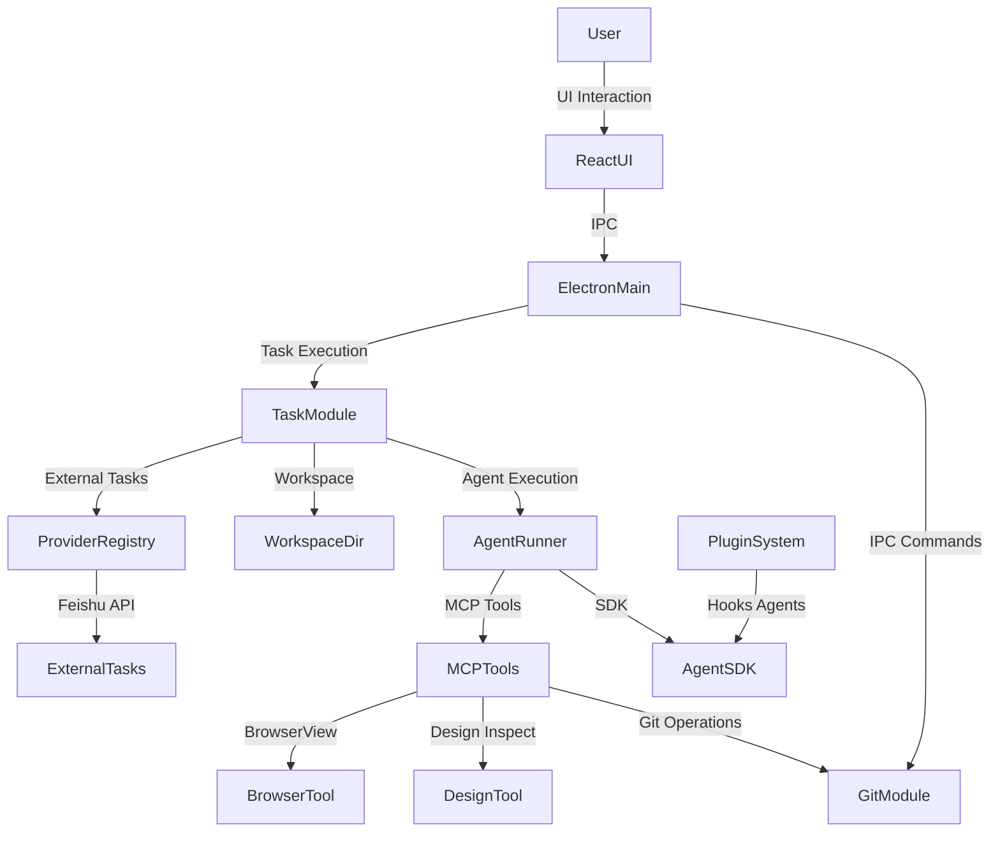
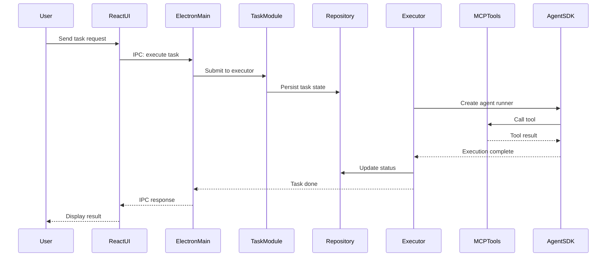

# 架构

**类型：** client-server

Electron-based desktop AI workbench with plugin system architecture. The app integrates AI agents (Claude Code compatible), task execution engine, built-in MCP tools (browser, design, git), and external task providers (Lark/Feishu). Main process handles all domain logic while React renderer provides the UI, connected via Electron IPC.

## 组件图

## 组件

### ElectronMain

Main process entry point, IPC handler registration, window management

文件：`src/electron/main.ts`

### TaskModule

Task queue system with Provider Registry, SQLite Repository, Executor for scheduling and execution

文件：`src/electron/libs/task/types.ts`, `src/electron/libs/task/provider-registry.ts`, `src/electron/libs/task/repository.ts`, `src/electron/libs/task/executor.ts`, `src/electron/libs/task/index.ts`

### GitModule

Git workbench capabilities exposed to agents via IPC

文件：`src/electron/libs/git/service.ts`, `src/electron/libs/git/ipc.ts`, `src/electron/libs/git/index.ts`

### MCPTools

Built-in Model Context Protocol tools (browser view, design inspection, figma REST, admin)

文件：`src/electron/libs/mcp-tools/browser.ts`, `src/electron/libs/mcp-tools/design.ts`, `src/electron/libs/mcp-tools/figma-rest.ts`, `src/electron/libs/mcp-tools/admin.ts`

### ReactUI

Renderer process UI components including Chat, TaskPanel, Settings, BrowserWorkbench

文件：`src/ui/components/PromptInput.tsx`, `src/ui/components/PreviewPanel.tsx`, `src/ui/components/ActivityRail.tsx`

### AgentSDK

Published npm package for external AI agent integration with Claude Code capabilities

文件：`package/sdk.mjs`, `package/sdk.d.ts`, `package/bridge.mjs`, `package/assistant.mjs`

### PluginSystem

Plugin framework allowing external workflows, commands, hooks and agents

文件：`pro-workflow/config.json`, `pro-workflow/dist/index.js`

## 关键流程

## 数据流

User interactions flow from React UI through Electron IPC to the main process, which orchestrates task execution via the Executor. Tasks are persisted in SQLite via Repository, executed in isolated workspaces with Agent SDK, and use MCP tools (browser, design, git) for domain operations. External task providers (Lark/Feishu) feed into the Provider Registry which feeds the task queue.
