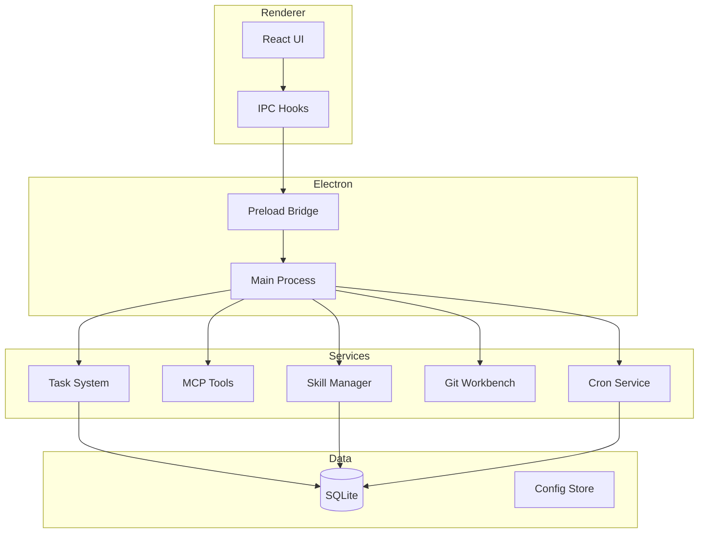
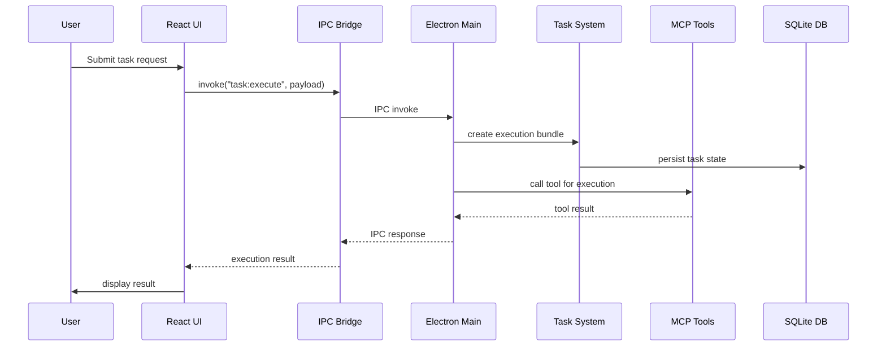

# 架构设计

**类型:** client-server

Electron desktop application with React frontend communicating via IPC to a main process that orchestrates AI agents, task execution, Git operations, and MCP tools. The system uses a layered architecture where the main process acts as a server handling persistence (SQLite), scheduling (Cron), and tool exposure.

## 组件图

## 组件

### ElectronMain

Main process server handling IPC, native operations, and orchestration

文件: `src/electron/main.ts`

### ReactUI

Renderer process providing the user interface with chat, task panel, and workbench

文件: `src/ui/App.tsx`, `src/ui/components/PromptInput.tsx`

### TaskSystem

SQLite-backed task persistence and execution with provider registry pattern

文件: `src/electron/libs/task/index.ts`, `src/electron/libs/task/repository.ts`, `src/electron/libs/task/executor.ts`

### MCPTools

Model Context Protocol tools exposed to AI agents (browser, design, figma, admin)

文件: `src/electron/libs/mcp-tools/browser.ts`, `src/electron/libs/mcp-tools/design.ts`

### SkillManager

Plugin and skill lifecycle management with marketplace integration

文件: `src/electron/libs/skill-manager/index.ts`, `src/electron/libs/skill-manager/db.js`

### GitWorkbench

Git operations for the right-side workbench (status, diff, commit, push)

文件: `src/electron/libs/git/service.ts`, `src/electron/libs/git/ipc.ts`

### CronService

Scheduled task execution with busy guard and persistence

文件: `src/electron/libs/cron-service.ts`, `src/electron/libs/cron-executor.js`

### ProWorkflow

Separate npm package for self-correction memory, wiki, and adaptive hooks

文件: `pro-workflow/src/index.ts`, `pro-workflow/scripts/*.js`

### ClaudeAgentSDK

SDK for building autonomous AI agents with tool capabilities

文件: `package/sdk.mjs`

## 时序图

## 数据流

User interactions flow from React UI through IPC bridge to Electron main process, which orchestrates task execution via TaskExecutor, exposes tools through MCP layer, and persists state in SQLite. The main process also manages cron scheduling, Git operations, and skill management as independent service layers, with ProWorkflow providing a separate self-correction and wiki system via its own SQLite store.
