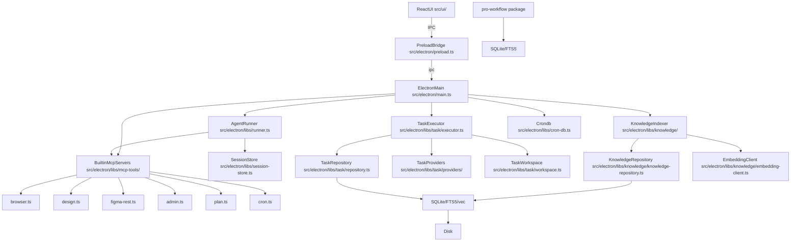
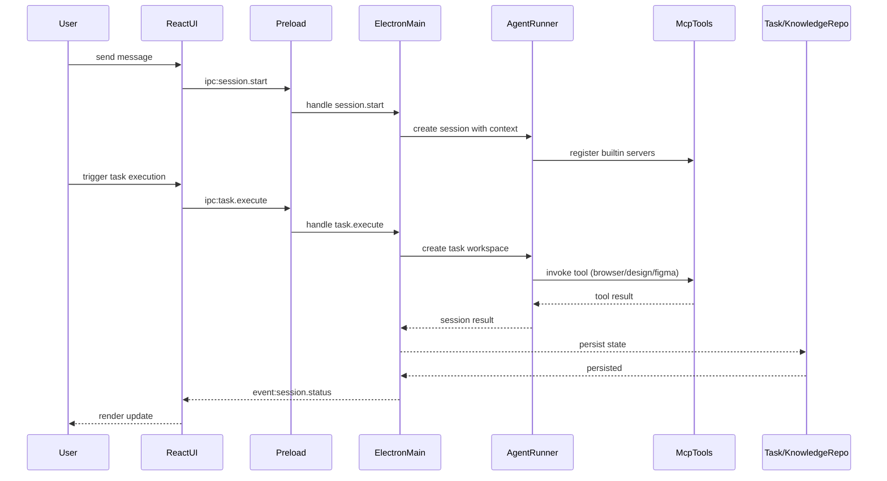

# 架构

**类型：** client-server

Electron 桌面工作台，前端为 React UI 通过 IPC 桥与主进程通信，主进程承载 Agent 运行时（基于 Claude Agent SDK）、任务编排器、知识库索引、SQLite 持久化层和内置 MCP 工具集。外部通过兼容 OpenAI/Anthropic 网关路由多模型，通过 MCP 工具访问浏览器、设计、Figma、Git 等能力。pro-workflow 为独立插件包注入自修正记忆和工作流模式。

## 组件图

## 组件

### ElectronMain

桌面端入口，注册窗口、IPC 通道、知识库通道和开发桥

文件：`src/electron/main.ts`, `src/electron/ipc-handlers.ts`, `src/electron/preload.ts`

### AgentRunner

Agent 执行引擎，负责 system prompt 拼接、上下文注入、工具调用和会话生命周期

文件：`src/electron/libs/runner.ts`, `src/electron/libs/session-store.ts`

### TaskSystem

任务编排层，支持多 provider、SQLite 持久化、并发执行、恢复重试

文件：`src/electron/libs/task/types.ts`, `src/electron/libs/task/provider-registry.ts`, `src/electron/libs/task/providers/lark.ts`, `src/electron/libs/task/repository.ts`, `src/electron/libs/task/executor.ts`, `src/electron/libs/task/workspace.ts`

### KnowledgeSystem

Repo Wiki 生成、chunk 切分、embedding 写入 sqlite-vec/FTS5、overview 注入 system prompt

文件：`src/electron/libs/knowledge/knowledge-repository.ts`, `src/electron/libs/knowledge/knowledge-indexer.ts`, `src/electron/libs/knowledge/knowledge-ui-store.ts`, `src/electron/libs/knowledge/knowledge-overview.ts`, `src/electron/libs/knowledge/embedding-client.ts`

### McpTools

内置 MCP 工具面，对 Agent 暴露 browser/design/git/plan/admin/cron 等能力

文件：`src/shared/builtin-mcp-registry.ts`, `src/electron/libs/builtin-mcp-servers.ts`, `src/electron/libs/mcp-tools/browser.ts`, `src/electron/libs/mcp-tools/design.ts`, `src/electron/libs/mcp-tools/figma-rest.ts`, `src/electron/libs/mcp-tools/admin.ts`, `src/electron/libs/mcp-tools/plan.ts`, `src/electron/libs/mcp-tools/cron.ts`

### SkillManager

技能市场、场景匹配、Skill 安装与 Tag 检索

文件：`src/electron/libs/skill-manager/db.ts`, `src/electron/libs/skill-manager/ipc-handlers.ts`

### ReactUI

前端入口，路由、状态管理、聊天、任务面板、设置页、知识库面板

文件：`src/ui/App.tsx`, `src/ui/store/useAppStore.ts`, `src/ui/components/PromptInput.tsx`, `src/ui/components/TaskPanel.tsx`, `src/ui/components/KnowledgePanel.tsx`

### CronScheduler

定时任务调度，SQLite 持久化，支持 session 绑定和自动执行

文件：`src/electron/libs/cron-db.ts`, `src/electron/libs/mcp-tools/cron.ts`

### ProWorkflowPlugin

独立 npm 包，为 Claude Code 提供自修正记忆、FTS5 wiki、质量门禁和工作流模式

文件：`pro-workflow/src/db/schema.sql`, `pro-workflow/scripts/commit-validate.js`, `pro-workflow/config.json`

### GitWorkbench

右侧 Git 工作台主进程模块，status/diff/stage/commit/branch/stash 等受限操作

文件：`src/electron/libs/git/service.ts`, `src/electron/libs/git/ipc.ts`

## 分层边界

### UI Layer

React 组件渲染、用户交互捕获、状态展示，不直接操作 Electron 主进程

证据文件：`src/ui/App.tsx`, `src/ui/components/PromptInput.tsx`, `src/ui/components/TaskPanel.tsx`, `src/ui/components/KnowledgePanel.tsx`, `src/ui/store/useAppStore.ts`

### IPC Bridge

Renderer 与 Main 进程间唯一合法通信通道，隔离上下文、保证安全

证据文件：`src/electron/preload.ts`

### Business Logic Layer

Agent 运行时、任务编排、知识库生成、技能管理、定时调度

证据文件：`src/electron/libs/runner.ts`, `src/electron/libs/task/executor.ts`, `src/electron/libs/knowledge/knowledge-indexer.ts`, `src/electron/libs/skill-manager/ipc-handlers.ts`, `src/electron/libs/cron-db.ts`

### Tool/Integration Layer

内置 MCP 工具面暴露给 Agent 的所有能力，包括浏览器、设计、Figma、Git、计划、管理

证据文件：`src/electron/libs/mcp-tools/browser.ts`, `src/electron/libs/mcp-tools/design.ts`, `src/electron/libs/mcp-tools/figma-rest.ts`, `src/electron/libs/mcp-tools/admin.ts`, `src/electron/libs/mcp-tools/plan.ts`, `src/electron/libs/mcp-tools/cron.ts`, `src/electron/libs/git/`

### Persistence Layer

SQLite + FTS5 + sqlite-vec 存储会话、任务、知识、技能的领域数据

证据文件：`src/electron/libs/task/repository.ts`, `src/electron/libs/knowledge/knowledge-repository.ts`, `src/electron/libs/knowledge/knowledge-ui-store.ts`, `src/electron/libs/skill-manager/db.ts`, `src/electron/libs/cron-db.ts`, `src/electron/libs/learning-store.ts`

## 边界规则

- Renderer ↔ Main: 仅通过 preload IPC 通信，不直接导入 Electron 模块，证据：src/ui/* 通过 window.electronAPI invoke，src/electron/preload.ts 暴露 typed channel
- 外部 Provider ↔ 内部: Task provider 只做数据映射，不操作 UI 或会话，证据：src/electron/libs/task/providers/lark.ts 只输出 ExternalTask
- 生成状态 ↔ UI: 知识库生成状态必须落在 knowledge_ui_generation 而非前端 state，证据：src/ui/components/KnowledgePanel.tsx 通过 bridge 重新拉取后端状态
- MCP 工具 ↔ React UI: MCP 工具不直接操作 React 组件，返回结构化 JSON 和路径，证据：src/electron/libs/mcp-tools/README.md 明确工具边界

## 集成点

- model-gateway: 兼容 OpenAI/Anthropic 的网关路由，owner src/electron/libs/runner.ts，配置在 Settings → AI接口
- feishu-tasks: 飞书任务同步，owner src/electron/libs/task/providers/lark.ts，通过 TaskExecutor 调度执行
- figma-rest-api: Figma PAT 只读工具面，owner src/electron/libs/mcp-tools/figma-rest.ts
- browser-view: 内置 BrowserView 作为 MCP 工具执行环境，owner src/electron/libs/mcp-tools/browser.ts
- pro-workflow-plugin: 独立 npm 包注入自修正记忆，owner pro-workflow/，通过 Claude Code hooks 和 commands 工作
- electron-builder: 桌面端打包发布，owner electron-builder.json，配置多平台构建和自动更新
- **知识库生成、索引与注入**：`src/ui/components/KnowledgePanel.tsx`, `src/electron/libs/knowledge/knowledge-ui-store.ts`, `src/electron/libs/knowledge/knowledge-indexer.ts`, `src/electron/libs/knowledge/knowledge-repository.ts`, `src/electron/libs/knowledge/knowledge-overview.ts`, `src/electron/libs/runner.ts`
- **聊天会话执行**：`src/electron/ipc-handlers.ts`, `src/electron/libs/session-store.ts`, `src/electron/libs/runner.ts`, `src/ui/store/useAppStore.ts`
- **任务同步与执行**：`src/electron/libs/task/provider-registry.ts`, `src/electron/libs/task/repository.ts`, `src/electron/libs/task/executor.ts`, `src/electron/libs/task/workspace.ts`
- **内置 MCP 工具面**：`src/shared/builtin-mcp-registry.ts`, `src/electron/libs/builtin-mcp-servers.ts`, `src/electron/libs/mcp-tools/browser.ts`, `src/electron/libs/mcp-tools/design.ts`, `src/electron/libs/mcp-tools/plan.ts`

## 关键流程

## 数据流

用户输入 → React UI → IPC Bridge → Electron Main → AgentRunner（拼接 system prompt、注入上下文/规则/MCP/知识库 overview）→ Claude Agent SDK 调用兼容网关 → 工具调用路由到内置 MCP 工具（browser/design/figma/cron/admin）→ 执行结果写回 Runner → 会话状态持久化到 SQLite/FTS5/向量库 → 事件流推送回 UI 更新渲染。任务执行走独立 Workspace，由 TaskExecutor 编排并发/恢复/重试，回写飞书等外部来源。知识库生成走 workspace → indexer（chunk + embedding）→ repository（FTS5 + sqlite-vec）→ overview 注入 system prompt。
