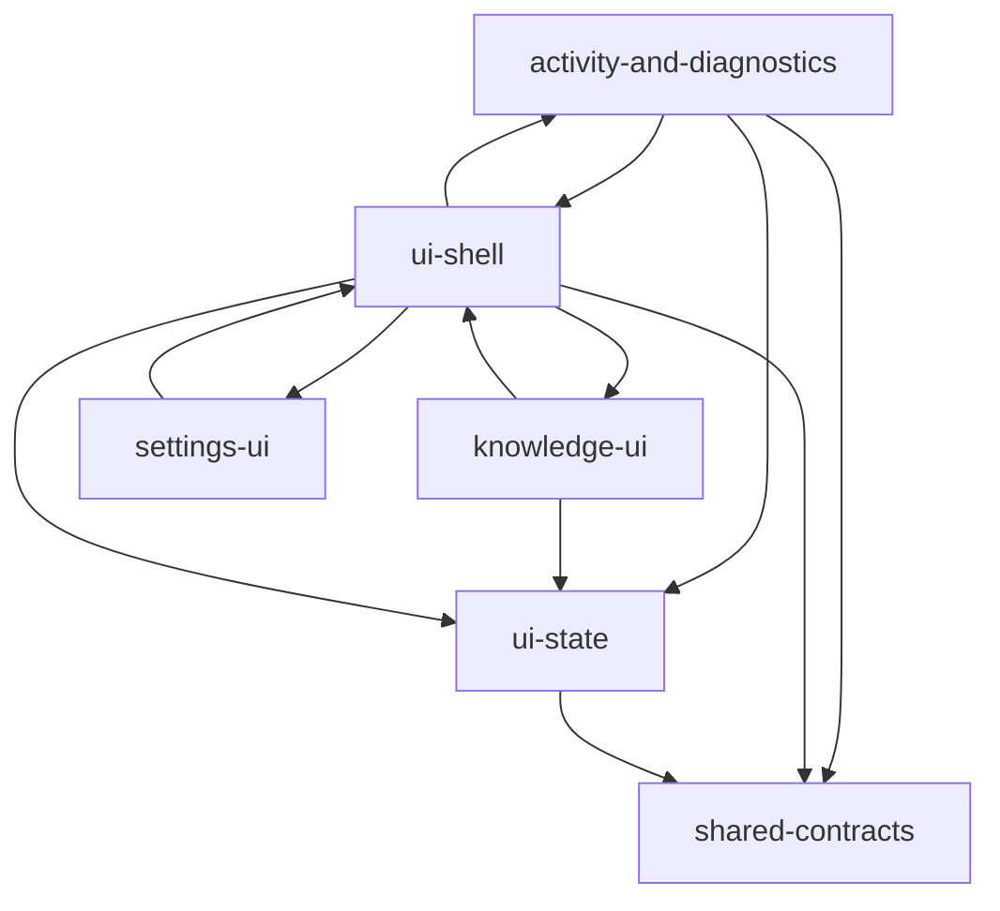

# 模块依赖

## 核心文件 (PageRank)

1. `src/ui/types.ts`
2. `src/shared/slash-commands.ts`
3. `src/ui/store/useAppStore.ts`
4. `src/ui/components/settings/skill-utils.ts`
5. `src/ui/components/git/git-ui-utils.ts`
6. `src/ui/utils/clipboard.ts`
7. `pro-workflow/src/db/index.ts`
8. `src/ui/components/settings/CodeEditor.tsx`
9. `src/ui/render/markdown.tsx`
10. `src/ui/events.ts`
11. `src/ui/components/settings/settings-utils.ts`
12. `src/ui/components/settings/plugin-toast-messages.ts`

## 可能入口

- `doc/adr/README.md`
- `doc/README.md`
- `package.json`
- `package/package.json`
- `package/README.md`
- `pro-workflow/.claude-plugin/README.md`
- `pro-workflow/config.json`
- `pro-workflow/package.json`
- `pro-workflow/README.md`
- `pro-workflow/tsconfig.json`
- `README.md`
- `src/electron/libs/git/README.md`
