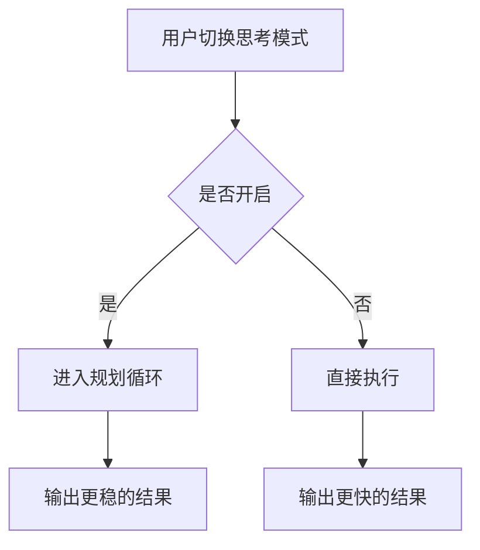

# doc/40-product/1.0.0/10-requirements/17-竞品功能拆解/04-思考模式.md

> 模块：`doc` · 语言：`markdown` · 行数：62

## 文件职责

此页由 RepoWiki 从真实源码生成，用于让 Agent 快速定位文件职责、符号、依赖和可修改面。

## Agent 使用提示

- 修改此文件前，先查看同模块页面和本页的运行信号。
- 如果本页包含 IPC、MCP、DB 表或 UI 调用，改动后要同时验证前后端桥接和索引结果。
- 检索时可以用文件名、关键符号名、IPC channel 或表名作为 query。

## 源码摘录

```markdown
---
doc_id: "PRD-100-17-04"
title: "04-思考模式"
doc_type: "prd"
layer: "PM"
status: "active"
version: "1.0.0"
last_updated: "2026-04-21"
owners:
  - "Product"
tags:
  - "zcode"
  - "thinking"
sources:
  - "https://zhipu-ai.feishu.cn/wiki/Qr2SwyBsTiSlaYkqBECcxCWnn4c"
---

# 04-思考模式

## Goal
为用户提供显式的“快响应 / 深思考”切换能力。

## Problem
用户对 Agent 的主要不满常见于两端：要么太慢，要么太草率。思考模式本质上不是模型能力，而是产品把执行策略显式化。

## Scope
- 思考模式开关
- 思考模式状态展示
- 思考路径进入规划阶段
- 快速路径直达执行阶段

## Flow


## Detail
- 开启后应让用户感知到系统正在规划，而不是只是无响应。
- 关闭后应减少中间过程和额外等待。
- 思考模式需要和模型状态一起展示，避免用户误以为是模型差异。

## State Model
- `off`
- `on`
- `planning`
- `executing`

## Edge Cases
- 长规划时应有可见状态。
- 任务极简单时，开启思考模式不应无限放大成本。

## Acceptance
1. 用户可以明确切换思考模式。
1. 开启与关闭时的任务路径有感知差异。
1. 当前模式在输入区和任务详情都可见。


```
