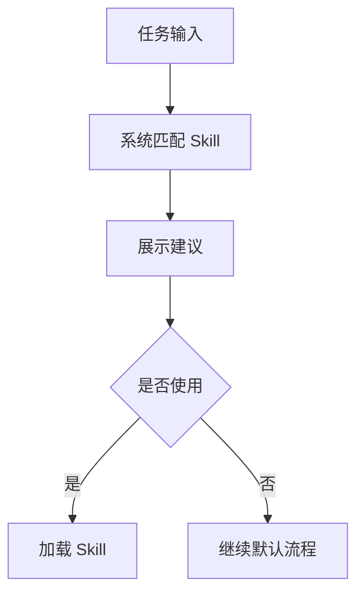

# doc/40-product/1.0.0/10-requirements/17-竞品功能拆解/07-Skill支持.md

> 模块：`doc` · 语言：`markdown` · 行数：75

## 文件职责

此页由 RepoWiki 从真实源码生成，用于让 Agent 快速定位文件职责、符号、依赖和可修改面。

## Agent 使用提示

- 修改此文件前，先查看同模块页面和本页的运行信号。
- 如果本页包含 IPC、MCP、DB 表或 UI 调用，改动后要同时验证前后端桥接和索引结果。
- 检索时可以用文件名、关键符号名、IPC channel 或表名作为 query。

## 源码摘录

```markdown
---
doc_id: "PRD-100-17-07"
title: "07-Skill支持"
doc_type: "prd"
layer: "PM"
status: "active"
version: "1.0.0"
last_updated: "2026-04-21"
owners:
  - "Product"
tags:
  - "zcode"
  - "skill"
  - "behavior"
sources:
  - "https://zhipu-ai.feishu.cn/wiki/Qr2SwyBsTiSlaYkqBECcxCWnn4c"
---

# 07-Skill支持

## Goal
把团队方法论、行为规范和操作流程做成可复用 Skill。

## Problem
没有 Skill 时，团队规范只能靠口头或 README 传播，Agent 很难长期稳定遵守。竞品把 Skill 做成可管理资产，解决的是“怎么做”的一致性。

## Scope
- User Skill
- Project Skill
- Plugin Skill
- Skill 预览
- Skill 启用 / 禁用
- Skill 自动匹配
- Skill 手动选择

## Flow


## Required Fields
- `name`
- `description`
- `scope`
- `type`
- `content`
- `enabled`

## Detail
- Skill 的核心价值不是多一个文本文件，而是把行为约束放进产品工作流。
- Skill 需要支持查看元数据、正文、来源和启用状态。
- 自动匹配和手动选择必须共存。

## State Model
- `matched`
- `suggested`
- `enabled`
- `disabled`
- `editing`

## Edge Cases
- 多个 Skill 同时命中时要有排序或合并策略。
- 超长 Skill 正文要折叠显示。

## Acceptance
1. Skill 可查看、编辑、启停。
1. Skill 能影响 Agent 行为。
1. 技能来源范围可见。


```
