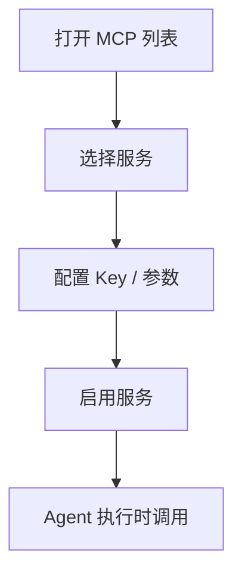

# doc/40-product/1.0.0/10-requirements/17-竞品功能拆解/09-MCP服务.md

> 模块：`doc` · 语言：`markdown` · 行数：66

## 文件职责

此页由 RepoWiki 从真实源码生成，用于让 Agent 快速定位文件职责、符号、依赖和可修改面。

## Agent 使用提示

- 修改此文件前，先查看同模块页面和本页的运行信号。
- 如果本页包含 IPC、MCP、DB 表或 UI 调用，改动后要同时验证前后端桥接和索引结果。
- 检索时可以用文件名、关键符号名、IPC channel 或表名作为 query。

## 源码摘录

```markdown
---
doc_id: "PRD-100-17-09"
title: "09-MCP服务"
doc_type: "prd"
layer: "PM"
status: "active"
version: "1.0.0"
last_updated: "2026-04-21"
owners:
  - "Product"
tags:
  - "zcode"
  - "mcp"
  - "tooling"
sources:
  - "https://zhipu-ai.feishu.cn/wiki/Qr2SwyBsTiSlaYkqBECcxCWnn4c"
---

# 09-MCP服务

## Goal
把外部工具能力纳入统一服务管理层，而不是散落在单次任务里。

## Problem
如果没有 MCP 管理层，工具接入会变成一堆隐式能力，用户很难理解“现在能做什么、不能做什么、为什么失败”。

## Scope
- 内置 MCP 列表
- 自定义 MCP
- 配置页
- 启用 / 禁用
- 状态和错误展示
- 服务用途说明

## Flow


## Detail
- 至少要覆盖视觉理解、联网搜索、网页读取三类典型能力。
- 每个服务都应展示状态、用途、配置入口和错误信息。
- 用户需要知道“这是系统能力，不是单次 Prompt 魔法”。

## State Model
- `disabled`
- `configuring`
- `enabled`
- `error`
- `unavailable`

## Edge Cases
- 配置缺失时不能默默失败。
- Key 错误要能定位到具体服务。
- 不能泄露敏感密钥。

## Acceptance
1. 用户能看到服务列表和状态。
1. 用户能配置并启用服务。
1. Agent 能通过 MCP 获得扩展工具能力。


```
