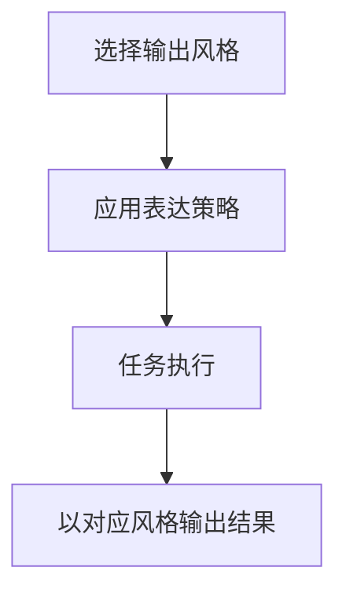

# doc/40-product/1.0.0/10-requirements/17-竞品功能拆解/16-OutputStyle.md

> 模块：`doc` · 语言：`markdown` · 行数：46

## 文件职责

此页由 RepoWiki 从真实源码生成，用于让 Agent 快速定位文件职责、符号、依赖和可修改面。

## Agent 使用提示

- 修改此文件前，先查看同模块页面和本页的运行信号。
- 如果本页包含 IPC、MCP、DB 表或 UI 调用，改动后要同时验证前后端桥接和索引结果。
- 检索时可以用文件名、关键符号名、IPC channel 或表名作为 query。

## 源码摘录

```markdown
---
doc_id: "PRD-100-17-16"
title: "16-OutputStyle"
doc_type: "prd"
layer: "PM"
status: "active"
version: "1.0.0"
last_updated: "2026-04-21"
owners:
  - "Product"
tags:
  - "zcode"
  - "output-style"
sources:
  - "https://zhipu-ai.feishu.cn/wiki/Qr2SwyBsTiSlaYkqBECcxCWnn4c"
---

# 16-OutputStyle

## Goal
让 Agent 的表达风格和交互方式可配置，而不改变核心执行能力。

## Scope
- 预设风格列表
- 风格选择
- 风格生效反馈
- 自定义风格入口

## Flow


## Detail
- 预设风格至少包括默认、解释型、学习型、轻松型、结构化型。
- 输出风格影响表达方式、解释程度和交互语气，不应影响工具能力。

## Acceptance
1. 用户可切换输出风格。
1. 风格变化能体现在回答方式上。
1. 执行能力不会因风格变化而丢失。


```
