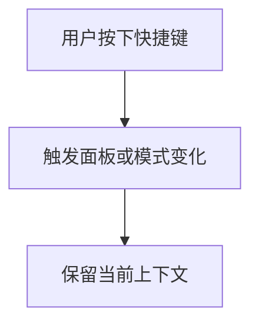

# doc/40-product/1.0.0/10-requirements/17-竞品功能拆解/17-快捷键.md

> 模块：`doc` · 语言：`markdown` · 行数：46

## 文件职责

此页由 RepoWiki 从真实源码生成，用于让 Agent 快速定位文件职责、符号、依赖和可修改面。

## Agent 使用提示

- 修改此文件前，先查看同模块页面和本页的运行信号。
- 如果本页包含 IPC、MCP、DB 表或 UI 调用，改动后要同时验证前后端桥接和索引结果。
- 检索时可以用文件名、关键符号名、IPC channel 或表名作为 query。

## 源码摘录

```markdown
---
doc_id: "PRD-100-17-17"
title: "17-快捷键"
doc_type: "prd"
layer: "PM"
status: "active"
version: "1.0.0"
last_updated: "2026-04-21"
owners:
  - "Product"
tags:
  - "zcode"
  - "shortcut"
  - "keyboard"
sources:
  - "https://zhipu-ai.feishu.cn/wiki/Qr2SwyBsTiSlaYkqBECcxCWnn4c"
---

# 17-快捷键

## Goal
把高频操作从鼠标迁移到键盘，提高资深用户效率。

## Scope
- 窗口级快捷键
- 输入区快捷键
- 模式切换快捷键
- 终端和侧栏快捷键

## Flow


## Detail
- 快捷键至少覆盖新建会话、聚焦输入框、打开终端、切换侧栏、切换模式。
- 快捷键文档必须和界面行为一致。

## Acceptance
1. 高频动作有一致快捷键。
1. 快捷键不会破坏当前编辑上下文。
1. 快捷键状态和 UI 状态同步。


```
