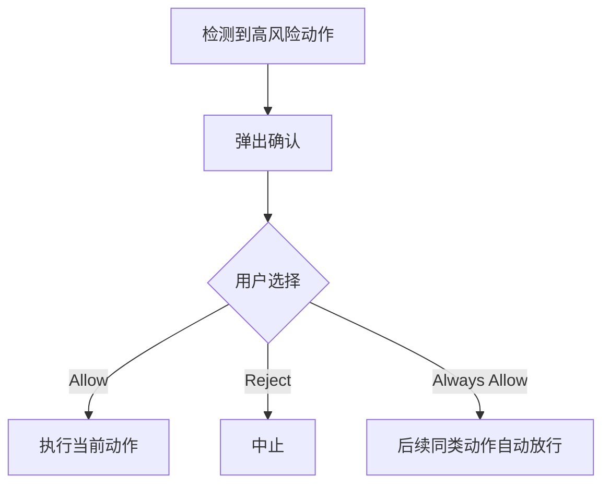

# doc/40-product/1.0.0/10-requirements/17-竞品功能拆解/18-安全操作确认.md

> 模块：`doc` · 语言：`markdown` · 行数：51

## 文件职责

此页由 RepoWiki 从真实源码生成，用于让 Agent 快速定位文件职责、符号、依赖和可修改面。

## Agent 使用提示

- 修改此文件前，先查看同模块页面和本页的运行信号。
- 如果本页包含 IPC、MCP、DB 表或 UI 调用，改动后要同时验证前后端桥接和索引结果。
- 检索时可以用文件名、关键符号名、IPC channel 或表名作为 query。

## 源码摘录

```markdown
---
doc_id: "PRD-100-17-18"
title: "18-安全操作确认"
doc_type: "prd"
layer: "PM"
status: "active"
version: "1.0.0"
last_updated: "2026-04-21"
owners:
  - "Product"
tags:
  - "zcode"
  - "safety"
  - "confirmation"
sources:
  - "https://zhipu-ai.feishu.cn/wiki/Qr2SwyBsTiSlaYkqBECcxCWnn4c"
---

# 18-安全操作确认

## Goal
对高风险动作提供人工确认，避免 Agent 越权或误操作。

## Problem
高风险动作如果完全自动执行，会带来强烈不信任感。竞品用确认弹层解决的是“谁对关键动作做最后决策”。

## Scope
- 高风险动作识别
- 确认弹层
- Allow / Reject / Always Allow

## Flow


## Detail
- 这是竞品完整性能力。
- 当前我们的主线不优先做，但未来可以接成轻量治理层。

## Acceptance
1. 高风险动作前能触发确认。
1. 三种决策可区分。
1. 当前版本可不实现，但文档需保留。


```
