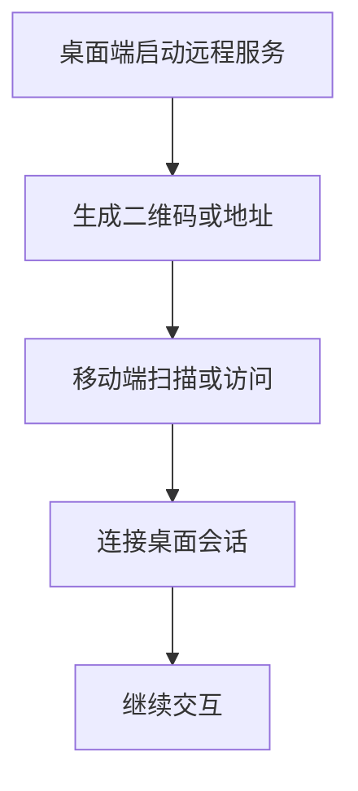

# doc/40-product/1.0.0/10-requirements/17-竞品功能拆解/19-移动端远程开发.md

> 模块：`doc` · 语言：`markdown` · 行数：49

## 文件职责

此页由 RepoWiki 从真实源码生成，用于让 Agent 快速定位文件职责、符号、依赖和可修改面。

## Agent 使用提示

- 修改此文件前，先查看同模块页面和本页的运行信号。
- 如果本页包含 IPC、MCP、DB 表或 UI 调用，改动后要同时验证前后端桥接和索引结果。
- 检索时可以用文件名、关键符号名、IPC channel 或表名作为 query。

## 源码摘录

```markdown
---
doc_id: "PRD-100-17-19"
title: "19-移动端远程开发"
doc_type: "prd"
layer: "PM"
status: "active"
version: "1.0.0"
last_updated: "2026-04-21"
owners:
  - "Product"
tags:
  - "zcode"
  - "remote"
  - "beta"
sources:
  - "https://zhipu-ai.feishu.cn/wiki/Qr2SwyBsTiSlaYkqBECcxCWnn4c"
---

# 19-移动端远程开发

## Goal
让用户从移动端连接桌面会话或远程会话，在不带电脑的情况下继续处理任务。

## Problem
这是竞品的完整性功能，解决的是“离开桌面后是否还能继续工作”的场景，而不是主工作台本身的能力闭环。

## Scope
- 桌面启动服务
- 二维码 / 地址生成
- 移动端连接
- 远程会话控制

## Flow


## Detail
- 当前只保留竞品参考，不作为我们当前主线。
- 如果未来进入路线图，应与桌面工作台、会话状态和权限模型一起设计。

## Acceptance
1. 能明确描述其连接形态和产品价值。
1. 当前版本不要求实现。

```
