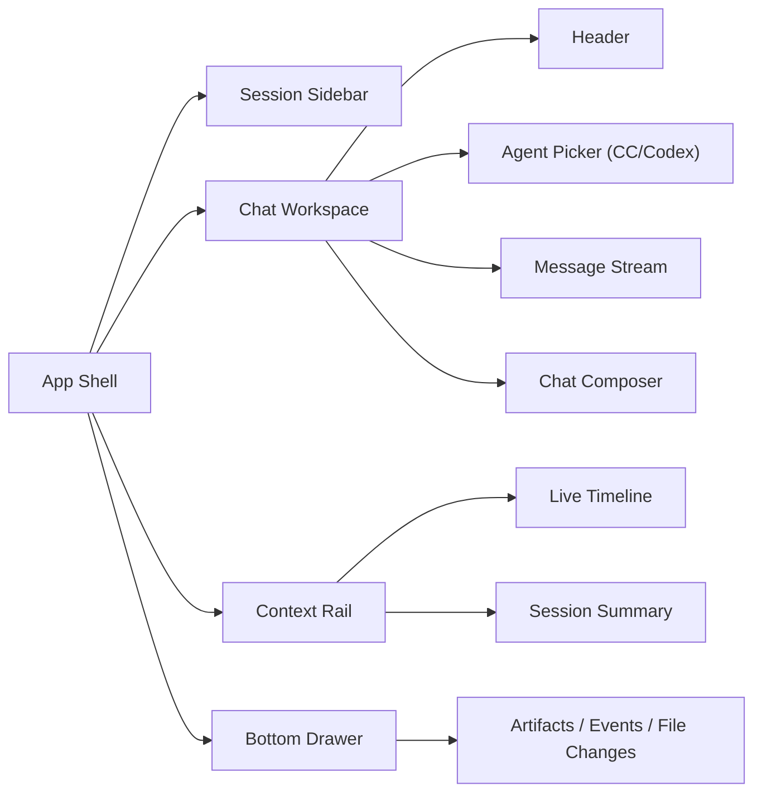
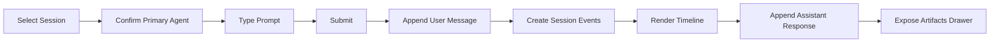

# doc/40-product/1.0.0/40-delivery/57-S0可执行原型图.md

> 模块：`doc` · 语言：`markdown` · 行数：130

## 文件职责

此页由 RepoWiki 从真实源码生成，用于让 Agent 快速定位文件职责、符号、依赖和可修改面。

## Agent 使用提示

- 修改此文件前，先查看同模块页面和本页的运行信号。
- 如果本页包含 IPC、MCP、DB 表或 UI 调用，改动后要同时验证前后端桥接和索引结果。
- 检索时可以用文件名、关键符号名、IPC channel 或表名作为 query。

## 源码摘录

```markdown
---
doc_id: "PRD-100-57"
title: "57-S0可执行原型图"
doc_type: "delivery"
layer: "PM"
status: "active"
version: "1.0.0"
last_updated: "2026-04-19"
owners:
  - "Product"
  - "Engineering"
tags:
  - "claw"
  - "docs"
  - "1.0.0"
  - "prototype"
  - "s0"
---

# 57-S0可执行原型图

## Purpose
用本地可执行原型图固定 `S0 / FE-M1 / BE-M1` 的页面结构、交互主链路和工程实现范围，替代本轮放弃的 Figma 路径。

## Scope
本文件只覆盖第一开发切片：
- `Session Sidebar`
- `Chat Workspace`
- `Live Timeline`
- `Artifacts Drawer`
- `Session / Chat / Event` 最小后端主链路

## Inputs / Outputs
- Inputs:
  - [34-MVP切片与迭代路线图.md](../../../30-operations/34-MVP%E5%88%87%E7%89%87%E4%B8%8E%E8%BF%AD%E4%BB%A3%E8%B7%AF%E7%BA%BF%E5%9B%BE.md)
  - [41-前端开发文档.md](./41-%E5%89%8D%E7%AB%AF%E5%BC%80%E5%8F%91%E6%96%87%E6%A1%A3.md)
  - [42-后端开发文档.md](./42-%E5%90%8E%E7%AB%AF%E5%BC%80%E5%8F%91%E6%96%87%E6%A1%A3.md)
- Outputs:
  - 第一开发切片的页面原型
  - 实现优先级
  - QA 主路径

## Behavior / Flow
### Application Shell



### Chat Main Path



### S0 Screen Wireframe

```text
┌──────────────────────────────────────────────────────────────────────────────┐
│ CLAW Shell                                                                  │
├───────────────┬──────────────────────────────────────┬───────────────────────┤
│ Session       │ Chat Workspace                       │ Context Rail          │
│ Sidebar       │                                      │                       │
│               │  Header                              │  Live Timeline        │
│ - Today       │  Agent Picker: [Claude Code] [Codex]│  - session_created    │
│ - Recent      │                                      │  - agent_selected     │
│ - Pinned      │  Message Stream                      │  - user_input         │
│               │  - human                             │  - assistant_output   │
│               │  - assistant                         │                       │
│               │                                      │  Session Summary      │
│               │  Composer                            │  - agent              │
│               │  [input.........................][↵] │  - status             │
├───────────────┴──────────────────────────────────────┴───────────────────────┤
│ Bottom Drawer: Artifacts / Events / File Changes                             │
└──────────────────────────────────────────────────────────────────────────────┘
```

## Interfaces / Types
### Included in S0

| Area | Included |
|---|---|
| `Frontend` | Shell, Session Sidebar, Chat Workspace, Context Rail, Drawer |
| `Backend` | `SessionController`, `ChatController`, `EventController` |
| `State` | Session list, active session, active agent, messages, timeline |
| `Transport` | HTTP + minimal WebSocket |

### Deferred

| Area | Deferred To |
|---|---|
| `Task Graph` | `S1` |
| `ReplayDocument` | `S1` |
| `AnalysisReport` | `S1` |
| `SpecAsset Center` | `S3` |
| `Governance / Conflicts` | `S4` |

## Failure Modes
- 如果 S0 一开始就把任务图和分析全做进来，开发会失去最小闭环。
- 如果 S0 不保留 Context Rail 和 Bottom Drawer，后续证据闭环会重新返工。

## Observability
- S0 必须产生这些前后端事件：
  - `session_created`
  - `chat_agent_selected`
  - `user_input_submitted`
  - `assistant_output_appended`
  - `timeline_event_rendered`
  - `artifacts_drawer_opened`


```
