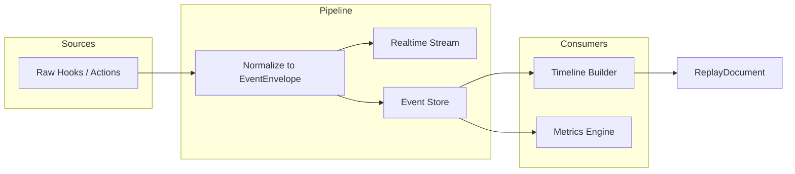
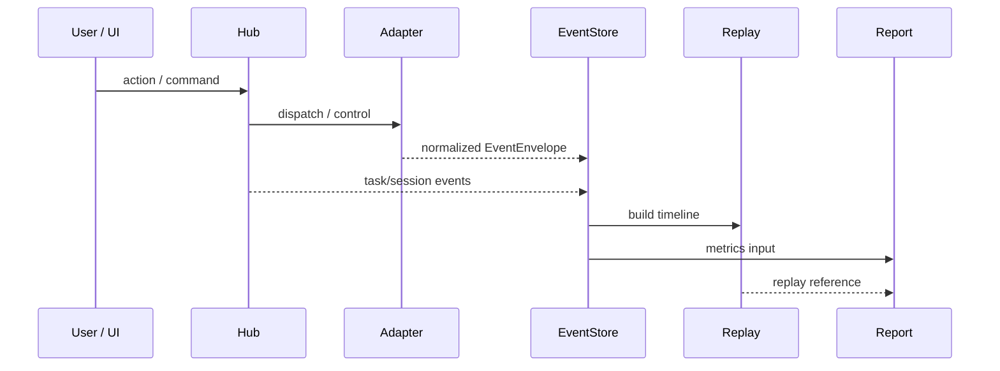

# 事件模型与可观测规范

<cite>
**本文引用的文件**
- [skills/tech-cc-hub-release-deploy/scripts/publish-release.mjs](file://skills/tech-cc-hub-release-deploy/scripts/publish-release.mjs)
- [scripts/github-release.mjs](file://scripts/github-release.mjs)
- [src/electron/libs/system-prompt-presets.ts](file://src/electron/libs/system-prompt-presets.ts)
- [doc/20-specs/24-事件模型与可观测规范.md](file://doc/20-specs/24-事件模型与可观测规范.md)
- [skills/tech-cc-hub-release-deploy/SKILL.md](file://skills/tech-cc-hub-release-deploy/SKILL.md)
- [skills/tech-cc-hub-release-deploy/agents/openai.yaml](file://skills/tech-cc-hub-release-deploy/agents/openai.yaml)
- [pro-workflow/skills/wiki-research-loop/scripts/research-loop.js](file://pro-workflow/skills/wiki-research-loop/scripts/research-loop.js)
- [src/electron/libs/git/README.md](file://src/electron/libs/git/README.md)
- [src/electron/libs/mcp-tools/README.md](file://src/electron/libs/mcp-tools/README.md)
</cite>

# 事件模型与可观测规范

## 目录

- [1. 概述与目的](#1-概述与目的)
- [2. EventEnvelope 核心结构](#2-eventenvelope-核心结构)
- [3. 事件来源与分类](#3-事件来源与分类)
- [4. 事件流：归一化到持久化](#4-事件流归一化到持久化)
- [5. 证据链闭环架构](#5-证据链闭环架构)
- [6. 发布部署脚本的事件行为](#6-发布部署脚本的事件行为)
- [7. 工具调用的可观测扩展](#7-工具调用的可观测扩展)
- [8. 失败模式与排障](#8-失败模式与排障)
- [9. 可观测性指标](#9-可观测性指标)
- [10. 扩展点与后续演进](#10-扩展点与后续演进)

---

## 1. 概述与目的

本规范定义 tech-cc-hub 统一的事件模型，为所有执行、干预、回放和分析建立同一条证据链。

**核心目标**：
- 所有关键行为先变成事件，再更新聚合状态
- 事件不可原地重写，只允许追加和补充关联
- 回放和分析只消费标准化事件，不直接消费原始日志
- 用户动作与系统动作同等重要，必须同链记录

本规范覆盖事件信封格式、事件类别、事件来源、实时流和持久化要求。不定义分析评分公式和最终报告模板（见 `doc/30-operations/32-回放与分析报告规范.md`）。

**章节来源**：[doc/20-specs/24-事件模型与可观测规范.md#L19-L26](file://doc/20-specs/24-事件模型与可观测规范.md#L19-L26)

---

## 2. EventEnvelope 核心结构

`EventEnvelope` 是全系统统一的事件信封，所有事件都必须包装在此结构中流转。

### 字段定义

| 字段 | 类型 | 含义 | 必填 |
|------|------|------|------|
| `event_id` | string | 事件唯一标识，建议 UUID | 是 |
| `ts` | ISO8601 | 事件发生时间 | 是 |
| `source` | string | 来源系统标识 | 是 |
| `event_type` | string | 统一事件类型，格式 `family.action` | 是 |
| `session_id` | string | 所属会话 ID | 否 |
| `task_id` | string | 关联任务 ID | 否 |
| `worker_run_id` | string | 关联 Worker 执行实例 | 否 |
| `agent_type` | string | Claude Code / Codex / other | 否 |
| `payload` | object | 标准化内容主体 | 是 |
| `trace` | object | 链路信息（trace_id、parent_event_id） | 否 |
| `extension` | object | agent-specific 扩展字段 | 否 |

### 核心事件族

| Event Family | 示例事件 | 触发场景 |
|--------------|----------|----------|
| `session.*` | start, pause, resume, stop | 会话创建、用户中断、恢复执行 |
| `task.*` | create, split, assign, block, merge | 任务拆分、Worker 分配、结果合并 |
| `worker.*` | start, heartbeat, complete, fail, cancel | Worker 生命周期各状态 |
| `agent.*` | input, output, tool, permission, subagent | LLM 输入输出、工具调用、权限请求 |
| `context.*` | snapshot, diff, merge, conflict | 上下文快照、变更、冲突检测 |
| `artifact.*` | file_change, replay_generated, report_generated | 文件变更、产物生成 |
| `human.*` | intervene, approve, reject, revise | 人工介入、审批、修订 |

**章节来源**：[doc/20-specs/24-事件模型与可观测规范.md#L90-L117](file://doc/20-specs/24-事件模型与可观测规范.md#L90-L117)

---

## 3. 事件来源与分类

事件来源分为六大类，每类有其独特的触发机制和 payload 结构。

### 来源矩阵

| Source | 示例事件 | 触发机制 |
|--------|----------|----------|
| `user` | 发送消息、改任务图、批准权限 | UI 操作 → IPC → EventStore |
| `hub` | 拆分任务、分配 Worker、合并结果 | Hub 控制平面逻辑 |
| `agent_adapter` | session start、command map、normalization error | 适配器层归一化处理 |
| `agent_os` | tool use、permission request、subagent events | AgentOS raw hooks |
| `storage` | snapshot write、report generation | 存储层异步任务 |
| `analysis` | metrics complete、report complete | 分析引擎完成通知 |

### 分类原则

1. **按时间顺序追加**：事件按时间顺序写入 EventStore，不存在更新操作
2. **关联字段必填**：session_id、task_id、worker_run_id 至少填一个
3. **payload 结构化**：每个 event_type 对应明确的 payload schema

**章节来源**：[doc/20-specs/24-事件模型与可观测规范.md#L43-L53](file://doc/20-specs/24-事件模型与可观测规范.md#L43-L53)

---

## 4. 事件流：归一化到持久化



### 处理阶段

| 阶段 | 职责 | 输出 |
|------|------|------|
| **Raw Hook 捕获** | 接收来自 AgentOS、Hub、UI 的原始信号 | 原始事件对象 |
| **归一化** | 将原始事件转换为标准 EventEnvelope | 标准化事件 |
| **实时流** | 推送给前端实时展示 | WebSocket/IPC 推送 |
| **持久化** | 写入 EventStore | 可查询的事件记录 |
| **时间线构建** | 按 session_id 和 ts 重放事件序列 | Timeline |
| **指标计算** | 聚合事件生成度量数据 | Metrics |

### Replay 必留事件

以下事件类型必须在回放中保留，不能被优化掉：

- session start/stop
- task split/assign/complete
- permission requests and decisions
- tool failure / retry
- human intervention
- merge decisions

**章节来源**：[doc/20-specs/24-事件模型与可观测规范.md#L54-L69](file://doc/20-specs/24-事件模型与可观测规范.md#L54-L69)

---

## 5. 证据链闭环架构



### 闭环要素

1. **用户动作**：UI → Hub → EventStore，链路完整
2. **系统动作**：Hub 控制平面生成的事件也进入 EventStore
3. **时间线重建**：EventStore 提供原始数据给 Replay 模块
4. **报告生成**：Replay 和 Metrics 数据汇入 Report

**图表来源**：[doc/20-specs/24-事件模型与可观测规范.md#L71-L88](file://doc/20-specs/24-事件模型与可观测规范.md#L71-L88)

---

## 6. 发布部署脚本的事件行为

发布部署脚本 (`publish-release.mjs` 和 `github-release.mjs`) 在执行过程中产生关键事件，但目前**未直接写入 EventEnvelope**，属于隐式可观测场景。

### publish-release.mjs 事件流

```
┌─────────────────────────────────────────────────────────────┐
│                    publish-release.mjs                        │
├─────────────────────────────────────────────────────────────┤
│  1. Git push 尝试                                            │
│     └─ 成功 → 发布完成事件                                    │
│     └─ 失败检测 (isGitDiscoveryFailure)                      │
│         └─ API fallback 模式                                 │
│             ├─ getCredentialToken (GH_TOKEN/GITHUB_TOKEN)    │
│             ├─ 读取本地 commits 列表                         │
│             ├─ 逐个创建 blob/tree/commit                     │
│             ├─ 校验 GitHub API tree SHA == 本地 SHA          │
│             ├─ 更新 refs/heads/main                          │
│             ├─ 创建/移动 annotated tag                        │
│             └─ 可选：更新 Release body                        │
└─────────────────────────────────────────────────────────────┘
```

### 关键函数与事件映射

| 函数 | 事件类型 | 触发条件 |
|------|----------|----------|
| `publishViaApi` | deploy.start | 进入 API fallback 模式 |
| `createApiTreeForCommit` | deploy.commit_prepared | 每个 commit 处理完成 |
| `updateReleaseNotes` | release.notes_updated | `--notes-only` 模式 |
| `syncOriginMain` | deploy.ref_synced | refs 更新完成 |

### 凭证获取事件

```javascript
// 获取顺序：GH_TOKEN → GITHUB_TOKEN → git credential fill
function getCredentialToken() {
  if (process.env.GH_TOKEN) return process.env.GH_TOKEN;
  if (process.env.GITHUB_TOKEN) return process.env.GITHUB_TOKEN;

  const credential = execFileSync("git", ["credential", "fill"], {
    input: "protocol=https\nhost=github.com\n\n",
    encoding: "utf8",
  });
  const passwordLine = credential.split(/\r?\n/)
    .find((line) => line.startsWith("password="));
  return passwordLine?.slice("password=".length).trim() || "";
}
```

**章节来源**：[skills/tech-cc-hub-release-deploy/scripts/publish-release.mjs#L75-L85](file://skills/tech-cc-hub-release-deploy/scripts/publish-release.mjs#L75-L85)

### github-release.mjs 版本事件

| 函数 | 事件类型 | 产出 |
|------|----------|------|
| `bumpVersion` | release.version_bumped | 新版本号 |
| `getCommitsSinceTag` | release.commits_enumerated | commit 列表 |
| `createReleaseBody` | release.notes_generated | Markdown 发布说明 |
| `upsertGithubRelease` | release.published | GitHub Release 条目 |

### 失败检测与上报

```javascript
function isGitDiscoveryFailure(result) {
  return result.stderr.includes("not a git repository");
}

function fail(message) {
  console.error(`[tech-cc-hub-release] ${message}`);
  process.exit(1);
}
```

当前脚本使用 console.error 输出错误，未来应统一走 EventEnvelope 归一化路径。

**章节来源**：[skills/tech-cc-hub-release-deploy/scripts/publish-release.mjs#L71-L73](file://skills/tech-cc-hub-release-deploy/scripts/publish-release.mjs#L71-L73)

---

## 7. 工具调用的可观测扩展

### System Prompt 预设中的观测规则

`src/electron/libs/system-prompt-presets.ts` 定义了工具调用的优化策略，间接影响可观测性。

#### buildToolCallOptimizationPromptAppend

```typescript
export function buildToolCallOptimizationPromptAppend(): string {
  return [
    "Tool-call budget: use tools only when the answer, code change, or verification depends on current external state",
    "Before the first tool call, group the needed evidence: if 2+ read-only searches, file reads, status checks, or log reads are independent, run them in one parallel/batched turn",
    "Use the built-in `Task` tool for parallel investigation only when the work splits into 2+ independent code paths",
    "Avoid fragmented chains such as ls -> cat -> grep -> cat when one rg/find search can answer it",
    "Batch read-only work when safe; keep writes, deletes, moves, installs, commits, and other side effects in separate calls",
  ].join("\n");
}
```

这些规则确保：
- 工具调用是有目的的，不是试探性的
- 批量操作可以聚合为一个观测窗口
- 副作用操作被显式标记，便于事件归类

**章节来源**：[src/electron/libs/system-prompt-presets.ts#L28-L42](file://src/electron/libs/system-prompt-presets.ts#L28-L42)

#### buildDesignParityPromptAppend

设计还原场景的观测要点：

```typescript
export function buildDesignParityPromptAppend(): string {
  return [
    "If the prompt contains <browser_annotations>, load/use the annotation-ui-fix skill",
    "`design_inspect_image` reads structured visual summary first",
    "`design_capture_current_view` saves BrowserView screenshot as PNG",
    "`design_compare_images` returns comparison diff, ratio, topDiffRegions, and verdict",
    "Use `design_read_comparison_report` to review diffs and acceptance conclusions",
  ].join("\n");
}
```

| MCP 工具 | 可观测事件 |
|----------|-----------|
| `design_inspect_image` | artifact.image_analyzed |
| `design_capture_current_view` | artifact.screenshot_captured |
| `design_compare_images` | artifact.comparison_generated, report 生成 |
| `design_list_artifacts` | artifact.listed |
| `design_read_comparison_report` | artifact.report_retrieved |

**章节来源**：[src/electron/libs/system-prompt-presets.ts#L125-L133](file://src/electron/libs/system-prompt-presets.ts#L125-L133)

### MCP 工具目录边界

`src/electron/libs/mcp-tools/README.md` 定义了工具的审阅重点：

- 每个工具应有明确的 host 边界，不直接操作 React UI
- 返回给模型的内容要尽量是摘要、路径和结构化 JSON
- 涉及写入磁盘或配置的工具必须有字段 allowlist 和体积上限

工具分类：

| 工具 | 事件域 | 边界 |
|------|--------|------|
| `browser.ts` | agent.tool, artifact.* | 导航、截图、DOM 查询、标注 |
| `design.ts` | artifact.* | 截图比照、diff 图、report |
| `figma-rest.ts` | context.* | Figma API 只读封装 |
| `admin.ts` | hub.config | agent-runtime.json 写入 |

**章节来源**：[src/electron/libs/mcp-tools/README.md#L1-L22](file://src/electron/libs/mcp-tools/README.md#L1-L22)

---

## 8. 失败模式与排障

### 已知失败场景

| 场景 | 检测方式 | 影响 |
|------|----------|------|
| Git push 失败 (`.git` discovery) | `isGitDiscoveryFailure(result)` | 触发 API fallback |
| GitHub API commit mismatch | `assertCleanApiTree` 校验 SHA 不等 | 发布中断 |
| Tree SHA 不一致 | remote tree ≠ local tree | 发布中断 |
| Non-linear commit range | parent count ≠ 2 | 发布中断 |
| Tag 已存在 | local 或 remote 存在 | 需要 `--retag` |
| 凭证缺失 | `getCredentialToken()` 返回空 | 整个流程终止 |

### 排障流程

**Step 1: 检查脚本输出**

```powershell
node skills/tech-cc-hub-release-deploy/scripts/publish-release.mjs --tag vX.Y.Z --retag --delete-release
```

关注输出中的：
- `tree mismatch` → 本地和 GitHub API tree SHA 不一致
- `commit mismatch` → remote SHA ≠ local SHA
- `merge-base` 错误 → origin/main 不是本地 HEAD 祖先

**Step 2: 验证三 SHA 一致**

API fallback 后运行：

```powershell
git rev-parse HEAD
git rev-parse origin/main
git ls-remote --heads origin main
```

三者应指向同一个 commit。若 SHA 不一致，检查脚本输出里的 tree/commit mismatch。

**章节来源**：[skills/tech-cc-hub-release-deploy/SKILL.md#L74-L80](file://skills/tech-cc-hub-release-deploy/SKILL.md#L74-L80)

**Step 3: 检查 GitHub Actions**

轮询 Release workflow：

```
https://api.github.com/repos/lst016/tech-cc-hub/actions/runs?per_page=10&event=push
```

确认 GitHub Release 里有 `latest.yml` 和 Windows 安装包。

**Step 4: 补更新说明**

若发布说明为空或过旧：

```powershell
node skills/tech-cc-hub-release-deploy/scripts/publish-release.mjs --tag v0.1.13 --notes .tmp/release-notes-v0.1.13.md --notes-only
```

### 发布部署脚本失败事件

当前脚本在失败时输出到 stderr 并 `process.exit(1)`：

```javascript
function fail(message) {
  console.error(`[tech-cc-hub-release] ${message}`);
  process.exit(1);
}
```

**改进方向**：失败事件应写入 EventStore，记录：
- event_type: `deploy.failed`
- payload.error_type
- payload.error_message
- payload.context (commit SHA、tag、remote head 等)

---

## 9. 可观测性指标

### 核心指标

| 指标 | 描述 | 采集点 |
|------|------|--------|
| 事件采集成功率 | 原始事件 → EventEnvelope 的转换率 | 归一化层 |
| normalization failure rate | 归一化失败占比 | 归一化层 |
| E2E latency | 原始事件到持久化的端到端延迟 | EventStore write |
| replay coverage rate | Replay 覆盖的事件占比 | Replay 模块 |
| missing linkage rate | 缺少 session_id/task_id/worker_run_id 的事件占比 | EventStore write |

### 采集要求

- 每个 Pipeline 阶段应埋点记录处理时间和成功率
- 失败事件（normalization error）也需要进入 EventStore，标记为 `artifact.normalization_error`
- Replay coverage 低于阈值应触发告警

**章节来源**：[doc/20-specs/24-事件模型与可观测规范.md#L132-L138](file://doc/20-specs/24-事件模型与可观测规范.md#L132-L138)

---

## 10. 扩展点与后续演进

### 当前隐式可观测场景

以下场景目前通过 console 输出而非 EventEnvelope 记录：

1. **发布部署脚本**：所有 git 操作、API 调用、凭证获取通过 `log()` 和 `fail()` 输出
2. **Research Loop**：`research-loop.js` 将执行统计写入 `logs/` 和 `derived/` 目录

### 扩展建议

| 扩展点 | 当前状态 | 目标状态 |
|--------|----------|----------|
| 发布脚本事件化 | console.error 输出 | 发布 `deploy.*` 事件到 EventStore |
| Research Loop 事件化 | 日志文件写入 | 发布 `research.*` 事件到 EventStore |
| 事件版本化 | 无版本控制 | ADR 定义兼容策略 |
| 事件 Schema 校验 | 无 | JSON Schema 校验 + 自动上报 |

### 相关文档

- [25-会话与状态机规范.md](./25-%E4%BC%9A%E8%AF%9D%E4%B8%8E%E7%8A%B6%E6%80%81%E6%9C%BA%E8%A7%84%E8%8C%83.md)
- [32-回放与分析报告规范.md](../30-operations/32-%E5%9B%9E%E6%94%BE%E4%B8%8E%E5%88%86%E6%9E%90%E6%8A%A5%E5%91%8A%E8%A7%84%E8%8C%83.md)

**章节来源**：[doc/20-specs/24-事件模型与可观测规范.md#L139-L143](file://doc/20-specs/24-事件模型与可观测规范.md#L139-L143)