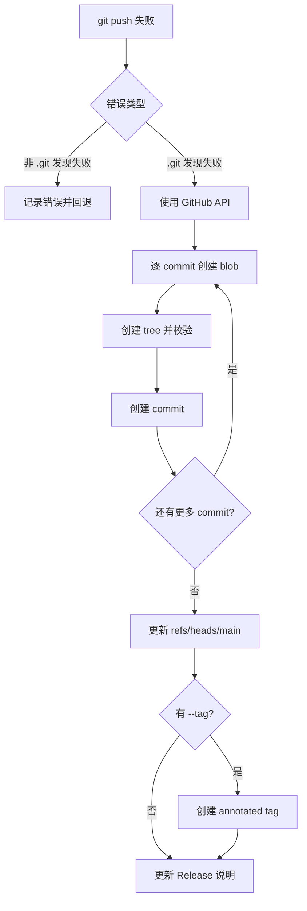
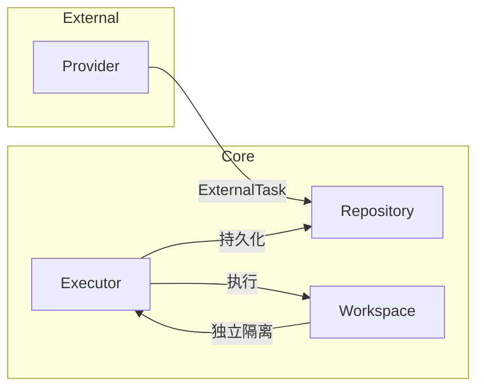
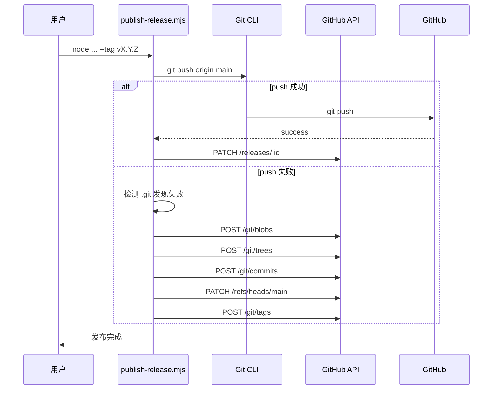
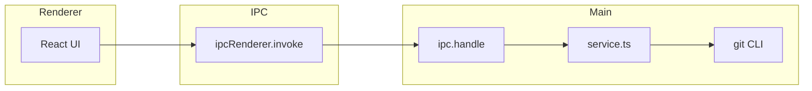

# 产品功能需求

<cite>

**本文引用的文件**

- [skills/tech-cc-hub-release-deploy/scripts/publish-release.mjs](file://skills/tech-cc-hub-release-deploy/scripts/publish-release.mjs)
- [scripts/github-release.mjs](file://scripts/github-release.mjs)
- [src/electron/libs/system-prompt-presets.ts](file://src/electron/libs/system-prompt-presets.ts)
- [skills/tech-cc-hub-release-deploy/SKILL.md](file://skills/tech-cc-hub-release-deploy/SKILL.md)
- [skills/tech-cc-hub-release-deploy/agents/openai.yaml](file://skills/tech-cc-hub-release-deploy/agents/openai.yaml)
- [pro-workflow/skills/wiki-research-loop/scripts/research-loop.js](file://pro-workflow/skills/wiki-research-loop/scripts/research-loop.js)
- [src/electron/libs/git/README.md](file://src/electron/libs/git/README.md)
- [src/electron/libs/mcp-tools/README.md](file://src/electron/libs/mcp-tools/README.md)
- [src/electron/libs/task/README.md](file://src/electron/libs/task/README.md)

</cite>

## 目录

- [1. 概述](#1-概述)
- [2. 发布部署系统](#2-发布部署系统)
- [3. Git 工作台](#3-git-工作台)
- [4. MCP 工具集](#4-mcp-工具集)
- [5. 任务编排系统](#5-任务编排系统)
- [6. System Prompt 体系](#6-system-prompt-体系)
- [7. Wiki 研究循环](#7-wiki-研究循环)
- [8. 核心调用链路](#8-核心调用链路)
- [9. 扩展点与配置](#9-扩展点与配置)
- [10. 常见故障排查](#10-常见故障排查)

---

## 1. 概述

`tech-cc-hub` 是一个基于 Electron 的 AI 辅助开发工作台，核心功能围绕 **发布部署**、**Git 版本控制**、**MCP 工具集成**、**任务编排** 四个支柱展开。产品需求文档从代码实现逆向提炼，确保每个功能点可追溯、可执行。

本文档聚焦于 `tech-cc-hub-release-deploy` 技能链、Electron 主进程的 `libs` 模块、以及 System Prompt 体系的产品功能需求。

---

## 2. 发布部署系统

### 2.1 职责

发布部署系统负责将本地代码变更安全可靠地推送到 GitHub，并生成符合规范的中文 Release 说明。该系统特别针对 Windows 环境下的 `git push` 失败场景提供了 API 回退机制。

核心职责：
- 执行 `git commit`、`git push`、`git tag` 流水线
- 检测 Windows `git push` 失败并自动切换到 GitHub Git Data API
- 支持 tag 移动（`--retag`）和 Release 删除（`--delete-release`）
- 生成包含变更提交和变更文件列表的 Release 说明

章节来源：[skills/tech-cc-hub-release-deploy/SKILL.md#L1-L4](file://skills/tech-cc-hub-release-deploy/SKILL.md#L1-L4)

### 2.2 入口与参数

**主入口脚本**：`node skills/tech-cc-hub-release-deploy/scripts/publish-release.mjs`

| 参数 | 类型 | 说明 |
|------|------|------|
| `--tag` | value | 版本标签，如 `v0.1.13` |
| `--notes` | value | Release 说明文件路径 |
| `--notes-only` | flag | 仅更新 Release 说明，不推送 |
| `--api-only` | flag | 跳过 `git push`，直接使用 GitHub API |
| `--retag` | flag | 允许移动已存在的 tag |
| `--delete-release` | flag | 删除同名 GitHub Release |

章节来源：[skills/tech-cc-hub-release-deploy/scripts/publish-release.mjs#L12-L28](file://skills/tech-cc-hub-release-deploy/scripts/publish-release.mjs#L12-L28)

### 2.3 Token 凭证获取

凭证按以下顺序尝试读取：

1. 环境变量 `GH_TOKEN`
2. 环境变量 `GITHUB_TOKEN`
3. `git credential fill` 交互式获取

```javascript
// 源码实现（第 75-85 行）
function getCredentialToken() {
  if (process.env.GH_TOKEN) return process.env.GH_TOKEN;
  if (process.env.GITHUB_TOKEN) return process.env.GITHUB_TOKEN;
  // ... git credential fill 交互式获取
}
```

章节来源：[skills/tech-cc-hub-release-deploy/scripts/publish-release.mjs#L75-L85](file://skills/tech-cc-hub-release-deploy/scripts/publish-release.mjs#L75-L85)

### 2.4 API 回退流程

当普通 `git push` 失败时，系统使用 GitHub Git Data API 逐个创建 commit：



**关键约束**：
- 远端 `main` 必须是本地 `HEAD` 的祖先
- 仅支持线性提交范围，非线性需先 fetch/rebase
- 每个 commit 的 SHA 都会与远端校验，不一致则中断

章节来源：[skills/tech-cc-hub-release-deploy/scripts/publish-release.mjs#L264-L306](file://skills/tech-cc-hub-release-deploy/scripts/publish-release.mjs#L264-L306)

### 2.5 发布说明格式规范

发布说明必须使用中文，可选附英文。格式要求：

```markdown
## 更新内容
- 浏览器工作台：...
- 设置页：...
- 更新器：...

## 验证
- `npm run package:win`
- GitHub `Release` workflow：成功

## English Notes (optional)
```

章节来源：[skills/tech-cc-hub-release-deploy/SKILL.md#L82-L100](file://skills/tech-cc-hub-release-deploy/SKILL.md#L82-L100)

---

## 3. Git 工作台

### 3.1 职责

Git 工作台是 Electron 主进程中的纯 Git 操作模块，Renderer 进程只能通过 IPC 调用，不直接执行 git 命令。

章节来源：[src/electron/libs/git/README.md#L1-L4](file://src/electron/libs/git/README.md#L1-L4)

### 3.2 模块边界

| 文件 | 职责 |
|------|------|
| `types.ts` | Git 领域类型和 IPC payload/result |
| `errors.ts` | Git 错误归一化 |
| `service.ts` | 唯一 Git 操作入口 |
| `history.ts` | Commit history 解析 |
| `graph.ts` | Lightweight graph lane 生成 |
| `operation-log.ts` | 本地高影响操作日志 |
| `ipc.ts` | Electron IPC handler 注册 |
| `index.ts` | 对外统一出口 |

章节来源：[src/electron/libs/git/README.md#L6-L14](file://src/electron/libs/git/README.md#L6-L14)

### 3.3 第一版允许的操作

- 基础：`status`、`diff`
- 暂存：`stage`、`unstage`
- 提交：`commit`
- 推送：`ordinary push`
- 分支：`create`、`checkout branch`
- 暂存：`stash save`、`apply`、`drop`
- 历史：`recent history`、`lightweight graph`

章节来源：[src/electron/libs/git/README.md#L16-L24](file://src/electron/libs/git/README.md#L16-L24)

### 3.4 第一版禁止的操作

| 禁止操作 | 原因 |
|----------|------|
| `reset` | 高风险，可能丢失工作进度 |
| `rebase` | 交互式操作复杂度高 |
| `cherry-pick` | 需额外冲突处理 |
| `force push` | 强制覆盖风险 |
| `amend` | 修改已推送历史 |
| `squash` | 需要交互确认 |

章节来源：[src/electron/libs/git/README.md#L26-L33](file://src/electron/libs/git/README.md#L26-L33)

---

## 4. MCP 工具集

### 4.1 职责

MCP（Model Context Protocol）工具集集中存放暴露给 AI Agent 的内置工具，避免 `libs` 根目录膨胀。每个工具都有明确的 host 边界，不直接操作 React UI。

章节来源：[src/electron/libs/mcp-tools/README.md#L1-L3](file://src/electron/libs/mcp-tools/README.md#L1-L3)

### 4.2 工具清单

| 工具文件 | 能力 |
|----------|------|
| `browser.ts` | 导航、截图摘要、DOM 查询、样式检查、标注模式 |
| `design.ts` | 截图语义分析、对比、diff 图、热点区域、JSON report |
| `figma-rest.ts` | Figma 只读工具（文件/节点读取、设计系统、变量） |
| `admin.ts` | 写入 `agent-runtime.json` 的全局运行参数 |

章节来源：[src/electron/libs/mcp-tools/README.md#L5-L8](file://src/electron/libs/mcp-tools/README.md#L5-L8)

### 4.3 设计工具触发规则

**默认触发条件**：
- 用户给出截图、Figma 图、页面参考图，并要求生成或修改 UI/前端代码
- 用户反馈页面和参考图不一致

**处理流程**：
1. 单张用户截图先走 `design_inspect_image` 做语义摘要
2. 已有页面候选图后再走截图比照
3. 动态区域（时间、头像、动画帧）用 `ignoreRegions`
4. 需要验收结论时传 `maxDifferenceRatio`
5. 文字抗锯齿噪声多时开启 `ignoreAntialiasing`

章节来源：[src/electron/libs/mcp-tools/README.md#L16-L21](file://src/electron/libs/mcp-tools/README.md#L16-L21)

### 4.4 设计工具输出约束

- 返回内容尽量是**摘要、路径、结构化 JSON**
- 避免塞入大图或密钥明文
- 涉及写入磁盘或配置的工具必须有字段 allowlist 和体积上限

章节来源：[src/electron/libs/mcp-tools/README.md#L11-L14](file://src/electron/libs/mcp-tools/README.md#L11-L14)

---

## 5. 任务编排系统

### 5.1 职责

任务编排系统负责管理外部任务源（如 Lark）的接入，并提供任务的持久化、并行执行、恢复重试能力。

章节来源：[src/electron/libs/task/README.md#L1-L3](file://src/electron/libs/task/README.md#L1-L3)

### 5.2 模块边界

| 文件 | 职责 |
|------|------|
| `types.ts` | 任务、执行记录、IPC payload 的领域类型 |
| `provider-registry.ts` | Provider 注册表和 fallback provider |
| `providers/` | 外部任务源适配器（目前含 Lark） |
| `repository.ts` | SQLite schema、状态、执行记录持久化 |
| `workflow.ts` | Symphony-style workflow 配置、轮询、重试 |
| `workspace.ts` | 每个任务的独立 workspace 创建和路径安全 |
| `executor.ts` | 编排器（同步、自动执行、并发、重试、恢复） |
| `index.ts` | 对外统一出口 |

章节来源：[src/electron/libs/task/README.md#L5-L14](file://src/electron/libs/task/README.md#L5-L14)

### 5.3 运行原则



**核心约束**：
- 外部 provider 只负责把第三方任务映射成 `ExternalTask`，不直接改 UI 或会话
- Repository 只做持久化，不启动 runner
- Executor 是唯一调度入口
- 任务执行使用独立 workspace，避免多个任务互相污染
- 旧任务库数据允许丢弃，schema 变化优先保持代码简单

章节来源：[src/electron/libs/task/README.md#L16-L22](file://src/electron/libs/task/README.md#L16-L22)

---

## 6. System Prompt 体系

### 6.1 职责

System Prompt 体系负责在运行时动态组装 AI 模型所需的上下文提示词，包括浏览器工作台规则、配置治理、工具调用策略、设计还原规则等。

章节来源：[src/electron/libs/system-prompt-presets.ts#L1-L10](file://src/electron/libs/system-prompt-presets.ts#L1-L10)

### 6.2 Prompt 构建块

| 函数 | 输出 |
|------|------|
| `buildBrowserWorkbenchPromptAppend` | 浏览器操作规则 |
| `buildAdminConfigPromptAppend` | 配置持久化规则 |
| `buildToolCallOptimizationPromptAppend` | 工具调用优化策略 |
| `buildFeishuDocumentFetchPromptAppend` | 飞书文档直读规则 |
| `buildDesignParityPromptAppend` | 设计还原规则 |
| `buildBuiltinMcpRegistryPromptAppend` | 内置 MCP 工具提示 |

章节来源：[src/electron/libs/system-prompt-presets.ts#L12-L134](file://src/electron/libs/system-prompt-presets.ts#L12-L134)

### 6.3 飞书文档直读规则

当用户输入包含飞书链接时，系统自动提取并生成 `lark-cli` 命令：

```javascript
// 链接模式
const FEISHU_DOC_URL_PATTERN = /https?:\/\/[^\s<>"'`]*feishu\.cn\/(?:wiki|docx|docs)\/[^\s<>"'`]*/gi;

// 生成命令示例
`$LARK_CLI_COMMAND --profile $LARK_CLI_PROFILE docs +fetch --doc "<url>" --format pretty`
```

**前置条件**：
- `runtimeEnv.LARK_CLI_COMMAND` 已配置
- `runtimeEnv.LARK_CLI_PROFILE` 已配置

章节来源：[src/electron/libs/system-prompt-presets.ts#L53-L79](file://src/electron/libs/system-prompt-presets.ts#L53-L79)

### 6.4 工具调用优化策略

核心原则：
- 仅在答案依赖当前外部状态时才调用工具
- 首次工具调用前聚合所需证据
- 使用内置 `Task` 工具仅当工作拆分到 2+ 独立代码路径
- 单文件读取、紧耦合链式调查必须直接在父轮次处理
- 默认文件读取保持在 200 行以内

章节来源：[src/electron/libs/system-prompt-presets.ts#L28-L43](file://src/electron/libs/system-prompt-presets.ts#L28-L43)

### 6.5 Prompt 来源注册

所有预设通过 `buildTechCCHubSystemPromptSources()` 统一注册：

```typescript
export function buildTechCCHubSystemPromptSources(): PromptLedgerSource[] {
  return [
    { id: "tech-cc-hub-browser-preset", label: "...", sourceKind: "system", text: ... },
    { id: "tech-cc-hub-admin-preset", label: "...", sourceKind: "system", text: ... },
    // ...
  ];
}
```

章节来源：[src/electron/libs/system-prompt-presets.ts#L136-L175](file://src/electron/libs/system-prompt-presets.ts#L136-L175)

---

## 7. Wiki 研究循环

### 7.1 职责

Wiki 研究循环是一个自动化知识采集系统，从 web、arxiv、github 等来源抓取信息，生成结构化 Wiki 页面。

章节来源：[pro-workflow/skills/wiki-research-loop/scripts/research-loop.js#L1-L21](file://pro-workflow/skills/wiki-research-loop/scripts/research-loop.js#L1-L21)

### 7.2 命令接口

| 命令 | 说明 |
|------|------|
| `run <slug>` | 执行研究循环 |
| `seed <slug> "<query>"` | 添加研究种子 |
| `seeds <slug> [--status pending]` | 列出种子队列 |
| `cancel <slug>` | 取消所有 pending/active 种子 |
| `status` | 全局状态 |

### 7.3 运行参数

| 参数 | 默认值 | 说明 |
|------|--------|------|
| `--max-pages` | 5 | 每次运行最大页面数 |
| `--max-depth` | 3 | 最大递归深度 |
| `--budget-usd` | 0.50 | 每次运行最大预算 |
| `--fetchers` | web,arxiv,github | 启用的抓取器 |
| `--force` | false | 强制执行（忽略 `auto_research.enabled: false`） |

章节来源：[pro-workflow/skills/wiki-research-loop/scripts/research-loop.js#L344-L351](file://pro-workflow/skills/wiki-research-loop/scripts/research-loop.js#L344-L351)

### 7.4 抓取器加载

抓取器从两个目录加载：

1. `pro-workflow/skills/wiki-research-loop/scripts/source-fetchers/`（内置）
2. `~/.pro-workflow/fetchers/`（用户扩展）

章节来源：[pro-workflow/skills/wiki-research-loop/scripts/research-loop.js#L36-L56](file://pro-workflow/skills/wiki-research-loop/scripts/research-loop.js#L36-L56)

### 7.5 新颖性计算

页面生成后使用 Jaccard 距离计算与历史页面的新颖度：

```javascript
function jaccardNovelty(newText, prevTexts) {
  const a = tokenize(newText); // 4+ 字符的 token 集合
  const b = tokenize(prevTexts.join(' '));
  return 1 - (overlap / a.size);
}
```

- 新颖度 < 5% 连续 3 次触发 `converged` 终止
- 每个页面最多提取 8 个 40-400 字符的 claims

章节来源：[pro-workflow/skills/wiki-research-loop/scripts/research-loop.js#L91-L149](file://pro-workflow/skills/wiki-research-loop/scripts/research-loop.js#L91-L149)

---

## 8. 核心调用链路

### 8.1 发布部署完整链路



章节来源：[skills/tech-cc-hub-release-deploy/scripts/publish-release.mjs#L354-L387](file://skills/tech-cc-hub-release-deploy/scripts/publish-release.mjs#L354-L387)

### 8.2 Git 工作台 IPC 边界



**约束**：Renderer 绝不直接执行 git，所有操作必须经由 IPC 调用主进程的 `service.ts`。

章节来源：[src/electron/libs/git/README.md#L3-L4](file://src/electron/libs/git/README.md#L3-L4)

---

## 9. 扩展点与配置

### 9.1 Agent 界面配置

发布部署 Agent 的界面配置定义在 YAML 文件中：

```yaml
interface:
  display_name: "tech-cc-hub 发布部署"
  short_description: "提交、推送、移动 tag、打包并更新 tech-cc-hub 的 GitHub Release。"
```

章节来源：[skills/tech-cc-hub-release-deploy/agents/openai.yaml#L1-L4](file://skills/tech-cc-hub-release-deploy/agents/openai.yaml#L1-L4)

### 9.2 环境变量配置点

| 变量 | 用途 |
|------|------|
| `GH_TOKEN` / `GITHUB_TOKEN` | GitHub API 认证 |
| `LARK_CLI_COMMAND` | 飞书文档读取 CLI |
| `LARK_CLI_PROFILE` | 飞书 CLI profile |

章节来源：[src/electron/libs/system-prompt-presets.ts#L62-L63](file://src/electron/libs/system-prompt-presets.ts#L62-L63)

### 9.3 GitHub Release 工作流触发

标签推送后，GitHub Actions 的 `Release` workflow 会自动触发。需确认：
- GitHub Release 包含 `latest.yml` 和 Windows 安装包
- 可通过 `https://api.github.com/repos/lst016/tech-cc-hub/actions/runs?per_page=10&event=push` 轮询状态

章节来源：[skills/tech-cc-hub-release-deploy/SKILL.md#L26-L28](file://skills/tech-cc-hub-release-deploy/SKILL.md#L26-L28)

---

## 10. 常见故障排查

### 10.1 Windows git push 失败

**症状**：
```
fatal: not a git repository (or any of the parent directories): .git
```

**解决方案**：
```powershell
node skills/tech-cc-hub-release-deploy/scripts/publish-release.mjs --api-only
```

章节来源：[skills/tech-cc-hub-release-deploy/SKILL.md#L51-L56](file://skills/tech-cc-hub-release-deploy/SKILL.md#L51-L56)

### 10.2 Tag 已存在无法推送

**症状**：
```
Tag v0.1.13 exists. Use --retag to move it.
```

**解决方案**：
```powershell
node skills/tech-cc-hub-release-deploy/scripts/publish-release.mjs --tag v0.1.13 --retag --delete-release
```

章节来源：[skills/tech-cc-hub-release-deploy/scripts/publish-release.mjs#L324-L327](file://skills/tech-cc-hub-release-deploy/scripts/publish-release.mjs#L324-L327)

### 10.3 API 回退后 SHA 不一致

**症状**：运行验证命令后三个 SHA 不同步

```powershell
git rev-parse HEAD
git rev-parse origin/main
git ls-remote --heads origin main
```

**排查**：
1. 检查脚本输出中的 `tree/commit mismatch` 错误
2. 确认远端 main 没有被其他进程更新
3. 使用 `git fetch origin` 同步后重新执行

章节来源：[skills/tech-cc-hub-release-deploy/SKILL.md#L74-L81](file://skills/tech-cc-hub-release-deploy/SKILL.md#L74-L81)

### 10.4 工作目录未清理

**症状**：
```
working tree is dirty. Commit or stash changes before releasing
```

**解决方案**：
- 提交或 stash 更改后重试
- 或使用 `--allow-dirty`（仅版本文件变更时安全）

章节来源：[scripts/github-release.mjs#L187-L196](file://scripts/github-release.mjs#L187-L196)

### 10.5 研究循环抓取器缺失

**症状**：
```
no usable fetchers among: web,arxiv,github
```

**解决方案**：
1. 确认 `pro-workflow/dist/db/store.js` 已构建
2. 检查 `~/.pro-workflow/fetchers/` 目录
3. 运行 `cd PRO_WORKFLOW_ROOT && npm install && npm run build`

章节来源：[pro-workflow/skills/wiki-research-loop/scripts/research-loop.js#L11-L16](file://pro-workflow/skills/wiki-research-loop/scripts/research-loop.js#L11-L16)

---

## 附录：关键数据结构

### A.1 发布配置

```javascript
const OWNER = "lst016";
const REPO = "tech-cc-hub";
const DEFAULT_BRANCH = "main";
```

章节来源：[skills/tech-cc-hub-release-deploy/scripts/publish-release.mjs#L8-L10](file://skills/tech-cc-hub-release-deploy/scripts/publish-release.mjs#L8-L10)

### A.2 版本号解析

支持 `major`、`minor`、`patch` 三段式版本，忽略前缀 `v`：

```javascript
// 有效输入：v1.2.3、1.2.3、1.2.3-beta
// 正则：/^(\d+)\.(\d+)\.(\d+)(?:[-+].*)?$/
```

章节来源：[scripts/github-release.mjs#L100-L112](file://scripts/github-release.mjs#L100-L112)

### A.3 Git 变更解析

Git diff 使用 `\0` 分隔符解析 `--name-status -z` 输出：

```javascript
// R/Renamed -> { D: oldPath, A: newPath }
// C/Copied  -> { D: oldPath, A: newPath }
// 其他      -> { status, filePath }
```

章节来源：[skills/tech-cc-hub-release-deploy/scripts/publish-release.mjs#L124-L137](file://skills/tech-cc-hub-release-deploy/scripts/publish-release.mjs#L124-L137)