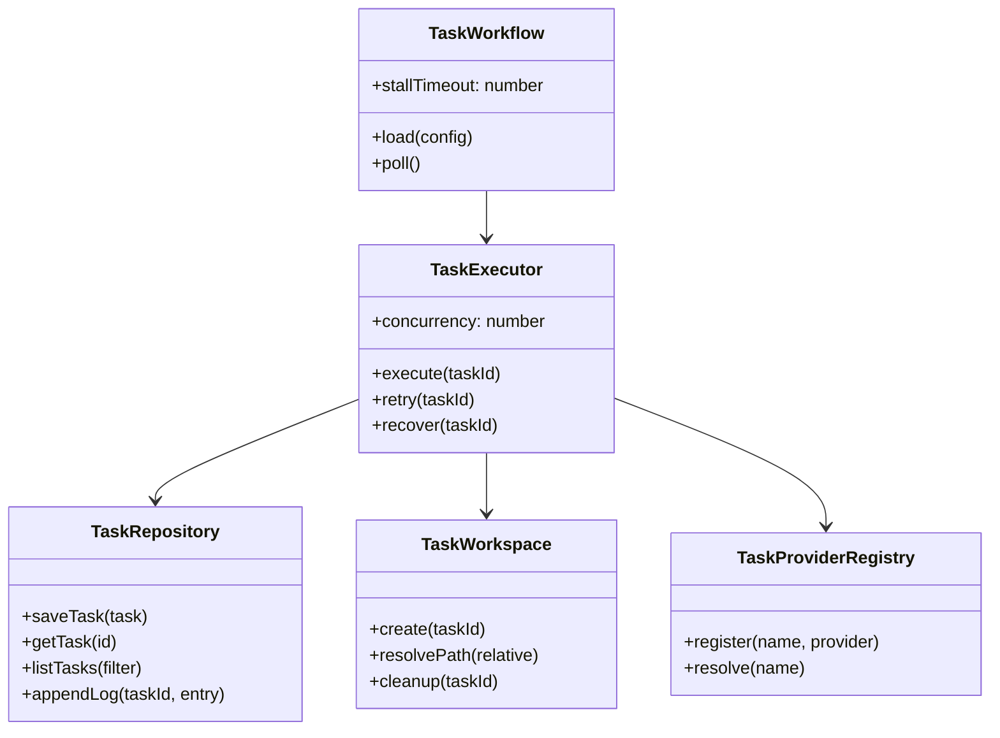
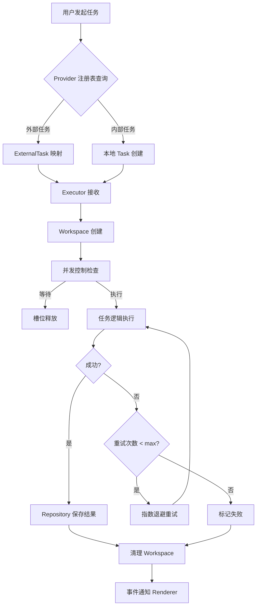
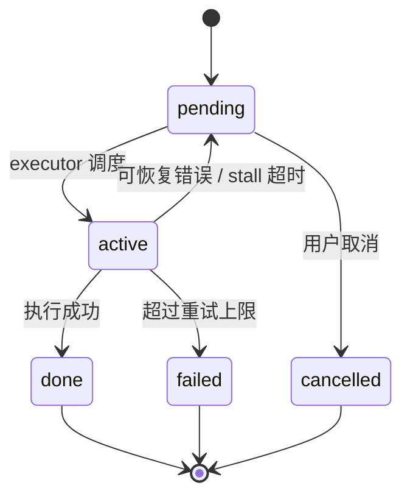
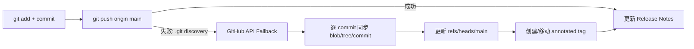
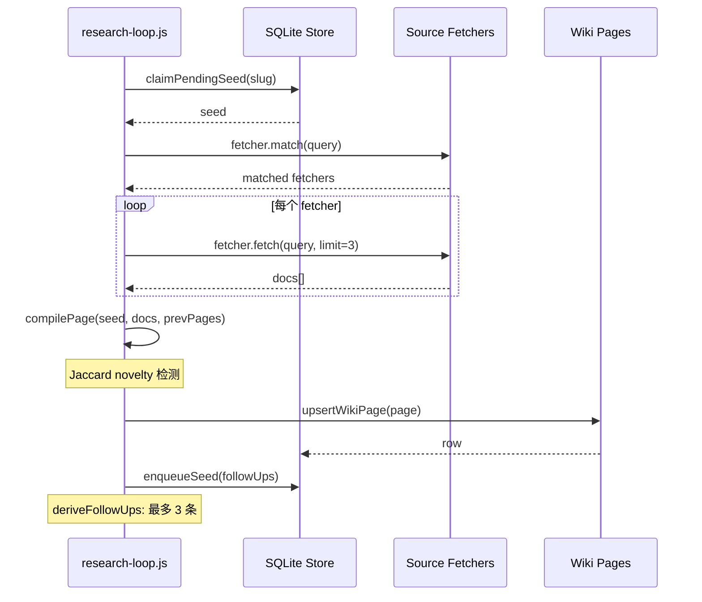

# 任务图与可视化

<cite>
**本文引用的文件**
- [skills/tech-cc-hub-release-deploy/scripts/publish-release.mjs](file://skills/tech-cc-hub-release-deploy/scripts/publish-release.mjs)
- [scripts/github-release.mjs](file://scripts/github-release.mjs)
- [src/electron/libs/system-prompt-presets.ts](file://src/electron/libs/system-prompt-presets.ts)
- [skills/tech-cc-hub-release-deploy/SKILL.md](file://skills/tech-cc-hub-release-deploy/SKILL.md)
- [skills/tech-cc-hub-release-deploy/agents/openai.yaml](file://skills/tech-cc-hub-release-deploy/agents/openai.yaml)
- [pro-workflow/skills/wiki-research-loop/scripts/research-loop.js](file://pro-workflow/skills/wiki-research-loop/scripts/research-loop.js)
- [src/electron/libs/git/README.md](file://src/electron/libs/git/README.md)
- [src/electron/libs/mcp-tools/README.md](file://src/electron/libs/mcp-tools/README.md)
- [src/electron/libs/task/README.md](file://src/electron/libs/task/README.md)
</cite>

# 任务图与可视化

## 目录

- [概述](#概述)
- [核心组件架构](#核心组件架构)
- [任务执行流程](#任务执行流程)
- [任务图数据结构](#任务图数据结构)
- [状态机与生命周期](#状态机与生命周期)
- [MCP 工具集成](#mcp-工具集成)
- [发布与部署任务链](#发布与部署任务链)
- [研究循环任务链](#研究循环任务链)
- [失败模式与排障](#失败模式与排障)
- [扩展点](#扩展点)

---

## 概述

tech-cc-hub 的任务图与可视化系统是一套多 Agent 编排机制，涵盖任务拆分、并行执行、状态追踪和结果回放。系统设计遵循**任务边界清晰、独立 workspace 隔离、自动恢复优先**的原则。

核心模块位于 `src/electron/libs/task/`，通过 IPC 向 Renderer 层暴露可视化面板所需的状态数据。

---

## 核心组件架构

任务系统的模块边界在 `src/electron/libs/task/README.md` 中明确定义：



**职责说明：**

| 组件 | 职责 | 入口文件 |
|------|------|----------|
| `executor.ts` | 编排器：调度、并发控制、重试、恢复 | `src/electron/libs/task/executor.ts` |
| `repository.ts` | SQLite 持久化：任务状态、日志、执行记录 | `src/electron/libs/task/repository.ts` |
| `workspace.ts` | 每个任务的独立目录创建、路径安全 | `src/electron/libs/task/workspace.ts` |
| `provider-registry.ts` | 外部任务源适配器注册表 | `src/electron/libs/task/provider-registry.ts` |
| `workflow.ts` | Symphony-style workflow 配置解析 | `src/electron/libs/task/workflow.ts` |

章节来源：`src/electron/libs/task/README.md#L7-L14`

---

## 任务执行流程

任务从创建到完成的完整生命周期如下：



**执行编排原则**（来源：`src/electron/libs/system-prompt-presets.ts#L28-L42`）：

- 使用内置 `Task` 工具**仅限**工作可拆分为 2+ 独立代码路径、模块、日志或需求来源的场景
- 每个 Task 需明确：问题、范围边界、期望输出
- **禁止**将 Task 用于单一文件读取或紧耦合的调查链
- Agent 推理可直接得出答案时，不调用工具

---

## 任务图数据结构

任务图采用**有向无环图（DAG）**结构，每个节点包含以下字段：

```typescript
interface TaskNode {
  id: string;
  parentId?: string;        // 父任务 ID，用于递归拆分
  children?: string[];      // 子任务 ID 列表
  status: TaskStatus;       // pending | active | done | failed
  priority?: number;
  workspace?: string;       // 独立执行目录
  metadata?: {
    source: 'manual' | 'agent' | 'workflow' | 'mcp';
    depth: number;           // 递归深度
    budget?: number;         // 预算 USD
  };
  result?: TaskResult;
}
```

任务关系在 `src/electron/libs/task/repository.ts` 的 SQLite schema 中持久化，支持按 `parentId` 递归查询子树。

---

## 状态机与生命周期

任务状态流转遵循以下规则：



**关键参数（来源：`src/electron/libs/task/workflow.ts`）**：

| 参数 | 默认值 | 说明 |
|------|--------|------|
| `stallTimeout` | 5 分钟 | active 状态超过此时间无日志则标记为 stall |
| `maxRetries` | 3 | 失败后自动重试次数 |
| `retryBackoff` | 指数退避 | 重试间隔递增 |
| `concurrency` | 2 | 同时执行的任务数上限 |

---

## MCP 工具集成

内置 MCP 工具通过 `src/electron/libs/mcp-tools/README.md` 集中管理，向 Agent 暴露任务相关的可视化能力：

| 工具 | 用途 | 入口文件 |
|------|------|----------|
| `browser_*` | 任务执行期间浏览器状态截取、DOM 检查 | `src/electron/libs/mcp-tools/browser.ts` |
| `design_*` | 视觉差异对比、截图标注 | `src/electron/libs/mcp-tools/design.ts` |
| `figma_*` | 设计节点读取、token 提取 | `src/electron/libs/mcp-tools/figma-rest.ts` |
| `mcp__tech-cc-hub-admin__set_global_runtime_config` | 写入 `agent-runtime.json` | `src/electron/libs/mcp-tools/admin.ts` |

**设计工具触发条件**（来源：`src/electron/libs/mcp-tools/README.md#L16-L20`）：

- 用户提供截图、Figma 图或页面参考图，并要求生成/修改 UI 代码
- 用户反馈页面与参考图不一致
- 单张截图先走 `design_inspect_image` 做语义摘要，再进行对比

---

## 发布与部署任务链

`tech-cc-hub-release-deploy` skill 封装了一套完整的发布流水线：



**关键脚本：`publish-release.mjs`**

| 命令 | 用途 | 章节来源 |
|------|------|----------|
| `node scripts/publish-release.mjs` | 正常 push 到 `origin/main` | `skills/tech-cc-hub-release-deploy/SKILL.md#L22` |
| `node scripts/publish-release.mjs --api-only` | 绕过 git push，直接调 GitHub API | `skills/tech-cc-hub-release-deploy/SKILL.md#L23` |
| `node scripts/publish-release.mjs --tag vX.Y.Z --retag --delete-release` | 移动 tag 并重建 release | `skills/tech-cc-hub-release-deploy/SKILL.md#L24-L25` |
| `node scripts/publish-release.mjs --notes <path> --notes-only` | 仅更新 release 说明 | `skills/tech-cc-hub-release-deploy/SKILL.md#L28` |

**GitHub API Fallback 行为（来源：`skills/tech-cc-hub-release-deploy/scripts/publish-release.mjs#L193-L351`）**：

1. 获取 `origin/main` 指向的远程 commit SHA
2. 计算本地 `HEAD` 与远程的 merge-base
3. 验证远程 `main` 是本地 `HEAD` 的祖先（线性提交范围）
4. 按顺序遍历 commit，调用 Git Data API 重建 blob → tree → commit
5. 校验远端 commit SHA 必须与本地 SHA 完全一致
6. 更新 `refs/heads/main`

**触发条件**：Windows 环境 `git push` 报 `fatal: not a git repository (or any of the parent directories): .git` 时，直接使用 `--api-only`。

---

## 研究循环任务链

`pro-workflow/skills/wiki-research-loop` 提供了一套自动研究任务流水线：



**核心参数**（来源：`pro-workflow/skills/wiki-research-loop/scripts/research-loop.js#L182-L184`）：

| 参数 | 环境变量 | 默认值 | 说明 |
|------|----------|--------|------|
| `maxPagesPerRun` | `WIKI_LOOP_MAX_PAGES` | 5 | 每次运行最多生成页数 |
| `maxDepth` | `WIKI_LOOP_MAX_DEPTH` | 3 | 递归探索最大深度 |
| `budgetUsd` | `WIKI_LOOP_BUDGET_USD` | 0.50 | 本次运行最大花费 |

**终止条件**：

- `STOP_FILE` 存在（kill-switch）
- 队列为空（`queue-empty`）
- 连续 3 个 seed 的 novelty < 0.05（`converged`）
- 超出预算（`budget`）

---

## 失败模式与排障

### Git Push 失败

**症状**：Windows 环境下 `git push` 报 `.git discovery failure`。

**排查步骤**（来源：`skills/tech-cc-hub-release-deploy/SKILL.md#L51-L55`）：

```powershell
# 1. 直接使用 API fallback
node skills/tech-cc-hub-release-deploy/scripts/publish-release.mjs --api-only

# 2. 推送后验证 SHA 一致性
git rev-parse HEAD
git rev-parse origin/main
git ls-remote --heads origin main
# 三者应指向同一个 commit
```

### 发布任务 API 不匹配

**症状**：`publishViaApi` 报 `GitHub API tree mismatch` 或 `commit mismatch`。

**原因**：远程 `main` 不是本地 `HEAD` 的祖先，或存在 merge commit 打断线性提交链。

**处理**（来源：`skills/tech-cc-hub-release-deploy/scripts/publish-release.mjs#L268-L270`）：

```powershell
# 先 fetch/rebase 确保线性历史
git fetch origin main
git rebase origin/main
# 然后重新执行发布脚本
```

### 研究任务队列为空

**症状**：`research-loop.js run <slug>` 立即退出，状态为 `queue-empty`。

**排查**：

```bash
# 查看所有 wiki 的 seed 状态
research-loop.js status
# 输出 JSON 包含 pending/active/done/failed 计数

# 查看特定 wiki 的 pending seeds
research-loop.js seeds <slug> --status pending
```

### Task 工具使用不当

**症状**：Agent 频繁调用 Task 工具导致执行效率低。

**根因**：违反 `system-prompt-presets.ts` 中定义的使用边界。

**修复方向**：将单一文件读取或紧耦合调查链合并到父 Turn 直接处理。

---

## 扩展点

### 新增 Provider

在 `src/electron/libs/task/providers/` 下实现新 Adapter：

```typescript
// providers/my-provider.ts
import type { TaskProvider } from '../types';

export const myProvider: TaskProvider = {
  name: 'my-provider',
  match(task) { /* 任务匹配逻辑 */ },
  async fetch(task) { /* 转换为 ExternalTask */ },
};
```

在 `provider-registry.ts` 中注册。

章节来源：`src/electron/libs/task/README.md#L9`

### 新增 MCP 工具

在 `src/electron/libs/mcp-tools/` 下新增工具文件：

1. 工具必须声明明确的 host 边界，不直接操作 React UI
2. 返回给模型的内容使用摘要、路径、结构化 JSON，避免大图或密钥明文
3. 涉及写入的工具必须有 allowlist 和体积上限

章节来源：`src/electron/libs/mcp-tools/README.md#L11-L14`

### 扩展 Release Pipeline

在 `scripts/github-release.mjs` 中扩展 `createReleaseBody` 模板：

```javascript
// 替换模板变量格式
.replaceAll("{{custom_field}}", customValue)
```

章节来源：`scripts/github-release.mjs#L319-L346`