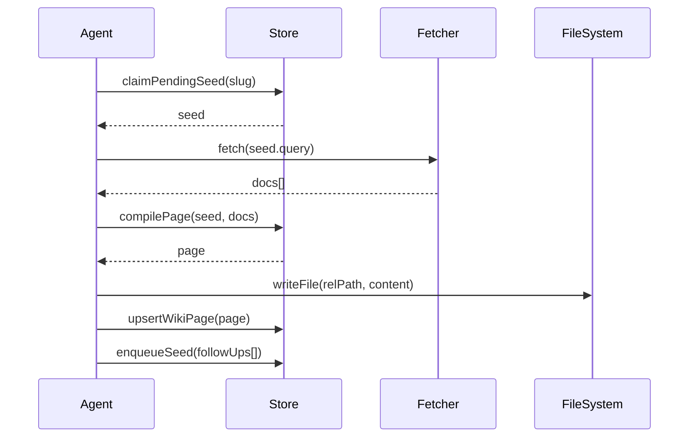
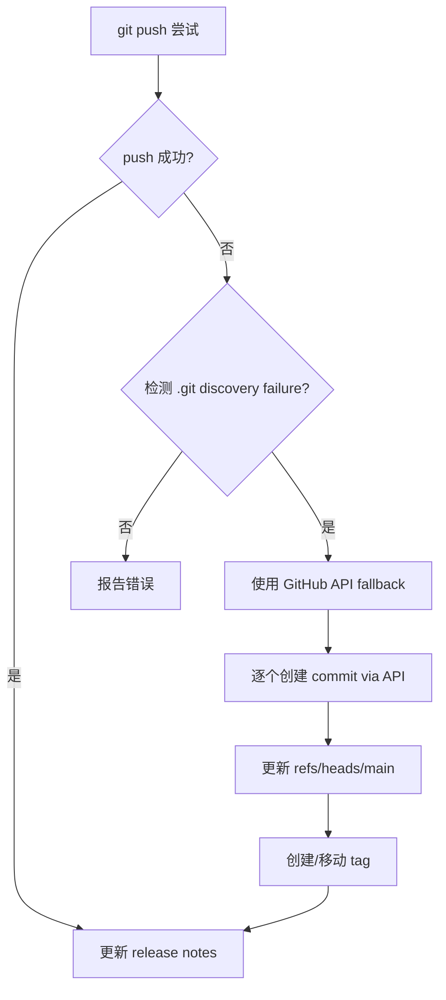
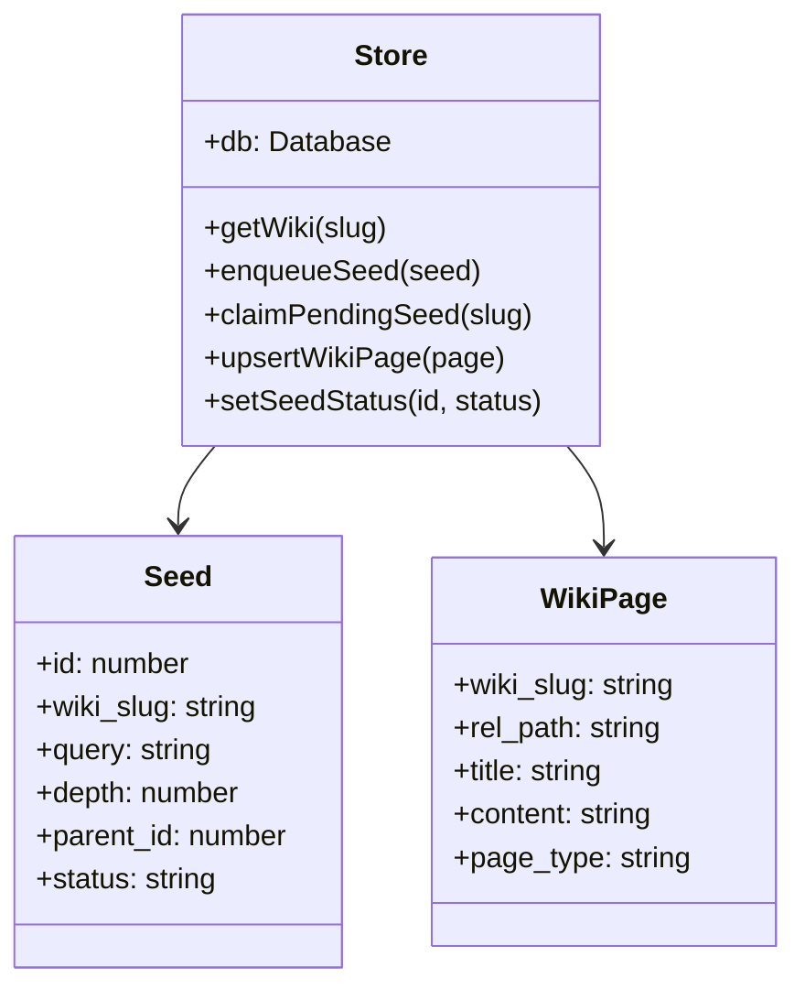

# 会话生命周期规范

<cite>

**本文引用的文件**

- [skills/tech-cc-hub-release-deploy/scripts/publish-release.mjs](file://skills/tech-cc-hub-release-deploy/scripts/publish-release.mjs)
- [scripts/github-release.mjs](file://scripts/github-release.mjs)
- [src/electron/libs/system-prompt-presets.ts](file://src/electron/libs/system-prompt-presets.ts)
- [skills/tech-cc-hub-release-deploy/SKILL.md](file://skills/tech-cc-hub-release-deploy/SKILL.md)
- [skills/tech-cc-hub-release-deploy/agents/openai.yaml](file://skills/tech-cc-hub-release-deploy/agents/openai.yaml)
- [pro-workflow/skills/wiki-research-loop/scripts/research-loop.js](file://pro-workflow/skills/wiki-research-loop/scripts/research-loop.js)
- [src/electron/libs/git/README.md](file://src/electron/libs/git/README.md)
- [src/electron/libs/mcp-tools/README.md](file://src/electron/libs/mcp-tools/README.md)
- [src/electron/libs/task/README.md](file://src/electron/libs/task/README.md)

</cite>

---

## 目录

- [概述](#概述)
- [会话状态机](#会话状态机)
- [核心会话类型](#核心会话类型)
- [调用链与入口点](#调用链与入口点)
- [数据流与持久化](#数据流与持久化)
- [配置参数参考](#配置参数参考)
- [失败模式与排障](#失败模式与排障)
- [扩展点](#扩展点)

---

## 概述

tech-cc-hub 中的"会话"（Session）在不同模块中有不同语义：

| 模块 | 会话语义 | 生命周期管理方式 |
|------|---------|----------------|
| `wiki-research-loop` | 研究种子（seed）的执行会话 | SQLite + 内存状态 |
| `task` | 任务执行会话 | SQLite + workspace 隔离 |
| `git` | Git 操作会话 | 主进程 IPC 调用 |
| `release-deploy` | 发布部署会话 | Git refs + GitHub API |

本文档聚焦于研究循环和任务执行两类核心会话的生命周期规范。

---

## 会话状态机

### 研究种子会话状态机

```mermaid
flowchart TD
    A[\"pending\"] --> B[\"active\"]
    B --> C[\"done\"]
    B --> D[\"failed\"]
    D -->|重试| A
    A -->|取消| E[\"cancelled\"]
    B -->|kill-switch| E
```

状态定义源自 `pro-workflow/skills/wiki-research-loop/scripts/research-loop.js` 第 319-332 行：

```javascript
// 状态枚举
pending   // 等待执行
active    // 执行中
done      // 完成
failed    // 失败
cancelled // 已取消（由 cancel 命令触发）
```

[章节来源](file://pro-workflow/skills/wiki-research-loop/scripts/research-loop.js#L319-L332)

### 任务执行会话状态机

根据 `src/electron/libs/task/README.md`，任务会话遵循以下约束：

- **状态流转**：pending → active → done/failed
- **并发控制**：Executor 是唯一调度入口
- **隔离原则**：每个任务使用独立 workspace，避免状态污染

[章节来源](file://src/electron/libs/task/README.md#L18-L22)

---

## 核心会话类型

### 1. 研究循环会话

**职责**：对 wiki 种子进行自动化研究，生成结构化页面。

**入口函数**：`runOne(slug, args)`
[图表来源](file://pro-workflow/skills/wiki-research-loop/scripts/research-loop.js#L161)

**执行流程**：



**关键参数**：

| 参数 | 环境变量 | 默认值 | 说明 |
|------|---------|--------|------|
| `--max-pages` | `WIKI_LOOP_MAX_PAGES` | 5 | 单次运行最大页数 |
| `--max-depth` | `WIKI_LOOP_MAX_DEPTH` | 3 | 最大递归深度 |
| `--budget-usd` | `WIKI_LOOP_BUDGET_USD` | 0.50 | USD 预算上限 |

[章节来源](file://pro-workflow/skills/wiki-research-loop/scripts/research-loop.js#L182-L184)

### 2. 发布部署会话

**职责**：将本地 HEAD 推送到 origin/main，必要时打 tag 并更新 GitHub Release。

**入口函数**：`main()`
[图表来源](file://skills/tech-cc-hub-release-deploy/scripts/publish-release.mjs#L354)

**执行流程**：



**两种推送路径**：

1. **普通路径**：先尝试 `git push`，成功则结束
2. **API Fallback 路径**：push 失败后使用 GitHub Git Data API 逐个创建 blob/tree/commit

[章节来源](file://skills/tech-cc-hub-release-deploy/scripts/publish-release.mjs#L364-L386)

### 3. Git 操作会话

**职责**：封装 Git 操作，禁止危险操作暴露给 Agent。

**边界定义**（第一版允许/禁止）：

```
允许: status, diff, stage/unstage, commit, push, branch create/checkout, stash
禁止: reset, rebase, cherry-pick, force push, amend, squash
```

[章节来源](file://src/electron/libs/git/README.md#L16-L33)

---

## 调用链与入口点

### 研究循环命令入口

```bash
research-loop.js run <slug> [--max-pages N] [--max-depth N] [--budget-usd X]
research-loop.js seed <slug> "<query>" [--depth N] [--parent-id N]
research-loop.js seeds <slug> [--status pending|active|done|failed]
research-loop.js cancel <slug>
research-loop.js status
```

[图表来源](file://pro-workflow/skills/wiki-research-loop/scripts/research-loop.js#L344-L350)

### 发布部署脚本入口

```powershell
# 完整发布（含 tag）
node skills/tech-cc-hub-release-deploy/scripts/publish-release.mjs --tag v0.1.13

# 仅推送到 origin/main（无 tag）
node skills/tech-cc-hub-release-deploy/scripts/publish-release.mjs

# API-only 推送（Windows git push 失败时）
node skills/tech-cc-hub-release-deploy/scripts/publish-release.mjs --api-only

# 移动 tag 并更新 release
node skills/tech-cc-hub-release-deploy/scripts/publish-release.mjs --tag v0.1.13 --retag --delete-release

# 仅更新 release notes
node skills/tech-cc-hub-release-deploy/scripts/publish-release.mjs --tag v0.1.13 --notes .tmp/notes.md --notes-only
```

[章节来源](file://skills/tech-cc-hub-release-deploy/SKILL.md#L32-L49)

### System Prompt 扩展会话

`buildTechCCHubSystemPromptSources()` 统一管理会话级别的 prompt 扩展：

```typescript
export function buildTechCCHubSystemPromptSources(): PromptLedgerSource[] {
  return [
    { id: "tech-cc-hub-browser-preset", sourceKind: "system", text: "..." },
    { id: "tech-cc-hub-admin-preset", sourceKind: "system", text: "..." },
    { id: "tech-cc-hub-tool-policy-preset", sourceKind: "system", text: "..." },
    { id: "tech-cc-hub-design-preset", sourceKind: "system", text: "..." },
  ];
}
```

[章节来源](file://src/electron/libs/system-prompt-presets.ts#L136-L175)

---

## 数据流与持久化

### 研究循环数据持久化



**Schema 设计**：

- `wiki_seeds`：研究种子队列
- `wiki_pages`：生成的结构化页面

[章节来源](file://pro-workflow/skills/wiki-research-loop/scripts/research-loop.js#L239-L248)

### 发布部署数据流

```
本地 HEAD
    ↓
git rev-parse HEAD → SHA 验证
    ↓
git ls-remote origin main → 远端 SHA 对齐
    ↓
merge-base 验证（远端必须是本地 HEAD 的祖先）
    ↓
逐个 commit 创建 blob → tree → commit
    ↓
PATCH refs/heads/main → 同步 origin/main
```

[章节来源](file://skills/tech-cc-hub-release-deploy/scripts/publish-release.mjs#L251-L307)

---

## 配置参数参考

### 研究循环配置（wiki.config.md）

```yaml
auto_research:
  enabled: true
  fetchers: [web, arxiv, github]
  max_pages_per_run: 5
  max_depth: 3
  budget_usd: 0.50

private: false  # 设为 true 时仅允许 local fetcher
```

[章节来源](file://pro-workflow/skills/wiki-research-loop/scripts/research-loop.js#L58-L81)

### 发布部署环境变量

| 变量 | 优先级 | 说明 |
|------|--------|------|
| `GH_TOKEN` | 1 | GitHub 个人访问令牌 |
| `GITHUB_TOKEN` | 2 | 备选 GitHub 令牌 |
| `GITHUB_API_TOKEN` | 3 | 备选令牌 |
| git credential | fallback | 交互式读取 |

[章节来源](file://scripts/github-release.mjs#L235-L252)

### System Prompt 扩展配置

通过 `agent-runtime.json` 注入：

```json
{
  "systemPromptExt": ["自定义扩展文本..."]
}
```

[章节来源](file://src/electron/libs/system-prompt-presets.ts#L98-L99)

---

## 失败模式与排障

### 研究循环失败模式

| 失败类型 | 检测方式 | 处理方式 |
|---------|---------|---------|
| kill-switch | `fs.existsSync(STOP_FILE)` | 立即退出 |
| 预算超支 | `cost_usd > budget` | 暂停，继续后续 seed |
| 收敛检测 | `novelty < 0.05` 连续 3 次 | 停止该 wiki |
| 无可用 fetcher | `Object.keys(fetchers).length === 0` | 脚本失败 |
| 页面无可用 claim | `compiled === null` | 标记为 failed |

[章节来源](file://pro-workflow/skills/wiki-research-loop/scripts/research-loop.js#L187-L231)

### 发布部署失败模式

| 错误 | 原因 | 解决方案 |
|------|------|----------|
| `not a git repository` | Windows git push .git discovery 失败 | 使用 `--api-only` |
| `origin/main is not an ancestor of HEAD` | 远端已前进 | 先 fetch/rebase |
| `Non-linear API fallback range` | commit 历史不线性 | 检查 parent chain |
| `GitHub API tree mismatch` | 本地 tree 与 API 不一致 | 检查 blob 上传 |
| `Tag exists` | tag 已存在 | 传入 `--retag` 强制移动 |

[章节来源](file://skills/tech-cc-hub-release-deploy/scripts/publish-release.mjs#L187-L192)

### Git 失败模式

**禁止操作的调用会被拦截**：

- `reset` / `rebase` / `cherry-pick` / `force push` / `amend` / `squash`
- 这些在第一版明确禁止，不暴露给 Agent

[章节来源](file://src/electron/libs/git/README.md#L26-L34)

---

## 扩展点

### 1. Fetcher 扩展

研究循环支持自定义 fetcher，放在以下目录：

- `pro-workflow/skills/wiki-research-loop/scripts/source-fetchers/`
- `~/.pro-workflow/fetchers/`

每个 fetcher 实现 `match(query)` 和 `fetch(query, { limit })` 接口：

```javascript
module.exports = {
  match(query) { return true; },        // 是否处理此查询
  estimateCost(query) { return { usd: 0 }; },
  async fetch(query, { limit = 3 }) { return []; }
};
```

[章节来源](file://pro-workflow/skills/wiki-research-loop/scripts/research-loop.js#L36-L56)

### 2. Prompt 源扩展

`buildTechCCHubSystemPromptSources()` 返回 `PromptLedgerSource[]`，每个 source 包含：

```typescript
{
  id: string,           // 唯一标识
  label: string,        // 人类可读标签
  sourceKind: "system", // 固定为 system
  text: string          // prompt 文本内容
}
```

新增 preset 只需在 `system-prompt-presets.ts` 的 `buildTechCCHubSystemPromptSources()` 中添加条目。

[章节来源](file://src/electron/libs/system-prompt-presets.ts#L136-L175)

### 3. 任务 Provider 扩展

根据 `src/electron/libs/task/README.md`，Provider 注册表位于：

- `src/electron/libs/task/provider-registry.ts`
- `src/electron/libs/task/providers/`

新增外部任务源适配器：

1. 实现 `ExternalTask` 接口
2. 注册到 provider-registry
3. 配置 fallback provider

[章节来源](file://src/electron/libs/task/README.md#L8-L9)

### 4. MCP 工具扩展

MCP 工具统一存放在 `src/electron/libs/mcp-tools/`：

- `browser.ts` - 浏览器工作台
- `design.ts` - 设计还原
- `figma-rest.ts` - Figma REST API
- `admin.ts` - 配置管理

扩展原则：

- 每个工具独立 host 边界，不直接操作 React UI
- 返回摘要/路径/结构化 JSON，避免大图或密钥明文
- 写入操作必须有 allowlist 和体积上限

[章节来源](file://src/electron/libs/mcp-tools/README.md#L10-L14)

---

## 附录：关键文件索引

| 文件 | 职责 | 行数 |
|------|------|------|
| `publish-release.mjs` | 发布部署入口 | 390 |
| `github-release.mjs` | GitHub Release 创建 | 444 |
| `research-loop.js` | 研究循环引擎 | 368 |
| `system-prompt-presets.ts` | Prompt 源管理 | 176 |
| `task/README.md` | 任务模块边界定义 | 23 |
| `git/README.md` | Git 模块边界定义 | 35 |
| `mcp-tools/README.md` | MCP 工具边界定义 | 23 |