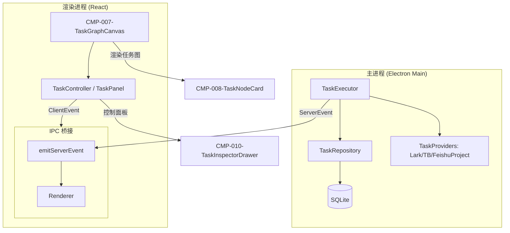
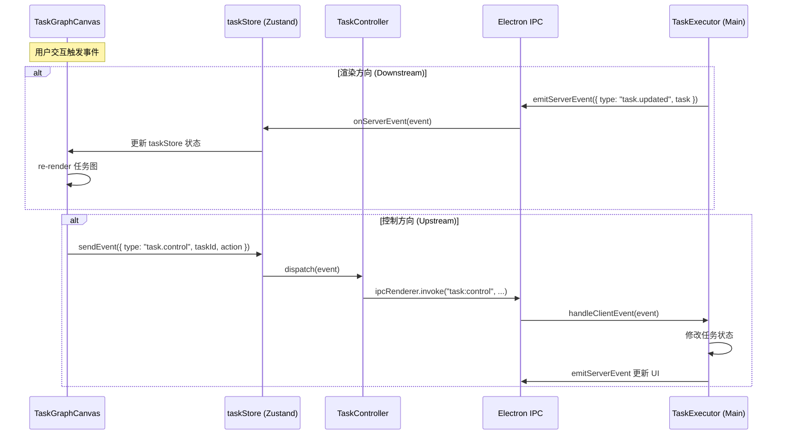
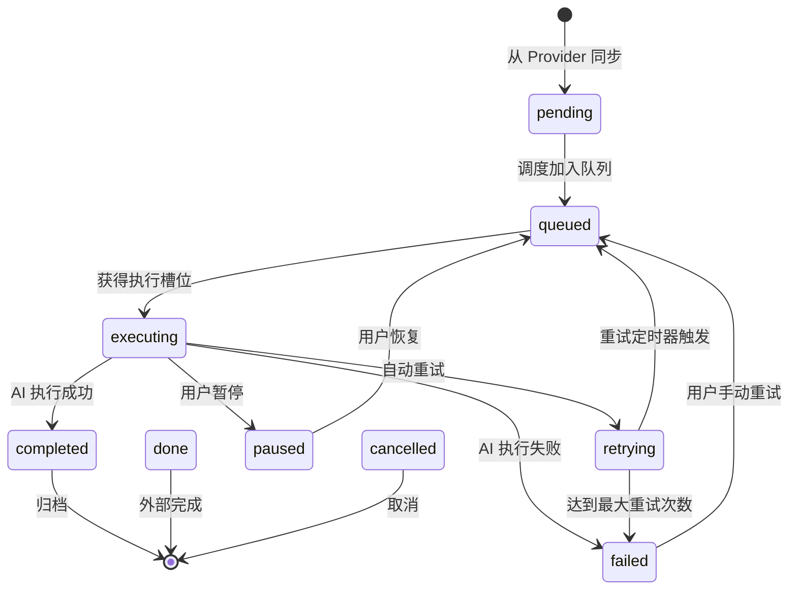
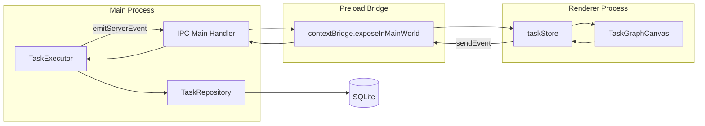

# 任务图画布组件 (CMP-007-TaskGraphCanvas)

<cite>

**本文引用的文件**

- [src/electron/libs/task/README.md](file://src/electron/libs/task/README.md)
- [src/electron/libs/task/index.ts](file://src/electron/libs/task/index.ts)
- [src/electron/libs/task/executor.ts](file://src/electron/libs/task/executor.ts)
- [src/electron/libs/task/provider-registry.ts](file://src/electron/libs/task/provider-registry.ts)
- [src/electron/libs/task/providers/feishu-project-provider.ts](file://src/electron/libs/task/providers/feishu-project-provider.ts)
- [src/electron/libs/task/providers/lark-provider.ts](file://src/electron/libs/task/providers/lark-provider.ts)
- [src/electron/libs/task/providers/tb-provider.ts](file://src/electron/libs/task/providers/tb-provider.ts)
- [src/electron/libs/task/repository.ts](file://src/electron/libs/task/repository.ts)
- [src/electron/libs/task/settings.ts](file://src/electron/libs/task/settings.ts)
- [src/electron/libs/task/types.ts](file://src/electron/libs/task/types.ts)
- [src/electron/libs/task/workflow.ts](file://src/electron/libs/task/workflow.ts)
- [src/electron/libs/task/workspace.ts](file://src/electron/libs/task/workspace.ts)
- [src/ui/components/TaskPanel.tsx](file://src/ui/components/TaskPanel.tsx)
- [src/electron/libs/mcp-tools/cron.ts](file://src/electron/libs/mcp-tools/cron.ts)
- [doc/40-product/1.0.0/40-delivery/components/CMP-007-TaskGraphCanvas.md](file://doc/40-product/1.0.0/40-delivery/components/CMP-007-TaskGraphCanvas.md)
- [doc/40-product/1.0.0/40-delivery/components/CMP-001-SessionSidebar.md](file://doc/40-product/1.0.0/40-delivery/components/CMP-001-SessionSidebar.md)

</cite>

## 目录

- [1. 组件职责与定位](#1-组件职责与定位)
- [2. 任务图数据模型](#2-任务图数据模型)
- [3. 节点与边的渲染架构](#3-节点与边的渲染架构)
- [4. 交互操作体系](#4-交互操作体系)
- [5. 与 TaskController 的双向绑定](#5-与-taskcontroller-的双向绑定)
- [6. 状态流转与事件模型](#6-状态流转与事件模型)
- [7. 使用示例](#7-使用示例)
- [8. 失败模式与排障指南](#8-失败模式与排障指南)
- [9. 扩展点与定制指南](#9-扩展点与定制指南)
- [10. Agent 改代码地图](#10-agent-改代码地图)

---

## 1. 组件职责与定位

### 1.1 核心职责

`CMP-007-TaskGraphCanvas` 是任务图可视化与交互的主容器组件。根据 PRD 文档定义 [file://doc/40-product/1.0.0/40-delivery/components/CMP-007-TaskGraphCanvas.md#L19-L40](file://doc/40-product/1.0.0/40-delivery/components/CMP-007-TaskGraphCanvas.md#L19-L40)，其核心职责包括：

| 职责 | 说明 |
|------|------|
| **节点可视化** | 承载任务节点渲染，展示任务标题、状态、执行进度 |
| **依赖关系展示** | 使用有向边展示任务间的前置依赖关系 |
| **选中交互** | 支持节点点击选中，触发详情面板展开 |
| **布局管理** | 提供空态和基础布局能力 |

### 1.2 在任务系统中的位置



**章节来源**：[src/electron/libs/task/README.md#L1-L22](file://src/electron/libs/task/README.md#L1-L22)

### 1.3 与其他组件的关系

根据组件索引 [file://doc/40-product/1.0.0/40-delivery/48-组件索引.md](file://doc/40-product/1.0.0/40-delivery/48-组件索引.md)：

- **上游**：TaskController 提供任务数据源
- **下游**：TaskNodeCard (CMP-008) 渲染单个节点
- **平级**：TaskInspectorDrawer (CMP-010) 展示选中详情

---

## 2. 任务图数据模型

### 2.1 核心类型定义

任务图的数据结构定义在 [src/electron/libs/task/types.ts#L1-L100](file://src/electron/libs/task/types.ts#L1-L100)：

```typescript
// 任务提供者 ID
type TaskProviderId = "lark" | "tb" | "feishu-project";

// 外部任务状态（来自第三方）
type ExternalTaskStatus = "pending" | "in_progress" | "done" | "cancelled";

// 本地任务状态（包含 AI 执行阶段）
type LocalTaskStatus =
  | ExternalTaskStatus
  | "queued"        // 排队中
  | "executing"     // AI 执行中
  | "retrying"      // 自动重试
  | "paused"        // 已暂停
  | "completed"     // AI 执行完成
  | "failed";       // AI 执行失败

// 外部任务（来自 Provider）
type ExternalTask = {
  id: string;
  externalId: string;
  provider: TaskProviderId;
  title: string;
  description?: string;
  status: ExternalTaskStatus;
  assignee?: string;
  priority: TaskPriority;
  dueDate?: number;
  sourceData: Record<string, unknown>;
  createdAt: number;
  updatedAt: number;
};

// 已存储任务（持久化到 SQLite）
type StoredTask = ExternalTask & {
  localStatus: LocalTaskStatus;
  claimState: TaskClaimState;
  retryAttempt: number;
  retryDueAt?: number;
  lastError?: string;
  workspacePath?: string;
  driverId?: TaskAgentDriverId;
  model?: string;
  reasoningMode?: TaskReasoningMode;
  maxCostUsd?: number;
  inputTokens?: number;
  outputTokens?: number;
  estimatedCostUsd?: number;
};
```

### 2.2 图的数据结构

任务图由节点和边组成：

```typescript
// 节点结构（任务）
interface TaskNode {
  id: string;           // StoredTask.id
  externalId: string;   // 第三方 ID
  provider: TaskProviderId;
  title: string;
  status: LocalTaskStatus;
  priority: TaskPriority;
  assignee?: string;
  position?: { x: number; y: number };  // 画布坐标
  executionProgress?: number;  // 0-100
}

// 边结构（依赖关系）
interface TaskEdge {
  id: string;
  source: string;       // 前置任务 ID
  target: string;       // 后继任务 ID
  type: "depends_on";
}
```

### 2.3 执行记录与日志

```typescript
// 任务执行记录
type TaskExecution = {
  id: string;
  taskId: string;
  sessionId: string;
  status: "running" | "completed" | "failed" | "cancelled";
  attempt?: number;
  startedAt: number;
  completedAt?: number;
  inputTokens?: number;
  outputTokens?: number;
  estimatedCostUsd?: number;
  terminalReason?: string;
  error?: string;
};

// 执行日志
type TaskExecutionLog = {
  id: string;
  executionId: string;
  taskId: string;
  level: "info" | "warn" | "error";
  message: string;
  timestamp: number;
};
```

**章节来源**：[src/electron/libs/task/types.ts#L82-L110](file://src/electron/libs/task/types.ts#L82-L110)

---

## 3. 节点与边的渲染架构

### 3.1 组件层级

```mermaid
classDiagram
    class TaskGraphCanvas {
        +nodes: TaskNode[]
        +edges: TaskEdge[]
        +selectedNodeId: string | null
        +zoom: number
        +pan: {x, y}
        +onNodeSelect(id)
        +onNodeDrag(id, position)
        +onZoom(delta)
        +onPan(delta)
    }

    class TaskNodeCard {
        +task: StoredTask
        +isSelected: boolean
        +onClick()
        +onDoubleClick()
        +renderStatus()
        +renderPriority()
        +renderAssignee()
    }

    class TaskEdgeLine {
        +sourceId: string
        +targetId: string
        +type: EdgeType
        +renderArrow()
    }

    class TaskInspectorDrawer {
        +taskId: string
        +executionBundle: TaskExecutionBundle
        +onClose()
    }

    TaskGraphCanvas --> TaskNodeCard : renders
    TaskGraphCanvas --> TaskEdgeLine : renders
    TaskGraphCanvas --> TaskInspectorDrawer : opens
```

### 3.2 节点渲染逻辑

根据 CMP-008 (TaskNodeCard) 规格和 TaskPanel.tsx 中的渲染逻辑 [file://src/ui/components/TaskPanel.tsx#L53-L91](file://src/ui/components/TaskPanel.tsx#L53-L91)：

```typescript
// 状态配置
const STATUS_TONES: Record<UiTaskStatus, { badge: string; dot: string; icon: IconType }> = {
  pending:      { badge: "border-slate-200 bg-slate-50", dot: "bg-slate-400", icon: Circle },
  in_progress:  { badge: "border-sky-200 bg-sky-50", dot: "bg-sky-500", icon: Clock3 },
  done:         { badge: "border-emerald-200 bg-emerald-50", dot: "bg-emerald-500", icon: CheckCircle2 },
  queued:       { badge: "border-indigo-200 bg-indigo-50", dot: "bg-indigo-500", icon: Clock3 },
  executing:    { badge: "border-amber-200 bg-amber-50", dot: "bg-amber-500", icon: Loader2 },
  retrying:     { badge: "border-blue-200 bg-blue-50", dot: "bg-blue-500", icon: RefreshCw },
  paused:       { badge: "border-slate-200 bg-slate-50", dot: "bg-slate-400", icon: Pause },
  completed:    { badge: "border-emerald-200 bg-emerald-50", dot: "bg-emerald-500", icon: CheckCircle2 },
  failed:       { badge: "border-red-200 bg-red-50", dot: "bg-red-500", icon: AlertCircle },
};

const PRIORITY_TONES: Record<string, string> = {
  low:    "bg-slate-50 text-slate-500 ring-slate-200",
  medium: "bg-slate-50 text-slate-700 ring-slate-200",
  high:   "bg-amber-50 text-amber-700 ring-amber-200",
  urgent: "bg-red-50 text-red-700 ring-red-200",
};
```

### 3.3 边的渲染逻辑

依赖边使用有向箭头连接源节点和目标节点。边的样式根据依赖类型区分：

| 依赖类型 | 样式 | 说明 |
|----------|------|------|
| `depends_on` | 实线箭头 | 阻塞性依赖，前置任务完成前不能执行 |
| `weak_dep` | 虚线箭头 | 软依赖，仅提示关系 |

---

## 4. 交互操作体系

### 4.1 拖拽操作

```typescript
interface DragState {
  nodeId: string;
  startPosition: { x: number; y: number };
  currentPosition: { x: number; y: number };
  isDragging: boolean;
}

// 拖拽回调
onNodeDrag: (nodeId: string, position: { x: number; y: number }) => void;
```

### 4.2 缩放操作

```typescript
interface ZoomState {
  scale: number;      // 0.25 - 4.0
  minScale: 0.25;
  maxScale: 4.0;
  step: 0.1;
}

// 缩放回调
onZoom: (delta: number) => void;  // delta: -1 (缩小) | 1 (放大)
onZoomToFit: () => void;          // 自动适应画布
onZoomToNode: (nodeId: string) => void;  // 聚焦节点
```

### 4.3 选中操作

```typescript
interface SelectionState {
  selectedNodeId: string | null;
  multiSelect: boolean;
  selectedNodeIds: string[];
}

// 选中回调
onNodeSelect: (nodeId: string, event: MouseEvent) => void;
onNodeDeselect: () => void;
onNodeDoubleClick: (nodeId: string) => void;  // 打开详情
```

### 4.4 画布操作

```typescript
interface CanvasState {
  pan: { x: number; y: number };
  zoom: number;
  viewportSize: { width: number; height: number };
}

// 画布回调
onPan: (delta: { dx: number; dy: number }) => void;
onResetView: () => void;
```

**图表来源**：[doc/40-product/1.0.0/40-delivery/components/CMP-007-TaskGraphCanvas.md#L24-L30](file://doc/40-product/1.0.0/40-delivery/components/CMP-007-TaskGraphCanvas.md#L24-L30)

---

## 5. 与 TaskController 的双向绑定

### 5.1 数据流向



### 5.2 IPC 事件定义

事件类型定义在 [src/electron/libs/task/types.ts#L202-L227](file://src/electron/libs/task/types.ts#L202-L227)：

```typescript
// 服务端事件 (Main → Renderer)
type TaskServerEvent =
  | { type: "task.list"; payload: { tasks: StoredTask[] } }
  | { type: "task.updated"; payload: { task: StoredTask } }
  | { type: "task.deleted"; payload: { taskId: string } }
  | { type: "task.execution.started"; payload: { execution: TaskExecution } }
  | { type: "task.execution.completed"; payload: { execution: TaskExecution } }
  | { type: "task.execution.log"; payload: { log: TaskExecutionLog } }
  | { type: "task.execution.bundle"; payload: TaskExecutionBundle }
  | { type: "task.settings"; payload: { settings: TaskWorkflowSettings } }
  | { type: "task.providers"; payload: { providers: TaskProviderState[] } }
  | { type: "task.stats"; payload: { stats: TaskStats } }
  | { type: "task.sync.completed"; payload: { provider: TaskProviderId; count: number } }
  | { type: "task.error"; payload: { message: string } };

// 客户端事件 (Renderer → Main)
type TaskClientEvent =
  | { type: "task.list"; payload?: { filter?: TaskFilter } }
  | { type: "task.sync"; payload: { provider: TaskProviderId } }
  | { type: "task.execute"; payload: { taskId: string; options?: TaskExecutionOptions } }
  | { type: "task.control"; payload: { taskId: string; action: TaskExecutionControlAction } }
  | { type: "task.delete"; payload: { taskId: string } }
  | { type: "task.markStatus"; payload: { taskId: string; status: ExternalTaskStatus } }
  | { type: "task.settings.get"; payload?: {} }
  | { type: "task.settings.update"; payload: { settings: Partial<TaskWorkflowSettings> } }
  | { type: "task.providers"; payload?: {} }
  | { type: "task.stats"; payload?: {} }
  | { type: "task.execution.logs"; payload: { taskId: string } };
```

### 5.3 控制动作

```typescript
type TaskExecutionControlAction = "pause" | "resume" | "cancel" | "cancel-retry";
```

| 动作 | 效果 | 触发时机 |
|------|------|----------|
| `pause` | 暂停任务，设置为 `paused` 状态 | 用户手动暂停 |
| `resume` | 恢复任务，重新加入调度队列 | 用户恢复执行 |
| `cancel` | 取消任务，标记为 `cancelled` | 用户主动取消 |
| `cancel-retry` | 取消重试，清除 retry_due_at | 用户终止自动重试 |

**章节来源**：[src/electron/libs/task/types.ts#L35](file://src/electron/libs/task/types.ts#L35)

---

## 6. 状态流转与事件模型

### 6.1 任务状态机



### 6.2 Executor 事件流

根据 [src/electron/libs/task/executor.ts#L31-L40](file://src/electron/libs/task/executor.ts#L31-L40)：

```typescript
type TaskExecutorEvents = {
  onTaskUpdated?: (task: StoredTask) => void;
  onTaskDeleted?: (taskId: string) => void;
  onExecutionStarted?: (execution: TaskExecution) => void;
  onExecutionCompleted?: (execution: TaskExecution) => void;
  onExecutionLog?: (log: TaskExecutionLog) => void;
  onStatsChanged?: (stats: TaskStats) => void;
  onSyncCompleted?: (provider: TaskProviderId, count: number) => void;
  onError?: (message: string) => void;
};
```

### 6.3 数据持久化

任务数据存储在 SQLite 中，表结构定义在 [src/electron/libs/task/repository.ts#L32-L135](file://src/electron/libs/task/repository.ts#L32-L135)：

| 表名 | 用途 | 关键字段 |
|------|------|----------|
| `tasks` | 任务主表 | id, external_id, provider, status, local_status, claim_state |
| `task_executions` | 执行记录 | id, task_id, session_id, status, attempt |
| `task_execution_logs` | 执行日志 | id, execution_id, task_id, level, message |
| `task_subtasks` | 子任务 | id, task_id, title, status, sort_order |
| `task_artifacts` | 产物 | id, task_id, execution_id, path, kind |
| `task_dismissals` | 已忽略任务 | provider, external_id, deleted_at |

---

## 7. 使用示例

### 7.1 基础集成

```tsx
import { TaskGraphCanvas } from "./components/TaskGraphCanvas";
import { useTaskStore } from "./store/taskStore";

// 在组件中使用
function TaskDashboard() {
  const { tasks, selectedTaskId, setSelectedTask } = useTaskStore();

  // 构建图数据
  const nodes = tasks.map(task => ({
    id: task.id,
    externalId: task.externalId,
    provider: task.provider,
    title: task.title,
    status: task.localStatus,
    priority: task.priority,
    assignee: task.assignee,
  }));

  // 示例：基于 executionSessionId 构建依赖关系
  const edges = tasks
    .filter(t => t.executionSessionId)
    .map(t => ({
      id: `edge-${t.id}`,
      source: findDependentTaskId(t),
      target: t.id,
      type: "depends_on" as const,
    }))
    .filter(e => e.source);

  return (
    <TaskGraphCanvas
      nodes={nodes}
      edges={edges}
      selectedNodeId={selectedTaskId}
      onNodeSelect={(nodeId) => setSelectedTask(nodeId)}
      onNodeDoubleClick={(nodeId) => openTaskInspector(nodeId)}
      onNodeDrag={(nodeId, position) => saveNodePosition(nodeId, position)}
      onZoom={(delta) => zoomCanvas(delta)}
      onPan={(delta) => panCanvas(delta)}
    />
  );
}
```

### 7.2 任务控制操作

```tsx
// 暂停任务
const pauseTask = async (taskId: string) => {
  await sendEvent({
    type: "task.control",
    payload: { taskId, action: "pause" }
  });
};

// 恢复任务
const resumeTask = async (taskId: string) => {
  await sendEvent({
    type: "task.control",
    payload: { taskId, action: "resume" }
  });
};

// 取消任务
const cancelTask = async (taskId: string) => {
  await sendEvent({
    type: "task.control",
    payload: { taskId, action: "cancel" }
  });
};

// 手动执行任务
const executeTask = async (taskId: string) => {
  await sendEvent({
    type: "task.execute",
    payload: {
      taskId,
      options: {
        model: "claude-sonnet-4-20250514",
        reasoningMode: "high"
      }
    }
  });
};
```

### 7.3 监听任务更新

```tsx
useEffect(() => {
  const handleServerEvent = (event: TaskServerEvent) => {
    switch (event.type) {
      case "task.updated":
        // 更新画布节点
        updateNode(event.payload.task);
        break;
      case "task.execution.started":
        // 高亮执行中的节点
        highlightNode(event.payload.execution.taskId);
        break;
      case "task.execution.completed":
        // 更新节点状态
        updateNodeStatus(event.payload.execution.taskId, "completed");
        break;
      case "task.error":
        // 显示错误提示
        toast.error(event.payload.message);
        break;
    }
  };

  // 注册事件监听
  window.electron?.on("task:server-event", handleServerEvent);

  return () => {
    window.electron?.off("task:server-event", handleServerEvent);
  };
}, []);
```

---

## 8. 失败模式与排障指南

### 8.1 常见问题

| 问题 | 症状 | 排查方向 |
|------|------|----------|
| **Provider 同步失败** | 任务列表为空，或显示错误 | 检查 lark-cli、tb-cli 配置 |
| **任务卡在 executing** | 节点状态长时间不更新 | 检查 stallTimeoutMs 设置 |
| **重复触发同步** | 多个 `task.sync.completed` 事件 | 检查 pollTimer 清理逻辑 |
| **无法拖拽节点** | 拖动无响应 | 检查 zoom/pan 状态冲突 |
| **选中状态丢失** | 点击节点后选中高亮消失 | 检查 selectedNodeId 更新逻辑 |

### 8.2 Provider 配置问题

根据 [src/electron/libs/task/providers/lark-provider.ts#L141-L155](file://src/electron/libs/task/providers/lark-provider.ts#L141-L155)，Lark Provider 常见错误：

```typescript
// 错误：需要用户授权
if (errorMessage.includes("need_user_authorization")) {
  return "lark-cli 已配置 App，但还没有用户授权。请运行: lark-cli auth login --domain task";
}

// 排查步骤
// 1. 检查 CLI 是否可用: lark-cli --version
// 2. 检查授权状态: lark-cli auth status
// 3. 重新授权: lark-cli auth login --domain task
```

### 8.3 中断恢复机制

当应用重启导致执行中断时，Executor 自动处理恢复 [file://src/electron/libs/task/executor.ts#L228-L265](file://src/electron/libs/task/executor.ts#L228-L265)：

```typescript
private recoverInterruptedExecutions(): void {
  // 从 SQLite 恢复中断的 executions
  const recoveries = this.repo.recoverInterruptedExecutions(
    INTERRUPTED_EXECUTION_ERROR  // "应用已重启，上一轮任务执行进程已中断。"
  );

  for (const recovery of recoveries) {
    const nextAttempt = Math.max(
      recovery.execution.attempt ?? 0 + 1,
      recovery.interruptionCount
    );
    const shouldAutoRetry = nextAttempt <= this.workflow.agent.maxAutoRetries;

    if (shouldAutoRetry) {
      this.scheduleRetry(recovery.task, recovery.execution.id, nextAttempt);
    }
  }
}
```

---

## 9. 扩展点与定制指南

### 9.1 添加新 Provider

参考 [src/electron/libs/task/providers/tb-provider.ts](file://src/electron/libs/task/providers/tb-provider.ts) 的模板模式：

```typescript
// 1. 实现 TaskProvider 接口
export class MyTaskProvider implements TaskProvider {
  readonly id = "my-provider" as const;
  readonly name = "我的任务源";

  isEnabled(): boolean {
    const settings = loadTaskSettings();
    return Boolean(settings.myCliCommand?.trim());
  }

  async fetchTasks(): Promise<ExternalTask[]> {
    // 实现获取任务逻辑
  }

  async updateTaskStatus(externalId: string, status: ExternalTaskStatus): Promise<void> {
    // 实现状态回写逻辑
  }
}

// 2. 在 index.ts 注册
export { MyTaskProvider } from "./providers/my-provider.js";
```

### 9.2 自定义节点渲染

通过 TaskNodeCard (CMP-008) 扩展点定制：

```tsx
// 自定义节点渲染器
const CustomTaskNode: React.FC<TaskNodeProps> = ({ task, isSelected }) => {
  return (
    <div className={cx(
      "task-node",
      isSelected && "task-node--selected",
      task.status === "executing" && "task-node--executing"
    )}>
      {/* 标题 */}
      <div className="task-title">{task.title}</div>

      {/* 状态徽章 */}
      <StatusBadge status={task.status} compact />

      {/* 优先级标签 */}
      <PriorityPill priority={task.priority} />

      {/* 执行进度 */}
      {task.status === "executing" && (
        <div className="progress-bar">
          <div
            className="progress-fill"
            style={{ width: `${task.executionProgress}%` }}
          />
        </div>
      )}
    </div>
  );
};
```

### 9.3 布局算法扩展

当前支持基础布局，可扩展为：

- **层次布局**：用于 DAG 结构任务
- **力导向布局**：自动排列避免边交叉
- **网格布局**：整齐排列的看板模式

---

## 10. Agent 改代码地图

### 10.1 先读文件顺序

| 顺序 | 文件 | 理由 |
|------|------|------|
| 1 | `src/electron/libs/task/types.ts` | 理解核心类型定义 |
| 2 | `src/electron/libs/task/index.ts` | 了解模块导出 |
| 3 | `src/electron/libs/task/executor.ts` | 理解调度逻辑 |
| 4 | `src/electron/libs/task/repository.ts` | 理解持久化逻辑 |
| 5 | `src/ui/components/TaskPanel.tsx` | 理解 UI 层实现 |

### 10.2 关键符号表

| 类别 | 符号名 | 位置 | 用途 |
|------|--------|------|------|
| **类型** | `TaskExecutorEvents` | executor.ts:31 | Executor 事件回调定义 |
| **类型** | `TaskClientEvent` / `TaskServerEvent` | types.ts:202-227 | IPC 事件定义 |
| **类型** | `StoredTask` | types.ts:61 | 已持久化任务类型 |
| **函数** | `syncProvider()` | executor.ts:140 | 同步单个 Provider |
| **函数** | `executeTask()` | executor.ts:309 | 执行任务入口 |
| **函数** | `detectStalledExecutions()` | executor.ts:283 | 检测卡住任务 |
| **函数** | `upsertTask()` | repository.ts:198 | 插入或更新任务 |
| **表** | `tasks` | repository.ts:33 | 任务主表 |
| **表** | `task_executions` | repository.ts:67 | 执行记录表 |
| **IPC Channel** | `task:client-event` | - | 客户端事件通道 |
| **IPC Channel** | `task:server-event` | - | 服务端事件通道 |
| **Provider** | `LarkTaskProvider` | lark-provider.ts:157 | 飞书任务适配器 |
| **Provider** | `TbTaskProvider` | tb-provider.ts:24 | TB 任务适配器 |
| **Provider** | `FeishuProjectTaskProvider` | feishu-project-provider.ts:111 | 飞书项目适配器 |

### 10.3 修改入口

| 修改目标 | 入口文件 | 关键函数/行 |
|----------|----------|-------------|
| 添加新状态 | `types.ts` | `LocalTaskStatus` 定义行 12 |
| 添加新控制动作 | `types.ts` | `TaskExecutionControlAction` 行 35 |
| 修改同步逻辑 | `executor.ts` | `syncProvider()` 行 140 |
| 修改调度参数 | `settings.ts` | `normalizeTaskSettings()` 行 62 |
| 修改持久化逻辑 | `repository.ts` | `upsertTask()` 行 198 |
| 添加 Provider | `provider-registry.ts` | `registerTaskProvider()` 行 5 |
| 修改 UI 渲染 | `TaskPanel.tsx` | `TaskPanel` 组件行 203 |

### 10.4 验证命令

```bash
# 构建验证
npm run build

# 类型检查
npx tsc --noEmit

# 单元测试（如有）
npm test

# 运行时验证
# 1. 启动应用
npm run dev
# 2. 打开任务面板
# 3. 检查控制台无报错
```

### 10.5 常见回归风险

| 风险点 | 描述 | 预防措施 |
|--------|------|----------|
| **pollTimer 未清理** | 多次调用 `startPolling` 导致重复轮询 | 启动前检查 `pollTimer !== null` |
| **事件内存泄漏** | IPC 监听未移除导致累积 | `useEffect` 中返回清理函数 |
| **状态不一致** | UI 更新晚于数据库写入 | 使用 `await` 等待 `emitServerEvent` |
| **Provider 冲突** | 多个 Provider 返回相同 externalId | SQLite 唯一约束 `(external_id, provider)` |
| **中断恢复死循环** | 重试次数检查不准确 | 验证 `attempt` vs `maxAutoRetries` |

### 10.6 前后端桥接点



| 桥接层 | 关键符号 | 说明 |
|--------|----------|------|
| **Main Handler** | `handleClientEvent()` | 处理来自 Renderer 的事件 |
| **Preload** | `window.electron.invoke()` | IPC 调用 |
| **Preload** | `window.electron.on()` | IPC 监听 |
| **Renderer Store** | `useTaskStore()` | Zustand 状态管理 |

---

**文档版本**：1.0.0
**最后更新**：2026-04-19
**维护者**：Engineering / Product