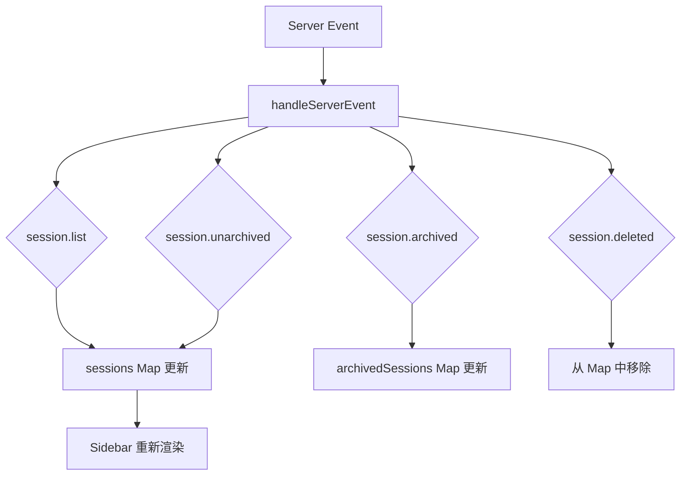
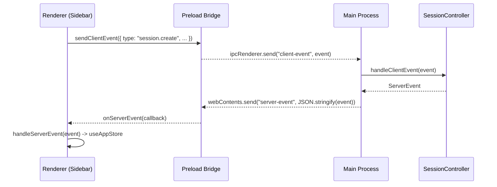

# 会话侧边栏组件（CMP-001-SessionSidebar）

> **文档版本**：1.0.0
> **所属组件**：CMP-001-SessionSidebar
> **最后更新**：2025-01-XX

<cite>

**本文引用的文件**

- [src/ui/components/Sidebar.tsx](file://src/ui/components/Sidebar.tsx)
- [src/ui/types.ts](file://src/ui/types.ts)
- [src/ui/store/useAppStore.ts](file://src/ui/store/useAppStore.ts)
- [src/ui/hooks/useIPC.ts](file://src/ui/hooks/useIPC.ts)
- [src/ui/App.tsx](file://src/ui/App.tsx)
- [src/electron/main.ts](file://src/electron/main.ts)
- [src/electron/preload.cts](file://src/electron/preload.cts)

</cite>

---

## 目录

- [1. 组件职责与边界](#1-组件职责与边界)
- [2. 数据结构与状态管理](#2-数据结构与状态管理)
- [3. 会话列表渲染与分组](#3-会话列表渲染与分组)
- [4. 会话切换与搜索](#4-会话切换与搜索)
- [5. Props 接口与回调函数](#5-props-接口与回调函数)
- [6. 与后端 IPC 交互](#6-与后端-ipc-交互)
- [7. 运行时状态与边界](#7-运行时状态与边界)
- [8. 组件使用示例](#8-组件使用示例)
- [9. 故障排查](#9-故障排查)
- [10. Agent 改代码地图](#10-agent-改代码地图)

---

## 1. 组件职责与边界

`Sidebar` 组件是 tech-cc-hub 的会话管理入口，负责：

1. **会话列表呈现**：渲染当前活跃会话与已归档会话
2. **工作区分组**：按 `cwd` 对会话进行分组展示
3. **会话状态感知**：追踪 running/idle/completed/error 状态变化
4. **未读提示**：在后台会话完成时显示视觉提醒
5. **快捷操作**：支持新建会话、归档、删除等操作

**入口点**：[Sidebar@21](file://src/ui/components/Sidebar.tsx#L21) 在 `App.tsx` 中被导入并挂载于左侧区域。

```tsx
// App.tsx 第 10 行
import { Sidebar } from "./components/Sidebar";

// App.tsx 中渲染
<Sidebar
  connected={connected}
  onNewSession={handleNewSession}
  onArchiveSession={handleArchiveSession}
  onUnarchiveSession={handleUnarchiveSession}
  onRefreshArchivedSessions={handleRefreshArchivedSessions}
  onDeleteSession={handleDeleteSession}
  onDeleteWorkspace={handleDeleteWorkspace}
  onOpenSettings={openSettings}
  onOpenKnowledgePanel={openKnowledgePanel}
  onOpenCronPage={openCronPage}
  onOpenTaskPanel={openTaskPanel}
  width={sidebarWidth}
/>
```

---

## 2. 数据结构与状态管理

### 2.1 核心类型定义

**来源**：[SessionInfo@284](file://src/ui/types.ts#L284) 和 [SessionView@32](file://src/ui/store/useAppStore.ts#L32)

```typescript
// src/ui/types.ts
export type SessionStatus = "idle" | "running" | "completed" | "error";

export type SessionInfo = {
  id: string;
  title: string;
  status: SessionStatus;
  model?: string;
  claudeSessionId?: string;
  cwd?: string;
  runSurface?: AgentRunSurface;
  agentId?: string;
  slashCommands?: string[];
  workflowMarkdown?: string;
  workflowSourceLayer?: WorkflowScope;
  workflowSourcePath?: string;
  workflowState?: SessionWorkflowState;
  workflowError?: string;
  archivedAt?: number;
  createdAt: number;
  updatedAt: number;
};

// src/ui/store/useAppStore.ts
export type SessionView = {
  id: string;
  title: string;
  status: SessionStatus;
  model?: string;
  cwd?: string;
  slashCommands?: string[];
  messages: StreamMessage[];
  permissionRequests: PermissionRequest[];
  lastPrompt?: string;
  workflowMarkdown?: string;
  workflowState?: SessionWorkflowState;
  latestPlan?: SessionPlanSnapshot;
  archivedAt?: number;
  createdAt?: number;
  updatedAt?: number;
  hydrated: boolean;
  hasMoreHistory: boolean;
  historyCursor?: SessionHistoryCursor;
};
```

### 2.2 Zustand Store 状态结构

**来源**：[AppState@103](file://src/ui/store/useAppStore.ts#L103)

```typescript
interface AppState {
  sessions: Record<string, SessionView>;           // 活跃会话
  archivedSessions: Record<string, SessionView>;    // 已归档会话
  activeSessionId: string | null;                  // 当前激活会话 ID
  // ...
}
```

**关键数据流**：



---

## 3. 会话列表渲染与分组

### 3.1 会话列表构建

**来源**：[sessionList@62](file://src/ui/components/Sidebar.tsx#L62) 和 [workspaceGroups@141](file://src/ui/components/Sidebar.tsx#L141)

```typescript
// 按 updatedAt 降序排列
const sessionList = useMemo(() => {
  const list = Object.values(showArchived ? archivedSessions : sessions);
  list.sort((a, b) => (b.updatedAt ?? 0) - (a.updatedAt ?? 0));
  return list;
}, [archivedSessions, sessions, showArchived]);

// 按 cwd 分组
const workspaceGroups = useMemo(() => {
  const groups = new Map<string, { cwd?: string; sessions: typeof sessionList }>();
  for (const session of sessionList) {
    const key = session.cwd?.trim() || "__no_workspace__";
    // 分组逻辑...
  }
  return Array.from(groups.entries())
    .sort((a, b) => {
      const aLatest = Math.max(...a.sessions.map((s) => s.updatedAt ?? 0));
      const bLatest = Math.max(...b.sessions.map((s) => s.updatedAt ?? 0));
      return bLatest - aLatest;
    });
}, [sessionList]);
```

### 3.2 工作区名称格式化

**来源**：[formatWorkspaceName@56](file://src/ui/components/Sidebar.tsx#L56)

```typescript
const formatWorkspaceName = (cwd?: string) => {
  if (!cwd) return "未绑定工作区";
  const parts = cwd.split(/[\\/]+/).filter(Boolean);
  return parts.at(-1) || cwd;
};
```

### 3.3 未读状态追踪

**来源**：[previousSessionStatusRef@46](file://src/ui/components/Sidebar.tsx#L46) 和 [unreadSessionIds@47](file://src/ui/components/Sidebar.tsx#L47)

当后台会话从 `running` 变为 `completed` 或 `error` 时，Sidebar 会标记该会话为"未读"，直到用户切换到该会话：

```typescript
// 状态变化检测逻辑
if (
  previousStatus === "running" &&
  (session.status === "completed" || session.status === "error") &&
  session.id !== activeSessionId
) {
  finishedUnreadSessions[session.id] = session.status;
}

// 激活会话时清除未读标记
useEffect(() => {
  if (!activeSessionId) return;
  setUnreadSessionIds((current) => {
    if (!current[activeSessionId]) return current;
    const next = { ...current };
    delete next[activeSessionId];
    return next;
  });
}, [activeSessionId]);
```

---

## 4. 会话切换与搜索

### 4.1 会话切换

**入口**：`setActiveSessionId` 回调由 `SidebarProps.onNewSession` 等触发，最终在 App 层处理。

```typescript
// Sidebar.tsx 第 39 行
const setActiveSessionId = useAppStore((state) => state.setActiveSessionId);

// 点击会话项时调用
<button onClick={() => setActiveSessionId(session.id)}>
```

### 4.2 会话归档与恢复

**来源**：[handleArchiveSession](file://src/ui/components/Sidebar.tsx#L10) 和 [handleUnarchiveSession](file://src/ui/components/Sidebar.tsx#L11)

```typescript
// 归档会话
<DropdownMenu.Item onClick={() => onArchiveSession(session.id)}>

// 恢复会话
<DropdownMenu.Item onClick={() => onUnarchiveSession(session.id)}>
```

### 4.3 会话搜索

当前 Sidebar 组件**未实现**本地搜索功能。会话列表按 `updatedAt` 排序，分组展示。如需搜索功能，扩展点为：

1. 在 `SidebarProps` 中添加 `searchQuery?: string`
2. 在 `sessionList` useMemo 中过滤匹配 `title`/`cwd`
3. 更新 JSX 渲染逻辑

---

## 5. Props 接口与回调函数

**来源**：[SidebarProps@7](file://src/ui/components/Sidebar.tsx#L7)

```typescript
interface SidebarProps {
  connected: boolean;                              // IPC 连接状态
  onNewSession: (cwd?: string) => void;          // 新建会话
  onArchiveSession: (sessionId: string) => void;  // 归档会话
  onUnarchiveSession: (sessionId: string) => void;// 恢复会话
  onRefreshArchivedSessions: () => void;           // 刷新归档列表
  onDeleteSession: (sessionId: string) => void;   // 删除会话
  onDeleteWorkspace: (sessionIds: string[], workspaceName: string) => void; // 删除工作区
  onOpenSettings?: (pageId?: SettingsPageId) => void;
  onOpenKnowledgePanel?: () => void;
  onOpenCronPage?: () => void;
  onOpenTaskPanel?: () => void;
  width?: number;                                  // 默认 320
}
```

**可选回调的默认值处理**：

```typescript
// 第 198 行
const openSettings = (pageId?: SettingsPageId) => {
  if (onOpenSettings) {
    onOpenSettings(pageId);
    return;
  }
  useAppStore.getState().setShowSettingsModal(true);
};
```

---

## 6. 与后端 IPC 交互

### 6.1 IPC Channel 概览

**来源**：[App.tsx@6](file://src/ui/App.tsx#L6) 和 [preload.cts](file://src/electron/preload.cts)



### 6.2 关键 IPC Channels

| Channel | Direction | Purpose |
|---------|-----------|---------|
| `client-event` | Renderer → Main | 发送 ClientEvent（session.create/start/append 等） |
| `server-event` | Main → Renderer | 推送 ServerEvent（session.list/history/status 等） |
| `sessions:list` | Renderer → Main | 获取会话列表（fallback 模式） |

**来源**：[preload.cts 第 12-26 行](file://src/electron/preload.cts#L12-L26)

```typescript
sendClientEvent: (event: any) => {
    electron.ipcRenderer.send("client-event", event);
},
onServerEvent: (callback: (event: any) => void) => {
    const cb = (_: Electron.IpcRendererEvent, payload: string) => {
        const event = JSON.parse(payload);
        callback(event);
    };
    electron.ipcRenderer.on("server-event", cb);
    return () => electron.ipcRenderer.off("server-event", cb);
},
```

### 6.3 ServerEvent 处理

**来源**：[handleServerEvent](file://src/ui/store/useAppStore.ts)

关键事件类型：

| Event Type | Store Action |
|------------|--------------|
| `session.list` | 更新 `sessions` Map |
| `session.archived` | 移动会话到 `archivedSessions` |
| `session.unarchived` | 恢复会话到 `sessions` |
| `session.deleted` | 从 Map 中移除 |
| `session.status` | 更新会话状态 |
| `session.history` | 追加/更新消息历史 |

---

## 7. 运行时状态与边界

### 7.1 Source of Truth

- **运行时数据**：`useAppStore` 的 `sessions`/`archivedSessions` Map
- **持久化数据**：主进程通过 `session-store` 持久化于文件系统

### 7.2 刷新/重启边界

| 场景 | 影响 |
|------|------|
| 用户切换会话 | 加载历史消息（`session.history`），触发 `onLoadMore` |
| 会话完成 | 状态从 `running` → `completed/error`，触发未读标记 |
| 页面刷新 | Zustand 状态重建，从 `session.list` 重新同步 |
| 主进程重启 | IPC 断开后自动重连，服务器推送全量 `session.list` |

### 7.3 浏览器预览态

**来源**：[dev-electron-shim.ts](file://src/ui/dev-electron-shim.ts)

```typescript
// 模拟会话列表事件
const buildSessionListEvent = (): ServerEvent => ({
  type: "session.list",
  payload: {
    sessions: [{
      id: "browser-preview-session",
      title: "新聊天",
      status: "idle",
      cwd: browserPreviewCwd,
      slashCommands: ["codex", "review", "plan"],
      createdAt: sessionCreatedAt,
      updatedAt: sessionUpdatedAt,
    }],
  },
});
```

---

## 8. 组件使用示例

### 8.1 基本使用

```tsx
import { Sidebar } from "./components/Sidebar";
import { useAppStore } from "./store/useAppStore";

function App() {
  const { sessions, archivedSessions, activeSessionId, setActiveSessionId } = useAppStore();

  const handleNewSession = (cwd?: string) => {
    // 发送 session.create 事件
    window.electron.sendClientEvent({
      type: "session.create",
      payload: { cwd },
    });
  };

  const handleArchiveSession = (sessionId: string) => {
    window.electron.sendClientEvent({
      type: "session.archive",
      payload: { sessionId },
    });
  };

  return (
    <div className="flex">
      <Sidebar
        connected={true}
        onNewSession={handleNewSession}
        onArchiveSession={handleArchiveSession}
        onUnarchiveSession={(id) => console.log("restore:", id)}
        onRefreshArchivedSessions={() => {}}
        onDeleteSession={(id) => console.log("delete:", id)}
        onDeleteWorkspace={(ids, name) => console.log("delete workspace:", name)}
        width={320}
      />
      {/* 主内容区 */}
    </div>
  );
}
```

### 8.2 配合 useIPC Hook

```tsx
import { useIPC } from "./hooks/useIPC";
import { Sidebar } from "./components/Sidebar";
import { useAppStore } from "./store/useAppStore";

function App() {
  const handleServerEvent = useAppStore.getState().handleServerEvent;
  const { connected, sendEvent } = useIPC(handleServerEvent);

  return (
    <Sidebar
      connected={connected}
      onNewSession={(cwd) => sendEvent({ type: "session.create", payload: { cwd } })}
      // ...
    />
  );
}
```

---

## 9. 故障排查

### 9.1 会话列表为空

**检查项**：

1. 确认 IPC 已连接：`connected` prop 应为 `true`
2. 检查 `session.list` 事件是否触发：
   ```bash
   # 开发者工具 Console
   window.electron.invoke("sessions:list")
   ```
3. 验证 `useAppStore.sessions` 是否有数据

### 9.2 会话切换后消息未加载

**检查项**：

1. `session.history` 事件是否正确推送
2. `hydrated` 标志是否为 `true`
3. 检查 `historyRequested` Set 是否包含该会话 ID

### 9.3 未读标记不消失

**检查项**：

1. 确认 `activeSessionId` 已正确设置
2. 检查 `unreadSessionIds` 状态：
   ```typescript
   // 检查 Zustand 状态
   useAppStore.getState().sessions[sessionId]?.status
   ```

---

## 10. Agent 改代码地图

### 10.1 先读文件

| 优先级 | 文件 | 关键符号 |
|--------|------|----------|
| 1 | `src/ui/components/Sidebar.tsx` | `Sidebar`, `SidebarProps`, `sessionList`, `workspaceGroups` |
| 2 | `src/ui/store/useAppStore.ts` | `SessionView`, `sessions`, `archivedSessions`, `handleServerEvent` |
| 3 | `src/ui/types.ts` | `SessionInfo`, `SessionStatus`, `ClientEvent`, `ServerEvent` |
| 4 | `src/ui/hooks/useIPC.ts` | `useIPC`, `sendEvent`, `onEvent` |

### 10.2 关键 IPC Channel / Tool

| 名称 | 方向 | 用途 |
|------|------|------|
| `client-event` | Renderer→Main | 发送 session.create/archive/delete 等 |
| `server-event` | Main→Renderer | 接收 session.list/history/status 等 |
| `sessions:list` | invoke | 主动拉取会话列表（fallback 模式） |

### 10.3 修改入口

| 场景 | 入口文件 | 修改位置 |
|------|----------|----------|
| 新增会话操作 | `Sidebar.tsx` | `SidebarProps` + `handleCopyCommand` 等函数 |
| 修改状态管理 | `useAppStore.ts` | `handleServerEvent` switch case |
| 新增事件类型 | `types.ts` | `ClientEvent` / `ServerEvent` 联合类型 |
| 修改 IPC 逻辑 | `preload.cts` | `sendClientEvent` / `onServerEvent` |

### 10.4 验证命令

```bash
# 类型检查
pnpm exec tsc --noEmit

# 单元测试（如果有）
pnpm test -- --grep "Sidebar"

# E2E 测试
pnpm exec playwright test --grep "session"
```

### 10.5 常见回归风险

| 风险 | 预防措施 |
|------|----------|
| `unreadSessionIds` 更新逻辑丢失 | 测试 `completed`/`error` 状态转换 |
| `workspaceGroups` 分组错误 | 验证空 cwd 会话分组 |
| `archivedSessions` 切换后列表未刷新 | 测试 `showArchived` 切换 |
| IPC 事件类型不匹配 | 添加类型守卫检查 |

---

## 图表来源

- [会话数据流图](#2-数据结构与状态管理) — 基于 [useAppStore.ts](file://src/ui/store/useAppStore.ts#L103-L168) 分析
- [IPC 交互时序图](#6-与后端-ipc-交互) — 基于 [preload.cts](file://src/electron/preload.cts#L12-L26) 和 [main.ts](file://src/electron/main.ts#L30) 分析

---

*本文档由 Agent 自动生成，如有疑问请联系维护者。*