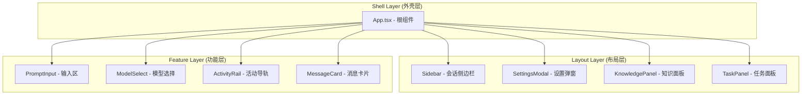
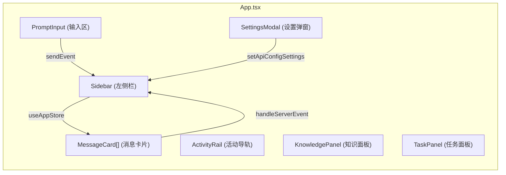
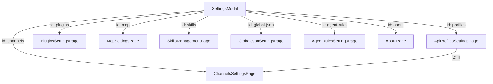
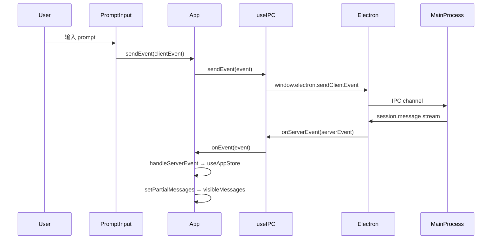
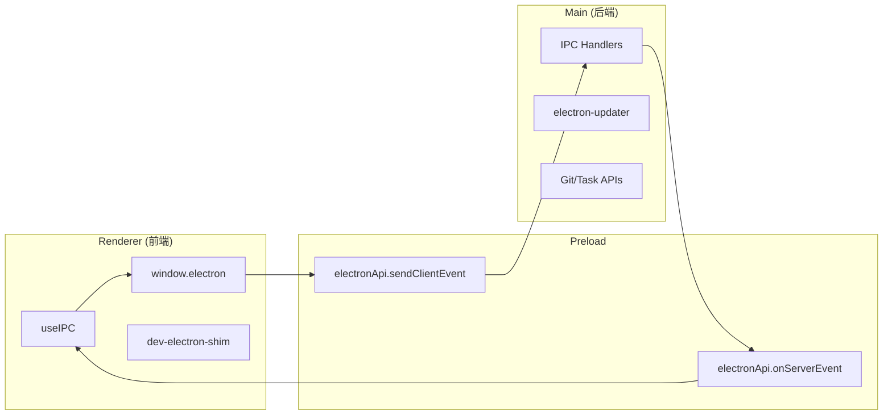

# 前端UI组件规格总览

<cite>

**本文引用的文件**

- [src/ui/App.tsx](file://src/ui/App.tsx)
- [src/ui/components/KnowledgePanel.tsx](file://src/ui/components/KnowledgePanel.tsx)
- [src/ui/components/settings/ChannelsSettingsPage.tsx](file://src/ui/components/settings/ChannelsSettingsPage.tsx)
- [src/ui/components/ModelSelect.tsx](file://src/ui/components/ModelSelect.tsx)
- [src/ui/components/PromptInput.tsx](file://src/ui/components/PromptInput.tsx)
- [src/ui/components/SettingsModal.tsx](file://src/ui/components/SettingsModal.tsx)
- [src/ui/components/Sidebar.tsx](file://src/ui/components/Sidebar.tsx)
- [src/ui/components/TaskPanel.tsx](file://src/ui/components/TaskPanel.tsx)
- [src/ui/hooks/useIPC.ts](file://src/ui/hooks/useIPC.ts)
- [src/ui/hooks/useMessageWindow.ts](file://src/ui/hooks/useMessageWindow.ts)
- [src/ui/store/useAppStore.ts](file://src/ui/store/useAppStore.ts)
- [src/ui/types.ts](file://src/ui/types.ts)
- [src/ui/main.tsx](file://src/ui/main.tsx)
- [src/ui/dev-electron-shim.ts](file://src/ui/dev-electron-shim.ts)
- [src/ui/index.css](file://src/ui/index.css)
- [src/ui/App.css](file://src/ui/App.css)
- [src/ui/components/settings/ApiProfilesSettingsPage.tsx](file://src/ui/components/settings/ApiProfilesSettingsPage.tsx)
- [src/ui/components/settings/SystemMaintenancePage.tsx](file://src/ui/components/settings/SystemMaintenancePage.tsx)

</cite>

---

## 目录

- [1. 组件架构总览](#1-组件架构总览)
- [2. 设计模式与类型系统](#2-设计模式与类型系统)
- [3. 核心组件规格](#3-核心组件规格)
- [4. 页面级组件规格](#4-页面级组件规格)
- [5. 状态管理架构](#5-状态管理架构)
- [6. 组件组合关系图](#6-组件组合关系图)
- [7. IPC通信通道映射](#7-ipc通信通道映射)
- [8. Agent 改代码地图](#8-agent-改代码地图)
- [9. 排障与扩展指南](#9-排障与扩展指南)

---

## 1. 组件架构总览

### 1.1 组件层级划分

tech-cc-hub 前端采用三层组件架构：



### 1.2 入口与挂载点

| 文件 | 职责 | 导出符号 | 入口说明 |
|------|------|---------|----------|
| `src/ui/main.tsx` | React 根挂载 + 开发桥接 | `bootstrap@5` | 在 DOM `#root` 挂载，DEV 模式安装 `installDevElectronShim()` |
| `src/ui/App.tsx` | 根组件，调度布局和事件 | `App@326` | 接收 `useIPC` 的 `connected` 和 `sendEvent`，管理会话视图状态 |

**章节来源**: [main.tsx bootstrap 函数](file://src/ui/main.tsx#L5-L18)、[App.tsx 入口行号](file://src/ui/App.tsx#L326-L342)

### 1.3 UI 状态来源

| 状态类型 | Source-of-Truth | 刷新边界 |
|---------|----------------|----------|
| 会话列表 `sessions` | 主进程 → IPC `session.list` | 应用启动、用户切换时刷新 |
| 全局配置 `globalConfig` | `window.electron.getGlobalConfig()` | 设置页面保存时重载 |
| 模型列表 `models` | API profile → `electron.invoke: models:list` | 切换 profile 时刷新 |
| 任务列表 `tasks` | `useTaskStore` + IPC `task:sync` | 手动同步或定时轮询 |
| 知识库工作区 `workspaces` | IPC `knowledge:list` | 知识面板打开时加载 |

---

## 2. 设计模式与类型系统

### 2.1 组件 Props 接口约定

所有 UI 组件遵循以下 Props 模式：

```typescript
// 回调型 props
sendEvent: (event: ClientEvent) => void;
onClose: () => void;
onBack: () => void;
onNewSession: (cwd?: string) => void;

// 配置型 props
connected: boolean;
disabled?: boolean;
width?: number;
```

例如 `Sidebar` 组件的 props 定义于 [Sidebar.tsx 第 7-20 行](file://src/ui/components/Sidebar.tsx#L7-L20)：

```typescript
interface SidebarProps {
  connected: boolean;
  onNewSession: (cwd?: string) => void;
  onArchiveSession: (sessionId: string) => void;
  onOpenSettings?: (pageId?: SettingsPageId) => void;
  onOpenKnowledgePanel?: () => void;
  onOpenCronPage?: () => void;
  onOpenTaskPanel?: () => void;
  width?: number;
}
```

### 2.2 核心类型定义

类型文件 [src/ui/types.ts](file://src/ui/types.ts) 导出以下关键类型：

| 类型名 | 行号 | 用途 |
|-------|------|------|
| `StreamMessage` | L277 | 消息流基本类型，SDKMessage + UserPromptMessage + PromptLedgerMessage 并集 |
| `SessionStatus` | L282 | `"idle" \| "running" \| "completed" \| "error"` |
| `ApiConfigProfile` | L29-50 | API 配置，包含 baseURL、apiKey、model、各角色模型 |
| `ChannelProviderId` | L211-214 | `"telegram" \| "lark" \| "wechat"` |
| `SettingsPageId` | L245 | 设置页面枚举 |
| `AppUpdateStatus` | L170-189 | 应用更新状态 |

### 2.3 事件类型

前端定义了两类事件通道：

- **ClientEvent**: 浏览器 → 主进程（发送用户操作）
- **ServerEvent**: 主进程 → 浏览器（推送服务端状态）

定义位置：[types.ts L269-280](file://src/ui/types.ts#L269-L280)

```typescript
export type UserPromptMessage = {
  type: "user_prompt";
  prompt: string;
  attachments?: PromptAttachment[];
  capturedAt?: number;
  historyId?: string;
};
```

---

## 3. 核心组件规格

### 3.1 App.tsx - 根容器

**文件**: [src/ui/App.tsx](file://src/ui/App.tsx) (1879 行)

**职责**:
- 布局主区域：左侧 Sidebar + 中间消息区 + 右侧 ActivityRail
- 管理消息窗口滚动和历史加载
- 渲染 ProcessGroupCard 展开过程事件
- 处理 `electron.invoke: sessions:list` 和 `electron.invoke: shell:openExternal`

**关键符号**:

| 符号 | 行号 | 说明 |
|------|------|------|
| `App` | L326 | 主组件，useState 管理 `hasNewMessages`, `shouldAutoScroll` |
| `SCROLL_THRESHOLD` | L34 | 滚动阈值 50px |
| `INITIAL_HISTORY_LIMIT` | L36 | 初始加载 400 条历史 |
| `HISTORY_PAGE_LIMIT` | L37 | 分页每次加载 200 条 |
| `isRecord` | L50 | 类型守卫，校验对象非空 |
| `getMessageContentItems` | L54 | 从 envelope.message.content 提取内容项 |
| `isProcessMessage` | L61 | 判断是否为工具调用消息 |
| `getProcessGroupSummary` | L81 | 汇总工具调用数量和标签 |
| `ProcessGroupCard` | L112 | 可折叠的过程组卡片 |
| `CompactProcessRow` | L161 | 单条过程事件的折叠行 |

**状态流**:
```
useIPC → onEvent(ServerEvent) → useAppStore.handleServerEvent
     ↓
useMessageWindow → visibleMessages → RenderEntry[] → message card
     ↓
sendEvent(ClientEvent) → window.electron.sendClientEvent
```

### 3.2 Sidebar.tsx - 会话侧边栏

**文件**: [src/ui/components/Sidebar.tsx](file://src/ui/components/Sidebar.tsx) (501 行)

**职责**:
- 展示会话列表，按工作区 `cwd` 分组
- 管理活跃会话高亮和未读状态
- 提供新建/归档/删除会话操作

**关键符号**:

| 符号 | 行号 | 说明 |
|------|------|------|
| `Sidebar` | L21 | 默认 `width=320`，计算 `sidebarHeaderOffsetClass` |
| `sessions` | L36 | Zustand store 的 `useAppStore(state => state.sessions)` |
| `activeSessionId` | L38 | 当前活跃会话 ID |
| `workspaceGroups` | L141 | 按 `cwd` 分组的会话 Map |

**未读状态追踪** ([L74-129](file://src/ui/components/Sidebar.tsx#L74-L129)):
```typescript
// 检测 session 从 running → completed/error 转变
previousSessionStatusRef.current → nextStatuses
→ setUnreadSessionIds → dot 提示
```

### 3.3 PromptInput.tsx - 输入组合器

**文件**: [src/ui/components/PromptInput.tsx](file://src/ui/components/PromptInput.tsx) (2188 行)

**职责**:
- 组合 prompt 文本，支持文件拖拽和截图粘贴
- 管理 slash 命令补全
- 构建浏览器标注、代码引用、消息引用上下文
- 调用 `electron.invoke: slash-commands:list` 获取可用命令

**关键符号**:

| 符号 | 行号 | 说明 |
|------|------|------|
| `PromptInput` | L117 | Props: `sendEvent`, `onSendMessage`, `permissionRequest` |
| `normalizeSlashCommandList` | L67 | 规范化命令列表，去重和空值 |
| `buildBrowserAnnotationsPrompt` | L141 | 构建 `<browser_annotations>` XML 块 |
| `buildCodeReferencesPrompt` | L388 | 合并代码引用到 prompt |
| `InlineDropdown` | L255 | 思考模式选择器 |

**attachment 支持** ([L127-133](file://src/ui/components/PromptInput.tsx#L127-L133)):
```typescript
const SUPPORTED_IMAGE_TYPES = new Set(["image/png", "image/jpeg", "image/gif", "image/webp"]);
const MAX_IMAGE_EDGE = 1600;
const IMAGE_JPEG_QUALITY = 0.88;
const MAX_TEXT_ATTACHMENT_LENGTH = 20_000;
```

### 3.4 ModelSelect.tsx - 模型选择器

**文件**: [src/ui/components/ModelSelect.tsx](file://src/ui/components/ModelSelect.tsx) (499 行)

**职责**:
- 分组展示模型列表（Claude、DeepSeek、GPT 等）
- 支持搜索过滤和模糊匹配
- 提供 variant: `settings` | `composer` 两种样式

**关键符号**:

| 符号 | 行号 | 说明 |
|------|------|------|
| `MODEL_GROUP_DEFINITIONS` | L59-121 | 12 个模型分组：codex, openai, claude, deepseek, gemini, qwen, glm, kimi, minimax, grok, doubao, multimodal |
| `buildGroupedModelOptions` | L298 | 按 query 过滤并打分排序 |
| `getModelSearchScore` | L344 | 模糊匹配打分 |
| `getFuzzySubsequenceScore` | L448 | 子序列匹配算法 |

**图表来源**: [ModelSelect.tsx 分组定义](file://src/ui/components/ModelSelect.tsx#L59-L121)

### 3.5 SettingsModal.tsx - 设置弹窗

**文件**: [src/ui/components/SettingsModal.tsx](file://src/ui/components/SettingsModal.tsx) (579 行)

**职责**:
- 作为设置页面的 Tab 容器
- 加载和保存 API 配置、全局 JSON 配置
- 刷新 Agent 规则文档

**Settings 页面清单** ([SETTINGS_PAGES L105-170](file://src/ui/components/SettingsModal.tsx#L105-L170)):
1. `profiles` - AI接口（API密钥、模型池）
2. `channels` - 渠道连接（Telegram、飞书、微信）
3. `plugins` - 插件系统
4. `mcp` - MCP 服务器
5. `skills` - 技能管理
6. `global-json` - 全局配置
7. `agent-rules` - 默认规则
8. `about` - 关于

**关键符号**:

| 符号 | 行号 | 说明 |
|------|------|------|
| `SettingsModal` | L208 | 主组件 |
| `loadSettings` | L238 | 加载 API 配置和全局配置 |
| `validateGlobalConfigText` | L180 | JSON 校验，返回 `string | null` |
| `refreshAgentRuleDocuments` | L292 | 重新拉取 `~/.claude/CLAUDE.md` |
| `DEFAULT_AGENT_RULE_DOCUMENTS` | L52-103 | 内置默认规则 markdown |

### 3.6 KnowledgePanel.tsx - 知识工作区面板

**文件**: [src/ui/components/KnowledgePanel.tsx](file://src/ui/components/KnowledgePanel.tsx) (1680 行)

**职责**:
- 管理知识库工作区列表（Workspace）
- 展示 Wiki 文档树
- 显示生成状态（idle/generating/paused/completed）
- Git 状态绑定

**关键符号**:

| 符号 | 行号 | 说明 |
|------|------|------|
| `KnowledgePanel` | L22 | Props: `onBack`, `onOpenSettings?` |
| `GenerationState` | L29-40 | 包含 status、completed、total、processing、failed |
| `KnowledgeWorkspace` | L42-49 | cwd、name、sessionCount、source |
| `normalizeKnowledgeWorkspace` | L147 | 从 API 响应归一化工作区数据 |
| `buildDocumentTree` | L326 | 构建 Section 树形结构 |
| `invokeKnowledge<T>` | L180 | 调用 `electronApi.invoke` 封装 |

**存储键** ([L119-121](file://src/ui/components/KnowledgePanel.tsx#L119-L121)):
```typescript
const KNOWLEDGE_WORKSPACES_STORAGE_KEY = "tech-cc-hub:knowledge-panel-workspaces";
const KNOWLEDGE_HIDDEN_WORKSPACES_STORAGE_KEY = "tech-cc-hub:knowledge-panel-hidden-workspaces";
const KNOWLEDGE_AUTO_UPDATE_STORAGE_KEY = "tech-cc-hub:knowledge-panel-auto-update";
```

### 3.7 TaskPanel.tsx - 任务面板

**文件**: [src/ui/components/TaskPanel.tsx](file://src/ui/components/TaskPanel.tsx) (1136 行)

**职责**:
- 同步飞书/TB 任务列表
- 展示任务状态（pending、executing、completed、failed 等）
- 筛选和过滤任务

**状态定义** ([STATUS_TONES L66-77](file://src/ui/components/TaskPanel.tsx#L66-L77)):
```typescript
const STATUS_TONES: Record<UiTaskStatus, { badge: string; dot: string; icon: typeof Circle }> = {
  pending: { badge: "border-slate-200 bg-slate-50 text-slate-700", dot: "bg-slate-400", icon: Circle },
  executing: { badge: "border-amber-200 bg-amber-50 text-amber-700", dot: "bg-amber-500", icon: Loader2 },
  // ...
};
```

**关键符号**:

| 符号 | 行号 | 说明 |
|------|------|------|
| `StatusBadge` | L172 | 状态徽章组件 |
| `PriorityPill` | L183 | 优先级标签 P-low/medium/high/urgent |
| `getAssigneeCount` | L109 | 计算任务负责人数量 |
| `formatCost` | L145 | 格式化成本显示 `$0.00` |
| `getElectronInvoke` | L166 | Electron invoke 封装 |

---

## 4. 页面级组件规格

### 4.1 ChannelsSettingsPage.tsx - 渠道配置

**文件**: [src/ui/components/settings/ChannelsSettingsPage.tsx](file://src/ui/components/settings/ChannelsSettingsPage.tsx) (792 行)

**支持的渠道**:

| Provider | Transport | 默认状态 |
|-----------|-----------|----------|
| `telegram` | `bot-api` | disabled |
| `lark` | `lark-cli` | enabled (飞书默认 CLI) |
| `wechat` | `weixin-openclaw` | disabled |

**关键符号**:

| 符号 | 行号 | 说明 |
|------|------|------|
| `CHANNEL_DEFINITIONS` | L56-101 | 渠道定义数组 |
| `readChannelRuntimeConfig` | L133 | 从 globalConfig 解析渠道配置 |
| `serializeConfigWithChannel` | L198 | 序列化配置回 globalConfig |
| `buildFeishuAppGuidePrompt` | L275 | 飞书开放平台引导 prompt |
| `buildLarkCliGuidePrompt` | L308 | Lark CLI 配置引导 prompt |
| `getChannelSettingsSummary` | L215 | 汇总启用状态文本 |

### 4.2 ApiProfilesSettingsPage.tsx - API配置

**文件**: [src/ui/components/settings/ApiProfilesSettingsPage.tsx](file://src/ui/components/settings/ApiProfilesSettingsPage.tsx) (959 行)

**关键符号**:

| 符号 | 行号 | 说明 |
|------|------|------|
| `createProfileOptions` | L67-86 | 创建配置选项：custom、deepseek、codex |
| `isDeepSeekBaseURL` | L96 | 判断是否为 DeepSeek 官方域名 |
| `buildModelsEndpoint` | L112 | 构建 models 列表 API 端点 |
| `fetchModelsInBrowser` | L178 | 在浏览器端测试 API 配置 |
| `testApiConfigInBrowser` | L229 | 测试连通性并返回模型列表 |
| `getModelIds` | L156 | 从 API 响应提取模型 ID 列表 |

**Provider 模式** ([L104-110](file://src/ui/components/settings/ApiProfilesSettingsPage.tsx#L104-L110)):
```typescript
function getProviderMode(profile: ApiConfigProfile): ApiProviderMode {
  if (profile.provider === "custom" || profile.provider === "deepseek" || profile.provider === "codex") {
    return profile.provider;
  }
  return isDeepSeekBaseURL(profile.baseURL) ? "deepseek" : "custom";
}
```

### 4.3 SystemMaintenancePage.tsx - 系统维护

**文件**: [src/ui/components/settings/SystemMaintenancePage.tsx](file://src/ui/components/settings/SystemMaintenancePage.tsx) (273 行)

**预设巡检任务** ([PRESET_TASKS L4-20](file://src/ui/components/settings/SystemMaintenancePage.tsx#L4-L20)):
1. `health-check` - 系统巡检
2. `skills-governance` - 治理 Skills
3. `agent-governance` - 治理 Agent

**更新状态映射** ([UPDATE_STATE_META L22-68](file://src/ui/components/settings/SystemMaintenancePage.tsx#L22-L68)):
- idle → checking → available → downloading → downloaded → install
- disabled、not-available、unsupported、error 为非正常状态

---

## 5. 状态管理架构

### 5.1 useAppStore - Zustand 全局状态

**文件**: [src/ui/store/useAppStore.ts](file://src/ui/store/useAppStore.ts) (1082 行)

**核心状态切片**:

```typescript
interface AppState {
  sessions: Record<string, SessionView>;        // 会话 Map
  archivedSessions: Record<string, SessionView>; // 归档会话
  activeSessionId: string | null;               // 活跃会话 ID
  browserAnnotations: BrowserWorkbenchAnnotation[]; // 浏览器批注
  codeReferencesBySessionId: Record<string, CodeReferenceDraft[]>;
  messageReferencesBySessionId: Record<string, MessageReferenceDraft[]>;
  fileReferencesBySessionId: Record<string, FileReferenceDraft[]>;
  apiConfigSettings: ApiConfigSettings;         // API 配置
  runtimeModel: string;                          // 运行时模型
  reasoningMode: RuntimeReasoningMode;            // 思考模式
}
```

**关键符号**:

| 符号 | 行号 | 说明 |
|------|------|------|
| `SessionView` | L32-56 | 会话视图类型 |
| `PermissionRequest` | L26-30 | 权限请求类型 |
| `CODE_REFERENCE_DRAFT_SESSION_ID` | L64 | 代码引用草稿会话 ID |
| `createSession` | L170 | 创建空会话 |
| `getEnabledProfiles` | L200 | 获取启用的 profile 列表 |
| `handleServerEvent` | L167 | 处理 ServerEvent 更新状态 |

### 5.2 useIPC - IPC 通信 Hook

**文件**: [src/ui/hooks/useIPC.ts](file://src/ui/hooks/useIPC.ts) (32 行)

```typescript
export function useIPC(onEvent: (event: ServerEvent) => void) {
  const [connected, setConnected] = useState(false);

  useEffect(() => {
    const unsubscribe = window.electron.onServerEvent((event: ServerEvent) => {
      onEvent(event);
    });
    setConnected(true);
    return () => unsubscribe();
  }, [onEvent]);

  const sendEvent = useCallback((event: ClientEvent) => {
    window.electron.sendClientEvent(event);
  }, []);

  return { connected, sendEvent };
}
```

### 5.3 useMessageWindow - 消息窗口管理

**文件**: [src/ui/hooks/useMessageWindow.ts](file://src/ui/hooks/useMessageWindow.ts) (81 行)

**常量**:
```typescript
const INITIAL_VISIBLE_MESSAGE_LIMIT = 160;
const LOAD_MORE_MESSAGE_STEP = 120;
```

**返回状态**:
```typescript
export interface MessageWindowState {
  visibleMessages: IndexedMessage[];  // 可见消息数组
  hasMoreHistory: boolean;             // 是否有更多历史
  isLoadingHistory: boolean;           // 加载中标识
  loadMoreMessages: () => void;        // 加载更多
  resetToLatest: () => void;           // 重置到最新
}
```

---

## 6. 组件组合关系图

### 6.1 App 内部组件树



### 6.2 SettingsModal 子页面树



### 6.3 数据流时序



---

## 7. IPC通信通道映射

### 7.1 渲染进程 → 主进程

| Channel | 触发来源 | 用途 |
|---------|---------|------|
| `sessions:list` | App.tsx L7 | 列出所有会话 |
| `sessions:history` | App.tsx | 获取会话历史消息 |
| `sessions:create` | Sidebar | 创建新会话 |
| `sessions:start` | PromptInput | 开始会话 |
| `slash-commands:list` | PromptInput.tsx | 获取斜杠命令列表 |
| `shell:openExternal` | App.tsx L7 | 外部链接打开 |
| `knowledge:list` | KnowledgePanel | 获取工作区列表 |
| `knowledge:documents` | KnowledgePanel | 获取 Wiki 文档 |
| `knowledge:run-generation` | KnowledgePanel | 触发知识生成 |
| `task:sync` | TaskPanel | 同步任务 |
| `api-config:get` | SettingsModal | 获取 API 配置 |
| `global-config:get` | SettingsModal | 获取全局配置 |
| `agent-rule-documents:get` | SettingsModal | 获取规则文档 |
| `app-update:status` | SystemMaintenancePage | 获取更新状态 |
| `app-update:check` | SystemMaintenancePage | 检查更新 |
| `app-update:download` | SystemMaintenancePage | 下载更新 |

### 7.2 主进程 → 渲染进程

| Channel | Event Type | 用途 |
|---------|-----------|------|
| `server-event` | `ServerEvent` | 推送所有服务端事件 |
| `session.list` | ServerEvent | 会话列表更新 |
| `session.history` | ServerEvent | 消息历史流 |
| `channel.message.receive` | ServerEvent | 渠道消息接收 |
| `app-update-status` | AppUpdateStatus | 更新状态变更 |

### 7.3 开发桥接

**文件**: [src/ui/dev-electron-shim.ts](file://src/ui/dev-electron-shim.ts) (591 行)

**三种运行时源**:

| 源 | marker 值 | 说明 |
|---|----------|------|
| `bridge` | `"bridge"` | localhost 连接 Electron 开发后端 |
| `fallback` | `"fallback"` | 浏览器预览占位后端 |
| `electron` | `"electron"` | 桌面端 preload IPC |

**关键符号**:

| 符号 | 行号 | 说明 |
|------|------|------|
| `getDevElectronRuntimeSource` | L70 | 检测运行时源类型 |
| `installDevElectronShim` | 导出 | 安装开发桥接 |
| `DEV_BRIDGE_READY_EVENT` | L16 | 桥接就绪事件名 |
| `DEV_BROWSER_PREVIEW_FLAG` | L17 | 浏览器预览标识 |

---

## 8. Agent 改代码地图

### 8.1 修改入口速查

| 修改目标 | 入口文件 | 关键符号 | 验证命令 |
|---------|---------|---------|----------|
| 添加新设置页面 | `SettingsModal.tsx` | `SETTINGS_PAGES` L105 | 启动后打开设置检查 |
| 新增 IPC 通道 | `useIPC.ts` | `sendEvent` L26 | `pnpm dev` + 手动触发 |
| 扩展会话状态 | `useAppStore.ts` | `SessionView` L32 | 切换会话检查状态 |
| 修改模型分组 | `ModelSelect.tsx` | `MODEL_GROUP_DEFINITIONS` L59 | 输入模型名搜索测试 |
| 新增渠道类型 | `ChannelsSettingsPage.tsx` | `CHANNEL_DEFINITIONS` L56 | 打开渠道页面检查 |

### 8.2 关键符号检索表

| 符号类型 | 名称 | 文件位置 |
|---------|------|----------|
| 组件 | `App` | App.tsx:326 |
| 组件 | `Sidebar` | Sidebar.tsx:21 |
| 组件 | `PromptInput` | PromptInput.tsx:117 |
| 组件 | `ModelSelect` | ModelSelect.tsx:123 |
| 组件 | `SettingsModal` | SettingsModal.tsx:208 |
| 组件 | `KnowledgePanel` | KnowledgePanel.tsx:导出 |
| 组件 | `TaskPanel` | TaskPanel.tsx:203 |
| Hook | `useIPC` | useIPC.ts:4 |
| Hook | `useMessageWindow` | useMessageWindow.ts:24 |
| Store | `useAppStore` | useAppStore.ts:导出 |
| 类型 | `StreamMessage` | types.ts:277 |
| 类型 | `ApiConfigProfile` | types.ts:29 |
| 类型 | `SessionView` | useAppStore.ts:32 |
| 常量 | `SCROLL_THRESHOLD` | App.tsx:34 |
| 常量 | `INITIAL_VISIBLE_MESSAGE_LIMIT` | useMessageWindow.ts:4 |

### 8.3 常见回归风险

| 风险点 | 原因 | 检查方法 |
|--------|------|----------|
| 消息历史不加载 | `INITIAL_HISTORY_LIMIT` 过大或 `HISTORY_PAGE_LIMIT` 配置错误 | 检查 App.tsx L36-37 |
| 模型选择器无响应 | `buildGroupedModelOptions` 未处理空 `models` 数组 | 检查 ModelSelect.tsx L298 |
| 设置保存失败 | `validateGlobalConfigText` JSON 校验失败 | 检查 SettingsModal.tsx L180 |
| IPC 事件断流 | `useIPC` 的 `onEvent` 依赖未稳定 | 检查 useIPC.ts L4-24 |
| 知识面板空白 | `readStoredWorkspacePaths` localStorage 读取失败 | 检查 KnowledgePanel.tsx L192 |
| 任务同步异常 | `getElectronInvoke` 桥接不可用 | 检查 TaskPanel.tsx L166-169 |

### 8.4 前后端桥接点



**测试入口**:
- 前端单元: `src/ui/**/*.test.tsx` (如有)
- 集成测试: `pnpm test` 或手动启动 `pnpm dev`
- IPC 调试: 浏览器 DevTools → Console → `window.electron` 检查可用方法

---

## 9. 排障与扩展指南

### 9.1 常见问题排查

**Q: 设置页面空白**
1. 检查 `SettingsModal` 是否正确导入子页面组件
2. 验证 `SETTINGS_PAGES` 数组长度和 `id` 唯一性
3. 检查 `activePageId` 是否匹配有效 `SettingsPageId`

**Q: 模型选择器搜索无结果**
1. 检查 `buildGroupedModelOptions` 是否传入空 `models` 数组
2. 验证 `getModelSearchScore` 返回值是否正确过滤
3. 确认 `normalizeSearchText` 规范化逻辑

**Q: 消息历史加载卡顿**
1. 检查 `INITIAL_VISIBLE_MESSAGE_LIMIT` 是否过大
2. 验证 `useMessageWindow` 的 `visibleLimit` 状态是否正确更新
3. 检查 `hasMoreHistory` 和 `onLoadMore` 逻辑

**Q: 知识面板工作区不显示**
1. 检查 `invokeKnowledge` 是否正确调用 IPC
2. 验证 `readStoredWorkspacePaths` localStorage 权限
3. 检查 `normalizeKnowledgeWorkspace` 归一化逻辑

### 9.2 扩展新组件步骤

1. **定义 Props 接口**: 参考 [Sidebar.tsx L7-20](file://src/ui/components/Sidebar.tsx#L7-L20)
2. **使用 Zustand store**: 参考 `useAppStore` 的 `setApiConfigSettings` 模式
3. **导出组件**: 在文件底部添加 `export` 声明
4. **