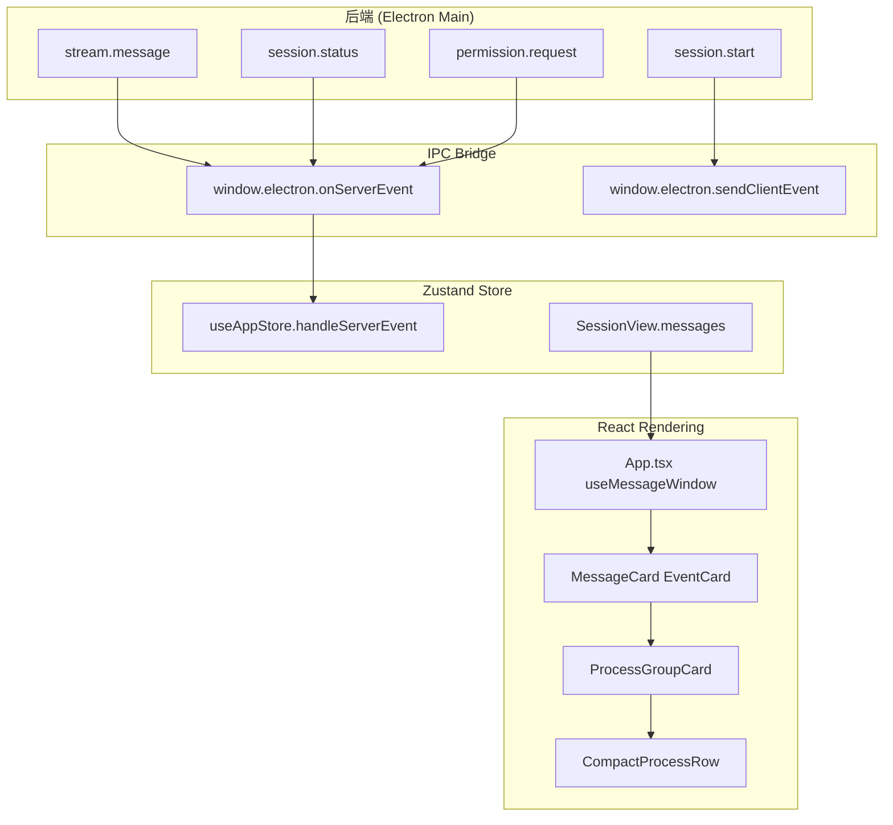
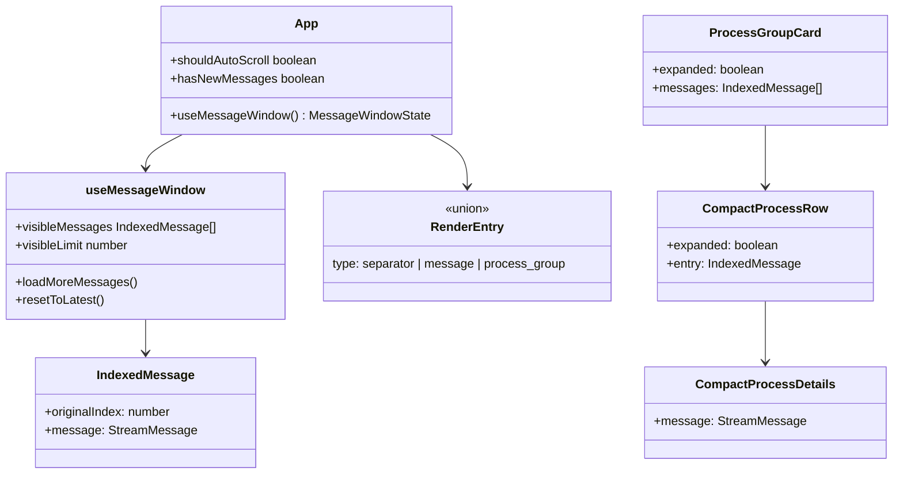

# 消息流组件 (CMP-004-MessageStream)

消息展示和流式渲染组件的设计与实现

---

<cite>

**本文引用的文件**

- [src/ui/App.tsx](file://src/ui/App.tsx#L1-L379)
- [src/ui/hooks/useIPC.ts](file://src/ui/hooks/useIPC.ts#L1-L32)
- [src/ui/hooks/useMessageWindow.ts](file://src/ui/hooks/useMessageWindow.ts#L1-L81)
- [src/ui/store/useAppStore.ts](file://src/ui/store/useAppStore.ts#L1-L1082)
- [src/ui/types.ts](file://src/ui/types.ts#L269-L364)
- [src/ui/components/Sidebar.tsx](file://src/ui/components/Sidebar.tsx#L1-L501)
- [src/ui/main.tsx](file://src/ui/main.tsx#L1-L19)
- [src/ui/dev-electron-shim.ts](file=src/ui/dev-electron-shim.ts#L1-L591)
- [src/ui/index.css](file://src/ui/index.css#L1-L269)
- [src/ui/App.css](file://src/ui/App.css#L1-L118)
- [doc/40-product/1.0.0/40-delivery/components/CMP-004-MessageStream.md](file=doc/40-product/1.0.0/40-delivery/components/CMP-004-MessageStream.md#L1-L43)
- [doc/40-product/1.0.0/40-delivery/components/CMP-001-SessionSidebar.md](file=doc/40-product/1.0.0/40-delivery/components/CMP-001-SessionSidebar.md#L1-L50)
- [doc/40-product/1.0.0/40-delivery/components/CMP-002-AgentPicker.md](file=doc/40-product/1.0.0/40-delivery/components/CMP-002-AgentPicker.md#L1-L46)
- [doc/40-product/1.0.0/40-delivery/components/CMP-003-ChatComposer.md](file=doc/40-product/1.0.0/40-delivery/components/CMP-003-ChatComposer.md#L1-L45)
- [doc/40-product/1.0.0/40-delivery/components/CMP-005-LiveTimelinePanel.md](file=doc/40-product/1.0.0/40-delivery/components/CMP-005-LiveTimelinePanel.md#L1-L45)
- [doc/40-product/1.0.0/40-delivery/components/CMP-006-ArtifactJumpPanel.md](file=doc/40-product/1.0.0/40-delivery/components/CMP-006-ArtifactJumpPanel.md#L1-L46)

</cite>

---

## 目录

- [功能职责与定位](#功能职责与定位)
- [数据结构与类型系统](#数据结构与类型系统)
- [消息内容解析机制](#消息内容解析机制)
- [渲染组件层次](#渲染组件层次)
- [流式输出处理逻辑](#流式输出处理逻辑)
- [消息类型与展示样式](#消息类型与展示样式)
- [后端事件交互](#后端事件交互)
- [组件使用示例](#组件使用示例)
- [代码证据地图](#代码证据地图)
- [Agent 改代码地图](#agent-改代码地图)

---

## 功能职责与定位

`CMP-004-MessageStream` 是聊天界面的核心渲染组件，负责承载三类职责：

1. **消息历史展示** — 从 `useAppStore` 的 `SessionView.messages[]` 中读取历史消息，按时序渲染
2. **执行状态反馈** — 展示进行中状态、流式输出、工具调用链
3. **滚动导航** — 支持定位到最新消息或历史消息分页加载



**章节来源**: [CMP-004-MessageStream.md Purpose 定义](file=doc/40-product/1.0.0/40-delivery/components/CMP-004-MessageStream.md#L21-L23)

### 关键组件入口

| 组件 | 文件位置 | 职责 |
|------|----------|------|
| `App` | `src/ui/App.tsx:326` | 主容器，管理消息渲染状态 |
| `useMessageWindow` | `src/ui/hooks/useMessageWindow.ts:23` | 虚拟滚动窗口，控制可见消息范围 |
| `ProcessGroupCard` | `src/ui/App.tsx:112` | 过程事件折叠卡片 |
| `CompactProcessRow` | `src/ui/App.tsx:161` | 单条过程事件行 |

---

## 数据结构与类型系统

### 核心类型定义

```typescript
// StreamMessage 是联合类型，来源 src/ui/types.ts:277
export type StreamMessage = (SDKMessage | UserPromptMessage | PromptLedgerMessage) & {
  capturedAt?: number;
  historyId?: string;
};

// 用户输入消息
export type UserPromptMessage = {
  type: "user_prompt";
  prompt: string;
  attachments?: PromptAttachment[];
  capturedAt?: number;
  historyId?: string;
};
```

**章节来源**: [types.ts StreamMessage 定义](file=src/ui/types.ts#L277-L280)

### SessionView 中的消息存储

```typescript
// src/ui/store/useAppStore.ts:32-56
export type SessionView = {
  id: string;
  title: string;
  status: SessionStatus;  // "idle" | "running" | "completed" | "error"
  messages: StreamMessage[];
  permissionRequests: PermissionRequest[];
  hasMoreHistory: boolean;
  historyCursor?: SessionHistoryCursor;
  // ...
};
```

消息存储在 `useAppStore.sessions[sessionId].messages` 中，状态为 `Map<sessionId, SessionView>`。

**章节来源**: [useAppStore SessionView 定义](file=src/ui/store/useAppStore.ts#L32-L56)

---

## 消息内容解析机制

### 内容项提取

`getMessageContentItems()` 函数从 `StreamMessage` 中提取 `content` 数组：

```typescript
// src/ui/App.tsx:54-59
function getMessageContentItems(message: StreamMessage): unknown[] {
  const envelope = message as { message?: unknown };
  if (!isRecord(envelope.message)) return [];
  const content = envelope.message.content;
  return Array.isArray(content) ? content : content ? [content] : [];
}
```

该函数处理消息的嵌套结构：`message.message.content`。对于 assistant 类型的消息，内容项包括 `text`、`tool_use`、`stop_reason` 等。

### 过程消息识别

```typescript
// src/ui/App.tsx:61-79
function isProcessMessage(message: StreamMessage): boolean {
  if (!isRecord(message)) return false;
  const contentItems = getMessageContentItems(message);
  if (contentItems.length === 0) return false;

  if (message.type === "assistant") {
    // assistant 消息中所有 content 项都是 tool_use（排除 AskUserQuestion）则判定为过程消息
    return contentItems.every((item) => (
      isRecord(item) &&
      item.type === "tool_use" &&
      item.name !== "AskUserQuestion"
    ));
  }

  if (message.type === "user") {
    // user 消息中所有 content 项都是 tool_result 则判定为过程消息
    return contentItems.every((item) => isRecord(item) && item.type === "tool_result");
  }

  return false;
}
```

### 过程组摘要生成

```typescript
// src/ui/App.tsx:81-110
function getProcessGroupSummary(groupMessages: Array<{ message: StreamMessage }>): string {
  let toolUseCount = 0;
  let toolResultCount = 0;
  const toolLabels = new Map<string, number>();

  for (const item of groupMessages) {
    for (const content of getMessageContentItems(item.message)) {
      if (!isRecord(content)) continue;
      if (content.type === "tool_use") {
        toolUseCount += 1;
        const name = typeof content.name === "string" ? content.name : "tool";
        toolLabels.set(name, (toolLabels.get(name) ?? 0) + 1);
      }
      if (content.type === "tool_result") {
        toolResultCount += 1;
      }
    }
  }

  const labelPreview = Array.from(toolLabels.entries())
    .slice(0, 4)  // 最多显示 4 种工具
    .map(([name, count]) => `${name} ${count}`)
    .join(" · ");
  // 输出格式: "3 个工具调用 · 2 条工具返回 · Read · Write · Bash"
}
```

**章节来源**: [App.tsx 消息解析函数](file=src/ui/App.tsx#L54-L110)

---

## 渲染组件层次

### 组件树结构



### 虚拟滚动窗口

`useMessageWindow` hook 实现懒加载窗口：

```typescript
// src/ui/hooks/useMessageWindow.ts:24-42
const INITIAL_VISIBLE_MESSAGE_LIMIT = 160;
const LOAD_MORE_MESSAGE_STEP = 120;

export function useMessageWindow(
  messages: StreamMessage[],
  options: {
    hasMoreHistory: boolean;      // 后端是否还有更多历史
    isLoadingHistory: boolean;    // 是否正在加载
    onLoadMore: () => void;        // 触发后端加载回调
  }
): MessageWindowState {
  const [visibleLimit, setVisibleLimit] = useState(INITIAL_VISIBLE_MESSAGE_LIMIT);
  const windowStart = Math.max(0, messages.length - visibleLimit);
  const hasMoreLocalHistory = windowStart > 0;
  const hasMoreHistory = hasMoreLocalHistory || hasPersistedHistory;

  // visibleMessages 包含 originalIndex 用于锚点定位
  const visibleMessages = useMemo(() => {
    return messages.slice(windowStart).map((message, offset) => ({
      originalIndex: windowStart + offset,
      message,
    }));
  }, [messages, windowStart]);

  // ...
}
```

**章节来源**: [useMessageWindow 实现](file=src/ui/hooks/useMessageWindow.ts#L24-L42)

---

## 流式输出处理逻辑

### 流式消息合并

当后端发送 `stream.message` 事件时，需要处理增量更新和去重：

```typescript
// src/ui/store/useAppStore.ts:256-286
function getMessageStableKey(message: StreamMessage): string {
  if (message.historyId) {
    return `history:${message.historyId}`;
  }
  if ("uuid" in message && typeof message.uuid === "string" && message.uuid.length > 0) {
    return `uuid:${message.uuid}`;
  }
  if (message.type === "user_prompt") {
    return `user:${message.capturedAt ?? "na"}:${message.prompt}`;
  }
  return `fallback:${message.type}:${message.capturedAt ?? "na"}:${JSON.stringify(message)}`;
}

function mergeMessages(olderMessages: StreamMessage[], newerMessages: StreamMessage[]): StreamMessage[] {
  const merged: StreamMessage[] = [];
  const seen = new Set<string>();
  for (const message of [...olderMessages, ...newerMessages]) {
    const key = getMessageStableKey(message);
    if (seen.has(key)) continue;
    seen.add(key);
    merged.push(message);
  }
  return merged;
}
```

### 消息修剪与历史加载

渲染端维护最多 600 条消息，超出部分需要请求后端历史：

```typescript
// src/ui/store/useAppStore.ts:239-240
const MAX_RENDERER_HISTORY_MESSAGES = 600;
const STREAM_MESSAGE_BATCH_DELAY_MS = 32;

function trimMessagesToRecent(
  messages: StreamMessage[],
  fallbackCursor?: SessionHistoryCursor,
): {
  messages: StreamMessage[];
  trimmed: boolean;
  historyCursor?: SessionHistoryCursor;
} {
  if (messages.length <= MAX_RENDERER_HISTORY_MESSAGES) {
    return { messages, trimmed: false, historyCursor: fallbackCursor };
  }
  // 保留最新 600 条，返回用于加载更多历史的 cursor
  const trimmedMessages = messages.slice(-MAX_RENDERER_HISTORY_MESSAGES);
  return {
    messages: trimmedMessages,
    trimmed: true,
    historyCursor: getMessageCursor(trimmedMessages[0]) ?? fallbackCursor,
  };
}
```

**章节来源**: [useAppStore 消息管理](file=src/ui/store/useAppStore.ts#L239-L369)

---

## 消息类型与展示样式

### 消息类型判定

| `message.type` | 含义 | 渲染特征 |
|----------------|------|----------|
| `user_prompt` | 用户输入 | 右侧气泡，带附件图标 |
| `assistant` | AI 回复 | 左侧气泡，支持 Markdown |
| `system` | 系统消息 | 居中灰色文字 |
| `stream_event` | 流式事件 | 不持久化（瞬态） |

### 内容项类型

```typescript
// assistant 消息的 content 项类型
type ContentItem =
  | { type: "text"; text: string }
  | { type: "tool_use"; id: string; name: string; input: unknown }
  | { type: "tool_result"; tool_use_id: string; content: unknown }
  | { type: "stop_reason"; reason: string };
```

### 展示样式分类

**1. 普通消息卡片** — `MessageCard` / `EventCard` 组件渲染

**2. 过程折叠卡片** — `ProcessGroupCard` 展示连续工具调用

```tsx
// src/ui/App.tsx:112-158 简化示例
function ProcessGroupCard({ messages, isLast, isRunning, permissionRequest, onPermissionResult }) {
  const [expanded, setExpanded] = useState(false);
  const summary = useMemo(() => getProcessGroupSummary(messages), [messages]);

  return (
    <div className="my-0.5">
      <button onClick={() => setExpanded((v) => !v)}>
        <span>过程</span>
        <span>{messages.length} 条 · {summary}</span>  {/* 如 "3 个工具调用 · Read · Bash" */}
      </button>
      {expanded && (
        <div className="ml-3 border-l border-black/5 pl-2">
          {messages.map((entry) => (
            <CompactProcessRow key={`${entry.originalIndex}-${index}`} entry={entry} />
          ))}
        </div>
      )}
    </div>
  );
}
```

**3. 过程详情展开** — `CompactProcessDetails` 展示 JSON 格式的工具输入输出

```tsx
// src/ui/App.tsx:199-210
function CompactProcessDetails({ message }) {
  const detail = getProcessEntryDetail(message);
  return (
    <pre className="ml-4 mb-1 max-h-64 overflow-auto rounded-lg border border-black/5 bg-black/[0.025] px-2.5 py-2 text-[11px]">
      {detail}
    </pre>
  );
}
```

**4. 用户提示消息** — 带有附件时显示附件预览

**章节来源**: [App.tsx ProcessGroupCard](file=src/ui/App.tsx#L112-L158)

---

## 后端事件交互

### IPC 通道定义

前端通过 `useIPC` hook 订阅后端事件：

```typescript
// src/ui/hooks/useIPC.ts:4-31
export function useIPC(onEvent: (event: ServerEvent) => void) {
  const [connected, setConnected] = useState(false);
  const unsubscribeRef = useRef<(() => void) | null>(null);

  useEffect(() => {
    const unsubscribe = window.electron.onServerEvent((event: ServerEvent) => {
      onEvent(event);
    });
    unsubscribeRef.current = unsubscribe;
    setConnected(true);

    return () => {
      if (unsubscribeRef.current) {
        unsubscribeRef.current();
        unsubscribeRef.current = null;
      }
      setConnected(false);
    };
  }, [onEvent]);

  const sendEvent = useCallback((event: ClientEvent) => {
    window.electron.sendClientEvent(event);
  }, []);

  return { connected, sendEvent };
}
```

### ServerEvent 类型

```typescript
// src/ui/types.ts:327-363
export type ServerEvent =
  | { type: "stream.message"; payload: { sessionId: string; message: StreamMessage } }
  | { type: "stream.user_prompt"; payload: { sessionId: string; prompt: string; attachments?: PromptAttachment[]; capturedAt?: number; historyId?: string } }
  | { type: "session.status"; payload: { sessionId: string; status: SessionStatus; title?: string; cwd?: string; model?: string; error?: string; slashCommands?: string[] } }
  | { type: "session.history"; payload: { sessionId: string; status: SessionStatus; messages: StreamMessage[]; mode: "replace" | "prepend"; hasMore: boolean; nextCursor?: SessionHistoryCursor } }
  | { type: "permission.request"; payload: { sessionId: string; toolUseId: string; toolName: string; input: unknown } }
  | { type: "runner.error"; payload: { sessionId?: string; message: string } };
```

### 后端事件处理

`useAppStore.handleServerEvent` 根据事件类型更新 store：

```typescript
// src/ui/store/useAppStore.ts:167
handleServerEvent: (event: ServerEvent) => void;
```

关键处理逻辑：
- `stream.message` → 追加到 `sessions[sessionId].messages`
- `session.history` → `mode: "replace"` 替换或 `mode: "prepend"` 插入历史
- `session.status` → 更新会话状态（用于 Sidebar 状态徽章）

**章节来源**: [types.ts ServerEvent 定义](file=src/ui/types.ts#L327-L363)

---

## 组件使用示例

### 在 App.tsx 中集成消息流

```tsx
// src/ui/App.tsx:326-341 简化示例
function App() {
  const messagesEndRef = useRef<HTMLDivElement>(null);
  const [shouldAutoScroll, setShouldAutoScroll] = useState(true);
  const [hasNewMessages, setHasNewMessages] = useState(false);

  // 1. 从 store 获取当前会话消息
  const activeSessionId = useAppStore((state) => state.activeSessionId);
  const messages = useAppStore((state) =>
    state.sessions[activeSessionId]?.messages ?? []
  );
  const hasMoreHistory = useAppStore((state) =>
    state.sessions[activeSessionId]?.hasMoreHistory ?? false
  );

  // 2. 使用虚拟滚动 hook
  const {
    visibleMessages,
    hasMoreHistory: hasMoreLocalHistory,
    isLoadingHistory,
    loadMoreMessages,
    resetToLatest,
    totalUserInputs,
    visibleUserInputs,
  } = useMessageWindow(messages, {
    hasMoreHistory,
    isLoadingHistory: false,
    onLoadMore: () => {
      // 触发后端加载 session.history
    },
  });

  // 3. 渲染消息列表
  return (
    <div ref={scrollContainerRef}>
      {visibleMessages.map((item) => (
        <MessageCard key={item.originalIndex} message={item.message} />
      ))}
      <div ref={messagesEndRef} />
    </div>
  );
}
```

### 分页加载更多消息

```tsx
// 滚动到顶部触发加载
function handleScrollTop() {
  loadMoreMessages(); // 调用后端加载历史
}

// 快速回到最新
function scrollToLatest() {
  resetToLatest();
  messagesEndRef.current?.scrollIntoView({ behavior: "smooth" });
}
```

**章节来源**: [App.tsx 消息流集成](file=src/ui/App.tsx#L326-L341)

---

## 代码证据地图

| 符号名 | 文件位置 | 用途 |
|--------|----------|------|
| `StreamMessage` | `src/ui/types.ts:277` | 消息联合类型 |
| `UserPromptMessage` | `src/ui/types.ts:269` | 用户输入类型 |
| `ServerEvent` | `src/ui/types.ts:327` | 后端→前端事件 |
| `ClientEvent` | `src/ui/types.ts:366` | 前端→后端事件 |
| `useMessageWindow` | `src/ui/hooks/useMessageWindow.ts:23` | 虚拟滚动 hook |
| `IndexedMessage` | `src/ui/hooks/useMessageWindow.ts:7` | 带索引的消息项 |
| `MessageWindowState` | `src/ui/hooks/useMessageWindow.ts:12` | 窗口状态接口 |
| `useIPC` | `src/ui/hooks/useIPC.ts:3` | IPC 订阅 hook |
| `SessionView` | `src/ui/store/useAppStore.ts:32` | 会话视图类型 |
| `getMessageStableKey` | `src/ui/store/useAppStore.ts:256` | 消息去重键 |
| `mergeMessages` | `src/ui/store/useAppStore.ts:272` | 消息合并函数 |
| `trimMessagesToRecent` | `src/ui/store/useAppStore.ts:351` | 消息修剪 |
| `MAX_RENDERER_HISTORY_MESSAGES` | `src/ui/store/useAppStore.ts:239` | 客户端消息上限 |
| `getMessageContentItems` | `src/ui/App.tsx:54` | 内容项提取 |
| `isProcessMessage` | `src/ui/App.tsx:61` | 过程消息识别 |
| `getProcessGroupSummary` | `src/ui/App.tsx:81` | 过程组摘要 |
| `ProcessGroupCard` | `src/ui/App.tsx:112` | 过程折叠卡片 |
| `CompactProcessRow` | `src/ui/App.tsx:161` | 过程行组件 |
| `CompactProcessDetails` | `src/ui/App.tsx:199` | 过程详情组件 |
| `getProcessEntryDetail` | `src/ui/App.tsx:220` | 过程详情格式化 |

---

## Agent 改代码地图

### 先读文件

1. **类型定义**: `src/ui/types.ts` — 理解 `StreamMessage`、事件类型
2. **Store 逻辑**: `src/ui/store/useAppStore.ts` — 理解消息存储、合并、修剪逻辑
3. **渲染层**: `src/ui/App.tsx` — 理解消息列表渲染、过程折叠
4. **Hook**: `src/ui/hooks/useMessageWindow.ts` — 理解虚拟滚动

### 关键符号速查

| 符号 | 行号 | 用途 |
|------|------|------|
| `INITIAL_VISIBLE_MESSAGE_LIMIT` | `useMessageWindow.ts:4` | 初始可见消息数 160 |
| `LOAD_MORE_MESSAGE_STEP` | `useMessageWindow.ts:5` | 每次加载 120 条 |
| `MAX_RENDERER_HISTORY_MESSAGES` | `useAppStore.ts:239` | 客户端上限 600 |
| `STREAM_MESSAGE_BATCH_DELAY_MS` | `useAppStore.ts:240` | 流式批处理延迟 32ms |

### 修改入口

**1. 新增消息类型展示**
- 文件: `src/ui/App.tsx`
- 找到 `isProcessMessage` 函数（约 61 行）
- 添加新的消息类型判定逻辑

**2. 修改虚拟滚动窗口**
- 文件: `src/ui/hooks/useMessageWindow.ts`
- 调整 `INITIAL_VISIBLE_MESSAGE_LIMIT` 或 `LOAD_MORE_MESSAGE_STEP`

**3. 修改消息合并策略**
- 文件: `src/ui/store/useAppStore.ts`
- 找到 `getMessageStableKey`（256 行）和 `mergeMessages`（272 行）

### 验证命令

```bash
# 类型检查
npx tsc --noEmit src/ui/types.ts src/ui/store/useAppStore.ts

# 组件渲染测试
npm run dev

# 端到端消息流测试
# 1. 启动 Electron 开发后端
# 2. 发送 session.start 事件
# 3. 观察消息是否正确追加到列表
```

### 常见回归风险

| 风险场景 | 预防措施 |
|----------|----------|
| 消息重复渲染 | 检查 `getMessageStableKey` 去重逻辑 |
| 历史消息丢失 | 验证 `trimMessagesToRecent` 和 `historyCursor` |
| 过程折叠状态丢失 | 检查 React key 使用 `originalIndex` |
| 流式消息顺序错乱 | 验证 `mergeMessages` 合并顺序 |

---

## 可观测性

| 事件名 | 触发时机 | 用途 |
|--------|----------|------|
| `message_stream_scrolled` | 用户滚动消息流 | 监控滚动行为 |
| `sidebar_session_opened` | 从 Sidebar 打开会话 | 分析会话切换 |
| `session_selected_from_sidebar` | 点击切换会话 | 分析会话使用模式 |

**章节来源**: [CMP-004-MessageStream Observability](file=doc/40-product/1.0.0/40-delivery/components/CMP-004-MessageStream.md#L41-L42)
</markdown>