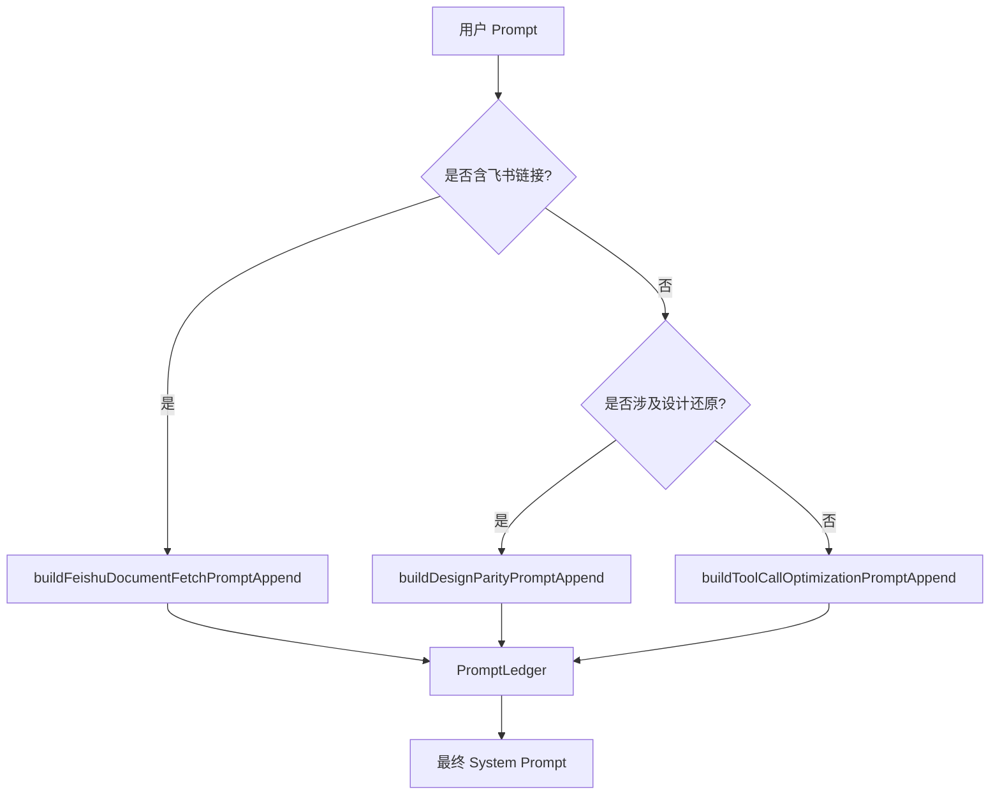
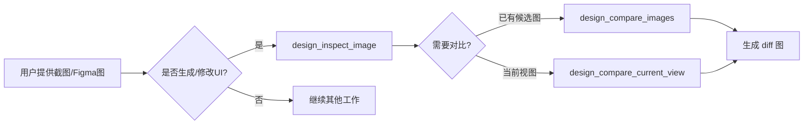
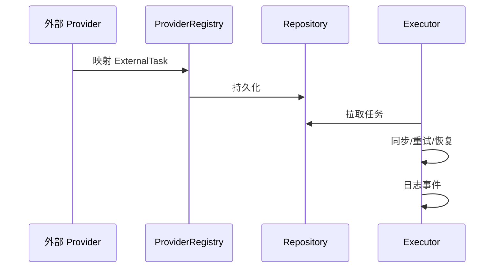
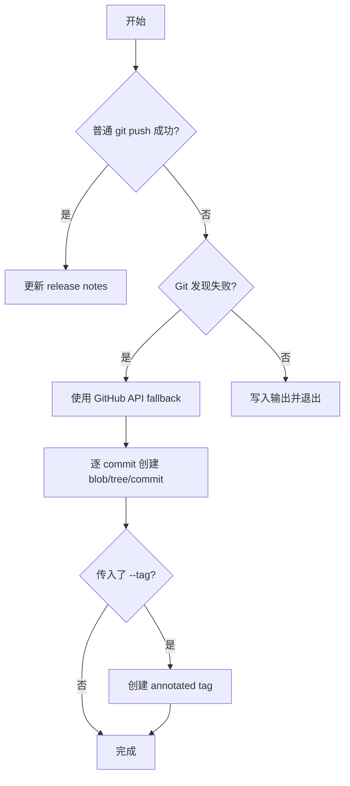

# 前端开发指南

<cite>
**本文引用的文件**

- [skills/tech-cc-hub-release-deploy/scripts/publish-release.mjs](file://skills/tech-cc-hub-release-deploy/scripts/publish-release.mjs)
- [scripts/github-release.mjs](file://scripts/github-release.mjs)
- [src/electron/libs/system-prompt-presets.ts](file://src/electron/libs/system-prompt-presets.ts)
- [skills/tech-cc-hub-release-deploy/SKILL.md](file://skills/tech-cc-hub-release-deploy/SKILL.md)
- [skills/tech-cc-hub-release-deploy/agents/openai.yaml](file://skills/tech-cc-hub-release-deploy/agents/openai.yaml)
- [pro-workflow/skills/wiki-research-loop/scripts/research-loop.js](file://pro-workflow/skills/wiki-research-loop/scripts/research-loop.js)
- [src/electron/libs/git/README.md](file://src/electron/libs/git/README.md)
- [src/electron/libs/mcp-tools/README.md](file://src/electron/libs/mcp-tools/README.md)
- [src/electron/libs/task/README.md](file://src/electron/libs/task/README.md)
</cite>

# 前端开发指南

本文档面向在 `tech-cc-hub` 项目中从事前端/UI 开发的工程师，包括 Electron Renderer 进程、Web 前端模块和内置工具系统的开发规范。

---

## 目录

- [技术栈概览](#技术栈概览)
- [项目结构与模块边界](#项目结构与模块边界)
- [System Prompt 预设体系](#system-prompt-预设体系)
- [MCP 内置工具模块](#mcp-内置工具模块)
- [Git 工作台模块](#git-工作台模块)
- [Task 任务编排模块](#task-任务编排模块)
- [发布与部署工作流](#发布与部署工作流)
- [配置与运行时](#配置与运行时)
- [排障与调试](#排障与调试)

---

## 技术栈概览

tech-cc-hub 是一个基于 Electron 的桌面应用，前端技术栈如下：

| 层次 | 技术 | 说明 |
|------|------|------|
| UI 框架 | React 18 | 渲染层 |
| 语言 | TypeScript 5.x | 类型安全 |
| 桌面容器 | Electron 30+ | 主进程 + Renderer 分离 |
| 状态管理 | PromptLedger / 内置 store | 会话级状态 |
| 内置工具 | MCP (Model Context Protocol) | Agent 工具面 |
| 构建 | Vite + electron-builder | 打包分发 |

[章节来源](file://src/electron/libs/system-prompt-presets.ts#L1-L6)

---

## 项目结构与模块边界

前端代码主要分布在 `src/` 下，Electron 相关代码集中在 `src/electron/`：

```
src/
├── electron/
│   ├── libs/              # 主进程业务模块（不可直接被 Renderer 调用）
│   │   ├── git/           # Git 工作台
│   │   ├── mcp-tools/     # MCP 内置工具集
│   │   ├── task/          # Task 编排系统
│   │   └── system-prompt-presets.ts  # System Prompt 生成
│   └── main.ts            # Electron 主进程入口
├── shared/                # 跨进程共享类型
└── renderer/              # React 前端（如果存在）
```

**关键原则**：Renderer 不能直接执行 git 或访问文件系统，必须通过 IPC 调用主进程 `libs` 模块。

[章节来源](file://src/electron/libs/git/README.md#L3-L14)

---

## System Prompt 预设体系

### 架构设计

`system-prompt-presets.ts` 是 System Prompt 的生成工厂，每个 `build*PromptAppend` 函数返回一段规则文本，用于指导 AI 行为。



[图表来源](file://src/electron/libs/system-prompt-presets.ts#L12-L134)

### 预设函数清单

| 函数名 | 用途 | 触发场景 |
|--------|------|----------|
| `buildBrowserWorkbenchPromptAppend` | 浏览器工作台规则 | 涉及 BrowserView 操作 |
| `buildAdminConfigPromptAppend` | 配置治理规则 | 写入 `agent-runtime.json` |
| `buildToolCallOptimizationPromptAppend` | 工具调用节流 | 通用 AI 行为优化 |
| `buildFeishuDocumentFetchPromptAppend` | 飞书文档直读 | 输入含 feishu.cn 链接 |
| `buildDesignParityPromptAppend` | 设计还原规则 | 涉及 UI/Figma/截图 |
| `buildBuiltinMcpRegistryPromptAppend` | 内置 MCP 提示 | 注册表工具提示 |

[章节来源](file://src/electron/libs/system-prompt-presets.ts#L12-L175)

### 飞书文档直读

当 Prompt 包含飞书链接时，函数会检测环境变量 `LARK_CLI_COMMAND` 和 `LARK_CLI_PROFILE`，生成 lark-cli 调用命令：

```typescript
// 提取飞书链接
const urls = extractFeishuDocumentUrls(prompt);  // [file://src/electron/libs/system-prompt-presets.ts#L45-L51]

// 依赖 lark-cli 环境
const hasLarkCliCommand = Boolean(runtimeEnv.LARK_CLI_COMMAND?.trim());
const hasLarkCliProfile = Boolean(runtimeEnv.LARK_CLI_PROFILE?.trim());
```

若环境变量缺失，返回 `undefined`，不会生成任何提示。

[章节来源](file://src/electron/libs/system-prompt-presets.ts#L53-L78)

---

## MCP 内置工具模块

`src/electron/libs/mcp-tools/` 是集中存放内置 MCP 工具的目录，避免 `libs` 根目录膨胀。

### 工具分类

| 工具文件 | 能力范围 |
|----------|----------|
| `browser.ts` | 导航、截图摘要、DOM 查询、样式检查、标注模式 |
| `design.ts` | 截图语义分析、对比、diff 图、热点区域、JSON report |
| `figma-rest.ts` | Figma 只读 API：文件/节点读取、设计树、token 提取 |
| `admin.ts` | 写入 `agent-runtime.json` 的 `env`、`skillCredentials` |

[章节来源](file://src/electron/libs/mcp-tools/README.md#L3-L14)

### 设计工具默认触发规则



触发条件：

- 用户给出截图、Figma 图、页面参考图，要求生成或修改 UI/前端代码
- 用户反馈页面和参考图不一致

[章节来源](file://src/electron/libs/mcp-tools/README.md#L16-L22)

### 设计工具参数

| 参数 | 用途 | 示例 |
|------|------|------|
| `ignoreRegions` | 忽略动态区域（时间戳/头像/动画） | `[{x:0,y:0,w:100,h:20}]` |
| `maxDifferenceRatio` | 验收阈值 | `0.05` 表示 5% 容差 |
| `ignoreAntialiasing` | 文字抗锯齿噪声过滤 | `true` |
| `diffColorMode` | 差异颜色模式 | `directional` 区分变亮/变暗 |

[章节来源](file://src/electron/libs/system-prompt-presets.ts#L128-L132)

### admin 工具写入规则

`admin.ts` 用于持久化 `agent-runtime.json`，写入字段受 allowlist 限制：

- `env`
- `skillCredentials`
- `closeSidebarOnBrowserOpen`

写入时**不返回密钥明文**，仅按字段名统计变化。

[章节来源](file://src/electron/libs/system-prompt-presets.ts#L21-L25)

---

## Git 工作台模块

`src/electron/libs/git/` 是 Electron 主进程中的 Git 操作模块。

### 模块边界

```
git/
├── types.ts        # 领域类型和 IPC payload/result
├── errors.ts       # Git 错误归一化
├── service.ts      # 唯一 Git 操作入口
├── history.ts      # commit history parser
├── graph.ts       # lightweight graph lane 生成
├── operation-log.ts  # 本地高影响操作日志
├── ipc.ts         # Electron IPC handler 注册
└── index.ts       # 对外统一出口
```

[章节来源](file://src/electron/libs/git/README.md#L5-L14)

### 第一版允许/禁止操作

| 允许操作 | 禁止操作（第一版） |
|----------|-------------------|
| status / diff | reset |
| stage / unstage | rebase |
| commit | cherry-pick |
| ordinary push | force push |
| create / checkout branch | amend |
| stash save / apply / drop | squash |
| recent history / lightweight graph | interactive rebase |

[章节来源](file://src/electron/libs/git/README.md#L16-L33)

### IPC 调用约定

Renderer 必须通过 IPC 调用，不直接执行 git 命令。典型调用链：

1. Renderer 调用 `ipcRenderer.invoke("git:status")`
2. `ipc.ts` 注册的 handler 接收
3. `service.ts` 执行 git 操作
4. 结果通过 IPC 返回 Renderer

---

## Task 任务编排模块

`src/electron/libs/task/` 是任务系统的核心模块。

### 模块边界

```
task/
├── types.ts              # 任务、IPC payload 领域类型
├── provider-registry.ts  # Provider 注册表和 fallback
├── providers/            # 外部任务源适配器（如 Lark）
├── repository.ts        # SQLite schema、持久化
├── workflow.ts          # Symphony-style workflow 配置
├── workspace.ts         # 任务 workspace 创建
├── executor.ts          # 编排器：同步/自动执行/重试/恢复
└── index.ts             # 对外统一出口
```

[章节来源](file://src/electron/libs/task/README.md#L5-L14)

### 运行原则



- **Provider**：只负责映射第三方任务，不直接改 UI 或会话
- **Repository**：只做持久化，不启动 runner
- **Executor**：唯一调度入口，所有自动/手动执行都经过这里
- **Workspace**：每个任务使用独立 workspace，避免互相污染

[章节来源](file://src/electron/libs/task/README.md#L16-L22)

---

## 发布与部署工作流

### 发布脚本体系

| 脚本 | 位置 | 用途 |
|------|------|------|
| `publish-release.mjs` | `skills/tech-cc-hub-release-deploy/scripts/` | 主发布脚本，含 API fallback |
| `github-release.mjs` | `scripts/` | GitHub Release 自动化 |

[章节来源](file://skills/tech-cc-hub-release-deploy/scripts/publish-release.mjs#L1-L387)

### publish-release.mjs 核心逻辑



**API fallback 触发条件**（Windows 常见）：

```
fatal: not a git repository (or any of the parent directories): .git
```

[章节来源](file://skills/tech-cc-hub-release-deploy/SKILL.md#L50-L56)

### 发布命令速查

```powershell
# 普通发布当前 HEAD
node skills/tech-cc-hub-release-deploy/scripts/publish-release.mjs

# 发布并移动 release tag（Windows git push 抽风时）
node skills/tech-cc-hub-release-deploy/scripts/publish-release.mjs --tag v0.1.13 --retag --delete-release

# 只更新 release notes
node skills/tech-cc-hub-release-deploy/scripts/publish-release.mjs --tag v0.1.13 --notes .tmp/release-notes.md --notes-only

# 强制使用 API fallback（已知 push 会失败时）
node skills/tech-cc-hub-release-deploy/scripts/publish-release.mjs --api-only
```

[章节来源](file://skills/tech-cc-hub-release-deploy/SKILL.md#L31-L49)

### publish-release.mjs 参数说明

| 参数 | 含义 | 示例 |
|------|------|------|
| `--tag` | 要创建/移动的 tag | `--tag v0.1.13` |
| `--notes` | release notes 文件路径 | `--notes .tmp/notes.md` |
| `--notes-only` | 仅更新现有 release 的 notes | flag |
| `--retag` | 强制移动已有 tag | flag |
| `--delete-release` | 删除同名 GitHub Release 后重建 | flag |
| `--api-only` | 跳过普通 git push，直接用 API | flag |

Token 获取优先级：`GH_TOKEN` > `GITHUB_TOKEN` > `git credential fill`

[章节来源](file://skills/tech-cc-hub-release-deploy/scripts/publish-release.mjs#L22-L28)

### github-release.mjs 自动化

版本升级 + 创建 GitHub Release：

```powershell
# patch/minor/major 模式
node scripts/github-release.mjs patch

# 指定版本
node scripts/github-release.mjs 0.2.0

# 干跑（不实际执行）
node scripts/github-release.mjs patch --dry-run

# 不推送（本地测试）
node scripts/github-release.mjs patch --no-push

# 不创建 GitHub Release（仅打 tag）
node scripts/github-release.mjs patch --no-release
```

[章节来源](file://scripts/github-release.mjs#L37-L44)

### 发布后验证

```powershell
# 检查本地 SHA 与远端一致
git rev-parse HEAD
git rev-parse origin/main
git ls-remote --heads origin main

# 三者应指向同一 commit
```

[章节来源](file://skills/tech-cc-hub-release-deploy/SKILL.md#L73-L80)

---

## 配置与运行时

### agent-runtime.json 配置

`agent-runtime.json` 是全局运行时配置，主要字段：

```typescript
{
  "env": {},           // 环境变量覆盖
  "skillCredentials": {},  // Skill 凭证
  "closeSidebarOnBrowserOpen": boolean  // 浏览器打开时是否关闭侧边栏
}
```

写入途径：`mcp__tech-cc-hub-admin__set_global_runtime_config`

[章节来源](file://src/electron/libs/system-prompt-presets.ts#L21-L25)

### LARK CLI 配置（飞书文档直读）

```typescript
// 必需环境变量
LARK_CLI_COMMAND   // lark-cli 命令路径
LARK_CLI_PROFILE   // lark-cli profile 名称
```

使用时：`lark-cli docs +fetch --doc "<url>" --format pretty`

[章节来源](file://src/electron/libs/system-prompt-presets.ts#L68-L70)

---

## 排障与调试

### 常见问题

**Q1: git push 报 `.git` 发现失败**

```powershell
# 直接使用 API fallback
node skills/tech-cc-hub-release-deploy/scripts/publish-release.mjs --api-only
```

不要反复重试裸 `git push`，直接使用 API fallback。

**Q2: release notes 为空或过旧**

```powershell
node skills/tech-cc-hub-release-deploy/scripts/publish-release.mjs --tag v0.1.13 --notes .tmp/notes.md --notes-only
```

**Q3: 飞书文档直读不生效**

检查环境变量：

```powershell
echo $env:LARK_CLI_COMMAND
echo $env:LARK_CLI_PROFILE
```

两者都必须非空才能触发直读。

**Q4: API fallback 后 SHA 不一致**

```powershell
git rev-parse HEAD
git rev-parse origin/main
git ls-remote --heads origin main
```

三者应一致。若 SHA 不同，说明本地与远端不同步，先 fetch/rebase 再重试。

[章节来源](file://skills/tech-cc-hub-release-deploy/SKILL.md#L73-L81)

### 设计工具排障

| 问题 | 解决方案 |
|------|----------|
| 对比结果不准 | 设置 `ignoreRegions` 忽略动态区域 |
| 验收不通过 | 调高 `maxDifferenceRatio` |
| 文字差异过大 | 开启 `ignoreAntialiasing: true` |
| 需要区分变亮/变暗 | 使用 `diffColorMode: directional` |

[章节来源](file://src/electron/libs/system-prompt-presets.ts#L128-L132)

---

## 相关资源

- [Git 模块详细文档](file://src/electron/libs/git/README.md)
- [MCP 工具详细文档](file://src/electron/libs/mcp-tools/README.md)
- [Task 模块详细文档](file://src/electron/libs/task/README.md)
- [发布部署 Skill](file://skills/tech-cc-hub-release-deploy/SKILL.md)