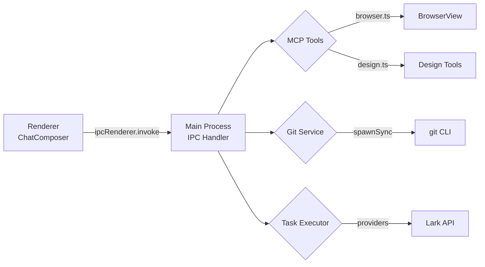
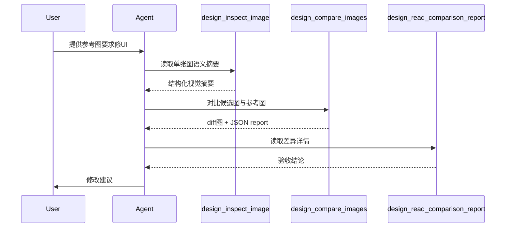
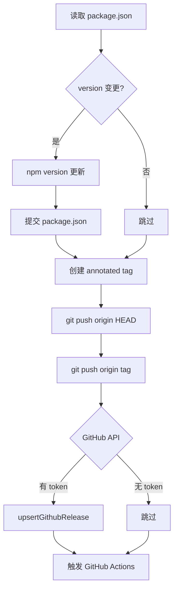
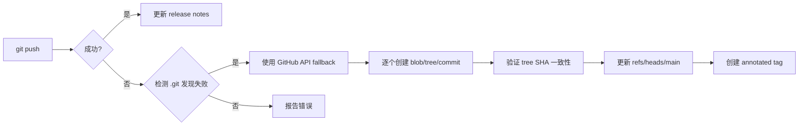

# 后端开发指南

<cite>
**本文引用的文件**
- [skills/tech-cc-hub-release-deploy/scripts/publish-release.mjs](file://skills/tech-cc-hub-release-deploy/scripts/publish-release.mjs)
- [scripts/github-release.mjs](file://scripts/github-release.mjs)
- [src/electron/libs/system-prompt-presets.ts](file://src/electron/libs/system-prompt-presets.ts)
- [skills/tech-cc-hub-release-deploy/SKILL.md](file://skills/tech-cc-hub-release-deploy/SKILL.md)
- [skills/tech-cc-hub-release-deploy/agents/openai.yaml](file://skills/tech-cc-hub-release-deploy/agents/openai.yaml)
- [pro-workflow/skills/wiki-research-loop/scripts/research-loop.js](file://pro-workflow/skills/wiki-research-loop/scripts/research-loop.js)
- [src/electron/libs/git/README.md](file://src/electron/libs/git/README.md)
- [src/electron/libs/mcp-tools/README.md](file://src/electron/libs/mcp-tools/README.md)
- [src/electron/libs/task/README.md](file://src/electron/libs/task/README.md)
</cite>

## 目录

- [模块概览与职责边界](#模块概览与职责边界)
- [Electron 主进程架构](#electron-主进程架构)
- [System Prompt 构建框架](#system-prompt-构建框架)
- [MCP 工具系统](#mcp-工具系统)
- [任务编排系统](#任务编排系统)
- [Git 操作层](#git-操作层)
- [发布与部署流程](#发布与部署流程)
- [关键数据结构](#关键数据结构)
- [扩展点与最佳实践](#扩展点与最佳实践)
- [排障手册](#排障手册)

---

## 模块概览与职责边界

`tech-cc-hub` 后端由 Electron 主进程主导，包含四大核心模块：

| 模块 | 职责 | 入口文件 |
|------|------|----------|
| MCP 工具 | 暴露给 Agent 的内置工具面 | `src/electron/libs/mcp-tools/index.ts` |
| Git 工作台 | 版本控制能力封装 | `src/electron/libs/git/index.ts` |
| 任务编排 | 外部任务源适配与执行 | `src/electron/libs/task/index.ts` |
| System Prompt | 对话上下文构建 | `src/electron/libs/system-prompt-presets.ts` |

Renderer 进程不能直接执行 git 或访问文件系统，必须通过 IPC 调用主进程模块。这是 Electron 安全模型的基本约束。

---

## Electron 主进程架构

### IPC 通信模式

主进程通过 Electron IPC 注册 Handler，Renderer 通过 `ipcRenderer.invoke` 调用。所有 Git、任务、MCP 工具操作均走此路径。



### 模块目录结构

```
src/electron/libs/
├── mcp-tools/           # MCP 工具集
│   ├── browser.ts       # 浏览器工作台
│   ├── design.ts        # 设计还原
│   ├── figma-rest.ts    # Figma API
│   └── admin.ts         # 配置管理
├── git/                 # Git 工作台
│   ├── service.ts       # 唯一入口
│   ├── ipc.ts           # IPC handler
│   ├── types.ts         # 领域类型
│   └── errors.ts        # 错误归一化
├── task/                # 任务编排
│   ├── executor.ts      # 调度器
│   ├── repository.ts    # 持久化
│   └── providers/       # 外部适配器
└── system-prompt-presets.ts  # Prompt 构建
```

**章节来源**: [src/electron/libs/git/README.md#L7-L14](file://src/electron/libs/git/README.md#L7-L14), [src/electron/libs/mcp-tools/README.md#L1-L5](file://src/electron/libs/mcp-tools/README.md#L1-L5), [src/electron/libs/task/README.md#L1-L14](file://src/electron/libs/task/README.md#L1-L14)

---

## System Prompt 构建框架

### 预设架构

`system-prompt-presets.ts` 采用工厂函数模式，输出独立的 Prompt 片段供上层组合：

| 函数 | 用途 |
|------|------|
| `buildBrowserWorkbenchPromptAppend()` | 浏览器操作规则 |
| `buildAdminConfigPromptAppend()` | 配置治理规则 |
| `buildToolCallOptimizationPromptAppend()` | 工具调用优化策略 |
| `buildFeishuDocumentFetchPromptAppend()` | 飞书文档直读 |
| `buildDesignParityPromptAppend()` | 设计还原工作流 |
| `buildBuiltinMcpRegistryPromptAppend()` | 内置 MCP 清单 |
| `buildTechCCHubSystemPromptSources()` | 统一导出接口 |

### 飞书文档直读流程

当用户输入包含飞书链接时，Prompt 注入 lark-cli 调用指令：

```typescript
// 入口：extractFeishuDocumentUrls 从文本提取链接
// 条件：必须设置 LARK_CLI_COMMAND 和 LARK_CLI_PROFILE
// 输出：bash 命令序列，Agent 直接执行读取 Markdown
```

**章节来源**: [src/electron/libs/system-prompt-presets.ts#L45-L79](file://src/electron/libs/system-prompt-presets.ts#L45-L79)

### Prompt 扩展机制

`buildGlobalRuntimeSystemPromptExtAppend` 支持从 `agent-runtime.json` 读取 `systemPromptExt` 字段，类型可为字符串或字符串数组。Agent 可在运行时注入动态指令。

**章节来源**: [src/electron/libs/system-prompt-presets.ts#L81-L91](file://src/electron/libs/system-prompt-presets.ts#L81-L91)

---

## MCP 工具系统

### 工具分类

| 工具包 | 场景触发 |
|--------|----------|
| `browser.ts` | 页面浏览、截图、DOM 查询、样式检查 |
| `design.ts` | 用户提供参考图、Figma 图、要求修 UI |
| `figma-rest.ts` | Figma 设计文件读取 |
| `admin.ts` | 写入 `agent-runtime.json` 全局配置 |

### 设计工具使用流程



### 工具使用约束

- 涉及写入磁盘或配置的工具必须有字段 allowlist 和体积上限
- 工具返回给模型的内容应为摘要、路径和结构化 JSON，避免塞入大图或密钥明文
- 动态区域（时间戳、头像、动画）使用 `ignoreRegions` 参数

**章节来源**: [src/electron/libs/mcp-tools/README.md#L10-L22](file://src/electron/libs/mcp-tools/README.md#L10-L22)

---

## 任务编排系统

### 架构原则

```
外部 Provider → ExternalTask 映射 → Executor 调度 → 独立 Workspace 执行
```

- **Provider** 只负责第三方任务映射成 `ExternalTask`，不直接改 UI 或会话
- **Repository** 只做持久化，不启动 runner
- **Executor** 是唯一调度入口，所有自动/手动执行都经过这里
- 任务执行使用独立 workspace，避免多个任务互相污染

### 核心组件

| 文件 | 职责 |
|------|------|
| `types.ts` | 任务、执行记录、IPC payload 的领域类型 |
| `provider-registry.ts` | Provider 注册表和 fallback provider |
| `repository.ts` | SQLite schema、任务状态、执行记录持久化 |
| `executor.ts` | 编排器：同步、自动执行、并发控制、重试、恢复 |
| `workspace.ts` | 独立 workspace 创建和路径安全 |

**章节来源**: [src/electron/libs/task/README.md#L1-L22](file://src/electron/libs/task/README.md#L1-L22)

---

## Git 操作层

### 边界定义

**第一版允许的操作：**

- status / diff
- stage / unstage
- commit
- ordinary push
- create / checkout branch
- stash save / apply / drop
- recent history / lightweight graph

**第一版禁止的操作：**

- reset、rebase、cherry-pick、force push、amend、squash、interactive rebase

这些限制是为了保证 Git 工作台的可预测性和安全性。

### IPC 调用模式

Renderer 通过 `ipcRenderer.invoke('git:xxx', payload)` 调用，Handler 在 `ipc.ts` 注册。

**章节来源**: [src/electron/libs/git/README.md#L16-L34](file://src/electron/libs/git/README.md#L16-L34)

---

## 发布与部署流程

### 双脚本架构

```
github-release.mjs          → 版本管理、tag、release notes
      ↓
publish-release.mjs         → git push + GitHub API fallback
```

### github-release.mjs 工作流



**参数说明：**

| 参数 | 作用 |
|------|------|
| `patch\|minor\|major\|vX.Y.Z` | 版本号递增方式（位置参数） |
| `--dry-run` | 模拟运行，不实际修改 |
| `--no-push` | 本地创建 commit/tag，不推送 |
| `--allow-dirty` | 允许 dirty worktree |
| `--no-release` | 不调用 GitHub API 创建 release |
| `--release-title-template` | 标题模板，支持 `{tag}` 占位符 |
| `--release-note-template <path>` | 自定义 release notes 模板路径 |

**章节来源**: [scripts/github-release.mjs#L37-L44](file://scripts/github-release.mjs#L37-L44)

### publish-release.mjs 降级策略

当普通 `git push` 失败时，自动降级到 GitHub API：



**关键约束：**

- 只支持远端 main 是本地 HEAD 祖先的线性提交范围
- 每个 commit 的 author、committer、message 必须完整保留
- API 推送后验证 `git rev-parse HEAD`、`git rev-parse origin/main`、`git ls-remote origin main` 三者 SHA 一致

**常用命令：**

```powershell
# 推送当前 HEAD
node skills/tech-cc-hub-release-deploy/scripts/publish-release.mjs

# API-only 推送（git push 失败时）
node skills/tech-cc-hub-release-deploy/scripts/publish-release.mjs --api-only

# 移动 tag 并删除旧 release
node skills/tech-cc-hub-release-deploy/scripts/publish-release.mjs --tag v0.1.13 --retag --delete-release

# 只更新 release notes
node skills/tech-cc-hub-release-deploy/scripts/publish-release.mjs --tag v0.1.13 --notes .tmp/release-notes.md --notes-only
```

**章节来源**: [skills/tech-cc-hub-release-deploy/SKILL.md#L20-L35](file://skills/tech-cc-hub-release-deploy/SKILL.md#L20-L35), [skills/tech-cc-hub-release-deploy/SKILL.md#L57-L71](file://skills/tech-cc-hub-release-deploy/SKILL.md#L57-L71)

---

## 关键数据结构

### Git 操作结果

```typescript
interface GitOperationResult {
  ok: boolean;
  status: number;
  stdout: string;
  stderr: string;
}
```

### System Prompt Source

```typescript
interface PromptLedgerSource {
  id: string;           // 唯一标识，如 "tech-cc-hub-browser-preset"
  label: string;        // 人类可读标签
  sourceKind: "system" | "user" | "skill";
  text: string;         // Prompt 内容
}
```

### 任务状态

```typescript
type TaskStatus = 'pending' | 'active' | 'done' | 'failed';
```

**章节来源**: [src/electron/libs/system-prompt-presets.ts#L136-L175](file://src/electron/libs/system-prompt-presets.ts#L136-L175), [pro-workflow/skills/wiki-research-loop/scripts/research-loop.js#L303-L309](file://pro-workflow/skills/wiki-research-loop/scripts/research-loop.js#L303-L309)

---

## 扩展点与最佳实践

### 新增 MCP 工具

1. 在 `src/electron/libs/mcp-tools/` 下创建新文件（如 `custom.ts`）
2. 导出工具函数，参数和返回值应尽量使用摘要和结构化 JSON
3. 在主进程初始化时注册到 IPC handler
4. 更新 `mcp-tools/README.md` 记录工具职责

### 新增 Prompt 预设

```typescript
// 1. 创建构建函数
export function buildMyPromptAppend(): string {
  return [
    "规则1：...",
    "规则2：...",
  ].join("\n");
}

// 2. 注册到 sources
export function buildTechCCHubSystemPromptSources(): PromptLedgerSource[] {
  return [
    // ... existing sources
    {
      id: "tech-cc-hub-my-preset",
      label: "我的预设",
      sourceKind: "system",
      text: buildMyPromptAppend(),
    },
  ];
}
```

### 新增任务 Provider

1. 在 `src/electron/libs/task/providers/` 下创建适配器
2. 实现 `ExternalTask` 映射逻辑
3. 在 `provider-registry.ts` 注册

---

## 排障手册

### Git push 失败

**错误信息：**
```
fatal: not a git repository (or any of the parent directories): .git
```

**解决方案：** 在 Windows 环境下直接使用 API fallback：

```powershell
node skills/tech-cc-hub-release-deploy/scripts/publish-release.mjs --api-only
```

**章节来源**: [skills/tech-cc-hub-release-deploy/SKILL.md#L51-L55](file://skills/tech-cc-hub-release-deploy/SKILL.md#L51-L55)

### GitHub API tree 不一致

**错误信息：**
```
GitHub API tree mismatch for xxx: remote=xxx, local=xxx
```

**排查步骤：**
```powershell
git rev-parse HEAD
git rev-parse origin/main
git ls-remote --heads origin main
```

三者应指向同一 SHA。若不一致，检查脚本输出里的 tree/commit mismatch 详情。

**章节来源**: [skills/tech-cc-hub-release-deploy/SKILL.md#L74-L81](file://skills/tech-cc-hub-release-deploy/SKILL.md#L74-L81)

### Token 缺失

**错误信息：**
```
Missing GitHub token. Set GH_TOKEN/GITHUB_TOKEN or login with Git credential manager.
```

**解决方案：**
1. 设置环境变量 `GH_TOKEN` 或 `GITHUB_TOKEN`
2. 或确保 Git credential manager 已登录
3. 脚本会依次尝试 `GH_TOKEN` → `GITHUB_TOKEN` → `git credential fill`

**章节来源**: [skills/tech-cc-hub-release-deploy/scripts/publish-release.mjs#L75-L85](file://skills/tech-cc-hub-release-deploy/scripts/publish-release.mjs#L75-L85)

### Tag 已存在

**错误信息：**
```
local tag already exists: v0.1.13
remote tag already exists: v0.1.13
```

**解决方案：** 移动已有 tag：
```powershell
node skills/tech-cc-hub-release-deploy/scripts/publish-release.mjs --tag v0.1.13 --retag
```

**章节来源**: [scripts/github-release.mjs#L199-L213](file://scripts/github-release.mjs#L199-L213)

### 飞书文档链接未生效

**检查项：**
1. 环境变量 `LARK_CLI_COMMAND` 是否设置
2. 环境变量 `LARK_CLI_PROFILE` 是否设置
3. 链接是否匹配 `/feishu\.cn\/(wiki|docx|docs)\//` 模式

**章节来源**: [src/electron/libs/system-prompt-presets.ts#L62-L66](file://src/electron/libs/system-prompt-presets.ts#L62-L66)

### 设计对比工具参数建议

| 场景 | 参数组合 |
|------|----------|
| 动态区域忽略 | `ignoreRegions: [...]` |
| 需要验收结论 | `maxDifferenceRatio: 0.05` |
| 文字抗锯齿噪声 | `ignoreAntialiasing: true` |
| 区分变亮/变暗 | `diffColorMode: "directional"` |

**章节来源**: [src/electron/libs/mcp-tools/README.md#L19-L22](file://src/electron/libs/mcp-tools/README.md#L19-L22)

---

## 附录：参考命令速查

| 场景 | 命令 |
|------|------|
| 发布 patch 版本 | `node scripts/github-release.mjs patch` |
| 发布 minor 版本 | `node scripts/github-release.mjs minor` |
| 发布指定版本 | `node scripts/github-release.mjs v0.1.13` |
| 模拟发布 | `node scripts/github-release.mjs patch --dry-run` |
| 本地创建不推送 | `node scripts/github-release.mjs patch --no-push` |
| API 推送 | `node skills/tech-cc-hub-release-deploy/scripts/publish-release.mjs --api-only --tag v0.1.13` |
| 更新 release notes | `node skills/tech-cc-hub-release-deploy/scripts/publish-release.mjs --tag v0.1.13 --notes .tmp/notes.md --notes-only` |