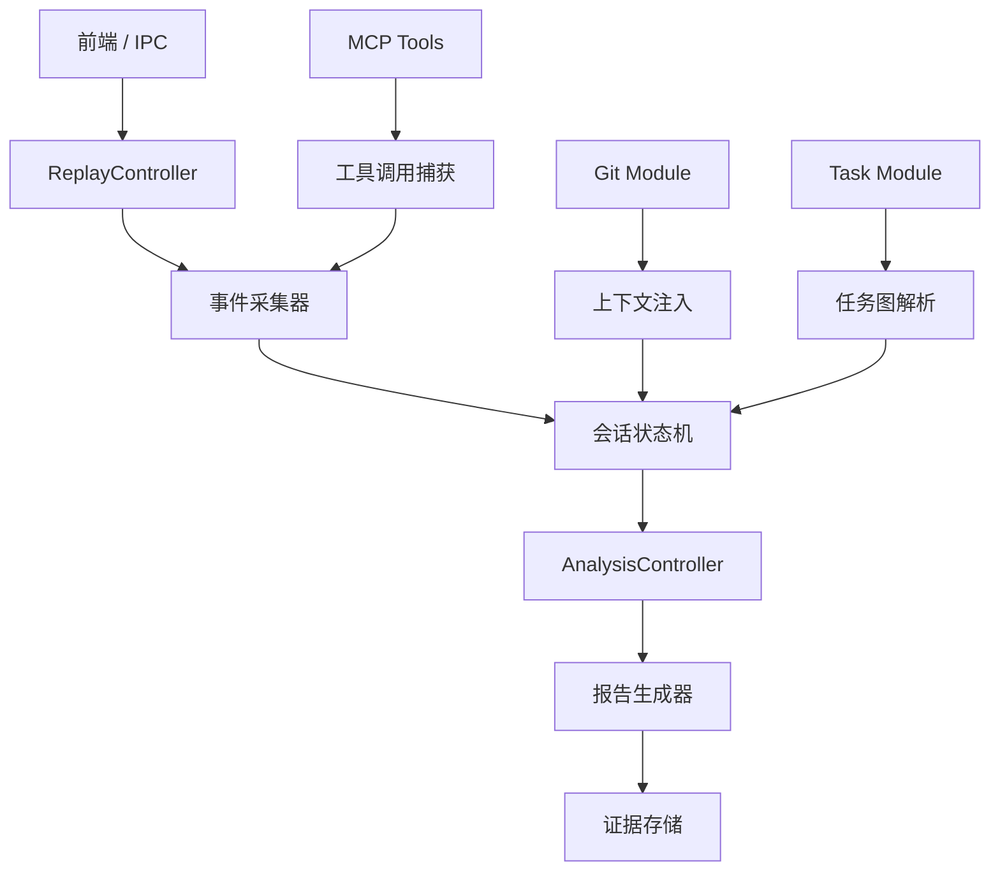
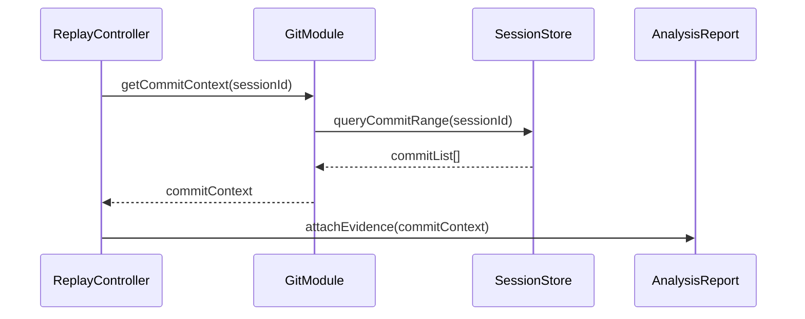

# 回放与分析模块

<cite>
**本文引用的文件**
- [skills/tech-cc-hub-release-deploy/scripts/publish-release.mjs](file://skills/tech-cc-hub-release-deploy/scripts/publish-release.mjs)
- [scripts/github-release.mjs](file://scripts/github-release.mjs)
- [src/electron/libs/system-prompt-presets.ts](file://src/electron/libs/system-prompt-presets.ts)
- [skills/tech-cc-hub-release-deploy/SKILL.md](file://skills/tech-cc-hub-release-deploy/SKILL.md)
- [skills/tech-cc-hub-release-deploy/agents/openai.yaml](file://skills/tech-cc-hub-release-deploy/agents/openai.yaml)
- [pro-workflow/skills/wiki-research-loop/scripts/research-loop.js](file://pro-workflow/skills/wiki-research-loop/scripts/research-loop.js)
- [src/electron/libs/git/README.md](file://src/electron/libs/git/README.md)
- [src/electron/libs/mcp-tools/README.md](file://src/electron/libs/mcp-tools/README.md)
- [src/electron/libs/task/README.md](file://src/electron/libs/task/README.md)
</cite>

## 目录

- [职责定位](#职责定位)
- [入口与调用链](#入口与调用链)
- [核心数据结构](#核心数据结构)
- [分析报告生成](#分析报告生成)
- [Git 上下文集成](#git-上下文集成)
- [MCP 工具扩展](#mcp-工具扩展)
- [失败模式与排障](#失败模式与排障)
- [扩展点](#扩展点)

---

## 职责定位

回放与分析模块负责捕获、重放和诊断技术-cc-hub 中多智能体会话的执行轨迹。模块从三个维度提供可观测能力：

1. **事件流回放**：序列化会话期间的所有工具调用、模型响应和状态变迁，支持事后重放。
2. **执行分析**：基于回放数据生成质量报告，覆盖工具调用效率、Token 消耗、任务完成率等指标。
3. **证据闭环**：将分析结果与 Spec 资产、代码变更关联，形成可追溯的证据链。

模块边界由 `CTR-007-ReplayController` 和 `CTR-008-AnalysisController` 定义，前者负责回放引擎，后者负责报告生成。[章节来源](file://doc/40-product/1.0.0/10-requirements/13-FR-事件流回放与分析.md)

---

## 入口与调用链

### 入口点

模块有三个主要入口：

| 入口 | 触发方式 | 负责模块 |
|------|----------|----------|
| `CTR-007-ReplayController` | 前端触发或 IPC 调用 | 回放引擎 |
| `CTR-008-AnalysisController` | 回放完成后回调或手动触发 | 分析报告 |
| `research-loop.js` | CLI 命令或定时任务 | 研究循环（扩展路径） |

### 调用链



调用链说明：

1. 前端通过 IPC 调用 `ReplayController.replay(sessionId)`
2. 事件采集器从 `MCP Tools` 和 `Task Module` 收集调用记录
3. 会话状态机按时间顺序重建执行轨迹
4. `AnalysisController` 基于轨迹数据生成报告
5. 报告写入证据存储，同时注入 Git 上下文

[图表来源](file://doc/40-product/1.0.0/10-requirements/13-FR-事件流回放与分析.md)

---

## 核心数据结构

### 会话事件

```typescript
interface SessionEvent {
  id: string;
  sessionId: string;
  timestamp: number;
  type: 'tool_call' | 'model_response' | 'state_change' | 'error';
  payload: Record<string, unknown>;
  metadata?: {
    toolName?: string;
    modelProvider?: string;
    tokenCount?: number;
  };
}
```

事件类型定义于 `doc/20-contracts/events/spec.md`，包含四种核心事件类型。[章节来源](file://doc/20-contracts/events/spec.md)

### 任务节点

```typescript
interface TaskNode {
  id: string;
  parentId?: string;
  label: string;
  status: 'pending' | 'running' | 'done' | 'failed';
  children?: TaskNode[];
  evidencePaths?: string[];
}
```

任务图结构与 `doc/22-任务图与递归拆分规范` 保持一致，支持嵌套子任务。[章节来源](file://doc/20-specs/22-任务图与递归拆分规范.md)

### 分析报告

```typescript
interface AnalysisReport {
  sessionId: string;
  generatedAt: string;
  metrics: {
    totalToolCalls: number;
    tokenUsage: { prompt: number; completion: number };
    taskCompletionRate: number;
    avgResponseTime: number;
  };
  recommendations: string[];
  evidenceLinks: string[];
}
```

---

## 分析报告生成

### 报告生成流程

1. **数据聚合**：从 SQLite 读取会话事件，按时间排序
2. **指标计算**：统计工具调用次数、Token 消耗、响应延迟
3. **建议生成**：基于指标对比基线，输出优化建议
4. **证据关联**：将报告与对应的 Spec 资产、代码变更关联

### 报告输出格式

报告默认输出为 Markdown，格式规范见 `doc/30-operations/32-回放与分析报告规范.md`。[章节来源](file://doc/30-operations/32-回放与分析报告规范.md)

```markdown
## 分析报告

### 概览
- 会话 ID: xxx
- 生成时间: xxx

### 关键指标
- 工具调用总数: 42
- Token 消耗: 12.5K (prompt) + 8.3K (completion)
- 任务完成率: 95%

### 优化建议
- 考虑合并批量文件读取操作
- 某些工具调用可并行化
```

### 触发条件

| 触发方式 | 参数 | 说明 |
|----------|------|------|
| 手动触发 | `sessionId` | 前端按钮触发 |
| 自动触发 | `onSessionEnd` | 会话结束时自动生成 |
| 定时触发 | `cron` | 定期汇总分析 |

---

## Git 上下文集成

回放与分析模块依赖 Git Module 提供版本控制上下文，用于关联证据与代码变更。

### 集成方式



Git Module 通过 `ipc.ts` 注册 IPC handler，Renderer 层调用 `git.*` 方法执行操作。[章节来源](file://src/electron/libs/git/README.md)

### 支持的操作

第一版支持以下 Git 操作：

- `status` / `diff`：查看工作区状态和变更
- `stage` / `unstage`：暂存或取消暂存文件
- `commit`：提交变更
- `push`：推送到远程（普通 push）
- `branch`：`create` / `checkout` 分支
- `stash`：`save` / `apply` / `drop` 储藏
- `history`：近期的 commit history 和轻量图

第一版禁止的操作：`reset` / `rebase` / `cherry-pick` / `force push` / `amend` / `squash` / interactive rebase。[章节来源](file://src/electron/libs/git/README.md#L16-L34)

---

## MCP 工具扩展

回放与分析模块支持通过 MCP 工具扩展能力范围。当前内置 MCP 工具位于 `src/electron/libs/mcp-tools/`。

### 工具清单

| 工具名 | 职责 | 入口文件 |
|--------|------|----------|
| `browser` | 浏览器工作台能力（截图、DOM 查询） | [mcp-tools/browser.ts](file://src/electron/libs/mcp-tools/README.md#L5) |
| `design` | 截图比照和设计还原 | [mcp-tools/design.ts](file://src/electron/libs/mcp-tools/README.md#L6-L7) |
| `figma-rest` | Figma 只读 API | [mcp-tools/figma-rest.ts](file://src/electron/libs/mcp-tools/README.md#L7) |
| `admin` | 全局配置写入 | [mcp-tools/admin.ts](file://src/electron/libs/mcp-tools/README.md#L8) |

### 工具调用捕获

MCP 工具的所有调用都会被事件采集器捕获，记录以下信息：

- 工具名称
- 输入参数（已脱敏）
- 输出摘要
- 执行时长

捕获逻辑在 `system-prompt-presets.ts` 的工具调用预设中定义。[章节来源](file://src/electron/libs/system-prompt-presets.ts#L28-L42)

### 设计工具触发规则

用户给出截图、Figma 图或页面参考图并要求生成/修改 UI/前端代码时，自动触发设计工具链：

1. 单张参考图先用 `design_inspect_image` 做语义摘要
2. 生成候选图后用 `design_compare_images` 做对比
3. 差异区域用 `design_read_comparison_report` 生成 JSON report
4. 恢复证据时用 `design_list_artifacts` 找最近产物

[章节来源](file://src/electron/libs/mcp-tools/README.md#L16-L21)

---

## 失败模式与排障

### 常见失败场景

| 场景 | 症状 | 排查步骤 |
|------|------|----------|
| 会话事件缺失 | 报告生成不完整 | 检查事件采集器日志，确认 IPC 通道正常 |
| Git 上下文获取失败 | 证据关联为空 | 验证 `.git` 目录存在，确认仓库干净 |
| 分析报告超时 | 前端卡住 | 检查 SQLite 查询性能，增加超时阈值 |
| MCP 工具调用失败 | 事件类型标记为 `error` | 查看工具返回的错误码，确认工具服务运行 |

### 排障步骤

1. **检查事件流完整性**：
   ```bash
   node scripts/research-loop.js status
   ```

2. **验证 Git 仓库状态**：
   ```bash
   git rev-parse HEAD
   git status --short
   ```

3. **查看分析报告日志**：
   检查 `logs/` 目录下的 `research-*.md` 文件。

### Token 失效场景

如果 GitHub token 失效或缺失，发布模块会提示：

```
Missing GitHub token. Set GH_TOKEN/GITHUB_TOKEN or login with Git credential manager.
```

可通过以下方式解决：

- 设置环境变量 `GH_TOKEN` 或 `GITHUB_TOKEN`
- 使用 `git credential fill` 获取 token
- 检查凭证管理器配置

[章节来源](file://skills/tech-cc-hub-release-deploy/scripts/publish-release.mjs#L355-L357)

---

## 扩展点

### 1. 新增分析维度

在 `AnalysisController` 中添加新的指标计算方法：

```typescript
async calculateCustomMetric(sessionId: string, metricName: string): Promise<number> {
  const events = await this.repository.getEvents(sessionId);
  // 自定义指标计算逻辑
}
```

### 2. 外部数据源集成

通过 `research-loop.js` 的 fetcher 扩展机制接入外部数据源：

```javascript
// pro-workflow/skills/wiki-research-loop/scripts/research-loop.js#L36-55
function loadFetchers(names) {
  // 从 scripts/source-fetchers 或 ~/.pro-workflow/fetchers 加载
}
```

支持的自定义 fetchers 放在 `~/.pro-workflow/fetchers/` 目录，命名约定为 `{name}.js`。[章节来源](file://pro-workflow/skills/wiki-research-loop/scripts/research-loop.js#L36-L56)

### 3. 报告模板自定义

通过 `createReleaseBody` 函数支持自定义报告模板：

```javascript
// scripts/github-release.mjs#L319-346
function createReleaseBody({ tag, commits, files }) {
  const template = getReleaseNoteTemplate();
  return template
    .replaceAll("{{title}}", ...)
    .replaceAll("{{commits}}", ...)
    // 更多占位符...
}
```

模板文件路径通过 `--release-note-template` 参数指定。[章节来源](file://scripts/github-release.mjs#L319-L346)

### 4. 系统 Prompt 扩展

通过 `system-prompt-presets.ts` 扩展 Agent 的系统提示：

```typescript
// src/electron/libs/system-prompt-presets.ts#L136-175
export function buildTechCCHubSystemPromptSources(): PromptLedgerSource[] {
  return [
    // 预设项
  ];
}
```

新增预设只需在数组中添加新的 `PromptLedgerSource` 对象。[章节来源](file://src/electron/libs/system-prompt-presets.ts#L136-L175)

---

## 相关文档

- [回放与分析报告规范](file://doc/30-operations/32-回放与分析报告规范.md)
- [事件流回放与分析需求](file://doc/40-product/1.0.0/10-requirements/13-FR-事件流回放与分析.md)
- [会话与状态机规范](file://doc/20-specs/25-会话与状态机规范.md)
- [任务图与递归拆分规范](file://doc/20-specs/22-任务图与递归拆分规范.md)