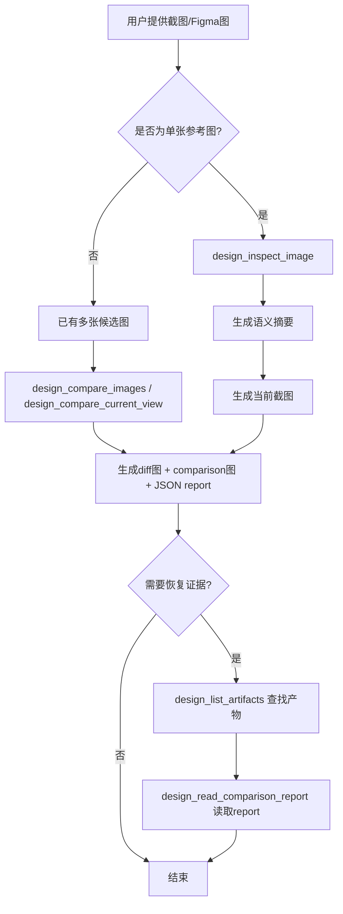
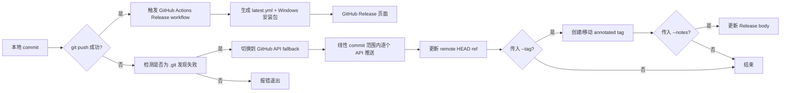
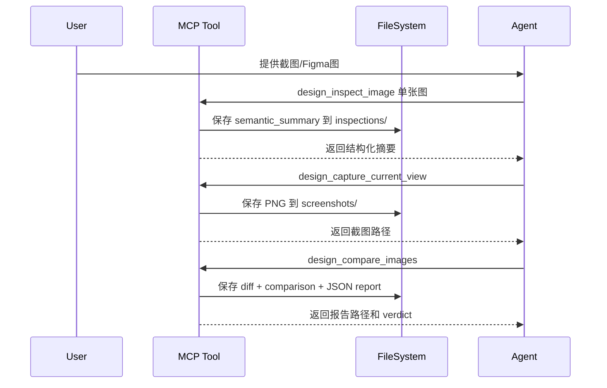
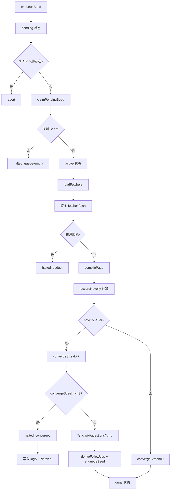

# 存储与产物规范

<cite>
**本文引用的文件**
- [skills/tech-cc-hub-release-deploy/scripts/publish-release.mjs](file://skills/tech-cc-hub-release-deploy/scripts/publish-release.mjs)
- [scripts/github-release.mjs](file://scripts/github-release.mjs)
- [src/electron/libs/system-prompt-presets.ts](file://src/electron/libs/system-prompt-presets.ts)
- [skills/tech-cc-hub-release-deploy/SKILL.md](file://skills/tech-cc-hub-release-deploy/SKILL.md)
- [skills/tech-cc-hub-release-deploy/agents/openai.yaml](file://skills/tech-cc-hub-release-deploy/agents/openai.yaml)
- [pro-workflow/skills/wiki-research-loop/scripts/research-loop.js](file://pro-workflow/skills/wiki-research-loop/scripts/research-loop.js)
- [src/electron/libs/git/README.md](file://src/electron/libs/git/README.md)
- [src/electron/libs/mcp-tools/README.md](file://src/electron/libs/mcp-tools/README.md)
- [src/electron/libs/task/README.md](file://src/electron/libs/task/README.md)
</cite>

# 存储与产物规范

本规范定义 tech-cc-hub 项目中各类存储介质与产物的组织方式、命名约定、数据结构和生命周期。文档面向希望理解产物来源、排查存储问题或扩展存储能力的工程师和 Agent。

---

## 目录

- [1. 概述](#1-概述)
- [2. 产物分类与存储路径](#2-产物分类与存储路径)
- [3. 发布产物规范](#3-发布产物规范)
- [4. 设计还原产物规范](#4-设计还原产物规范)
- [5. 任务执行产物规范](#6-任务执行产物规范)
- [6. 研究循环产物规范](#7-研究循环产物规范)
- [7. 产物状态流](#8-产物状态流)
- [8. 失败模式与排障](#9-失败模式与排障)
- [9. 扩展点](#10-扩展点)

---

## 1. 概述

tech-cc-hub 的产物分为三类：

| 类别 | 典型产物 | 持久化位置 |
|------|---------|-----------|
| 发布产物 | Git Tag、Release Body、latest.yml、Windows 安装包 | Git Remote / GitHub Release |
| 设计还原产物 | 截图、diff 图、JSON report、comparison 图 | `~/.tech-cc-hub/artifacts/` |
| 任务执行产物 | SQLite DB、workspace 文件、日志 | `~/.pro-workflow/` |
| 研究循环产物 | Wiki Page、Seed、Research Log | 关联 Wiki Root |

存储原则：

- 主进程写入磁盘的操作只能通过 IPC 调用，不直接由 Renderer 执行。
- 产物路径遵守 `~` 展开约定，避免硬编码。
- 产物命名采用 slug 格式，允许多语言检索。
- 敏感信息（密钥明文、token）不写入产物正文。

[章节来源](file://src/electron/libs/git/README.md#L1-L15)

---

## 2. 产物分类与存储路径

### 2.1 发布产物

发布产物由 `scripts/github-release.mjs` 和 `skills/tech-cc-hub-release-deploy/scripts/publish-release.mjs` 生成。

**Tag 命名规则：** `v{major}.{minor}.{patch}`，例如 `v0.1.13`。

**Release Body 模板变量：**

| 变量 | 含义 |
|------|------|
| `{{title}}` | 根据 `--release-title-template` 渲染的标题 |
| `{{tag}}` | 完整 tag 名 |
| `{{commits}}` | 自上一 tag 以来的非合并提交列表，最多 40 条 |
| `{{files}}` | 变更文件路径列表，最多 40 条 |
| `{{generated_at}}` | ISO 8601 时间戳 |
| `{{source}}` | 固定值：`脚本生成的提交日志与差异` |

Release Body 生成逻辑位于 `createReleaseBody` 函数，按 Jaccard 截断逻辑避免超长。
[章节来源](file://scripts/github-release.mjs#L319-L346)

### 2.2 设计还原产物

设计还原产物由 `src/electron/libs/mcp-tools/design.ts` 相关工具生成，存储在用户主目录。

**默认存储根路径：**

```text
~/.tech-cc-hub/artifacts/
```

**产物子目录结构：**

| 目录 | 内容 |
|------|------|
| `screenshots/` | `design_capture_current_view` 生成的 PNG 截图 |
| `comparisons/` | `design_compare_current_view` 生成的 diff 图和 comparison 图 |
| `reports/` | `design_compare_*` 生成的 JSON report |
| `inspections/` | `design_inspect_image` 的语义摘要文本 |

**产物文件命名：** `{tool}_{timestamp}_{slug}.{ext}`

其中 `slug` 由 `slugify()` 函数生成，长度上限 60 字符，小写化后以 `-` 分隔。
[章节来源](file://src/electron/libs/mcp-tools/README.md#L1-L23)

### 2.3 任务执行产物

任务执行产物存储在 `src/electron/libs/task/` 模块管理的 SQLite 数据库和独立 workspace。

**数据库路径：**

```text
~/.pro-workflow/dist/db/store.js  (编译后模块)
```

**Schema 核心表：**

| 表名 | 用途 |
|------|------|
| `tasks` | 任务主记录，含 status、created_at、workspace_path |
| `task_executions` | 执行历史，含 run_id、duration、logs |
| `wiki_seeds` | 研究循环的待查询队列，含 wiki_slug、query、status、depth |

**Workspace 路径安全规则：**

- 每个任务在首次执行前创建独立 workspace。
- workspace 路径由 `workspace.ts` 根据 task_id 生成，不使用用户输入构造路径。
- 不允许跨 workspace 访问文件。

[章节来源](file://src/electron/libs/task/README.md#L1-L23)

---

## 3. 发布产物规范

### 3.1 发布流程入口

发布通过两条路径，均可触发 GitHub Release：

1. **本地脚本路径：** `npm run release:github -- [patch|minor|major|vX.Y.Z]`
   - 执行 `github-release.mjs`，完成版本号 bumping、commit、tag push。
   - GitHub Actions workflow 由 tag push 触发。

2. **Skill 路径：** Agent 调用 `tech-cc-hub-release-deploy` skill
   - 执行 `publish-release.mjs`，支持普通 push 或 API fallback。
   - 适合 git push 失败或需要重发 release 的场景。

[章节来源](file://skills/tech-cc-hub-release-deploy/SKILL.md#L1-L101)

### 3.2 API Fallback 行为

当普通 `git push` 失败时（Windows 常见 `.git` 发现失败），`publish-release.mjs` 会自动切换到 GitHub Git Data API 模式。

**切换条件判断：**

```javascript
function isGitDiscoveryFailure(result) {
  return result.stderr.includes("not a git repository");
}
```

**API Fallback 核心约束：**

- 只支持线性提交范围：远端 `main` 必须是本地 `HEAD` 的祖先。
- 如果远端已超前，必须先 `fetch/rebase` 再重试。
- 按本地 commit 顺序逐个调用 GitHub API：创建 blob → 创建 tree → 创建 commit。
- 每个 commit 的 SHA 必须与远端返回一致，否则报错退出。

**Tree SHA 校验逻辑：**

```javascript
function assertCleanApiTree(remoteTree, localRef) {
  const localTree = readCommitTree(localRef);
  if (remoteTree !== localTree) {
    fail(`GitHub API tree mismatch for ${localRef}: remote=${remoteTree}, local=${localTree}`);
  }
}
```

[章节来源](file://skills/tech-cc-hub-release-deploy/scripts/publish-release.mjs#L71-L73,file://skills/tech-cc-hub-release-deploy/scripts/publish-release.mjs#L187-L192)

### 3.3 Token 获取优先级

发布脚本按以下顺序获取 GitHub Token：

1. 环境变量 `GH_TOKEN`
2. 环境变量 `GITHUB_TOKEN`
3. `git credential fill` 交互获取

```javascript
function getCredentialToken() {
  if (process.env.GH_TOKEN) return process.env.GH_TOKEN;
  if (process.env.GITHUB_TOKEN) return process.env.GITHUB_TOKEN;
  const credential = execFileSync("git", ["credential", "fill"], {
    input: "protocol=https\nhost=github.com\n\n",
    encoding: "utf8",
  });
  const passwordLine = credential.split(/\r?\n/).find((line) => line.startsWith("password="));
  return passwordLine?.slice("password=".length).trim() || "";
}
```

[章节来源](file://skills/tech-cc-hub-release-deploy/scripts/publish-release.mjs#L75-L85)

### 3.4 Release Tag 操作参数

| 参数 | 作用 | 默认行为 |
|------|------|---------|
| `--tag vX.Y.Z` | 指定要创建的 tag | 创建新 tag |
| `--retag` | 强制移动已有 tag | 若 tag 存在则报错 |
| `--delete-release` | 删除已有 GitHub Release 再重建 | 保留已有 Release |
| `--notes path` | 指定 Release 说明文件路径 | 读取本地 `.tmp/release-notes-*.md` |
| `--notes-only` | 只更新 Release 说明，不推送代码 | 需要配合 `--tag` 使用 |

**常见命令：**

```powershell
# 重发 release 并移动 tag
node skills/tech-cc-hub-release-deploy/scripts/publish-release.mjs --tag v0.1.13 --retag --delete-release

# 只补 release 说明
node skills/tech-cc-hub-release-deploy/scripts/publish-release.mjs --tag v0.1.13 --notes .tmp/release-notes-v0.1.13.md --notes-only
```

[章节来源](file://skills/tech-cc-hub-release-deploy/SKILL.md#L31-L56)

---

## 4. 设计还原产物规范

### 4.1 工具调用触发条件

设计 MCP 工具默认在以下场景自动触发：

1. 用户给出截图、Figma 图、页面参考图，并要求生成或修改 UI/前端代码。
2. 用户反馈页面和参考图不一致，需要按截图修 UI。

**首次使用规则：** 单张用户截图先走 `design_inspect_image` 做语义摘要，不要用 Read 读取图片。
[章节来源](file://src/electron/libs/mcp-tools/README.md#L16-L22)

### 4.2 设计产物状态流



### 4.3 产物检索接口

当后续轮次需要恢复证据时，先用 `design_list_artifacts` 列出产物，再根据路径读取：

```javascript
// 伪代码示例
const artifacts = design_list_artifacts({ limit: 10, type: "comparison" });
const report = design_read_comparison_report({ reportPath: artifacts[0].path });
```

[章节来源](file://src/electron/libs/system-prompt-presets.ts#L125-L134)

### 4.4 设计产物参数

| 参数 | 作用 | 适用工具 |
|------|------|---------|
| `ignoreRegions` | 忽略时间戳、头像、动画等动态区域 | `design_compare_*` |
| `maxDifferenceRatio` | 形成通过/失败结论的阈值 | `design_compare_*` |
| `ignoreAntialiasing` | 忽略文字抗锯齿噪声 | `design_compare_*` |
| `diffColorMode: directional` | 区分变亮/变暗 | `design_compare_*` |

---

## 5. 任务执行产物规范

### 5.1 Repository 职责边界

`src/electron/libs/task/repository.ts` 只负责持久化，不启动 runner。Executor 是唯一调度入口。
[章节来源](file://src/electron/libs/task/README.md#L18-L20)

### 5.2 任务执行记录结构

任务执行记录保存在 `task_executions` 表，关键字段：

| 字段 | 类型 | 含义 |
|------|------|------|
| id | INTEGER | 主键 |
| task_id | TEXT | 关联任务 ID |
| run_id | TEXT | 本次运行唯一标识 |
| status | TEXT | pending / active / done / failed |
| duration | INTEGER | 毫秒 |
| logs | TEXT | JSON 序列化的日志数组 |

### 5.3 Workspace 安全

每个任务使用独立 workspace，路径由 `workspace.ts` 生成，禁止使用用户输入构造路径。不允许跨 workspace 文件访问。
[章节来源](file://src/electron/libs/task/README.md#L21)

---

## 6. 研究循环产物规范

### 6.1 产物存储位置

研究循环产物存储在 Wiki Root 目录下：

| 子目录 | 内容 |
|--------|------|
| `wiki/questions/` | 生成的 Markdown 页面，每个 query 一个文件 |
| `logs/` | 每次运行的 Markdown 日志 |
| `derived/` | 每次运行的 JSON 统计摘要 |

[章节来源](file://pro-workflow/skills/wiki-research-loop/scripts/research-loop.js#L189-L191,file://pro-workflow/skills/wiki-research-loop/scripts/research-loop.js#L271-L273)

### 6.2 Wiki 页面格式

每个生成的 Markdown 页面包含：

- **标题**：`# {query}`
- **元信息行**：`> seed-{seed_id} · depth {depth} · novelty {novelty}%`
- **Sources 节**：来源链接列表
- **Claims 节**：提取的语句列表，每条带脚注编号
- **Open follow-ups 节**：自动推导的后续查询

### 6.3 Seed 状态机

Seed（待查询队列）有以下状态：

| 状态 | 含义 |
|------|------|
| pending | 等待被提取执行 |
| active | 正在执行中 |
| done | 已完成 |
| failed | 执行失败 |

[章节来源](file://pro-workflow/skills/wiki-research-loop/scripts/research-loop.js#L199-L201)

### 6.4 停止机制

研究循环支持 kill-switch 文件：

```text
~/.pro-workflow/STOP
```

当此文件存在时，当前轮次完成后立即停止。
[章节来源](file://pro-workflow/skills/wiki-research-loop/scripts/research-loop.js#L9,file://pro-workflow/skills/wiki-research-loop/scripts/research-loop.js#L162-L164)

---

## 7. 产物状态流

### 7.1 发布产物状态流



[图表来源](file://skills/tech-cc-hub-release-deploy/scripts/publish-release.mjs#L354-L387)

### 7.2 设计产物状态流



### 7.3 研究循环产物状态流



[图表来源](file://pro-workflow/skills/wiki-research-loop/scripts/research-loop.js#L197-L268)

---

## 8. 失败模式与排障

### 8.1 Git Push 失败

**症状：** `git push` 报 `fatal: not a git repository`

**排查步骤：**

1. 确认当前目录是 `D:\tool\tech-cc-hub`
2. 检查 `.git` 目录是否存在
3. 确认 Git credential 是否过期

**解决方案：** 使用 API fallback 模式

```powershell
node skills/tech-cc-hub-release-deploy/scripts/publish-release.mjs --api-only
```

[章节来源](file://skills/tech-cc-hub-release-deploy/SKILL.md#L51-L55)

### 8.2 Tree/Commit SHA 不匹配

**症状：** API fallback 过程中报错 `GitHub API tree mismatch`

**排查步骤：**

1. 检查脚本输出中的 `remote` 和 `local` SHA 值
2. 确认本地 commit 是否包含敏感内容（如密钥）

**根本原因：** GitHub API 可能在处理二进制文件时产生不同 tree。

**解决方案：** 暂存本地变更，手动 `git push`，或检查 commit 内容。
[章节来源](file://skills/tech-cc-hub-release-deploy/scripts/publish-release.mjs#L187-L192)

### 8.3 非线性提交范围

**症状：** 报错 `Non-linear API fallback range`

**根本原因：** 远端 `main` 已经被其他提交推进，不再是本地 HEAD 的祖先。

**解决方案：**

```powershell
git fetch origin
git rebase origin/main
node skills/tech-cc-hub-release-deploy/scripts/publish-release.mjs --api-only
```

[章节来源](file://skills/tech-cc-hub-release-deploy/scripts/publish-release.mjs#L267-L270)

### 8.4 Tag 已存在

**症状：** 报错 `Tag vX.Y.Z exists`

**解决方案：**

```powershell
# 移动现有 tag
node skills/tech-cc-hub-release-deploy/scripts/publish-release.mjs --tag v0.1.13 --retag

# 强制重建 Release
node skills/tech-cc-hub-release-deploy/scripts/publish-release.mjs --tag v0.1.13 --retag --delete-release
```

[章节来源](file://skills/tech-cc-hub-release-deploy/scripts/publish-release.mjs#L324-L327)

### 8.5 Release Workflow 失败

**症状：** GitHub Actions `Release` workflow 失败

**排查步骤：**

1. 检查 `https://api.github.com/repos/lst016/tech-cc-hub/actions/runs?per_page=10&event=push`
2. 确认 `latest.yml` 和 Windows 安装包是否在 Release Assets 中

**注意：** 不要以旧的 `Build and Release` workflow 为准，应使用新的 `Release` workflow。
[章节来源](file://skills/tech-cc-hub-release-deploy/SKILL.md#L26-L28)

### 8.6 产物路径访问失败

**症状：** Agent 报告找不到设计产物

**排查步骤：**

1. 确认存储根路径是 `~/.tech-cc-hub/artifacts/`
2. 使用 `design_list_artifacts` 列出可用产物
3. 确认文件未被手动删除或清理工具清理

### 8.7 研究循环 Kill Switch 触发

**症状：** 研究循环突然停止，日志显示 `STOP file present — aborting`

**解决方案：**

1. 删除 `~/.pro-workflow/STOP` 文件
2. 重新运行 `research-loop.js run <slug>`

[章节来源](file://pro-workflow/skills/wiki-research-loop/scripts/research-loop.js#L162-L164)

---

## 9. 扩展点

### 9.1 添加新的存储后端

目前设计产物默认存储在本地文件系统，未来可扩展到 S3 或其他对象存储：

1. 在 `mcp-tools/` 下新建 `storage-adapter.ts` 定义统一接口
2. 实现 `put(key, content)` 和 `list(prefix)` 方法
3. 在工具调用前通过 config 判断使用哪个 adapter

### 9.2 添加新的发布渠道

当前仅支持 GitHub Release，未来可扩展 npm、Conda 等：

1. 在 `scripts/` 下新建 `publish-*.mjs`
2. 在 `SKILL.md` 中添加对应的触发条件
3. 统一产物路径约定，避免与 GitHub Release 路径冲突

### 9.3 添加新的研究 fetcher

当前支持 `web`、`arxiv`、`github`、`local`：

1. 在 `pro-workflow/skills/wiki-research-loop/scripts/source-fetchers/` 下创建 `{name}.js`
2. 导出 `match(query)` 和 `fetch(query, opts)` 方法
3. 在 `wiki.config.md` 的 `fetchers` 列表中注册

### 9.4 产物生命周期策略

当前产物没有自动清理机制，建议扩展：

| 产物类型 | 建议保留周期 |
|---------|-------------|
| Release Body | 永久 |
| 设计产物 | 最近 100 个或 30 天 |
| 任务日志 | 最近 7 天 |
| Research Log | 永久 |

---

## 附录 A：关键数据结构速查

### A.1 Release 参数 Map

```javascript
const flags = new Set(args.filter((arg) => arg.startsWith("--")));
const values = new Map();
```

- `--tag` → 值
- `--notes` → 值
- `--retag` → 布尔
- `--delete-release` → 布尔
- `--api-only` → 布尔
- `--notes-only` → 布尔

### A.2 Seed 队列状态 SQL

```sql
SELECT wiki_slug,
  SUM(CASE WHEN status='pending' THEN 1 ELSE 0 END) AS pending,
  SUM(CASE WHEN status='active' THEN 1 ELSE 0 END) AS active,
  SUM(CASE WHEN status='done' THEN 1 ELSE 0 END) AS done,
  SUM(CASE WHEN status='failed' THEN 1 ELSE 0 END) AS failed
FROM wiki_seeds GROUP BY wiki_slug
```

[章节来源](file://pro-workflow/skills/wiki-research-loop/scripts/research-loop.js#L325-L332)

---

*文档版本：v0.1*
*最后更新：与 tech-cc-hub 主仓库同步*