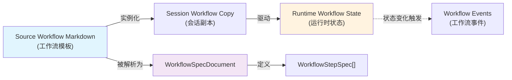
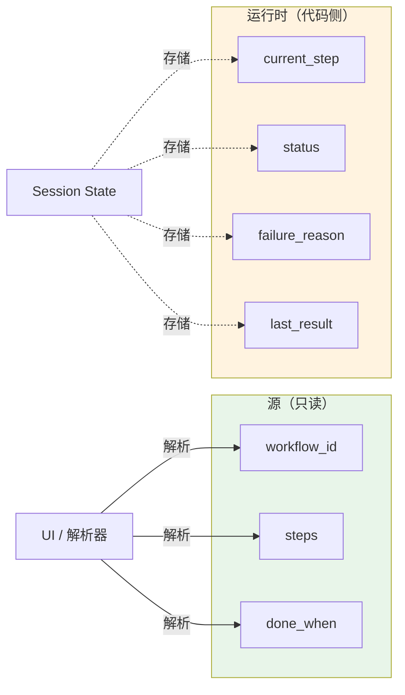
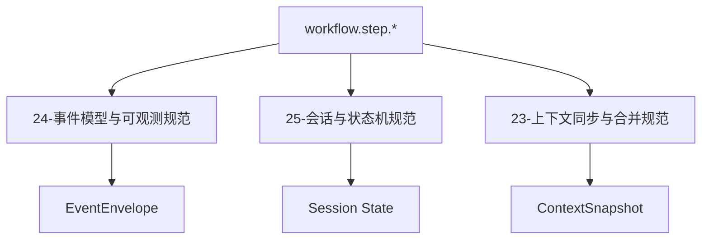

# 工作流 Markdown 规范

<cite>

**本文引用的文件**

- [doc/20-specs/31-工作流Markdown规范.md](file://doc/20-specs/31-工作流Markdown规范.md)
- [doc/_standards/文档贡献规范.md](file://doc/_standards/文档贡献规范.md)
- [doc/_standards/软件工程文档体系规范.md](file://doc/_standards/软件工程文档体系规范.md)
- [doc/20-specs/20-AgentOS集成规范.md](file://doc/20-specs/20-AgentOS集成规范.md)
- [doc/20-specs/22-任务图与递归拆分规范.md](file://doc/20-specs/22-任务图与递归拆分规范.md)
- [doc/20-specs/23-上下文同步与合并规范.md](file://doc/20-specs/23-上下文同步与合并规范.md)
- [doc/20-specs/24-事件模型与可观测规范.md](file://doc/20-specs/24-事件模型与可观测规范.md)
- [doc/20-specs/25-会话与状态机规范.md](file://doc/20-specs/25-会话与状态机规范.md)
- [doc/20-specs/26-存储与Markdown产物规范.md](file://doc/20-specs/26-存储与Markdown产物规范.md)

</cite>

---

## 目录

- [1. 概述与目标](#1-概述与目标)
- [2. 核心概念](#2-核心概念)
- [3. 文件结构概览](#3-文件结构概览)
- [4. Frontmatter 规范](#4-frontmatter-规范)
- [5. 固定章节规范](#5-固定章节规范)
- [6. 步骤块格式](#6-步骤块格式)
- [7. 解析规则与校验](#7-解析规则与校验)
- [8. 运行时对象](#8-运行时对象)
- [9. 源与运行时的边界](#9-源与运行时的边界)
- [10. 失败模式与排障](#10-失败模式与排障)
- [11. 可观测事件](#11-可观测事件)

---

## 1. 概述与目标

本文定义聊天内置工作流所使用的 **Markdown 源文件结构**、**字段约束**、**解析规则**和**运行时边界**。

### 1.1 适用范围

工作流 Markdown 是系统级、用户级、项目级和 Session 级工作流模板的共同协议。它既是人可编辑的源定义，也是解析器可稳定提取结构的输入。

**章节来源**：[31-工作流Markdown规范.md#L24-L31](file://doc/20-specs/31-工作流Markdown规范.md#L24-L31)

### 1.2 设计原则

| 原则 | 说明 | 约束 |
|------|------|------|
| Markdown 是源，不是数据库 | 工作流定义目标、规则、步骤，但不保存运行状态 | 运行时状态必须单独存储 |
| 对人友好，对机稳定 | 用户肉眼可读、可直接编辑，解析器可稳定提取 | 禁止复杂 DSL，采用 YAML frontmatter + 固定标题 |
| 先固定最小子集 | MVP 只支持单线程线性步骤 | 不支持条件分支、循环、并行、嵌套子工作流 |

**章节来源**：[31-工作流Markdown规范.md#L80-L107](file://doc/20-specs/31-工作流Markdown规范.md#L80-L107)

---

## 2. 核心概念

### 2.1 概念定义

| 概念 | 英文 | 说明 |
|------|------|------|
| **源工作流 Markdown** | Source Workflow Markdown | 面向人编辑、面向系统解析的工作流定义文件，不承载运行时状态 |
| **会话工作流副本** | Session Workflow Copy | 某 Session 绑定的当前工作流实例，来源可为系统级、用户级或项目级模板 |
| **运行时工作流状态** | Runtime Workflow State | 当前步骤、执行结果、最近运行时间、失败原因等运行时信息，必须存于代码侧而非源 Markdown |
| **工作流步骤规范** | Workflow Step Spec | 对某步骤"应该做什么"的静态定义 |
| **工作流步骤状态** | Workflow Step State | 对某步骤"现在做到哪了"的动态状态 |

**章节来源**：[31-工作流Markdown规范.md#L59-L78](file://doc/20-specs/31-工作流Markdown规范.md#L59-L78)

### 2.2 概念关系图



---

## 3. 文件结构概览

一个合法的工作流 Markdown 文件必须按以下顺序组织：

1. **YAML frontmatter** - 元数据声明
2. **一级标题 `#`** - 工作流名称
3. **固定章节** - 目标、适用范围、使用规则、输入上下文、输出产物
4. **步骤章节 `## 步骤`** - 步骤定义区
5. **步骤块 `### STEP-*`** - 若干步骤定义

**章节来源**：[31-工作流Markdown规范.md#L118-L126](file://doc/20-specs/31-工作流Markdown规范.md#L118-L126)

### 3.1 完整示例结构

```markdown
---
workflow_id: "bugfix-basic"
name: "基础问题修复流程"
version: "1.0.0"
scope: "project"
mode: "single-thread"
entry: "manual"
owner: "user"
auto_advance: false
tags:
  - "bugfix"
  - "engineering"
---

# 基础问题修复流程

## 目标
定位问题、完成修复、验证结果、整理结论。

## 适用范围
适用于单项目、单主 Agent 的常规问题修复场景。

## 使用规则
- 当前工作流运行在单线程聊天中
- 用户可以随时中断、编辑和重试
- 一次只推进一个步骤

## 输入上下文
- 当前聊天记录
- 当前工作区代码
- 用户补充说明

## 输出产物
- 修改结果
- 验证结论
- 最终说明

## 步骤

### STEP-1
```yaml
id: "STEP-1"
title: "定位问题"
executor: "primary-agent"
intent: "inspect"
user_actions: ["run", "skip", "edit"]
done_when: "找到明确根因或排查方向"
```
先读日志和代码，不直接修改文件。
```

**章节来源**：[31-工作流Markdown规范.md#L129-L212](file://doc/20-specs/31-工作流Markdown规范.md#L129-L212)

---

## 4. Frontmatter 规范

### 4.1 必填字段

| 字段 | 类型 | 含义 | 示例 |
|------|------|------|------|
| `workflow_id` | string | 工作流稳定唯一标识 | `"bugfix-basic"` |
| `name` | string | 工作流显示名称 | `"基础问题修复流程"` |
| `version` | string | 工作流版本号 | `"1.0.0"` |
| `scope` | enum | 模板层级 | `system \| user \| project \| session` |
| `mode` | enum | 执行模式（首版固定） | `single-thread` |
| `entry` | enum | 触发方式（首版固定） | `manual` |
| `owner` | string | 维护责任人或归属方 | `"user"` |

**章节来源**：[31-工作流Markdown规范.md#L218-L228](file://doc/20-specs/31-工作流Markdown规范.md#L218-L228)

### 4.2 可选字段

| 字段 | 类型 | 含义 | 默认值 |
|------|------|------|--------|
| `description` | string | 对工作流的补充说明 | 空 |
| `auto_advance` | boolean | 是否允许步骤完成后自动推进 | `false` |
| `tags` | string[] | 标签集合 | `[]` |
| `extends` | string | 预留字段，首版只保留不解析 | 空 |

**章节来源**：[31-工作流Markdown规范.md#L230-L236](file://doc/20-specs/31-工作流Markdown规范.md#L230-L236)

### 4.3 scope 取值说明

| 值 | 含义 | 使用场景 |
|---|------|----------|
| `system` | 系统级工作流 | 内置模板，全局可用 |
| `user` | 用户级工作流 | 用户自定义模板 |
| `project` | 项目级工作流 | 特定项目的专用流程 |
| `session` | 会话绑定工作流 | 运行时实例，不可复用 |

---

## 5. 固定章节规范

### 5.1 章节列表

| 章节标题 | 是否必填 | 含义 |
|----------|----------|------|
| `## 目标` | 是 | 这套工作流要解决什么问题 |
| `## 适用范围` | 否 | 适合哪些场景 |
| `## 使用规则` | 是 | 执行约束 |
| `## 输入上下文` | 否 | 依赖哪些输入 |
| `## 输出产物` | 否 | 希望输出什么 |
| `## 步骤` | 是 | 步骤定义区 |

除 `## 步骤` 外，其他正文按普通 Markdown 保留，可自由编写。

**章节来源**：[31-工作流Markdown规范.md#L238-L250](file://doc/20-specs/31-工作流Markdown规范.md#L238-L250)

---

## 6. 步骤块格式

### 6.1 步骤块结构

每个步骤块必须满足：

1. 使用**三级标题** `### STEP-*`
2. 标题下**紧跟**一个 `yaml` 代码块
3. YAML 块后为该步骤正文说明
4. 正文说明持续到下一个步骤或文件结束

### 6.2 步骤元信息字段

**必填字段**：

| 字段 | 类型 | 含义 | 示例 |
|------|------|------|------|
| `id` | string | 步骤唯一标识，必须与标题对应 | `"STEP-1"` |
| `title` | string | 步骤显示标题 | `"定位问题"` |
| `executor` | enum | 执行器（首版固定） | `primary-agent` |
| `intent` | enum | 执行意图 | `inspect \| implement \| verify \| deliver \| other` |
| `done_when` | string | 完成判定标准 | `"找到明确根因或排查方向"` |

**可选字段**：

| 字段 | 类型 | 含义 | 示例 |
|------|------|------|------|
| `user_actions` | enum[] | 允许用户执行的动作 | `["run", "skip", "edit"]` |
| `depends_on` | string[] | 依赖的前置步骤 ID | `["STEP-1"]` |
| `tools_hint` | string[] | 建议使用的工具名 | `["Read", "Grep"]` |
| `notes` | string | 给执行器的额外说明 | `"注意不要破坏其他模块"` |

### 6.3 intent 取值说明

| 值 | 含义 | 使用场景 |
|---|------|----------|
| `inspect` | 检查/调研 | 分析日志、代码、问题 |
| `implement` | 实施/修改 | 编写代码、做配置 |
| `verify` | 验证/测试 | 运行测试、确认结果 |
| `deliver` | 交付/总结 | 输出结论、整理文档 |
| `other` | 其他 | 自定义意图 |

### 6.4 步骤正文

步骤 YAML 块后的正文说明必须是普通 Markdown，用于表达：

- 执行要求
- 限制条件
- 风险提示
- 交付标准补充

**章节来源**：[31-工作流Markdown规范.md#L252-L284](file://doc/20-specs/31-工作流Markdown规范.md#L252-L284)

---

## 7. 解析规则与校验

### 7.1 必须满足的规则

| 规则 | 说明 | 校验级别 |
|------|------|----------|
| 包含合法 frontmatter | YAML 块必须位于文件开头 | 阻断 |
| 包含一级标题 `#` | 工作流名称 | 阻断 |
| 包含 `## 步骤` | 步骤定义区 | 阻断 |
| 至少包含一个步骤块 | `### STEP-*` | 阻断 |
| 步骤 `id` 唯一 | 不能有重复 ID | 阻断 |
| 步骤标题与 YAML `id` 一致 | `### STEP-1` 对应 `id: "STEP-1"` | 阻断 |
| `depends_on` 引用存在 | 依赖的步骤必须存在 | 阻断 |

**章节来源**：[31-工作流Markdown规范.md#L338-L346](file://doc/20-specs/31-工作流Markdown规范.md#L338-L346)

### 7.2 建议满足的规则

| 规则 | 说明 |
|------|------|
| 步骤顺序与自然顺序一致 | `STEP-1 / STEP-2 / STEP-3` 按顺序排列 |
| `intent` 与步骤正文语义一致 | 检查类型与内容匹配 |
| `done_when` 使用清晰可判断的描述 | 便于自动推进判定 |

### 7.3 忽略策略（向前兼容）

解析器对以下内容采用宽松策略：

- 未知 frontmatter 字段
- 未知章节
- 未知步骤可选字段

处理方式：保留原文，不阻断解析；严格模式下给出 warning。

**章节来源**：[31-工作流Markdown规范.md#L352-L357](file://doc/20-specs/31-工作流Markdown规范.md#L352-L357)

---

## 8. 运行时对象

### 8.1 工作流规范文档

```typescript
type WorkflowSpecDocument = {
  workflowId: string;           // 工作流唯一标识
  name: string;                 // 显示名称
  version: string;              // 版本号
  scope: "system" | "user" | "project" | "session";
  mode: "single-thread";
  entry: "manual";
  owner: string;
  autoAdvance: boolean;
  sections: {
    goal: string;
    scopeText?: string;
    rules: string;
    inputs?: string;
    outputs?: string;
  };
  steps: WorkflowStepSpec[];
  rawMarkdown: string;          // 原始 markdown 原文
};
```

### 8.2 步骤规范

```typescript
type WorkflowStepSpec = {
  id: string;                    // 步骤 ID，与标题一致
  title: string;                // 显示标题
  executor: "primary-agent";    // 执行器（首版固定）
  intent: "inspect" | "implement" | "verify" | "deliver" | "other";
  doneWhen: string;             // 完成判定标准
  userActions?: Array<"run" | "skip" | "edit" | "retry">;
  dependsOn?: string[];         // 依赖的前置步骤
  toolsHint?: string[];         // 建议工具
  notes?: string;               // 额外说明
  body: string;                 // 步骤正文
};
```

### 8.3 会话工作流状态

```typescript
type SessionWorkflowState = {
  workflowId: string;
  sourceLayer: "system" | "user" | "project" | "session";
  sourcePath?: string;          // 模板路径
  currentStepId?: string;       // 当前步骤
  status: "idle" | "running" | "completed" | "failed";
  steps: Array<{
    stepId: string;
    status: "pending" | "running" | "completed" | "skipped" | "failed";
    lastRunAt?: number;         // 时间戳
    lastResultSummary?: string;
    failureReason?: string;
  }>;
};
```

**章节来源**：[31-工作流Markdown规范.md#L284-L335](file://doc/20-specs/31-工作流Markdown规范.md#L284-L335)

---

## 9. 源与运行时的边界

### 9.1 严格禁止写入源 Markdown 的字段

以下运行时状态字段**不得**写入源工作流 Markdown：

| 字段 | 类型 | 说明 |
|------|------|------|
| `status` | enum | 当前状态 |
| `current_step` | string | 当前步骤 ID |
| `last_run_at` | timestamp | 最近运行时间 |
| `last_result` | string | 最近执行结果 |
| `failure_reason` | string | 失败原因 |
| `retry_count` | number | 重试次数 |

如果需要"导出带状态的工作流快照"，必须使用其他产物类型，例如：

- `WorkflowRunSnapshot`
- `WorkflowSessionExport`

**章节来源**：[31-工作流Markdown规范.md#L358-L374](file://doc/20-specs/31-工作流Markdown规范.md#L358-L374)

### 9.2 边界原则图



---

## 10. 失败模式与排障

### 10.1 常见失败模式

| 失败模式 | 后果 | 预防措施 |
|----------|------|----------|
| 把运行状态写回源 Markdown | 模板越来越脏，无法复用 | 运行时状态必须存代码侧 |
| 步骤格式允许随意变化 | 解析器脆弱，无法稳定解析 | 使用固定格式 `### STEP-*` + yaml 块 |
| `done_when` 描述不清晰 | 自动推进失真，步骤误判完成 | 使用可判断的描述文本 |
| 步骤 ID 不稳定 | 日志、事件、分析无法对齐 | 步骤 ID 必须与标题一致且唯一 |

**章节来源**：[31-工作流Markdown规范.md#L375-L380](file://doc/20-specs/31-工作流Markdown规范.md#L375-L380)

### 10.2 解析失败排查步骤

1. **检查 frontmatter**：确认 YAML 格式正确，开头有 `---`
2. **检查一级标题**：确认有且仅有一个 `#` 标题
3. **检查步骤标题**：确认格式为 `### STEP-*`
4. **检查步骤 ID**：确认 YAML 中的 `id` 与标题中的编号一致
5. **检查 `depends_on`**：确认引用的步骤 ID 都存在
6. **运行校验脚本**：

```bash
python3 doc/_tools/validate_frontmatter.py
```

**章节来源**：[文档贡献规范.md#L121-L124](file://doc/_standards/文档贡献规范.md#L121-L124)

---

## 11. 可观测事件

### 11.1 工作流事件列表

建议在工作流执行中记录以下事件：

| 事件 | 说明 |
|------|------|
| `workflow.bound` | 工作流绑定到会话 |
| `workflow.parsed` | 工作流解析成功 |
| `workflow.validation_failed` | 工作流校验失败 |
| `workflow.step.started` | 步骤开始执行 |
| `workflow.step.completed` | 步骤执行完成 |
| `workflow.step.failed` | 步骤执行失败 |
| `workflow.step.skipped` | 步骤被跳过 |
| `workflow.unbound` | 工作流从会话解绑 |

### 11.2 事件携带字段

每个工作流事件至少应携带：

| 字段 | 说明 |
|------|------|
| `session_id` | 会话 ID |
| `workflow_id` | 工作流 ID |
| `step_id` | 步骤 ID（适用于步骤级事件） |
| `source_layer` | 模板层级（system/user/project/session） |
| `source_path` | 模板文件路径 |

**章节来源**：[31-工作流Markdown规范.md#L381-L398](file://doc/20-specs/31-工作流Markdown规范.md#L381-L398)

### 11.3 事件与其他规范的关系

工作流事件是更大事件体系的一部分，与以下规范协同：



---

## 附录：实现建议顺序

1. **先**按本文实现 Markdown 解析与校验
2. **再**实现 `SessionWorkflowState`
3. **再**把当前步骤注入聊天上下文
4. **最后**再做 UI 编辑器与模板管理

**章节来源**：[31-工作流Markdown规范.md#L399-L404](file://doc/20-specs/31-工作流Markdown规范.md#L399-L404)

---

## 相关文档

- [26-存储与Markdown产物规范.md](file://doc/20-specs/26-存储与Markdown产物规范.md) - Markdown 产物分类与存储规范
- [28-关键对象最小Schema.md](file://doc/20-specs/28-关键对象最小Schema.md) - 核心数据结构定义
- [38-聊天内置工作流方案.md](file://doc/30-operations/38-聊天内置工作流方案.md) - 工作流产品方案