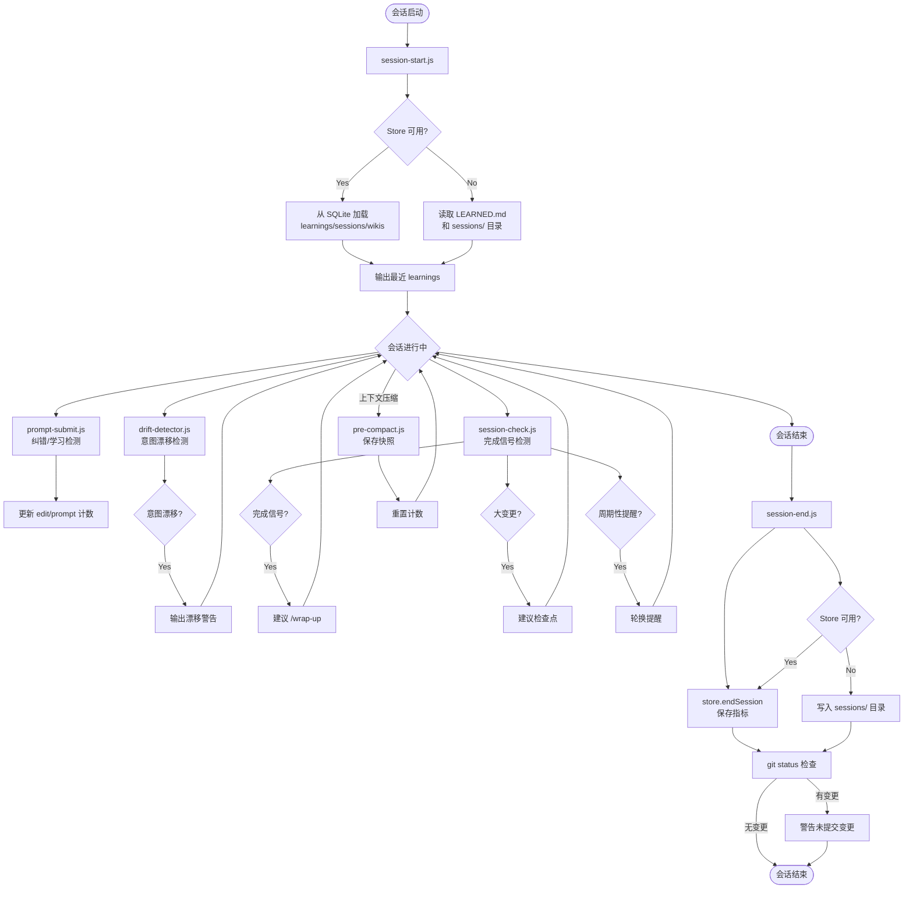

# 会话生命周期脚本

<cite>
**本文引用的文件**
- [pro-workflow/scripts/session-start.js](file://pro-workflow/scripts/session-start.js)
- [pro-workflow/scripts/session-end.js](file://pro-workflow/scripts/session-end.js)
- [pro-workflow/scripts/session-check.js](file://pro-workflow/scripts/session-check.js)
- [pro-workflow/scripts/drift-detector.js](file://pro-workflow/scripts/drift-detector.js)
- [pro-workflow/scripts/pre-compact.js](file://pro-workflow/scripts/pre-compact.js)
- [pro-workflow/scripts/prompt-submit.js](file://pro-workflow/scripts/prompt-submit.js)
- [src/electron/libs/session-store.ts](file://src/electron/libs/session-store.ts)
- [src/electron/libs/runner.ts](file://src/electron/libs/runner.ts)
- [src/electron/libs/runner-reuse.ts](file://src/electron/libs/runner-reuse.ts)
- [src/electron/ipc-handlers.ts](file://src/electron/ipc-handlers.ts)
- [src/electron/types.ts](file://src/electron/types.ts)
- [src/electron/libs/workflow-catalog.ts](file://src/electron/libs/workflow-catalog.ts)
- [src/electron/libs/channel-workspace.ts](file://src/electron/libs/channel-workspace.ts)
</cite>

---

## 目录

- [概述](#概述)
- [脚本职责矩阵](#脚本职责矩阵)
- [session-start.js：初始化会话](#session-startjs初始化会话)
- [session-end.js：会话归档与指标收集](#session-endjs会话归档与指标收集)
- [session-check.js：完成信号与大变更检测](#session-checkjs完成信号与大变更检测)
- [脚本间数据共享机制](#脚本间数据共享机制)
- [关键数据结构](#关键数据结构)
- [IPC 与 Electron 集成](#ipc-与-electron-集成)
- [Agent 改代码地图](#agent-改代码地图)
- [故障排查指南](#故障排查指南)

---

## 概述

tech-cc-hub 的会话生命周期由一组 Node.js 脚本管理，嵌入在 Claude Code 的 hook 体系中运行。这些脚本负责：

1. **会话启动** — 初始化工作目录、加载历史上下文（learnings、sessions、wikis）
2. **会话进行中** — 检测完成信号、意图漂移、上下文压缩前的状态保存、纠错触发
3. **会话结束** — 归档会话数据、收集指标（edits/corrections/prompts）、检查未提交变更

所有脚本通过 **文件系统**（`os.tmpdir()/pro-workflow/`）共享状态，通过 **`CLAUDE_SESSION_ID` 环境变量** 关联同一会话。

图表来源：[pro-workflow/scripts/session-start.js#L30-L45](file://pro-workflow/scripts/session-start.js#L30-L45)、[pro-workflow/scripts/session-end.js#L45-L75](file://pro-workflow/scripts/session-end.js#L45-L75)

---

## 脚本职责矩阵

| 脚本 | 触发时机 | 核心职责 | 输出位置 |
|------|----------|----------|----------|
| `session-start.js` | 会话启动 | 加载 learnings/sessions/wikis，检测 git worktrees | stderr 日志 |
| `session-end.js` | 会话结束 | 归档会话，统计 edit/correction/prompt 计数 | SQLite 或 tmp Markdown |
| `session-check.js` | 每次响应后 | 完成信号检测、大变更提示、定期提醒 | stderr 日志 |
| `drift-detector.js` | 每次交互后 | 意图漂移检测，关键字重叠度计算 | stderr 日志 |
| `pre-compact.js` | 上下文压缩前 | 保存编辑/提示计数快照 | `compacts/{date}-{id}.json` |
| `prompt-submit.js` | 每次提交后 | 纠错模式识别、学习触发检测 | stderr 日志 + DB 更新 |

章节来源：[pro-workflow/scripts/session-check.js#L1-L10](file://pro-workflow/scripts/session-check.js#L1-L10)

---

## session-start.js：初始化会话

### 职责

在 Claude 会话启动时执行，加载有助于当前工作的上下文信息：

1. **数据库路径解析** — 尝试加载 `dist/db/store.js`，若不存在则回退到文件系统
2. **最近 learnings** — 通过 `getRecentLearnings(store.db, 5, projectName)` 获取最近的模式学习
3. **最近会话摘要** — `store.getRecentSessions(3)` 返回上一次会话的日期、编辑数、纠错数
4. **可用 wikis 列表** — 调用 `store.listWikis()` 枚举项目相关的知识库
5. **Git worktrees 检测** — `git worktree list` 识别并行开发分支

章节来源：[pro-workflow/scripts/session-start.js#L20-L45](file://pro-workflow/scripts/session-start.js#L20-L45)

### 入口函数

```javascript
async function main() {
  const projectRoot = findProjectRoot();          // L31 - 向上查找 .git 目录
  const sessionId = process.env.CLAUDE_SESSION_ID || String(process.ppid) || 'default';  // L35
  let store = getStore();                          // L39 - 尝试加载 DB store

  if (store) {
    store.startSession(sessionId, projectName);   // L46 - 注册会话
    const recentLearnings = getRecentLearnings(store.db, 5, projectName);  // L50
    const recentSessions = store.getRecentSessions(3);  // L62
    // ... 枚举 wikis
  } else {
    // 文件系统回退：读取 .claude/LEARNED.md
    const content = fs.readFileSync(learnedFile, 'utf8');  // L89
  }
}
```

### 关键配置项

| 配置项 | 来源 | 说明 |
|--------|------|------|
| `CLAUDE_SESSION_ID` | 环境变量 | 会话唯一标识，默认用父进程 ID |
| `projectName` | `path.basename(projectRoot)` | 用于数据库查询过滤 |
| `learnedFile` | `.claude/LEARNED.md` | 无数据库时的 learnings 来源 |

章节来源：[pro-workflow/scripts/session-start.js#L31-L36](file://pro-workflow/scripts/session-start.js#L31-L36)

---

## session-end.js：会话归档与指标收集

### 职责

在会话结束时执行，负责：

1. **指标持久化** — 调用 `store.endSession(sessionId)` 保存 `edit_count`、`corrections_count`、`prompts_count`
2. **文件系统回退** — 若无数据库，生成 `sessions/{date}-{shortId}.md` 归档文件
3. **未提交变更警告** — `git status --porcelain` 检测工作区脏状态

章节来源：[pro-workflow/scripts/session-end.js#L57-L75](file://pro-workflow/scripts/session-end.js#L57-L75)

### 数据库写入流程

```javascript
// session-end.js L59-L66
const session = store.getSession(sessionId);   // L59
if (session) {
  store.endSession(sessionId);                  // L62 - 更新 sessions 表
  log(`[ProWorkflow] Session saved to database:`);
  log(`  - Edits: ${session.edit_count}`);      // L64
  log(`  - Corrections: ${session.corrections_count}`);  // L65
  log(`  - Prompts: ${session.prompts_count}`); // L66
}
```

### 文件系统回退模板

```javascript
// session-end.js L90-L104
const template = `# Session: ${today}
**Started:** ${time}
**Ended:** ${time}
**Project:** ${projectName}

## Summary
[What was accomplished]

## Learnings
[Patterns discovered]

## Next Steps
[What to do next]
`;
```

章节来源：[pro-workflow/scripts/session-end.js#L90-L104](file://pro-workflow/scripts/session-end.js#L90-L104)

---

## session-check.js：完成信号与大变更检测

### 职责

在 Claude 每次响应后运行，检查是否应提醒用户：

1. **完成信号检测** — 正则匹配 "all changes committed"、"PR created"、"successfully deployed" 等
2. **大变更检测** — 识别 "N files changed"、"refactored N modules" 等模式
3. **周期性提醒** — 每 20 次响应轮换提醒类型（wrap-up / learn-rule / compact）
4. **长会话警告** — 第 50 次响应时强烈建议 wrap-up 和 compact

章节来源：[pro-workflow/scripts/session-check.js#L28-L49](file://pro-workflow/scripts/session-check.js#L28-L49)

### 完成信号正则

```javascript
// session-check.js L30-L38
const signals = [
  /all (changes|files|tests|updates) (are |have been )?(committed|pushed|complete|done|pass)/i,
  /successfully (created|merged|deployed|published|released)/i,
  /PR (created|merged|opened)/i,
  /implementation is complete/i,
  /everything (looks good|is working|passes)/i,
  /all \d+ tests pass/i
];
```

### 大变更检测正则

```javascript
// session-check.js L43-L48
const patterns = [
  /(\d+) files? (changed|modified|updated|created)/i,
  /across \d+ files/i,
  /refactored? \d+ (files?|modules?|components?)/i
];
```

图表来源：[pro-workflow/scripts/session-check.js#L30-L48](file://pro-workflow/scripts/session-check.js#L30-L48)

---

## drift-detector.js：意图漂移检测

### 职责

监控用户意图是否发生漂移，避免 Agent 在错误方向上消耗 token：

1. **初始意图提取** — 从第一句话提取 `intent` 和关键词
2. **编辑计数追踪** — 每轮增加 `editsSinceLastTouch`
3. **相关性计算** — `overlap / intentKeywords.length` 得出 relevance
4. **漂移阈值** — 6 次编辑 + relevance < 0.2 时触发警告
5. **新意图识别** — "now let's"、"switch to"、"forget it" 等模式

章节来源：[pro-workflow/scripts/drift-detector.js#L39-L67](file://pro-workflow/scripts/drift-detector.js#L39-L67)

```javascript
// drift-detector.js L62-L67
if (state.editsSinceLastTouch >= 6 && relevance < 0.2) {
  log(`[ProWorkflow] Drift check: ${state.editsSinceLastTouch} edits since original goal`);
  log(`[ProWorkflow] Original intent: "${state.intent}"`);
  log('[ProWorkflow] Current work seems unrelated — refocusing or intentional tangent?');
  state.editsSinceLastTouch = 0;
}
```

---

## pre-compact.js：上下文压缩前状态保存

### 职责

在 Claude 执行上下文压缩前，将当前会话状态保存到文件：

1. **读取编辑计数** — 从 `edit-count-{sessionId}` 文件读取 `edits_before_compact`
2. **读取提示计数** — 从 `prompt-count-{sessionId}` 文件读取 `prompts_before_compact`
3. **写入压缩快照** — 保存到 `compacts/{date}-{shortId}.json`
4. **重置计数器** — 压缩后清零 edit/prompt 计数

章节来源：[pro-workflow/scripts/pre-compact.js#L55-L75](file://pro-workflow/scripts/pre-compact.js#L55-L75)

```javascript
// pre-compact.js L55-L75
const compactFile = path.join(compactDir, `${getDateString()}-${sessionId.slice(-6)}.json`);
const state = {
  timestamp: new Date().toISOString(),
  session_id: sessionId,
  summary: input.summary || 'No summary provided',
  edits_before_compact: ...,    // L66
  prompts_before_compact: ...   // L72
};
fs.writeFileSync(compactFile, JSON.stringify(state, null, 2));
```

---

## prompt-submit.js：纠错与学习触发检测

### 职责

在用户提交提示后分析内容：

1. **纠错模式检测** — 匹配 "that's wrong"、"you should"、"wrong file" 等
2. **学习触发检测** — 匹配 "remember this"、"add to rules"、"don't do that again" 等
3. **Wiki 搜索** — 对 3 词以上提示执行 `store.searchWiki(prompt, { limit: 3, loose: true })`
4. **计数更新** — 调用 `store.updateSessionCounts(sessionId, 0, isCorrection ? 1 : 0, 1)`

章节来源：[pro-workflow/scripts/prompt-submit.js#L42-L72](file://pro-workflow/scripts/prompt-submit.js#L42-L72)

```javascript
// prompt-submit.js L56-L58
const isCorrection = correctionPatterns.some(p => p.test(prompt));
if (isCorrection) {
  log('[ProWorkflow] Correction detected - use /learn to capture this pattern');
}

// prompt-submit.js L84-L86
if (session) {
  store.updateSessionCounts(sessionId, 0, isCorrection ? 1 : 0, 1);
  sessionUpdated = true;
}
```

---

## 脚本间数据共享机制

### 文件系统共享目录

```
/tmp/pro-workflow/                    # 根目录
├── response-count-{sessionId}        # session-check 写入的响应计数
├── intent-{sessionId}                # drift-detector 的意图状态
├── edit-log-{sessionId}              # drift-detector 的编辑日志
├── edit-count-{sessionId}           # prompt-submit 编辑计数
├── prompt-count-{sessionId}          # prompt-submit 提示计数
└── compacts/                          # pre-compact 输出
    └── {date}-{shortId}.json         # 压缩前快照
```

### SessionStore 数据库结构

来自 `src/electron/libs/session-store.ts`：

```sql
-- sessions 表（核心会话记录）
create table: sessions (
  id, title, claude_session_id, status,
  model, cwd, run_surface, agent_id, allowed_tools,
  last_prompt, continuation_summary, continuation_summary_message_count,
  workflow_markdown, workflow_source_layer, workflow_source_path,
  workflow_state, workflow_error, archived_at,
  created_at, updated_at
)

-- messages 表（消息历史）
create table: messages
```

### 环境变量约定

| 变量 | 来源 | 用途 |
|------|------|------|
| `CLAUDE_SESSION_ID` | Claude Code 运行时 | 跨脚本关联会话 |
| `CLAUDE_TRACE_ID` | Claude Code 运行时 | 追踪链 |

章节来源：[pro-workflow/scripts/session-check.js#L66](file://pro-workflow/scripts/session-check.js#L66)、[src/electron/libs/session-store.ts#L183-L210](file://src/electron/libs/session-store.ts#L183-L210)

---

## 会话生命周期流程图



图表来源：[pro-workflow/scripts/session-start.js#L30-L126](file://pro-workflow/scripts/session-start.js#L30-L126)、[pro-workflow/scripts/session-end.js#L45-L127](file://pro-workflow/scripts/session-end.js#L45-L127)、[pro-workflow/scripts/session-check.js#L51-L112](file://pro-workflow/scripts/session-check.js#L51-L112)

---

## 关键数据结构

### Session 类型定义

来自 `src/electron/types.ts`：

```typescript
// src/electron/types.ts L35-L56
export type Session = {
  id: string;
  title: string;
  claudeSessionId?: string;
  status: SessionStatus;  // "idle" | "running" | "completed" | "error"
  model?: string;
  cwd?: string;
  runSurface?: AgentRunSurface;  // "development" | "maintenance"
  agentId?: string;
  allowedTools?: string;
  lastPrompt?: string;
  continuationSummary?: string;
  continuationSummaryMessageCount?: number;
  workflowMarkdown?: string;
  workflowSourceLayer?: WorkflowScope;
  workflowState?: SessionWorkflowState;
  workflowError?: string;
  archivedAt?: number;
  pendingPermissions: Map<string, PendingPermission>;
  abortController?: AbortController;
};
```

### ServerEvent 类型

```typescript
// src/electron/types.ts L184-L214
export type ServerEvent =
  | { type: "stream.message"; payload: { sessionId: string; message: StreamMessage } }
  | { type: "session.status"; payload: { sessionId: string; status: SessionStatus; ... } }
  | { type: "session.plan.updated"; payload: SessionPlanSnapshot }
  | { type: "session.workflow"; payload: SessionWorkflowCatalog }
  | { type: "permission.request"; payload: { sessionId: string; toolUseId: string; toolName: string; input: unknown } }
  | { type: "runner.error"; payload: { sessionId?: string; message: string } }
  // ...
```

章节来源：[src/electron/types.ts#L35-L56](file://src/electron/types.ts#L35-L56)、[src/electron/types.ts#L184-L214](file://src/electron/types.ts#L184-L214)

---

## IPC 与 Electron 集成

### Electron IPC Handlers

来自 `src/electron/ipc-handlers.ts`：

```typescript
// ipc-handlers.ts L149-L156
function initializeSessions() {
  if (!sessions) {
    const dbPath = join(app.getPath("userData"), "sessions.db");
    sessions = new SessionStore(dbPath);
    sessions.recoverInterruptedSessions();
  }
  return sessions;
}

// ipc-handlers.ts L163-L175
function broadcast(event: ServerEvent) {
  const payload = JSON.stringify(event);
  const windows = BrowserWindow.getAllWindows();
  for (const win of windows) {
    win.webContents.send("server-event", payload);  // L170 - 推送到渲染进程
  }
  for (const listener of serverEventListeners) {
    listener(event);
  }
}
```

### IPC Channel 映射

| Channel | Handler | 说明 |
|---------|---------|------|
| `client-event` | `handleClientEvent` | 客户端 → 主进程 |
| `server-event` | `broadcast` | 主进程 → 客户端（WebSocket） |
| `sessions:list` | `listStoredSessionsForRenderer` | 枚举会话列表 |
| `generate-session-title` | `generateSessionTitle` | 生成会话标题 |

章节来源：[src/electron/ipc-handlers.ts#L163-L175](file://src/electron/ipc-handlers.ts#L163-L175)

### Preload 桥接

```typescript
// src/electron/preload.cts L12-L26
sendClientEvent: (event: any) => {
  electron.ipcRenderer.send("client-event", event);
},
onServerEvent: (callback: (event: any) => void) => {
  const cb = (_: Electron.IpcRendererEvent, payload: string) => {
    const event = JSON.parse(payload);
    callback(event);
  };
  electron.ipcRenderer.on("server-event", cb);
  return () => electron.ipcRenderer.off("server-event", cb);
}
```

章节来源：[src/electron/preload.cts#L12-L26](file://src/electron/preload.cts#L12-L26)

---

## Agent 改代码地图

### 先读文件

| 优先级 | 文件 | 理由 |
|--------|------|------|
| 1 | `src/electron/libs/session-store.ts` | SessionStore 类定义，数据库操作核心 |
| 2 | `src/electron/ipc-handlers.ts` | IPC 入口，`handleClientEvent` 定义 |
| 3 | `src/electron/libs/runner.ts` | `runClaude` 函数，执行引擎 |
| 4 | `src/electron/types.ts` | Session、ServerEvent 类型定义 |
| 5 | `pro-workflow/scripts/session-start.js` | Hook 脚本实现 |

### 关键符号

| 符号 | 文件位置 | 用途 |
|------|----------|------|
| `SessionStore` | `session-store.ts#L121` | 会话存储类 |
| `createSession()` | `session-store.ts#L159` | 创建新会话 |
| `getSession()` | `session-store.ts#L214` | 获取会话实例 |
| `endSession()` | `session-store.ts#L270` | 结束会话并保存指标 |
| `handleClientEvent` | `ipc-handlers.ts#L...` | 处理客户端事件入口 |
| `broadcast()` | `ipc-handlers.ts#L163` | 向渲染进程推送事件 |
| `runClaude()` | `runner.ts#L213` | 执行 Claude 请求 |

### IPC 通道

| Channel | 方向 | 数据类型 |
|---------|------|----------|
| `client-event` | Renderer → Main | `ClientEvent` |
| `server-event` | Main → Renderer | `ServerEvent` JSON |
| `sessions:list` | Renderer → Main | `SessionInfo[]` |

### 修改入口

1. **添加新 Hook** — 在 `pro-workflow/scripts/` 创建 JS 文件，配置到 Claude Code hook
2. **修改会话状态** — 编辑 `session-store.ts` 的 `SessionStore` 类方法
3. **新增 IPC 事件** — 在 `ipc-handlers.ts` 添加 `ipcMain.handle`，在 `preload.cts` 暴露
4. **修改类型** — 编辑 `src/electron/types.ts` 的 `ServerEvent` 联合类型

### 验证命令

```bash
# 运行 session-start 测试
node pro-workflow/scripts/session-start.js

# 运行 session-check（带 stdin）
echo '{"session_id":"test","last_assistant_message":"all tests pass"}' | node pro-workflow/scripts/session-check.js

# 检查数据库
sqlite3 ~/.local/share/tech-cc-hub/sessions.db "SELECT * FROM sessions LIMIT 5;"
```

### 常见回归风险

| 风险 | 影响 | 缓解措施 |
|------|------|----------|
| Store 不可用时未回退文件系统 | 会话指标丢失 | `getStore()` 有 try-catch，session-end 有 else 分支 |
| `CLAUDE_SESSION_ID` 未设置 | 多会话数据混淆 | 默认使用 `process.ppid` |
| 数据库未初始化 | 应用崩溃 | `initializeSessions()` 在需要时才调用 |
| IPC 事件 JSON 解析失败 | UI 无响应 | `preload.cts` 有 try-catch 保护 |

章节来源：[pro-workflow/scripts/session-end.js#L50-L55](file://pro-workflow/scripts/session-end.js#L50-L55)、[src/electron/ipc-handlers.ts#L149-L156](file://src/electron/ipc-handlers.ts#L149-L156)

---

## 故障排查指南

### 问题：session-start 无输出

**排查步骤**：

1. 检查 `dist/db/store.js` 是否存在
   ```bash
   ls -la pro-workflow/dist/db/store.js
   ```

2. 检查 `CLAUDE_SESSION_ID` 是否设置
   ```bash
   echo $CLAUDE_SESSION_ID
   ```

3. 直接运行脚本查看错误
   ```bash
   node pro-workflow/scripts/session-start.js 2>&1
   ```

### 问题：会话指标全为 0

**原因**：数据库未初始化或 `updateSessionCounts` 未调用

**排查步骤**：

1. 检查 `prompt-submit.js` 是否通过 stdin 接收到数据
   ```bash
   echo '{"session_id":"test","prompt":"fix the bug"}' | node pro-workflow/scripts/prompt-submit.js 2>&1
   ```

2. 直接查询 SQLite
   ```bash
   sqlite3 sessions.db "SELECT id, edit_count, corrections_count, prompts_count FROM sessions;"
   ```

### 问题：drift-detector 未触发警告

**原因**：`editsSinceLastTouch` 计数未增加或 relevance 计算异常

**排查步骤**：

1. 检查临时文件是否存在
   ```bash
   cat /tmp/pro-workflow/intent-{sessionId}
   cat /tmp/pro-workflow/edit-log-{sessionId}
   ```

2. 验证关键词重叠计算逻辑
   ```javascript
   // drift-detector.js L59-L60
   const overlap = intentKeywords.filter(k => promptKeywords.includes(k)).length;
   const relevance = intentKeywords.length > 0 ? overlap / intentKeywords.length : 1;
   ```

### 问题：pre-compact 未生成文件

**原因**：目录 `compacts/` 不存在或无写入权限

**排查步骤**：

1. 检查目录创建逻辑
   ```bash
   ls -la /tmp/pro-workflow/compacts/
   ```

2. 验证 `ensureDir` 函数是否被调用
   ```javascript
   // pre-compact.js L53
   ensureDir(compactDir);
   ```

章节来源：[pro-workflow/scripts/session-start.js#L38-L42](file://pro-workflow/scripts/session-start.js#L38-L42)、[pro-workflow/scripts/pre-compact.js#L19-L23](file://pro-workflow/scripts/pre-compact.js#L19-L23)

---

## 扩展点

### 添加新 Hook 脚本

1. 在 `pro-workflow/scripts/` 创建 `.js` 文件
2. 实现 `main()` 异步函数
3. 通过 stdin 接收 JSON 输入，stdout 输出修改后的 JSON
4. 使用 `log()` 输出到 stderr（显示在 Claude 输出中）

### 添加新会话指标

1. 在 `session-store.ts` 添加列定义
2. 在 `session-end.js` 写入新指标
3. 在 `ipc-handlers.ts` 的 `listStoredSessionsForRenderer` 返回新字段

### 修改 ServerEvent 类型

1. 在 `src/electron/types.ts` 的 `ServerEvent` 联合类型添加新变体
2. 在 `ipc-handlers.ts` 的 `broadcast()` 调用处添加处理逻辑
3. 在前端对应的 `server-event` 监听器中处理新事件

章节来源：[pro-workflow/scripts/session-check.js#L58-L60](file://pro-workflow/scripts/session-check.js#L58-L60)、[src/electron/types.ts#L184-L214](file://src/electron/types.ts#L184-L214)

---

*文档版本：1.0.0 | 最后更新：基于 tech-cc-hub 代码证据地图*