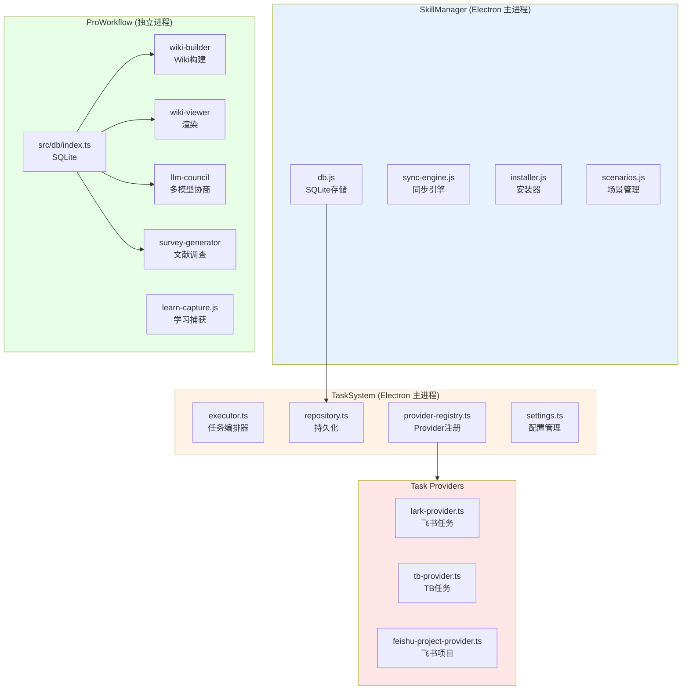
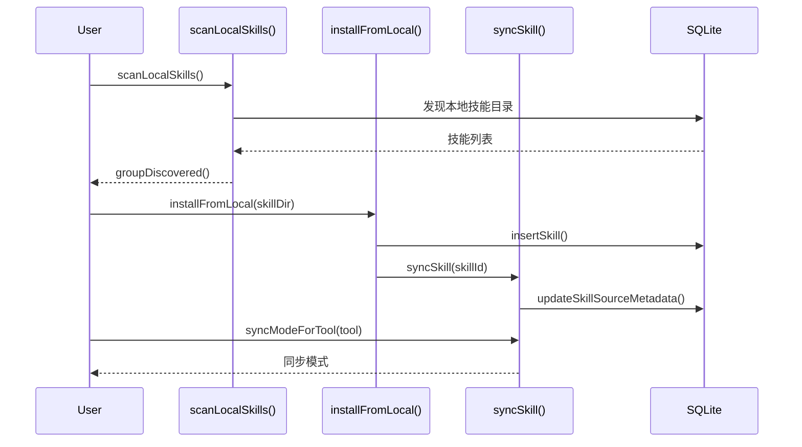
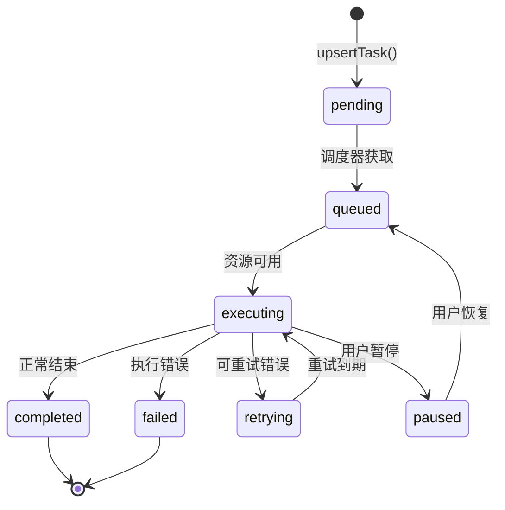

# 工作流与技能

<cite>

**本文引用的文件**

- [src/electron/libs/skill-manager/index.ts](file://src/electron/libs/skill-manager/index.ts)
- [pro-workflow/src/db/index.ts](file://pro-workflow/src/db/index.ts)
- [pro-workflow/skills/wiki-builder/scripts/wiki-cli.js](file://pro-workflow/skills/wiki-builder/scripts/wiki-cli.js)
- [pro-workflow/skills/wiki-viewer/scripts/render.js](file://pro-workflow/skills/wiki-viewer/scripts/render.js)
- [pro-workflow/scripts/learn-capture.js](file://pro-workflow/scripts/learn-capture.js)
- [pro-workflow/skills/llm-council/scripts/council.js](file://pro-workflow/skills/llm-council/scripts/council.js)
- [pro-workflow/skills/survey-generator/scripts/build-survey.js](file://pro-workflow/skills/survey-generator/scripts/build-survey.js)
- [pro-workflow/skills/wiki-builder/scripts/init_wiki.sh](file://pro-workflow/skills/wiki-builder/scripts/init_wiki.sh)
- [src/electron/libs/task/README.md](file://src/electron/libs/task/README.md)
- [src/electron/libs/task/index.ts](file://src/electron/libs/task/index.ts)
- [src/electron/libs/task/executor.ts](file://src/electron/libs/task/executor.ts)
- [src/electron/libs/task/provider-registry.ts](file://src/electron/libs/task/provider-registry.ts)
- [src/electron/libs/task/providers/feishu-project-provider.ts](file://src/electron/libs/task/providers/feishu-project-provider.ts)
- [src/electron/libs/task/providers/lark-provider.ts](file://src/electron/libs/task/providers/lark-provider.ts)
- [src/electron/libs/task/providers/tb-provider.ts](file://src/electron/libs/task/providers/tb-provider.ts)
- [src/electron/libs/task/repository.ts](file://src/electron/libs/task/repository.ts)
- [src/electron/libs/task/settings.ts](file://src/electron/libs/task/settings.ts)
- [src/electron/libs/task/types.ts](file://src/electron/libs/task/types.ts)

</cite>

---

## 目录

- [1. 整体架构概览](#1-整体架构概览)
- [2. SkillManager 技能管理系统](#2-skillmanager-技能管理系统)
- [3. ProWorkflow 脚本体系](#3-proworkflow-脚本体系)
- [4. 任务系统（TaskSystem）](#4-任务系统tasksystem)
- [5. Provider 适配器体系](#5-provider-适配器体系)
- [6. 工作流与核心模块集成](#6-工作流与核心模块集成)
- [7. 数据库 Schema 与存储边界](#7-数据库-schema-与存储边界)
- [8. IPC 事件模型](#8-ipc-事件模型)
- [9. 常见失败模式与排障](#9-常见失败模式与排障)
- [10. Agent 改代码地图](#10-agent-改代码地图)

---

## 1. 整体架构概览

`tech-cc-hub` 的工作流与技能体系由两大核心子系统构成：

| 子系统 | 职责 | 主存储 |
|--------|------|--------|
| **SkillManager** | 管理 AI 技能的安装、同步、场景编排 | `~/.pro-workflow/` (better-sqlite3) |
| **TaskSystem** | 任务拉取、编排执行、结果回写 | 与 SkillManager 共享同一 db 路径，通过 `userDataPath` 隔离 |
| **ProWorkflow Scripts** | Wiki 构建、调查生成、LLM Council | `pro-workflow/dist/db/store.js` |



> **图表来源**：[src/electron/libs/skill-manager/index.ts](file://src/electron/libs/skill-manager/index.ts#L1-L88) + [src/electron/libs/task/index.ts](file://src/electron/libs/task/index.ts#L1-L37)

---

## 2. SkillManager 技能管理系统

### 2.1 模块边界

`src/electron/libs/skill-manager/index.ts` 是统一出口，Re-export 了所有子模块：[src/electron/libs/skill-manager/index.ts#L1-L88](file://src/electron/libs/skill-manager/index.ts#L1-L88)

### 2.2 核心导出符号

| 符号 | 来源文件 | 用途 |
|------|----------|------|
| `getDb`, `getAllSkills`, `getSkillById` | `db.js` | 技能 CRUD |
| `insertSkill`, `updateSkillAfterInstall` | `db.js` | 安装流程写库 |
| `getAllScenarios`, `getActiveScenarioId` | `db.js` | 场景查询 |
| `ensureCentralRepo`, `centralSkillsDir` | `central-repo.js` | 中心仓库路径 |
| `defaultToolAdapters`, `findAdapter` | `tool-adapters.js` | 工具适配器查找 |
| `inferSkillName`, `syncSkill` | `sync-engine.js` | 技能同步 |
| `installFromLocal` | `installer.js` | 本地安装 |
| `scanLocalSkills`, `groupDiscovered` | `scanner.js` | 技能扫描 |
| `getAllScenarioDtos`, `createScenario` | `scenarios.js` | 场景管理 |
| `fetchLeaderboard`, `searchSkillssh` | `marketplace.js` | 市场搜索 |

### 2.3 技能生命周期



> **章节来源**：[src/electron/libs/skill-manager/index.ts#L62-L71](file://src/electron/libs/skill-manager/index.ts#L62-L71)

### 2.4 场景与 Target

- **场景 (Scenario)**：一组技能的编排配置，通过 `addSkillToScenario()` 和 `removeSkillFromScenarioAndSync()` 管理
- **Target**：技能的目标配置，支持多目标同步
- **Tags**：技能标签，用于搜索和筛选

---

## 3. ProWorkflow 脚本体系

### 3.1 数据库初始化

`pro-workflow/src/db/index.ts` 提供 SQLite 初始化：[pro-workflow/src/db/index.ts#L23-L48](file://pro-workflow/src/db/index.ts#L23-L48)

```typescript
// 关键符号
interface ProWorkflowConfig { dbPath: string }
function getDefaultDbPath(): string   // -> ~/.pro-workflow/data.db
function initializeDatabase(dbPath?): Database.Database
```

**初始化流程**：
1. `ensureDbDir()` 确保 `~/.pro-workflow/` 存在
2. 创建 `better-sqlite3` 实例，启用 WAL 和外键约束
3. 加载 `schema.sql`，尝试路径：`./schema.sql` 或 `../../src/db/schema.sql`
4. 若 schema 文件缺失，抛出错误提示运行 `npm run build`

> **章节来源**：[pro-workflow/src/db/index.ts](file://pro-workflow/src/db/index.ts#L1-L55)

### 3.2 Wiki Builder

`wiki-cli.js` 是 Wiki 管理的 CLI 入口：[pro-workflow/skills/wiki-builder/scripts/wiki-cli.js#L1-L231](file://pro-workflow/skills/wiki-builder/scripts/wiki-cli.js#L1-L231)

| 命令 | 入口函数 | 功能 |
|------|----------|------|
| `init <slug>` | `cmdInit()` | 初始化 Wiki，执行 `init_wiki.sh` 并写入数据库 |
| `list [--scope]` | `cmdList()` | 列出 Wikis，支持 `--json` |
| `info <slug>` | `cmdInfo()` | 显示 Wiki 详情和页面数 |
| `page <slug> <rel-path>` | `cmdPage()` | 插入/更新 Wiki 页面，含内容哈希 |
| `reindex <slug>` | `cmdReindex()` | 重新扫描 Wiki 目录，建立页面索引 |

**参数说明**：
- `--scope global|project`：全局或项目级 Wiki
- `--flavor research|paper|domain|...`：Wiki 类型，影响目录结构
- `--root`：自定义根目录
- `--from-file`：从文件加载页面内容

**安全边界**：页面路径必须位于 Wiki root 内，否则拒绝（防止路径遍历）

> **章节来源**：[pro-workflow/skills/wiki-builder/scripts/wiki-cli.js#L53-L146](file://pro-workflow/skills/wiki-builder/scripts/wiki-cli.js#L53-L146)

### 3.3 Wiki Viewer 渲染器

`render.js` 将 Markdown 转换为 HTML：[pro-workflow/skills/wiki-viewer/scripts/render.js#L1-L579](file://pro-workflow/skills/wiki-viewer/scripts/render.js#L1-L579)

**关键符号**：
- `renderMarkdown()`：解析 Markdown 行，支持代码块、列表、表格、引用
- `buildLinkGraph()`：提取页面间链接，构建关系图
- `svgGraph()`：生成 SVG 可视化图
- `buildHtml()`：组装完整 HTML 页面，含搜索索引、来源表、种子列表

**搜索索引**：`indexLine()` 函数提取 3-24 字符的词元，最多 200 个，构建 `search_blob` 字段

> **章节来源**：[pro-workflow/skills/wiki-viewer/scripts/render.js#L41-L129](file://pro-workflow/skills/wiki-viewer/scripts/render.js#L41-L129)

### 3.4 LLM Council

`council.js` 实现多模型协商决策：[pro-workflow/skills/llm-council/scripts/council.js#L1-L287](file://pro-workflow/skills/llm-council/scripts/council.js#L1-L287)

**Provider 配置**：
```javascript
const PROVIDERS = {
  anthropic: { envKey: 'ANTHROPIC_API_KEY', baseUrl: 'https://api.anthropic.com', ... },
  openai:    { envKey: 'OPENAI_API_KEY', baseUrl: 'https://api.openai.com/v1', ... },
  openrouter:{ envKey: 'OPENROUTER_API_KEY', baseUrl: 'https://openrouter.ai/api/v1', ... },
  fireworks: { envKey: 'FIREWORKS_API_KEY', baseUrl: 'https://api.fireworks.ai/inference/v1', ... },
  custom:    { envKey: 'LLM_COUNCIL_API_KEY', baseUrl: process.env.LLM_COUNCIL_BASE_URL, ... }
};
```

**三阶段流程**：
1. **Phase 1**：所有模型独立响应（`callProvider`）
2. **Phase 2**：每个模型对所有响应排名（匿名化）
3. **Phase 3**：Chairman 综合生成最终结论

**输出持久化**：调用 `persistToWiki()` 将结果写入 Wiki 的 `derived/council/` 目录

> **章节来源**：[pro-workflow/skills/llm-council/scripts/council.js#L159-L244](file://pro-workflow/skills/llm-council/scripts/council.js#L159-L244)

### 3.5 Survey Generator

`build-survey.js` 生成文献调查：[pro-workflow/skills/survey-generator/scripts/build-survey.js#L1-L240](file://pro-workflow/skills/survey-generator/scripts/build-survey.js#L1-L240)

**核心流程**：
1. `buildPrompt()` 构建提示词，要求模型生成带引用的调查
2. 通过 LLM Council 生成调查（可调用 `COUNCIL` 脚本）
3. `appendBibliographyToSources()` 将新文献追加到 `sources.md`

**引用格式**：`[^src-bib-{slug}]` 用于正文引用，References 段列出完整信息

> **章节来源**：[pro-workflow/skills/survey-generator/scripts/build-survey.js#L131-L162](file://pro-workflow/skills/survey-generator/scripts/build-survey.js#L131-L162)

### 3.6 Learn Capture

`learn-capture.js` 从对话中捕获学习内容：[pro-workflow/scripts/learn-capture.js#L1-L66](file://pro-workflow/scripts/learn-capture.js#L1-L66)

**正则模式**：
```
[LEARN] <category>: <rule>
Mistake: <错误描述>
Correction: <纠正>
Wiki: <wiki-slug>
```

从 `assistant_response` 字段提取，存入数据库。可选关联到 Wiki slug。

> **章节来源**：[pro-workflow/scripts/learn-capture.js#L28-L52](file://pro-workflow/scripts/learn-capture.js#L28-L52)

---

## 4. 任务系统（TaskSystem）

### 4.1 模块边界

`src/electron/libs/task/README.md` 定义了职责边界：[src/electron/libs/task/README.md](file://src/electron/libs/task/README.md#L1-L23)

| 模块 | 文件 | 职责 |
|------|------|------|
| 类型定义 | `types.ts` | `ExternalTask`, `StoredTask`, `TaskExecution`, IPC payload |
| Provider 注册 | `provider-registry.ts` | 动态注册、查找、验证 Provider |
| 持久化 | `repository.ts` | SQLite schema、任务状态、执行记录 |
| 配置管理 | `settings.ts` | `TaskWorkflowSettings` 读写 |
| 编排器 | `executor.ts` | 轮询、自动执行、并发控制、重试 |

### 4.2 核心类型

`types.ts` 定义的关键类型：[src/electron/libs/task/types.ts](file://src/electron/libs/task/types.ts#L1-L241)

```typescript
// Provider 标识
type TaskProviderId = "lark" | "tb" | "feishu-project"

// 外部状态（来自第三方）
type ExternalTaskStatus = "pending" | "in_progress" | "done" | "cancelled"

// 本地状态（含执行阶段）
type LocalTaskStatus = ExternalTaskStatus | "queued" | "executing" | "retrying" | "paused" | "completed" | "failed"

// 任务执行
type TaskExecution = {
  id: string; taskId: string; sessionId: string;
  status: "running" | "completed" | "failed" | "cancelled";
  attempt?: number; driverId?: TaskAgentDriverId;
  model?: string; reasoningMode?: TaskReasoningMode;
  inputTokens?: number; outputTokens?: number; estimatedCostUsd?: number;
  startedAt: number; completedAt?: number; lastEventAt?: number;
  terminalReason?: string; result?: string; error?: string;
}
```

> **章节来源**：[src/electron/libs/task/types.ts#L3-L101](file://src/electron/libs/task/types.ts#L3-L101)

### 4.3 TaskExecutor 编排逻辑

`executor.ts` 的核心逻辑：[src/electron/libs/task/executor.ts#L89-L116](file://src/electron/libs/task/executor.ts#L89-L116)

```typescript
class TaskExecutor {
  // 配置
  private workflow: TaskWorkflowConfig    // 轮询间隔、超时、重试参数
  private settings: TaskWorkflowSettings  // 用户配置

  // 状态
  private executingTasks = new Set<string>()
  private runningExecutions = new Map<string, RunningExecution>()
  private retryTimers = new Map<string, Timeout>()

  // 入口方法
  startPolling(intervalMs)   // 启动轮询，恢复中断执行
  stopPolling()              // 停止轮询，清除定时器
  syncProvider(providerId)   // 拉取外部任务
  syncAll()                  // 同步所有 Provider
  executeTask(taskId, options?)  // 手动执行任务
}
```

**编排 tick 顺序**：
1. `recoverInterruptedExecutions()` - 恢复中断的执行
2. `restoreRetryTimers()` - 恢复重试定时器
3. `syncAll({ silentErrors: true })` - 同步所有 Provider
4. `dispatchDueRetries()` - 分发到期的重试
5. `detectStalledExecutions()` - 检测卡死的执行
6. `reapStaleExecutions()` - 收割超时的执行

> **章节来源**：[src/electron/libs/task/executor.ts#L180-L210](file://src/electron/libs/task/executor.ts#L180-L210)

### 4.4 任务生命周期流



> **图表来源**：[src/electron/libs/task/types.ts#L12-L19](file://src/electron/libs/task/types.ts#L12-L19)

---

## 5. Provider 适配器体系

### 5.1 注册机制

`provider-registry.ts` 实现 Provider 动态注册：[src/electron/libs/task/provider-registry.ts#L1-L73](file://src/electron/libs/task/provider-registry.ts#L1-L73)

```typescript
const registry = new Map<TaskProviderId, TaskProvider>()

function registerTaskProvider(provider: TaskProvider): void
function getTaskProvider(id: TaskProviderId): TaskProvider | undefined
function listTaskProviders(): TaskProvider[]
function ensureProvider(id: TaskProviderId): TaskProvider  // 不存在则返回 NoopProvider

class NoopProvider implements TaskProvider {
  isEnabled() { return false }
  async validateConfig() { return { valid: false } }
}
```

### 5.2 Provider 接口

`TaskProvider` 接口定义：[src/electron/libs/task/types.ts#L229-L240](file://src/electron/libs/task/types.ts#L229-L240)

```typescript
interface TaskProvider {
  readonly id: TaskProviderId
  readonly name: string
  isEnabled?(): boolean
  getCapabilities?(): TaskProviderCapability[]
  fetchTasks(): Promise<ExternalTask[]>
  getTask(externalId: string): Promise<ExternalTask | null>
  updateTaskStatus(externalId: string, status: ExternalTaskStatus): Promise<void>
  appendTaskComment?(externalId: string, text: string): Promise<void>
  deleteTask?(externalId: string): Promise<void>
  validateConfig(): Promise<{ valid: boolean; error?: string }>
}
```

### 5.3 已注册的 Provider

| Provider ID | 类名 | 配置来源 | 能力 |
|-------------|------|----------|------|
| `lark` | `LarkTaskProvider` | `channels.items.lark` 或 `LARK_CLI_COMMAND` 环境变量 | fetch, status-writeback, comment-writeback, delete, cli-configurable |
| `tb` | `TbTaskProvider` | `TaskWorkflowSettings.tbCliCommand` | fetch, status-writeback, comment-writeback, delete, cli-configurable |
| `feishu-project` | `FeishuProjectTaskProvider` | `feishuProject` 或 `FEISHU_PROJECT_*` 环境变量 | fetch, status-writeback, comment-writeback, delete |

### 5.4 Provider 配置解析

**Lark Provider**：[src/electron/libs/task/providers/lark-provider.ts#L112-L122](file://src/electron/libs/task/providers/lark-provider.ts#L112-L122)

```typescript
function resolveLarkChannelConfig(): LarkProviderConfig {
  const rootConfig = loadGlobalRuntimeConfig()
  const channels = rootConfig.channels?.items?.lark ?? {}
  return {
    cliCommand: asText(lark.cliCommand) ?? asText(envConfig.LARK_CLI_COMMAND),
    cliProfile: asText(lark.cliProfile) ?? asText(envConfig.LARK_CLI_PROFILE),
  }
}
```

**Feishu Project Provider**：[src/electron/libs/task/providers/feishu-project-provider.ts#L80-L92](file://src/electron/libs/task/providers/feishu-project-provider.ts#L80-L92)

```typescript
function resolveFeishuProjectConfig() {
  const rootConfig = loadGlobalRuntimeConfig()
  const envConfig = getGlobalRuntimeEnvConfig()
  const cliCommand = envConfig.FEISHU_PROJECT_CLI ?? "feishu-project"
  const workItemType = envConfig.FEISHU_PROJECT_WORK_ITEM_TYPE ?? rootConfig.feishuProject.workItemType ?? "task"
  const projectKey = envConfig.FEISHU_PROJECT_KEY ?? rootConfig.feishuProject.projectKey
  return { cliCommand, workItemType, projectKey }
}
```

**TB Provider**：[src/electron/libs/task/providers/tb-provider.ts#L38-L58](file://src/electron/libs/task/providers/tb-provider.ts#L38-L58)

使用模板机制：`tbFetchArgsTemplate`, `tbUpdateArgsTemplate`, `tbCommentArgsTemplate`
模板语法：`{{externalId}}`, `{{status}}`, `{{text}}`

---

## 6. 工作流与核心模块集成

### 6.1 Runner 集成

`TaskExecutor` 调用 Claude Runner 执行任务：[src/electron/libs/task/executor.ts#L23](file://src/electron/libs/task/executor.ts#L23)

```typescript
import { runClaude, type RunnerHandle } from "../runner.js"
import { getCurrentApiConfig } from "../claude-settings.js"
```

执行时创建独立 workspace，通过 `ensureTaskWorkspace()` 隔离任务环境。

### 6.2 SessionStore 集成

`TaskExecutor` 持有 `SessionStore` 引用，用于：
- 管理任务执行产生的 Session
- 查询历史执行记录

> **章节来源**：[src/electron/libs/task/executor.ts#L29](file://src/electron/libs/task/executor.ts#L29)

### 6.3 配置写入路径

`settings.ts` 使用 `loadGlobalRuntimeConfig()` 和 `saveGlobalRuntimeConfig()`：[src/electron/libs/task/settings.ts#L27-L42](file://src/electron/libs/task/settings.ts#L27-L42)

```typescript
const CONFIG_KEY = "tasks"  // 存储在顶层 config.tasks 下

function loadTaskSettings(): TaskWorkflowSettings {
  const rootConfig = loadGlobalRuntimeConfig()
  const raw = rootConfig[CONFIG_KEY] ?? {}
  return normalizeTaskSettings(raw, createDefaultTaskSettings())
}

function saveTaskSettings(settings): TaskWorkflowSettings {
  const rootConfig = loadGlobalRuntimeConfig()
  saveGlobalRuntimeConfig({ ...rootConfig, [CONFIG_KEY]: next })
}
```

---

## 7. 数据库 Schema 与存储边界

### 7.1 TaskSystem 表结构

`repository.ts` 创建的表：[src/electron/libs/task/repository.ts#L32-L135](file://src/electron/libs/task/repository.ts#L32-L135)

| 表名 | 主键 | 用途 |
|------|------|------|
| `tasks` | `id` | 任务主表，含 external_id/provider 唯一约束 |
| `task_executions` | `id` | 每次执行的记录 |
| `task_execution_logs` | `id` | 执行日志 |
| `task_subtasks` | `id` | 子任务分解 |
| `task_artifacts` | `id` | 执行产物 |
| `task_dismissals` | `(provider, external_id)` | 已忽略的外部任务 |

**索引**：
- `idx_tasks_provider` - 按 Provider 筛选
- `idx_tasks_local_status` - 按本地状态筛选
- `idx_tasks_external_id` - 外部 ID + Provider 查找
- `idx_tasks_retry_due` - 重试调度
- `idx_task_executions_task` - 执行到任务
- `idx_task_execution_logs_exec` - 日志到执行

### 7.2 Schema 迁移策略

`resetTaskTablesIfOutdated()` 检测列是否完整：[src/electron/libs/task/repository.ts#L138-L182](file://src/electron/libs/task/repository.ts#L138-L182)

```typescript
// 若 tasks 表缺少 claim_state、retry_attempt 等列，则删除所有表重建
if (hasTasksColumns && hasExecutionColumns && hasChildTables) return
this.db.exec(`DROP TABLE IF EXISTS task_artifacts; ... DROP TABLE IF EXISTS tasks;`)
```

### 7.3 ProWorkflow Store

`pro-workflow/src/db/index.ts` 的 Store 在 `dist/db/store.js`，由构建产物提供。运行时检查文件是否存在：

```javascript
function getStore() {
  const distPath = path.join(PRO_WORKFLOW_ROOT, 'dist', 'db', 'store.js')
  if (!fs.existsSync(distPath)) {
    die(`Built store missing at ${distPath}. Run: npm install && npm run build`)
  }
  return require(distPath).createStore()
}
```

> **章节来源**：[pro-workflow/skills/wiki-builder/scripts/wiki-cli.js#L10-L18](file://pro-workflow/skills/wiki-builder/scripts/wiki-cli.js#L10-L18)

---

## 8. IPC 事件模型

### 8.1 Server → Client 事件

`TaskServerEvent` 定义：[src/electron/libs/task/types.ts#L202-L214](file://src/electron/libs/task/types.ts#L202-L214)

| 事件 | payload | 触发时机 |
|------|---------|----------|
| `task.list` | `{ tasks: StoredTask[] }` | 列表查询 |
| `task.updated` | `{ task: StoredTask }` | 任务更新 |
| `task.execution.started` | `{ execution: TaskExecution }` | 开始执行 |
| `task.execution.completed` | `{ execution: TaskExecution }` | 执行完成 |
| `task.sync.completed` | `{ provider, count }` | Provider 同步完成 |
| `task.error` | `{ message }` | 发生错误 |

### 8.2 Client → Server 命令

`TaskClientEvent` 定义：[src/electron/libs/task/types.ts#L216-L227](file://src/electron/libs/task/types.ts#L216-L227)

| 命令 | payload | 功能 |
|------|---------|------|
| `task.execute` | `{ taskId, options? }` | 触发任务执行 |
| `task.control` | `{ taskId, action }` | pause/resume/cancel |
| `task.settings.update` | `{ settings }` | 更新配置 |

---

## 9. 常见失败模式与排障

### 9.1 Provider 未配置

```typescript
// Lark Provider 返回 NoopProvider 时
if (provider.isEnabled?.() === false) {
  events.onError?.(`${provider.name} 未启用或未配置`)
  return 0
}
```

**排查**：检查 `config-store` 中的 `channels.items.lark` 或 `LARK_CLI_COMMAND` 环境变量

### 9.2 CLI 执行超时

Provider 的 `runCli()` 方法有默认 30 秒超时：[src/electron/libs/task/providers/lark-provider.ts#L192](file://src/electron/libs/task/providers/lark-provider.ts#L192)

```typescript
private async runCli(args: string[], timeout = 30000): Promise<...> {
  const { stdout, stderr } = await runExternalCli(this.getCliCommand(), args, { timeout })
}
```

**排查**：检查 CLI 命令是否正确、网络是否可达、Lark token 是否过期

### 9.3 授权缺失

`LarkTaskProvider` 检测 `need_user_authorization` 错误：[src/electron/libs/task/providers/lark-provider.ts#L141-L148](file://src/electron/libs/task/providers/lark-provider.ts#L141-L148)

```javascript
if (errorMessage.includes("need_user_authorization")) {
  return "lark-cli 已配置 App，但还没有用户授权。运行: lark-cli auth login --domain task"
}
```

### 9.4 Wiki 构建产物缺失

`wiki-cli.js` 依赖 `dist/db/store.js`：[pro-workflow/skills/wiki-builder/scripts/wiki-cli.js#L11-L13](file://pro-workflow/skills/wiki-builder/scripts/wiki-cli.js#L11-L13)

**修复**：
```bash
cd pro-workflow && npm install && npm run build
```

### 9.5 Schema 文件未找到

`initializeDatabase()` 查找 `schema.sql` 失败时：[pro-workflow/src/db/index.ts#L36-L38](file://pro-workflow/src/db/index.ts#L36-L38)

```typescript
const candidates = [
  path.join(__dirname, 'schema.sql'),
  path.join(__dirname, '..', '..', 'src', 'db', 'schema.sql'),
]
// 若未找到，抛出错误提示运行 npm run build
```

---

## 10. Agent 改代码地图

### 10.1 SkillManager 修改入口

| 修改目标 | 先读文件 | 关键符号 | 修改入口 |
|----------|----------|----------|----------|
| 添加新 Provider | `provider-registry.ts` | `registry`, `registerTaskProvider` | `registerTaskProvider(newProvider)` |
| 修改场景逻辑 | `scenarios.js` | `addSkillToScenario`, `removeSkillFromScenarioAndSync` | 场景增删改 |
| 修改安装流程 | `installer.js` | `installFromLocal`, `installSkillDirToDestination` | 安装钩子 |
| 修改同步引擎 | `sync-engine.js` | `syncSkill`, `inferSkillName`, `isTargetCurrent` | 同步回调 |

**验证命令**：
```bash
# 检查技能列表
node -e "const sm = require('./src/electron/libs/skill-manager'); console.log(sm.getAllSkills())"
```

### 10.2 TaskSystem 修改入口

| 修改目标 | 先读文件 | 关键符号 | 修改入口 |
|----------|----------|----------|----------|
| 添加新 Provider | `provider-registry.ts` + 新文件 | `TaskProvider`, `TaskProviderId` | 在 `index.ts` 导出 |
| 修改执行逻辑 | `executor.ts` | `TaskExecutor`, `orchestrationTick`, `executeTask` | 重写编排方法 |
| 修改持久化 | `repository.ts` | `TaskRepository`, `upsertTask`, `resetTaskTablesIfOutdated` | Schema 迁移 |
| 修改配置 | `settings.ts` | `loadTaskSettings`, `saveTaskSettings`, `TaskWorkflowSettings` | CONFIG_KEY |

**验证命令**：
```typescript
// 检查 Provider 注册
import { listTaskProviders, listTaskProviderStates } from './libs/task'
const providers = listTaskProviders()
const states = await listTaskProviderStates()

// 检查任务列表
import { TaskRepository } from './libs/task'
const repo = new TaskRepository(db)
const tasks = repo.filterTasks({})
```

### 10.3 ProWorkflow Scripts 修改入口

| 修改目标 | 先读文件 | 关键符号 | 修改入口 |
|----------|----------|----------|----------|
| Wiki CLI