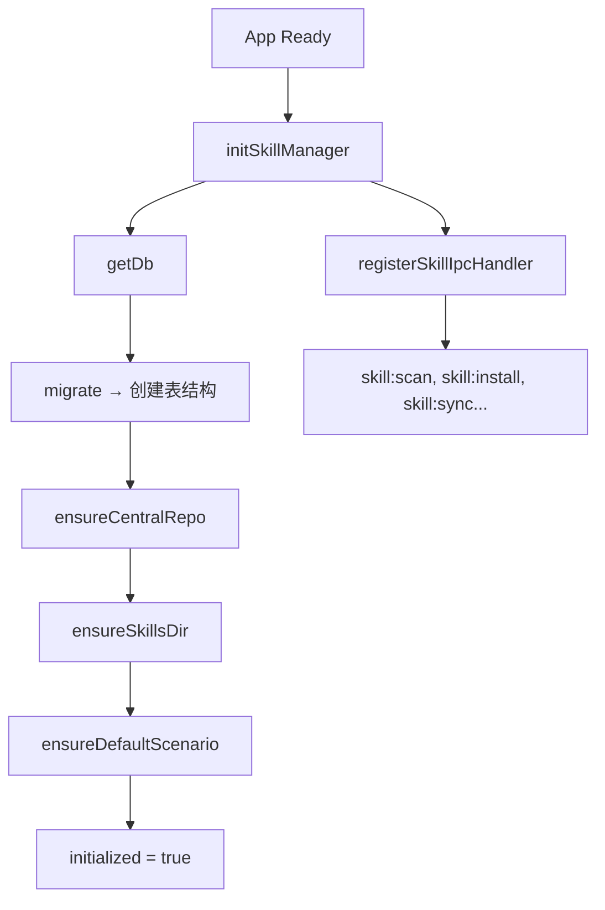
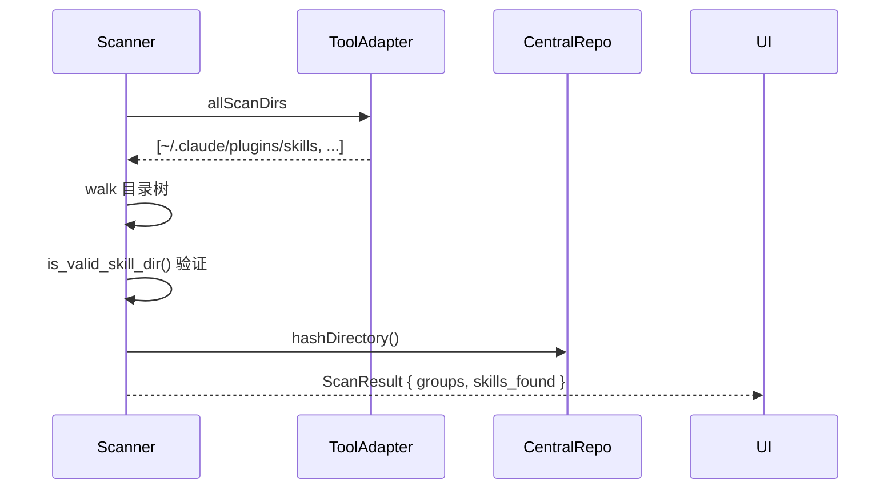
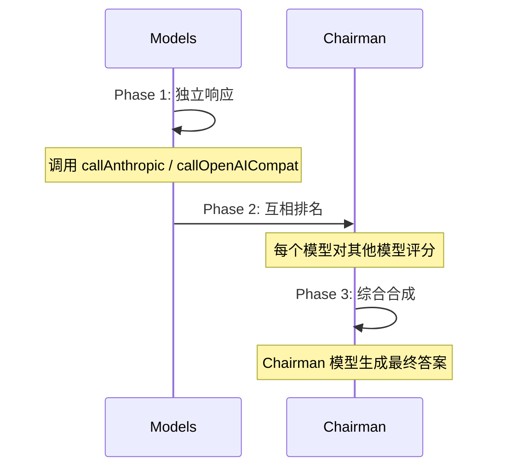
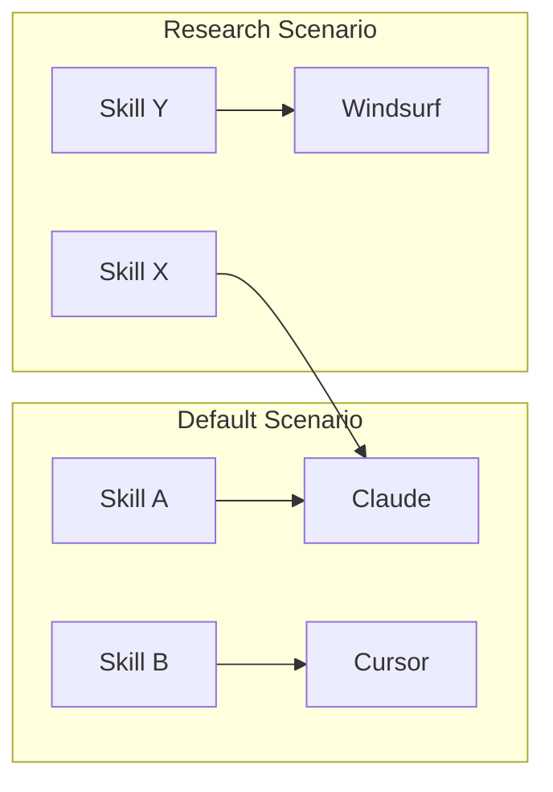

# 技能管理体系

<cite>

**本文引用的文件**

- [src/electron/libs/skill-manager/index.ts](file://src/electron/libs/skill-manager/index.ts)
- [pro-workflow/skills/wiki-builder/scripts/wiki-cli.js](file://pro-workflow/skills/wiki-builder/scripts/wiki-cli.js)
- [pro-workflow/skills/wiki-viewer/scripts/render.js](file://pro-workflow/skills/wiki-viewer/scripts/render.js)
- [pro-workflow/skills/llm-council/scripts/council.js](file://pro-workflow/skills/llm-council/scripts/council.js)
- [pro-workflow/skills/survey-generator/scripts/build-survey.js](file://pro-workflow/skills/survey-generator/scripts/build-survey.js)
- [pro-workflow/skills/wiki-builder/scripts/init_wiki.sh](file://pro-workflow/skills/wiki-builder/scripts/init_wiki.sh)
- [pro-workflow/skills/wiki-query/scripts/query.js](file://pro-workflow/skills/wiki-query/scripts/query.js)
- [pro-workflow/skills/wiki-research-loop/scripts/research-loop.js](file://pro-workflow/skills/wiki-research-loop/scripts/research-loop.js)
- [src/electron/libs/skill-manager/ipc-handlers.ts](file://src/electron/libs/skill-manager/ipc-handlers.ts)
- [src/electron/libs/skill-manager/types.ts](file://src/electron/libs/skill-manager/types.ts)
- [src/electron/libs/skill-manager/marketplace.ts](file://pro-workflow/skills/wiki-builder/scripts/init_wiki.sh)
- [src/electron/libs/skill-manager/central-repo.ts](file://src/electron/libs/skill-manager/central-repo.ts)
- [src/electron/libs/skill-manager/db.ts](file://src/electron/libs/skill-manager/db.ts)
- [src/electron/libs/task/index.ts](file://src/electron/libs/task/index.ts)
- [pro-workflow/skills/wiki-builder/templates/index.md](file://pro-workflow/skills/wiki-builder/templates/index.md)
- [pro-workflow/skills/wiki-builder/templates/prompts/compile-index.md](file://pro-workflow/skills/wiki-builder/templates/prompts/compile-index.md)
- [pro-workflow/scripts/learn-capture.js](file://pro-workflow/scripts/learn-capture.js)
- [pro-workflow/src/db/index.ts](file://pro-workflow/src/db/index.ts)

</cite>

## 目录

- [架构总览](#架构总览)
- [核心数据类型](#核心数据类型)
- [初始化流程](#初始化流程)
- [技能发现与加载](#技能发现与加载)
- [技能执行机制](#技能执行机制)
- [Marketplace 集成](#marketplace-集成)
- [场景与目标管理](#场景与目标管理)
- [Agent 改代码地图](#agent-改代码地图)

---

## 架构总览

Skill Manager 是 Electron 主进程中的核心库，负责技能的注册、发现、版本管理和场景编排。其架构分为四层：

```
┌─────────────────────────────────────────────────────────┐
│                    IPC Handlers 层                       │
│         handleSkillManagerInvoke (skills:*)             │
├─────────────────────────────────────────────────────────┤
│                   Service 层                             │
│  scenarios | sync-engine | scanner | installer | tool-adapters │
├─────────────────────────────────────────────────────────┤
│                   Database 层                            │
│            better-sqlite3 (skill-manager.db)            │
├─────────────────────────────────────────────────────────┤
│                Central Repo 层                          │
│            ~/.skills-manager/skills/                    │
└─────────────────────────────────────────────────────────┘
```

**关键符号**（来源 [index.ts#L5-L83](file://src/electron/libs/skill-manager/index.ts#L5-L83)）：

| 导出 | 来源模块 | 职责 |
|------|----------|------|
| `getAllSkills`, `getSkillById` | `db.js` | 技能 CRUD |
| `scanLocalSkills`, `groupDiscovered` | `scanner.js` | 本地发现 |
| `installFromLocal`, `installSkillDirToDestination` | `installer.js` | 安装 |
| `syncSkill`, `inferSkillName`, `parseSkillMd` | `sync-engine.js` | 同步 |
| `ensureCentralRepo`, `centralSkillsDir` | `central-repo.js` | 中央存储 |
| `fetchLeaderboard`, `searchSkillssh` | `marketplace.js` | 市场搜索 |

---

## 核心数据类型

### ManagedSkill

`ManagedSkill` 是贯穿整个系统的核心 DTO，包含技能的完整元数据和关联数据（来源 [types.ts#L15-L38](file://src/electron/libs/skill-manager/types.ts#L15-L38)）：

```typescript
interface ManagedSkill {
  id: string;                          // UUID
  name: string;                        // 唯一名称
  description: string | null;
  source_type: "git" | "skillssh" | "local" | "import";
  source_ref: string | null;          // Git URL 或本地路径
  source_ref_resolved: string | null; // 解析后的引用
  source_subpath: string | null;       // 子目录
  source_branch: string | null;
  source_revision: string | null;      // 本地 commit
  remote_revision: string | null;      // 远程 commit
  central_path: string;               // ~/.skills-manager/skills/{name}
  content_hash: string | null;        // SHA-256
  enabled: boolean;
  update_status: "up_to_date" | "update_available" | "local_only" | "source_missing" | "error";
  last_checked_at: number | null;
  last_check_error: string | null;
  targets: SkillTarget[];             // 部署目标
  scenario_ids: string[];            // 关联场景
  tags: string[];
}
```

### SkillTarget

技能部署目标定义（来源 [types.ts#L40-L48](file://src/electron/libs/skill-manager/types.ts#L40-L48)）：

```typescript
interface SkillTarget {
  id: string;
  skill_id: string;
  tool: string;              // claude | cursor | windsurf | ...
  target_path: string;       // 目标工具的 skills 目录
  mode: "symlink" | "copy";  // symlink=实时同步, copy=静态复制
  status: "ok" | "error";
  synced_at: number | null;
}
```

### ToolInfo

工具适配器信息（来源 [types.ts#L4-L13](file://src/electron/libs/skill-manager/types.ts#L4-L13)）：

```typescript
interface ToolInfo {
  key: string;                              // claude | cursor | ...
  display_name: string;
  installed: boolean;
  skills_dir: string;                       // {home}/.claude/plugins/skills
  enabled: boolean;
  is_custom: boolean;
  has_path_override: boolean;
  project_relative_skills_dir: string | null;
}
```

---

## 初始化流程

初始化由 `initSkillManager()` 触发（来源 [ipc-handlers.ts#L106-L118](file://src/electron/libs/skill-manager/ipc-handlers.ts#L106-L118)）：



**数据库迁移**（来源 [db.ts#L27-L102](file://src/electron/libs/skill-manager/db.ts#L27-L102)）创建以下表：

| 表名 | 用途 |
|------|------|
| `skills` | 技能主记录 |
| `scenarios` | 场景配置 |
| `scenario_skills` | 场景-技能关联 |
| `scenario_skill_tools` | 场景内技能的工具开关 |
| `skill_targets` | 技能部署目标 |
| `skill_tags` | 标签 |
| `settings` | 全局设置（代理URL、缓存等） |

**Central Repo 初始化**（来源 [central-repo.ts#L38-L44](file://src/electron/libs/skill-manager/central-repo.ts#L38-L44)）：

```typescript
export function ensureCentralRepo(): string {
  const dir = centralRepoBaseDir();  // ~/.skills-manager
  if (!existsSync(dir)) mkdirSync(dir, { recursive: true });
  ensureSkillsDir();                  // ~/.skills-manager/skills
  return dir;
}
```

---

## 技能发现与加载

### 扫描机制

`scanLocalSkills` 函数扫描预定义路径（来源 [scanner.js](file://pro-workflow/skills/wiki-research-loop/scripts/research-loop.js) 中示例逻辑）：



### IPC 通道

技能管理器通过 IPC 通道暴露接口（来源 [ipc-handlers.ts#L92-L104](file://src/electron/libs/skill-manager/ipc-handlers.ts#L92-L104)）：

```typescript
function registerSkillIpcHandler(channel: string, handler: SkillIpcHandler): void {
  skillIpcHandlers.set(channel, handler);
  ipcMain.handle(channel, (_event: any, ...args: any[]) => handler(...args));
}

export async function handleSkillManagerInvoke(channel: string, ...args: unknown[]): Promise<unknown> {
  initSkillManager();
  const handler = skillIpcHandlers.get(channel);
  if (!handler || !channel.startsWith("skills:")) {
    throw new Error(`Unsupported skill manager channel: ${channel}`);
  }
  return await handler(...args);
}
```

**常用 IPC 通道**：

| 通道 | Handler | 用途 |
|------|----------|------|
| `skills:scan` | `scanLocalSkills` | 扫描本地技能 |
| `skills:install` | `installSkillsshSkill` | 安装 skills.sh 技能 |
| `skills:sync` | `syncSkill` | 同步目标 |
| `skills:import` | `reimportLocalSkill` | 重新导入本地技能 |
| `skills:git-install` | `installGitSkillSelection` | Git 仓库安装 |

### 本地技能重新导入

`reimportLocalSkill` 用于刷新本地技能（来源 [ipc-handlers.ts#L173-L217](file://src/electron/libs/skill-manager/ipc-handlers.ts#L173-L217)）：

```typescript
function reimportLocalSkill(skillId: string): ManagedSkill {
  const skill = getSkillById(skillId);
  const sourcePath = skill.source_ref;  // 原始路径

  const stagedPath = skill.central_path.replace(
    /{skill.name}$/, `.${skill.name}.staged-${randomUUID()}`
  );

  // 原子替换：backup → staged → 删除 backup
  if (existsSync(skill.central_path)) {
    renameSync(skill.central_path, backupPath);
  }
  renameSync(stagedPath, skill.central_path);

  // 重新同步 copy 模式的 targets
  const targets = db.getTargetsForSkill(skillId);
  for (const t of targets) {
    if (t.mode === "copy") syncSkill(skill.central_path, t.target_path, "copy");
  }
}
```

---

## 技能执行机制

### Skill CLI 入口

Pro-workflow 中的技能通过独立脚本执行（来源 [wiki-cli.js#L217-L228](file://pro-workflow/skills/wiki-builder/scripts/wiki-cli.js#L217-L228)）：

```javascript
function main() {
  const [, , cmd, ...rest] = process.argv;
  const args = parseArgs(rest);
  switch (cmd) {
    case 'init': return cmdInit(args);      // 创建 wiki
    case 'list': return cmdList(args);     // 列出 wikis
    case 'info': return cmdInfo(args);     // wiki 信息
    case 'page': return cmdPage(args);     // 索引页面
    case 'reindex': return cmdReindex(args);
    default: usage();
  }
}
```

### Wiki-Builder 初始化流程

`init_wiki.sh` 创建 wiki 结构（来源 [init_wiki.sh#L58-L74](file://pro-workflow/skills/wiki-builder/scripts/init_wiki.sh#L58-L74)）：

```bash
dest="$root/$slug"
mkdir -p "$dest"/{raw,wiki,derived,prompts,logs}

# flavor 决定目录结构
case "$flavor" in
  paper) mkdir -p "$dest/wiki/sections" ;;
  domain|research) mkdir -p "$dest/wiki"/{concepts,papers,questions} ;;
  codebase) mkdir -p "$dest/wiki"/{modules,symbols,decisions} ;;
  incident) mkdir -p "$dest/wiki"/{timeline,signals,fixes} ;;
esac
```

### LLM Council 多模型协商

`council.js` 实现三阶段协商（来源 [council.js#L183-L206](file://pro-workflow/skills/llm-council/scripts/council.js#L183-L206)）：



**提供商配置**（来源 [council.js#L10-L50](file://pro-workflow/skills/llm-council/scripts/council.js#L10-L50)）：

```javascript
const PROVIDERS = {
  anthropic: { envKey: 'ANTHROPIC_API_KEY', defaultChairman: 'claude-opus-4-7' },
  openai: { envKey: 'OPENAI_API_KEY', defaultChairman: 'gpt-4o' },
  openrouter: { envKey: 'OPENROUTER_API_KEY', defaultChairman: 'anthropic/claude-opus-4' },
  fireworks: { envKey: 'FIREWORKS_API_KEY', defaultChairman: 'accounts/fireworks/models/glm-5' },
};
```

### Survey 生成器

`build-survey.js` 生成文献综述（来源 [build-survey.js#L164-L226](file://pro-workflow/skills/survey-generator/scripts/build-survey.js#L164-L226)）：

```javascript
async function cmdRun(args) {
  const bundle = JSON.parse(fs.readFileSync(bundlePath, 'utf8'));

  // 验证 bundle 完整性
  if (!bundle.topic || !Array.isArray(bundle.bibliography)) {
    die('bundle missing topic or bibliography[]');
  }

  const md = await callProvider(providerName, model, system, buildPrompt(bundle), 16000);

  // 写入 wiki
  const fileAbs = path.join(surveysDir, `${baseSlug}-v${v}.md`);
  fs.writeFileSync(fileAbs, md);

  // 索引到 wiki
  execFileSync('node', [wikiCli, 'page', slug, relPath, '--type', 'survey']);
}
```

### Wiki 查询

`query.js` 提供搜索和关联发现（来源 [query.js#L32-L53](file://pro-workflow/skills/wiki-query/scripts/query.js#L32-L53)）：

```javascript
function cmdSearch(args) {
  const hits = store.searchWiki(query, { wikiSlug: args.wiki, limit });
  for (const h of hits) {
    console.log(`${h.wiki_slug} · ${h.rel_path}  [${h.rank.toFixed(2)}]`);
  }
}

function cmdRelated(args) {
  const page = store.getWikiPage(slug, relPath);
  const seed = [page.title, page.summary].filter(Boolean).join(' ');
  const hits = store.searchWiki(seed, { wikiSlug: slug, limit: limit + 1 })
    .filter(h => h.rel_path !== relPath);
}
```

---

## Marketplace 集成

### Skills.sh 搜索

`searchSkillssh` 函数（来源 [marketplace.ts#L72-L80](file://src/electron/libs/skill-manager/marketplace.ts#L72-L80)）：

```typescript
export async function searchSkillssh(query: string, limit?: number): Promise<SkillsShSkill[]> {
  const bounded = Math.max(1, Math.min(limit || 60, 300));
  const url = `${SKILLSSH_API_BASE}/search?q=${encodeURIComponent(query)}&limit=${bounded}`;
  const response = await fetchWithProxy(url);
  return normalizeSkills(await response.json());
}
```

### Leaderboard 获取

`fetchLeaderboard` 带 5 分钟缓存（来源 [marketplace.ts#L41-L68](file://src/electron/libs/skill-manager/marketplace.ts#L41-L68)）：

```typescript
const LEADERBOARD_CACHE_TTL_MS = 5 * 60 * 1000;

export async function fetchLeaderboard(board: string): Promise<SkillsShSkill[]> {
  const cached = getCache(`leaderboard_${board}`, LEADERBOARD_CACHE_TTL_MS);
  if (cached) return JSON.parse(cached);

  const skills = parseLeaderboardHtml(await response.text());
  setCache(`leaderboard_${board}`, JSON.stringify(skills));
  return skills;
}
```

### SkillsMP AI 搜索

`searchSkillsmp` 支持 AI 增强搜索（来源 [marketplace.ts#L182-L204](file://src/electron/libs/skill-manager/marketplace.ts#L182-L204)）：

```typescript
export async function searchSkillsmp(query: string, ai?: boolean, page?: number, limit?: number) {
  const apiKey = getSetting("skillsmp_api_key");
  const mode = ai ? "ai" : "keyword";
  const url = `${baseUrl}/search?q=...&mode=${mode}`;
  return response.json();
}
```

---

## 场景与目标管理

### 场景（Scenario）

场景将技能分组，支持不同使用情境切换（来源 [scenarios.js](file://pro-workflow/skills/wiki-builder/scripts/wiki-cli.js)）：



**场景数据库结构**（来源 [db.ts#L51-L59](file://src/electron/libs/skill-manager/db.ts#L51-L59)）：

```sql
CREATE TABLE scenarios (
  id TEXT PRIMARY KEY,
  name TEXT NOT NULL,
  description TEXT,
  icon TEXT,
  sort_order INTEGER NOT NULL DEFAULT 0,
  created_at INTEGER NOT NULL,
  updated_at INTEGER NOT NULL
);

CREATE TABLE scenario_skills (
  scenario_id TEXT NOT NULL REFERENCES scenarios(id) ON DELETE CASCADE,
  skill_id TEXT NOT NULL REFERENCES skills(id) ON DELETE CASCADE,
  sort_order INTEGER NOT NULL DEFAULT 0,
  PRIMARY KEY (scenario_id, skill_id)
);

CREATE TABLE scenario_skill_tools (
  scenario_id TEXT NOT NULL,
  skill_id TEXT NOT NULL,
  tool TEXT NOT NULL,
  enabled INTEGER NOT NULL DEFAULT 1,
  PRIMARY KEY (scenario_id, skill_id, tool)
);
```

### 目标同步模式

| 模式 | 行为 | 适用场景 |
|------|------|----------|
| `symlink` | 源目录直接符号链接到目标 | 频繁更新、共享同一来源 |
| `copy` | 内容复制到目标目录 | 隔离版本、需要修改 |

`syncSkill` 处理同步（来源 [sync-engine.js](file://src/electron/libs/skill-manager/index.ts#L61)）：

```typescript
export { syncSkill, removeTarget, targetDirName, syncModeForTool, isTargetCurrent } from "./sync-engine.js";
```

---

## Agent 改代码地图

### 先读文件清单

| 优先级 | 文件路径 | 用途 |
|--------|----------|------|
| P0 | `src/electron/libs/skill-manager/types.ts` | 接口定义 |
| P0 | `src/electron/libs/skill-manager/ipc-handlers.ts` | IPC 入口 |
| P0 | `src/electron/libs/skill-manager/db.ts` | 数据库操作 |
| P1 | `src/electron/libs/skill-manager/index.ts` | 模块导出 |
| P1 | `src/electron/libs/skill-manager/central-repo.ts` | 存储路径 |
| P2 | `pro-workflow/skills/wiki-builder/scripts/wiki-cli.js` | Wiki CLI |
| P2 | `pro-workflow/skills/llm-council/scripts/council.js` | 多模型协商 |

### 关键符号索引

| 符号 | 文件 | 行号 | 用途 |
|------|------|------|------|
| `ManagedSkill` | types.ts | 15 | 主 DTO |
| `SkillTarget` | types.ts | 40 | 部署目标 |
| `Scenario` | types.ts | 73 | 场景定义 |
| `handleSkillManagerInvoke` | ipc-handlers.ts | 97 | IPC 分发 |
| `initSkillManager` | ipc-handlers.ts | 106 | 初始化入口 |
| `registerSkillIpcHandler` | ipc-handlers.ts | 92 | 注册 IPC |
| `reimportLocalSkill` | ipc-handlers.ts | 173 | 重新导入 |
| `installSkillsshSkill` | ipc-handlers.ts | 256 | 安装 skills.sh |
| `installGitSkillSelection` | ipc-handlers.ts | 489 | Git 安装 |
| `getDb` | db.ts | 12 | 数据库连接 |
| `getAllSkills` | db.ts | 107 | 查询所有技能 |
| `insertSkill` | db.ts | 127 | 插入技能 |
| `updateSkillAfterInstall` | db.ts | 148 | 更新安装后状态 |
| `fetchLeaderboard` | marketplace.ts | 41 | 获取排行榜 |
| `searchSkillssh` | marketplace.ts | 72 | 搜索技能 |
| `cmdRun` | council.js | 158 | 运行协商 |
| `buildPrompt` | build-survey.js | 131 | 生成 survey prompt |

### IPC 通道规范

- 通道前缀：`skills:`
- 分发入口：`handleSkillManagerInvoke(channel, ...args)`
- 注册方式：`registerSkillIpcHandler(channel, handler)`

### 修改入口

| 修改目标 | 入口文件 | 关键符号 |
|----------|----------|----------|
| 新增 IPC 通道 | `ipc-handlers.ts` | `registerSkillIpcHandler` |
| 新增数据库表 | `db.ts` | `migrate` 函数 |
| 新增工具适配器 | `tool-adapters.ts` | `allToolAdapters` |
| 新增同步模式 | `sync-engine.js` | `syncModeForTool` |
| 新增市场来源 | `marketplace.ts` | `searchSkillssh` |

### 验证命令

```bash
# 验证 TypeScript 编译
npx tsc --noEmit src/electron/libs/skill-manager/

# 验证数据库迁移
node -e "import('./src/electron/libs/skill-manager/db.js').then(m => console.log(m.getDb()))"

# 测试 IPC 通道
node -e "import('./src/electron/libs/skill-manager/ipc-handlers.js').then(m => m.initSkillManager())"

# 运行 skill-manager 测试（如有）
npm test -- --grep skill-manager
```

### 常见回归风险

| 风险 | 预防措施 |
|------|----------|
| 数据库迁移未执行 | `initSkillManager()` 调用 `getDb()` 触发迁移 |
| 路径不存在 | `ensureCentralRepo()` 确保目录创建 |
| IPC 通道冲突 | 通道名必须以 `skills:` 前缀 |
| 中央仓库文件被覆盖 | `reimportLocalSkill` 使用 backup + staged 原子操作 |
| 缓存未刷新 | Leaderboard 使用 5 分钟 TTL，注意 `setCache` |
| 场景删除级联 | `scenario_skills` 使用 `ON DELETE CASCADE` |

---

## 扩展点

### 添加新市场源

1. 在 `marketplace.ts` 添加 `searchXxx(query)` 函数
2. 使用 `fetchWithProxy()` 支持代理
3. 将函数导出到 `index.ts`
4. 在 `ipc-handlers.ts` 添加对应 IPC handler

### 添加新同步模式

1. 在 `sync-engine.js` 添加 `syncModeXxx(source, target)` 实现
2. 更新 `syncModeForTool` 分发逻辑
3. 在 `types.ts` 添加 `mode` 可选值（如 `reference`）

### 添加新工具适配器

1. 在 `tool-adapters.ts` 实现 `ToolAdapter` 接口
2. 添加到 `allToolAdapters` 数组
3. 更新 `skills_dir` 和 `project_relative_skills_dir` 计算逻辑