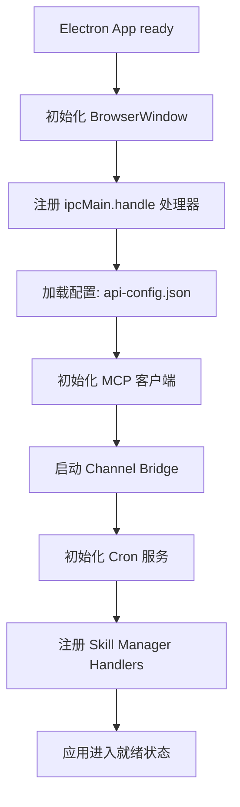
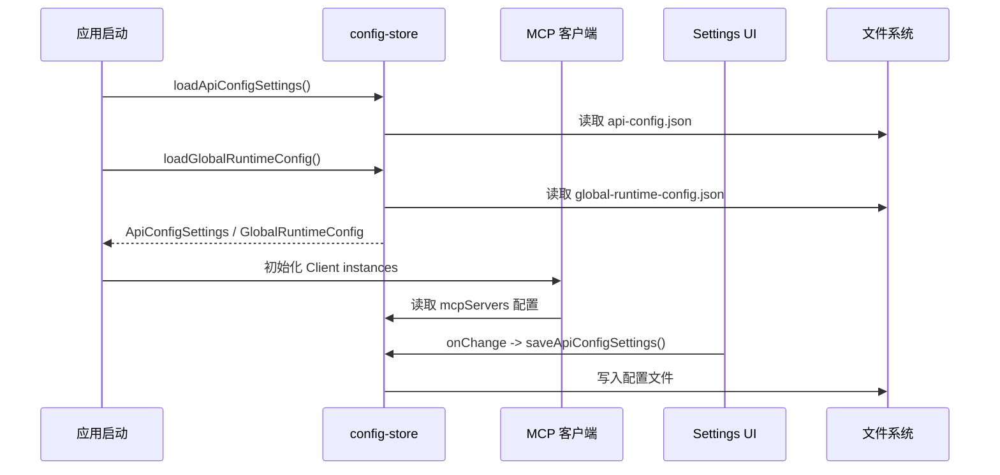
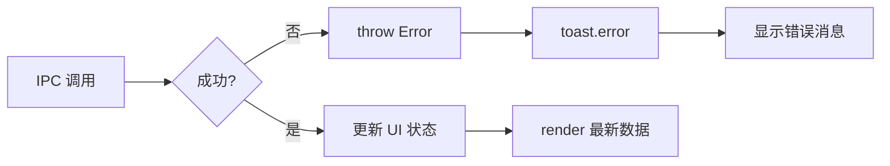
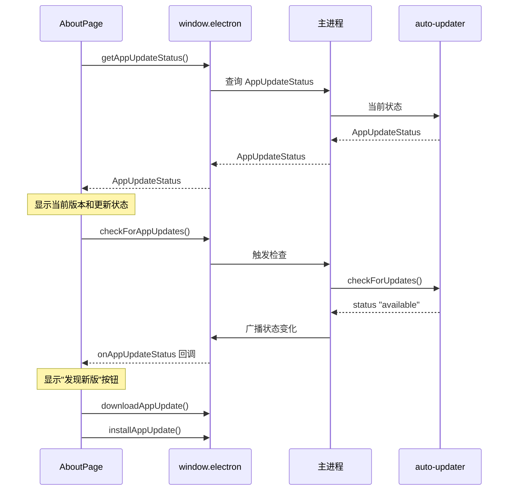

# Electron主进程配置

<cite>

**本文引用的文件**

- [src/electron/main.ts](file://src/electron/main.ts)
- [src/electron/tsconfig.json](file://src/electron/tsconfig.json)
- [src/ui/components/settings/AboutPage.tsx](file://src/ui/components/settings/AboutPage.tsx)
- [src/ui/components/settings/AgentRulesSettingsPage.tsx](file://src/ui/components/settings/AgentRulesSettingsPage.tsx)
- [src/ui/components/settings/ApiProfilesSettingsPage.tsx](file://src/ui/components/settings/ApiProfilesSettingsPage.tsx)
- [src/ui/components/settings/ChannelsSettingsPage.tsx](file://src/ui/components/settings/ChannelsSettingsPage.tsx)
- [src/ui/components/settings/CodeEditor.tsx](file://src/ui/components/settings/CodeEditor.tsx)
- [src/ui/components/settings/ConfirmDialog.tsx](file://src/ui/components/settings/ConfirmDialog.tsx)
- [src/ui/components/settings/GlobalJsonSettingsPage.tsx](file://src/ui/components/settings/GlobalJsonSettingsPage.tsx)
- [src/ui/components/settings/InstallSkillsView.tsx](file://src/ui/components/settings/InstallSkillsView.tsx)
- [src/ui/components/settings/McpSettingsPage.tsx](file://src/ui/components/settings/McpSettingsPage.tsx)
- [src/ui/components/settings/ModelRoutingSettingsPage.tsx](file://src/ui/components/settings/ModelRoutingSettingsPage.tsx)
- [src/ui/components/settings/MySkillsView.tsx](file://src/ui/components/settings/MySkillsView.tsx)
- [src/ui/components/settings/OverviewSettingsPage.tsx](file://src/ui/components/settings/OverviewSettingsPage.tsx)
- [src/ui/components/settings/PluginsSettingsPage.tsx](file://src/ui/components/settings/PluginsSettingsPage.tsx)
- [src/ui/components/settings/SettingsSheet.tsx](file://src/ui/components/settings/SettingsSheet.tsx)
- [src/ui/components/settings/SkillDashboard.tsx](file://src/ui/components/settings/SkillDashboard.tsx)
- [src/ui/components/settings/SkillsManagementPage.tsx](file://src/ui/components/settings/SkillsManagementPage.tsx)

</cite>

## 目录

- [主进程入口与模块职责](#主进程入口与模块职责)
- [启动参数体系](#启动参数体系)
- [配置加载优先级](#配置加载优先级)
- [核心配置项详解](#核心配置项详解)
- [配置验证与错误处理](#配置验证与错误处理)
- [前后端桥接与 IPC 通道](#前后端桥接与-ipc-通道)
- [运行时刷新与重启边界](#运行时刷新与重启边界)
- [MCP/插件系统配置](#mcp插件系统配置)
- [Agent 改代码地图](#agent-改代码地图)

---

## 主进程入口与模块职责

`src/electron/main.ts` 是 Electron 主进程的单一入口文件（2917 行），承担以下核心职责：

| 模块 | 职责 | 关键符号 |
|------|------|----------|
| **IPC 路由层** | 注册 `ipcMain.handle` 处理器，分发 preload 和渲染进程的调用 | `ipcMain.handle: preview-list-directory` 等多个 channel |
| **插件管理** | Open Computer Use / Figma 官方插件的安装、状态检查、OAuth 授权 | `installOpenComputerUsePlugin@251`, `getOpenComputerUsePluginStatus@297` |
| **MCP 客户端** | 基于 `@modelcontextprotocol/sdk` 的 MCP 连接管理 | `Client` from `@modelcontextprotocol/sdk/client/index.js` |
| **配置存储** | 读写 `api-config.json`、`global-runtime-config.json` | `loadApiConfigSettings`, `loadGlobalRuntimeConfig` |
| **自动更新** | Electron-updater 驱动的应用级热更新 | `appAutoUpdater`, `type AppUpdateStatus` |
| **渠道桥接** | 飞书/Telegram/微信等外部消息通道的桥接管理 | `startChannelBridge`, `type ChannelBridgeController` |

主进程启动流程概览：



[章节来源](file://src/electron/main.ts#L1-L97)

---

## 启动参数体系

tech-cc-hub 的启动参数通过以下三种途径传递：

### 1. 命令行参数

Electron 标准参数（如 `--disable-gpu`、`--no-sandbox`）由 Electron 框架直接处理。应用专用参数在 `main.ts` 中通过 `process.argv` 解析，但当前代码中未显式定义自定义 CLI 参数。启动行为由以下环境变量间接控制。

### 2. 环境变量

| 环境变量 | 作用域 | 用途 |
|----------|--------|------|
| `TELEGRAM_BOT_TOKEN` | 主进程/渠道 | Telegram Bot 认证 |
| `TELEGRAM_CHAT_ID` | 主进程/渠道 | Telegram 目标会话 |
| `LARK_CLI_COMMAND` | 主进程/渠道 | Lark CLI 路径 |
| `LARK_CLI_PROFILE` | 主进程/渠道 | Lark CLI profile 名称 |
| `WEIXIN_TOKEN` / `WEIXIN_ACCOUNT_ID` 等 | 主进程/渠道 | 微信渠道配置 |
| `CODEX_OAUTH_BASE_URL` | 配置层 | Codex OAuth 端点 |

这些环境变量由 `ChannelsSettingsPage.tsx` 中的 `collectEnvNames@173` 函数从 `ChannelRuntimeConfig` 中提取，写入 `global-runtime-config.json` 的 `skillCredentials` 字段，并在运行时通过 IPC 传递给 Agent 执行环境。

### 3. 配置文件

配置文件位于应用数据目录，通过 `libs/config-store.js` 的 `loadApiConfigSettings`、`loadGlobalRuntimeConfig` 等函数读写：

- **`api-config.json`**：AI 接口配置（baseURL、apiKey、模型列表）
- **`global-runtime-config.json`**：`channels`、`skillCredentials`、`systemPromptExt`、`plugins` 等运行时参数

[章节来源](file://src/electron/main.ts#L32-L46)

---

## 配置加载优先级

tech-cc-hub 采用以下优先级顺序加载配置：

```
命令行参数 → 环境变量 → 配置文件 → 内置默认值
```

### 具体优先级规则

1. **渠道凭证**：优先使用 `global-runtime-config.json` 中 `skillCredentials` 声明的环境变量名，再回退到代码中的默认变量名（如 `TELEGRAM_BOT_TOKEN`）
2. **API 配置**：`loadApiConfigSettings` 从配置文件读取，回退到硬编码的 `DEEPSEEK_OFFICIAL_BASE_URL` 等默认值
3. **MCP 服务器**：`mcpServers` 配置从全局配置读取；如果 `global-runtime-config.json` 中不存在，则 MCP 工具不可用
4. **模型路由**：`ModelRoutingSettingsPage` 从 `profiles` 数组读取，回退到 "预览第一个配置"



[章节来源](file://src/electron/main.ts#L32-L38)

---

## 核心配置项详解

### 1. API Profiles 配置

`ApiConfigProfile` 由 `ApiProfilesSettingsPage.tsx` 管理，包含以下字段：

| 字段 | 类型 | 说明 |
|------|------|------|
| `id` | `string` | 配置唯一标识 |
| `name` | `string` | 配置名称（如 "DeepSeek 官方"） |
| `provider` | `"custom"` \| `"deepseek"` \| `"codex"` | API 提供商 |
| `baseURL` | `string` | 接口地址 |
| `apiKey` | `string` | API 密钥（存储时加密） |
| `model` | `string` | 默认主模型 |
| `expertModel` | `string` | 专家模型 |
| `smallModel` | `string` | 小模型/后台模型 |
| `analysisModel` | `string` | Prompt 分析模型 |
| `imageModel` | `string` | 图片预处理模型 |
| `embeddingModel` | `string` | 向量模型/知识库 |
| `models` | `Array<{name, contextWindow, ...}>` | 模型候选列表 |

关键函数：
- `buildModelsEndpoint@111`：根据 provider 构建 `/v1/models` 端点
- `normalizeApiBaseURL@131`：标准化 baseURL（去除尾部斜杠、规范化 path）
- `getProviderMode@103`：自动识别 deepseek 官方 URL

### 2. Channel 配置

`ChannelRuntimeConfig` 由 `ChannelsSettingsPage.tsx` 管理，定义如下：

```typescript
type ChannelRuntimeConfig = {
  version: 1;
  defaultChannel: "telegram" | "lark" | "wechat";
  items: Record<ChannelProviderId, ChannelConnectionConfig>;
};
```

支持三种渠道：
- **Telegram**：Bot API 模式，`botTokenEnv` / `chatIdEnv`
- **Lark/飞书**：CLI 模式（`lark-cli`）或开放平台 Webhook 模式
- **微信**：OpenClaw 模式

### 3. 全局运行时配置

`GlobalJsonSettingsPage.tsx` 暴露 `env` / `skillCredentials` / `systemPromptExt` 等字段：

- `env`：注入到执行环境的环境变量（如 `GITHUB_TOKEN`）
- `skillCredentials`：渠道凭证映射（哪个渠道使用哪个环境变量）
- `systemPromptExt`：追加到每次会话 system prompt 的指令

### 4. Skill/Plugin 配置

`SkillsManagementPage` 通过 IPC 加载：
- `skills:getManagedSkills` → `ManagedSkill[]`
- `skills:getScenarios` → `Scenario[]`
- `skills:getTools` → `ToolInfo[]`
- `skills:scanLocalSkills` → `ScanResult`

[章节来源](file://src/ui/components/settings/ApiProfilesSettingsPage.tsx#L1-L50)

---

## 配置验证与错误处理

### 1. JSON 解析验证

`GlobalJsonSettingsPage.tsx` 监听 `parseError`：

```typescript
// 行 97-98: parseError 显示
<div className={`...${parseError ? "border border-error/20 bg-error-light text-error" : "..."}`}>
  {parseError ? parseError : "建议保持 JSON 为对象结构..."}
</div>
```

如果用户粘贴的 JSON 无效，`ChannelsSettingsPage.tsx` 中的 `parseJsonObject@108` 返回 `null`：

```typescript
function parseJsonObject(rawText: string): Record<string, unknown> | null {
  if (!rawText.trim()) return {};
  try {
    const parsed = JSON.parse(rawText);
    return isRecord(parsed) ? parsed : null;
  } catch {
    return null;
  }
}
```

### 2. API 连接测试

`ApiProfilesSettingsPage.tsx` 的 `testApiConfigInBrowser@228` 函数执行实时验证：

```typescript
async function testApiConfigInBrowser(profile, provider): Promise<ApiProfileTestResult> {
  const endpoint = `${normalizeMessagesBaseURL(baseURL, provider)}/messages`;
  const response = await fetch(endpoint, {
    method: "POST",
    headers: {
      "anthropic-version": "2023-06-01",
      authorization: `Bearer ${profile.apiKey}`,
    },
    body: JSON.stringify({
      model,
      max_tokens: 8,
      messages: [{ role: "user", content: "ping" }],
    }),
  });
  if (!response.ok) {
    return { success: false, error: text };
  }
  return { success: true, message: "连接成功，模型可以响应。" };
}
```

### 3. 插件状态检查

`PluginsSettingsPage.tsx` 通过以下 IPC 调用检查插件状态：

- `electron.invoke: plugins:getOpenComputerUseStatus`
- `electron.invoke: plugins:getFigmaOfficialStatus`
- `electron.invoke: plugins:checkOpenComputerUseUpdate`

`OpenComputerUsePluginStatus` 类型包含：
- `installed`: boolean
- `connected`: boolean
- `version`: string
- `permissions`: `OpenComputerUsePermissionStatus`（包含 `accessibility` / `screenRecording` 状态）

### 4. 错误传播路径



[章节来源](file://src/ui/components/settings/PluginsSettingsPage.tsx#L232-L268)

---

## 前后端桥接与 IPC 通道

### IPC 通道清单

主进程注册的 `ipcMain.handle` 通道（按功能分类）：

**文件预览**
| Channel | 用途 |
|---------|------|
| `preview-list-directory` | 列出目录内容（最多 300 条） |
| `preview-list-files` | 列出文件列表（最多 2000 条） |

**会话管理**
| Channel | 用途 |
|---------|------|
| `sessions:list` | 列出存储的会话 |
| `sessions:save` | 保存会话状态 |

**Slash Commands**
| Channel | 用途 |
|---------|------|
| `slash-commands:list` | 获取可用 slash 命令列表 |

**插件管理**
| Channel | 用途 |
|---------|------|
| `plugins:getOpenComputerUseStatus` | 获取 Open Computer Use 状态 |
| `plugins:checkOpenComputerUseUpdate` | 检查 Open Computer Use 更新 |
| `plugins:installOpenComputerUse` | 安装 Open Computer Use |
| `plugins:updateOpenComputerUse` | 更新 Open Computer Use |
| `plugins:getFigmaOfficialStatus` | 获取 Figma 官方插件状态 |
| `plugins:installFigmaOfficial` | 安装 Figma 官方插件 |
| `plugins:connectFigmaOfficial` | 连接 Figma 官方插件（OAuth/PAT） |
| `plugins:connectFigmaCodexOfficial` | 通过 Codex 授权连接 Figma |

**Skills 管理**
| Channel | 用途 |
|---------|------|
| `skills:getManagedSkills` | 获取管理的 Skills 列表 |
| `skills:getScenarios` | 获取场景列表 |
| `skills:getTools` | 获取工具列表 |
| `skills:scanLocalSkills` | 扫描本地 Skills |
| `skills:deleteManagedSkill` | 删除指定 Skill |
| `skills:getAllTags` | 获取所有标签 |
| `skills:searchSkillssh` | 搜索 skills.sh 市场 |
| `skills:fetchLeaderboard` | 获取热榜 |
| `skills:installLocal` | 安装本地源 |
| `skills:installGit` | 安装 Git 源 |

### preload 暴露的 API

`window.electron` 在 preload 中暴露以下方法：

```typescript
interface ElectronAPI {
  // 应用更新
  getAppUpdateStatus(): Promise<AppUpdateStatus>;
  onAppUpdateStatus(callback: (status: AppUpdateStatus) => void): () => void;
  checkForAppUpdates(): Promise<AppUpdateActionResult>;
  downloadAppUpdate(): Promise<AppUpdateActionResult>;
  installAppUpdate(): Promise<AppUpdateActionResult>;

  // 通用 IPC
  invoke(channel: string, ...args: unknown[]): Promise<unknown>;

  // 可选扩展
  fetchApiModels?(payload: {...}): Promise<{...}>;
}
```

### 前端调用示例

```typescript
// src/ui/components/settings/SkillsManagementPage.tsx 行 27-30
const invoke = useCallback(
  <T,>(channel: string, ...args: unknown[]): Promise<T> =>
    (window.electron as typeof window.electron & {
      invoke: (c: string, ...a: unknown[]) => Promise<T>
    }).invoke(channel, ...args),
  [],
);
```

[章节来源](file://src/electron/main.ts#L119-L130)

---

## 运行时刷新与重启边界

### 配置变更的刷新策略

| 配置类型 | 刷新方式 | 重启要求 |
|----------|----------|----------|
| **API Profile**（baseURL/apiKey） | `saveApiConfigSettings` 写入文件，下次会话生效 | 无需重启，UI 立即反映 |
| **全局 JSON**（skillCredentials/env） | `set_global_runtime_config` MCP 工具修改 | 写入即生效 |
| **MCP Server 配置** | 修改 `mcpServers` 后需重启应用 | 必须重启 |
| **Channel 配置** | 写入 `global-runtime-config.json` | 需要重启 Channel Bridge |
| **Plugin 安装** | `installOpenComputerUsePlugin` 执行 npm 安装 | 需重启应用 |
| **Skill 同步** | `skills:scanLocalSkills` 更新本地索引 | 无需重启 |

### Source of Truth

| 数据 | Source of Truth | 存储位置 |
|------|-----------------|----------|
| API 配置 | `api-config.json` | 应用数据目录 |
| 全局运行时配置 | `global-runtime-config.json` | 应用数据目录 |
| Skill 元数据 | SQLite/JSON（在 skill-manager 中） | `~/.tech-cc-hub/skills/` |
| MCP 连接状态 | 内存 + 配置文件 | 运行时状态 |

### AboutPage 的更新状态流



[章节来源](file://src/ui/components/settings/AboutPage.tsx#L68-L104)

---

## MCP/插件系统配置

### 内置 MCP 工具组

`McpSettingsPage.tsx` 定义了以下内置 MCP 工具组：

**tech-cc-hub-browser**（浏览器控制）
- 页面与导航：`browser_open_page`, `browser_close_page`, `browser_get_state`
- 页面读取：`browser_extract_page`, `browser_get_element`, `browser_query_nodes`
- 元素交互：`browser_click_element`, `browser_type_element`, `browser_fill_element`
- 键鼠输入：`browser_press_key`, `browser_mouse`, `browser_scroll_page`
- 截图与数据：`browser_capture_visible`, `browser_save_screenshot`, `browser_cookies`
- 诊断：`http_ping`, `diagnose_port`

**tech-cc-hub-admin**（运行配置）
- `set_global_runtime_config`：受控修改全局配置

**tech-cc-hub-design**（视觉还原）
- `design_inspect_image`：读取参考图结构化摘要
- `design_capture_current_view`：保存当前 BrowserView 截图
- `design_compare_current_view`：当前视图与参考图 diff
- `design_compare_images`：离线图片比较
- `design_read_comparison_report`：读取历史 JSON report

**tech-cc-hub-cron**（定时任务）
- `create_scheduled_task`, `list_scheduled_tasks`, `delete_scheduled_task`

### 插件安装流程

```mermaid
flowchart TD
    A[用户点击"安装"] --> B{已安装?}
    B -->|是| C[prepareOpenComputerUsePermissions]
    B -->|否| D[runExternalCli: npm install -g open-computer-use]
    D --> C
    C --> E{macOS?}
    E -->|是| F[检查 Accessibility 权限]
    E -->|否| G[权限已就绪]
    F --> H{需要授权?}
    H -->|是| I[打开系统偏好设置]
    H -->|否| G
    G --> J[connectOpenComputerUsePlugin]
    J --> K[更新 MCP 配置]
    K --> L[写入 global-runtime-config.json]
```

[章节来源](file://src/electron/main.ts#L252-L295)

---

## Agent 改代码地图

### 关键文件清单

| 文件 | 职责 | 修改频率 |
|------|------|----------|
| `src/electron/main.ts` | IPC 入口、插件管理、主进程逻辑 | 低 |
| `src/electron/libs/config-store.ts` | 配置文件读写 | 中 |
| `src/electron/ipc-handlers.ts` | IPC 处理逻辑 | 中 |
| `src/ui/components/settings/*.tsx` | 设置 UI 组件 | 高 |
| `src/ui/components/settings/SettingsSheet.tsx` | 设置容器 | 低 |
| `src/ui/types.ts` | 类型定义 | 中 |

### 符号/函数查找表

| 功能 | 符号名 | 文件位置 |
|------|--------|----------|
| 加载 API 配置 | `loadApiConfigSettings` | `src/electron/main.ts#L33` |
| 保存 API 配置 | `saveApiConfigSettings` | `src/electron/main.ts#L35` |
| 加载全局配置 | `loadGlobalRuntimeConfig` | `src/electron/main.ts#L36` |
| 保存全局配置 | `saveGlobalRuntimeConfig` | `src/electron/main.ts#L37` |
| 注册 IPC 处理器 | `ipcMainHandle` | `src/electron/util.js` |
| 插件安装 | `installOpenComputerUsePlugin` | `src/electron/main.ts#L251` |
| 插件状态检查 | `getOpenComputerUsePluginStatus` | `src/electron/main.ts#L298` |
| Figma 插件连接 | `connectFigmaDesktopOfficialPlugin` | `src/electron/main.ts#L471` |
| 获取 Open Computer Use 版本 | `getOpenComputerUseVersion` | `src/electron/main.ts#L132` |
| 权限检查 | `prepareOpenComputerUsePermissions` | `src/electron/main.ts#L187` |

### 扩展入口点

1. **新增 IPC Channel**
   - 在 `main.ts` 中添加 `ipcMain.handle('channel:name', handler)`
   - 在 preload 中添加 `window.electron.channelName = ...`

2. **新增设置页面**
   - 在 `src/ui/components/settings/` 中创建新组件（如 `NewSettingsPage.tsx`）
   - 导出组件并在 `SettingsSheet.tsx` 的 `pages` 数组中注册

3. **新增 API Provider**
   - 在 `ApiProfilesSettingsPage.tsx` 中添加 provider 分支
   - 在 `settings-utils.ts` 中添加 `createXxxProfile` 函数

4. **新增 Channel Provider**
   - 在 `ChannelsSettingsPage.tsx` 的 `CHANNEL_DEFINITIONS` 中添加定义
   - 实现 `buildChannelGuidePrompt` 函数

### 验证命令

```bash
# 验证 TypeScript 编译
cd src/electron && npx tsc --noEmit

# 验证 React 组件
cd src/ui && npx tsc --noEmit

# 运行时检查（开发模式）
npm run dev

# 检查 IPC 连接
# 打开 DevTools -> Console -> 输入 window.electron.invoke('sessions:list')
```

### 常见回归风险

| 风险点 | 描述 | 排查方法 |
|--------|------|----------|
| IPC channel 未注册 | 新增 channel 后忘记在 `main.ts` 注册 | 搜索 `ipcMain.handle` 是否存在该 channel |
| preload 未暴露方法 | UI 调用 `window.electron.xxx` 但 preload 未实现 | 检查 `src/electron/preload.ts` |
| 配置写入失败 | `saveApiConfigSettings` 异常未捕获 | 检查 `libs/config-store.ts` 的 try/catch |
| 插件安装超时 | `runExternalCli` timeout 默认 5 分钟 | 检查 `npm install` 网络状况 |
| MCP 连接状态未刷新 | MCP 配置变更后 UI 未反映 | 重启应用或检查 `global-runtime-config.json` |

---

## 配置示例

### API Profile 配置示例

```json
{
  "id": "deepseek-primary",
  "name": "DeepSeek 官方",
  "provider": "deepseek",
  "baseURL": "https://api.deepseek.com/v1",
  "apiKey": "sk-xxxx",
  "model": "deepseek-chat",
  "expertModel": "deepseek-chat",
  "smallModel": "deepseek-reasoner",
  "analysisModel": "deepseek-chat",
  "enabled": true,
  "models": [
    { "name": "deepseek-chat", "contextWindow": 64000 },
    { "name": "deepseek-reasoner", "contextWindow": 64000 }
  ]
}
```

### 全局运行时配置示例

```json
{
  "systemPromptExt": [
    "工具调用必须少而准；能直接回答时不要调用工具。",
    "多个互不依赖的只读工具调用要并行或批量执行。"
  ],
  "env": {
    "GITHUB_TOKEN": "ghp_xxxx",
    "GROQ_API_KEY": "gsk_xxxx"
  },
  "skillCredentials": {
    "github": ["GITHUB_TOKEN"],
    "browser": { "env": ["GROQ_API_KEY"] }
  },
  "channels": {
    "version": 1,
    "defaultChannel": "telegram",
    "items": {
      "telegram": {
        "enabled": true,
        "transport": "bot-api",
        "botTokenEnv": "TELEGRAM_BOT_TOKEN",
        "chatIdEnv": "TELEGRAM_CHAT_ID"
      }
    }
  }
}
```

[章节来源](file://src/ui/components/settings/GlobalJsonSettingsPage.tsx#L4-L25)

---

## 排障步骤

### 1. 设置页面无法加载

```bash
# 检查主进程日志
tail -f ~/.tech-cc-hub/logs/main.log

# 验证配置文件存在
ls -la ~/.tech-cc-hub/api-config.json
ls -la ~/.tech-cc-hub/global-runtime-config.json
```

### 2. API 连接测试失败

1. 确认 `api-config.json` 中 `apiKey` 正确
2. 检查网络是否能访问 `baseURL`
3. 在 DevTools Console 执行：
   ```javascript
   fetch('你的baseURL/v1/models', {
     headers: { 'Authorization': 'Bearer 你的key' }
   }).then(r => r.json()).then(console.log)
   ```

### 3. 插件状态显示异常

1. 检查 `open-computer-use --version` 是否可用
2. 检查 `npm list -g open-computer-use`
3. 确认 `global-runtime-config.json` 中 `mcpServers` 配置存在

### 4. Skill 安装失败

1. 检查 `skills:scanLocalSkills` IPC 是否返回结果
2. 检查磁盘空间和目录权限
3. 确认 npm 可以访问 skills.sh registry

[章节来源](file://src/ui/components/settings/SkillsManagementPage.tsx#L33-L51)