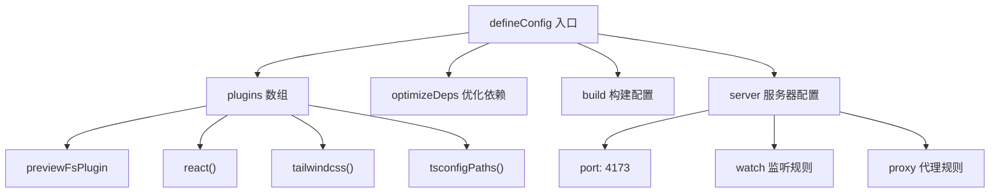
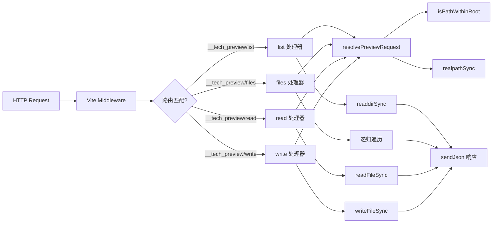

# Vite构建配置

<cite>

**本文引用的文件**

- [vite.config.ts](file://vite.config.ts)
- [src/ui/vite-env.d.ts](file://src/ui/vite-env.d.ts)

</cite>

---

## 目录

- [整体结构概览](#整体结构概览)
- [核心插件配置](#核心插件配置)
- [预览服务器设计与实现](#预览服务器设计与实现)
- [文件预览大小限制](#文件预览大小限制)
- [构建产物与输出目录](#构建产物与输出目录)
- [开发桥接代理](#开发桥接代理)
- [故障排查](#故障排查)
- [Agent 改代码地图](#agent-改代码地图)

---

## 整体结构概览

`vite.config.ts` 是 tech-cc-hub 前端构建的核心配置文件，采用 Vite 的函数式配置模式导出。该文件承担三大职责：

1. **插件注册**：组合 React、Tailwind、路径别名等插件
2. **预览服务器**：通过自定义插件 `previewFsPlugin` 提供文件系统预览能力
3. **构建与开发服务器配置**：管理输出目录、端口、代理规则

```typescript
// vite.config.ts 入口结构 (L193-L228)
// 章节来源: file://vite.config.ts#L193-L228

export default defineConfig(() => {
    const port = 4173;

    return {
        plugins: [previewFsPlugin(), react(), tailwindcss(), tsconfigPaths({ ignoreConfigErrors: true })],
        base: './',
        optimizeDeps: {
            entries: ['index.html'],
            exclude: ['monaco-editor'],
        },
        build: {
            outDir: 'dist-react',
        },
        server: {
            port,
            strictPort: true,
            watch: {
                ignored: [
                    '**/.claude/**',
                    '**/.codex/**',
                    '**/.tech/**',
                    '**/third_party/**',
                    '**/dist-electron/**',
                    '**/dist-react/**',
                ],
            },
            proxy: {
                "/__dev_bridge": {
                    target: "http://127.0.0.1:4317",
                    changeOrigin: true,
                    rewrite: (path) => path.replace(/^\/__dev_bridge/, ''),
                },
            },
        },
    };
});
```

关键配置项说明：

| 配置项 | 值 | 说明 |
|--------|-----|------|
| `port` | `4173` | 开发服务器监听端口 |
| `base` | `'./'` | 相对路径基础，解决 SPA 部署问题 |
| `outDir` | `'dist-react'` | 生产构建输出目录 |
| `strictPort` | `true` | 端口冲突时不允许自动切换 |

### 配置层级关系



---

## 核心插件配置

### 2.1 @vitejs/plugin-react

`react()` 插件处理 React JSX/TSX 转换，支持 Fast Refresh 热更新。该插件无需显式配置参数，使用默认行为即可。

### 2.2 @tailwindcss/vite

`tailwindcss()` 是 Vite 官方 Tailwind 集成插件，替代了旧版 PostCSS 方案。配置于 L3：

```typescript
import tailwindcss from '@tailwindcss/vite';
```

此插件会自动查找项目根目录的 `tailwind.config.js` 或 `tailwind.config.ts` 文件。

### 2.3 vite-tsconfig-paths

`tsconfigPaths()` 插件读取 `tsconfig.json` 中的路径别名配置（如 `@/`、`@components/`），使 Vite 能够正确解析 TypeScript 路径映射：

```typescript
import tsconfigPaths from 'vite-tsconfig-paths';

// 配置 (L197)
tsconfigPaths({ ignoreConfigErrors: true })
```

`ignoreConfigErrors: true` 参数允许在 tsconfig 有警告时仍继续构建，适合渐进式迁移场景。

### 插件执行顺序

| 顺序 | 插件 | 职责 |
|------|------|------|
| 1 | `previewFsPlugin()` | 注册预览路由中间件 |
| 2 | `react()` | JSX 转换 |
| 3 | `tailwindcss()` | Tailwind CSS 处理 |
| 4 | `tsconfigPaths()` | 路径别名解析 |

---

## 预览服务器设计与实现

预览服务器是 tech-cc-hub 的核心特性之一，通过 `previewFsPlugin` 自定义 Vite 插件实现。该插件在 Vite 开发服务器的中间件层注册文件系统操作路由。

### 3.1 核心函数调用链



### 3.2 resolvePreviewRequest 函数

**职责**：从 URL 参数解析文件路径，验证安全性，返回规范化的路径信息。

```typescript
// vite.config.ts L35-L44
// 章节来源: file://vite.config.ts#L35-L44

function resolvePreviewRequest(url: URL) {
    const cwd = url.searchParams.get('cwd')?.trim() || '';
    const rawPath = url.searchParams.get('path')?.trim() || '';
    if (!cwd) return { error: '缺少 cwd。' };

    const rootPath = realpathSync(cwd);
    const requestedPath = rawPath ? (isAbsolute(rawPath) ? rawPath : join(rootPath, rawPath)) : rootPath;
    const realPath = realpathSync(requestedPath);

    if (!isPathWithinRoot(rootPath, realPath)) return { error: '只能访问当前工作目录内的文件。' };
    return { rootPath, realPath };
}
```

**参数说明**：

| 参数 | 来源 | 说明 |
|------|------|------|
| `cwd` | URL searchParam `cwd` | 基准工作目录，必须提供 |
| `path` | URL searchParam `path` | 相对或绝对路径，可选 |

**返回值**：

- 成功：`{ rootPath: string, realPath: string }`
- 失败：`{ error: string }`

### 3.3 sendJson 辅助函数

**职责**：构造标准 JSON HTTP 响应。

```typescript
// vite.config.ts L29-L33
// 章节来源: file://vite.config.ts#L29-L33

function sendJson(res: import('node:http').ServerResponse, payload: unknown, statusCode = 200) {
    res.statusCode = statusCode;
    res.setHeader('content-type', 'application/json; charset=utf-8');
    res.end(JSON.stringify(payload));
}
```

### 3.4 四个路由端点

| 端点 | 方法 | 用途 | 返回数据 |
|------|------|------|----------|
| `/__tech_preview/list` | GET | 列出目录内容（限制500条） | `{ success, path, entries[] }` |
| `/__tech_preview/files` | GET | 递归索引文件（可配置limit） | `{ success, entries[], truncated }` |
| `/__tech_preview/read` | GET | 读取文件内容 | `{ success, path, content }` |
| `/__tech_preview/write` | POST | 写入文件 | `{ success, path }` |

#### 3.4.1 list 处理器（L66-L92）

- 过滤以 `.` 开头的隐藏目录（但保留 `.env`）
- 排除 `ignoredPreviewDirectories` 中的目录
- 按类型（目录优先）和名称排序
- 每批最多返回 500 条记录

#### 3.4.2 files 处理器（L93-L144）

- BFS 递归遍历子目录
- `limit` 参数范围限制：1 ~ 10,000，默认 `maxPreviewQuickOpenEntries` (2000)
- `truncated` 标志指示结果是否被截断
- 排序依据 `relativePath`

#### 3.4.3 read 处理器（L167-L188）

- 自动识别图片 MIME 类型（支持 `.gif/.ico/.jpeg/.jpg/.png/.svg/.webp`）
- 图片以 Base64 data URL 形式返回：`data:image/png;base64,...`
- 文本文件直接返回字符串内容
- 返回内容包含 `path` 字段供客户端校验

#### 3.4.4 write 处理器（L145-L166）

- 仅接受 POST 方法
- 请求体必须为 JSON：`{ cwd, path, data }`
- 目标必须是普通文件，不支持创建新文件
- 使用 `writeFileSync` 同步写入

---

## 文件预览大小限制

文件预览功能内置了大小限制，防止资源耗尽：

```typescript
// vite.config.ts L19-L22
// 章节来源: file://vite.config.ts#L19-L22

const ignoredPreviewDirectories = new Set(['node_modules', '.git', '.claude', '.codex', '.tech', 'third_party', 'dist-react', 'dist-electron']);
const maxPreviewTextBytes = 512 * 1024;      // 512 KB
const maxPreviewImageBytes = 2 * 1024 * 1024; // 2 MB
const maxPreviewQuickOpenEntries = 2_000;     // 2000 条
```

| 限制名称 | 值 | 适用场景 |
|----------|-----|----------|
| `maxPreviewTextBytes` | 512 KB | 普通文本文件读取 |
| `maxPreviewImageBytes` | 2 MB | 图片预览 |
| `maxPreviewQuickOpenEntries` | 2000 | 文件索引结果数量 |

### 限制应用位置

| 限制 | 应用行 | 错误响应 |
|------|--------|----------|
| `maxPreviewTextBytes` | L183 (read) | `{ success: false, error: '文件过大。' }` |
| `maxPreviewImageBytes` | L176 (read) | `{ success: false, error: '图片过大。' }` |
| `maxPreviewTextBytes * 2` | L52 (write body) | 销毁请求连接 |

---

## 构建产物与输出目录

### 生产构建

```typescript
build: {
    outDir: 'dist-react',
},
```

- **输出目录**：`dist-react/`
- **base 配置**：`'./'`（相对路径）
  - 保证部署到任意子路径下 SPA 路由正常工作
  - 静态资源引用使用相对路径

### 开发服务器监听规则

```typescript
watch: {
    ignored: [
        '**/.claude/**',       // Claude Code 运行时目录
        '**/.codex/**',       // Codex 目录
        '**/.tech/**',        // Tech CC Hub 内部数据
        '**/third_party/**',  // 第三方依赖
        '**/dist-electron/**', // Electron 构建产物
        '**/dist-react/**',    // React 构建产物
    ],
},
```

这些目录被排除在 Vite HMR 监听之外，避免不必要的重载触发。

### 预优化依赖

```typescript
optimizeDeps: {
    entries: ['index.html'],
    exclude: ['monaco-editor'],
},
```

- `monaco-editor` 被排除在预优化之外，因其体积大且支持按需加载
- `entries` 指定预构建入口点

---

## 开发桥接代理

开发阶段，前端通过代理访问 Electron 主进程的本地服务：

```typescript
proxy: {
    "/__dev_bridge": {
        target: "http://127.0.0.1:4317",
        changeOrigin: true,
        rewrite: (path) => path.replace(/^\/__dev_bridge/, ''),
    },
},
```

**用途**：前端 `/__dev_bridge/*` 请求被代理到 Electron 主进程监听的 `4317` 端口。

**前端调用示例**：

```typescript
// 前端代码
const response = await fetch('/__dev_bridge/api/endpoint');
```

**桥接特点**：
- `changeOrigin: true` - 修改 Host 头为目标地址
- `rewrite` - 移除 `/__dev_bridge` 前缀，还原原始路径

---

## 故障排查

### 问题：预览文件返回 "只能预览普通文件"

**原因**：`resolvePreviewRequest` 检测到目标不是普通文件（可能是目录、符号链接等）。

**排查步骤**：

1. 检查 `stat.isFile()` 返回值（L171）
2. 确认 URL 中 `cwd` 和 `path` 参数正确
3. 验证 `realpathSync` 能成功解析路径（L41）

### 问题：文件写入失败 "Only regular files can be written"

**原因**：写入目标必须是已存在的普通文件，不支持创建新文件（L159-L160）。

**解决方案**：确保目标文件已存在，或使用文件系统 API 先创建文件。

### 问题：代理 `/__dev_bridge` 500 错误

**排查步骤**：

1. 确认 Electron 主进程在 `4317` 端口正常监听
2. 检查主进程日志输出
3. 验证 CORS 头配置（如果目标服务有 CORS 限制）

### 问题：大文件预览失败

**检查项**：

| 文件类型 | 限制 | 单位 |
|----------|------|------|
| 文本文件 | 512 KB | 1024 × 512 |
| 图片文件 | 2 MB | 1024 × 1024 × 2 |

---

## Agent 改代码地图

### 改代码前必读文件

| 优先级 | 文件路径 | 读取原因 |
|--------|----------|----------|
| 1 | `vite.config.ts` | 所有构建和预览逻辑 |
| 2 | `src/ui/vite-env.d.ts` | Vite 客户端类型声明 |
| 3 | `tsconfig.app.json` | 路径别名定义 |

### 关键符号速查

| 符号名 | 行号 | 类型 | 说明 |
|--------|------|------|------|
| `previewFsPlugin` | 61 | 函数 | 自定义 Vite 插件，核心预览实现 |
| `resolvePreviewRequest` | 34 | 函数 | 路径解析和安全验证 |
| `sendJson` | 28 | 函数 | JSON 响应构造 |
| `isPathWithinRoot` | 23 | 函数 | 路径安全边界检查 |
| `readRequestBody` | 45 | 函数 | 请求体读取（带大小保护） |
| `maxPreviewTextBytes` | 20 | 常量 | 512 KB |
| `maxPreviewImageBytes` | 21 | 常量 | 2 MB |
| `ignoredPreviewDirectories` | 18 | 常量 Set | 排除目录列表 |

### 修改入口

**场景 1：添加新的预览端点**

```typescript
// 在 previewFsPlugin() 的 configureServer 中添加
server.middlewares.use('/__tech_preview/new-endpoint', (req, res) => {
    // 实现逻辑
});
```

**场景 2：修改文件大小限制**

编辑 `vite.config.ts` L19-L22 的常量定义。

**场景 3：新增支持的图片格式**

在 `previewImageMimeTypes` 对象（L9-L17）中添加新的扩展名和 MIME 类型。

### 验证命令

```bash
# 开发模式启动
npm run dev

# 生产构建
npm run build

# 单独验证 Vite 配置
npx vite --version

# 类型检查
npx tsc --noEmit
```

### 常见回归风险

| 风险 | 说明 | 预防措施 |
|------|------|----------|
| 路径遍历漏洞 | `isPathWithinRoot` 被绕过 | 确保 `realpathSync` 在所有路径操作后执行 |
| 大文件耗尽内存 | 预览大文件触发 OOM | 严格遵守 `maxPreviewTextBytes` 限制 |
| 代理失效 | Electron 端口变更 | 同步更新 proxy target 配置 |

### 运行时刷新边界

| 修改内容 | 是否需要重启 | 备注 |
|----------|--------------|------|
| `vite.config.ts` | **需要** | 配置文件本身修改 |
| Tailwind 类名增删 | HMR 自动生效 | 仅限开发模式 |
| TypeScript 路径别名 | **需要** | 需重启 Vite 服务器 |
| 预览插件代码 | **需要** | 插件逻辑在启动时注册 |

---

**章节来源**

- vite.config.ts 整体结构: file://vite.config.ts#L1-L228
- previewFsPlugin 定义: file://vite.config.ts#L62-L191
- resolvePreviewRequest 实现: file://vite.config.ts#L35-L44
- sendJson 辅助函数: file://vite.config.ts#L29-L33
- 大小限制常量: file://vite.config.ts#L19-L22
- 构建输出配置: file://vite.config.ts#L203-L205
- 代理配置: file://vite.config.ts#L219-L225