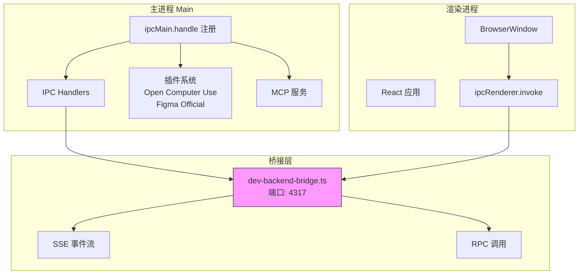
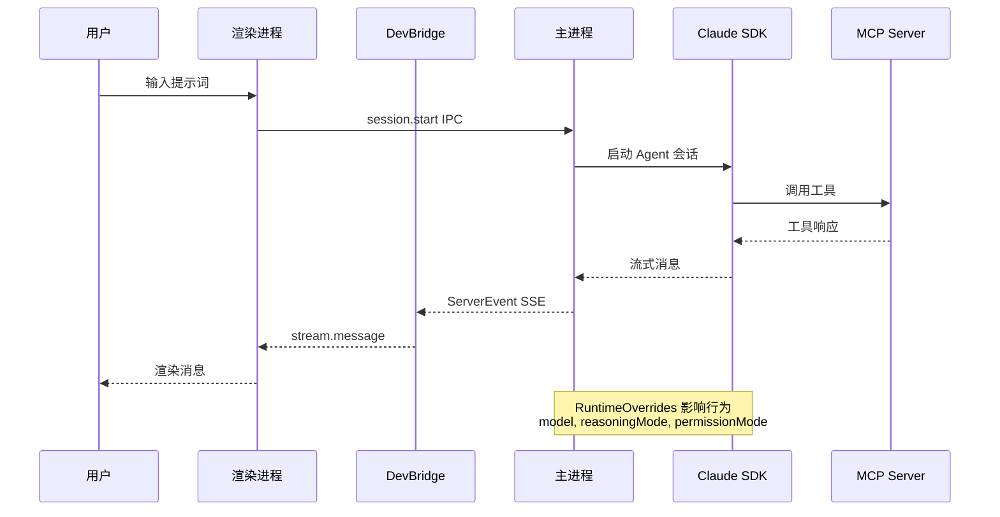

# 应用运行时配置总览

<cite>
**本文引用的文件**
- [src/electron/main.ts](file://src/electron/main.ts)
- [vite.config.ts](file://vite.config.ts)
- [package.json](file://package.json)
- [src/electron/tsconfig.json](file://src/electron/tsconfig.json)
- [src/electron/types.ts](file://src/electron/types.ts)
- [src/electron/dev-backend-bridge.ts](file://src/electron/dev-backend-bridge.ts)
- [src/electron/util.ts](file://src/electron/util.ts)
- [scripts/github-release.mjs](file://scripts/github-release.mjs)
- [scripts/codex-oauth-setup.mjs](file://scripts/codex-oauth-setup.mjs)
- [scripts/dev-electron.mjs](file://scripts/dev-electron.mjs)
- [scripts/package-win-safe.mjs](file://scripts/package-win-safe.mjs)
- [package/package.json](file://package/package.json)
- [pro-workflow/package.json](file://pro-workflow/package.json)
- [pro-workflow/scripts/config-watcher.js](file://pro-workflow/scripts/config-watcher.js)
- [pro-workflow/scripts/cwd-changed.js](file://pro-workflow/scripts/cwd-changed.js)
- [pro-workflow/skills/llm-council/scripts/council.js](file://pro-workflow/skills/llm-council/scripts/council.js)
- [pro-workflow/skills/survey-generator/scripts/build-survey.js](file://pro-workflow/skills/survey-generator/scripts/build-survey.js)
- [pro-workflow/skills/wiki-research-loop/scripts/research-loop.js](file://pro-workflow/skills/wiki-research-loop/scripts/research-loop.js)
</cite>

---

## 目录

- [概述](#概述)
- [主进程配置](#主进程配置)
  - [主入口 `main.ts`](#主入口-maints)
  - [类型定义 `types.ts`](#类型定义-typests)
  - [工具函数 `util.ts`](#工具函数-utilts)
- [构建配置](#构建配置)
  - [Vite 配置 `vite.config.ts`](#vite-配置-viteconfigts)
  - [tsconfig 配置](#tsconfig-配置)
  - [package.json 脚本](#packagejson-脚本)
- [前后端桥接](#前后端桥接)
  - [开发桥接 `dev-backend-bridge.ts`](#开发桥接-dev-backend-bridgts)
  - [IPC 通道设计](#ipc-通道设计)
- [运行时数据流](#运行时数据流)
- [Pro-Workflow 运行时配置](#pro-workflow-运行时配置)
  - [配置监听器](#配置监听器)
  - [LLM Council 配置](#llm-council-配置)
  - [Wiki 研究循环配置](#wiki-研究循环配置)
- [Agent 改代码地图](#agent-改代码地图)
- [常见问题与排障](#常见问题与排障)

---

## 概述

tech-cc-hub 的应用运行时由多层配置体系构成：

1. **主进程层**（Electron Main）: `src/electron/main.ts` 作为主入口，管理 IPC 通道、插件系统、MCP 服务
2. **渲染层**（Vite + React）: `vite.config.ts` 提供开发服务器和预览文件系统
3. **桥接层**: `dev-backend-bridge.ts` 在开发模式下连接前端和后端逻辑
4. **Pro-Workflow 层**: 独立的工作流配置系统，包含 LLM Council、Survey Generator、Wiki Research Loop

---

## 主进程配置

### 主入口 `main.ts`

**文件**: `src/electron/main.ts`

**职责**: Electron 主进程的唯一入口，负责：
- 初始化 `BrowserWindow`
- 注册全局 IPC 处理器
- 管理插件生命周期的注册

**核心符号**:

| 符号 | 行号 | 职责 |
|------|------|------|
| `getOpenComputerUseVersion()` | 132 | 检查 Open Computer Use 插件版本 |
| `installOpenComputerUsePlugin()` | 252 | 安装/连接 Open Computer Use 插件 |
| `prepareOpenComputerUsePermissions()` | 187 | 检查 macOS 辅助功能和屏幕录制权限 |
| `loadApiConfigSettings()` | 33 | 加载 API 配置 |
| `loadGlobalRuntimeConfig()` | 36 | 加载全局运行时配置 |
| `getCurrentApiConfig()` | 44 | 获取当前 API 配置 |
| `initializeTaskExecutor()` | 30 | 初始化任务执行器 |
| `initializeNoteRepository()` | 30 | 初始化笔记仓库 |

**IPC 通道列表**（部分）:

```typescript
ipcMain.handle: preview-list-directory
ipcMain.handle: preview-list-files
ipcMain.handle: sessions:list
ipcMain.handle: slash-commands:list
ipcMain.handle: plugins:getOpenComputerUseStatus
ipcMain.handle: plugins:checkOpenComputerUseUpdate
ipcMain.handle: plugins:installOpenComputerUse
ipcMain.handle: plugins:updateOpenComputerUse
ipcMain.handle: plugins:getFigmaOfficialStatus
ipcMain.handle: plugins:installFigmaOfficial
ipcMain.handle: plugins:connectFigmaOfficial
ipcMain.handle: plugins:connectFigmaCodexOfficial
```

章节来源: `file://src/electron/main.ts#L27-L96`

### 类型定义 `types.ts`

**文件**: `src/electron/types.ts`

定义了整个运行时使用的数据结构。

**核心类型**:

```typescript
// 运行时推理模式
export type RuntimeReasoningMode = "disabled" | "low" | "medium" | "high" | "xhigh";

// Agent 运行表面
export type AgentRunSurface = "development" | "maintenance";

// API 模型配置
export type ApiModelConfig = {
  name: string;
  contextWindow?: number;
  compressionThresholdPercent?: number;
};

// API 提供商模式
export type ApiProviderMode = "custom" | "deepseek" | "codex";

// API 配置
export type ApiConfig = {
  id: string;
  name: string;
  apiKey: string;
  baseURL: string;
  model: string;
  expertModel?: string;
  smallModel?: string;
  imageModel?: string;
  analysisModel?: string;
  embeddingModel?: string;
  embeddingDimension?: number;
  embeddingBatchSize?: number;
  wikiModel?: string;
  wikiModelCostTier?: "free" | "cheap" | "standard";
  models?: ApiModelConfig[];
  enabled: boolean;
  provider?: ApiProviderMode;
  apiType?: "anthropic";
};

// 运行时覆盖参数
export type RuntimeOverrides = {
  model?: string;
  reasoningMode?: RuntimeReasoningMode;
  permissionMode?: "default" | "bypassPermissions" | "plan";
  runSurface?: AgentRunSurface;
  agentId?: string;
  outputFormat?: "json" | "none";
};

// 会话状态
export type SessionStatus = "idle" | "running" | "completed" | "error";

// 会话信息
export type SessionInfo = {
  id: string;
  title: string;
  status: SessionStatus;
  model?: string;
  claudeSessionId?: string;
  cwd?: string;
  runSurface?: AgentRunSurface;
  agentId?: string;
  slashCommands?: string[];
  workflowMarkdown?: string;
  workflowSourceLayer?: WorkflowScope;
  workflowSourcePath?: string;
  workflowState?: SessionWorkflowState;
  workflowError?: string;
  archivedAt?: number;
  createdAt: number;
  updatedAt: number;
};
```

章节来源: `file://src/electron/types.ts#L1-L148`

**ServerEvent/ClientEvent 系统**:

`types.ts` 定义了两套事件总线：

- **ServerEvent**: 主进程向渲染进程推送的事件（如 `stream.message`, `session.status`, `task.updated`）
- **ClientEvent**: 渲染进程向主进程请求的动作（如 `session.create`, `session.start`, `task.execute`）

关键事件类型：
- `stream.message` / `stream.user_prompt` - 消息流
- `session.status` - 会话状态变更
- `session.workflow` - 工作流状态
- `task.*` - 任务系统事件
- `permission.request` / `permission.response` - 权限请求

### 工具函数 `util.ts`

**文件**: `src/electron/util.ts`

**核心符号**:

| 符号 | 行号 | 职责 |
|------|------|------|
| `DEV_PORT` | 4 | 开发模式端口常量（值：4173） |
| `isDev()` | 7 | 判断是否处于开发模式 |
| `ipcMainHandle()` | 12 | 类型安全的 IPC 处理器注册 |
| `ipcWebContentsSend()` | 20 | 向 WebContents 发送 IPC 事件 |
| `validateEventFrame()` | 24 | 验证事件帧来源，防御恶意事件 |

**IPC 类型安全实现**:

```typescript
export function ipcMainHandle<Key extends keyof EventPayloadMapping>(
  key: Key,
  handler: (...args: any[]) => EventPayloadMapping[Key] | Promise<EventPayloadMapping[Key]>
) {
  ipcMain.handle(key, (event, ...args) => {
    if (event.senderFrame) validateEventFrame(event.senderFrame);
    return handler(event, ...args)
  });
}
```

章节来源: `file://src/electron/util.ts#L1-L28`

---

## 构建配置

### Vite 配置 `vite.config.ts`

**文件**: `vite.config.ts`

**职责**: 配置前端开发服务器和预览文件系统插件。

**核心常量**:

| 常量 | 值 | 用途 |
|------|-----|------|
| `ignoredPreviewDirectories` | `Set` 包含 node_modules 等 | 预览时忽略的目录 |
| `maxPreviewTextBytes` | `512 * 1024` | 预览文本最大字节数 |
| `maxPreviewImageBytes` | `2 * 1024 * 1024` | 预览图片最大字节数 |
| `maxPreviewQuickOpenEntries` | `2000` | 快速打开最大条目数 |

**开发服务器配置**:

```typescript
server: {
  port: 4173,          // 开发端口
  strictPort: true,
  proxy: {
    "/__dev_bridge": {
      target: "http://127.0.0.1:4317",
      changeOrigin: true,
      rewrite: (path) => path.replace(/^\/__dev_bridge/, ''),
    },
  },
  watch: {
    ignored: ['**/.claude/**', '**/.codex/**', '**/.tech/**', '**/third_party/**'],
  },
},
build: {
  outDir: 'dist-react',  // 输出目录
},
```

**预览文件系统插件 API**:

| 端点 | 方法 | 用途 |
|------|------|------|
| `/__tech_preview/list` | GET | 列出目录内容 |
| `/__tech_preview/files` | GET | 递归索引文件 |
| `/__tech_preview/read` | GET | 读取文件内容 |
| `/__tech_preview/write` | POST | 写入文件 |

章节来源: `file://vite.config.ts#L1-L229`

### tsconfig 配置

**文件**: `src/electron/tsconfig.json`

```json
{
  "compilerOptions": {
    "strict": true,
    "target": "ESNext",
    "module": "NodeNext",
    "outDir": "../../dist-electron",
    "skipLibCheck": true,
    "types": ["../../types"]
  }
}
```

**关键编译参数**:
- `strict: true` - 启用全部严格类型检查
- `module: NodeNext` - 使用 Node.js ESNext 模块格式
- `outDir: ../../dist-electron` - 输出到项目根目录的 `dist-electron`

章节来源: `file://src/electron/tsconfig.json#L1-L14`

### package.json 脚本

**文件**: `package.json`

**核心开发脚本**:

| 脚本 | 命令 | 用途 |
|------|------|------|
| `dev` | `node scripts/dev.mjs` | 全栈开发启动 |
| `dev:react` | `vite` | 仅前端开发 |
| `dev:electron` | `bun run transpile:electron && node scripts/dev-electron.mjs` | Electron 开发 |
| `transpile:electron` | `tsc --project src/electron/tsconfig.json` | 编译 Electron TypeScript |
| `build` | `tsc -b && vite build` | 生产构建 |
| `package:mac` | `electron-builder --mac zip --arm64` | macOS 打包 |
| `package:win` | `node scripts/package-win-safe.mjs` | Windows 安全打包 |

**发布脚本**:

| 脚本 | 命令 | 用途 |
|------|------|------|
| `release:github` | `node scripts/github-release.mjs` | GitHub 发布（含版本管理） |
| `dist:mac-arm64` | `electron-builder --mac --arm64` | 分发 macOS ARM64 |
| `dist:win` | `node scripts/package-win-safe.mjs` | 分发 Windows |

章节来源: `file://package.json#L1-L125`

---

## 前后端桥接

### 开发桥接 `dev-backend-bridge.ts`

**文件**: `src/electron/dev-backend-bridge.ts`

**职责**: 在开发模式下，提供 HTTP 服务器作为前后端事件桥接，支持 SSE 推送和 RPC 调用。

**核心符号**:

| 符号 | 行号 | 职责 |
|------|------|------|
| `DEV_BACKEND_BRIDGE_PORT` | 3 | 桥接服务器端口（4317） |
| `startDevBackendBridge()` | 54 | 启动桥接服务器 |
| `writeJson()` | 19 | 发送 JSON 响应 |
| `writeSseHeaders()` | 30 | 发送 SSE 头 |
| `readJsonBody()` | 40 | 读取 JSON 请求体 |
| `pushSseEvent()` | 59 | 向 SSE 客户端推送事件 |

**桥接端点**:

| 端点 | 方法 | 用途 |
|------|------|------|
| `/health` | GET | 健康检查 |
| `/events/server` | GET | 订阅服务器事件 SSE 流 |
| `/events/browser` | GET | 订阅浏览器事件 SSE 流 |
| `/rpc/<handlerName>` | POST | RPC 调用处理器 |

**使用示例**（来自 main.ts）:

```typescript
import { startDevBackendBridge, DEV_BACKEND_BRIDGE_PORT } from "./dev-backend-bridge.ts";

// 启动开发桥接
const stopDevBridge = startDevBackendBridge({
  port: DEV_BACKEND_BRIDGE_PORT,
  platform: process.platform,
  handlers: {
    'sessions:list': listStoredSessionsForRenderer,
    'slash-commands:list': buildSessionSlashCommandItems,
    // 更多处理器...
  },
  subscribeServerEvents: (listener) => addServerEventListener(listener),
  subscribeBrowserEvents: (listener) => (/* 订阅逻辑 */),
});
```

章节来源: `file://src/electron/dev-backend-bridge.ts#L1-L155`

### IPC 通道设计



**运行时刷新/重启边界**:

| 变更类型 | 需要重启 |
|---------|---------|
| `src/electron/*.ts` 源码 | ✅ Electron 需重新编译并启动 |
| `vite.config.ts` | ✅ Vite dev server 需重启 |
| 环境变量 `NODE_ENV` | ✅ 主进程需重启 |
| API 配置（运行时） | ❌ 可通过 `loadApiConfigSettings()` 热更新 |
| Pro-Workflow 配置 | ❌ 读取自文件系统，下次调用生效 |

章节来源: `file://src/electron/main.ts#L27-L74`

---

## 运行时数据流



**Source-of-truth 数据结构**:

| 数据 | Source of Truth | 持久化位置 |
|------|-----------------|-----------|
| API 配置 | `ApiConfigSettings` | 配置文件 |
| 会话历史 | `SessionInfo[]` | SQLite/内存 |
| 插件状态 | `PluginUpdateSummary` | 内存+配置 |
| 任务状态 | `TaskExecution` | 内存 |
| 工作流 | `WorkflowSpecDocument` | Markdown 文件 |

章节来源: `file://src/electron/types.ts#L18-L164`

---

## Pro-Workflow 运行时配置

### 配置监听器

**文件**: `pro-workflow/scripts/config-watcher.js`

**职责**: Claude Code 2.1.49+ 的配置变更钩子，监听 `hooks.json`、`settings.json` 等敏感文件的变更。

**检测的敏感文件**:

```javascript
const sensitiveFiles = [
  'settings.json',
  'settings.local.json',
  'hooks.json',
  '.claudeignore'
];
```

**输入格式**（stdin）:

```json
{
  "config_file": "/path/to/hooks.json",
  "changes": {}
}
```

章节来源: `file://pro-workflow/scripts/config-watcher.js#L1-L91`

### CWD 变更检测

**文件**: `pro-workflow/scripts/cwd-changed.js`

**职责**: 监听工作目录变更，检测项目类型。

**检测逻辑**:

```javascript
const hasGit = fs.existsSync(path.join(newCwd, '.git'));
const hasPackageJson = fs.existsSync(path.join(newCwd, 'package.json'));
const hasClaude = fs.existsSync(path.join(newCwd, 'CLAUDE.md')) ||
                  fs.existsSync(path.join(newCwd, '.claude'));
```

章节来源: `file://pro-workflow/scripts/cwd-changed.js#L1-L40`

### LLM Council 配置

**文件**: `pro-workflow/skills/llm-council/scripts/council.js`

**职责**: 多模型协商决策系统。

**支持的 Provider**:

```javascript
const PROVIDERS = {
  anthropic: { envKey: 'ANTHROPIC_API_KEY', baseUrl: 'https://api.anthropic.com' },
  openai: { envKey: 'OPENAI_API_KEY', baseUrl: 'https://api.openai.com/v1' },
  openrouter: { envKey: 'OPENROUTER_API_KEY', baseUrl: 'https://openrouter.ai/api/v1' },
  fireworks: { envKey: 'FIREWORKS_API_KEY', baseUrl: 'https://api.fireworks.ai/inference/v1' },
  custom: { envKey: 'LLM_COUNCIL_API_KEY', baseUrl: process.env.LLM_COUNCIL_BASE_URL }
};
```

**使用方式**:

```bash
node council.js run "你的问题" --provider anthropic --chairman claude-opus-4-7
```

章节来源: `file://pro-workflow/skills/llm-council/scripts/council.js#L1-L287`

### Wiki 研究循环配置

**文件**: `pro-workflow/skills/wiki-research-loop/scripts/research-loop.js`

**职责**: 自动研究循环，生成 Wiki 页面。

**关键配置**（`wiki.config.md` frontmatter）:

```yaml
auto_research:
  enabled: true
  fetchers: [web, arxiv, github]
  max_pages_per_run: 5
  max_depth: 3
  budget_usd: 0.50
```

**环境变量**:

| 变量 | 默认值 | 用途 |
|------|--------|------|
| `WIKI_LOOP_MAX_PAGES` | 5 | 每次运行最大页面数 |
| `WIKI_LOOP_MAX_DEPTH` | 3 | 最大递归深度 |
| `WIKI_LOOP_BUDGET_USD` | 0.50 | 每次运行预算 |

章节来源: `file://pro-workflow/skills/wiki-research-loop/scripts/research-loop.js#L1-L368`

---

## Agent 改代码地图

### 先读文件

| 优先级 | 文件 | 读取原因 |
|--------|------|---------|
| 1 | `src/electron/main.ts` | 主进程入口，了解全局 IPC 通道 |
| 2 | `src/electron/types.ts` | 类型定义，了解数据模型 |
| 3 | `src/electron/util.ts` | IPC 工具函数 |
| 4 | `vite.config.ts` | 前端服务器配置 |
| 5 | `pro-workflow/scripts/config-watcher.js` | Pro-Workflow 配置机制 |

### 关键符号速查

| 符号类型 | 符号名 | 所在文件 |
|---------|--------|---------|
| IPC Channel | `sessions:list` | `src/electron/main.ts#L30` |
| IPC Channel | `plugins:installOpenComputerUse` | `src/electron/main.ts#L251` |
| Type | `RuntimeOverrides` | `src/electron/types.ts#L45` |
| Type | `ApiConfig` | `src/electron/types.ts#L18` |
| Type | `SessionStatus` | `src/electron/types.ts#L90` |
| Function | `ipcMainHandle` | `src/electron/util.ts#L12` |
| Function | `startDevBackendBridge` | `src/electron/dev-backend-bridge.ts#L54` |
| Port | `DEV_BACKEND_BRIDGE_PORT = 4317` | `src/electron/dev-backend-bridge.ts#L3` |
| Port | `DEV_PORT = 4173` | `src/electron/util.ts#L4` |
| MCP Tool | `browser_*` | `src/electron/libs/mcp-tools/browser.js` |
| MCP Tool | `cron_*` | `src/electron/libs/mcp-tools/cron.js` |

### 修改入口

**场景 1: 添加新 IPC 通道**

1. 在 `src/electron/types.ts` 添加事件类型
2. 在 `src/electron/main.ts` 使用 `ipcMainHandle('channel-name', handler)` 注册
3. 在渲染进程使用 `ipcRenderer.invoke('channel-name', payload)` 调用

**场景 2: 添加新 RuntimeOverrides 参数**

1. 在 `src/electron/types.ts` 的 `RuntimeOverrides` 类型添加字段
2. 在 `src/electron/libs/claude-settings.js` 处理参数传递
3. 验证在 `session.start` 和 `session.continue` 事件中正确传递

**场景 3: 修改 Pro-Workflow 配置监听**

1. 编辑 `pro-workflow/scripts/config-watcher.js`
2. 在 `sensitiveFiles` 数组添加新文件
3. 添加对应的日志和告警逻辑

### 验证命令

| 场景 | 命令 | 验证内容 |
|------|------|---------|
| Electron 编译 | `npm run transpile:electron` | TypeScript 编译无错误 |
| 开发启动 | `npm run dev:electron` | Electron 窗口正常打开 |
| 完整构建 | `npm run build` | dist-react 生成 |
| Windows 打包 | `npm run package:win` | exe 文件生成 |
| QA Smoke | `npm run qa:smoke` | 基本流程通过 |

章节来源: `file://package.json#L7-L41`

### 常见回归风险

| 风险 | 影响 | 防范 |
|------|------|------|
| 修改 `types.ts` 未同步 `EventPayloadMapping` | IPC 类型检查失效 | 编译时启用 `strict` 模式 |
| 修改端口常量未同步 | 前后端连接失败 | 确认所有引用点同步 |
| Pro-Workflow 脚本语法错误 | 配置变更无法感知 | 使用 Node.js 测试执行 |
| Electron 编译输出路径错误 | 主进程无法加载 | 确认 `outDir` 与 `main` 字段匹配 |

---

## 常见问题与排障

### 问题 1: IPC 通道无响应

**排查步骤**:

1. 确认主进程已注册该通道：
   ```bash
   grep "ipcMain.handle.*channel-name" src/electron/main.ts
   ```

2. 确认渲染进程使用正确通道名：
   ```bash
   grep "ipcRenderer.invoke.*channel-name" src/
   ```

3. 检查 `validateEventFrame` 是否拦截（开发模式 localhost 除外）:
   章节来源: `file://src/electron/util.ts#L24-L27`

### 问题 2: 开发桥接连接失败

**排查步骤**:

1. 确认桥接端口未被占用：
   ```bash
   lsof -i :4317
   ```

2. 确认 Vite proxy 配置正确：
   章节来源: `file://vite.config.ts#L219-L225`

3. 检查 `/health` 端点：
   ```bash
   curl http://127.0.0.1:4317/health
   ```

### 问题 3: API 配置加载失败

**排查步骤**:

1. 确认配置文件存在且格式正确：
   ```bash
   # Windows
   cat $APPDATA/tech-cc-hub/api-config.json
   # macOS
   cat ~/Library/Application\ Support/tech-cc-hub/api-config.json
   ```

2. 使用 Codex OAuth 配置工具：
   ```bash
   npm run codex:oauth:setup
   ```

3. 检查 `loadApiConfigSettings` 返回值：
   章节来源: `file://src/electron/main.ts#L33`

### 问题 4: Pro-Workflow 配置变更不生效

**排查步骤**:

1. 确认配置监听脚本路径正确
2. 检查配置文件语法（JSON 格式）
3. 重启 Claude Code 会话使配置重新加载
4. 检查日志文件：`pro-workflow/config-changes.log`

---

## 图表来源

- 前后端 IPC 架构图: `file://src/electron/main.ts#L27-L96`, `file://src/electron/dev-backend-bridge.ts#L1-L155`
- 类型定义: `file://src/electron/types.ts#L1-L260`
- Vite 配置: `file://vite.config.ts#L1-L229`