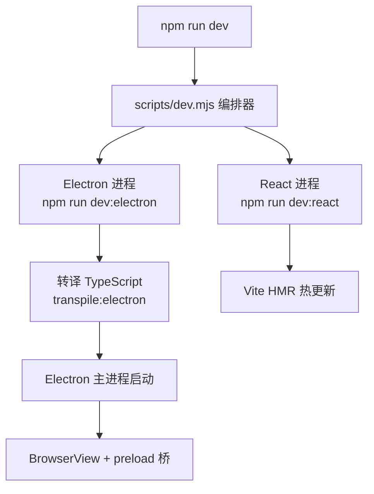
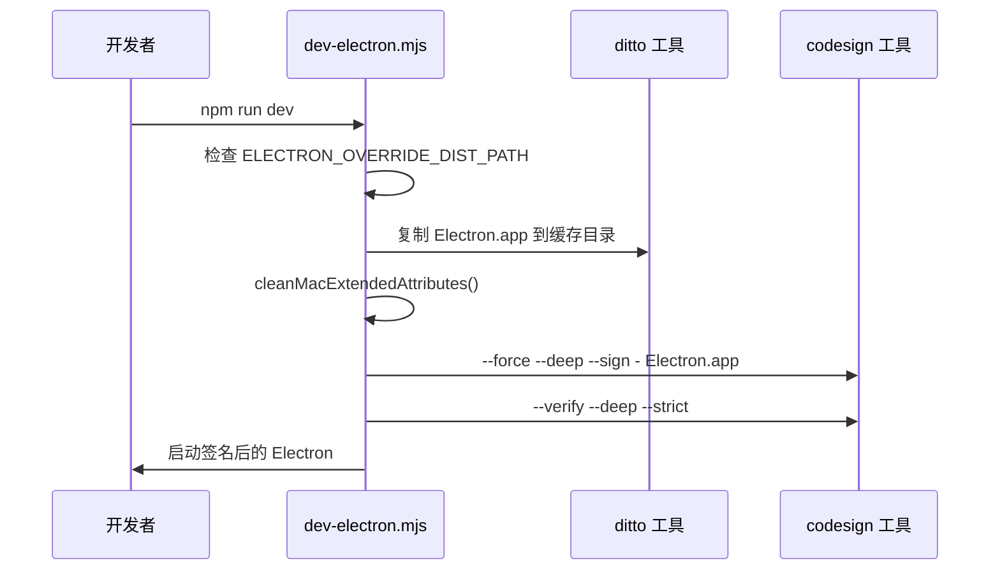
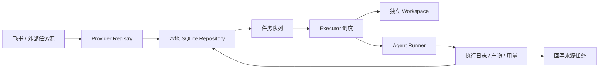

# 快速开始

<cite>
**本文引用的文件**
- [README.md](file://README.md)
- [package.json](file://package.json)
- [scripts/after-pack-win-icon.cjs](file://scripts/after-pack-win-icon.cjs)
- [scripts/codex-oauth-setup.mjs](file://scripts/codex-oauth-setup.mjs)
- [scripts/dev-electron.mjs](file://scripts/dev-electron.mjs)
- [scripts/dev.mjs](file://scripts/dev.mjs)
- [pro-workflow/scripts/secret-scan.js](file://pro-workflow/scripts/secret-scan.js)
- [pro-workflow/scripts/session-start.js](file://pro-workflow/scripts/session-start.js)
- [pro-workflow/scripts/subagent-start.js](file://pro-workflow/scripts/subagent-start.js)
</cite>

## 目录

- [前置条件](#前置条件)
- [安装依赖](#安装依赖)
- [开发启动](#开发启动)
- [首次配置](#首次配置)
- [构建与打包](#构建与打包)
- [验证与冒烟测试](#验证与冒烟测试)
- [常见初始化问题](#常见初始化问题)
- [项目入口与架构概览](#项目入口与架构概览)
- [排障速查表](#排障速查表)

---

## 前置条件

| 依赖 | 版本要求 | 用途 |
|------|----------|------|
| Node.js | ≥ 20.x | 运行时和构建工具 |
| npm | 最新稳定版 | 包管理 |
| Bun | 推荐安装 | 部分打包脚本需要 |

> ⚠️ Electron 原生模块（如 `better-sqlite3`）要求 Node.js ABI 版本与 Electron 内置版本一致。如果 Electron 版本更新后出现异常，使用 `npm run rebuild` 重新编译。

章节来源：[README.md#L38-L40](file://README.md#L38-L40)

---

## 安装依赖

```bash
npm install
```

`npm install` 会安装：

- 前端依赖：React 19、Zustand 状态管理、Arco Design UI 组件等
- 主进程依赖：Electron 39、better-sqlite3（原生模块）、electron-log 等
- 构建工具：Vite 7、TypeScript 5.9、electron-builder 26

章节来源：[package.json#L42-L122](file://package.json#L42-L122)

### 原生模块异常时

如果 `better-sqlite3` 加载失败（常见于 Electron 版本切换后）：

```bash
npm run rebuild
```

这会触发 `electron-rebuild`，针对当前 Electron 版本重新编译 `better-sqlite3`。
[package.json#L8](file://package.json#L8)

---

## 开发启动

### 完整开发模式（推荐）

```bash
npm run dev
```

这会启动编排脚本 `scripts/dev.mjs`，同时拉起：

1. **React 前端**：Vite 开发服务器（默认 `http://localhost:5173`）
2. **Electron 主进程**：`scripts/dev-electron.mjs` 转译 TypeScript 并启动桌面应用



章节来源：[scripts/dev.mjs#L63-L65](file://scripts/dev.mjs#L63-L65)，[scripts/dev-electron.mjs#L126-L136](file://scripts/dev-electron.mjs#L126-L136)

### 单独启动前端

```bash
npm run dev:react
```

仅启动 Vite，不启动 Electron。用于纯 UI 开发或调试。

### 单独启动 Electron

```bash
npm run dev:electron
```

先执行 `transpile:electron`，再启动桌面窗口。需要先确保前端已运行或 `dist/` 目录存在有效构建产物。

章节来源：[package.json#L11](file://package.json#L11)

### 首次启动流程

首次运行 `npm run dev` 时，`dev-electron.mjs` 会执行以下 macOS 签名流程：



Windows 用户会跳过签名流程，Linux 用户直接启动。

章节来源：[scripts/dev-electron.mjs#L72-L108](file://scripts/dev-electron.mjs#L72-L108)

---

## 首次配置

### 配置入口

首次启动后，进入 **设置 → AI接口** 页面。

### 网关配置步骤

1. 点击「新增」或启用已有的兼容网关
2. 填写 `Base URL`，例如 `http://localhost:5337/v1`
3. 填入 `API Key`（你的网关密钥）
4. 点击「从接口拉取模型」或手动添加模型名

章节来源：[README.md#L67-L77](file://README.md#L67-L77)

### 模型槽位说明

`tech-cc-hub` 支持五类模型分层配置：

| 槽位 | 用途 | 示例 |
|------|------|------|
| 默认主模型 | 普通聊天和任务执行 | `deepseek-v4-pro` |
| 专家模型 | 复杂问题兜底 | 同上 |
| 小模型 / 后台模型 | 标题、摘要、Haiku 等后台调用 | `MiniMax-M2.7` |
| Prompt 分析模型 | 执行复盘、上下文诊断 | 同小模型 |
| 图片预处理模型 | 读图、OCR、截图语义分析 | `qwen3.6-27b` |

> ⚠️ 如果遇到 `503 No available channel for model claude-haiku...`，优先检查「小模型 / 后台模型」是否配置成当前网关真实可用的模型。这个槽位会覆盖 Claude Code 内部的小模型请求，避免请求打到不可用的官方模型名。

章节来源：[README.md#L129-L136](file://README.md#L129-L136)

### Codex OAuth 配置（可选）

如果需要使用 Codex ChatGPT 登录：

```bash
npm run codex:oauth:setup
```

脚本会：
1. 检查 `~/.codex/auth.json` 是否存在有效凭证
2. 若无，触发 `codex login` 浏览器流程
3. 解析 JWT 提取 `access_token`、`id_token`、`refresh_token`
4. 写入平台对应的配置路径

配置路径因平台而异：
- Windows: `%APPDATA%/tech-cc-hub/api-config.json`
- macOS: `~/Library/Application Support/tech-cc-hub/api-config.json`
- Linux: `~/.config/tech-cc-hub/api-config.json`

章节来源：[scripts/codex-oauth-setup.mjs#L56-L65](file://scripts/codex-oauth-setup.mjs#L56-L65)，[scripts/codex-oauth-setup.mjs#L268-L288](file://scripts/codex-oauth-setup.mjs#L268-L288)

---

## 构建与打包

### 开发构建

```bash
npm run build
```

执行 `tsc -b`（TypeScript 项目编译）+ `vite build`（前端生产构建）。

产物输出到 `dist-electron/`（主进程）和 `dist/`（前端）。

章节来源：[package.json#L24](file://package.json#L24)

### 生产打包

| 平台 | 命令 | 产物 |
|------|------|------|
| macOS | `npm run package:mac` | zip 包（含 ARM64） |
| Windows | `npm run package:win` | 安全打包脚本，含图标注入 |
| Linux | `npm run dist:linux` | x64 包 |

Windows 打包会执行 `scripts/after-pack-win-icon.cjs`，在打包完成后将 `build/icon.ico` 注入到 `tech-cc-hub.exe`。

章节来源：[package.json#L29-L36](file://package.json#L29-L36)，[scripts/after-pack-win-icon.cjs#L5-L38](file://scripts/after-pack-win-icon.cjs#L5-L38)

### 仅转译 Electron 主进程

```bash
npm run transpile:electron
```

使用 `tsc --project src/electron/tsconfig.json` 将 TypeScript 转译到 `dist-electron/`。不触发 Vite 构建。

章节来源：[package.json#L28](file://package.json#L28)

---

## 验证与冒烟测试

### 基础冒烟测试

```bash
npm run qa:smoke
```

启动 Electron 并发送 `"请只回复：SMOKE_OK"`，验证聊天通道可用。

### 聊天 UI 测试

```bash
npm run qa:chat-ui
```

使用 Playwright 跑聊天界面的冒烟用例。

章节来源：[package.json#L12-L16](file://package.json#L12-L16)

### 代码通道测试

```bash
npm run qa:codex
```

120 秒超时测试，发送 `"/codex consult 你好，只回复 CODEX_SMOKE_OK"`。

### 窗口截图工具

```bash
# 列出可截图的窗口 ID
npm run qa:window:list

# 捕获指定窗口截图
npm run qa:window:capture -- <windowId> <output.png>
```

章节来源：[package.json#L21-L22](file://package.json#L21-L22)

### ProWorkflow 会话初始化

`pro-workflow/scripts/session-start.js` 在每次会话启动时运行，职责：

1. 查找项目根目录（向上找 `.git`）
2. 尝试连接 `dist/db/store.js`，加载最近 5 条 learnings
3. 读取上次会话信息（编辑次数、纠正次数）
4. 列出可用 wikis
5. 检查 git worktree 数量

```bash
node pro-workflow/scripts/session-start.js
```

章节来源：[pro-workflow/scripts/session-start.js#L30-L123](file://pro-workflow/scripts/session-start.js#L30-L123)

### Secret Scan 安全检查

`pro-workflow/scripts/secret-scan.js` 在工具调用前执行，扫描内容中的敏感信息：

- 检测范围：AWS Key、GitHub Token、Anthropic API Key、OpenAI API Key、Private Key 等
- 白名单：跳过 `process.env.`、`os.getenv` 等正确用法
- 拒绝写入：以 `.env`、`.pem`、`/secrets/` 结尾的文件路径

章节来源：[pro-workflow/scripts/secret-scan.js#L2-L66](file://pro-workflow/scripts/secret-scan.js#L2-L66)

---

## 常见初始化问题

### 问题：Electron 主进程启动失败

**症状**：终端显示 `Error: Electron.app not found at node_modules/electron/dist/Electron.app`

**原因**：macOS 签名流程需要 `node_modules/electron/dist/` 中的原始 Electron.app。

**排查**：
1. 确认已运行 `npm install`
2. 检查 `node_modules/electron/dist/Electron.app` 是否存在
3. 若存在但签名失败，`dev-electron.mjs` 会抛出 `did not pass codesign verification`

章节来源：[scripts/dev-electron.mjs#L82-L87](file://scripts/dev-electron.mjs#L82-L87)

### 问题：better-sqlite3 模块加载错误

**症状**：`Cannot find module 'better-sqlite3'` 或 ABI 版本不匹配错误

**解决**：
```bash
npm run rebuild
```

章节来源：[package.json#L8](file://package.json#L8)

### 问题：Windows 打包后图标未更新

**排查**：
1. 确认 `build/icon.ico` 存在
2. 确认 `scripts/after-pack-win-icon.cjs` 没有被跳过
3. 检查 `rcedit.exe` 是否在 `node_modules/electron-winstaller/vendor/`

章节来源：[scripts/after-pack-win-icon.cjs#L22-L24](file://scripts/after-pack-win-icon.cjs#L22-L24)

### 问题：飞书任务同步不到

**排查顺序**：
1. Lark CLI 是否已登录
2. 应用权限是否包含 `task:task:read`、`task:task:write`、`task:tasklist:read`

章节来源：[README.md#L183-L184](file://README.md#L183-L184)

### 问题：图片工具返回「图片预处理失败」

**原因**：图片预处理模型未配置，或本地 VLM bridge 不健康。

**排查**：
1. 检查设置页「图片预处理模型」是否填了可读图的模型
2. 检查 `new-api` channel 是否可用
3. 确认图片模型支持 vision

章节来源：[README.md#L182-L183](file://README.md#L182-L183)

---

## 项目入口与架构概览

### 主进程入口

```text
dist-electron/electron/main.js
```

由 `src/electron/main.ts` 转译而来，负责：
- 创建 `BrowserView`（右侧浏览器）
- 加载 preload 脚本（IPC 桥）
- 管理任务系统 Executor
- 初始化 MCP 工具

章节来源：[package.json#L6](file://package.json#L6)

### 任务系统架构



- Provider 负责对接外部任务源（如飞书）
- Repository 负责本地持久化
- Executor 是唯一调度入口
- 每个任务拥有独立 workspace，可覆盖模型、强度、运行器

章节来源：[README.md#L94-L116](file://README.md#L94-L116)

### 目录结构

```
tech-cc-hub/
├── src/
│   ├── electron/
│   │   ├── main.ts          # 主进程入口
│   │   ├── preload.ts       # IPC 桥
│   │   └── libs/
│   │       ├── task/        # 任务系统：provider、repository、workflow、executor
│   │       └── mcp-tools/   # 内置 MCP 工具：browser、design、admin
│   └── ui/                  # React 前端
├── scripts/
│   ├── dev.mjs              # 开发启动编排
│   ├── dev-electron.mjs     # Electron 启动（含 macOS 签名）
│   └── qa/                  # 冒烟测试和窗口截图工具
├── pro-workflow/
│   └── scripts/             # ProWorkflow 辅助脚本
└── doc/                     # 设计、研发、运维文档
```

章节来源：[README.md#L158-L175](file://README.md#L158-L175)

---

## 排障速查表

| 现象 | 优先检查 |
|------|----------|
| `API Error: ConnectionRefused` | 网关或本地模型桥是否在监听；Docker 内访问宿主机用 `host.docker.internal` |
| `No available channel for model claude-haiku...` | 设置页「小模型 / 后台模型」是否配置当前网关真实可用模型 |
| 图片工具返回「图片预处理失败」 | 图片预处理模型是否可读图；VLM bridge 和 `new-api` channel 是否健康 |
| 飞书任务同步不到 | Lark CLI 是否登录；应用权限是否包含 `task:task:read/write`、`task:tasklist:read` |
| 任务一直执行中 | 查看任务详情右侧时间线；重启后 Executor 会按 workflow 配置恢复或重试 |
| 右侧浏览器浮在主界面 | 检查 BrowserView 销毁和当前页面路由，不要简单禁用右侧浏览器入口 |

章节来源：[README.md#L177-L187](file://README.md#L177-L187)

---

**下一步**

- 想了解任务系统的完整实现 → [src/electron/libs/task/README.md](file://src/electron/libs/task/README.md)
- 想了解内置 MCP 工具 → [src/electron/libs/mcp-tools/README.md](file://src/electron/libs/mcp-tools/README.md)
- 想了解产品设计 → [DESIGN.md](file://DESIGN.md)
- 文档总索引 → [doc/README.md](file://doc/README.md)