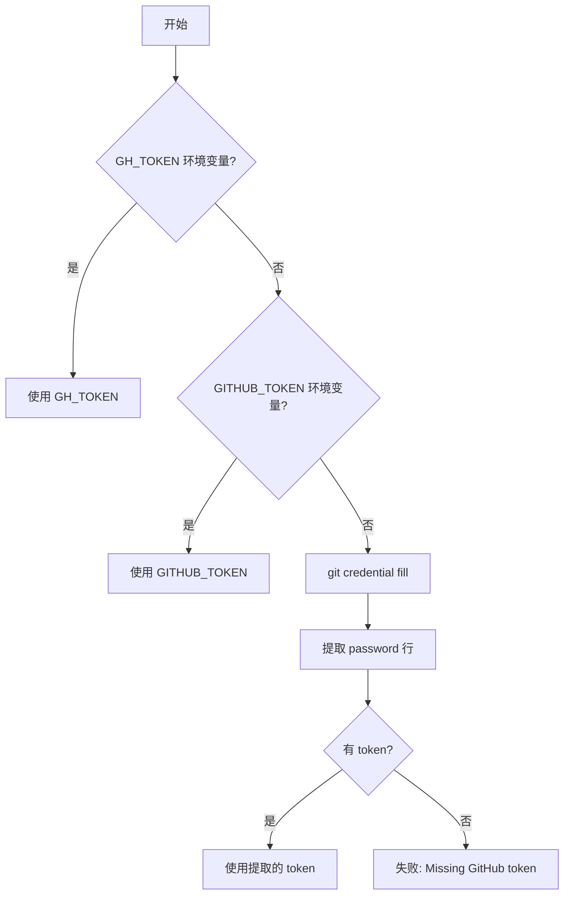
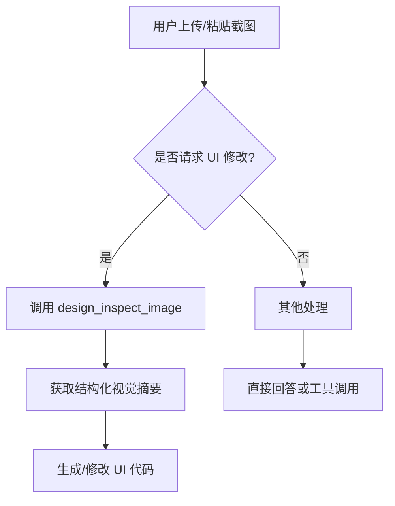
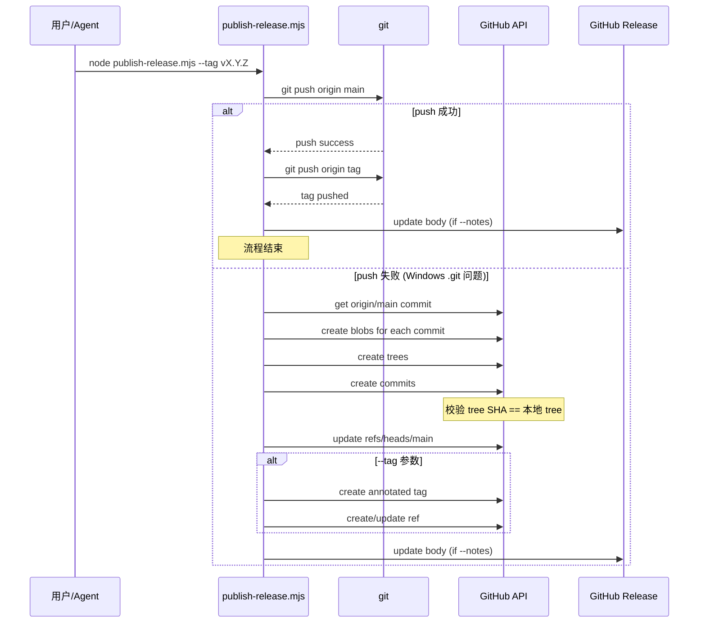

# 执行平面组件设计

<cite>

**本文引用的文件**

- [skills/tech-cc-hub-release-deploy/scripts/publish-release.mjs](file://skills/tech-cc-hub-release-deploy/scripts/publish-release.mjs)
- [scripts/github-release.mjs](file://scripts/github-release.mjs)
- [src/electron/libs/system-prompt-presets.ts](file://src/electron/libs/system-prompt-presets.ts)
- [skills/tech-cc-hub-release-deploy/SKILL.md](file://skills/tech-cc-hub-release-deploy/SKILL.md)
- [skills/tech-cc-hub-release-deploy/agents/openai.yaml](file://skills/tech-cc-hub-release-deploy/agents/openai.yaml)
- [pro-workflow/skills/wiki-research-loop/scripts/research-loop.js](file://pro-workflow/skills/wiki-research-loop/scripts/research-loop.js)
- [src/electron/libs/git/README.md](file://src/electron/libs/git/README.md)
- [src/electron/libs/mcp-tools/README.md](file://src/electron/libs/mcp-tools/README.md)
- [src/electron/libs/task/README.md](file://src/electron/libs/task/README.md)

</cite>

---

## 目录

- [1. 执行平面概述](#1-执行平面概述)
- [2. 发布部署子系统](#2-发布部署子系统)
- [3. System Prompt 预设系统](#3-system-prompt-预设系统)
- [4. Git 工作台模块](#4-git-工作台模块)
- [5. MCP 工具集](#5-mcp-工具集)
- [6. 任务执行模块](#6-任务执行模块)
- [7. 发布流程序列](#7-发布流程序列)
- [8. 扩展点与配置](#8-扩展点与配置)
- [9. 故障排查](#9-故障排查)

---

## 1. 执行平面概述

执行平面负责将规划决策转化为可观测、可追溯的实际操作。tech-cc-hub 的执行平面由以下核心子系统组成：

| 子系统 | 职责 | 入口文件 |
|--------|------|----------|
| **发布部署** | 代码提交、推送、打 tag、GitHub Release 管理 | `publish-release.mjs` |
| **Git 工作台** | 仓库操作封装、状态管理、历史记录 | `src/electron/libs/git/` |
| **MCP 工具集** | 内置工具暴露给 Agent 调用 | `src/electron/libs/mcp-tools/` |
| **任务系统** | 多任务编排、并发控制、workspace 管理 | `src/electron/libs/task/` |
| **Prompt 预设** | 运行时系统 Prompt 动态组装 | `system-prompt-presets.ts` |

执行平面的设计原则：

- **主进程边界**：所有涉及系统调用的操作（git、文件读写、子进程）必须经由主进程执行，Renderer 通过 IPC 调用
- **幂等性优先**：发布脚本支持 `--api-only` 回退路径，避免 Windows git push 失败后无法完成发布
- **工具可组合**：MCP 工具按能力分类（browser、design、figma-rest、admin），可按需触发

---

## 2. 发布部署子系统

### 2.1 模块职责

发布部署子系统处理从代码提交到 GitHub Release 的完整链路。核心能力包括：

1. **普通 Git push 优先**：先尝试 `git push`，成功则返回
2. **API fallback**：push 失败时自动降级到 GitHub Git Data API（处理 Windows `.git` 路径发现失败问题）
3. **Tag 管理**：支持创建、移动、删除 annotated tag
4. **Release body 更新**：支持补更新发布说明

章节来源：[skills/tech-cc-hub-release-deploy/SKILL.md#L10-L29](file://skills/tech-cc-hub-release-deploy/SKILL.md#L10-L29)

### 2.2 入口与参数

**脚本入口**：`node skills/tech-cc-hub-release-deploy/scripts/publish-release.mjs`

| 参数 | 说明 | 示例 |
|------|------|------|
| `--tag <version>` | 指定版本 tag | `--tag v0.1.13` |
| `--notes <path>` | Release notes 文件路径 | `--notes .tmp/notes.md` |
| `--retag` | 允许移动已存在的 tag | |
| `--delete-release` | 删除同名 GitHub Release 后重建 | |
| `--api-only` | 跳过普通 push，直接走 GitHub API | |
| `--notes-only` | 仅更新已有 release 的说明 | |

### 2.3 Token 获取优先级

凭证获取按以下顺序尝试 [file://skills/tech-cc-hub-release-deploy/scripts/publish-release.mjs#L75-L85](file://skills/tech-cc-hub-release-deploy/scripts/publish-release.mjs#L75-L85)：



### 2.4 API Fallback 核心逻辑

当普通 push 失败时，脚本通过 GitHub API 逐 commit 重建提交历史 [file://skills/tech-cc-hub-release-deploy/scripts/publish-release.mjs#L251-L306](file://skills/tech-cc-hub-release-deploy/scripts/publish-release.mjs#L251-L306)：

1. 获取远程 `origin/main` 的 commit SHA
2. 验证远程 commit 是本地 HEAD 的祖先（线性提交范围）
3. 遍历 `origin/main..HEAD` 的每个 commit：
   - 调用 `createApiTreeForCommit` 创建 blob 和 tree
   - 校验 GitHub API 返回的 tree SHA 必须等于本地 commit tree
   - 创建 commit 对象，传入原始 author/committer/message
   - 期望远端 commit SHA 与本地完全一致
4. 更新 `refs/heads/main`
5. 创建/更新 annotated tag

### 2.5 github-release.mjs 差异

`scripts/github-release.mjs` 是独立脚本，职责不同：

| 特性 | `publish-release.mjs` | `github-release.mjs` |
|------|------------------------|----------------------|
| 版本号修改 | 不修改 package.json | 调用 `npm version` 递增 |
| Tag 创建 | 可选，需 `--tag` | 自动从 semver 推导 |
| Push 策略 | 普通 push + API fallback | 纯普通 push |
| Release API | 可选更新 body | 自动 upsert GitHub Release |

章节来源：[scripts/github-release.mjs#L37-L39](file://scripts/github-release.mjs#L37-L39)

---

## 3. System Prompt 预设系统

### 3.1 模块职责

`system-prompt-presets.ts` 负责在运行时组装系统级 Prompt 追加内容，涵盖工具调用策略、飞书文档读取、设计还原规则等。

### 3.2 预设函数一览

| 函数 | 输出内容 | 调用时机 |
|------|----------|----------|
| `buildBrowserWorkbenchPromptAppend()` | BrowserView 内置工具优先规则 | Browser 工作台激活时 |
| `buildAdminConfigPromptAppend()` | 配置持久化治理规则 | 配置写入操作时 |
| `buildToolCallOptimizationPromptAppend()` | 工具调用budget、批处理原则 | 每次请求 |
| `buildFeishuDocumentFetchPromptAppend()` | 飞书文档链接直读规则 | 检测到 feishu.cn 链接时 |
| `buildDesignParityPromptAppend()` | 设计还原工具使用规范 | 用户给截图/Figma时 |
| `buildBuiltinMcpRegistryPromptAppend()` | built-in MCP 服务器提示 | 启动时 |
| `buildClaudeCode2139FeaturePromptAppend()` | Claude Code 兼容性追加 | 2.1.139 版本时 |

章节来源：[src/electron/libs/system-prompt-presets.ts#L12-L134](file://src/electron/libs/system-prompt-presets.ts#L12-L134)

### 3.3 Prompt 来源注册表

`buildTechCCHubSystemPromptSources()` 汇总所有预设，返回 `PromptLedgerSource[]`：

```typescript
export function buildTechCCHubSystemPromptSources(): PromptLedgerSource[] {
  return [
    { id: "tech-cc-hub-browser-preset", label: "tech-cc-hub 内置浏览器预设", sourceKind: "system", text: buildBrowserWorkbenchPromptAppend() },
    { id: "tech-cc-hub-admin-preset", label: "tech-cc-hub 配置治理预设", sourceKind: "system", text: buildAdminConfigPromptAppend() },
    { id: "tech-cc-hub-tool-policy-preset", label: "tech-cc-hub 工具调用预设", sourceKind: "system", text: buildToolCallOptimizationPromptAppend() },
    { id: "tech-cc-hub-design-preset", label: "tech-cc-hub 设计还原预设", sourceKind: "system", text: buildDesignParityPromptAppend() },
    { id: "tech-cc-hub-builtin-mcp-registry-preset", label: "built-in MCP registry preset", sourceKind: "system", text: buildBuiltinMcpRegistryPromptAppend() },
    { id: "tech-cc-hub-claude-code-2139-preset", label: "Claude Code 2.1.139 compatibility preset", sourceKind: "system", text: buildClaudeCode2139FeaturePromptAppend() },
  ];
}
```

章节来源：[src/electron/libs/system-prompt-presets.ts#L136-L175](file://src/electron/libs/system-prompt-presets.ts#L136-L175)

### 3.4 飞书文档链接提取

```typescript
const FEISHU_DOC_URL_PATTERN = /https?:\/\/[^\s<>"'`]*feishu\.cn\/(?:wiki|docx|docs)\/[^\s<>"'`]*/gi;
// 最大提取 3 个 URL
const MAX_FEISHU_DOC_URL_HINTS = 3;
```

飞书文档读取需要同时满足：
- 检测到 feishu.cn wiki/docx/docs 链接
- `LARK_CLI_COMMAND` 和 `LARK_CLI_PROFILE` 环境变量均已配置

章节来源：[src/electron/libs/system-prompt-presets.ts#L7-L10](file://src/electron/libs/system-prompt-presets.ts#L7-L10)

---

## 4. Git 工作台模块

### 4.1 模块边界

Git 工作台位于 `src/electron/libs/git/`，是主进程中的唯一 Git 操作入口，Renderer 必须通过 IPC 调用。

**文件结构**：

| 文件 | 职责 |
|------|------|
| `types.ts` | 领域类型和 IPC payload/result 定义 |
| `errors.ts` | Git 错误归一化处理 |
| `service.ts` | Git 操作唯一入口 |
| `history.ts` | commit history 解析器 |
| `graph.ts` | lightweight graph lane 生成 |
| `operation-log.ts` | 本地高影响操作日志 |
| `ipc.ts` | Electron IPC handler 注册 |
| `index.ts` | 对外统一出口 |

章节来源：[src/electron/libs/git/README.md#L1-L14](file://src/electron/libs/git/README.md#L1-L14)

### 4.2 第一版允许/禁止操作

| 允许的操作 | 禁止的操作 |
|------------|------------|
| status / diff | reset |
| stage / unstage | rebase |
| commit | cherry-pick |
| ordinary push | force push |
| create / checkout branch | amend |
| stash save / apply / drop | squash |
| recent history / lightweight graph | interactive rebase |

章节来源：[src/electron/libs/git/README.md#L16-L34](file://src/electron/libs/git/README.md#L16-L34)

### 4.3 设计原则

- **单入口**：所有 Git 操作必须经过 `service.ts`，禁止在 Renderer 或其他模块直接执行 git 命令
- **错误归一化**：`errors.ts` 定义统一的错误类型，方便前端展示和日志记录
- **操作日志**：`operation-log.ts` 记录高影响操作（push、commit、branch 创建等），用于审计和回放

---

## 5. MCP 工具集

### 5.1 模块职责

`src/electron/libs/mcp-tools/` 集中存放暴露给 Agent 的内置 MCP 工具，避免 `libs` 根目录膨胀。

**工具分类**：

| 工具 | 文件 | 核心能力 |
|------|------|----------|
| `browser` | `browser.ts` | 导航、截图摘要、DOM 查询、样式检查、标注模式 |
| `design` | `design.ts` | 截图语义分析、两图对比、diff 图、JSON report、产物列表 |
| `figma-rest` | `figma-rest.ts` | Figma 只读 API：文件/节点读取、设计系统、变量、Dev Resources |
| `admin` | `admin.ts` | 写入 `agent-runtime.json` 的全局运行参数 |

章节来源：[src/electron/libs/mcp-tools/README.md#L1-L22](file://src/electron/libs/mcp-tools/README.md#L1-L22)

### 5.2 设计工具默认触发场景

1. 用户给出截图、Figma 图、页面参考图，要求生成或修改 UI/前端代码
2. 用户反馈页面和参考图不一致，需要按截图修 UI

**单张截图流程**：



章节来源：[src/electron/libs/mcp-tools/README.md#L16-L21](file://src/electron/libs/mcp-tools/README.md#L16-L21)

### 5.3 设计工具关键参数

| 参数 | 用途 |
|------|------|
| `ignoreRegions` | 忽略时间戳/头像/动画等动态区域 |
| `maxDifferenceRatio` | 设置通过/失败阈值 |
| `ignoreAntialiasing` | 文字抗锯齿噪声多时启用 |
| `diffColorMode: directional` | 区分变亮/变暗 |

---

## 6. 任务执行模块

### 6.1 模块边界

`src/electron/libs/task/` 统一收口任务系统主进程代码。

**文件结构**：

| 文件 | 职责 |
|------|------|
| `types.ts` | 任务、执行记录、IPC payload 的领域类型 |
| `provider-registry.ts` | Provider 注册表和 fallback provider |
| `providers/` | 外部任务源适配器（目前包含 Lark） |
| `repository.ts` | SQLite schema、任务状态、执行记录和日志持久化 |
| `workflow.ts` | Symphony-style workflow 配置、轮询、重试和 stall 默认参数 |
| `workspace.ts` | 每个任务的独立 workspace 创建和路径安全 |
| `executor.ts` | 编排器：同步、自动执行、并发控制、重试、恢复和日志事件 |
| `index.ts` | 对外统一出口 |

章节来源：[src/electron/libs/task/README.md#L1-L14](file://src/electron/libs/task/README.md#L1-L14)

### 6.2 运行原则

1. **外部 provider 只映射**：`providers/` 适配器将第三方任务映射为 `ExternalTask`，不直接改 UI 或会话
2. **Repository 只持久化**：不启动 runner
3. **Executor 唯一调度**：所有自动/手动执行都经过这里
4. **独立 workspace**：每个任务使用独立 workspace，避免互相污染

章节来源：[src/electron/libs/task/README.md#L16-L22](file://src/electron/libs/task/README.md#L16-L22)

### 6.3 研究循环脚本

`pro-workflow/skills/wiki-research-loop/scripts/research-loop.js` 是独立的研究循环脚本，支持：

| 命令 | 功能 |
|------|------|
| `run <slug>` | 执行研究循环，处理 pending seeds |
| `seed <slug> "<query>"` | 入队新的查询 seed |
| `seeds <slug> [--status pending\|active\|done\|failed]` | 列出 seeds 状态 |
| `cancel <slug>` | 取消 slug 下所有 pending/active seeds |
| `status` | 全局 kill-switch 状态和各 wiki 统计 |

章节来源：[pro-workflow/skills/wiki-research-loop/scripts/research-loop.js#L344-L352](file://pro-workflow/skills/wiki-research-loop/scripts/research-loop.js#L344-L352)

---

## 7. 发布流程序列



---

## 8. 扩展点与配置

### 8.1 Skill 定义扩展

`skills/tech-cc-hub-release-deploy/agents/openai.yaml` 定义了 skill 接口：

```yaml
interface:
  display_name: "tech-cc-hub 发布部署"
  short_description: "提交、推送、移动 tag、打包并更新 tech-cc-hub 的 GitHub Release。"
```

新增发布场景时，参考此结构创建新 skill。

### 8.2 System Prompt 扩展

`agent-runtime.json` 支持 `systemPromptExt` 字段，可在运行时追加系统级 Prompt：

```json
{
  "systemPromptExt": [
    "自定义规则行1",
    "自定义规则行2"
  ]
}
```

通过 `getSystemPromptExtLines()` 读取并追加到模型输入。

章节来源：[src/electron/libs/system-prompt-presets.ts#L93-L111](file://src/electron/libs/system-prompt-presets.ts#L93-L111)

### 8.3 研究循环扩展

`wiki-research-loop` 支持通过 `wiki.config.md` 配置自动研究：

```yaml
auto_research:
  enabled: true
  fetchers: [web, arxiv, github]
  max_pages_per_run: 5
  max_depth: 3
  budget_usd: 0.50
```

Fetcher 目录支持两层加载：
- 内置：`pro-workflow/skills/wiki-research-loop/scripts/source-fetchers/`
- 用户级：`~/.pro-workflow/fetchers/`

章节来源：[pro-workflow/skills/wiki-research-loop/scripts/research-loop.js#L36-L56](file://pro-workflow/skills/wiki-research-loop/scripts/research-loop.js#L36-L56)

---

## 9. 故障排查

### 9.1 发布脚本常见失败

| 错误 | 原因 | 解法 |
|------|------|------|
| `Missing GitHub token` | 未设置 GH_TOKEN/GITHUB_TOKEN 且 git credential 无效 | 配置 token 或重新登录 git credential |
| `origin/main is not an ancestor of HEAD` | 远程已有新提交 | 先 `git fetch origin && git rebase origin/main` |
| `GitHub API tree mismatch` | API 创建的 tree 与本地 commit tree SHA 不一致 | 通常由特殊字符或编码问题导致，报告 issue |
| `Tag already exists` | 未传 `--retag` 但 tag 已存在 | 确认是否要移动 tag，再加 `--retag` |

章节来源：[skills/tech-cc-hub-release-deploy/scripts/publish-release.mjs#L187-L191](file://skills/tech-cc-hub-release-deploy/scripts/publish-release.mjs#L187-L191)

### 9.2 API Fallback 后验证

API fallback 成功后，执行以下命令验证一致性 [file://skills/tech-cc-hub-release-deploy/SKILL.md#L74-L80](file://skills/tech-cc-hub-release-deploy/SKILL.md#L74-L80)：

```bash
git rev-parse HEAD
git rev-parse origin/main
git ls-remote --heads origin main
```

三者应指向同一 commit SHA。若不一致，先检查脚本输出的 tree/commit mismatch，不要继续发 release。

### 9.3 研究循环常见问题

| 问题 | 解法 |
|------|------|
| `no usable fetchers among: xxx` | 检查 fetcher 目录是否存在且 .js 文件可加载 |
| `wiki xxx is private` | 私有 wiki 不接受非 local fetcher |
| `kill-switch active` | 检查 `~/.pro-workflow/STOP` 文件是否存在 |
| `budget exceeded` | 降低 `--budget-usd` 或减少 `--max-pages` |

章节来源：[pro-workflow/skills/wiki-research-loop/scripts/research-loop.js#L183-L187](file://pro-workflow/skills/wiki-research-loop/scripts/research-loop.js#L183-L187)