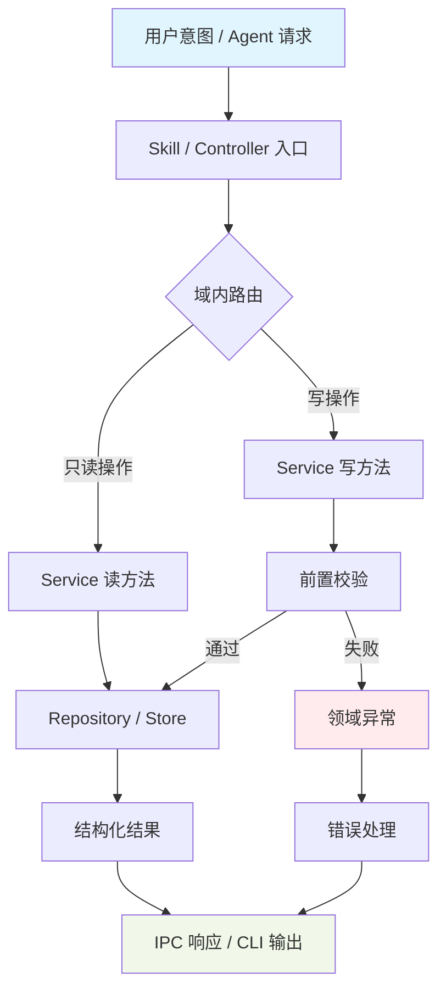
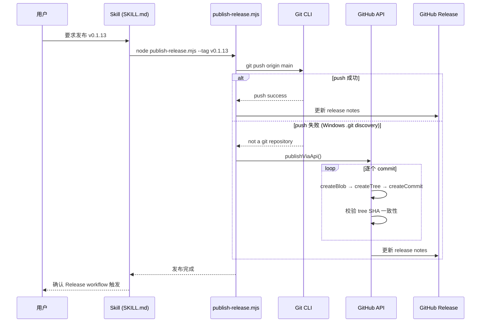
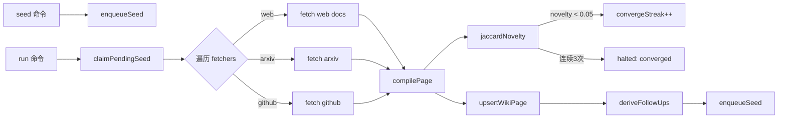
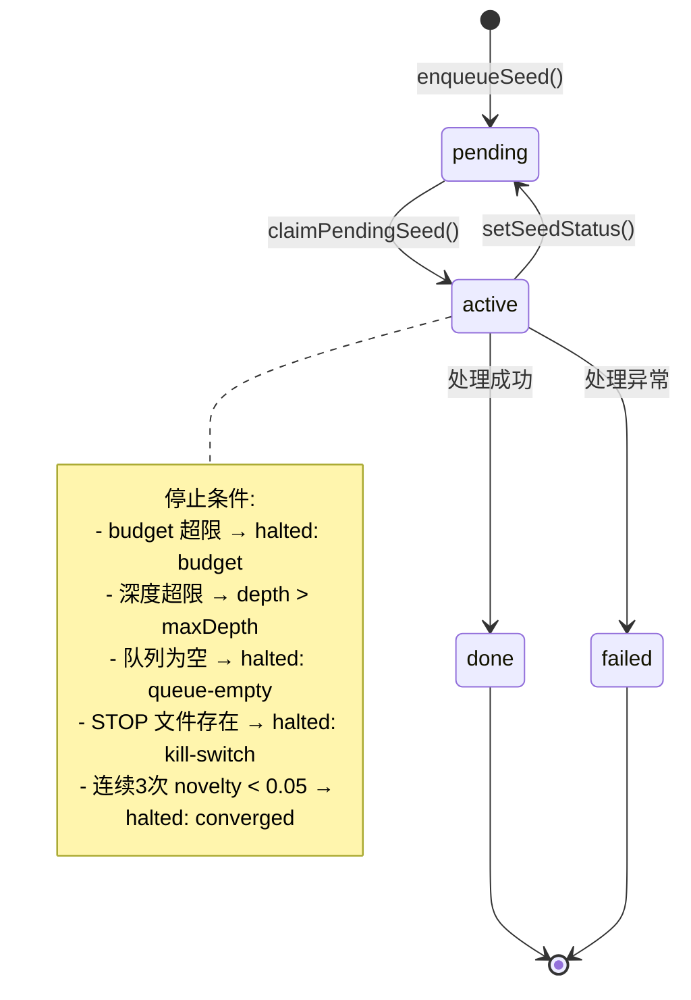
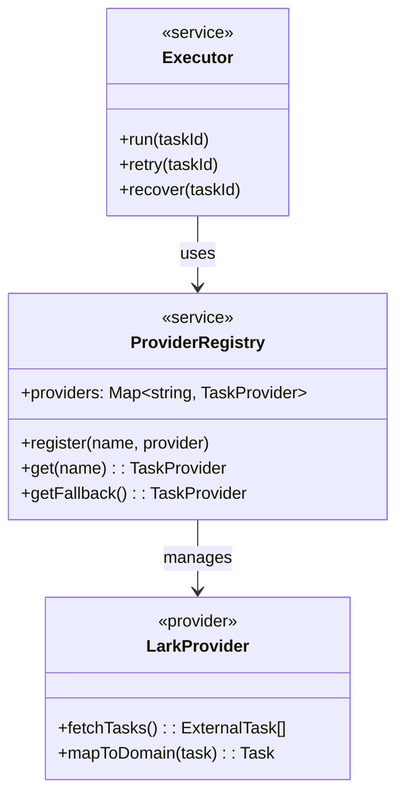
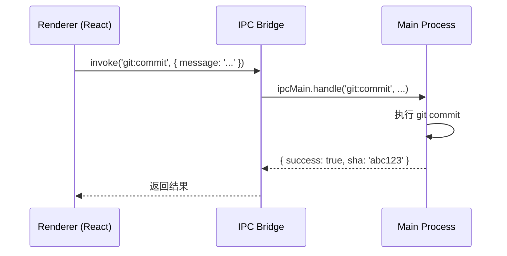
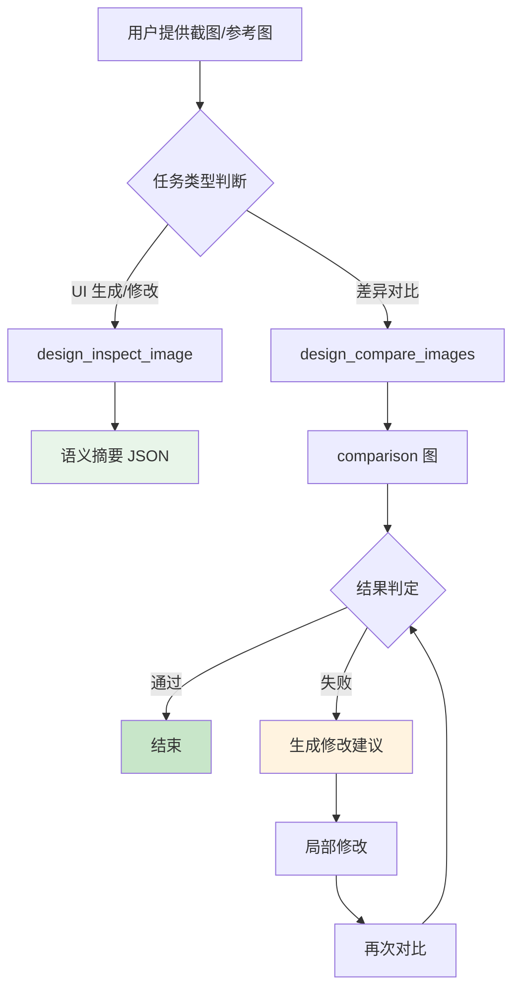

# 控制器设计规格

<cite>
**本文引用的文件**
- [skills/tech-cc-hub-release-deploy/scripts/publish-release.mjs](file://skills/tech-cc-hub-release-deploy/scripts/publish-release.mjs)
- [scripts/github-release.mjs](file://scripts/github-release.mjs)
- [src/electron/libs/system-prompt-presets.ts](file://src/electron/libs/system-prompt-presets.ts)
- [skills/tech-cc-hub-release-deploy/SKILL.md](file://skills/tech-cc-hub-release-deploy/SKILL.md)
- [skills/tech-cc-hub-release-deploy/agents/openai.yaml](file://skills/tech-cc-hub-release-deploy/agents/openai.yaml)
- [pro-workflow/skills/wiki-research-loop/scripts/research-loop.js](file://pro-workflow/skills/wiki-research-loop/scripts/research-loop.js)
- [src/electron/libs/git/README.md](file://src/electron/libs/git/README.md)
- [src/electron/libs/mcp-tools/README.md](file://src/electron/libs/mcp-tools/README.md)
- [src/electron/libs/task/README.md](file://src/electron/libs/task/README.md)
</cite>

# 控制器设计规格

本文档定义 tech-cc-hub 中**控制器（Controller）** 的设计规范、职责边界和实现模式。控制器是用户意图与系统能力之间的桥梁，负责接收请求、协调子模块、返回结构化结果。

## 目录

- [1. 术语与职责定义](#1-术语与职责定义)
- [2. 模块边界规范](#2-模块边界规范)
- [3. 调用链与数据流](#3-调用链与数据流)
- [4. 入口点与参数契约](#4-入口点与参数契约)
- [5. 数据结构与状态机](#5-数据结构与状态机)
- [6. 失败模式与排障](#6-失败模式与排障)
- [7. 扩展点与注册机制](#7-扩展点与注册机制)
- [8. 跨模块协作模式](#8-跨模块协作模式)
- [9. 验收标准](#9-验收标准)

---

## 1. 术语与职责定义

### 1.1 什么是控制器

控制器是处理单一领域请求的**入口模块**，具有以下特征：

| 特征 | 说明 |
|------|------|
| 单一职责 | 每个控制器只处理一个业务领域 |
| 有界上下文 | 明确的数据边界，不直接读写其他域的状态 |
| 幂等设计 | 相同输入产生相同输出，允许重试 |
| 可编排 | 控制器之间通过明确定义的接口协作 |

### 1.2 控制器类型

tech-cc-hub 中存在两类控制器：

1. **前端控制器（Frontend Controller）**：运行在 Renderer 进程，直接响应 UI 事件
2. **后端控制器（Backend Controller）**：运行在 Main 进程或 Node.js 脚本，通过 IPC 暴露

> **章节来源**：[src/electron/libs/git/README.md#L1-L4](file://src/electron/libs/git/README.md#L1-L4) — Git 模块明确声明 "Renderer 只能通过 IPC 调用这里，不直接执行 git"

---

## 2. 模块边界规范

### 2.1 强制边界规则

每个控制器必须遵循以下边界约束：

```text
✅ 允许的操作
├── 接收请求参数
├── 调用同域内子模块
├── 读取/写入自身关联的存储
└── 返回结构化结果或抛出领域异常

❌ 禁止的操作
├── 直接修改 React UI 状态
├── 调用未注册的外部 API
├── 访问其他域的私有数据
└── 在错误处理中隐藏真实失败原因
```

> **章节来源**：[src/electron/libs/mcp-tools/README.md#L12-L14](file://src/electron/libs/mcp-tools/README.md#L12-L14)

### 2.2 目录结构约定

控制器模块必须位于统一目录下，按域划分：

```
src/electron/libs/
├── git/           # Git 工作台域
│   ├── types.ts   # 领域类型和 IPC payload
│   ├── errors.ts  # 错误归一化
│   ├── service.ts # 唯一操作入口
│   ├── ipc.ts     # IPC handler 注册
│   └── index.ts   # 统一出口
├── mcp-tools/     # MCP 工具域
│   ├── browser.ts # 浏览器工具
│   ├── design.ts  # 设计工具
│   └── admin.ts   # 管理工具
└── task/          # 任务编排域
    ├── types.ts
    ├── repository.ts
    ├── executor.ts
    └── index.ts
```

> **章节来源**：[src/electron/libs/task/README.md#L1-L14](file://src/electron/libs/task/README.md#L1-L14)

### 2.3 模块内部角色

每个控制器内部应由以下角色组成：

| 文件 | 职责 |
|------|------|
| `types.ts` | 定义领域类型、IPC payload/result |
| `errors.ts` | 错误归一化与分类 |
| `service.ts` | 唯一业务逻辑入口 |
| `ipc.ts` | Electron IPC handler 注册 |
| `index.ts` | 对外统一导出 |

---

## 3. 调用链与数据流

### 3.1 典型调用链



### 3.2 发布部署调用链示例

发布部署场景展示了完整的控制器协作：



> **图表来源**：[skills/tech-cc-hub-release-deploy/SKILL.md#L21-L28](file://skills/tech-cc-hub-release-deploy/SKILL.md#L21-L28)

### 3.3 Research Loop 调用链



> **章节来源**：[pro-workflow/skills/wiki-research-loop/scripts/research-loop.js#L161-L267](file://pro-workflow/skills/wiki-research-loop/scripts/research-loop.js#L161-L267)

---

## 4. 入口点与参数契约

### 4.1 IPC 入口点注册

Main 进程中的控制器通过 `ipc.ts` 注册 handler：

```typescript
// ipc.ts 示例模式
export function registerIpcHandlers() {
  ipcMain.handle('git:status', handleGitStatus);
  ipcMain.handle('git:commit', handleGitCommit);
  ipcMain.handle('task:create', handleTaskCreate);
}
```

> **章节来源**：[src/electron/libs/git/README.md#L9](file://src/electron/libs/git/README.md#L9)

### 4.2 CLI 脚本入口点

Node.js 脚本通过 `main()` 函数作为入口：

```javascript
// github-release.mjs 入口模式
async function main() {
  // 1. 前置校验
  ensureGitRepository();
  ensureOriginRemote();
  ensureCleanWorktree();

  // 2. 参数解析与业务逻辑
  const nextVersion = bumpVersion(currentVersion, requestedVersion);

  // 3. 执行与结果输出
  run("git", ["push", "origin", "HEAD"]);
  await upsertGithubRelease(tag, body);
}

main().catch((error) => fail(error instanceof Error ? error.message : String(error)));
```

> **章节来源**：[scripts/github-release.mjs#L387-L443](file://scripts/github-release.mjs#L387-L443)

### 4.3 参数解析规范

CLI 脚本必须支持以下参数模式：

| 模式 | 示例 | 说明 |
|------|------|------|
| `--flag` | `--dry-run` | 布尔标志 |
| `--key=value` | `--tag=v0.1.13` | 带值标志 |
| `--key value` | `--notes .tmp/notes.md` | 空格分隔值 |
| positional | `patch` | 位置参数 |

参数解析实现参考：

```javascript
// github-release.mjs 参数解析
const args = process.argv.slice(2);
const flags = new Set();
const options = new Map();
const positionals = [];

for (let i = 0; i < args.length; i++) {
  const arg = args[i];
  if (!arg.startsWith("--")) {
    positionals.push(arg);
    continue;
  }
  const [key, ...rest] = arg.split("=");
  if (rest.length > 0) {
    options.set(key, rest.join("="));
  } else if (i + 1 < args.length && !args[i + 1].startsWith("--")) {
    options.set(key, args[i + 1]);
    i += 1;
  } else {
    flags.add(key);
  }
}
```

> **章节来源**：[scripts/github-release.mjs#L10-L35](file://scripts/github-release.mjs#L10-L35)

### 4.4 publish-release.mjs 参数

| 参数 | 类型 | 默认值 | 说明 |
|------|------|--------|------|
| `--tag` | string | "" | 版本标签，如 `v0.1.13` |
| `--notes` | string | "" | Release notes 文件路径 |
| `--retag` | flag | false | 强制移动已存在的 tag |
| `--delete-release` | flag | false | 删除已有 GitHub Release |
| `--api-only` | flag | false | 跳过 git push，纯 API 推送 |
| `--notes-only` | flag | false | 仅更新 Release notes |

> **章节来源**：[skills/tech-cc-hub-release-deploy/scripts/publish-release.mjs#L23-L28](file://skills/tech-cc-hub-release-deploy/scripts/publish-release.mjs#L23-L28)

---

## 5. 数据结构与状态机

### 5.1 System Prompt 预设数据结构

```typescript
// PromptLedgerSource 定义
interface PromptLedgerSource {
  id: string;           // 唯一标识，如 "tech-cc-hub-browser-preset"
  label: string;        // 可读标签
  sourceKind: "system"; // 来源类型
  text: string;         // 实际的 prompt 文本
}

// 导出函数签名
export function buildTechCCHubSystemPromptSources(): PromptLedgerSource[]
```

> **章节来源**：[src/electron/libs/system-prompt-presets.ts#L136-L175](file://src/electron/libs/system-prompt-presets.ts#L136-L175)

### 5.2 Research Loop 状态机



> **章节来源**：[pro-workflow/skills/wiki-research-loop/scripts/research-loop.js#L199-L254](file://pro-workflow/skills/wiki-research-loop/scripts/research-loop.js#L199-L254)

### 5.3 版本号解析结果

```typescript
interface ParsedVersion {
  major: number;
  minor: number;
  patch: number;
  value: string;  // 标准化后的字符串，如 "0.1.13"
}

// 解析函数
function parseVersion(value: string): ParsedVersion | null {
  // 接受 v0.1.13 或 0.1.13 格式
  // 返回标准化对象或 null（非法格式）
}
```

> **章节来源**：[scripts/github-release.mjs#L100-L112](file://scripts/github-release.mjs#L100-L112)

### 5.4 Git Commit Identity

```typescript
interface CommitIdentity {
  author: {
    name: string;
    email: string;
    date: string;  // ISO 8601
  };
  committer: {
    name: string;
    email: string;
    date: string;
  };
}
```

> **章节来源**：[skills/tech-cc-hub-release-deploy/scripts/publish-release.mjs#L153-L173](file://skills/tech-cc-hub-release-deploy/scripts/publish-release.mjs#L153-L173)

---

## 6. 失败模式与排障

### 6.1 常见错误与处理

| 错误场景 | 检测方式 | 处理策略 |
|----------|----------|----------|
| Git 工作区不干净 | `git status --porcelain` | 阻止发布，提示 `git add`/`stash` |
| Tag 已存在 | `git rev-parse -q --verify refs/tags/{tag}` | 失败退出或 `--retag` 强制 |
| Windows git push 失败 | 检测 `.git discovery` 错误 | 自动切换到 API fallback |
| GitHub token 缺失 | 环境变量 + credential fill | 失败退出并提示配置方式 |
| 非线性提交历史 | 检查 `rev-list --parents` | API fallback 失败并提示 rebase |

### 6.2 API Fallback 校验

当使用 GitHub API 推送时，必须校验一致性：

```javascript
// 校验 tree SHA 必须匹配
function assertCleanApiTree(remoteTree, localRef) {
  const localTree = readCommitTree(localRef);
  if (remoteTree !== localTree) {
    fail(`GitHub API tree mismatch: remote=${remoteTree}, local=${localTree}`);
  }
}

// 校验 commit SHA 必须匹配
if (nextCommit.sha !== commit) {
  fail(`GitHub API commit mismatch: remote=${nextCommit.sha}, local=${commit}`);
}
```

> **章节来源**：[skills/tech-cc-hub-release-deploy/scripts/publish-release.mjs#L187-L192](file://skills/tech-cc-hub-release-deploy/scripts/publish-release.mjs#L187-L192)

### 6.3 排障步骤

**发布后 SHA 不一致排查：**

```bash
# 检查三者 SHA 是否一致
git rev-parse HEAD           # 本地 HEAD
git rev-parse origin/main   # 本地远程跟踪分支
git ls-remote --heads origin main  # 远端 main

# 如果不一致，查看脚本输出的 tree/commit mismatch 原因
# 常见原因：
# - API fallback 过程中网络中断
# - 远端 main 在推送期间被其他 push 更新
```

> **章节来源**：[skills/tech-cc-hub-release-deploy/SKILL.md#L72-L80](file://skills/tech-cc-hub-release-deploy/SKILL.md#L72-L80)

### 6.4 Research Loop 停止条件

| 条件 | 触发 | 结果状态 |
|------|------|----------|
| `STOP_FILE` 存在 | 任意循环检查点 | `halted: kill-switch` |
| 种子队列为空 | `claimPendingSeed()` 返回 null | `halted: queue-empty` |
| 深度超限 | `seed.depth > maxDepth` | 标记 done，跳过 |
| 预算耗尽 | `cost_usd > budget` | `halted: budget` |
| 连续收敛 | 3 次 `novelty < 0.05` | `halted: converged` |

> **章节来源**：[pro-workflow/skills/wiki-research-loop/scripts/research-loop.js#L198-L254](file://pro-workflow/skills/wiki-research-loop/scripts/research-loop.js#L198-L254)

---

## 7. 扩展点与注册机制

### 7.1 Prompt 预设扩展

系统通过 `buildXxxPromptAppend()` 函数族构建 prompt 片段：

| 函数 | 用途 |
|------|------|
| `buildBrowserWorkbenchPromptAppend()` | 浏览器工作台规则 |
| `buildAdminConfigPromptAppend()` | 配置持久化规则 |
| `buildToolCallOptimizationPromptAppend()` | 工具调用策略 |
| `buildDesignParityPromptAppend()` | 设计还原规则 |
| `buildBuiltinMcpRegistryPromptAppend()` | MCP 服务提示 |
| `buildClaudeCode2139FeaturePromptAppend()` | Claude Code 兼容 |

> **章节来源**：[src/electron/libs/system-prompt-presets.ts#L12-L134](file://src/electron/libs/system-prompt-presets.ts#L12-L134)

### 7.2 Fetcher 插件扩展

Research Loop 支持从多个目录加载 fetcher：

```javascript
const dirs = [
  path.join(SKILL_ROOT, 'scripts', 'source-fetchers'),      // 内置
  path.join(os.homedir(), '.pro-workflow', 'fetchers'),     // 用户自定义
];

for (const dir of dirs) {
  for (const f of fs.readdirSync(dir)) {
    if (f.endsWith('.js')) {
      fetchers[path.basename(f, '.js')] = require(path.join(dir, f));
    }
  }
}
```

> **章节来源**：[pro-workflow/skills/wiki-research-loop/scripts/research-loop.js#L36-L55](file://pro-workflow/skills/wiki-research-loop/scripts/research-loop.js#L36-L55)

### 7.3 Skill 注册

Skill 通过 YAML 声明接口：

```yaml
# skills/tech-cc-hub-release-deploy/agents/openai.yaml
interface:
  display_name: "tech-cc-hub 发布部署"
  short_description: "提交、推送、移动 tag、打包并更新 tech-cc-hub 的 GitHub Release。"
```

> **章节来源**：[skills/tech-cc-hub-release-deploy/agents/openai.yaml#L1-L4](file://skills/tech-cc-hub-release-deploy/agents/openai.yaml#L1-L4)

### 7.4 Task Provider 注册



> **章节来源**：[src/electron/libs/task/README.md#L8-L9](file://src/electron/libs/task/README.md#L8-L9)

---

## 8. 跨模块协作模式

### 8.1 前端 → 后端通信



### 8.2 配置持久化模式

管理员配置通过专用工具写入 `agent-runtime.json`：

```typescript
// admin.ts 工具模式
export async function setGlobalRuntimeConfig(
  key: string,
  value: unknown
): Promise<{ changed: string[] }> {
  // 1. 校验 key 是否在 allowlist
  // 2. 读取现有配置
  // 3. 合并更新
  // 4. 写回文件
  // 5. 返回变更字段列表（不暴露密钥）
}
```

> **章节来源**：[src/electron/libs/system-prompt-presets.ts#L21-L25](file://src/electron/libs/system-prompt-presets.ts#L21-L25)

### 8.3 设计工具协作链



> **章节来源**：[src/electron/libs/mcp-tools/README.md#L16-L22](file://src/electron/libs/mcp-tools/README.md#L16-L22)

---

## 9. 验收标准

### 9.1 功能性要求

- [ ] 每个控制器有明确的 `types.ts` 定义输入输出
- [ ] 错误通过 `errors.ts` 归一化，不直接暴露底层异常
- [ ] IPC handler 在 `ipc.ts` 中集中注册
- [ ] CLI 脚本提供 `--help` 或 `usage()` 函数
- [ ] 幂等操作支持重试

### 9.2 边界合规性

- [ ] Renderer 不直接执行 git，强制通过 IPC
- [ ] MCP 工具不直接修改 React UI
- [ ] 工具返回值避免塞入大图或密钥明文
- [ ] 涉及写入的工具必须有 allowlist 和体积上限

> **章节来源**：[src/electron/libs/mcp-tools/README.md#L12-L14](file://src/electron/libs/mcp-tools/README.md#L12-L14)

### 9.3 可观测性

- [ ] 高影响操作记录到 `operation-log.ts`
- [ ] Research Loop 生成结构化统计日志
- [ ] 发布脚本输出可追溯的 commit/tree/commit SHA

### 9.4 安全基线

- [ ] GitHub token 从环境变量或 credential helper 获取
- [ ] API 请求携带 `User-Agent` 和版本头
- [ ] 禁止 `force push` 等不可逆操作作为默认行为

> **章节来源**：[src/electron/libs/git/README.md#L27-L34](file://src/electron/libs/git/README.md#L27-L34) — 第一版禁止 reset/rebase/force push

---

## 附录：控制器索引

| 编号 | 控制器 | 域 | 状态 |
|------|--------|-----|------|
| CTR-001 | SessionController | 会话管理 | 见 `doc/40-product/1.0.0/40-delivery/controllers/CTR-001-SessionController.md` |
| CTR-002 | ChatController | 聊天交互 | 见 `doc/40-product/1.0.0/40-delivery/controllers/CTR-002-ChatController.md` |
| CTR-003 | TaskController | 任务编排 | 见 `doc/40-product/1.0.0/40-delivery/controllers/CTR-003-TaskController.md` |
| CTR-004 | TaskDependencyController | 依赖关系 | 见 `doc/40-product/1.0.0/40-delivery/controllers/CTR-004-TaskDependencyController.md` |
| CTR-005 | WorkerController | Worker 管理 | 见 `doc/40-product/1.0.0/40-delivery/controllers/CTR-005-WorkerController.md` |
| CTR-006 | EventController | 事件流 | 见 `doc/40-product/1.0.0/40-delivery/controllers/CTR-006-EventController.md` |
| CTR-007 | ReplayController | 回放分析 | 见 `doc/40-product/1.0.0/40-delivery/controllers/CTR-007-ReplayController.md` |
| CTR-008 | AnalysisController | 会话分析 | 见 `doc/40-product/1.0.0/40-delivery/controllers/CTR-008-AnalysisController.md` |
| CTR-009 | SpecAssetController | Spec 资产 | 见 `doc/40-product/1.0.0/40-delivery/controllers/CTR-009-SpecAssetController.md` |
| CTR-010 | GovernanceController | 治理能力 | 见 `doc/40-product/1.0.0/40-delivery/controllers/CTR-010-GovernanceController.md` |

> **章节来源**：[doc/40-product/1.0.0/40-delivery/49-控制器索引.md](file://doc/40-product/1.0.0/40-delivery/49-控制器索引.md)