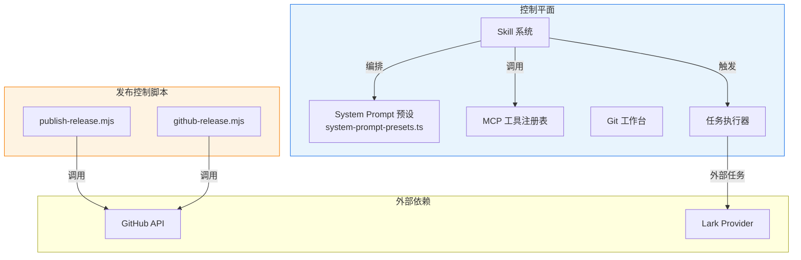
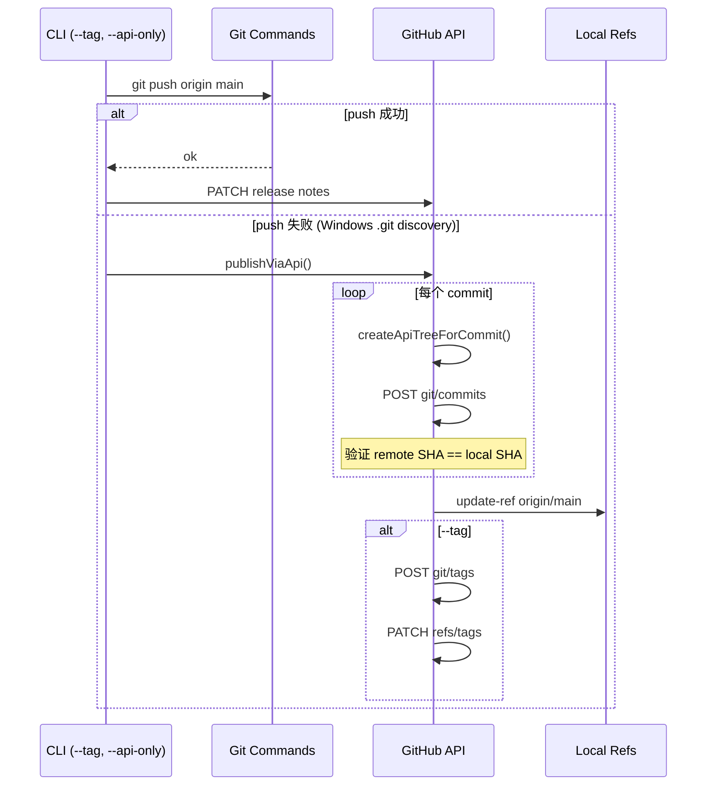

# 控制平面组件设计

<cite>
**本文引用的文件**
- [skills/tech-cc-hub-release-deploy/scripts/publish-release.mjs](file://skills/tech-cc-hub-release-deploy/scripts/publish-release.mjs)
- [scripts/github-release.mjs](file://scripts/github-release.mjs)
- [src/electron/libs/system-prompt-presets.ts](file://src/electron/libs/system-prompt-presets.ts)
- [skills/tech-cc-hub-release-deploy/SKILL.md](file://skills/tech-cc-hub-release-deploy/SKILL.md)
- [skills/tech-cc-hub-release-deploy/agents/openai.yaml](file://skills/tech-cc-hub-release-deploy/agents/openai.yaml)
- [pro-workflow/skills/wiki-research-loop/scripts/research-loop.js](file://pro-workflow/skills/wiki-research-loop/scripts/research-loop.js)
- [src/electron/libs/git/README.md](file://src/electron/libs/git/README.md)
- [src/electron/libs/mcp-tools/README.md](file://src/electron/libs/mcp-tools/README.md)
- [src/electron/libs/task/README.md](file://src/electron/libs/task/README.md)
</cite>

## 目录

- [概览](#概览)
- [控制平面架构总览](#控制平面架构总览)
- [Skill 系统与编排层](#skill-系统与编排层)
- [MCP 工具边界](#mcp-工具边界)
- [Git 工作台边界](#git-工作台边界)
- [任务执行边界](#任务执行边界)
- [System Prompt 预设](#system-prompt-预设)
- [发布控制脚本链](#发布控制脚本链)
- [失败模式与排障](#失败模式与排障)
- [扩展点](#扩展点)

---

## 概览

控制平面负责协调 `tech-cc-hub` 的智能能力编排、任务调度和发布运维三大职责。与执行平面（BrowserView、编辑器集成）不同，控制平面不直接操作 UI，而是通过 Skill、MCP 工具、IPC 和 System Prompt 预设影响 Agent 行为。

### 设计原则

1. **边界清晰**：每个控制组件有明确职责，禁止跨边界直接操作
2. **单向依赖**：Renderer → IPC → Main Process → External Service
3. **可审计**：高影响操作写入 operation-log
4. **幂等优先**：发布脚本支持 `--retag`、`--api-only` 等容错标志

[章节来源](file://src/electron/libs/git/README.md#L1-L5)

---

## 控制平面架构总览



**图表来源**：综合 `SKILL.md`、`system-prompt-presets.ts` 和 `task/README.md` 的模块边界定义

---

## Skill 系统与编排层

### 职责

Skill 是控制平面的顶层编排单元。每个 Skill 定义一组标准操作，Agent 根据场景选择匹配 Skill 执行。

### 核心文件

| 文件 | 职责 |
|------|------|
| `SKILL.md` | Skill 元数据、默认流程、已知错误处理 |
| `agents/openai.yaml` | Skill 接口定义（display_name、short_description） |

### 发布部署 Skill 示例

```yaml
# skills/tech-cc-hub-release-deploy/agents/openai.yaml
interface:
  display_name: "tech-cc-hub 发布部署"
  short_description: "提交、推送、移动 tag、打包并更新 tech-cc-hub 的 GitHub Release。"
```

### 默认执行流程

1. **确认范围**：`git status --short --branch` + `git diff --stat`
2. **验证**：UI 改动跑 `npx eslint`，发布构建跑 `npm run package:win`
3. **提交**：按 `AGENTS.md` Lore trailer 风格写 commit message
4. **推送**：优先使用 `publish-release.mjs`（自动处理 Windows git push 失败）
5. **发布说明**：传入 `--notes` 更新 GitHub Release body

[章节来源](file://skills/tech-cc-hub-release-deploy/SKILL.md#L1-L50)

---

## MCP 工具边界

### 设计目标

MCP 工具目录集中存放暴露给 Agent 的内置工具，避免 `libs` 根目录膨胀。

### 工具清单

| 工具文件 | 能力范围 |
|----------|----------|
| `browser.ts` | BrowserView 工作台：导航、截图摘要、DOM 查询、样式检查 |
| `design.ts` | 截图语义分析、对比、diff 图、热点区域、JSON report |
| `figma-rest.ts` | Figma PAT 只读：文件/节点读取、token 提取、Dev Resources |
| `admin.ts` | 全局配置写入 `agent-runtime.json`（env、skillCredentials） |

### 审阅重点

- 每个工具应有明确 host 边界，不直接操作 React UI
- 返回内容尽量是摘要、路径、结构化 JSON
- 涉及写入的工具必须有字段 allowlist 和体积上限

### 默认触发条件

```markdown
- 用户给出截图、Figma 图，要求生成/修改 UI 代码
- 用户反馈页面和参考图不一致
- 单张截图先走 `design_inspect_image` 做语义摘要
- 后续轮次用 `design_list_artifacts` 找回证据
```

[章节来源](file://src/electron/libs/mcp-tools/README.md#L1-L23)

---

## Git 工作台边界

### 模块边界

```text
src/electron/libs/git/
├── types.ts       # 领域类型和 IPC payload/result
├── errors.ts      # Git 错误归一化
├── service.ts     # 唯一 Git 操作入口
├── history.ts     # commit history parser
├── graph.ts       # lightweight graph lane 生成
├── operation-log.ts   # 高影响操作日志
├── ipc.ts         # Electron IPC handler 注册
└── index.ts       # 对外统一出口
```

### 第一版允许的操作

- status / diff
- stage / unstage
- commit
- ordinary push
- create / checkout branch
- stash save / apply / drop
- recent history / lightweight graph

### 第一版禁止的操作

- reset、rebase、cherry-pick
- force push、amend、squash
- interactive rebase

> **Renderer 只能通过 IPC 调用**，不直接执行 git。

[章节来源](file://src/electron/libs/git/README.md#L1-L35)

---

## 任务执行边界

### 模块边界

```text
src/electron/libs/task/
├── types.ts           # 任务、执行记录、IPC payload 领域类型
├── provider-registry.ts   # Provider 注册表和 fallback provider
├── providers/         # 外部任务源适配器（如 Lark）
├── repository.ts      # SQLite schema、任务状态、执行记录持久化
├── workflow.ts        # Symphony-style workflow 配置
├── workspace.ts       # 独立 workspace 创建和路径安全
├── executor.ts        # 编排器：同步、自动执行、并发控制、重试、恢复
└── index.ts           # 对外统一出口
```

### 运行原则

| 原则 | 说明 |
|------|------|
| 外部 provider 职责 | 只负责把第三方任务映射成 `ExternalTask`，不直接改 UI 或会话 |
| Repository 职责 | 只做持久化，不启动 runner |
| Executor 职责 | 唯一调度入口，所有自动/手动执行都经过这里 |
| Workspace 隔离 | 每个任务使用独立 workspace，避免互相污染 |
| 数据策略 | 旧任务库数据允许丢弃，schema 变化优先保持代码简单 |

[章节来源](file://src/electron/libs/task/README.md#L1-L23)

---

## System Prompt 预设

### 预设构建函数

`system-prompt-presets.ts` 提供多个独立的 prompt 追加函数：

| 函数 | 用途 |
|------|------|
| `buildBrowserWorkbenchPromptAppend()` | BrowserView 工作台规则 |
| `buildAdminConfigPromptAppend()` | agent-runtime.json 写入规范 |
| `buildToolCallOptimizationPromptAppend()` | 工具调用节流策略 |
| `buildFeishuDocumentFetchPromptAppend()` | 飞书文档直读（依赖 LARK_CLI_COMMAND/PROFILE） |
| `buildGlobalRuntimeSystemPromptExtAppend()` | 全局 systemPromptExt 注入 |
| `buildBuiltinMcpRegistryPromptAppend()` | 内置 MCP 工具提示 |
| `buildDesignParityPromptAppend()` | 设计还原规则 |

### Prompt 来源注册

```typescript
export function buildTechCCHubSystemPromptSources(): PromptLedgerSource[] {
  return [
    { id: "tech-cc-hub-browser-preset", label: "...", sourceKind: "system", text: buildBrowserWorkbenchPromptAppend() },
    { id: "tech-cc-hub-admin-preset", label: "...", sourceKind: "system", text: buildAdminConfigPromptAppend() },
    { id: "tech-cc-hub-tool-policy-preset", label: "...", sourceKind: "system", text: buildToolCallOptimizationPromptAppend() },
    { id: "tech-cc-hub-design-preset", label: "...", sourceKind: "system", text: buildDesignParityPromptAppend() },
    { id: "tech-cc-hub-builtin-mcp-registry-preset", label: "...", sourceKind: "system", text: buildBuiltinMcpRegistryPromptAppend() },
    { id: "tech-cc-hub-claude-code-2139-preset", label: "...", sourceKind: "system", text: buildClaudeCode2139FeaturePromptAppend() },
  ];
}
```

[章节来源](file://src/electron/libs/system-prompt-presets.ts#L136-L175)

---

## 发布控制脚本链

### 脚本对比

| 脚本 | 入口 | 核心功能 |
|------|------|----------|
| `publish-release.mjs` | `skills/tech-cc-hub-release-deploy/scripts/` | Windows 友好的 git push 失败兜底、GitHub API fallback |
| `github-release.mjs` | `scripts/` | version bump、tag 创建、GitHub Release API 更新 |

### `publish-release.mjs` 调用链



**图表来源**：`publish-release.mjs` 第 251-352 行

### 关键参数

```bash
# 只推 HEAD 到 origin/main
node skills/tech-cc-hub-release-deploy/scripts/publish-release.mjs

# 使用 GitHub API fallback（git push 失败时）
node skills/tech-cc-hub-release-deploy/scripts/publish-release.mjs --api-only

# 移动 release tag
node skills/tech-cc-hub-release-deploy/scripts/publish-release.mjs --tag v0.1.13 --retag --delete-release

# 只更新发布说明
node skills/tech-cc-hub-release-deploy/scripts/publish-release.mjs --tag v0.1.13 --notes .tmp/release-notes.md --notes-only
```

### Token 获取顺序

```
GH_TOKEN → GITHUB_TOKEN → git credential fill
```

[章节来源](file://skills/tech-cc-hub-release-deploy/scripts/publish-release.mjs#L75-L85)

---

## 失败模式与排障

### 已知失败模式

| 场景 | 检测方式 | 解决方式 |
|------|----------|----------|
| Windows git push `.git` discovery 失败 | stderr 包含 `not a git repository` | 加 `--api-only` |
| origin/main 不是 HEAD 祖先 | `merge-base != remoteHead` | 先 fetch/rebase |
| 非线性提交历史 | `readSingleParent` 返回 parent 数 ≠ 1 | 使用普通 push 或 rebase |
| tag 已存在 | GET `/repos/.../git/ref/tags/{tag}` 返回 200 | 加 `--retag` 强制移动 |
| GitHub API tree SHA 不一致 | `assertCleanApiTree` 失败 | 检查本地 commit 是否被修改 |

### API fallback 后验证

```bash
git rev-parse HEAD
git rev-parse origin/main
git ls-remote --heads origin main
```

三者应指向同一 commit SHA。

### research-loop 停止条件

| 条件 | 处理 |
|------|------|
| `~/.pro-workflow/STOP` 文件存在 | 立即 abort |
| `queue-empty` | 所有 seed 已处理完毕 |
| `budget` 超限 | 累计 cost > `WIKI_LOOP_BUDGET_USD` |
| `converged` | 连续 3 次 novelty < 0.05 |

[章节来源](file://pro-workflow/skills/wiki-research-loop/scripts/research-loop.js#L162-L254)

---

## 扩展点

### 1. 新增 MCP 工具

在 `src/electron/libs/mcp-tools/` 下新建文件：

```typescript
// src/electron/libs/mcp-tools/new-tool.ts
export const newToolSchema = { ... };
export async function newToolHandler(args) { ... }
```

### 2. 新增 Prompt 预设

```typescript
// src/electron/libs/system-prompt-presets.ts
export function buildNewPresetPromptAppend(): string {
  return ["规则1", "规则2"].join("\n");
}
```

然后在 `buildTechCCHubSystemPromptSources()` 中注册。

### 3. 新增 Task Provider

```text
src/electron/libs/task/providers/
├── lark.ts        # 已有
└── new-provider.ts   # 新增
```

Provider 只需实现 `ExternalTask` 映射，不操作 UI。

### 4. 新增发布脚本能力

在 `publish-release.mjs` 的 `createApiTreeForCommit()` 后追加自定义步骤，或在 `github-release.mjs` 的 `upsertGithubRelease()` 中扩展 release body 模板。

---

## 数据结构速查

### publish-release.mjs 核心类型

```typescript
interface ChangeEntry {
  status: "A" | "D" | "M" | "R" | "C";
  filePath: string;
}

interface TreeResult {
  sha: string;
  entryCount: number;
  blobCount: number;
}
```

### research-loop 核心类型

```typescript
interface Seed {
  id: number;
  wiki_slug: string;
  query: string;
  parent_id: number | null;
  depth: number;
  status: "pending" | "active" | "done" | "failed";
}

interface CompiledPage {
  content: string;
  claims: { text: string; source: string }[];
  novelty: number;  // 0-1，值越大越新颖
}
```

### System Prompt 预设类型

```typescript
interface PromptLedgerSource {
  id: string;
  label: string;
  sourceKind: "system" | "user" | "skill";
  text: string;
}
```

---

## 快速导航

| 模块 | 入口文件 | 关键配置 |
|------|----------|----------|
| Skill 编排 | `SKILL.md` | 默认流程、命令参数 |
| 发布脚本 | `publish-release.mjs` | `GH_TOKEN` 环境变量 |
| Git 工作台 | `git/index.ts` | IPC channel 定义 |
| MCP 工具 | `mcp-tools/browser.ts` 等 | `admin.ts` 写入 allowlist |
| 任务执行 | `task/executor.ts` | `workflow.ts` 重试参数 |
| Prompt 预设 | `system-prompt-presets.ts` | `buildTechCCHubSystemPromptSources()` |