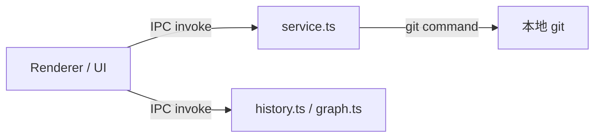
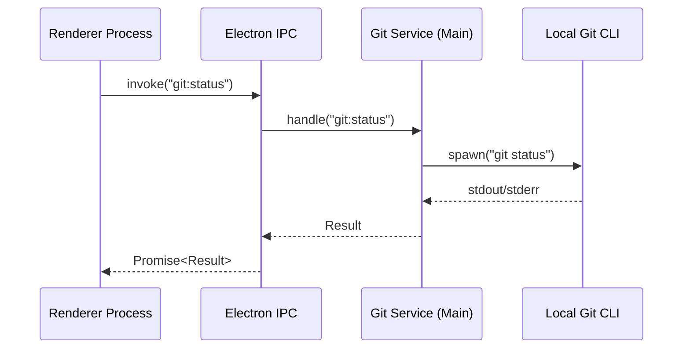

# 故障排除和最佳实践

<cite>
**本文引用的文件**
- [README.md](file://README.md)
- [scripts/after-pack-win-icon.cjs](file://scripts/after-pack-win-icon.cjs)
- [scripts/codex-oauth-setup.mjs](file://scripts/codex-oauth-setup.mjs)
- [scripts/dev-electron.mjs](file://scripts/dev-electron.mjs)
- [test/electron/tsconfig.json](file://test/electron/tsconfig.json)
- [test/electron/activity-rail-dual-steps.test.ts](file://test/electron/activity-rail-dual-steps.test.ts)
- [test/electron/activity-rail-model.test.ts](file://test/electron/activity-rail-model.test.ts)
- [src/electron/libs/git/README.md](file://src/electron/libs/git/README.md)
- [src/electron/libs/mcp-tools/README.md](file://src/electron/libs/mcp-tools/README.md)
</cite>

# 故障排除和最佳实践

## 目录

- [开发环境启动失败](#开发环境启动失败)
- [模型路由与 API 连接](#模型路由与-api-连接)
- [任务系统常见问题](#任务系统常见问题)
- [Electron 主进程调试](#electron-主进程调试)
- [前端 UI 与 React 模块](#前端-ui-与-react-模块)
- [MCP 工具调用异常](#mcp-工具调用异常)
- [Activity Rail 模型验证](#activity-rail-模型验证)
- [打包与签名问题](#打包与签名问题)
- [Git 工作台 IPC 边界](#git-工作台-ipc-边界)
- [工程最佳实践清单](#工程最佳实践清单)

---

## 开发环境启动失败

### 症状：npm run dev 卡住或报错

**常见原因及排查路径**

1. **Electron 主进程启动失败**
   - 检查 `scripts/dev-electron.mjs` 是否能单独执行
   - macOS 首次启动会验证代码签名：`verifyCodesign()` 在 `file://scripts/dev-electron.mjs#L34-L41`
   - 签名失败时会抛出 `Prepared Electron.app did not pass codesign verification` 错误
   - 修复：运行 `codesign --force --deep --sign - <path-to-Electron.app>`

2. **signed Electron.app 缓存问题**
   - macOS 下 `prepareMacElectronDist()` 会将签名 app 缓存到 `~/Library/Caches/tech-cc-hub/electron-{version}-dist`
   - 缓存路径逻辑在 `file://scripts/dev-electron.mjs#L89`
   - 若签名缓存损坏，删掉该目录重新触发

3. **端口占用**
   - Vite 默认 5173 端口被占用
   - 用 `lsof -i :5173` 检查后 `kill` 相关进程

4. **Electron 未安装或版本不匹配**
   ```bash
   npm run rebuild  # 重建原生依赖
   ```
   - 确认 `package.json` 中 `electron` 版本与 `node_modules/electron` 一致

### 症状：npm run qa:smoke 启动后立即退出

检查 Electron 是否能正常加载 preload 和 BrowserView。

章节来源：`file://scripts/dev-electron.mjs#L126-L136`

---

## 模型路由与 API 连接

### 503 No available channel for model

**根因**：小模型 / 后台模型槽位配置的模型名在网关中不存在。

**排查步骤**

1. 打开设置页 → AI接口 → 检查「小模型 / 后台模型」槽位
2. 确认该模型在 `new-api` 或其他兼容网关中已启用
3. 网关日志中搜索该模型名，确认 channel 可用

> 这个错误通常发生在 Claude Code 内部调用 Haiku 等小模型时，槽位未配置导致请求打到不可用渠道。章节来源：`file://README.md#L132-L136`

### API Error: ConnectionRefused

**检查项**：

| 检查项 | 操作 |
|--------|------|
| 网关进程 | 确认 `new-api` 或兼容网关在监听 |
| 端口配置 | 检查 Base URL 是否为 `http://localhost:5337/v1` |
| Docker 环境 | Windows/macOS Docker 场景使用 `host.docker.internal` 访问宿主机 |
| API Key | 确认网关密钥正确 |

### Codex OAuth 配置异常

`scripts/codex-oauth-setup.mjs` 负责从官方 Codex 导入凭证。

**凭证路径**：
- Linux/macOS：`~/.codex/auth.json`
- 可通过 `CODEX_HOME` 环境变量覆盖

**配置文件路径**：
- Windows：`%APPDATA%/tech-cc-hub/api-config.json`
- macOS：`~/Library/Application Support/tech-cc-hub/api-config.json`
- Linux：`~/.config/tech-cc-hub/api-config.json`

逻辑在 `file://scripts/codex-oauth-setup.mjs#L56-L70`

**常见失败**：
- `codex login` 未完成 → 脚本会阻塞等待浏览器登录完成
- auth.json 格式异常 → `codexAuthToCredential()` 会遍历多个 candidate 字段，参见 `file://scripts/codex-oauth-setup.mjs#L154-L203`
- 凭证过期 → `normalizeExpiry()` 解析多种过期时间格式

---

## 任务系统常见问题

### 飞书任务同步不到

**检查清单**：

1. Lark CLI 已登录：`codex login` 对应飞书同理，需要 `lark` CLI 完成认证
2. 应用权限包含：
   - `task:task:read`
   - `task:task:write`
   - `task:tasklist:read`
3. 同步范围：最近 30 天内的任务会被拉取

> 章节来源：`file://README.md#L111-L112` 和 `file://README.md#L184`

### 任务一直执行中

**原因**：Executor 调度卡住，通常由网络中断或模型超时引起。

**排查路径**：

1. 查看任务详情右侧时间线，确认卡在哪个步骤
2. 重启 App，Executor 会按 workflow 配置恢复或重试卡住的执行
3. 检查模型网关是否响应正常
4. 查看任务产物列表，确认执行产物是否完整

> 章节来源：`file://README.md#L114`

### 任务删除行为

删除按钮**只删除本地任务面板记录**，不删除飞书原始任务。

> 章节来源：`file://README.md#L115`

---

## Electron 主进程调试

### 主进程入口与日志

- 主进程入口：`src/electron/main.ts`
- preload 桥：`src/electron/preload.ts`
- IPC handler 注册在 `src/electron/libs/` 各模块的 `ipc.ts` 中

### BrowserView 浮在主界面

这是已知的布局问题，排查优先级：

1. **检查 BrowserView 销毁逻辑**：确认路由切换时正确销毁 BrowserView 实例
2. **不要简单禁用右侧浏览器入口**，应检查页面生命周期

> 章节来源：`file://README.md#L186`

### Git 工作台 IPC 边界

Git 模块不允许 Renderer 直接执行 git 命令，边界定义在 `file://src/electron/libs/git/README.md#L4`：



第一版允许的操作：status/diff、stage/unstage、commit、push、create/checkout branch、stash save/apply/drop、recent history、lightweight graph。

第一版禁止：reset、rebase、cherry-pick、force push、amend、squash、interactive rebase。

> 章节来源：`file://src/electron/libs/git/README.md#L16-L34`

---

## 前端 UI 与 React 模块

### Activity Rail 模型验证

`buildActivityRailModel` 是核心数据转换函数，接收会话消息数组，返回可视化模型。

**验证路径**：

```bash
npm run build  # 先确保类型正确
node --test test/electron/activity-rail-model.test.ts
```

**模型输出结构**（参考 `file://test/electron/activity-rail-model.test.ts`）：

| 字段 | 说明 |
|------|------|
| `planSteps` | 计划步骤，从 assistant 消息的 text content 解析 |
| `executionSteps` | 执行步骤，对应 tool_use 事件 |
| `taskSteps` | 任务步骤，从 planSteps 映射而来 |
| `promptAnalysis` | Prompt 分析，来源 `buildPromptLedgerMessage` |
| `timeline` | 时间线，包含 lifecycle、tool_use、tool_result 等节点 |
| `contextDistribution.buckets` | 上下文分布桶，按 sourceKind 分类 |

**关键断言**（`file://test/electron/activity-rail-dual-steps.test.ts#L124-L128`）：
- `planSteps.length` 和 `executionSteps.length` 可能不同
- `executionSteps[0].planStepIds` 关联到对应 planStep

### Prompt Ledger 测试

`buildPromptLedgerMessage` 将 prompt 来源拆分为多个 bucket，测试覆盖：

- `system` 来源（Claude Code preset）
- `project` 来源（AGENTS.md / CLAUDE.md）
- `skill` 来源（skill 文档）
- `memory` 来源（滚动摘要）
- `history-tool-output` 和 `history-tool-input` 超长内容

> 章节来源：`file://test/electron/activity-rail-model.test.ts#L8-L63`

### Section Labels 验证

Activity Rail 的 UI 区域标题在测试中验证：
- `taskSectionTitle` = "任务步骤"
- `executionSectionTitle` = "步骤汇总"

> 章节来源：`file://test/electron/activity-rail-dual-steps.test.ts#L175-L176`

### 测试 TypeScript 配置

测试使用独立的 tsconfig：`test/electron/tsconfig.json`

关键配置：
- `module: "NodeNext"` 配合 ESM 测试
- `outDir: "../../dist-test"` 与源码 build 隔离
- `types: ["node", "../../types"]` 包含项目自定义类型

> 章节来源：`file://test/electron/tsconfig.json#L1-L18`

---

## MCP 工具调用异常

### 工具概览

| 工具 | 能力 |
|------|------|
| `browser.ts` | 导航、截图摘要、DOM 查询、样式检查、标注模式 |
| `design.ts` | 截图语义分析、两图对比、diff/comparison 图、热点区域、JSON report |
| `figma-rest.ts` | Figma 只读 API：文件/节点读取、设计树、token、Dev Resources |
| `admin.ts` | 写入 `agent-runtime.json` 的 `env` 和 `skillCredentials` |

> 章节来源：`file://src/electron/libs/mcp-tools/README.md#L1-L8`

### 设计工具使用要点

**触发条件**：
- 用户给出截图、Figma 图或页面参考图，要求生成/修改 UI/前端代码
- 用户反馈页面和参考图不一致

**工具调用顺序**：
1. 单张截图先用 `design_inspect_image` 做语义摘要
2. 有候选图后再走截图比照
3. **不要**自己和自己比较同一张图

**高级参数**：
- `ignoreRegions`：动态区域（时间、头像、动画帧、随机内容）
- `maxDifferenceRatio`：验收结论阈值
- `ignoreAntialiasing`：文字抗锯齿噪声多时开启

> 章节来源：`file://src/electron/libs/mcp-tools/README.md#L16-L22`

### 工具审阅要求

1. 每个工具应有明确 host 边界，不直接操作 React UI
2. 返回给模型的内容应是摘要、路径和结构化 JSON，避免大图或密钥明文
3. 写入磁盘或配置的工具必须有字段 allowlist 和体积上限

> 章节来源：`file://src/electron/libs/mcp-tools/README.md#L10-L14`

---

## Activity Rail 模型验证

### 测试运行

```bash
# 运行所有 activity-rail 测试
node --test test/electron/activity-rail-model.test.ts
node --test test/electron/activity-rail-dual-steps.test.ts
```

### 生命周期复用标记

当同一 session 出现重复 init 事件时，Activity Rail 会将第二轮标记为「复用执行环境」而非「初始化执行环境」：

```
init-1 → "初始化执行环境"
init-2 → "复用执行环境" (statusLabel: "已复用")
```

> 章节来源：`file://test/electron/activity-rail-model.test.ts#L165-L213`

### Context Distribution 验证

验证上下文分布是否按 sourceKind 正确分桶：

```typescript
// 断言示例
const distributionLabels = model.contextDistribution.buckets.map((bucket) => bucket.label);
// 期望包含 project、skill、memory 等来源标签
```

> 章节来源：`file://test/electron/activity-rail-model.test.ts#L424-L422`

---

## 打包与签名问题

### Windows 打包后图标未应用

`after-pack-win-icon.cjs` 是 electron-builder 的 afterPack 钩子，只在 win32 平台执行。

**执行条件**：
1. 检测到 `win32` 平台
2. 找到可执行文件（按 `productFilename`、`tech-cc-hub.exe`、`electron.exe` 顺序查找）
3. `build/icon.ico` 存在
4. `node_modules/electron-winstaller/vendor/rcedit.exe` 存在

> 章节来源：`file://scripts/after-pack-win-icon.cjs#L5-L25`

**常见失败**：
- rcedit.exe 缺失：确保 `electron-winstaller` 安装正确
- 图标路径错误：确认 `build/icon.ico` 文件存在
- 权限问题：Windows 打包可能需要管理员权限执行 rcedit

### macOS 代码签名验证

`verifyCodesign()` 使用 `codesign --verify --deep --strict --verbose=2` 验证应用。

签名缓存验证失败会阻止 Electron 启动：

```javascript
if (!verifyCodesign(cacheApp)) {
    throw new Error(`Prepared Electron.app did not pass codesign verification: ${cacheApp}`);
}
```

> 章节来源：`file://scripts/dev-electron.mjs#L103-L105`

### Extended Attributes 清理

macOS 上 `.app` 目录可能携带 `com.apple.FinderInfo`、`com.apple.provenance`、`com.apple.quarantine` 等扩展属性，导致签名失败。

`cleanMacExtendedAttributes()` 会递归清理这些属性：

> 章节来源：`file://scripts/dev-electron.mjs#L55-L69`

---

## Git 工作台 IPC 边界

### 架构约束



### 允许的 Git 操作

| 操作 | 说明 |
|------|------|
| status/diff | 查看工作区状态和差异 |
| stage/unstage | 暂存或取消暂存文件 |
| commit | 提交当前变更 |
| push | 普通推送 |
| branch create/checkout | 分支创建和切换 |
| stash save/apply/drop | stash 管理 |
| history/graph | 最近提交历史和轻量图 |

### 禁止的 Git 操作（第一版）

reset、rebase、cherry-pick、force push、amend、squash、interactive rebase。

> 章节来源：`file://src/electron/libs/git/README.md#L27-L33`

---

## 工程最佳实践清单

### 开发流程标准

参考 `doc/80-operations/development-flow-standards.md`，核心原则：
- 所有 PR 必须通过 lint 检查
- 合并前运行冒烟测试 `npm run qa:smoke`
- Electron 主进程修改后运行 `npm run transpile:electron` 验证

### 代码审查重点

| 模块 | 审阅重点 |
|------|----------|
| `src/electron/libs/mcp-tools/` | host 边界明确、无 UI 直接操作、返回摘要非明文 |
| `src/electron/libs/git/` | 所有操作走 IPC、无 git 直接调用 |
| `scripts/` | 环境变量处理、平台判断、错误传播 |
| `test/electron/` | 断言覆盖关键路径、mock 数据真实 |

### 测试覆盖建议

- Activity Rail 模型每个字段至少一个断言
- IPC handler 测试错误分支
- MCP 工具测试 allowlist 边界
- Git 模块测试禁止操作被正确拒绝

### 排障速查表

| 现象 | 优先检查 |
|------|----------|
| API 连接失败 | 网关进程、端口、API Key、Docker host.docker.internal |
| 小模型报 503 | 设置页「小模型 / 后台模型」槽位配置 |
| 图片预处理失败 | 图片模型可用性、VLM bridge 健康度 |
| 飞书任务同步失败 | Lark CLI 登录、应用权限 |
| 任务卡住 | 查看时间线、重启 App 触发恢复 |
| BrowserView 浮层 | 检查 BrowserView 销毁逻辑、路由生命周期 |
| Electron 启动失败 (macOS) | 删除缓存目录 ~/Library/Caches/tech-cc-hub/ |
| Windows 图标缺失 | 检查 rcedit.exe 和 build/icon.ico |

> 章节来源：`file://README.md#L177-L186`

---

*本文档适用于 tech-cc-hub v0.1.2，最后更新 2026-05-05。*