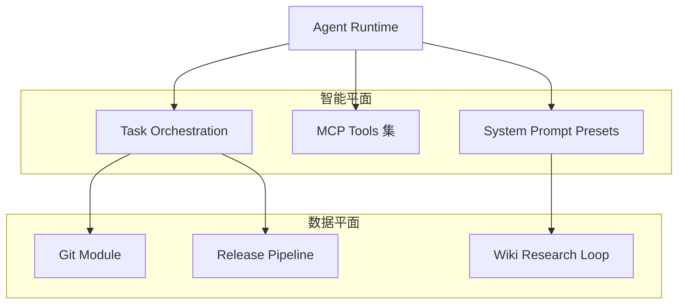
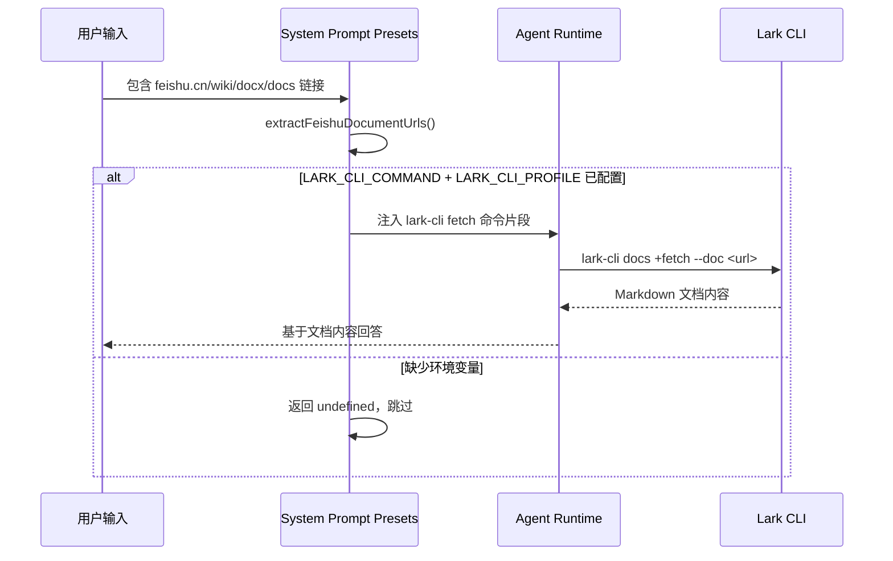
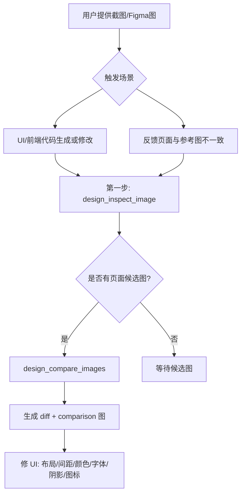
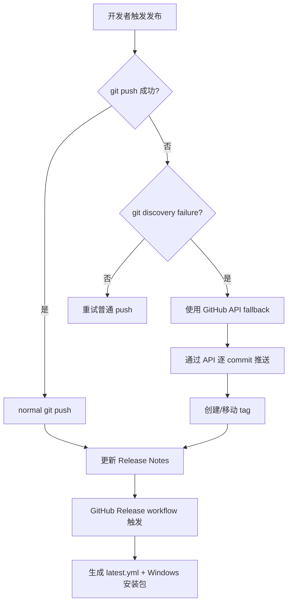
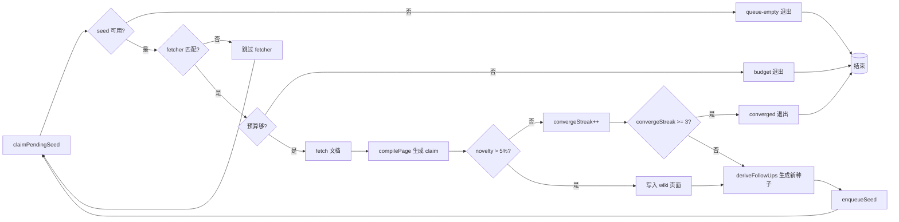
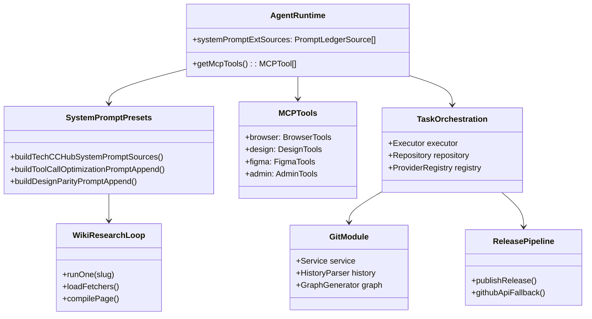

# 数据与智能平面组件设计

<cite>
**本文引用的文件**
- [skills/tech-cc-hub-release-deploy/scripts/publish-release.mjs](file://skills/tech-cc-hub-release-deploy/scripts/publish-release.mjs)
- [scripts/github-release.mjs](file://scripts/github-release.mjs)
- [src/electron/libs/system-prompt-presets.ts](file://src/electron/libs/system-prompt-presets.ts)
- [skills/tech-cc-hub-release-deploy/SKILL.md](file://skills/tech-cc-hub-release-deploy/SKILL.md)
- [skills/tech-cc-hub-release-deploy/agents/openai.yaml](file://skills/tech-cc-hub-release-deploy/agents/openai.yaml)
- [pro-workflow/skills/wiki-research-loop/scripts/research-loop.js](file://pro-workflow/skills/wiki-research-loop/scripts/research-loop.js)
- [src/electron/libs/git/README.md](file://src/electron/libs/git/README.md)
- [src/electron/libs/mcp-tools/README.md](file://src/electron/libs/mcp-tools/README.md)
- [src/electron/libs/task/README.md](file://src/electron/libs/task/README.md)
</cite>

# 数据与智能平面组件设计

## 目录

- [概述](#概述)
- [System Prompt 预设体系](#system-prompt-预设体系)
- [Git 工作台模块](#git-工作台模块)
- [MCP 工具集](#mcp-工具集)
- [任务编排系统](#任务编排系统)
- [发布部署流水线](#发布部署流水线)
- [Wiki 研究循环](#wiki-研究循环)
- [组件间调用关系](#组件间调用关系)
- [扩展点与故障排查](#扩展点与故障排查)

## 概述

数据与智能平面是 `tech-cc-hub` 中连接外部数据源、执行 AI 推理、并驱动下游动作的核心层。它不直接渲染 UI，而是通过 MCP（Model Context Protocol）工具、System Prompt 预设、Git 操作、任务编排等模块为 Agent 提供"眼睛、手、记忆"。

核心组件分布：



来源：[src/electron/libs/system-prompt-presets.ts#L1-L6](file://src/electron/libs/system-prompt-presets.ts#L1-L6)

---

## System Prompt 预设体系

### 职责

`src/electron/libs/system-prompt-presets.ts` 是 Agent 运行时的提示词工厂。它根据不同场景组合系统级提示片段，确保 AI 每次推理时都携带正确的工具策略和边界约束。

### 入口函数

| 函数 | 作用 | 调用时机 |
|------|------|----------|
| `buildBrowserWorkbenchPromptAppend` | 注入浏览器工作台工具策略 | BrowserView 启用时 |
| `buildAdminConfigPromptAppend` | 注入配置治理规则 | 全局运行时 |
| `buildToolCallOptimizationPromptAppend` | 注入工具调用 budget 策略 | 所有推理轮次 |
| `buildDesignParityPromptAppend` | 注入设计还原规则 | UI/前端生成时 |
| `buildFeishuDocumentFetchPromptAppend` | 注入飞书文档直读指令 | 用户输入含飞书链接时 |
| `buildBuiltinMcpRegistryPromptAppend` | 注入内置 MCP 注册表提示 | Agent 启动时 |

### 飞书文档直读流程



来源：[src/electron/libs/system-prompt-presets.ts#L44-L79](file://src/electron/libs/system-prompt-presets.ts#L44-L79)

### PromptLedgerSource 结构

所有预设最终聚合为 `PromptLedgerSource[]` 通过 `buildTechCCHubSystemPromptSources()` 输出。典型结构：

```typescript
{
  id: "tech-cc-hub-design-preset",
  label: "tech-cc-hub 设计还原预设",
  sourceKind: "system",
  text: buildDesignParityPromptAppend()
}
```

来源：[src/electron/libs/system-prompt-presets.ts#L136-L175](file://src/electron/libs/system-prompt-presets.ts#L136-L175)

---

## Git 工作台模块

### 边界定义

`src/electron/libs/git/README.md` 明确了 Git 模块是主进程侧唯一操作入口，Renderer 层必须通过 IPC 调用，禁止直接执行 git 命令。

### 模块结构

| 文件 | 职责 |
|------|------|
| `types.ts` | Git 工作台领域类型和 IPC payload/result |
| `errors.ts` | Git 错误归一化 |
| `service.ts` | 唯一 Git 操作入口 |
| `history.ts` | commit history parser |
| `graph.ts` | lightweight graph lane 生成 |
| `operation-log.ts` | 本地高影响操作日志 |
| `ipc.ts` | Electron IPC handler 注册 |
| `index.ts` | 对外统一出口 |

来源：[src/electron/libs/git/README.md#L1-L14](file://src/electron/libs/git/README.md#L1-L14)

### 第一版能力矩阵

**允许的操作：**
- status / diff
- stage / unstage
- commit
- ordinary push
- create / checkout branch
- stash save / apply / drop
- recent history / lightweight graph

**禁止的操作（第一版）：**
- reset, rebase, cherry-pick, force push, amend, squash, interactive rebase

来源：[src/electron/libs/git/README.md#L16-L34](file://src/electron/libs/git/README.md#L16-L34)

---

## MCP 工具集

### 目录组织

`src/electron/libs/mcp-tools/README.md` 定义了 MCP 工具的集中管理策略，避免 `libs` 根目录膨胀。

### 工具矩阵

| 工具文件 | 能力域 | 典型工具 |
|----------|--------|----------|
| `browser.ts` | 右侧 BrowserView 工作台 | 导航、截图摘要、DOM 查询、样式检查、标注模式 |
| `design.ts` | 截图语义分析与设计还原 | `design_inspect_image`、`design_compare_images`、`design_list_artifacts` |
| `figma-rest.ts` | Figma 只读工具面 | 文件/节点读取、设计系统 playbook、变量提取 |
| `admin.ts` | 受控管理能力 | 写入 `agent-runtime.json` 的 `env`、`skillCredentials` 等 |

来源：[src/electron/libs/mcp-tools/README.md#L1-L21](file://src/electron/libs/mcp-tools/README.md#L1-L21)

### 设计工具触发规则



来源：[src/electron/libs/mcp-tools/README.md#L16-L21](file://src/electron/libs/mcp-tools/README.md#L16-L21)

### 工具审阅要点

1. 每个工具应有明确的 host 边界，不直接操作 React UI
2. 返回给模型的内容应尽量是摘要、路径和结构化 JSON，避免塞入大图或密钥明文
3. 涉及写入磁盘或配置的工具必须有字段 allowlist 和体积上限

来源：[src/electron/libs/mcp-tools/README.md#L10-L14](file://src/electron/libs/mcp-tools/README.md#L10-L14)

---

## 任务编排系统

### 模块边界

`src/electron/libs/task/README.md` 将任务系统主进程代码统一收容，避免 `src/electron/libs` 根目录散落 `task-*` 文件。

### 目录结构

| 文件 | 职责 |
|------|------|
| `types.ts` | 任务、执行记录、IPC payload 的领域类型 |
| `provider-registry.ts` | Provider 注册表和 fallback provider |
| `providers/` | 外部任务源适配器（目前包含 Lark） |
| `repository.ts` | SQLite schema、任务状态、执行记录和日志持久化 |
| `workflow.ts` | Symphony-style workflow 配置、轮询、重试和 stall 默认参数 |
| `workspace.ts` | 每个任务的独立 workspace 创建和路径安全 |
| `executor.ts` | 编排器，负责同步、自动执行、并发控制、重试、恢复和日志事件 |
| `index.ts` | 对外统一出口 |

来源：[src/electron/libs/task/README.md#L1-L14](file://src/electron/libs/task/README.md#L1-L14)

### 运行原则

1. 外部 provider 只负责把第三方任务映射成 `ExternalTask`，不直接改 UI 或会话
2. Repository 只做持久化，不启动 runner
3. **Executor 是唯一调度入口**，所有自动/手动执行都经过这里
4. 任务执行使用独立 workspace，避免多个任务互相污染
5. 旧任务库数据允许丢弃，schema 变化优先保持代码简单

来源：[src/electron/libs/task/README.md#L17-L22](file://src/electron/libs/task/README.md#L17-L22)

---

## 发布部署流水线

### 发布流程图



来源：[skills/tech-cc-hub-release-deploy/SKILL.md#L10-L30](file://skills/tech-cc-hub-release-deploy/SKILL.md#L10-L30)

### publish-release.mjs 核心参数

| 参数 | 作用 | 示例 |
|------|------|------|
| `--tag` | 指定版本 tag | `--tag v0.1.13` |
| `--retag` | 强制移动已有 tag | `--retag` |
| `--delete-release` | 先删除已有 GitHub Release | `--delete-release` |
| `--api-only` | 跳过 git push，纯 API 推送 | `--api-only` |
| `--notes` | 指定 Release Notes 文件路径 | `--notes .tmp/notes.md` |
| `--notes-only` | 仅更新 Release Notes，不推送 | `--notes-only` |

来源：[skills/tech-cc-hub-release-deploy/scripts/publish-release.mjs#L12-L28](file://skills/tech-cc-hub-release-deploy/scripts/publish-release.mjs#L12-L28)

### Token 获取优先级

1. `GH_TOKEN` 环境变量
2. `GITHUB_TOKEN` 环境变量
3. `git credential fill`（通过标准输入协议查询）

来源：[skills/tech-cc-hub-release-deploy/scripts/publish-release.mjs#L74-L85](file://skills/tech-cc-hub-release-deploy/scripts/publish-release.mjs#L74-L85)

### GitHub API Fallback 限制

- **只支持线性提交范围**：远端 `main` 必须是本地 `HEAD` 的祖先
- **逐 commit 推送**：每个 commit 单独创建 blob → tree → commit
- **完整性校验**：每个 commit 的 tree SHA 必须与本地完全一致，否则 abort
- **author/committer 透传**：保留原始提交者信息

来源：[skills/tech-cc-hub-release-deploy/scripts/publish-release.mjs#L187-L306](file://skills/tech-cc-hub-release-deploy/scripts/publish-release.mjs#L187-L306)

---

## Wiki 研究循环

### 概述

`pro-workflow/skills/wiki-research-loop/scripts/research-loop.js` 是自动化知识库构建工具。它从种子问题出发，通过多个 fetcher（web、arxiv、github）抓取文档，提取 claim，生成结构化 wiki 页面，并基于新页面的实体词衍生下一轮种子。

### 核心命令

| 命令 | 作用 | 参数 |
|------|------|------|
| `run <slug>` | 执行研究循环 | `--max-pages`、`--max-depth`、`--budget-usd`、`--fetchers` |
| `seed <slug> "<query>"` | 添加研究种子 | `--depth`、`--parent-id` |
| `seeds <slug>` | 列出种子队列 | `--status` |
| `cancel <slug>` | 取消所有 pending/active 种子 | 无 |
| `status` | 全局 kill-switch 和各 wiki 状态 | 无 |

来源：[pro-workflow/skills/wiki-research-loop/scripts/research-loop.js#L344-L351](file://pro-workflow/skills/wiki-research-loop/scripts/research-loop.js#L344-L351)

### 研究循环流程



来源：[pro-workflow/skills/wiki-research-loop/scripts/research-loop.js#L196-L268](file://pro-workflow/skills/wiki-research-loop/scripts/research-loop.js#L196-L268)

### 配置方式（wiki.config.md）

```yaml
auto_research:
  enabled: true
  fetchers: [web, arxiv, github]
  max_pages_per_run: 5
  max_depth: 3
  budget_usd: 0.50
```

来源：[pro-workflow/skills/wiki-research-loop/scripts/research-loop.js#L58-L81](file://pro-workflow/skills/wiki-research-loop/scripts/research-loop.js#L58-L81)

---

## 组件间调用关系



---

## 扩展点与故障排查

### 扩展点 1：新增 MCP 工具

1. 在 `src/electron/libs/mcp-tools/` 下创建新文件（如 `custom.ts`）
2. 实现工具函数，遵循摘要/路径/结构化 JSON 返回原则
3. 在 `index.ts` 中导出并注册到工具注册表

### 扩展点 2：新增 System Prompt 预设

1. 在 `src/electron/libs/system-prompt-presets.ts` 添加构建函数
2. 在 `buildTechCCHubSystemPromptSources()` 中添加 `PromptLedgerSource` 条目
3. 更新 Agent 启动逻辑以调用新预设

### 扩展点 3：新增任务 Provider

1. 在 `src/electron/libs/task/providers/` 下创建适配器
2. 实现 `ExternalTask` 接口映射第三方任务
3. 注册到 `ProviderRegistry`

### 常见故障排查

| 症状 | 可能原因 | 解决方案 |
|------|----------|----------|
| `fatal: not a git repository` | Windows git push 发现失败 | 使用 `--api-only` 强制 API fallback |
| GitHub API tree mismatch | 远端 commit 树 SHA 与本地不一致 | 先 fetch/rebase，再重新发布 |
| 飞书文档直读失败 | 缺少 `LARK_CLI_COMMAND` 或 `LARK_CLI_PROFILE` 环境变量 | 配置环境变量或跳过直读 |
| Wiki research 预算耗尽 | `budget_usd` 配置过低 | 增加 `budget_usd` 或减少 `max_pages` |
| MCP 工具无响应 | BrowserView 未初始化 | 检查 `tech-cc-hub-browser-preset` 是否注入 |

### 验证命令

```powershell
# 验证 git push 同步状态
git rev-parse HEAD
git rev-parse origin/main
git ls-remote --heads origin main

# 验证 token 可用
node -e "console.log(process.env.GH_TOKEN || process.env.GITHUB_TOKEN || 'MISSING')"
```

来源：[skills/tech-cc-hub-release-deploy/SKILL.md#L74-L80](file://skills/tech-cc-hub-release-deploy/SKILL.md#L74-L80)